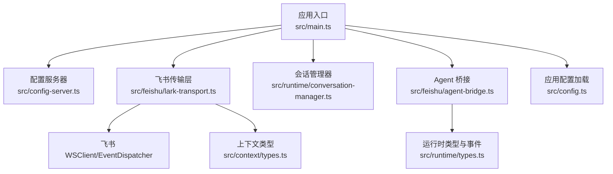
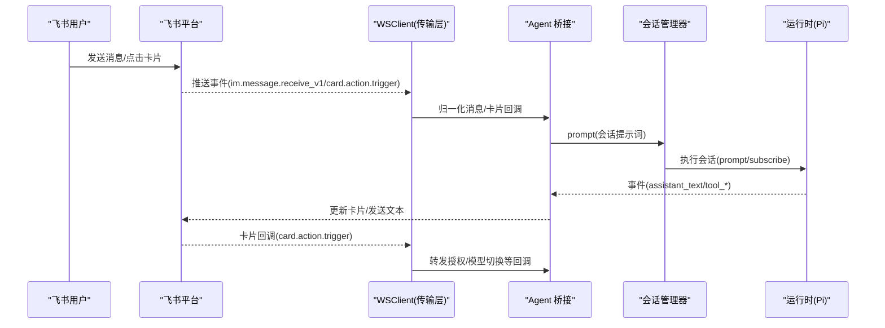
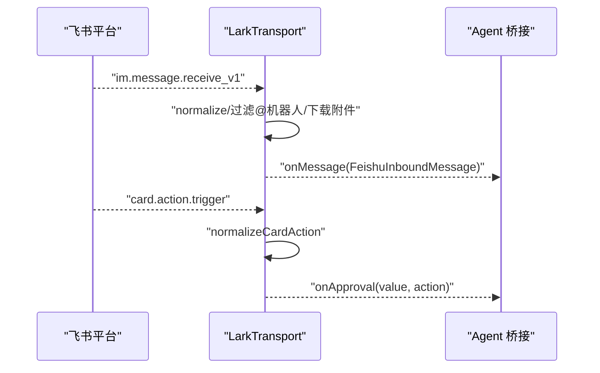
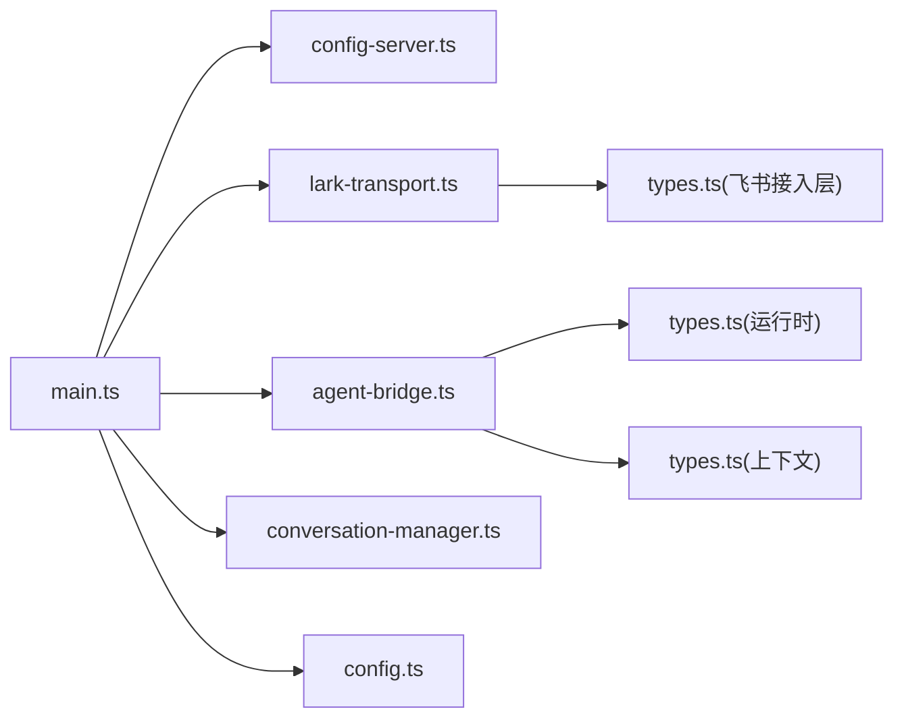

# API 参考文档

<cite>
**本文引用的文件列表**
- [main.ts](file://src/main.ts)
- [config-server.ts](file://src/config-server.ts)
- [lark-transport.ts](file://src/feishu/lark-transport.ts)
- [types.ts（飞书接入层）](file://src/feishu/types.ts)
- [agent-bridge.ts](file://src/feishu/agent-bridge.ts)
- [conversation-manager.ts](file://src/runtime/conversation-manager.ts)
- [types.ts（运行时）](file://src/runtime/types.ts)
- [types.ts（上下文）](file://src/context/types.ts)
- [config.ts](file://src/config.ts)
- [package.json](file://package.json)
</cite>

## 目录
1. [简介](#简介)
2. [项目结构](#项目结构)
3. [核心组件](#核心组件)
4. [架构总览](#架构总览)
5. [接口规范](#接口规范)
   - [HTTP 配置与统计接口](#http-配置与统计接口)
   - [WebSocket 事件接口（飞书长连接）](#websocket-事件接口飞书长连接)
   - [内部 IPC 接口（进程内模块调用）](#内部-ipc-接口进程内模块调用)
6. [详细组件分析](#详细组件分析)
7. [依赖关系分析](#依赖关系分析)
8. [性能与限流](#性能与限流)
9. [错误码与状态码说明](#错误码与状态码说明)
10. [安全与认证](#安全与认证)
11. [故障排查指南](#故障排查指南)
12. [结论](#结论)

## 简介
本 API 参考文档面向开发者，覆盖本项目的三类接口：
- HTTP 接口：本地配置页面与技能使用统计的 RESTful 接口。
- WebSocket 接口：基于飞书官方 SDK 的长连接事件订阅与卡片回调处理。
- 内部 IPC 接口：进程内模块之间的方法调用契约（会话管理、传输层、运行时等）。

文档包含请求/响应格式、错误码定义、状态码说明、示例调用、参数说明、返回值格式、版本兼容性、限流策略与安全认证机制，帮助快速集成与排障。

## 项目结构
本项目以 Node.js + TypeScript 实现，核心入口为 src/main.ts，启动时加载配置、初始化数据清理、创建飞书客户端、建立 WebSocket 长连接、注册命令与权限策略、启动定时任务，并暴露本地 HTTP 服务用于配置与统计。

图表来源
- [main.ts:27-247](file://src/main.ts#L27-L247)
- [config-server.ts:12-149](file://src/config-server.ts#L12-L149)
- [lark-transport.ts:82-133](file://src/feishu/lark-transport.ts#L82-L133)
- [conversation-manager.ts:22-96](file://src/runtime/conversation-manager.ts#L22-L96)
- [agent-bridge.ts:15-69](file://src/feishu/agent-bridge.ts#L15-L69)
- [types.ts（运行时）:13-67](file://src/runtime/types.ts#L13-L67)
- [types.ts（上下文）:1-11](file://src/context/types.ts#L1-L11)
- [config.ts:24-51](file://src/config.ts#L24-L51)

章节来源
- [main.ts:27-247](file://src/main.ts#L27-L247)
- [package.json:6-12](file://package.json#L6-L12)

## 核心组件
- 配置服务器：提供 / 与 /api/* 路由，监听本机回环地址，仅用于本地配置与统计展示。
- 飞书传输层：基于 WSClient 建立长连接，接收消息与卡片回调，归一化后交给上层处理。
- Agent 桥接：将入站消息转换为 Pi 会话提示词，流式渲染到飞书卡片，支持指令与工具调用动画。
- 会话管理器：维护会话复用、排队执行、打断在途请求、持久化 session 映射。
- 运行时类型：定义会话事件、提示词、配置与最小会话接口。
- 上下文类型：统一用户身份、聊天与会话标识。
- 配置加载：从环境变量读取运行所需配置项。

章节来源
- [config-server.ts:12-149](file://src/config-server.ts#L12-L149)
- [lark-transport.ts:11-80](file://src/feishu/lark-transport.ts#L11-L80)
- [agent-bridge.ts:15-69](file://src/feishu/agent-bridge.ts#L15-L69)
- [conversation-manager.ts:22-96](file://src/runtime/conversation-manager.ts#L22-L96)
- [types.ts（运行时）:13-67](file://src/runtime/types.ts#L13-L67)
- [types.ts（上下文）:1-11](file://src/context/types.ts#L1-L11)
- [config.ts:24-51](file://src/config.ts#L24-L51)

## 架构总览
系统由“外部事件驱动”和“本地 HTTP 服务”两条主线组成：
- 外部事件：飞书通过 WebSocket 推送消息与卡片回调，传输层归一化后交由 Agent 桥接与运行时处理，结果以卡片或文本形式返回。
- 本地 HTTP：提供配置编辑与技能使用统计页面，仅绑定 127.0.0.1，避免外网暴露。

图表来源
- [lark-transport.ts:82-133](file://src/feishu/lark-transport.ts#L82-L133)
- [lark-transport.ts:250-312](file://src/feishu/lark-transport.ts#L250-L312)
- [agent-bridge.ts:71-237](file://src/feishu/agent-bridge.ts#L71-L237)
- [conversation-manager.ts:65-96](file://src/runtime/conversation-manager.ts#L65-L96)

## 接口规范

### HTTP 配置与统计接口
- 服务地址：http://127.0.0.1:3456（仅本机可访问）
- 中间件：JSON 与 URL-encoded 表单解析已启用
- 静态资源：/emojis 目录

#### GET /
- 功能：返回配置页面 HTML
- 请求：无
- 响应：HTML 字符串
- 错误：无

#### GET /api/config
- 功能：读取 .env 并返回键值对
- 请求：无
- 响应体：
  - 成功：对象，键为环境变量名，值为字符串
  - 失败：HTTP 500，文本内容为错误信息
- 注意：仅返回当前 .env 内容，不校验字段

#### POST /api/config
- 功能：保存配置到 .env；未列入受管键集合的现有键会原样保留
- 请求体：对象，键为要写入的环境变量名，值为字符串
- 响应：
  - 成功：文本 "OK"
  - 失败：HTTP 500，文本内容为错误信息
- 受管键集合：FEISHU_APP_ID、FEISHU_APP_SECRET、FEISHU_ADMIN、FEISHU_RANDOM_EMOJIS、FEISHU_PI_MODEL_PROVIDER、FEISHU_PI_MODEL_NAME、FEISHU_PI_MODEL_BASE_URL、FEISHU_PI_MODEL_API_KEY、FEISHU_PI_SYSTEM_PROMPT

#### GET /stats
- 功能：返回技能使用统计页面 HTML
- 请求：无
- 响应：HTML 字符串

#### GET /api/stats/events
- 功能：获取全部技能使用事件与用户展示名映射
- 请求：无
- 响应体：
  - 成功：{ events: 事件数组, users: 展示名映射 }
  - 失败：HTTP 500，{ error: 错误信息 }
- 注意：筛选与聚合由前端完成

示例调用
- 获取配置：GET http://127.0.0.1:3456/api/config
- 保存配置：POST http://127.0.0.1:3456/api/config，Body: { FEISHU_PI_MODEL_NAME: "claude-sonnet-4-6" }
- 查看统计：GET http://127.0.0.1:3456/stats
- 拉取事件：GET http://127.0.0.1:3456/api/stats/events

章节来源
- [config-server.ts:12-149](file://src/config-server.ts#L12-L149)

### WebSocket 事件接口（飞书长连接）
- 协议：基于 @larksuiteoapi/node-sdk 的 WSClient + EventDispatcher
- 事件类型：
  - im.message.receive_v1：普通消息
  - card.action.trigger：卡片按钮回调
- 行为：
  - 消息经 normalize 归一化后，构造 FeishuInboundMessage 并交给上层 handler 后台处理
  - 卡片回调经 normalizeCardAction 处理后，按 action.value 分发（如 tool_approval、forward_approval、switch_model）
  - 所有回调均返回 ACK（toast），避免客户端超时提示

事件与数据结构
- 入站消息（FeishuInboundMessage）：
  - messageId：消息 ID
  - chatId：会话 ID
  - context：FeishuContext（userOpenId、userName、departmentNames、chatId、threadId、conversationId、isAdmin）
  - text：清洗后的文本
  - images：可选图片附件（Uint8Array 与 MIME）
- 回复句柄（FeishuReply）：
  - update(text)：追加增量文本
  - close(text, statsText?)：结束回复并写统计小字
- 传输抽象（FeishuTransport）：
  - connect()：建立连接
  - disconnect()：断开连接
  - onMessage(handler)：注册消息处理器

卡片回调处理
- 授权类回调：tool_approval、forward_approval → 交由 PermissionBroker 在服务端校验（token/chat_id/管理员/decision）
- 模型切换：switch_model → 管理员校验后持久化并更新卡片

示例流程

图表来源
- [lark-transport.ts:82-133](file://src/feishu/lark-transport.ts#L82-L133)
- [lark-transport.ts:250-312](file://src/feishu/lark-transport.ts#L250-L312)
- [types.ts（飞书接入层）:8-39](file://src/feishu/types.ts#L8-L39)

章节来源
- [lark-transport.ts:82-133](file://src/feishu/lark-transport.ts#L82-L133)
- [types.ts（飞书接入层）:8-39](file://src/feishu/types.ts#L8-L39)

### 内部 IPC 接口（进程内模块调用）
以下为进程内模块间的方法签名与职责说明，供扩展与集成参考。

- 会话管理器 ConversationManager
  - prompt(message, onEvent): Promise<Session>
    - 输入：{ conversationId, prompt: { text, images?, context }, context? }
    - 输出：当前会话实例
    - 行为：排队执行、新消息打断在途请求、事件订阅转发
  - getStats(conversationId, context?): Promise<any>
  - clear(conversationId): Promise<void>
  - abort(conversationId): Promise<void>

- 运行时类型 FeishuPiSession
  - subscribe(listener): () => void
  - prompt(input): Promise<void>
  - waitForIdle(): Promise<void>
  - abort(): void
  - getStats(): any
  - getModelName?(): string
  - getContextUsage?(): { tokens, contextWindow, percent } | undefined

- 上下文类型 FeishuContext
  - userOpenId: string
  - userName?: string
  - departmentNames?: string[]
  - chatId: string
  - threadId?: string
  - conversationId: string
  - isAdmin?: boolean

- 传输层 FeishuTransport
  - connect(): Promise<void>
  - disconnect(): Promise<void>
  - onMessage(handler): void

- Agent 桥接 FeishuAgentBridge
  - start(): void
  - handle(message): Promise<void>
  - isDetailMode(chatId): boolean

- 配置加载 loadConfig
  - 返回：FeishuPiAppConfig（含模型、审核、审批超时等）

示例调用
- 会话提示：await conversations.prompt({ conversationId, prompt: { text, images, context } }, onEvent)
- 中断会话：conversations.abort(conversationId)
- 获取统计：const stats = await conversations.getStats(conversationId, context)

章节来源
- [conversation-manager.ts:22-96](file://src/runtime/conversation-manager.ts#L22-L96)
- [types.ts（运行时）:13-67](file://src/runtime/types.ts#L13-L67)
- [types.ts（上下文）:1-11](file://src/context/types.ts#L1-L11)
- [types.ts（飞书接入层）:30-39](file://src/feishu/types.ts#L30-L39)
- [agent-bridge.ts:15-69](file://src/feishu/agent-bridge.ts#L15-L69)
- [config.ts:24-51](file://src/config.ts#L24-L51)

## 详细组件分析

### 配置服务器（HTTP）
- 监听端口：3456
- 绑定地址：127.0.0.1（禁止外网暴露）
- 路由：
  - GET /：返回配置页面
  - GET /api/config：读取 .env
  - POST /api/config：保存 .env（仅受管键会被覆盖）
  - GET /stats：返回统计页面
  - GET /api/stats/events：返回事件与用户映射

错误处理
- 读取/保存失败：HTTP 500，文本或 JSON 错误信息

安全性
- 仅本机访问，避免 App Secret 泄露风险

章节来源
- [config-server.ts:12-149](file://src/config-server.ts#L12-L149)

### 飞书传输层（WebSocket）
- 连接建立：WSClient.start(eventDispatcher)，注册事件处理器
- 消息归一化：normalize(raw, { stripBotMentions, includeRaw })
- 附件处理：图片缓存、文件/音视频下载至本地缓存目录
- 会话模式：p2p/group/topic，影响会话隔离策略
- 卡片回调：normalizeCardAction，区分授权与模型切换
- 卡片更新：优先按 messageId 持久更新，失败回退 token 临时更新

性能与可靠性
- 事件处理 fire-and-forget，避免阻塞 SDK 事件循环
- 重连与错误日志：onReconnecting/onReconnected/onError
- 会话模式缓存减少重复查询

章节来源
- [lark-transport.ts:82-133](file://src/feishu/lark-transport.ts#L82-L133)
- [lark-transport.ts:141-248](file://src/feishu/lark-transport.ts#L141-L248)
- [lark-transport.ts:250-312](file://src/feishu/lark-transport.ts#L250-L312)
- [lark-transport.ts:314-338](file://src/feishu/lark-transport.ts#L314-L338)

### Agent 桥接与会话管理
- 指令处理：/new、/stop、/detail、/perm 等
- 流式渲染：首帧 spinner，真实内容到达后替换正文，工具调用动画显示在小字位置
- 会话队列：同一会话串行执行，新消息打断在途请求
- 统计小字：模型名、累计 token、新增 token、上下文占用、成本、耗时、会话别名

章节来源
- [agent-bridge.ts:71-237](file://src/feishu/agent-bridge.ts#L71-L237)
- [conversation-manager.ts:65-96](file://src/runtime/conversation-manager.ts#L65-L96)

## 依赖关系分析

图表来源
- [main.ts:27-247](file://src/main.ts#L27-L247)
- [config-server.ts:12-149](file://src/config-server.ts#L12-L149)
- [lark-transport.ts:11-80](file://src/feishu/lark-transport.ts#L11-L80)
- [agent-bridge.ts:15-69](file://src/feishu/agent-bridge.ts#L15-L69)
- [conversation-manager.ts:22-96](file://src/runtime/conversation-manager.ts#L22-L96)
- [types.ts（飞书接入层）:8-39](file://src/feishu/types.ts#L8-L39)
- [types.ts（运行时）:13-67](file://src/runtime/types.ts#L13-L67)
- [types.ts（上下文）:1-11](file://src/context/types.ts#L1-L11)
- [config.ts:24-51](file://src/config.ts#L24-L51)

章节来源
- [main.ts:27-247](file://src/main.ts#L27-L247)

## 性能与限流
- 事件处理非阻塞：消息与卡片回调采用 fire-and-forget，避免阻塞 SDK 事件循环
- 会话串行化：ConversationManager 保证同一会话顺序执行，新消息可打断在途请求
- 缓存优化：
  - 用户资料缓存（3 天，空档案 1 天）
  - 会话模式缓存（p2p/group/topic）
  - 图片与文件附件本地缓存
- 限流策略：代码中未实现显式限流器；建议在高并发场景增加令牌桶或滑动窗口限流，保护下游飞书 API 与模型服务

[本节为通用指导，不直接分析具体文件]

## 错误码与状态码说明
- HTTP 状态码
  - 200：成功（配置页面、统计页面、读取/保存配置、统计数据）
  - 500：服务端错误（读取/保存 .env 失败、统计数据读取失败）
- 业务错误
  - 卡片回调超时：若 handler 未返回有效 ACK，客户端可能提示“目标回调服务超时未响应”；本项目通过底层 WSClient 自定义 EventDispatcher 确保返回 toast 进入 ACK
  - 授权失效：服务重启或已处理导致旧授权卡点击被拒绝，就地更新卡片提示
  - 模型切换失败：模型 ID 为空或写入 .env 失败，记录错误日志并更新卡片

章节来源
- [config-server.ts:100-141](file://src/config-server.ts#L100-L141)
- [lark-transport.ts:104-111](file://src/feishu/lark-transport.ts#L104-L111)
- [lark-transport.ts:250-312](file://src/feishu/lark-transport.ts#L250-L312)

## 安全与认证
- 网络访问限制
  - 配置服务器仅监听 127.0.0.1，禁止外网访问，防止 App Secret 泄露
- 认证机制
  - 管理员判定：通过 adminOpenId 比对，控制卡片操作权限（如模型切换）
  - 授权卡回调：PermissionBroker 在服务端校验 approval 存在、token 一致、chat_id 一致、点击者为管理员、decision 合法、未处理过
- 策略与权限
  - 工具调用 Guard：beforeToolCall 钩子结合策略文件（permissions.json）进行风险评估与授权
  - 命令白名单：已废弃，统一迁移至 .agent/permissions.json

章节来源
- [config-server.ts:145-149](file://src/config-server.ts#L145-L149)
- [lark-transport.ts:278-308](file://src/feishu/lark-transport.ts#L278-L308)
- [main.ts:106-169](file://src/main.ts#L106-L169)

## 故障排查指南
- 卡片回调无响应
  - 现象：客户端弹“目标回调服务超时未响应”
  - 排查：确认使用底层 WSClient + EventDispatcher，handler 返回 toast；检查去重逻辑与锁机制
- 授权卡失效
  - 现象：点击旧授权卡被拒绝
  - 排查：服务重启或已处理导致 token/chat_id 不一致；就地更新卡片提示
- 模型切换失败
  - 现象：切换卡片报错或无效
  - 排查：模型 ID 是否为空；.env 写入是否成功；onModelSwitch 是否触发
- 附件下载失败
  - 现象：文件/音视频未保存到本地
  - 排查：filesCacheDir 是否配置；downloadResource 是否抛出异常；文件名是否被 sanitize

章节来源
- [lark-transport.ts:250-312](file://src/feishu/lark-transport.ts#L250-L312)
- [lark-transport.ts:365-372](file://src/feishu/lark-transport.ts#L365-L372)
- [main.ts:134-169](file://src/main.ts#L134-L169)

## 结论
本项目提供了完整的本地 HTTP 配置与统计接口、基于飞书 WebSocket 的事件订阅与卡片回调处理，以及清晰的内部 IPC 契约。通过管理员权限、授权卡与服务端校验保障安全，通过缓存与串行化提升性能。建议在部署时严格限制 HTTP 服务访问范围，并在高并发场景引入显式限流策略，以保护下游服务稳定性。