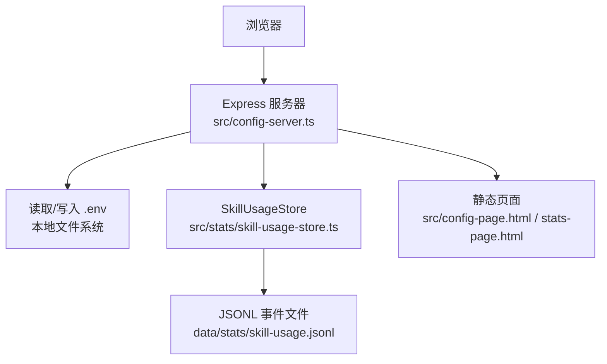
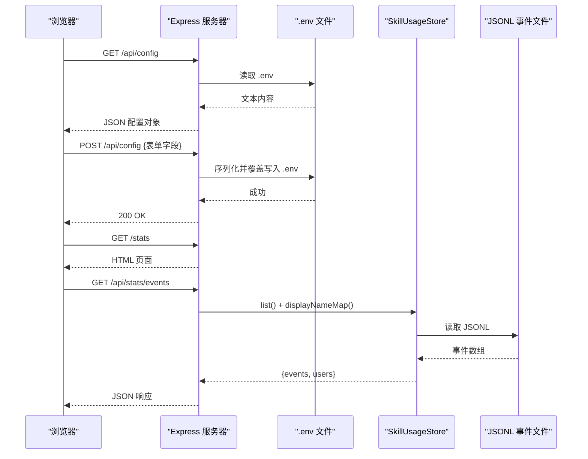
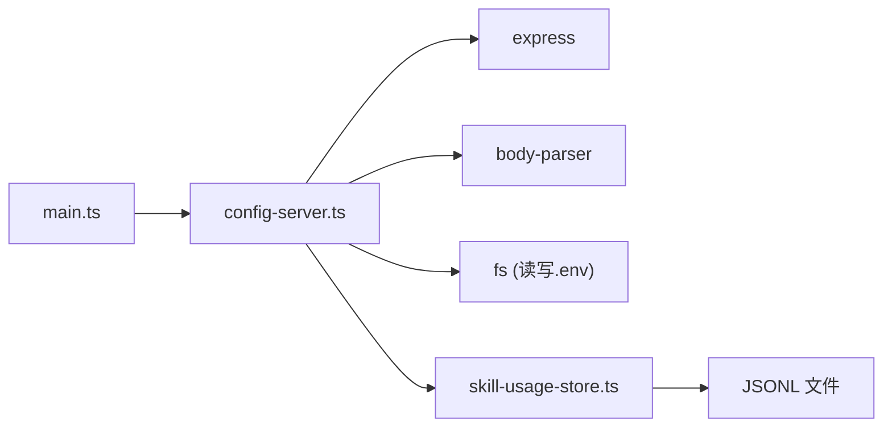

# HTTP API

<cite>
**本文引用的文件**
- [config-server.ts](file://src/config-server.ts)
- [main.ts](file://src/main.ts)
- [config.ts](file://src/config.ts)
- [skill-usage-store.ts](file://src/stats/skill-usage-store.ts)
- [config-page.html](file://src/config-page.html)
- [stats-page.html](file://src/stats-page.html)
- [package.json](file://package.json)
</cite>

## 目录
1. [简介](#简介)
2. [项目结构](#项目结构)
3. [核心组件](#核心组件)
4. [架构总览](#架构总览)
5. [详细接口说明](#详细接口说明)
6. [依赖关系分析](#依赖关系分析)
7. [性能与容量](#性能与容量)
8. [故障排查](#故障排查)
9. [结论](#结论)
10. [附录](#附录)

## 简介
本仓库提供两个基于 Express 的轻量 Web 服务：
- 配置界面：用于在线编辑 .env 中的飞书与模型相关配置，并持久化到本地 .env 文件。
- 数据统计页面：展示技能使用统计（事件流），并提供数据查询接口供前端渲染图表与表格。

所有接口均运行在本地回环地址，默认端口为 3456，仅监听 127.0.0.1，避免暴露到局域网。

## 项目结构
- Web 服务器入口与路由定义位于 src/config-server.ts。
- 主程序在 src/main.ts 中启动运行时，并在启动时注册统计页面的路由。
- 配置读取与校验逻辑在 src/config.ts。
- 统计数据存储与解析在 src/stats/skill-usage-store.ts。
- 前端页面静态资源为 src/config-page.html 与 src/stats-page.html。
- 应用通过 package.json 的脚本启动。

**图示来源**
- [config-server.ts:12-21](file://src/config-server.ts#L12-L21)
- [config-server.ts:95-143](file://src/config-server.ts#L95-L143)
- [skill-usage-store.ts:67-157](file://src/stats/skill-usage-store.ts#L67-L157)

**章节来源**
- [config-server.ts:1-150](file://src/config-server.ts#L1-L150)
- [main.ts:1-20](file://src/main.ts#L1-L20)
- [package.json:6-12](file://package.json#L6-L12)

## 核心组件
- 配置服务器：提供 GET/POST 配置接口、静态页面与表情资源托管。
- 统计服务：以 JSONL 追加写方式记录技能调用事件，支持全量读取与用户展示名映射。
- 主程序：初始化运行时、注册统计路由、管理定时清理与优雅退出。

**章节来源**
- [config-server.ts:12-21](file://src/config-server.ts#L12-L21)
- [config-server.ts:95-143](file://src/config-server.ts#L95-L143)
- [skill-usage-store.ts:67-157](file://src/stats/skill-usage-store.ts#L67-L157)
- [main.ts:171-177](file://src/main.ts#L171-L177)

## 架构总览
配置界面与统计页面均由同一 Express 实例提供服务，统计路由由主程序在运行时注入 SkillUsageStore 实例后注册。

**图示来源**
- [config-server.ts:95-143](file://src/config-server.ts#L95-L143)
- [skill-usage-store.ts:98-140](file://src/stats/skill-usage-store.ts#L98-L140)

## 详细接口说明

### 通用约定
- 基础地址：http://127.0.0.1:3456
- 认证机制：无内置鉴权；服务仅监听本机回环地址，不对外网开放。
- 跨域：未启用 CORS 中间件；由于仅本机访问，通常无需跨域。
- 请求体：配置保存接口使用 application/json。
- 字符编码：UTF-8。
- 错误处理：服务端捕获异常返回 500，并附带错误信息文本或 JSON。

#### 安全与防护
- 绑定地址：127.0.0.1，端口 3456。
- 敏感字段：配置页面中对 App Secret、API Key 等采用密码输入框。
- 权限控制：无后端鉴权，依赖网络隔离（仅本机）。

**章节来源**
- [config-server.ts:146-149](file://src/config-server.ts#L146-L149)
- [config-page.html:51-99](file://src/config-page.html#L51-L99)

---

### 配置页面与接口

#### 获取配置
- 方法：GET
- 路径：/api/config
- 请求参数：无
- 响应体：JSON 对象，键值对形式对应 .env 中的环境变量（字符串值）
- 状态码：
  - 200：成功
  - 500：读取失败，响应体为错误消息文本

示例
- 请求：GET http://127.0.0.1:3456/api/config
- 响应：{"FEISHU_APP_ID":"...","FEISHU_APP_SECRET":"...","FEISHU_ADMIN":"...","FEISHU_PI_MODEL_PROVIDER":"anthropic",...}

**章节来源**
- [config-server.ts:99-108](file://src/config-server.ts#L99-L108)

#### 保存配置
- 方法：POST
- 路径：/api/config
- 请求头：Content-Type: application/json
- 请求体：JSON 对象，包含需要更新的 .env 键值（见“受管键”列表）
- 响应体：纯文本 "OK"
- 状态码：
  - 200：成功
  - 500：保存失败，响应体为错误消息文本

受管键（MANAGED_KEYS）
- FEISHU_APP_ID
- FEISHU_APP_SECRET
- FEISHU_ADMIN
- FEISHU_RANDOM_EMOJIS
- FEISHU_PI_MODEL_PROVIDER
- FEISHU_PI_MODEL_NAME
- FEISHU_PI_MODEL_BASE_URL
- FEISHU_PI_MODEL_API_KEY
- FEISHU_PI_SYSTEM_PROMPT

说明
- 保存时会保留 .env 中不属于上述受管键的其他键（如团队、守卫等），避免被覆盖丢失。
- 保存成功后需重启服务使新配置生效。

示例
- 请求：POST http://127.0.0.1:3456/api/config
- 请求体：{"FEISHU_APP_ID":"...","FEISHU_APP_SECRET":"...","FEISHU_ADMIN":"...","FEISHU_PI_MODEL_PROVIDER":"anthropic","FEISHU_PI_MODEL_NAME":"claude-sonnet-4-6","FEISHU_PI_MODEL_BASE_URL":"https://api.anthropic.com","FEISHU_PI_MODEL_API_KEY":"sk-ant-..."}
- 响应：OK

**章节来源**
- [config-server.ts:41-88](file://src/config-server.ts#L41-L88)
- [config-server.ts:110-120](file://src/config-server.ts#L110-L120)

#### 配置页面
- 方法：GET
- 路径：/
- 响应：HTML 页面（配置表单）
- 状态码：200

**章节来源**
- [config-server.ts:90-97](file://src/config-server.ts#L90-L97)
- [config-page.html:47-128](file://src/config-page.html#L47-L128)

---

### 数据统计页面与接口

#### 统计页面
- 方法：GET
- 路径：/stats
- 响应：HTML 页面（统计看板）
- 状态码：200

**章节来源**
- [config-server.ts:124-131](file://src/config-server.ts#L124-L131)
- [stats-page.html:1-115](file://src/stats-page.html#L1-L115)

#### 获取事件与用户展示名映射
- 方法：GET
- 路径：/api/stats/events
- 请求参数：无
- 响应体：JSON 对象
  - events：技能使用事件数组，每项包含 ts、user、skill、chatId（可选）
  - users：用户展示名映射，key 为 openId，value 为显示名称（英文名 > 中文名 > Open ID）
- 状态码：
  - 200：成功
  - 500：读取失败，响应体为 JSON {"error":"读取统计数据失败：..."}

事件字段说明
- ts：事件时间戳（毫秒）
- user：触发用户的 Open ID
- skill：技能名（技能文件名去扩展名）
- chatId：发生会话标识（可选）

示例
- 请求：GET http://127.0.0.1:3456/api/stats/events
- 响应：{"events":[{"ts":1710000000000,"user":"ou_xxx","skill":"read","chatId":"oc_xxx"},...],"users":{"ou_xxx":"张三"}}

**章节来源**
- [config-server.ts:127-143](file://src/config-server.ts#L127-L143)
- [skill-usage-store.ts:13-23](file://src/stats/skill-usage-store.ts#L13-L23)
- [skill-usage-store.ts:98-140](file://src/stats/skill-usage-store.ts#L98-L140)

---

### 静态资源
- 路径：/emojis/*
- 作用：提供表情图片静态资源，供配置页面选择随机表情时使用
- 状态码：200/404

**章节来源**
- [config-server.ts:20-22](file://src/config-server.ts#L20-L22)
- [config-page.html:160-170](file://src/config-page.html#L160-L170)

## 依赖关系分析
- 配置服务器依赖 Express、body-parser 与 Node.js 文件系统。
- 统计接口依赖 SkillUsageStore，后者维护 JSONL 事件流与用户缓存。
- 主程序负责创建 SkillUsageStore 并注册统计路由。

**图示来源**
- [config-server.ts:5-10](file://src/config-server.ts#L5-L10)
- [config-server.ts:90-143](file://src/config-server.ts#L90-L143)
- [skill-usage-store.ts:67-157](file://src/stats/skill-usage-store.ts#L67-L157)
- [main.ts:171-177](file://src/main.ts#L171-L177)

**章节来源**
- [package.json:14-23](file://package.json#L14-L23)
- [config-server.ts:5-10](file://src/config-server.ts#L5-L10)
- [skill-usage-store.ts:67-157](file://src/stats/skill-usage-store.ts#L67-L157)

## 性能与容量
- 配置读写：直接读写 .env 文件，适合低频配置变更场景。
- 统计事件：采用 JSONL 追加写，内存缓存事件列表，读操作为全量加载；适合中小规模数据。
- 并发：单进程同步 I/O，不适合高并发；作为本地运维工具使用。
- 建议：如需更高吞吐或更大容量，可引入数据库或分片日志。

[本节为通用指导，不直接分析具体文件]

## 故障排查
- 无法访问 /api/config 或 /api/stats/events
  - 确认服务已启动且监听 127.0.0.1:3456
  - 检查是否从本机访问（非局域网/外网）
- 保存配置失败
  - 检查 .env 文件权限与磁盘空间
  - 查看 500 响应中的错误信息
- 统计数据为空
  - 确认事件文件 data/stats/skill-usage.jsonl 是否存在且有内容
  - 检查 SkillUsageStore 是否正确初始化并注册路由
- 页面样式或表情不显示
  - 确认 res/emojis 目录存在且可读
  - 检查 /emojis/* 静态资源路径

**章节来源**
- [config-server.ts:100-120](file://src/config-server.ts#L100-L120)
- [config-server.ts:133-143](file://src/config-server.ts#L133-L143)
- [skill-usage-store.ts:104-120](file://src/stats/skill-usage-store.ts#L104-L120)

## 结论
本项目的 HTTP API 围绕“配置管理”和“技能使用统计”两大场景，提供简洁易用的 RESTful 接口。通过仅监听本机回环的方式保障安全性，配合前端页面实现可视化配置与数据分析。对于生产环境，建议增加鉴权、限流与审计能力，并根据数据规模优化存储与查询。

[本节为总结性内容，不直接分析具体文件]

## 附录

### 启动与运行
- 启动命令：npm start（执行 src/main.ts，同时启动配置服务器）
- 独立启动配置服务器：npm run config（仅启动配置服务器）

**章节来源**
- [package.json:6-12](file://package.json#L6-L12)
- [main.ts:1-3](file://src/main.ts#L1-L3)

### 配置项参考
- 必填：FEISHU_APP_ID、FEISHU_APP_SECRET
- 可选：FEISHU_ADMIN、FEISHU_PI_MODEL_*、FEISHU_PI_SYSTEM_PROMPT、FEISHU_RANDOM_EMOJIS
- 其他：守卫与审核相关变量由主程序加载配置时解析

**章节来源**
- [config.ts:1-51](file://src/config.ts#L1-L51)