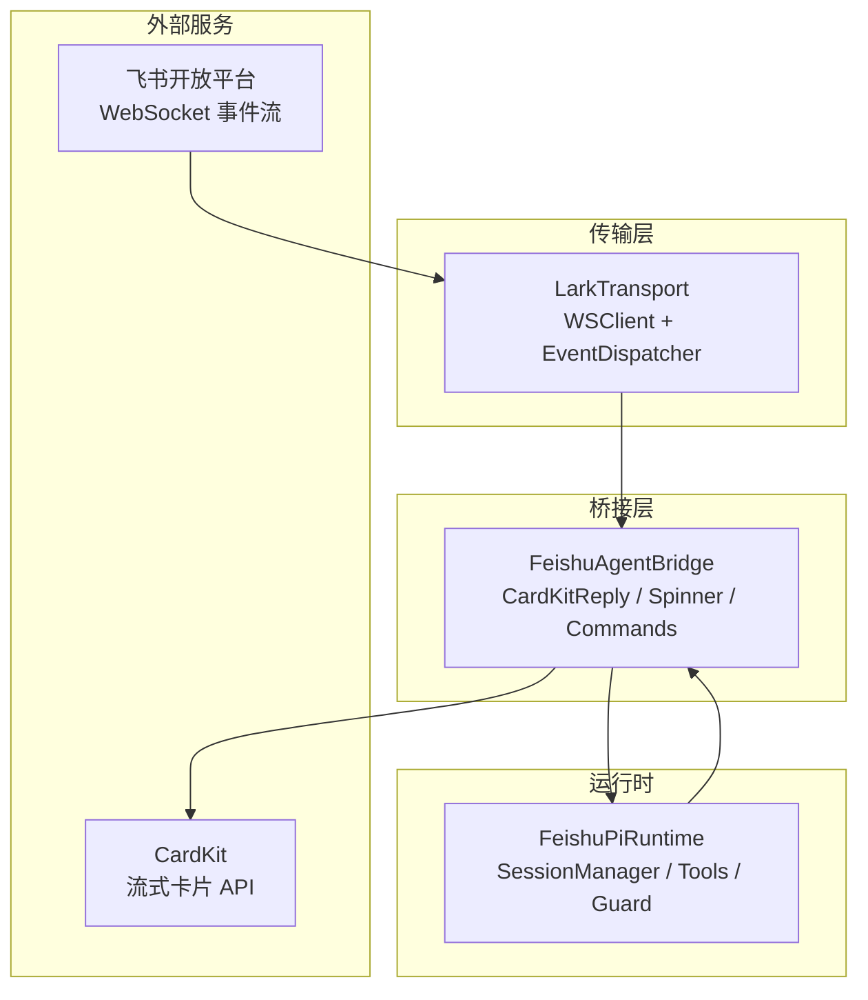
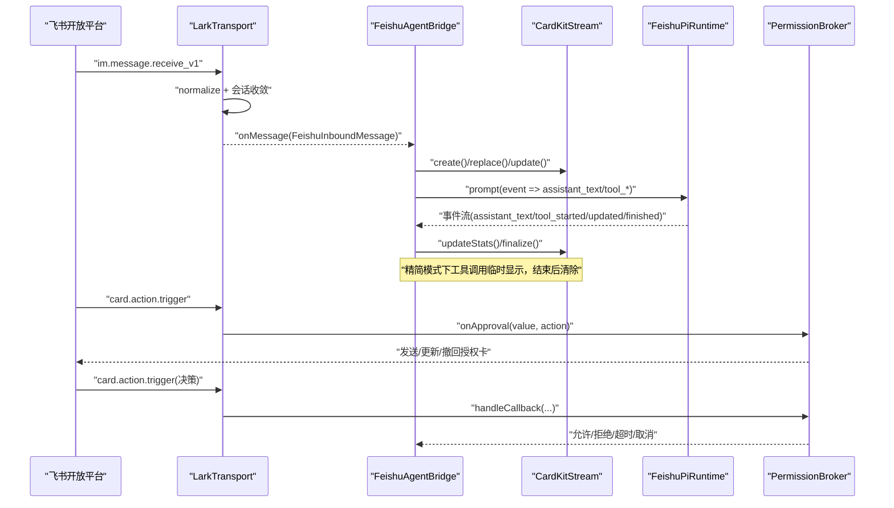
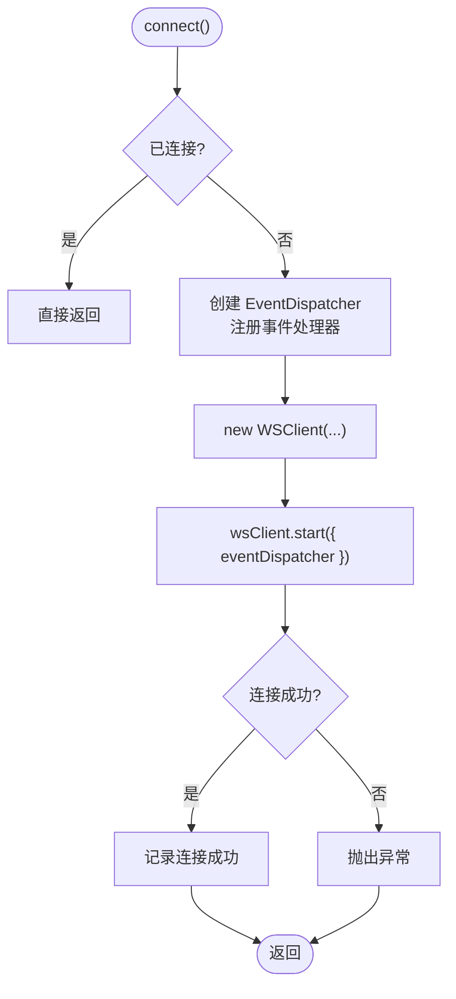
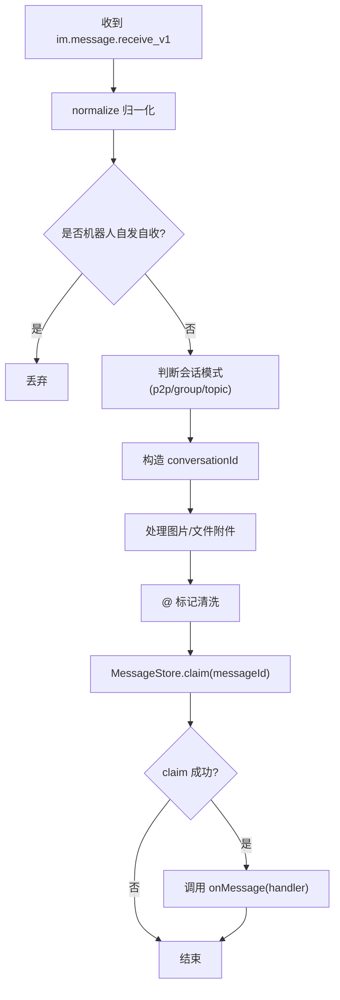
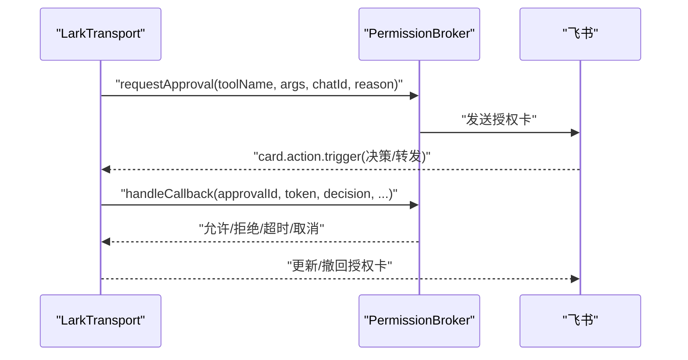
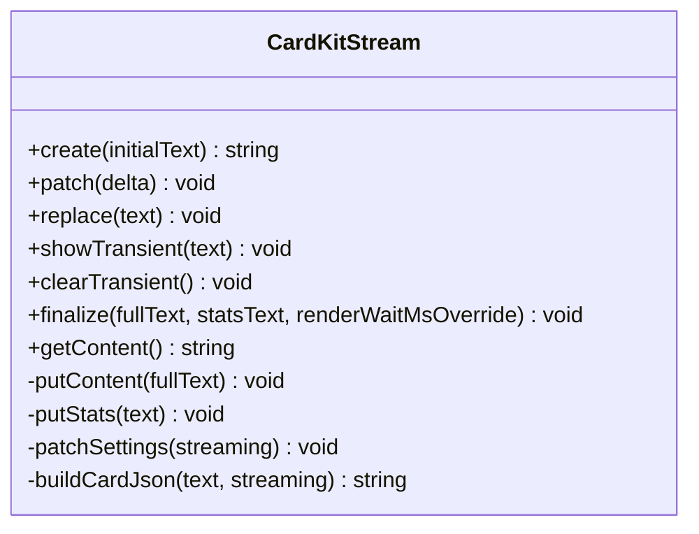
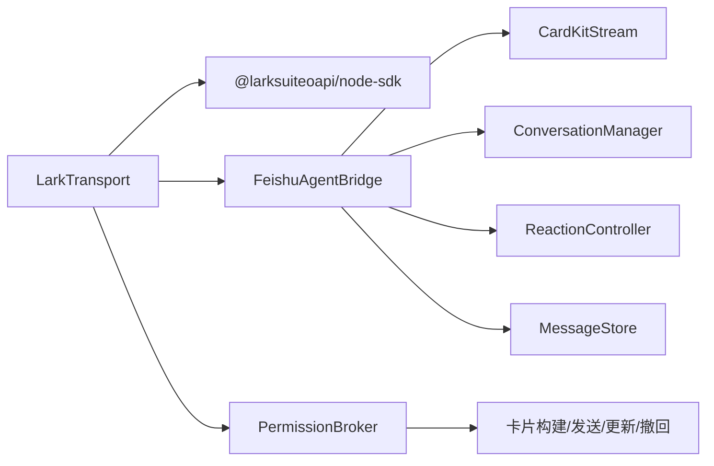

# WebSocket API

<cite>
**本文引用的文件**
- [lark-transport.ts](file://src/feishu/lark-transport.ts)
- [types.ts](file://src/feishu/types.ts)
- [cardkit-stream.ts](file://src/feishu/cardkit-stream.ts)
- [agent-bridge.ts](file://src/feishu/agent-bridge.ts)
- [main.ts](file://src/main.ts)
- [config-server.ts](file://src/config-server.ts)
- [message-store.ts](file://src/feishu/message-store.ts)
- [broker.ts](file://src/guard/broker.ts)
- [types.ts](file://src/context/types.ts)
- [types.ts](file://src/runtime/types.ts)
</cite>

## 目录
1. [简介](#简介)
2. [项目结构](#项目结构)
3. [核心组件](#核心组件)
4. [架构总览](#架构总览)
5. [详细组件分析](#详细组件分析)
6. [依赖关系分析](#依赖关系分析)
7. [性能考虑](#性能考虑)
8. [故障排查指南](#故障排查指南)
9. [结论](#结论)
10. [附录](#附录)

## 简介
本文档面向集成方，说明本项目的飞书消息实时通信能力与协议边界。系统通过飞书官方底层 WSClient 建立长连接，订阅 im.message.receive_v1、card.action.trigger 等事件，完成消息归一化、会话收敛、卡片流式渲染、授权审批与错误处理。文档覆盖：
- WebSocket 连接协议与生命周期
- 入站消息格式与事件类型
- 卡片回调与授权流程
- 错误处理与重连机制
- 客户端（Agent）集成方式、状态管理与性能优化建议

## 项目结构
本项目围绕“传输层 + 桥接层 + 运行时”的三层设计组织代码：
- 传输层：LarkTransport 基于 WSClient 管理飞书长连接、事件分发、资源下载与卡片更新
- 桥接层：FeishuAgentBridge 将入站消息转换为 Pi 会话请求，驱动 CardKit 流式卡片渲染，并处理指令与工具调用事件
- 运行时：FeishuPiRuntime 负责创建 Agent 会话、权限策略、工具守卫、统计与定时任务

图表来源
- [lark-transport.ts:82-133](file://src/feishu/lark-transport.ts#L82-L133)
- [agent-bridge.ts:66-196](file://src/feishu/agent-bridge.ts#L66-L196)
- [cardkit-stream.ts:57-152](file://src/feishu/cardkit-stream.ts#L57-L152)

章节来源
- [main.ts:93-104](file://src/main.ts#L93-L104)
- [lark-transport.ts:82-133](file://src/feishu/lark-transport.ts#L82-L133)
- [agent-bridge.ts:66-196](file://src/feishu/agent-bridge.ts#L66-L196)

## 核心组件
- LarkTransport：封装飞书 WSClient，注册事件处理器，归一化消息，处理卡片回调，提供发送/更新/撤回消息的能力
- FeishuAgentBridge：接收入站消息，执行命令或发起对话，驱动 CardKit 流式输出，维护详细/精简模式与工具调用展示
- CardKitStream：实现 CardKit Schema 2.0 的流式卡片创建、增量推送、统计小字写入与流式模式开关
- PermissionBroker：授权中枢，发送授权卡、校验回调、支持转发管理员私聊、超时与中断收尾
- MessageStore：消息去重与状态持久化，避免重复投递与重复执行
- FeishuPiRuntime：创建 Agent 会话、注入工具与权限策略、记录技能使用、切换模型

章节来源
- [lark-transport.ts:42-423](file://src/feishu/lark-transport.ts#L42-L423)
- [agent-bridge.ts:16-304](file://src/feishu/agent-bridge.ts#L16-L304)
- [cardkit-stream.ts:32-289](file://src/feishu/cardkit-stream.ts#L32-L289)
- [broker.ts:46-200](file://src/guard/broker.ts#L46-L200)
- [message-store.ts:14-49](file://src/feishu/message-store.ts#L14-L49)
- [feishu-pi-runtime.ts:81-290](file://src/runtime/feishu-pi-runtime.ts#L81-L290)

## 架构总览
下图展示了从飞书 WebSocket 事件到卡片渲染的完整链路，包括授权审批与错误处理分支。

图表来源
- [lark-transport.ts:87-133](file://src/feishu/lark-transport.ts#L87-L133)
- [lark-transport.ts:250-312](file://src/feishu/lark-transport.ts#L250-L312)
- [agent-bridge.ts:72-236](file://src/feishu/agent-bridge.ts#L72-L236)
- [cardkit-stream.ts:57-152](file://src/feishu/cardkit-stream.ts#L57-L152)
- [broker.ts:78-166](file://src/guard/broker.ts#L78-L166)

## 详细组件分析

### 连接建立与生命周期
- 连接入口：LarkTransport.connect() 创建 EventDispatcher，注册 im.message.receive_v1 与 card.action.trigger 处理器，使用 WSClient.start() 启动长连接
- 握手与心跳：配置 handshakeTimeoutMs 与 wsConfig.pingTimeout；连接成功/失败/重连均有日志
- 自动重连：WSClient 内部自带重连逻辑；应用层无需自行实现指数退避
- 断开：disconnect() 调用 WSClient.close()；主进程优雅退出时触发

图表来源
- [lark-transport.ts:82-133](file://src/feishu/lark-transport.ts#L82-L133)

章节来源
- [lark-transport.ts:82-133](file://src/feishu/lark-transport.ts#L82-L133)
- [main.ts:244-247](file://src/main.ts#L244-L247)

### 入站消息与事件处理
- 事件类型
  - im.message.receive_v1：普通消息，经 normalize 归一化为统一结构，过滤机器人自发自收，解析用户上下文与附件
  - card.action.trigger：卡片回调，包含按钮点击、授权决策、模型切换等
- 会话收敛
  - 私聊/群聊：按 userOpenId 与 threadId 区分会话
  - 话题群：首条无 threadId 的消息作为根，后续同 chatId 共享同一 conversationId
- 图片与附件
  - 图片：resources 中的 image 类型会下载到本地缓存并转为 Base64 传入 Agent
  - 文件类附件：file/audio/video/media 可下载到本地路径，并在文本中追加提示
- 消息去重
  - MessageStore.claim 保证同一条 messageId 不会重复执行 Agent 流程

图表来源
- [lark-transport.ts:87-133](file://src/feishu/lark-transport.ts#L87-L133)
- [lark-transport.ts:141-248](file://src/feishu/lark-transport.ts#L141-L248)
- [message-store.ts:23-30](file://src/feishu/message-store.ts#L23-L30)

章节来源
- [lark-transport.ts:87-133](file://src/feishu/lark-transport.ts#L87-L133)
- [lark-transport.ts:141-248](file://src/feishu/lark-transport.ts#L141-L248)
- [message-store.ts:14-49](file://src/feishu/message-store.ts#L14-L49)

### 卡片回调与授权流程
- 卡片回调
  - 非授权类：如 /model 切换，仅管理员可执行；成功后更新卡片并持久化模型名
  - 授权类：tool_approval/forward_approval，交由 PermissionBroker 在服务端校验 token、来源与管理员身份
- 授权卡
  - 发送授权卡，等待管理员点击“允许一次”或“拒绝”，支持转发到管理员私聊
  - 超时或会话中断则收尾卡片（精简模式撤回，详细模式更新结果卡）

图表来源
- [lark-transport.ts:250-312](file://src/feishu/lark-transport.ts#L250-L312)
- [broker.ts:78-166](file://src/guard/broker.ts#L78-L166)

章节来源
- [lark-transport.ts:250-312](file://src/feishu/lark-transport.ts#L250-L312)
- [broker.ts:78-166](file://src/guard/broker.ts#L78-L166)

### 流式卡片与回复
- CardKitStream 负责创建卡片实体、增量推送正文、写入统计小字、关闭流式模式
- Bridge 在首个真实内容到达前用 Spinner 动画帧占位，工具调用期间在小字位置显示旋转图标
- 精简模式：工具调用行临时显示，结束后清除；详细模式：工具调用永久保留在正文
- finalize 阶段根据文本长度计算渲染等待时间，确保客户端渲染完成后再关闭流式模式

图表来源
- [cardkit-stream.ts:32-289](file://src/feishu/cardkit-stream.ts#L32-L289)

章节来源
- [cardkit-stream.ts:57-152](file://src/feishu/cardkit-stream.ts#L57-L152)
- [agent-bridge.ts:94-236](file://src/feishu/agent-bridge.ts#L94-L236)

### 错误处理与重试
- 连接层：WSClient.onError/onReconnecting/onReconnected 记录错误与重连状态
- 消息层：归一化/分发失败记录日志，不阻塞后续事件
- 卡片层：CardKit 流式更新失败时尝试重新开启流式模式并恢复；最终关闭失败不影响内容发送
- 授权层：回调参数非法、token 不匹配、非管理员操作均拒绝；超时与中断收尾卡片
- 消息去重：MessageStore 防止重复执行；清理卡住消息与过期数据

章节来源
- [lark-transport.ts:87-133](file://src/feishu/lark-transport.ts#L87-L133)
- [lark-transport.ts:344-363](file://src/feishu/lark-transport.ts#L344-L363)
- [cardkit-stream.ts:168-192](file://src/feishu/cardkit-stream.ts#L168-L192)
- [broker.ts:132-166](file://src/guard/broker.ts#L132-L166)
- [message-store.ts:23-49](file://src/feishu/message-store.ts#L23-L49)

## 依赖关系分析
- LarkTransport 依赖 @larksuiteoapi/node-sdk 的 WSClient 与 EventDispatcher，以及 Client 进行消息与资源操作
- FeishuAgentBridge 依赖 ConversationManager、CardKitReply、命令注册表与 ReactionController
- CardKitStream 通过 Client.request 直接调用 CardKit 流式 API
- PermissionBroker 依赖卡片构建与发送/更新/撤回接口，管理待授权队列
- MessageStore 基于 JsonMapStore 持久化消息状态

图表来源
- [lark-transport.ts:1-10](file://src/feishu/lark-transport.ts#L1-L10)
- [agent-bridge.ts:1-14](file://src/feishu/agent-bridge.ts#L1-L14)
- [cardkit-stream.ts:12-15](file://src/feishu/cardkit-stream.ts#L12-L15)
- [broker.ts:1-4](file://src/guard/broker.ts#L1-L4)
- [message-store.ts:1-3](file://src/feishu/message-store.ts#L1-L3)

章节来源
- [lark-transport.ts:1-10](file://src/feishu/lark-transport.ts#L1-L10)
- [agent-bridge.ts:1-14](file://src/feishu/agent-bridge.ts#L1-L14)
- [cardkit-stream.ts:12-15](file://src/feishu/cardkit-stream.ts#L12-L15)
- [broker.ts:1-4](file://src/guard/broker.ts#L1-L4)
- [message-store.ts:1-3](file://src/feishu/message-store.ts#L1-L3)

## 性能考虑
- 节流与批量
  - CardKitStream 默认最小推送间隔 800ms，避免频繁 PUT 导致服务端限流
  - 打印频率与步长可调（printFrequencyMs/printStep），提升客户端渲染流畅度
- 并发控制
  - writeChain 串行化所有写操作，避免并发 patch 造成闪烁或覆盖
- 资源下载
  - 图片与文件附件限制最多处理 5 个，避免大流量拖慢响应
- 会话收敛
  - 话题群首条消息即确定根，减少会话分裂带来的上下文碎片
- 清理策略
  - DataCleaner 定期清理过期会话、图片与消息，保持存储健康

章节来源
- [cardkit-stream.ts:20-55](file://src/feishu/cardkit-stream.ts#L20-L55)
- [cardkit-stream.ts:160-166](file://src/feishu/cardkit-stream.ts#L160-L166)
- [lark-transport.ts:198-217](file://src/feishu/lark-transport.ts#L198-L217)
- [lark-transport.ts:314-328](file://src/feishu/lark-transport.ts#L314-L328)
- [main.ts:31-59](file://src/main.ts#L31-L59)

## 故障排查指南
- 连接问题
  - 检查 appId/appSecret 是否正确；查看 WSClient 的错误日志与重连日志
  - 若长时间未恢复，确认网络与防火墙策略
- 消息未处理
  - 检查 MessageStore.claim 是否返回 false（可能已被处理或仍在处理）
  - 查看 normalize 与 dispatchMessage 的日志，确认是否被机器人自发自收过滤
- 卡片回调无响应
  - 使用底层 EventDispatcher 而非 LarkChannel，避免 handler 返回值丢失与去重吞事件
  - 确认 card.action.trigger 处理器返回 toast，避免客户端弹出“目标回调服务超时未响应”
- 流式卡片失败
  - 关注 CardKit 流式模式关闭后的重试逻辑；若仍失败，检查网络与服务端配额
- 授权卡失效
  - 检查 approvalId/token/chatId 是否一致；确认操作者为管理员
  - 服务重启后旧授权卡会被拒绝，需重新发起任务

章节来源
- [lark-transport.ts:87-133](file://src/feishu/lark-transport.ts#L87-L133)
- [lark-transport.ts:250-312](file://src/feishu/lark-transport.ts#L250-L312)
- [cardkit-stream.ts:168-192](file://src/feishu/cardkit-stream.ts#L168-L192)
- [broker.ts:132-166](file://src/guard/broker.ts#L132-L166)
- [message-store.ts:23-49](file://src/feishu/message-store.ts#L23-L49)

## 结论
本项目以 WSClient 为基础，构建了稳定可靠的飞书消息实时通信能力。通过事件归一化、会话收敛、CardKit 流式渲染与授权中枢，实现了高可用、可扩展的 Agent 交互体验。推荐在生产环境启用消息去重、合理配置节流与渲染参数，并结合清理策略保障长期运行稳定性。

## 附录

### 连接示例与配置
- 启动流程：main.ts 中创建 Client、LarkTransport、FeishuAgentBridge，调用 transport.connect() 建立连接
- 配置服务器：config-server.ts 提供 Web 界面修改 .env，端口 3456，仅限本机访问

章节来源
- [main.ts:61-104](file://src/main.ts#L61-L104)
- [main.ts:231-247](file://src/main.ts#L231-L247)
- [config-server.ts:12-150](file://src/config-server.ts#L12-L150)

### 消息与事件规范
- 入站消息（FeishuInboundMessage）
  - messageId：用于去重与定位
  - chatId：会话 ID
  - context：用户上下文（userOpenId、userName、departmentNames、chatId、threadId、conversationId、isAdmin）
  - text：清洗后的文本
  - images：可选的图片数组
- 事件类型（FeishuPiEvent）
  - assistant_text：助手文本增量
  - tool_started/tool_updated/tool_finished：工具调用生命周期

章节来源
- [types.ts:8-20](file://src/feishu/types.ts#L8-L20)
- [types.ts:13-18](file://src/runtime/types.ts#L13-L18)
- [types.ts:1-11](file://src/context/types.ts#L1-L11)

### 客户端集成指南
- 接入点：通过 transport.onMessage(handler) 接收入站消息
- 会话管理：使用 ConversationManager 管理会话与统计
- 卡片渲染：使用 CardKitReply/CardKitStream 进行流式输出
- 授权流程：通过 PermissionBroker 发送授权卡并处理回调

章节来源
- [lark-transport.ts:379-386](file://src/feishu/lark-transport.ts#L379-L386)
- [agent-bridge.ts:66-196](file://src/feishu/agent-bridge.ts#L66-L196)
- [cardkit-stream.ts:57-152](file://src/feishu/cardkit-stream.ts#L57-L152)
- [broker.ts:78-166](file://src/guard/broker.ts#L78-L166)

### 重连机制与状态管理
- 重连：WSClient 内部实现，应用层监听 onReconnecting/onReconnected 日志
- 状态：MessageStore 维护消息处理状态（processing/completed/failed），防止重复执行
- 优雅退出：主进程捕获 SIGINT/SIGTERM/SIGBREAK，延迟断开连接并退出

章节来源
- [lark-transport.ts:114-133](file://src/feishu/lark-transport.ts#L114-L133)
- [message-store.ts:23-49](file://src/feishu/message-store.ts#L23-L49)
- [main.ts:252-283](file://src/main.ts#L252-L283)