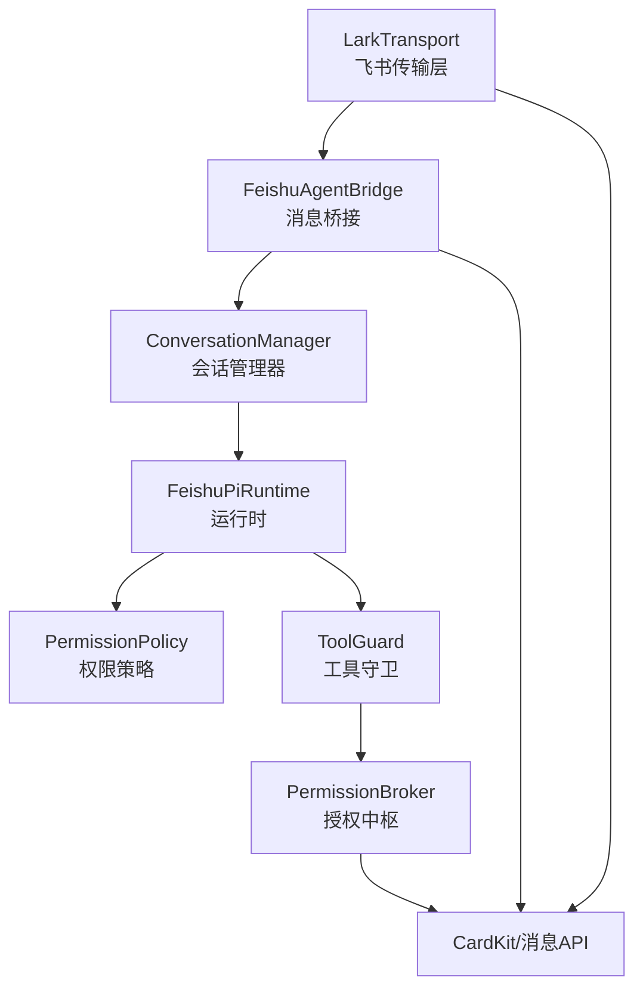
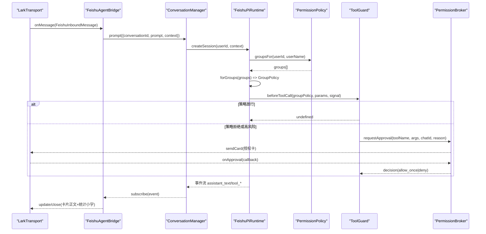
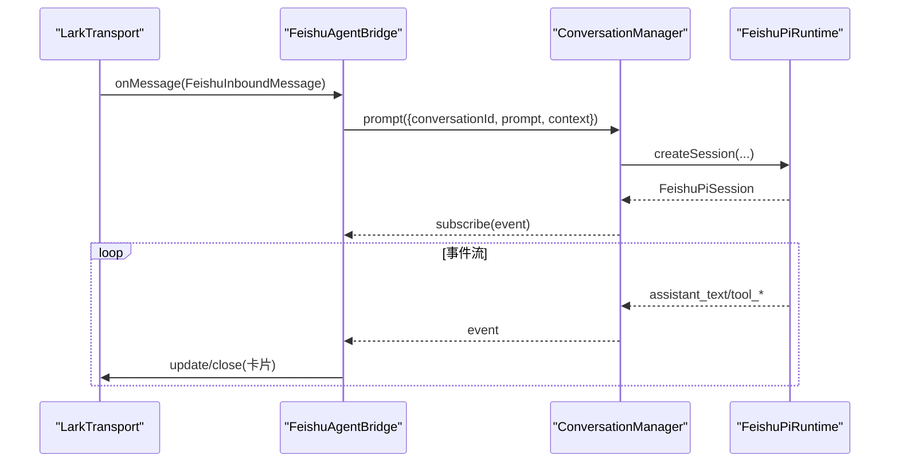
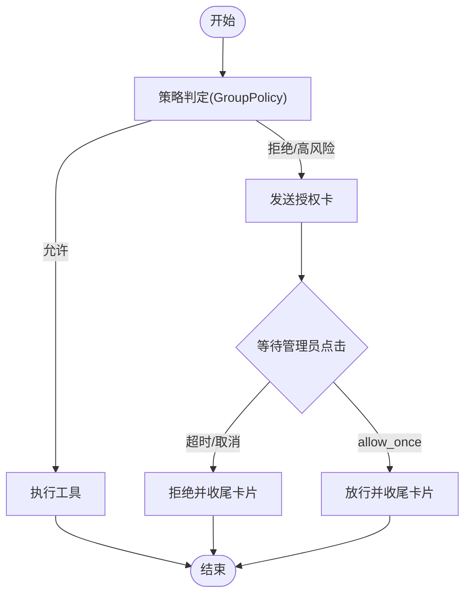
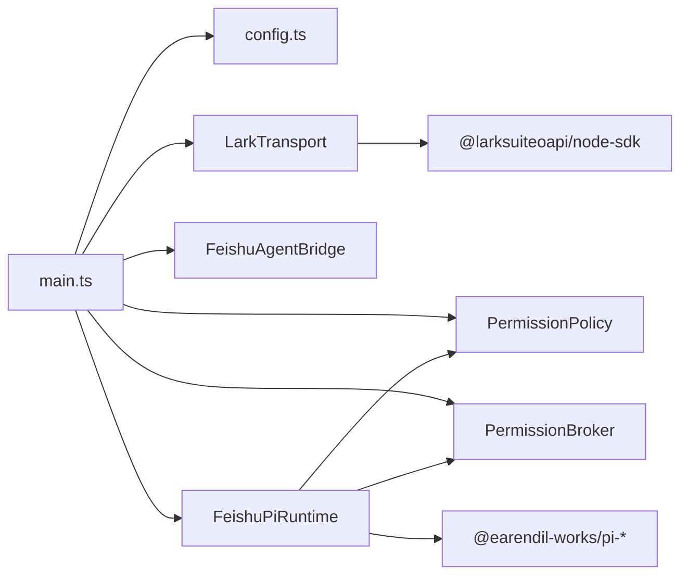

# 内部接口

<cite>
**本文引用的文件**
- [src/main.ts](file://src/main.ts)
- [src/config.ts](file://src/config.ts)
- [src/context/types.ts](file://src/context/types.ts)
- [src/feishu/types.ts](file://src/feishu/types.ts)
- [src/feishu/lark-transport.ts](file://src/feishu/lark-transport.ts)
- [src/feishu/agent-bridge.ts](file://src/feishu/agent-bridge.ts)
- [src/runtime/types.ts](file://src/runtime/types.ts)
- [src/runtime/conversation-manager.ts](file://src/runtime/conversation-manager.ts)
- [src/runtime/feishu-pi-runtime.ts](file://src/runtime/feishu-pi-runtime.ts)
- [src/permission/policy.ts](file://src/permission/policy.ts)
- [src/guard/broker.ts](file://src/guard/broker.ts)
- [src/feishu/commands.ts](file://src/feishu/commands.ts)
</cite>

## 目录
1. [简介](#简介)
2. [项目结构](#项目结构)
3. [核心组件](#核心组件)
4. [架构总览](#架构总览)
5. [详细组件分析](#详细组件分析)
6. [依赖关系分析](#依赖关系分析)
7. [性能与可靠性](#性能与可靠性)
8. [故障排查指南](#故障排查指南)
9. [结论](#结论)
10. [附录：接口参考](#附录接口参考)

## 简介
本文件为 mini-claw 的内部接口文档，聚焦模块间通信契约、核心数据模型（FeishuContext、会话对象、权限策略等）、方法签名、版本兼容性、依赖关系与调用约定。面向开发者提供完整的内部 API 参考，帮助快速理解并集成飞书 Agent 的运行时、传输层、权限与工具守卫等关键能力。

## 项目结构
系统由以下层次组成：
- 传输层：LarkTransport 负责飞书 WebSocket 长连接、消息归一化、卡片回调分发、图片/附件下载、会话模式识别与话题收敛。
- 桥接层：FeishuAgentBridge 将入站消息转换为 Pi 会话请求，管理指令、卡片渲染、统计小字与动画。
- 运行时：FeishuPiRuntime 创建与管理 Pi 会话，注入工具、资源加载、beforeToolCall 钩子；ConversationManager 维护会话复用、顺序执行与中断。
- 权限与守卫：PermissionPolicy 解析 .agent/permissions.json 定义的身份组与范围；ToolGuard + PermissionBroker 实现策略外调用的授权卡流程。
- 配置：loadConfig 从环境变量装配应用配置，驱动各组件行为。



图表来源
- [src/feishu/lark-transport.ts:82-133](file://src/feishu/lark-transport.ts#L82-L133)
- [src/feishu/agent-bridge.ts:66-96](file://src/feishu/agent-bridge.ts#L66-L96)
- [src/runtime/conversation-manager.ts:65-96](file://src/runtime/conversation-manager.ts#L65-L96)
- [src/runtime/feishu-pi-runtime.ts:147-284](file://src/runtime/feishu-pi-runtime.ts#L147-L284)
- [src/permission/policy.ts:68-158](file://src/permission/policy.ts#L68-L158)
- [src/guard/broker.ts:74-129](file://src/guard/broker.ts#L74-L129)

章节来源
- [src/main.ts:27-247](file://src/main.ts#L27-L247)
- [src/config.ts:1-51](file://src/config.ts#L1-L51)

## 核心组件
- FeishuContext：统一上下文，包含用户标识、聊天与会话信息、管理员标记等。
- FeishuInboundMessage / FeishuReply / FeishuTransport：传输层抽象，描述入站消息、回复句柄与连接生命周期。
- FeishuPiPrompt / FeishuPiSession / FeishuPiEvent：运行时与 Pi 交互的数据模型与事件流。
- GroupPolicy / PermissionPolicy：权限策略编译与判定，支持 common/owner/自定义组合并与热重载。
- ToolGuard / PermissionBroker：工具调用守卫与授权卡流程，支持超时、转发、撤回与结果更新。
- ConversationManager：会话复用、顺序执行、新消息打断、持久化映射。
- LarkTransport：基于 WSClient 的消息收发、卡片回调处理、图片/附件下载、话题群会话收敛。
- FeishuAgentBridge：指令路由、卡片渲染、统计小字、详细/精简模式切换。

章节来源
- [src/context/types.ts:1-11](file://src/context/types.ts#L1-L11)
- [src/feishu/types.ts:1-39](file://src/feishu/types.ts#L1-L39)
- [src/runtime/types.ts:1-67](file://src/runtime/types.ts#L1-L67)
- [src/permission/policy.ts:34-57](file://src/permission/policy.ts#L34-L57)
- [src/guard/broker.ts:5-27](file://src/guard/broker.ts#L5-L27)
- [src/runtime/conversation-manager.ts:7-20](file://src/runtime/conversation-manager.ts#L7-L20)
- [src/feishu/lark-transport.ts:11-31](file://src/feishu/lark-transport.ts#L11-L31)
- [src/feishu/agent-bridge.ts:15-31](file://src/feishu/agent-bridge.ts#L15-L31)

## 架构总览
下图展示一次消息从飞书到响应返回的完整调用链，包括权限判定与授权卡流程。



图表来源
- [src/feishu/lark-transport.ts:82-133](file://src/feishu/lark-transport.ts#L82-L133)
- [src/feishu/agent-bridge.ts:66-96](file://src/feishu/agent-bridge.ts#L66-L96)
- [src/runtime/conversation-manager.ts:65-96](file://src/runtime/conversation-manager.ts#L65-L96)
- [src/runtime/feishu-pi-runtime.ts:147-284](file://src/runtime/feishu-pi-runtime.ts#L147-L284)
- [src/permission/policy.ts:91-158](file://src/permission/policy.ts#L91-L158)
- [src/guard/broker.ts:74-129](file://src/guard/broker.ts#L74-L129)

## 详细组件分析

### 数据模型与类型
- FeishuContext
  - 字段：userOpenId、userName、departmentNames、chatId、threadId、conversationId、isAdmin
  - 用途：贯穿消息处理、权限判定、会话恢复与统计记录
  - 来源：[src/context/types.ts:1-11](file://src/context/types.ts#L1-L11)

- 传输层接口
  - FeishuInboundMessage：messageId、chatId、context、text、images
  - FeishuReply：update(text)、close(text, statsText?)
  - FeishuTransport：connect()、disconnect()、onMessage(handler)
  - 来源：[src/feishu/types.ts:1-39](file://src/feishu/types.ts#L1-L39)

- 运行时接口
  - FeishuPiPrompt：text、images、context
  - FeishuPiSession：subscribe(listener)、prompt(input)、waitForIdle()、abort()、getStats()、getModelName?()、getContextUsage?()
  - FeishuPiEvent：assistant_text、tool_started、tool_updated、tool_finished
  - 来源：[src/runtime/types.ts:13-67](file://src/runtime/types.ts#L13-L67)

- 权限策略
  - GroupFields：members、scripts、bash、read、write、skills
  - GroupPolicy：groups、isOwner、scriptsAllowed、bashAllowed、readAllowed、writeAllowed、skillsAllowed、describe()
  - 来源：[src/permission/policy.ts:34-57](file://src/permission/policy.ts#L34-L57)

- 授权中枢
  - BrokerOptions：adminOpenIds、timeoutMs、sendCard、updateCard、recallCard?、shouldRecall?
  - ApprovalRequest：toolName、args、chatId、reason
  - 来源：[src/guard/broker.ts:5-27](file://src/guard/broker.ts#L5-L27)

章节来源
- [src/context/types.ts:1-11](file://src/context/types.ts#L1-L11)
- [src/feishu/types.ts:1-39](file://src/feishu/types.ts#L1-L39)
- [src/runtime/types.ts:13-67](file://src/runtime/types.ts#L13-L67)
- [src/permission/policy.ts:34-57](file://src/permission/policy.ts#L34-L57)
- [src/guard/broker.ts:5-27](file://src/guard/broker.ts#L5-L27)

### 类与关系图
```mermaid
classDiagram
class LarkTransport {
+connect() Promise~void~
+disconnect() Promise~void~
+onMessage(handler) void
+onApproval(handler) void
+sendCardToChat(chatId, card) Promise~string~
+updateCardById(messageId, card) Promise~void~
+recallMessageById(messageId) Promise~void~
}
class FeishuAgentBridge {
+start() void
+handle(message) Promise~void~
+isDetailMode(chatId) boolean
}
class ConversationManager {
+prompt(message, onEvent) Promise~FeishuPiSession~
+getStats(conversationId, context) Promise~any~
+clear(conversationId) Promise~void~
+abort(conversationId) Promise~void~
}
class FeishuPiRuntime {
+setModelName(modelName) void
+createSession(sessionFile, userId, context) Promise~FeishuPiSession~
+printAvailableResources() Promise~void~
}
class PermissionPolicy {
+groupsFor(userId, userName) Promise~string[]~
+forGroups(groups) Promise~GroupPolicy~
+describe() Promise~object~
}
class PermissionBroker {
+requestApproval(request, signal) Promise~{allowed,detail}~
+handleCallback(params) Promise~{accepted,detail}~
+forwardToAdmin(params) Promise~{accepted,detail}~
}
LarkTransport --> FeishuAgentBridge : "发送消息/卡片"
FeishuAgentBridge --> ConversationManager : "发起会话"
ConversationManager --> FeishuPiRuntime : "创建/订阅会话"
FeishuPiRuntime --> PermissionPolicy : "读取组策略"
FeishuPiRuntime --> PermissionBroker : "通过 ToolGuard 触发授权"
```

图表来源
- [src/feishu/lark-transport.ts:82-133](file://src/feishu/lark-transport.ts#L82-L133)
- [src/feishu/agent-bridge.ts:66-96](file://src/feishu/agent-bridge.ts#L66-L96)
- [src/runtime/conversation-manager.ts:22-118](file://src/runtime/conversation-manager.ts#L22-L118)
- [src/runtime/feishu-pi-runtime.ts:81-284](file://src/runtime/feishu-pi-runtime.ts#L81-L284)
- [src/permission/policy.ts:68-158](file://src/permission/policy.ts#L68-L158)
- [src/guard/broker.ts:46-199](file://src/guard/broker.ts#L46-L199)

### 关键流程时序

#### 消息处理与卡片渲染


图表来源
- [src/feishu/lark-transport.ts:82-133](file://src/feishu/lark-transport.ts#L82-L133)
- [src/feishu/agent-bridge.ts:66-96](file://src/feishu/agent-bridge.ts#L66-L96)
- [src/runtime/conversation-manager.ts:65-96](file://src/runtime/conversation-manager.ts#L65-L96)
- [src/runtime/feishu-pi-runtime.ts:147-284](file://src/runtime/feishu-pi-runtime.ts#L147-L284)

#### 授权卡流程


图表来源
- [src/guard/broker.ts:74-129](file://src/guard/broker.ts#L74-L129)
- [src/permission/policy.ts:110-158](file://src/permission/policy.ts#L110-L158)
- [src/runtime/feishu-pi-runtime.ts:226-282](file://src/runtime/feishu-pi-runtime.ts#L226-L282)

### 权限策略与命令
- 策略文件：.agent/permissions.json，支持 common、owner 及任意组名；字段包括 members、scripts、bash、read、write、skills。
- 生效范围：common ∪ 所属各组（并集）；无组时保守默认（仅技能目录可读）。
- 命令：/detail on/off 控制详细/精简模式；/perm 查看权限配置（仅管理员）。

章节来源
- [src/permission/policy.ts:5-32](file://src/permission/policy.ts#L5-L32)
- [src/permission/policy.ts:68-158](file://src/permission/policy.ts#L68-L158)
- [src/feishu/commands.ts:252-314](file://src/feishu/commands.ts#L252-L314)

### 会话管理与话题收敛
- 会话复用：ConversationManager 按 conversationId 复用 Session，保证顺序执行与新消息打断。
- 话题收敛：LarkTransport 在 topic 模式下以首条消息 messageId 作为根，后续 threadId 一致的消息收敛至同一会话。
- 持久化：会话文件映射在首个 message_end 落盘后立刻持久化，崩溃/中断可恢复。

章节来源
- [src/runtime/conversation-manager.ts:33-96](file://src/runtime/conversation-manager.ts#L33-L96)
- [src/feishu/lark-transport.ts:155-175](file://src/feishu/lark-transport.ts#L155-L175)

## 依赖关系分析
- 启动装配：main.ts 组装 Transport、Bridge、Runtime、Policy、Broker、ScheduleService 等，并注册回调。
- 配置驱动：config.ts 从环境变量加载配置，影响模型、超时、审核接口等。
- 外部依赖：@larksuiteoapi/node-sdk 用于 WS 连接与卡片操作；@earendil-works/pi-* 用于 Agent 会话与模型。



图表来源
- [src/main.ts:27-247](file://src/main.ts#L27-L247)
- [src/config.ts:25-51](file://src/config.ts#L25-L51)

章节来源
- [src/main.ts:27-247](file://src/main.ts#L27-L247)
- [src/config.ts:25-51](file://src/config.ts#L25-L51)

## 性能与可靠性
- 事件非阻塞：LarkTransport 对消息处理采用 fire-and-forget，避免阻塞 SDK 事件循环；去重与顺序由 MessageStore 与 ConversationManager 保障。
- 会话中断：新消息到达会 abort 当前在途请求，提升交互响应性。
- 授权超时：PermissionBroker 支持超时自动拒绝，避免长期挂起。
- 优雅退出：main.ts 监听 SIGINT/SIGTERM/SIGBREAK，断开连接并强制退出，防止进程挂住。

章节来源
- [src/feishu/lark-transport.ts:135-148](file://src/feishu/lark-transport.ts#L135-L148)
- [src/runtime/conversation-manager.ts:65-96](file://src/runtime/conversation-manager.ts#L65-L96)
- [src/guard/broker.ts:74-129](file://src/guard/broker.ts#L74-L129)
- [src/main.ts:252-283](file://src/main.ts#L252-L283)

## 故障排查指南
- 卡片回调失败：检查 LarkTransport 的 handleCardAction 日志，确认 value 是否为合法 JSON、action 是否匹配 tool_approval/switch_model。
- 授权卡未收到：确认 adminOpenIds 已配置且 broker.timeoutMs 合理；检查 sendCard/updateCard 回调是否成功。
- 策略不生效：检查 .agent/permissions.json 语法与 mtime；确认用户是否在 members 中或通过 users.json 解析到中文名/英文名。
- 会话丢失：确认 ConversationManager 的 sessionFile 持久化逻辑；必要时清理 conversations.json 映射重试。
- 模型切换失败：检查 /model 卡片回调与 persistModelName 写入 .env 的逻辑。

章节来源
- [src/feishu/lark-transport.ts:250-312](file://src/feishu/lark-transport.ts#L250-L312)
- [src/guard/broker.ts:131-199](file://src/guard/broker.ts#L131-L199)
- [src/permission/policy.ts:178-210](file://src/permission/policy.ts#L178-L210)
- [src/runtime/conversation-manager.ts:56-63](file://src/runtime/conversation-manager.ts#L56-L63)

## 结论
本系统通过清晰的传输层、桥接层、运行时与权限守卫分层，实现了飞书 Agent 的高可用、可扩展与强安全性的内部接口体系。FeishuContext、会话对象与权限策略构成核心数据模型；PermissionPolicy 与 ToolGuard/PermissionBroker 形成“名单内放行、名单外交授权”的统一治理机制。开发者可据此扩展工具、策略与指令，保持向后兼容与稳定运行。

## 附录：接口参考

### 传输层接口（FeishuTransport）
- connect(): Promise<void>
- disconnect(): Promise<void>
- onMessage(handler: (message: FeishuInboundMessage) => Promise<void>): void
- onApproval(handler: (params: { value: Record<string, unknown>; action: { messageId: string; chatId: string; operatorOpenId: string } }) => Promise<void>): void
- sendCardToChat(chatId: string, card: object): Promise<string>
- updateCardById(messageId: string, card: object): Promise<void>
- recallMessageById(messageId: string): Promise<void>

章节来源
- [src/feishu/types.ts:30-35](file://src/feishu/types.ts#L30-L35)
- [src/feishu/lark-transport.ts:379-422](file://src/feishu/lark-transport.ts#L379-L422)

### 运行时接口（FeishuPiSession）
- subscribe(listener: (event: FeishuPiEvent) => void): () => void
- prompt(input: FeishuPiPrompt): Promise<void>
- waitForIdle(): Promise<void>
- abort(): void
- getStats(): any
- getModelName?(): string
- getContextUsage?(): { tokens: number | null; contextWindow: number; percent: number | null } | undefined

章节来源
- [src/runtime/types.ts:53-64](file://src/runtime/types.ts#L53-L64)

### 权限策略接口（GroupPolicy）
- groups: string[]
- isOwner: boolean
- scriptsAllowed(name: string): boolean
- bashAllowed(command: string): boolean
- readAllowed(path: string): boolean
- writeAllowed(path: string): boolean
- skillsAllowed(path: string): boolean
- describe(): Required<Omit<GroupFields, "members">>

章节来源
- [src/permission/policy.ts:43-57](file://src/permission/policy.ts#L43-L57)

### 授权中枢接口（PermissionBroker）
- requestApproval(request: ApprovalRequest, signal?: AbortSignal): Promise<{ allowed: boolean; detail: string }>
- handleCallback(params: { approvalId?: string; token?: string; decision?: string; messageId: string; chatId: string; operatorOpenId: string }): Promise<{ accepted: boolean; detail: string }>
- forwardToAdmin(params: { approvalId?: string; token?: string; messageId: string; chatId: string }): Promise<{ accepted: boolean; detail: string }>

章节来源
- [src/guard/broker.ts:74-199](file://src/guard/broker.ts#L74-L199)

### 配置项（FeishuPiAppConfig）
- feishuAppId: string
- feishuAppSecret: string
- feishuAdmin: string
- cwd: string
- sessionDir: string
- modelProvider: string
- modelName: string
- modelBaseUrl?: string
- systemPrompt?: string
- cmdWhitelist: string[]（已废弃，保留兼容）
- guardBaseUrl?: string
- guardModels: string[]
- guardApiKey?: string
- guardTimeoutMs: number
- approvalTimeoutMs: number

章节来源
- [src/config.ts:1-22](file://src/config.ts#L1-L22)
- [src/config.ts:25-51](file://src/config.ts#L25-L51)

### 调用约定与参数验证规则
- 入站消息必须包含 messageId、chatId、context、text；可选 images。
- 上下文 context 必须包含 userOpenId、chatId、conversationId；isAdmin 由传输层根据 adminOpenId 计算。
- 策略判定：
  - read：路径命中技能目录则走 skillsAllowed，否则走 readAllowed；不在范围内直接拦截。
  - bash/write/edit/其他工具：先走策略名单，未命中或高风险则进入授权卡流程。
- 授权卡：
  - 必须携带 approvalId、token、decision；服务端校验 token、卡片来源与管理员身份。
  - 超时视为拒绝；支持转发给管理员私聊；支持撤回或更新结果卡。

章节来源
- [src/feishu/types.ts:8-20](file://src/feishu/types.ts#L8-L20)
- [src/feishu/lark-transport.ts:223-243](file://src/feishu/lark-transport.ts#L223-L243)
- [src/runtime/feishu-pi-runtime.ts:226-282](file://src/runtime/feishu-pi-runtime.ts#L226-L282)
- [src/guard/broker.ts:131-199](file://src/guard/broker.ts#L131-L199)

### 版本兼容性
- 传输层使用官方 WSClient 与 EventDispatcher，避免高层封装的 ACK 与去重问题。
- 策略文件 .agent/permissions.json 支持热重载（mtime 变化），新会话立即生效。
- 会话映射与消息去重独立于传输层，确保跨版本稳定性。
- 配置项 cmdWhitelist 已废弃，迁移到 permissions.json 的 allow 列表。

章节来源
- [src/feishu/lark-transport.ts:33-41](file://src/feishu/lark-transport.ts#L33-L41)
- [src/permission/policy.ts:178-210](file://src/permission/policy.ts#L178-L210)
- [src/config.ts:11-12](file://src/config.ts#L11-L12)