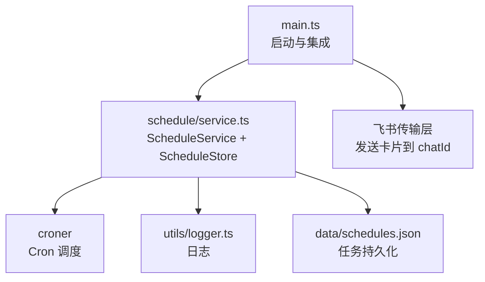
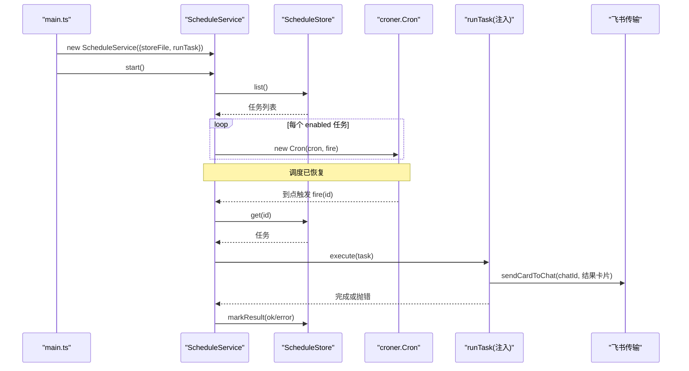
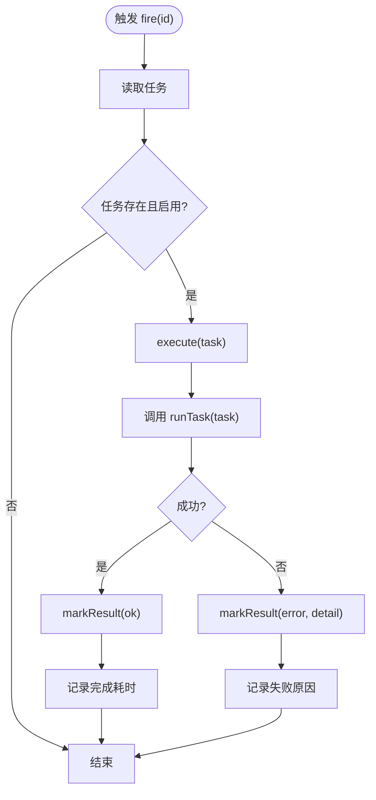
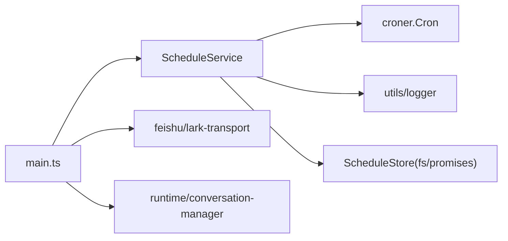

# 定时任务服务

<cite>
**本文引用的文件**
- [src/schedule/service.ts](file://src/schedule/service.ts)
- [test/schedule.test.ts](file://test/schedule.test.ts)
- [src/main.ts](file://src/main.ts)
- [package.json](file://package.json)
- [src/utils/logger.ts](file://src/utils/logger.ts)
</cite>

## 目录
1. [简介](#简介)
2. [项目结构](#项目结构)
3. [核心组件](#核心组件)
4. [架构总览](#架构总览)
5. [详细组件分析](#详细组件分析)
6. [依赖关系分析](#依赖关系分析)
7. [性能与可靠性](#性能与可靠性)
8. [故障排查指南](#故障排查指南)
9. [结论](#结论)
10. [附录：cron 表达式与配置示例](#附录cron-表达式与配置示例)

## 简介
本服务提供基于 cron 表达式的定时任务调度能力，实现任务的创建、持久化、调度执行、状态记录与结果推送。任务在触发时以创建者身份运行智能体，并将结果卡片推送到目标会话；失败会记录状态与错误信息，便于监控与排障。服务启动后自动恢复所有已启用任务的调度，支持手动立即触发、启用/停用、删除等管理操作。

## 项目结构
定时任务相关代码位于 src/schedule/service.ts，测试位于 test/schedule.test.ts，主入口在 src/main.ts 中集成并注入执行器。日志通过 src/utils/logger.ts 输出，调度库 croner 由 package.json 引入。



图表来源
- [src/main.ts:179-209](file://src/main.ts#L179-L209)
- [src/schedule/service.ts:105-236](file://src/schedule/service.ts#L105-L236)
- [package.json:20-20](file://package.json#L20-L20)
- [src/utils/logger.ts:24-39](file://src/utils/logger.ts#L24-L39)

章节来源
- [src/schedule/service.ts:1-236](file://src/schedule/service.ts#L1-L236)
- [src/main.ts:179-209](file://src/main.ts#L179-L209)
- [package.json:15-23](file://package.json#L15-L23)
- [src/utils/logger.ts:1-40](file://src/utils/logger.ts#L1-L40)

## 核心组件
- ScheduleTask：任务数据模型，包含 id、name、cron、prompt、chatId、createdBy、enabled、时间戳及上次执行状态。
- ScheduleStore：JSON 文件持久化，带串行写入队列与原子替换（先写 .tmp 再 rename），读取失败按空处理并记录警告。
- ScheduleService：调度与生命周期管理，负责校验 cron、创建/删除/启用/停用任务、恢复调度、触发执行、记录结果。
- 执行器 runTask：由 main 注入，调用运行时 prompt 并以卡片形式将结果推送到目标会话。

章节来源
- [src/schedule/service.ts:7-25](file://src/schedule/service.ts#L7-L25)
- [src/schedule/service.ts:30-90](file://src/schedule/service.ts#L30-L90)
- [src/schedule/service.ts:92-114](file://src/schedule/service.ts#L92-L114)
- [src/schedule/service.ts:116-179](file://src/schedule/service.ts#L116-L179)
- [src/main.ts:179-209](file://src/main.ts#L179-L209)

## 架构总览
服务启动流程：
- main 初始化配置、清理过期数据、建立飞书连接与权限策略。
- 构造 ScheduleService，注入 runTask（以创建者身份运行智能体并推送卡片）。
- 启动 bridge 与 transport，随后调用 scheduleService.start() 恢复所有已启用任务的调度。
- 优雅退出时停止调度并断开连接。



图表来源
- [src/main.ts:179-209](file://src/main.ts#L179-L209)
- [src/main.ts:246-247](file://src/main.ts#L246-L247)
- [src/schedule/service.ts:116-123](file://src/schedule/service.ts#L116-L123)
- [src/schedule/service.ts:191-210](file://src/schedule/service.ts#L191-L210)
- [src/schedule/service.ts:212-235](file://src/schedule/service.ts#L212-L235)

## 详细组件分析

### 数据模型与持久化
- ScheduleTask 字段说明：
  - id：短 UUID（前 8 位）
  - name：展示名（默认取 prompt 前若干字符）
  - cron：5 段 cron 表达式（分 时 日 月 周）
  - prompt：触发时投给智能体的指令
  - chatId：结果推送的目标会话
  - createdBy：创建者 openId（任务以其身份与权限执行）
  - enabled：是否启用
  - createdAt：创建时间
  - lastRunAt/lastStatus/lastError：最近一次执行时间与状态、错误详情

- ScheduleStore 行为：
  - 首次访问时从 JSON 文件加载为 Map，缺失或解析失败按空处理并记录警告。
  - put/remove/list/get 均先 ensureLoaded，保证内存态一致。
  - flush 使用串行队列避免并发写冲突；采用 tmp 文件 + rename 的原子替换策略。

```mermaid
classDiagram
class ScheduleTask {
+string id
+string name
+string cron
+string prompt
+string chatId
+string createdBy
+boolean enabled
+string createdAt
+number lastRunAt
+string lastStatus
+string lastError
}
class ScheduleStore {
-string filePath
-Map~string,ScheduleTask~ tasks
-boolean loaded
-Promise~void~ queue
+list() Promise~ScheduleTask[]~
+get(id) Promise~ScheduleTask|undefined~
+put(task) Promise~void~
+remove(id) Promise~boolean~
-ensureLoaded() Promise~void~
-flush() Promise~void~
}
class ScheduleService {
-ScheduleStore store
-Map~string,Cron~ jobs
-runTask?
-boolean started
+start() Promise~void~
+stop() void
+addTask(input) Promise~{task?,error?}~
+removeTask(id) Promise~string~
+setEnabled(id,enabled) Promise~string~
+listTasks() Promise~ScheduleTask[]~
+fireNow(id) Promise~string~
-isValidCron(expr) boolean
-scheduleJob(task) void
-unscheduleJob(id) void
-fire(id) Promise~void~
-execute(task) Promise~void~
-markResult(task,status,detail?) Promise~void~
}
ScheduleService --> ScheduleStore : "读写任务"
ScheduleService --> Cron : "调度"
```

图表来源
- [src/schedule/service.ts:7-25](file://src/schedule/service.ts#L7-L25)
- [src/schedule/service.ts:30-90](file://src/schedule/service.ts#L30-L90)
- [src/schedule/service.ts:105-236](file://src/schedule/service.ts#L105-L236)

章节来源
- [src/schedule/service.ts:7-25](file://src/schedule/service.ts#L7-L25)
- [src/schedule/service.ts:30-90](file://src/schedule/service.ts#L30-L90)

### 调度与执行流程
- 启动恢复：start() 遍历已持久化的任务，对 enabled 的任务创建 Cron 实例，绑定 fire(id)。
- 触发执行：fire() 获取最新任务并检查 enabled，调用 execute()。
- 执行逻辑：execute() 调用注入的 runTask，成功后标记 ok，失败捕获异常并标记 error 与错误详情。
- 结果记录：markResult() 更新 lastRunAt、lastStatus、lastError 并落盘。



图表来源
- [src/schedule/service.ts:206-235](file://src/schedule/service.ts#L206-L235)

章节来源
- [src/schedule/service.ts:116-123](file://src/schedule/service.ts#L116-L123)
- [src/schedule/service.ts:191-210](file://src/schedule/service.ts#L191-L210)
- [src/schedule/service.ts:212-235](file://src/schedule/service.ts#L212-L235)

### 任务创建、管理与监控
- 创建任务 addTask：
  - 校验 cron 表达式（使用 croner 构造验证）与 prompt 非空。
  - 生成 id、name、时间戳，持久化并立即注册调度（若服务已启动）。
- 删除 removeTask：取消调度并从存储移除。
- 启用/停用 setEnabled：更新 enabled 并动态启停调度。
- 列表 listTasks：返回按创建时间排序的任务列表。
- 立即触发 fireNow：不改变调度节奏，直接执行一次。

章节来源
- [src/schedule/service.ts:131-179](file://src/schedule/service.ts#L131-L179)

### 结果推送与日志
- 结果推送：main 注入的 runTask 将智能体输出裁剪至上限，以 CardKit 卡片发送到 task.chatId。
- 日志记录：
  - 调度关键事件（新建、触发、完成、失败、文件读写异常）通过 logger.info/warn 输出。
  - 日志带时间戳与颜色标记，便于终端观察。

章节来源
- [src/main.ts:179-209](file://src/main.ts#L179-L209)
- [src/utils/logger.ts:24-39](file://src/utils/logger.ts#L24-L39)
- [src/schedule/service.ts:147-150](file://src/schedule/service.ts#L147-L150)
- [src/schedule/service.ts:213-225](file://src/schedule/service.ts#L213-L225)
- [src/schedule/service.ts:68-71](file://src/schedule/service.ts#L68-L71)
- [src/schedule/service.ts:85-87](file://src/schedule/service.ts#L85-L87)

## 依赖关系分析
- 外部依赖：
  - croner：用于解析与执行 cron 表达式，提供 Cron 类进行调度。
  - Node.js fs/promises：文件读写与原子替换。
  - @larksuiteoapi/node-sdk：main 中用于飞书通信（卡片发送等）。
- 内部依赖：
  - utils/logger：统一日志输出。
  - runtime/conversation-manager：main 中通过 conversations.prompt 驱动智能体。
  - feishu/lark-transport：发送卡片到指定 chatId。



图表来源
- [package.json:20-20](file://package.json#L20-L20)
- [src/schedule/service.ts:1-5](file://src/schedule/service.ts#L1-L5)
- [src/main.ts:179-209](file://src/main.ts#L179-L209)

章节来源
- [package.json:15-23](file://package.json#L15-L23)
- [src/schedule/service.ts:1-5](file://src/schedule/service.ts#L1-L5)
- [src/main.ts:179-209](file://src/main.ts#L179-L209)

## 性能与可靠性
- 持久化可靠性：
  - 串行写入队列避免并发写竞争。
  - 原子替换（写 tmp 再 rename）降低损坏风险。
  - 读取失败降级为空集合，不影响服务运行。
- 调度可靠性：
  - 启动时恢复所有 enabled 任务，重启后继续调度。
  - 任务执行失败记录 lastStatus 与 lastError，便于后续查看。
- 执行隔离：
  - 同一任务触发时，若上一轮未结束，由上层会话队列串行，不并发执行（注释明确）。
- 资源释放：
  - stop() 停止所有 Cron 实例并清空映射，配合进程信号优雅退出。

章节来源
- [src/schedule/service.ts:63-89](file://src/schedule/service.ts#L63-L89)
- [src/schedule/service.ts:116-123](file://src/schedule/service.ts#L116-L123)
- [src/schedule/service.ts:125-129](file://src/schedule/service.ts#L125-L129)
- [src/schedule/service.ts:212-235](file://src/schedule/service.ts#L212-L235)

## 故障排查指南
- 任务未触发：
  - 检查 cron 表达式是否合法（addTask 会返回错误提示）。
  - 确认任务 enabled 为 true。
  - 查看日志中是否有“cron 无效”的警告。
- 任务执行失败：
  - 查看 lastStatus=error 与 lastError 字段，定位具体错误。
  - 检查 runTask 注入是否正确（未注入会抛出“执行器未注入”）。
- 持久化异常：
  - 关注“任务文件读取失败/写入失败”的警告，检查磁盘权限与路径。
- 手动触发无效：
  - fireNow 仅对存在的任务有效；不存在会返回相应提示。
- 服务重启后调度恢复：
  - start() 会恢复所有 enabled 任务；如未恢复，检查持久化文件内容与日志。

章节来源
- [src/schedule/service.ts:131-150](file://src/schedule/service.ts#L131-L150)
- [src/schedule/service.ts:191-199](file://src/schedule/service.ts#L191-L199)
- [src/schedule/service.ts:212-235](file://src/schedule/service.ts#L212-L235)
- [src/schedule/service.ts:63-89](file://src/schedule/service.ts#L63-L89)
- [test/schedule.test.ts:38-82](file://test/schedule.test.ts#L38-L82)

## 结论
该定时任务服务以轻量、可靠的方式实现了 cron 调度、任务持久化、状态管理与结果推送。通过注入式执行器解耦业务逻辑，结合原子写入与串行队列保障数据一致性，并通过完善的日志与状态字段支持可观测性与排障。适合在现有飞书 Agent 平台中作为周期性任务的基础设施。

## 附录：cron 表达式与配置示例
- cron 表达式语法（5 段：分 时 日 月 周）：
  - 每天 9 点：0 9 * * *
  - 工作日 10:30：30 10 * * 1-5
  - 每月 1 号 0 点：0 0 1 * *
  - 每 15 分钟：*/15 * * * *
- 任务创建示例（概念性描述）：
  - 输入：cron="0 9 * * *"，prompt="汇总昨日数据并发送报告"，chatId="oc_xxx"，createdBy="ou_admin"，name="每日报告"
  - 行为：校验 cron 与 prompt，生成 id 与时间戳，持久化到 data/schedules.json，若服务已启动则立即注册调度。
- 管理操作示例（概念性描述）：
  - 启用/停用：setEnabled(id, true/false)
  - 删除：removeTask(id)
  - 列表：listTasks()
  - 立即触发：fireNow(id)
- 结果推送与日志：
  - 结果以卡片形式发送到 chatId，内容截取上限。
  - 关键事件通过 logger 输出，包含时间戳与级别。

章节来源
- [src/schedule/service.ts:131-150](file://src/schedule/service.ts#L131-L150)
- [src/main.ts:179-209](file://src/main.ts#L179-L209)
- [src/utils/logger.ts:24-39](file://src/utils/logger.ts#L24-L39)
- [test/schedule.test.ts:38-82](file://test/schedule.test.ts#L38-L82)