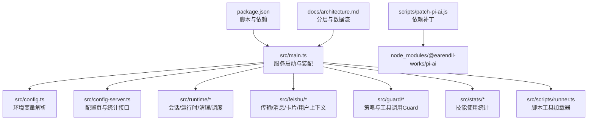
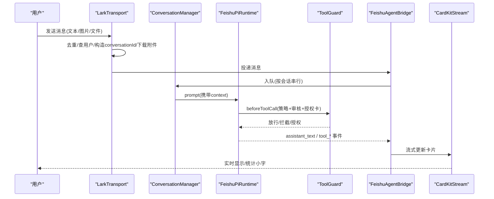
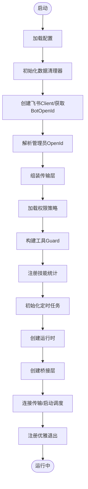
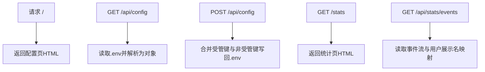
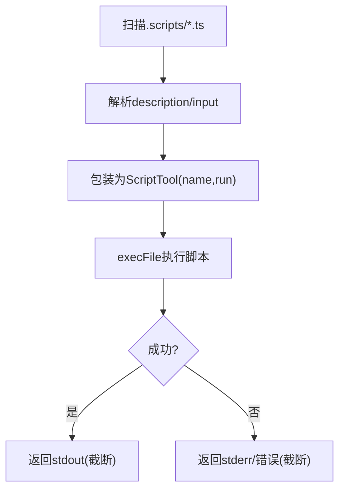
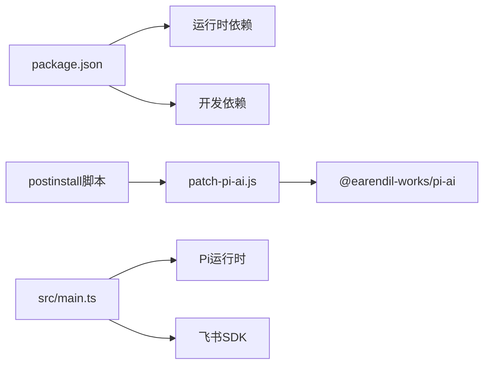

# 开发指南

<cite>
**本文引用的文件**
- [package.json](file://package.json)
- [README.md](file://README.md)
- [tsconfig.json](file://tsconfig.json)
- [vitest.config.ts](file://vitest.config.ts)
- [src/main.ts](file://src/main.ts)
- [src/config.ts](file://src/config.ts)
- [src/config-server.ts](file://src/config-server.ts)
- [scripts/patch-pi-ai.js](file://scripts/patch-pi-ai.js)
- [src/utils/logger.ts](file://src/utils/logger.ts)
- [docs/architecture.md](file://docs/architecture.md)
- [test/policy.test.ts](file://test/policy.test.ts)
- [test/unit/log-utils.test.ts](file://test/unit/log-utils.test.ts)
- [src/scripts/runner.ts](file://src/scripts/runner.ts)
</cite>

## 目录
1. [简介](#简介)
2. [项目结构](#项目结构)
3. [核心组件](#核心组件)
4. [架构总览](#架构总览)
5. [详细组件分析](#详细组件分析)
6. [依赖分析](#依赖分析)
7. [性能考虑](#性能考虑)
8. [故障排除指南](#故障排除指南)
9. [结论](#结论)
10. [附录](#附录)

## 简介
本指南面向开发者，提供从环境搭建、代码规范、测试框架使用到构建流程、调试技巧、代码审查标准、贡献与发布流程的完整工作流参考。项目基于 Pi 运行时，结合飞书长连接传输层、会话管理、权限策略与工具调用 Guard，实现轻量可控的飞书 Agent 应用。

## 项目结构
- 入口与启动：通过脚本命令启动主进程，加载配置并初始化各子系统。
- 配置与界面：本地 Web 配置页（仅本机访问）用于编辑 .env；同时暴露统计页面。
- 运行时：会话管理、Agent 运行时、定时任务、数据清理等。
- 飞书集成：长连接传输、消息归一化、用户上下文、卡片回调处理。
- 权限与 Guard：统一策略文件 + 动态审核 + 授权卡。
- 工具与脚本：内置工具与 .agent 脚本工具加载器。
- 日志与统计：结构化日志、技能使用事件流与可视化。
- 测试：Vitest 单元测试与集成测试用例。



图表来源
- [package.json:1-34](file://package.json#L1-L34)
- [src/main.ts:1-286](file://src/main.ts#L1-L286)
- [src/config.ts:1-51](file://src/config.ts#L1-L51)
- [src/config-server.ts:1-150](file://src/config-server.ts#L1-L150)
- [scripts/patch-pi-ai.js:1-36](file://scripts/patch-pi-ai.js#L1-L36)
- [docs/architecture.md:19-33](file://docs/architecture.md#L19-L33)

章节来源
- [package.json:6-12](file://package.json#L6-L12)
- [src/main.ts:27-247](file://src/main.ts#L27-L247)
- [src/config.ts:24-50](file://src/config.ts#L24-L50)
- [src/config-server.ts:12-149](file://src/config-server.ts#L12-L149)
- [scripts/patch-pi-ai.js:1-36](file://scripts/patch-pi-ai.js#L1-L36)
- [docs/architecture.md:19-33](file://docs/architecture.md#L19-L33)

## 核心组件
- 启动与装配：主进程负责加载配置、创建传输层、会话管理器、权限策略、工具 Guard、统计与调度服务，并启动配置服务器。
- 配置系统：从环境变量读取配置，支持模型、管理员、审核接口与超时等；提供 Web 配置页写入 .env。
- 飞书传输层：底层 WS 长连接，消息归一化、用户资料查询与缓存、附件下载、卡片回调路由。
- 会话与运行时：按 conversationId 隔离会话，复用 Pi Session，支持增量持久化与恢复。
- 权限与 Guard：统一策略文件（common/owner/user），每次工具调用经策略判定、智能体综合判断与授权卡。
- 脚本工具：扫描 .agent/scripts/*.ts，以子进程执行，输出 stdout 作为结果。
- 日志与统计：带时间戳的结构化日志；技能使用独立事件流与可视化页面。

章节来源
- [src/main.ts:27-247](file://src/main.ts#L27-L247)
- [src/config.ts:24-50](file://src/config.ts#L24-L50)
- [src/config-server.ts:94-149](file://src/config-server.ts#L94-L149)
- [docs/architecture.md:51-67](file://docs/architecture.md#L51-L67)
- [docs/architecture.md:68-81](file://docs/architecture.md#L68-L81)
- [docs/architecture.md:82-127](file://docs/architecture.md#L82-L127)
- [src/scripts/runner.ts:6-95](file://src/scripts/runner.ts#L6-L95)
- [src/utils/logger.ts:1-40](file://src/utils/logger.ts#L1-L40)

## 架构总览
系统采用分层设计：飞书消息进入后，经传输层归一化，进入会话层进行隔离与排队，再交由权限与 Guard 过滤，最终由 Agent 运行时执行，并通过 CardKit 流式卡片回复。



图表来源
- [docs/architecture.md:51-67](file://docs/architecture.md#L51-L67)
- [docs/architecture.md:68-81](file://docs/architecture.md#L68-L81)
- [docs/architecture.md:128-157](file://docs/architecture.md#L128-L157)
- [src/main.ts:93-177](file://src/main.ts#L93-L177)

## 详细组件分析

### 启动与装配（main）
- 加载配置与环境变量校验。
- 初始化数据清理器（会话、图片、消息）与定时清理任务。
- 创建飞书 Client、获取 Bot Open ID、解析管理员 Open ID。
- 组装传输层、权限策略、工具 Guard、授权卡回调、技能使用统计、定时任务。
- 创建运行时、会话管理器、桥接层，启动传输与调度，注册优雅退出。



图表来源
- [src/main.ts:27-247](file://src/main.ts#L27-L247)

章节来源
- [src/main.ts:27-247](file://src/main.ts#L27-L247)

### 配置与配置服务器
- 环境变量解析：必需字段严格校验，可选字段提供默认值或回退逻辑。
- 配置服务器：仅监听本机端口，提供 / 配置页与 /api/config 读写 .env；/stats 统计页面与 /api/stats/events 接口。
- 安全提示：配置页明文返回 App Secret，仅限本机访问。



图表来源
- [src/config-server.ts:94-149](file://src/config-server.ts#L94-L149)
- [src/config.ts:24-50](file://src/config.ts#L24-L50)

章节来源
- [src/config.ts:24-50](file://src/config.ts#L24-L50)
- [src/config-server.ts:12-149](file://src/config-server.ts#L12-L149)

### 权限策略与工具调用 Guard
- 策略文件：统一在 .agent/permissions.json 定义 common/owner/user 三档能力，生效范围取并集，支持热重载。
- Guard 流程：read/bash/write/edit/其他工具分别判定；未命中则走智能体综合判断；失败或超时弹授权卡。
- 授权卡：唯一 approval_id + 一次性 token，服务端校验点击者身份与卡片来源，支持转发给管理员。

```mermaid
flowchart TD
S["工具调用"] --> R{"read?"}
R -- 是 --> RA["判skills/read范围"]
RA --> |范围内| OK1["放行"]
RA --> |范围外| DENY1["拦截(不弹卡)"]
R -- 否 --> B{"bash?"}
B -- 是 --> BA["命中bash名单?"]
BA --> |是| OK2["放行"]
BA --> |否| JUDGE["智能体综合判断"]
B -- 否 --> W{"write/edit?"}
W -- 是 --> WA["命中write范围?"]
WA --> |是| OK3["放行"]
WA --> |否| JUDGE
W -- 否 --> O{"tools名单?"}
O -- 是且非高危| OK4["放行"]
O -- 否| JUDGE
JUDGE --> |符合意图| OK5["放行"]
JUDGE --> |不符合/异常| CARD["弹授权卡"]
```

图表来源
- [docs/architecture.md:82-127](file://docs/architecture.md#L82-L127)
- [src/main.ts:106-169](file://src/main.ts#L106-L169)

章节来源
- [docs/architecture.md:82-127](file://docs/architecture.md#L82-L127)
- [src/main.ts:106-169](file://src/main.ts#L106-L169)

### 脚本工具加载器
- 约定优于配置：脚本顶部注释声明 description 与 input 示例，文件名即为工具名。
- 执行方式：以子进程执行，参数 JSON 通过 argv 传递，stdout 作为结果，错误信息截断输出。
- 超时与缓冲：默认 30 秒超时，最大缓冲 1MB，Windows 隐藏控制台窗口。



图表来源
- [src/scripts/runner.ts:6-95](file://src/scripts/runner.ts#L6-L95)

章节来源
- [src/scripts/runner.ts:6-95](file://src/scripts/runner.ts#L6-L95)

### 日志与统计
- 日志：统一 logger，带时间戳与颜色标记，区分 info/warn/error/log 及用户输入/AI响应。
- 统计：技能使用独立事件流（只增不删），前端可视化页面支持多维度筛选与明细表。

章节来源
- [src/utils/logger.ts:1-40](file://src/utils/logger.ts#L1-L40)
- [src/config-server.ts:122-149](file://src/config-server.ts#L122-L149)
- [docs/architecture.md:120-127](file://docs/architecture.md#L120-L127)

## 依赖分析
- 运行时依赖：Pi 系列包提供 Agent 运行时、模型适配与编码工具；飞书 SDK 提供底层 WS 长连接与事件分发。
- 开发依赖：TypeScript、tsx、Vitest、Vite。
- 脚本补丁：postinstall 自动修补 pi-ai 的请求头以避免中转站 403。



图表来源
- [package.json:14-32](file://package.json#L14-L32)
- [scripts/patch-pi-ai.js:1-36](file://scripts/patch-pi-ai.js#L1-L36)
- [src/main.ts:1-24](file://src/main.ts#L1-L24)

章节来源
- [package.json:14-32](file://package.json#L14-L32)
- [scripts/patch-pi-ai.js:1-36](file://scripts/patch-pi-ai.js#L1-L36)

## 性能考虑
- 会话串行与并行：同一会话串行处理，不同会话并行执行，新消息可中断在途请求。
- 流式卡片：CardKit 2.0 流式更新，节流与队列串行化，避免频繁网络开销。
- 数据清理：会话、图片、消息保留 7 天，定期清理释放空间。
- 用户资料缓存：空档案 1 天、有档案 3 天，减少重复 API 调用。
- 脚本工具：超时与输出截断，防止长时间阻塞与过大输出。

章节来源
- [docs/architecture.md:68-81](file://docs/architecture.md#L68-L81)
- [docs/architecture.md:142-157](file://docs/architecture.md#L142-L157)
- [docs/architecture.md:177-195](file://docs/architecture.md#L177-L195)
- [src/scripts/runner.ts:20-21](file://src/scripts/runner.ts#L20-L21)

## 故障排除指南
- 类型检查失败：使用类型检查命令定位编译期问题。
- 测试失败：运行测试套件定位回归点。
- 依赖补丁失效：重新安装依赖以自动应用补丁；若目标文件路径变更，仅告警不影响安装。
- 配置保存失败：确认 .env 文件可写；配置页仅本机访问，确保浏览器地址为 localhost。
- 飞书连接异常：检查应用权限与事件订阅；长连接由官方 SDK 自动重连，关注握手与 ping 超时。
- 授权卡无效：确认审批超时、token 有效性与管理员身份；转发到其他会话点击无效。
- 数据堆积：检查 DataCleaner 是否正常运行；确认清理周期与阈值。

章节来源
- [package.json:6-12](file://package.json#L6-L12)
- [scripts/patch-pi-ai.js:32-35](file://scripts/patch-pi-ai.js#L32-L35)
- [src/config-server.ts:145-149](file://src/config-server.ts#L145-L149)
- [docs/architecture.md:51-67](file://docs/architecture.md#L51-L67)
- [docs/architecture.md:177-195](file://docs/architecture.md#L177-L195)

## 结论
本项目以 Pi 为运行时底座，结合飞书长连接、会话隔离、统一权限策略与工具调用 Guard，实现了轻量可控的 Agent 平台。通过完善的启动装配、配置管理、统计与调度能力，以及严格的类型检查与测试覆盖，为持续迭代提供了坚实基础。建议遵循本指南的开发工作流，确保质量与稳定性。

## 附录

### 开发环境搭建
- Node.js 版本：22+（类型定义基于 @types/node 22.x）。
- 包管理器：npm。
- 克隆仓库并安装依赖：
  - npm install
  - postinstall 将自动对 pi-ai 打补丁。
- 配置飞书应用权限与事件订阅（详见 README）。
- 启动服务：
  - npm start
- 启动开发模式（热重载）：
  - npm run dev
- 启动配置服务器：
  - npm run config

章节来源
- [README.md:120-146](file://README.md#L120-L146)
- [package.json:6-12](file://package.json#L6-L12)

### 代码规范
- TypeScript 严格模式：启用 strict、noEmit、模块解析 NodeNext。
- 文件命名与包含：src 与 test 下的 .ts 纳入编译。
- 日志格式：统一使用 logger，带时间戳与级别。
- 脚本工具契约：顶部注释声明 description 与 input 示例，文件名即工具名。

章节来源
- [tsconfig.json:1-18](file://tsconfig.json#L1-L18)
- [src/utils/logger.ts:1-40](file://src/utils/logger.ts#L1-L40)
- [src/scripts/runner.ts:6-18](file://src/scripts/runner.ts#L6-L18)

### 测试框架与用例
- 测试框架：Vitest。
- 测试文件匹配：test/**/*.test.ts。
- 运行测试：
  - npm test
- 示例测试：
  - 权限策略多组判定与热重载。
  - 日志工具格式化与长度限制。

章节来源
- [vitest.config.ts:1-8](file://vitest.config.ts#L1-L8)
- [test/policy.test.ts:1-122](file://test/policy.test.ts#L1-L122)
- [test/unit/log-utils.test.ts:1-56](file://test/unit/log-utils.test.ts#L1-L56)

### 构建流程
- 类型检查：
  - npm run check
- 启动生产：
  - npm start
- 启动开发：
  - npm run dev
- 启动配置服务器：
  - npm run config

章节来源
- [package.json:6-12](file://package.json#L6-L12)

### 常用命令速查
- npm install：安装依赖并自动打补丁。
- npm start：启动服务。
- npm run dev：开发模式（watch）。
- npm run config：启动配置服务器。
- npm run check：类型检查。
- npm test：运行测试。

章节来源
- [package.json:6-12](file://package.json#L6-L12)

### 调试技巧
- 日志：查看带时间戳的 info/warn/error 输出，定位问题阶段。
- 配置页：打开 http://localhost:3456 查看与修改 .env。
- 统计页面：http://localhost:3456/stats 查看技能使用情况。
- 授权卡：关注审批超时与 token 有效性；转发到管理员私聊便于集中决策。
- 数据清理：观察 DataCleaner 日志，确认会话、图片、消息清理情况。

章节来源
- [src/utils/logger.ts:24-39](file://src/utils/logger.ts#L24-L39)
- [src/config-server.ts:145-149](file://src/config-server.ts#L145-L149)
- [docs/architecture.md:177-195](file://docs/architecture.md#L177-L195)

### 代码审查标准
- 功能正确性：是否符合需求与边界条件。
- 安全性：权限判定是否在代码层执行；敏感信息是否脱敏；授权卡校验是否完备。
- 可维护性：模块职责清晰、命名规范、注释充分。
- 性能影响：是否存在阻塞操作、过大输出或未设置超时。
- 测试覆盖：新增逻辑是否补充单测/集成测试。

章节来源
- [docs/architecture.md:197-205](file://docs/architecture.md#L197-L205)
- [src/main.ts:106-169](file://src/main.ts#L106-L169)

### 贡献流程
- 分支策略：特性分支开发，提交前执行类型检查与测试。
- 提交规范：描述变更目的与影响范围。
- 评审要点：安全、性能、可维护性与测试覆盖。
- 合并后验证：本地运行 start/dev，回归关键场景。

章节来源
- [package.json:6-12](file://package.json#L6-L12)
- [README.md:578-592](file://README.md#L578-L592)

### 发布流程
- 依赖升级：注意 patch-pi-ai.js 的目标文件路径变化；升级后回归收发消息、附件、授权卡与模型切换。
- 配置校验：确保 .env 与权限策略文件正确。
- 预检：类型检查与测试全部通过。
- 部署：启动服务并观察日志与数据清理情况。

章节来源
- [scripts/patch-pi-ai.js:1-36](file://scripts/patch-pi-ai.js#L1-L36)
- [README.md:134-146](file://README.md#L134-L146)
- [package.json:6-12](file://package.json#L6-L12)