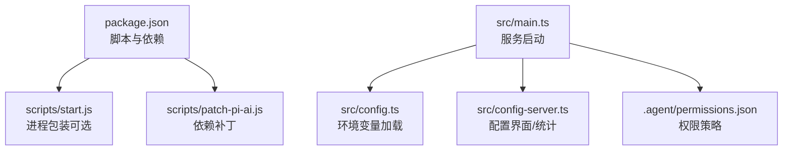
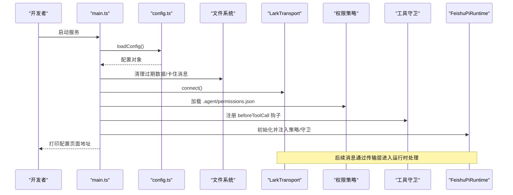
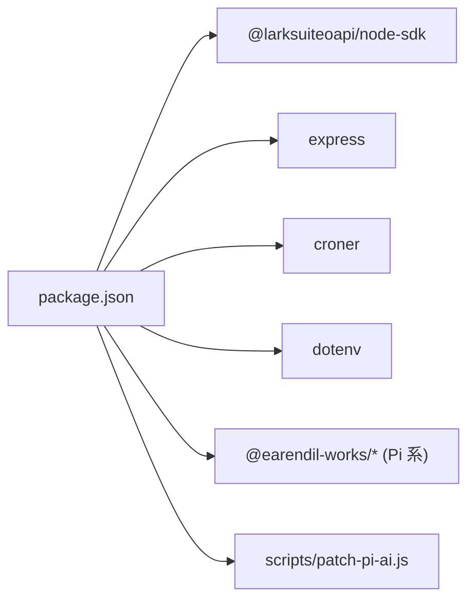

# 快速开始

<cite>
**本文引用的文件**
- [package.json](file://package.json)
- [README.md](file://README.md)
- [src/config.ts](file://src/config.ts)
- [src/main.ts](file://src/main.ts)
- [src/config-server.ts](file://src/config-server.ts)
- [scripts/patch-pi-ai.js](file://scripts/patch-pi-ai.js)
- [.agent/permissions.json](file://.agent/permissions.json)
</cite>

## 目录
1. [简介](#简介)
2. [项目结构](#项目结构)
3. [核心组件](#核心组件)
4. [架构总览](#架构总览)
5. [详细组件分析](#详细组件分析)
6. [依赖关系分析](#依赖关系分析)
7. [性能注意事项](#性能注意事项)
8. [故障排除指南](#故障排除指南)
9. [结论](#结论)
10. [附录：环境变量与配置模板](#附录环境变量与配置模板)

## 简介
本指南面向首次接触 mini-claw（feishu-pi）的新用户，目标是在最短时间内完成环境搭建、飞书应用权限配置、环境变量设置与服务启动，并验证基本功能。文档同时提供常见配置选项说明与故障排除建议，帮助你快速上手并稳定运行。

## 项目结构
- 入口与启动
  - 主程序入口位于 src/main.ts，负责加载配置、初始化数据清理、连接飞书、注册权限策略与工具守卫、启动运行时与传输层。
  - 配置界面服务器在 src/config-server.ts，监听本机 127.0.0.1:3456，提供 Web 表单编辑 .env 与统计页面 /stats。
- 配置与环境
  - 环境变量由 src/config.ts 统一读取与校验，包含飞书应用信息、模型 Provider/名称/Base URL、系统提示词、审核与授权超时等。
  - 权限策略文件 .agent/permissions.json 定义 common/owner/user 等组的读写、脚本、bash 与技能可见范围。
- 依赖与脚本
  - package.json 定义了开发/生产脚本与依赖；postinstall 自动执行 scripts/patch-pi-ai.js 对 pi-ai 进行补丁，避免中转站 403。

图表来源
- [package.json:1-34](file://package.json#L1-L34)
- [src/main.ts:1-286](file://src/main.ts#L1-L286)
- [src/config.ts:1-51](file://src/config.ts#L1-L51)
- [src/config-server.ts:1-150](file://src/config-server.ts#L1-L150)
- [.agent/permissions.json:1-21](file://.agent/permissions.json#L1-L21)

章节来源
- [package.json:1-34](file://package.json#L1-L34)
- [README.md:120-250](file://README.md#L120-L250)

## 核心组件
- 配置加载器（src/config.ts）
  - 从环境变量读取必需项（如 FEISHU_APP_ID、FEISHU_APP_SECRET），并提供默认值与可选项（如模型 Provider、Base URL、系统提示词、审核接口与超时、授权卡超时）。
- 主服务（src/main.ts）
  - 启动数据清理任务（会话、图片、消息）、创建飞书 Client、解析管理员 Open ID、构建 LarkTransport、注册权限策略与工具守卫、启动运行时与桥接层、处理优雅退出。
- 配置界面（src/config-server.ts）
  - 本地 Web 服务（仅 127.0.0.1），提供 / 配置页与 /api/config 读写 .env，以及 /stats 技能使用统计页面。
- 权限策略（.agent/permissions.json）
  - 定义 common/owner/user 等组的能力边界（read/write/bash/scripts/skills），支持热重载与新会话生效。

章节来源
- [src/config.ts:1-51](file://src/config.ts#L1-L51)
- [src/main.ts:27-286](file://src/main.ts#L27-L286)
- [src/config-server.ts:1-150](file://src/config-server.ts#L1-L150)
- [.agent/permissions.json:1-21](file://.agent/permissions.json#L1-L21)

## 架构总览
下图展示了服务启动后的关键交互：主程序加载配置、启动数据清理、建立飞书连接、注册权限策略与工具守卫、启动运行时与传输层，并通过配置界面提供本地配置能力。

图表来源
- [src/main.ts:27-286](file://src/main.ts#L27-L286)
- [src/config.ts:24-50](file://src/config.ts#L24-L50)
- [.agent/permissions.json:1-21](file://.agent/permissions.json#L1-L21)

## 详细组件分析

### 环境与依赖安装
- Node.js 版本要求
  - 基于类型定义与依赖，建议使用 Node.js 22+。
- 安装依赖
  - 执行 npm install，会自动运行 postinstall 脚本对 @earendil-works/pi-ai 进行补丁，移除可能导致中转站 403 的请求头。
- 包管理器
  - 使用 npm。

章节来源
- [README.md:120-146](file://README.md#L120-L146)
- [package.json:1-34](file://package.json#L1-L34)
- [scripts/patch-pi-ai.js:1-36](file://scripts/patch-pi-ai.js#L1-L36)

### 飞书应用权限配置
- 必需权限
  - im:message、im:message.group_at_msg、im:message.p2p_msg、im:message.reaction:write、contact:user.base:readonly、im:chat.member:readonly。
- 可选权限（图片功能）
  - im:resource。
- 事件订阅
  - 长连接接收事件/回调；订阅 im.message.receive_v1；卡片回调 card.action.trigger。
- 应用可用范围
  - 设置部门或成员范围，范围越大，可查询到的用户信息越完整。

章节来源
- [README.md:147-170](file://README.md#L147-L170)

### 环境变量设置
- 必需变量
  - FEISHU_APP_ID、FEISHU_APP_SECRET、FEISHU_ADMIN（管理员标识，支持 Open ID/中文名/英文名/邮箱）。
- 模型相关
  - FEISHU_PI_MODEL_PROVIDER（默认 anthropic）、FEISHU_PI_MODEL_NAME（默认 claude-sonnet-4-6）、FEISHU_PI_MODEL_BASE_URL（可选）、FEISHU_PI_MODEL_API_KEY。
- 系统与行为
  - FEISHU_PI_SYSTEM_PROMPT（可选）。
  - FEISHU_GUARD_*（可选）：智能体审核接口与超时。
  - FEISHU_APPROVAL_TIMEOUT_MS（可选）：授权卡等待超时。
- 读取与校验
  - 由 src/config.ts 的 loadConfig 统一读取，缺失必需变量会抛出错误。

章节来源
- [src/config.ts:24-50](file://src/config.ts#L24-L50)
- [README.md:187-250](file://README.md#L187-L250)

### 服务启动流程
- 启动命令
  - npm start（tsx src/main.ts）。
- 启动前准备
  - 至少配置 FEISHU_APP_ID、FEISHU_APP_SECRET、FEISHU_ADMIN。
- 启动过程要点
  - 数据清理（会话、图片、消息，保留 7 天）。
  - 获取 Bot Open ID（可选）。
  - 解析管理员 Open ID（可选）。
  - 创建 LarkTransport 并连接。
  - 加载权限策略与工具守卫。
  - 初始化运行时并打印可用资源。
  - 启动配置界面（http://localhost:3456）。
  - 优雅退出处理（SIGINT/SIGTERM/SIGBREAK）。

章节来源
- [src/main.ts:27-286](file://src/main.ts#L27-L286)
- [README.md:226-250](file://README.md#L226-L250)

### 配置界面与统计
- 配置界面
  - 访问 http://localhost:3456，可在线编辑 .env（仅管理键），保存后直接写入文件。
- 统计页面
  - 访问 http://localhost:3456/stats，查看技能使用情况（按日/月/年分组、用户筛选、技能隐藏等）。

章节来源
- [src/config-server.ts:1-150](file://src/config-server.ts#L1-L150)
- [README.md:187-200](file://README.md#L187-L200)

### 权限策略与工具守卫
- 权限策略
  - .agent/permissions.json 定义 common/owner/user 等组的能力边界（read/write/bash/scripts/skills），修改即时生效（新会话）。
- 工具守卫
  - 每次工具调用前进行白名单判定与授权卡流程；未命中白名单且智能体未放行则弹授权卡给管理员确认。

章节来源
- [.agent/permissions.json:1-21](file://.agent/permissions.json#L1-L21)
- [README.md:440-575](file://README.md#L440-L575)

## 依赖关系分析
- 运行时依赖
  - 飞书 SDK、Express、Croner、dotenv 等。
- 开发依赖
  - TypeScript、Vitest、Vite、tsx 等。
- 脚本
  - postinstall 自动修补 pi-ai；start 脚本用于进程包装（可选）。

图表来源
- [package.json:14-32](file://package.json#L14-L32)
- [scripts/patch-pi-ai.js:1-36](file://scripts/patch-pi-ai.js#L1-L36)

章节来源
- [package.json:1-34](file://package.json#L1-L34)

## 性能注意事项
- 数据清理
  - 启动时清理过期数据与卡住消息，并定时每日执行一次，减少磁盘占用与异常状态。
- 缓存
  - 用户信息缓存 3 天，降低 API 调用频率；外部成员降级查询时优先使用群成员列表。
- 流式回复
  - CardKit 流式卡片提升用户体验，注意网络与渲染性能。

章节来源
- [src/main.ts:31-59](file://src/main.ts#L31-L59)
- [README.md:26-62](file://README.md#L26-L62)

## 故障排除指南
- 启动时报缺少环境变量
  - 检查是否已设置 FEISHU_APP_ID、FEISHU_APP_SECRET、FEISHU_ADMIN。
- 飞书连接失败
  - 确认应用权限与事件订阅已正确配置；检查 App ID/Secret；确保长连接模式启用。
- 中转站返回 403
  - 确认 postinstall 已执行，pi-ai 补丁已生效；必要时重新安装依赖。
- 管理员无法切换模型
  - 确认 FEISHU_ADMIN 已正确配置；非管理员点击模型按钮会被拒绝。
- 授权卡无响应
  - 检查 FEISHU_APPROVAL_TIMEOUT_MS；确认管理员能收到并点击授权卡；若服务重启导致失效，需重新发起任务。
- 配置界面无法保存
  - 确认 .env 文件可写；仅本机访问（127.0.0.1:3456）。

章节来源
- [src/config.ts:24-50](file://src/config.ts#L24-L50)
- [README.md:147-186](file://README.md#L147-L186)
- [scripts/patch-pi-ai.js:1-36](file://scripts/patch-pi-ai.js#L1-L36)
- [src/config-server.ts:145-150](file://src/config-server.ts#L145-L150)

## 结论
通过以上步骤，你可以在最短时间内完成 mini-claw 的环境搭建、权限配置、环境变量设置与服务启动，并利用配置界面与统计页面进行日常管理与监控。建议在正式使用前完善权限策略与模型配置，并根据团队需求调整审核与授权超时等参数。

## 附录：环境变量与配置模板
- 最小必需配置
  - FEISHU_APP_ID、FEISHU_APP_SECRET、FEISHU_ADMIN。
- 推荐配置
  - 模型 Provider/名称/Base URL、API Key、系统提示词。
- 可选配置
  - 智能体审核接口与超时、授权卡超时、随机表情等。
- 配置方式
  - 手动编辑 .env，或使用 http://localhost:3456 配置界面在线编辑。

章节来源
- [README.md:187-250](file://README.md#L187-L250)
- [src/config.ts:24-50](file://src/config.ts#L24-L50)
- [src/config-server.ts:41-88](file://src/config-server.ts#L41-L88)