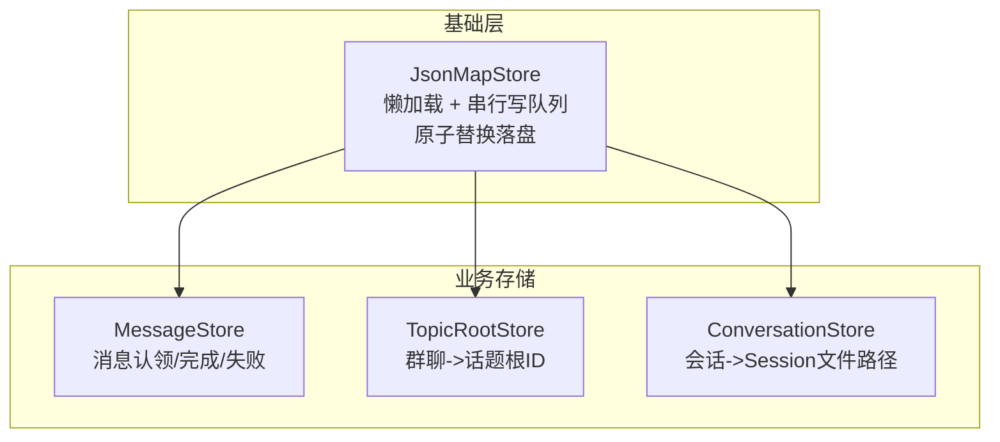
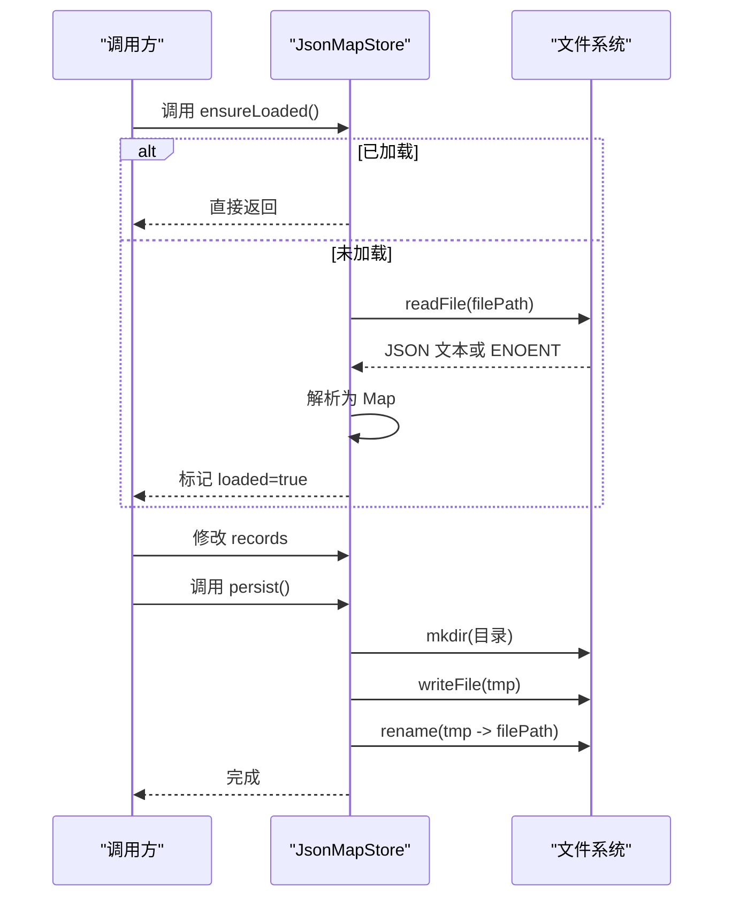
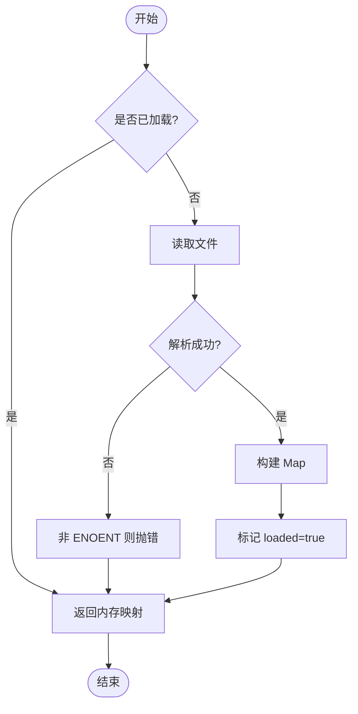
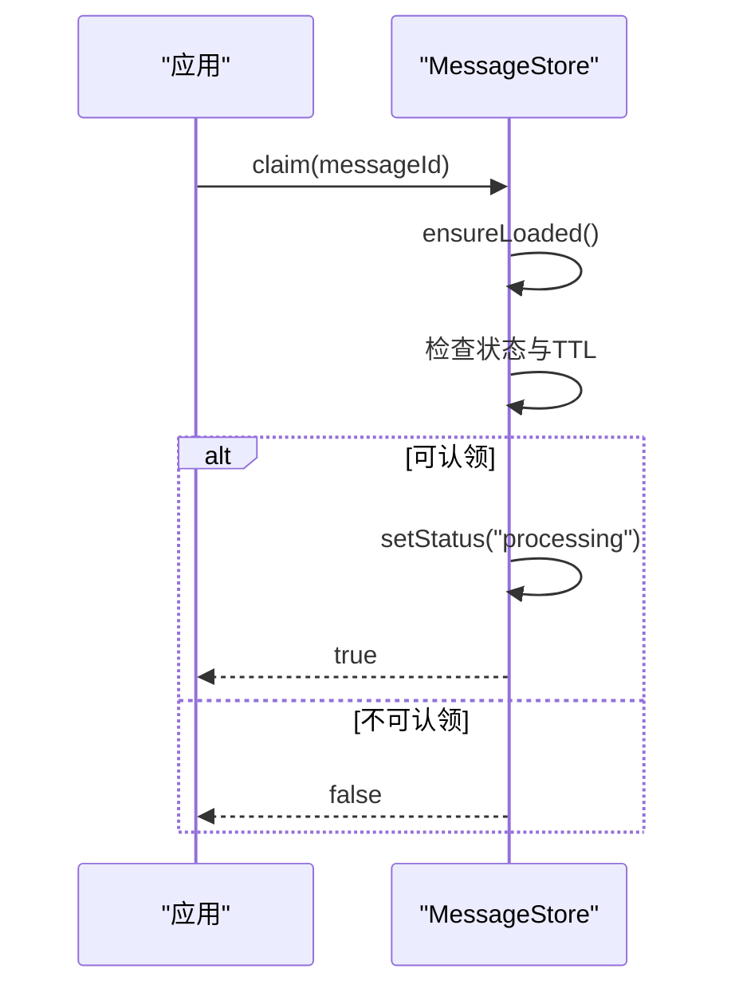
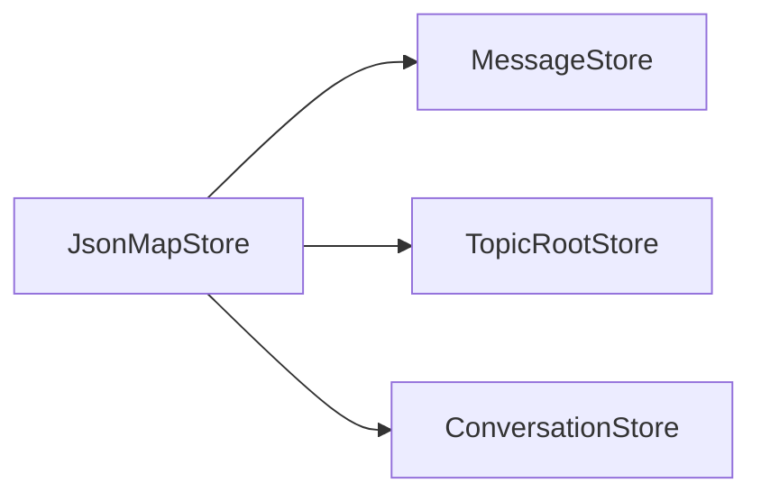

# JSON 存储工具

<cite>
**本文引用的文件**
- [json-store.ts](file://src/utils/json-store.ts)
- [message-store.ts](file://src/feishu/message-store.ts)
- [topic-root-store.ts](file://src/feishu/topic-root-store.ts)
- [conversation-store.ts](file://src/runtime/conversation-store.ts)
- [data-management.md](file://docs/data-management.md)
- [reliability.test.ts](file://test/reliability.test.ts)
</cite>

## 目录
1. [简介](#简介)
2. [项目结构](#项目结构)
3. [核心组件](#核心组件)
4. [架构总览](#架构总览)
5. [详细组件分析](#详细组件分析)
6. [依赖关系分析](#依赖关系分析)
7. [性能与内存管理](#性能与内存管理)
8. [故障排查指南](#故障排查指南)
9. [结论](#结论)
10. [附录：自定义实现指南](#附录自定义实现指南)

## 简介
本仓库提供了一套基于 JSON 文件的键值对持久化方案，核心是 JsonMapStore 基类。它实现了懒加载、并发安全的串行写入、原子替换落盘等机制，并在此基础上派生出三个具体存储：消息状态存储、话题根映射存储、会话到 Session 文件的映射存储。该方案适用于小型进程内缓存 + 轻量级磁盘持久化的场景，具备简单、可靠、易扩展的特点。

## 项目结构
围绕 JSON 存储的关键代码集中在 utils 与 feishu、runtime 模块中：
- 基类：utils/json-store.ts
- 具体实现：
  - feishu/message-store.ts（消息处理状态）
  - feishu/topic-root-store.ts（话题根映射）
  - runtime/conversation-store.ts（会话到 Session 文件映射）
- 数据管理与清理策略参考：docs/data-management.md
- 可靠性测试用例：test/reliability.test.ts

图表来源
- [json-store.ts:10-56](file://src/utils/json-store.ts#L10-L56)
- [message-store.ts:14-47](file://src/feishu/message-store.ts#L14-L47)
- [topic-root-store.ts:8-25](file://src/feishu/topic-root-store.ts#L8-L25)
- [conversation-store.ts:12-29](file://src/runtime/conversation-store.ts#L12-L29)

章节来源
- [json-store.ts:1-57](file://src/utils/json-store.ts#L1-L57)
- [message-store.ts:1-49](file://src/feishu/message-store.ts#L1-L49)
- [topic-root-store.ts:1-27](file://src/feishu/topic-root-store.ts#L1-L27)
- [conversation-store.ts:1-31](file://src/runtime/conversation-store.ts#L1-L31)

## 核心组件
- JsonMapStore<V>：抽象基类，维护内存 Map、懒加载、串行写队列、原子替换落盘。对外暴露 protected 的 remove、ensureLoaded、persist，供子类复用。
- MessageStore：在基类之上封装消息状态机（processing/completed/failed），支持“原子认领”避免重复执行，内置处理超时容忍。
- TopicRootStore：维护 chatId -> rootMessageId 的映射，用于首条无 threadId 的消息收敛到同一会话。
- ConversationStore：维护 conversationId -> sessionFile 的映射，并提供 set/get/delete 操作。

章节来源
- [json-store.ts:10-56](file://src/utils/json-store.ts#L10-L56)
- [message-store.ts:14-47](file://src/feishu/message-store.ts#L14-L47)
- [topic-root-store.ts:8-25](file://src/feishu/topic-root-store.ts#L8-L25)
- [conversation-store.ts:12-29](file://src/runtime/conversation-store.ts#L12-L29)

## 架构总览
JsonMapStore 通过以下机制保证一致性与并发安全：
- 懒加载：首次访问时读取 JSON 文件到内存 Map；若文件不存在则按空映射处理。
- 并发读保护：loadPromise 去重，避免并发重复 IO。
- 串行写队列：所有写操作进入 Promise 链，顺序执行，避免竞态。
- 原子替换：先写临时文件再 rename 覆盖目标文件，避免读到半写文件。

图表来源
- [json-store.ts:33-55](file://src/utils/json-store.ts#L33-L55)

## 详细组件分析

### JsonMapStore 基类
- 设计要点
  - 内存模型：records: Map<string, V>，线程安全由单线程事件循环保障。
  - 懒加载：ensureLoaded 仅在首次需要时读取文件，后续直接命中内存。
  - 并发控制：writeQueue 将多次写入合并为串行队列；loadPromise 防止并发重复读取。
  - 原子写：临时文件 + rename 确保读端不会看到部分写入。
- 复杂度
  - 读：O(N) 解析 JSON（N 为记录数）。
  - 写：O(N) 序列化 + O(1) rename。
- 错误处理
  - 文件不存在视为空映射。
  - 其他 IO/JSON 解析错误向上抛出，由调用方决定重试或降级。

图表来源
- [json-store.ts:33-45](file://src/utils/json-store.ts#L33-L45)

章节来源
- [json-store.ts:10-56](file://src/utils/json-store.ts#L10-L56)

### MessageStore（消息状态存储）
- 功能
  - claim：原子认领一条消息，若已完成或在 TTL 内仍处理中则拒绝。
  - complete/fail：更新状态并落盘。
- 并发与一致性
  - 通过 ensureLoaded + 串行 persist 保证状态变更有序持久化。
  - processingTtlMs 允许“卡住”的消息被重新认领，提高鲁棒性。
- 使用场景
  - 避免重复投递导致重复执行 Agent。

图表来源
- [message-store.ts:24-47](file://src/feishu/message-store.ts#L24-L47)
- [json-store.ts:33-55](file://src/utils/json-store.ts#L33-L55)

章节来源
- [message-store.ts:1-49](file://src/feishu/message-store.ts#L1-L49)

### TopicRootStore（话题根映射）
- 功能
  - get/set/clear：维护 chatId -> rootMessageId 的映射，帮助首条消息收敛到同一会话。
- 特性
  - 继承基类的懒加载与原子写，保证多消息到达时的会话归属稳定。

章节来源
- [topic-root-store.ts:1-27](file://src/feishu/topic-root-store.ts#L1-L27)

### ConversationStore（会话映射）
- 功能
  - get/set/delete：维护 conversationId -> sessionFile 的映射，便于快速定位 Pi Session 文件。
- 特性
  - 继承基类能力，保证映射的持久化与一致性。

章节来源
- [conversation-store.ts:1-31](file://src/runtime/conversation-store.ts#L1-L31)

## 依赖关系分析
- 模块耦合
  - 三个具体 Store 均依赖 JsonMapStore，形成清晰的“基类-实现”分层。
  - 业务逻辑仅关心各自 Store 的领域方法，不感知底层 IO 细节。
- 外部依赖
  - Node.js fs/promises 与 path 模块用于文件读写与路径拼接。
- 潜在风险
  - 大文件 JSON 的序列化/反序列化开销随记录数线性增长。
  - 单写队列在高并发写场景下可能成为瓶颈。

图表来源
- [json-store.ts:10-56](file://src/utils/json-store.ts#L10-L56)
- [message-store.ts:14-47](file://src/feishu/message-store.ts#L14-L47)
- [topic-root-store.ts:8-25](file://src/feishu/topic-root-store.ts#L8-L25)
- [conversation-store.ts:12-29](file://src/runtime/conversation-store.ts#L12-L29)

章节来源
- [json-store.ts:10-56](file://src/utils/json-store.ts#L10-L56)

## 性能与内存管理
- 懒加载减少冷启动 IO
  - 仅在首次访问时读取文件，避免不必要的磁盘开销。
- 串行写队列降低竞争
  - 将高频写合并为顺序执行，避免频繁 rename 与锁争用。
- 原子替换提升可读性
  - 临时文件 + rename 保证读端始终看到完整快照。
- 内存占用
  - 所有记录驻留内存 Map，适合中小规模数据；超大数据需考虑分片或分页。
- 建议优化
  - 批量更新：在业务层合并多次 set，减少 persist 次数。
  - 定期压缩：对超大 JSON 进行离线压缩或迁移至更合适的格式。
  - 监控指标：记录每次持久化耗时与文件大小变化，辅助容量规划。

[本节为通用性能建议，不直接分析特定文件]

## 故障排查指南
- 常见问题
  - 首次运行无文件：ensureLoaded 会按空映射处理，属预期行为。
  - 并发重复执行：使用 MessageStore.claim 的 TTL 机制避免重复认领。
  - 数据不一致：确认是否存在多个进程同时写同一文件（当前实现假设单进程）。
- 恢复策略
  - 损坏文件：删除后重建（注意备份），或从最近可用快照恢复。
  - 卡住消息：可通过清理任务识别并清理长时间 processing 的记录。
- 验证方式
  - 单元测试覆盖：如可靠性测试验证了“只认领一次”和“会话映射持久化”。

章节来源
- [json-store.ts:33-45](file://src/utils/json-store.ts#L33-L45)
- [message-store.ts:24-47](file://src/feishu/message-store.ts#L24-L47)
- [reliability.test.ts:39-55](file://test/reliability.test.ts#L39-L55)

## 结论
JsonMapStore 以极简的方式提供了可靠的 JSON 键值对持久化能力，结合懒加载、串行写与原子替换，满足大多数中小型场景的一致性需求。在其之上派生的三个 Store 覆盖了消息状态、话题根与会话映射等关键领域，具备良好的可扩展性与可维护性。对于更大规模或更高并发场景，可在现有基础上引入分片、增量持久化或更高级的存储后端。

[本节为总结性内容，不直接分析特定文件]

## 附录：自定义实现指南
- 如何扩展
  - 继承 JsonMapStore<V>，定义自己的 Record 类型。
  - 在构造函数中传入持久化文件路径。
  - 复用 ensureLoaded/persist/remove，组合出领域方法（如 get/set/delete）。
- 最佳实践
  - 保持 Record 尽量小且可序列化，避免嵌套过深。
  - 将高频写操作合并，减少持久化频率。
  - 为异常路径增加日志与告警，便于定位问题。
- 版本兼容与迁移
  - 当前实现未内置版本字段与迁移逻辑。建议在 Record 中加入 version 字段，并在加载时根据版本做兼容转换。
  - 迁移策略：先向后兼容读取旧格式，再逐步淘汰旧字段。
- 事务与回滚
  - 当前无显式事务。如需强一致，可在业务层构造新 Map，完成后一次性 replace 整个 records，再触发一次持久化。
- 缓存策略
  - 已在基类层面实现内存缓存（records）。如需跨进程共享，可结合外部缓存（如 Redis）作为热点数据的二级缓存。
- 示例参考
  - 参考 MessageStore、TopicRootStore、ConversationStore 的实现模式，快速搭建新的存储类型。

[本节为通用指导，不直接分析特定文件]