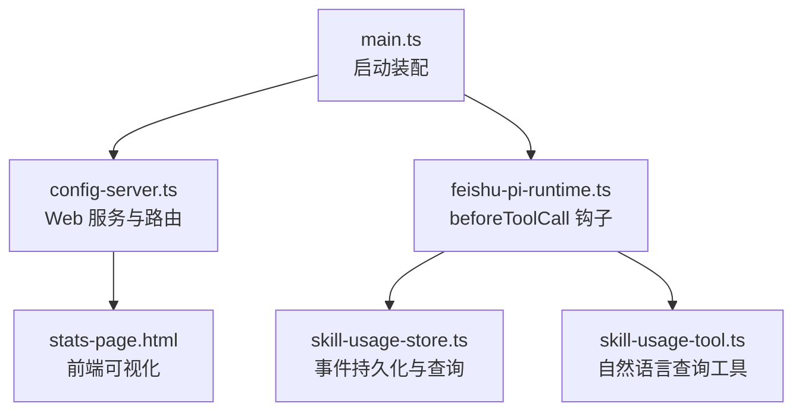
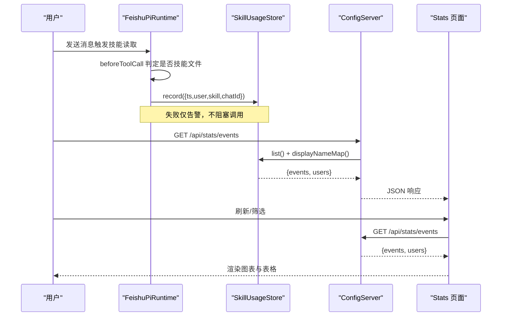
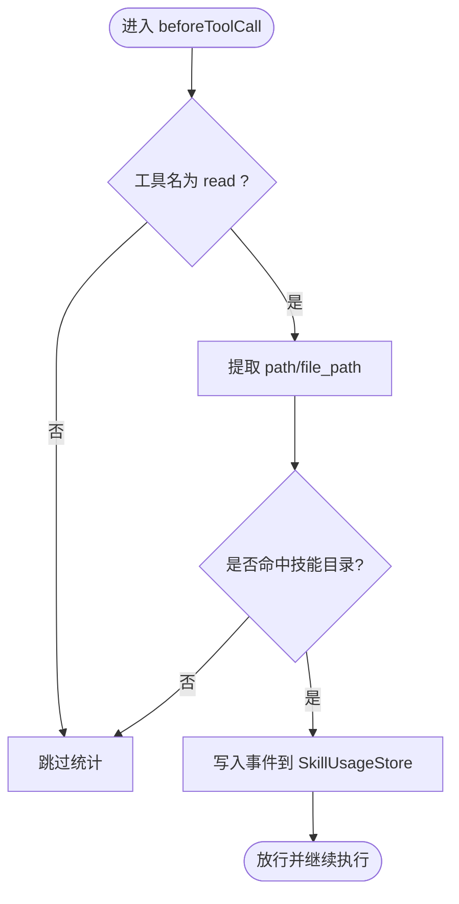
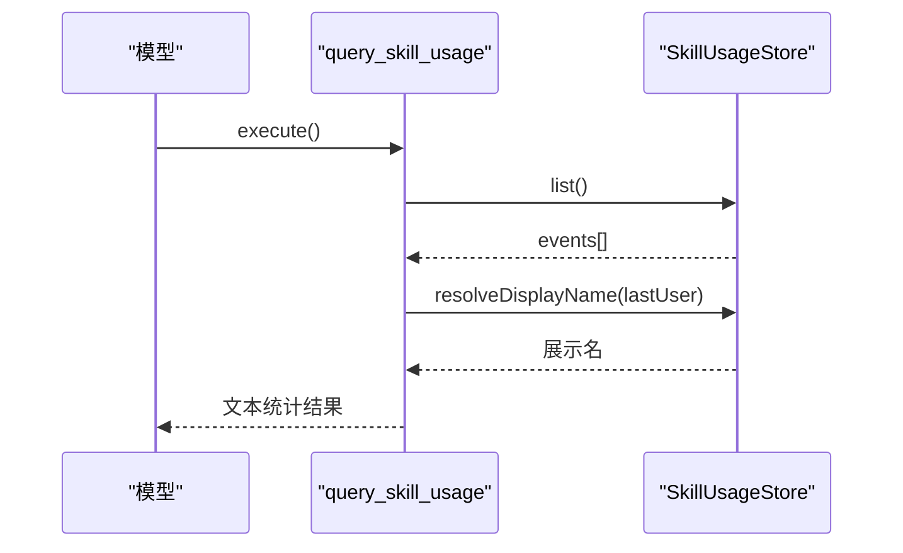
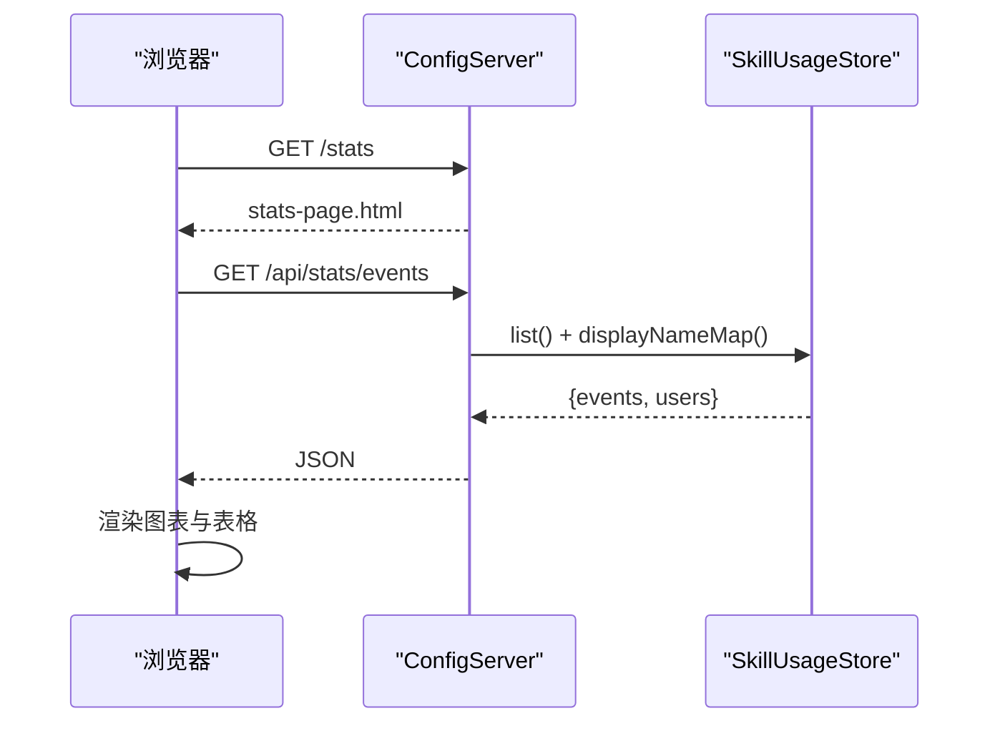
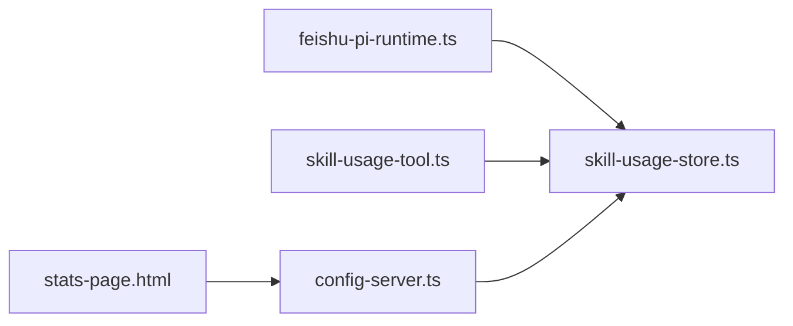

# 技能使用统计

<cite>
**本文引用的文件**
- [src/main.ts](file://src/main.ts)
- [src/config-server.ts](file://src/config-server.ts)
- [src/stats/skill-usage-tool.ts](file://src/stats/skill-usage-tool.ts)
- [src/stats-page.html](file://src/stats-page.html)
- [src/runtime/feishu-pi-runtime.ts](file://src/runtime/feishu-pi-runtime.ts)
- [test/skill-usage.test.ts](file://test/skill-usage.test.ts)
- [package.json](file://package.json)
</cite>

## 目录
1. [简介](#简介)
2. [项目结构](#项目结构)
3. [核心组件](#核心组件)
4. [架构总览](#架构总览)
5. [详细组件分析](#详细组件分析)
6. [依赖关系分析](#依赖关系分析)
7. [性能与可扩展性](#性能与可扩展性)
8. [故障排查指南](#故障排查指南)
9. [结论](#结论)
10. [附录：接口与配置](#附录接口与配置)

## 简介
本系统为飞书 Agent 平台提供“技能使用统计”能力，围绕以下目标实现：
- 自动记录技能（Skills）被读取的调用事件，形成独立、长期留存的事件流。
- 提供自然语言查询入口（飞书内），以及本地可视化报表页面。
- 支持按时间窗口、用户、技能等维度进行聚合分析与展示。
- 通过轻量 HTTP API 暴露统计数据，便于前端渲染与二次集成。

该统计不依赖会话生命周期，避免 session 清理导致的数据丢失；同时与权限策略解耦，仅对实际执行成功的技能读取行为计数。

## 项目结构
与技能使用统计直接相关的代码分布在以下模块：
- 运行时钩子：在工具调用前判定是否命中技能读取并记录事件。
- 存储与查询：事件追加写入 JSONL 文件，并提供列表与展示名解析。
- 查询工具：在飞书对话中通过自然语言触发统计查询。
- Web 服务：提供 /stats 页面与 /api/stats/events 数据接口。
- 启动装配：主进程创建存储实例并注册路由。

图表来源
- [src/main.ts:171-177](file://src/main.ts#L171-L177)
- [src/config-server.ts:127-143](file://src/config-server.ts#L127-L143)
- [src/runtime/feishu-pi-runtime.ts:226-259](file://src/runtime/feishu-pi-runtime.ts#L226-L259)
- [src/stats/skill-usage-tool.ts:46-99](file://src/stats/skill-usage-tool.ts#L46-L99)
- [src/stats-page.html:175-187](file://src/stats-page.html#L175-L187)

章节来源
- [src/main.ts:171-177](file://src/main.ts#L171-L177)
- [src/config-server.ts:127-143](file://src/config-server.ts#L127-L143)
- [src/runtime/feishu-pi-runtime.ts:226-259](file://src/runtime/feishu-pi-runtime.ts#L226-L259)
- [src/stats/skill-usage-tool.ts:46-99](file://src/stats/skill-usage-tool.ts#L46-L99)
- [src/stats-page.html:175-187](file://src/stats-page.html#L175-L187)

## 核心组件
- 运行时钩子（beforeToolCall）：拦截 read 工具调用，判断是否为技能文件读取；若是则记录事件。
- 事件存储（SkillUsageStore）：以 JSONL 追加写方式持久化事件，支持从文件恢复；提供展示名解析。
- 查询工具（query_skill_usage）：在飞书对话中返回统计概览、技能排行、最近使用者与个人使用情况。
- Web 服务（/stats, /api/stats/events）：提供静态统计页面与原始事件+用户映射的 JSON 接口。
- 前端可视化（stats-page.html）：基于原生 HTML/JS 渲染柱状图、排行榜与明细表，支持多维度筛选。

章节来源
- [src/runtime/feishu-pi-runtime.ts:226-259](file://src/runtime/feishu-pi-runtime.ts#L226-L259)
- [src/stats/skill-usage-tool.ts:46-99](file://src/stats/skill-usage-tool.ts#L46-L99)
- [src/config-server.ts:127-143](file://src/config-server.ts#L127-L143)
- [src/stats-page.html:175-187](file://src/stats-page.html#L175-L187)

## 架构总览
整体流程分为“采集—存储—查询—展示”四段：
- 采集：在 beforeToolCall 钩子中识别技能读取并写入事件。
- 存储：JSONL 追加式事件流，跨重启可恢复。
- 查询：飞书内自然语言工具与 Web API 双通道。
- 展示：本地浏览器可视化页面，支持多维筛选与聚合。

图表来源
- [src/runtime/feishu-pi-runtime.ts:226-259](file://src/runtime/feishu-pi-runtime.ts#L226-L259)
- [src/config-server.ts:134-141](file://src/config-server.ts#L134-L141)
- [src/stats-page.html:175-187](file://src/stats-page.html#L175-L187)

## 详细组件分析

### 技能读取事件采集（beforeToolCall）
- 触发点：Agent 调用内置 read 工具时。
- 判定逻辑：
  - 提取路径参数（path/file_path）。
  - 若路径匹配技能目录（.agent/skills/**、.pi/skills/**、.agents/skills/**），则视为技能读取。
  - 仅在范围内且未被拦截的情况下记录事件。
- 记录内容：时间戳、用户 Open ID、技能名、会话 chatId。
- 容错：记录失败仅记录警告日志，不影响主流程。

图表来源
- [src/runtime/feishu-pi-runtime.ts:233-259](file://src/runtime/feishu-pi-runtime.ts#L233-L259)

章节来源
- [src/runtime/feishu-pi-runtime.ts:233-259](file://src/runtime/feishu-pi-runtime.ts#L233-L259)

### 事件存储与展示名解析
- 存储格式：JSONL（每行一条事件），追加写，支持跨重启恢复。
- 展示名解析：优先英文名，其次中文名，最后回退到 Open ID；来自用户缓存文件。
- 测试覆盖：包括事件读写、跨重启恢复、展示名优先级与缺失回退。

章节来源
- [test/skill-usage.test.ts:47-85](file://test/skill-usage.test.ts#L47-L85)

### 自然语言查询工具（query_skill_usage）
- 入口：在飞书对话中由模型根据意图调用。
- 功能：
  - 输出累计次数、涉及技能数、用户数、近 7 天次数。
  - 技能排行 Top N（次数、人数、最近使用时间、最近使用者）。
  - 当前调用者的个人使用情况汇总。
- 展示名：通过存储层解析用户展示名。

图表来源
- [src/stats/skill-usage-tool.ts:46-99](file://src/stats/skill-usage-tool.ts#L46-L99)

章节来源
- [src/stats/skill-usage-tool.ts:46-99](file://src/stats/skill-usage-tool.ts#L46-L99)
- [test/skill-usage.test.ts:87-128](file://test/skill-usage.test.ts#L87-L128)

### Web 统计页面与 API
- 页面：/stats 提供可视化界面，包含时间粒度切换、范围筛选、用户/技能多选、图表与表格。
- 接口：/api/stats/events 返回全部事件与用户展示名映射，筛选与聚合在前端完成。
- 安全：服务仅监听本机回环地址，避免外部访问。

图表来源
- [src/config-server.ts:127-143](file://src/config-server.ts#L127-L143)
- [src/stats-page.html:175-187](file://src/stats-page.html#L175-L187)

章节来源
- [src/config-server.ts:127-143](file://src/config-server.ts#L127-L143)
- [src/stats-page.html:175-187](file://src/stats-page.html#L175-L187)

### 启动装配与数据路径
- 主进程创建 SkillUsageStore 实例，指定事件文件与用户缓存文件路径。
- 注册统计路由，使 /stats 与 /api/stats/events 可用。
- 数据目录位于 data/stats/ 下，独立于会话数据，不参与 7 天清理。

章节来源
- [src/main.ts:171-177](file://src/main.ts#L171-L177)

## 依赖关系分析
- 运行时依赖：FeishuPiRuntime 在 beforeToolCall 中调用 SkillUsageStore 记录事件。
- 查询依赖：query_skill_usage 工具依赖 SkillUsageStore 获取事件与展示名。
- Web 依赖：ConfigServer 依赖 SkillUsageStore 提供 /api/stats/events。
- 前端依赖：stats-page.html 通过 fetch 调用 /api/stats/events 进行渲染。

图表来源
- [src/runtime/feishu-pi-runtime.ts:226-259](file://src/runtime/feishu-pi-runtime.ts#L226-L259)
- [src/stats/skill-usage-tool.ts:46-99](file://src/stats/skill-usage-tool.ts#L46-L99)
- [src/config-server.ts:127-143](file://src/config-server.ts#L127-L143)
- [src/stats-page.html:175-187](file://src/stats-page.html#L175-L187)

章节来源
- [src/runtime/feishu-pi-runtime.ts:226-259](file://src/runtime/feishu-pi-runtime.ts#L226-L259)
- [src/stats/skill-usage-tool.ts:46-99](file://src/stats/skill-usage-tool.ts#L46-L99)
- [src/config-server.ts:127-143](file://src/config-server.ts#L127-L143)
- [src/stats-page.html:175-187](file://src/stats-page.html#L175-L187)

## 性能与可扩展性
- 写入性能：JSONL 追加写，低开销；适合高频事件流。
- 读取性能：全量加载至内存，适用于中小规模数据集；前端按需筛选与聚合。
- 扩展建议：
  - 当事件量增长到较大规模时，可在后端增加分页或时间范围过滤接口。
  - 可增加后台任务将历史事件归档或转存至数据库，提升查询性能。
  - 前端图表已做基础优化（补零、限制键数量），可按需引入更高效的渲染库。

[本节为通用指导，不直接分析具体文件]

## 故障排查指南
- 无统计数据：
  - 确认技能文件路径是否命中技能目录规则。
  - 检查 beforeToolCall 是否成功记录事件（查看日志中的警告信息）。
- 展示名不正确：
  - 检查用户缓存文件是否存在且格式正确。
  - 确认展示名解析优先级（英文名 > 中文名 > Open ID）。
- Web 页面无法加载：
  - 确认服务仅监听本机回环地址，确保从本机浏览器访问。
  - 检查 /api/stats/events 是否能返回数据。

章节来源
- [src/runtime/feishu-pi-runtime.ts:251-256](file://src/runtime/feishu-pi-runtime.ts#L251-L256)
- [test/skill-usage.test.ts:63-85](file://test/skill-usage.test.ts#L63-L85)
- [src/config-server.ts:145-149](file://src/config-server.ts#L145-L149)

## 结论
本系统通过“运行时钩子 + JSONL 事件流 + 自然语言查询 + 本地可视化”的组合，实现了稳定、可审计、易用的技能使用统计能力。其设计将统计与会话生命周期解耦，保证数据的长期性与一致性；同时提供灵活的查询与展示方式，满足日常协作与分析需求。

[本节为总结性内容，不直接分析具体文件]

## 附录：接口与配置

### 数据模型与存储格式
- 事件字段：
  - ts：时间戳（毫秒）
  - user：用户 Open ID
  - skill：技能名称
  - chatId：会话标识（可选）
- 存储位置：data/stats/skill-usage.jsonl（追加式 JSONL）
- 用户展示名来源：data/users/{appId}_users.json（英文名 > 中文名 > Open ID）

章节来源
- [src/main.ts:171-177](file://src/main.ts#L171-L177)
- [test/skill-usage.test.ts:47-85](file://test/skill-usage.test.ts#L47-L85)

### 查询接口
- GET /stats：返回统计页面 HTML。
- GET /api/stats/events：返回 { events, users }。
  - events：事件数组
  - users：openId -> 展示名映射

章节来源
- [src/config-server.ts:127-143](file://src/config-server.ts#L127-L143)

### 前端可视化能力
- 时间粒度：日、月、年
- 时间范围：近 7/30/90 天、全部、自定义区间
- 筛选维度：用户多选、技能隐藏多选
- 展示内容：
  - 总使用次数、活跃用户、涉及技能、最近使用时间
  - 按时间分组的柱状图
  - 技能排行、用户排行
  - 调用明细表（月份 × 用户 × 技能）

章节来源
- [src/stats-page.html:54-114](file://src/stats-page.html#L54-L114)
- [src/stats-page.html:244-274](file://src/stats-page.html#L244-L274)
- [src/stats-page.html:276-383](file://src/stats-page.html#L276-L383)

### 运行与安装
- 启动命令：npm start
- 开发命令：npm run dev
- 配置命令：npm run config（启动本地配置服务器）

章节来源
- [package.json:6-12](file://package.json#L6-L12)