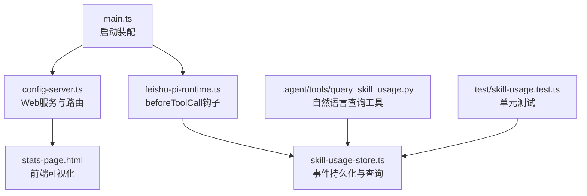
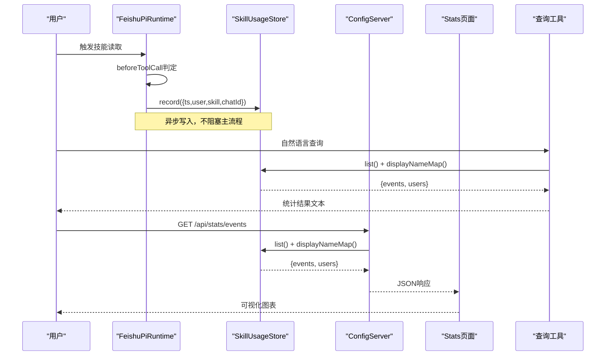
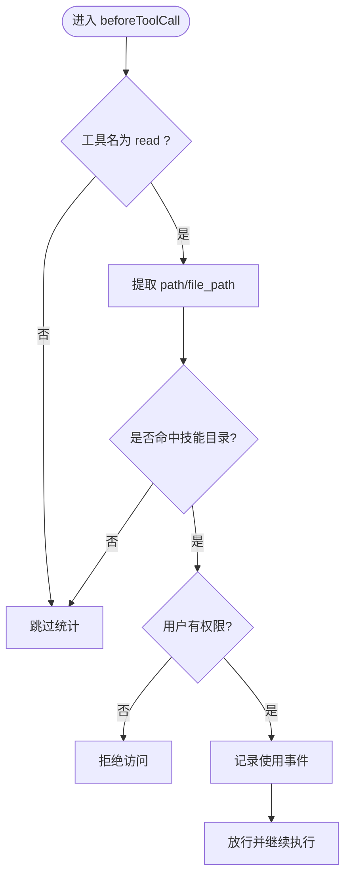
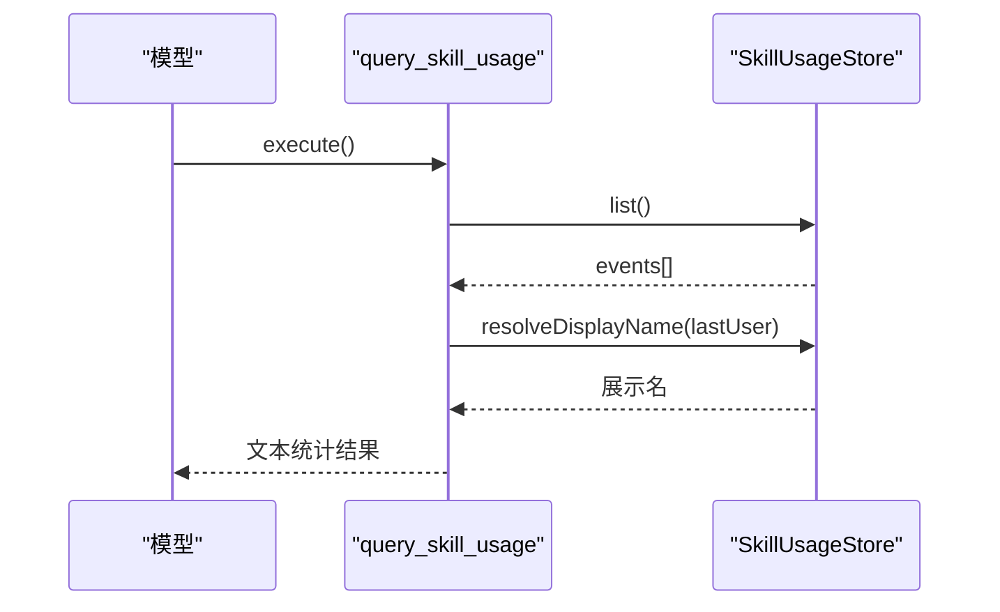
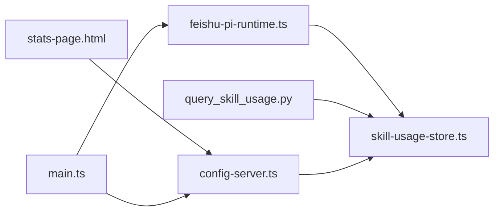

# 技能使用统计

<cite>
**本文引用的文件**
- [src/main.ts](file://src/main.ts)
- [src/config-server.ts](file://src/config-server.ts)
- [src/stats/skill-usage-store.ts](file://src/stats/skill-usage-store.ts)
- [src/stats-page.html](file://src/stats-page.html)
- [src/runtime/feishu-pi-runtime.ts](file://src/runtime/feishu-pi-runtime.ts)
- [.agent/tools/query_skill_usage.py](file://.agent/tools/query_skill_usage.py)
- [test/skill-usage.test.ts](file://test/skill-usage.test.ts)
- [package.json](file://package.json)
</cite>

## 更新摘要
**所做更改**
- 更新了技能使用统计系统的整体架构描述
- 新增了自然语言查询工具的详细说明
- 完善了事件采集机制的实现细节
- 增强了数据存储和查询接口的文档
- 添加了完整的测试覆盖说明

## 目录
1. [简介](#简介)
2. [项目结构](#项目结构)
3. [核心组件](#核心组件)
4. [架构总览](#架构总览)
5. [详细组件分析](#详细组件分析)
6. [依赖关系分析](#依赖关系分析)
7. [性能与可扩展性](#性能与可扩展性)
8. [故障排查指南](#故障排查指南)
9. [结论](#结论)
10. [附录：接口与配置](#附录接口与配置)

## 简介
技能使用统计系统是 mini-claw 平台的独立功能模块，提供技能调用事件的完整生命周期管理。该系统通过以下核心能力实现：

- **事件采集**：在工具调用前拦截技能读取行为，记录用户、技能、时间等关键信息
- **持久化存储**：采用 JSONL 格式的事件流，支持跨重启数据恢复
- **多维查询**：提供自然语言查询工具和 Web 可视化界面
- **统计分析**：支持按时间窗口、用户、技能等维度进行聚合分析

该设计确保统计数据与会话生命周期解耦，避免 session 清理导致的数据丢失，同时为技能热度分析和资源消耗监控提供可靠数据基础。

## 项目结构
技能使用统计系统由以下核心模块组成：

**图表来源**
- [src/main.ts:174-180](file://src/main.ts#L174-L180)
- [src/config-server.ts:56-77](file://src/config-server.ts#L56-L77)
- [src/runtime/feishu-pi-runtime.ts:200-220](file://src/runtime/feishu-pi-runtime.ts#L200-L220)
- [src/stats/skill-usage-store.ts:67-157](file://src/stats/skill-usage-store.ts#L67-L157)
- [.agent/tools/query_skill_usage.py:1-145](file://.agent/tools/query_skill_usage.py#L1-L145)

**章节来源**
- [src/main.ts:174-180](file://src/main.ts#L174-L180)
- [src/config-server.ts:56-77](file://src/config-server.ts#L56-L77)
- [src/runtime/feishu-pi-runtime.ts:200-220](file://src/runtime/feishu-pi-runtime.ts#L200-L220)

## 核心组件

### 事件存储层 (SkillUsageStore)
- **JSONL 事件流**：采用追加写模式，每行一条事件记录
- **内存缓存**：首次加载后缓存至内存，提升查询性能
- **用户展示名解析**：支持英文名 > 中文名 > Open ID 的优先级显示
- **容错机制**：写入失败仅告警，不影响主流程执行

### 事件采集层 (beforeToolCall)
- **智能识别**：自动识别技能文件读取操作
- **权限验证**：仅在用户有权限访问的技能范围内记录
- **上下文捕获**：记录用户ID、技能名称、会话信息等关键上下文

### 查询与展示层
- **自然语言查询**：通过 Python 脚本提供对话式统计查询
- **Web 可视化**：提供交互式统计页面，支持多维度筛选
- **REST API**：暴露标准接口供外部系统集成

**章节来源**
- [src/stats/skill-usage-store.ts:67-157](file://src/stats/skill-usage-store.ts#L67-L157)
- [src/runtime/feishu-pi-runtime.ts:200-220](file://src/runtime/feishu-pi-runtime.ts#L200-L220)
- [.agent/tools/query_skill_usage.py:13-108](file://.agent/tools/query_skill_usage.py#L13-L108)

## 架构总览
技能使用统计系统采用分层架构设计，实现关注点分离和高内聚低耦合：

**图表来源**
- [src/runtime/feishu-pi-runtime.ts:200-220](file://src/runtime/feishu-pi-runtime.ts#L200-L220)
- [src/config-server.ts:67-75](file://src/config-server.ts#L67-L75)
- [.agent/tools/query_skill_usage.py:111-137](file://.agent/tools/query_skill_usage.py#L111-L137)

## 详细组件分析

### 技能读取事件采集 (beforeToolCall)
系统在工具调用前插入拦截逻辑，精准识别技能文件读取行为：

- **触发条件**：工具名为 `read` 且参数包含路径信息
- **路径匹配**：支持 `.agent/skills/` 目录下的 `.md` 文件
- **权限检查**：仅在用户有读取权限时记录事件
- **上下文捕获**：记录时间戳、用户ID、技能名、会话ID

**图表来源**
- [src/runtime/feishu-pi-runtime.ts:203-220](file://src/runtime/feishu-pi-runtime.ts#L203-L220)
- [src/stats/skill-usage-store.ts:39-61](file://src/stats/skill-usage-store.ts#L39-L61)

**章节来源**
- [src/runtime/feishu-pi-runtime.ts:203-220](file://src/runtime/feishu-pi-runtime.ts#L203-L220)
- [src/stats/skill-usage-store.ts:39-61](file://src/stats/skill-usage-store.ts#L39-L61)

### 事件存储与查询 (SkillUsageStore)
采用高性能的 JSONL 事件流存储方案：

- **追加写模式**：新事件直接追加到文件末尾，避免锁竞争
- **内存缓存**：首次加载后缓存全部事件，后续查询直接从内存返回
- **懒加载机制**：按需加载文件内容，减少启动开销
- **用户映射**：维护用户展示名映射表，支持实时刷新

**章节来源**
- [src/stats/skill-usage-store.ts:67-157](file://src/stats/skill-usage-store.ts#L67-L157)
- [test/skill-usage.test.ts:47-85](file://test/skill-usage.test.ts#L47-L85)

### 自然语言查询工具 (query_skill_usage)
提供对话式的统计查询能力：

- **累计统计**：总使用次数、涉及技能数、活跃用户数
- **技能排行**：Top N 技能的使用频率、使用人数、最近使用时间
- **个人统计**：当前用户的技能使用情况汇总
- **时间筛选**：支持近 7 天的快速筛选

**图表来源**
- [.agent/tools/query_skill_usage.py:111-137](file://.agent/tools/query_skill_usage.py#L111-L137)
- [src/stats/skill-usage-store.ts:126-140](file://src/stats/skill-usage-store.ts#L126-L140)

**章节来源**
- [.agent/tools/query_skill_usage.py:13-108](file://.agent/tools/query_skill_usage.py#L13-L108)
- [src/stats/skill-usage-store.ts:126-140](file://src/stats/skill-usage-store.ts#L126-L140)

### Web 统计页面与 API
提供完整的可视化统计界面：

- **交互界面**：支持时间粒度切换、范围筛选、用户/技能多选
- **图表展示**：柱状图、排行榜、明细表等多种可视化形式
- **实时刷新**：支持手动刷新获取最新数据
- **安全访问**：仅监听本机回环地址，防止外部访问

**章节来源**
- [src/config-server.ts:56-77](file://src/config-server.ts#L56-L77)
- [src/stats-page.html:54-114](file://src/stats-page.html#L54-L114)
- [src/stats-page.html:175-187](file://src/stats-page.html#L175-L187)

### 启动装配与数据路径
系统启动时的初始化流程：

- **实例创建**：主进程创建 SkillUsageStore 实例，指定事件文件和用户缓存文件路径
- **路由注册**：注册 `/stats` 和 `/api/stats/events` 路由
- **数据隔离**：统计数据位于 `data/stats/` 目录，不参与 7 天清理策略

**章节来源**
- [src/main.ts:174-180](file://src/main.ts#L174-L180)

## 依赖关系分析
技能使用统计系统与其他模块的依赖关系：

**图表来源**
- [src/runtime/feishu-pi-runtime.ts:200-220](file://src/runtime/feishu-pi-runtime.ts#L200-L220)
- [.agent/tools/query_skill_usage.py:111-137](file://.agent/tools/query_skill_usage.py#L111-L137)
- [src/config-server.ts:56-77](file://src/config-server.ts#L56-L77)
- [src/main.ts:174-180](file://src/main.ts#L174-L180)

**章节来源**
- [src/runtime/feishu-pi-runtime.ts:200-220](file://src/runtime/feishu-pi-runtime.ts#L200-L220)
- [.agent/tools/query_skill_usage.py:111-137](file://.agent/tools/query_skill_usage.py#L111-L137)
- [src/config-server.ts:56-77](file://src/config-server.ts#L56-L77)

## 性能与可扩展性
系统设计充分考虑了性能和扩展性需求：

### 性能优化
- **异步写入**：事件写入采用异步队列，避免阻塞主流程
- **内存缓存**：首次加载后缓存至内存，提升查询性能
- **增量更新**：用户缓存文件支持 mtime 检测，按需重新加载

### 扩展建议
- **大数据量优化**：当事件量增长到较大规模时，可增加分页或时间范围过滤接口
- **数据库迁移**：可考虑将历史事件归档至数据库，提升查询性能
- **实时监控**：可增加后台任务监控事件写入状态和存储使用情况

## 故障排查指南

### 常见问题诊断
- **无统计数据**：
  - 确认技能文件路径是否命中技能目录规则
  - 检查 beforeToolCall 是否成功记录事件
  - 验证事件文件是否存在于 `data/stats/skill-usage.jsonl`

- **展示名不正确**：
  - 检查用户缓存文件格式和内容
  - 确认展示名解析优先级（英文名 > 中文名 > Open ID）
  - 验证用户缓存文件路径配置正确

- **Web 页面无法加载**：
  - 确认服务监听地址为 `127.0.0.1:3456`
  - 检查 `/api/stats/events` 接口是否正常响应
  - 验证浏览器是否能访问本地服务

**章节来源**
- [src/runtime/feishu-pi-runtime.ts:212-218](file://src/runtime/feishu-pi-runtime.ts#L212-L218)
- [src/stats/skill-usage-store.ts:142-155](file://src/stats/skill-usage-store.ts#L142-L155)
- [src/config-server.ts:79-83](file://src/config-server.ts#L79-L83)

## 结论
技能使用统计系统通过"运行时钩子 + JSONL 事件流 + 自然语言查询 + Web 可视化"的组合，实现了稳定、可审计、易用的技能使用统计能力。其设计将统计与会话生命周期解耦，保证数据的长期性与一致性；同时提供灵活的查询与展示方式，满足日常协作与分析需求。

系统具备以下优势：
- **高可靠性**：异步写入和容错机制确保主流程不受影响
- **高性能**：内存缓存和增量更新优化查询性能
- **易用性**：提供多种查询方式和可视化界面
- **可扩展性**：模块化设计便于功能扩展和性能优化

## 附录：接口与配置

### 数据模型与存储格式
- **事件字段**：
  - `ts`：时间戳（毫秒）
  - `user`：用户 Open ID
  - `skill`：技能名称（文件名去 .md）
  - `chatId`：会话标识（可选）
- **存储位置**：`data/stats/skill-usage.jsonl`（追加式 JSONL）
- **用户展示名来源**：`data/users/{appId}_users.json`

**章节来源**
- [src/stats/skill-usage-store.ts:14-23](file://src/stats/skill-usage-store.ts#L14-L23)
- [src/main.ts:174-180](file://src/main.ts#L174-L180)

### REST API 接口
- **GET /stats**：返回统计页面 HTML
- **GET /api/stats/events**：返回 `{ events, users }`
  - `events`：事件数组
  - `users`：openId -> 展示名映射

**章节来源**
- [src/config-server.ts:63-75](file://src/config-server.ts#L63-L75)

### 前端可视化能力
- **时间粒度**：日、月、年
- **时间范围**：近 7/30/90 天、全部、自定义区间
- **筛选维度**：用户多选、技能隐藏多选
- **展示内容**：
  - 总使用次数、活跃用户、涉及技能、最近使用时间
  - 按时间分组的柱状图
  - 技能排行、用户排行
  - 调用明细表（月份 × 用户 × 技能）

**章节来源**
- [src/stats-page.html:54-114](file://src/stats-page.html#L54-L114)
- [src/stats-page.html:244-274](file://src/stats-page.html#L244-L274)
- [src/stats-page.html:276-383](file://src/stats-page.html#L276-L383)

### 运行与安装
- **启动命令**：`npm start`
- **开发命令**：`npm run dev`
- **配置命令**：`npm run config`（启动本地配置服务器）

**章节来源**
- [package.json:6-12](file://package.json#L6-L12)

### 测试覆盖
系统包含完整的单元测试，覆盖以下场景：
- 技能文件路径匹配逻辑
- 事件存储与恢复
- 用户展示名解析
- 跨重启数据持久化

**章节来源**
- [test/skill-usage.test.ts:10-44](file://test/skill-usage.test.ts#L10-L44)
- [test/skill-usage.test.ts:47-85](file://test/skill-usage.test.ts#L47-L85)