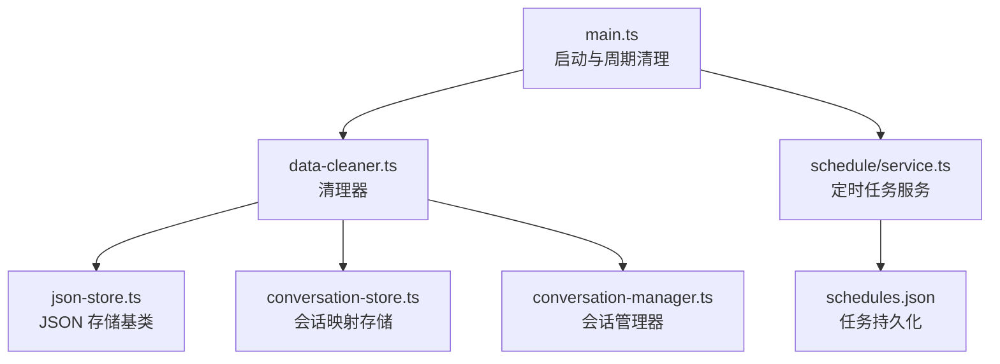
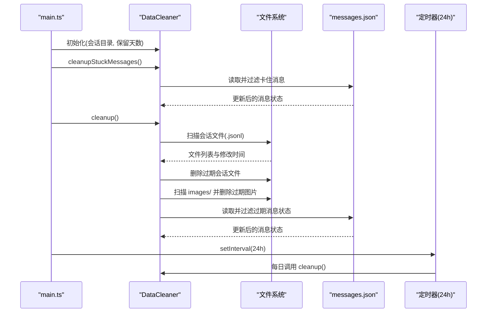
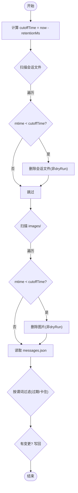
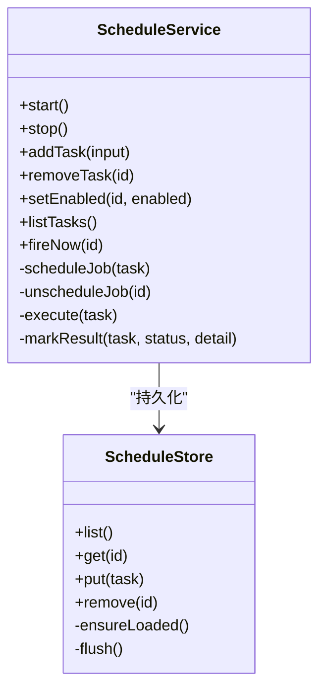
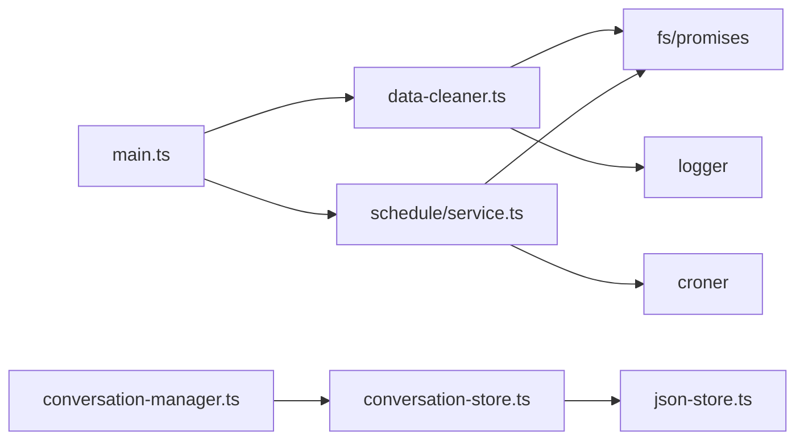

# 数据清理服务

<cite>
**本文引用的文件**
- [src/runtime/data-cleaner.ts](file://src/runtime/data-cleaner.ts)
- [src/schedule/service.ts](file://src/schedule/service.ts)
- [src/main.ts](file://src/main.ts)
- [src/config.ts](file://src/config.ts)
- [src/utils/json-store.ts](file://src/utils/json-store.ts)
- [src/runtime/conversation-manager.ts](file://src/runtime/conversation-manager.ts)
- [src/runtime/conversation-store.ts](file://src/runtime/conversation-store.ts)
- [docs/data-management.md](file://docs/data-management.md)
</cite>

## 目录
1. [简介](#简介)
2. [项目结构](#项目结构)
3. [核心组件](#核心组件)
4. [架构总览](#架构总览)
5. [详细组件分析](#详细组件分析)
6. [依赖关系分析](#依赖关系分析)
7. [性能与内存管理](#性能与内存管理)
8. [故障恢复与监控](#故障恢复与监控)
9. [配置与策略示例](#配置与策略示例)
10. [结论](#结论)

## 简介
本文件面向“数据清理服务”的完整说明，覆盖自动清理机制、会话过期策略、临时文件清理、数据归档范围、任务调度、内存与磁盘优化、可配置规则与保留策略、批量操作、日志记录、监控指标以及故障恢复。目标是帮助读者理解并安全地运维该清理子系统，同时提供调优建议与排障指引。

## 项目结构
数据清理相关代码主要分布在运行时层与调度层：
- 运行时层负责具体清理逻辑（会话文件、图片缓存、消息状态、卡住消息）
- 调度层提供定时任务能力（cron 表达式、持久化、执行与结果记录）
- 主入口负责启动时清理与周期性清理调度
- 通用 JSON 存储基类提供原子写与懒加载能力，支撑消息状态等文件的可靠读写

图表来源
- [src/main.ts:27-60](file://src/main.ts#L27-L60)
- [src/runtime/data-cleaner.ts:30-67](file://src/runtime/data-cleaner.ts#L30-L67)
- [src/schedule/service.ts:105-123](file://src/schedule/service.ts#L105-L123)
- [src/utils/json-store.ts:10-58](file://src/utils/json-store.ts#L10-L58)
- [src/runtime/conversation-store.ts:12-31](file://src/runtime/conversation-store.ts#L12-L31)
- [src/runtime/conversation-manager.ts:23-119](file://src/runtime/conversation-manager.ts#L23-L119)

章节来源
- [src/main.ts:27-60](file://src/main.ts#L27-L60)
- [docs/data-management.md:143-163](file://docs/data-management.md#L143-L163)

## 核心组件
- DataCleaner：实现三类清理（会话 .jsonl、图片缓存、消息状态）与“卡住消息”清理；支持 dryRun 模式用于统计与演练
- ScheduleService：基于 croner 的定时任务调度，任务持久化到 schedules.json，支持启用/停用、立即触发、失败重试与结果记录
- ConversationManager / ConversationStore：会话复用与映射持久化，配合清理器在会话文件被删除后容错重建
- JsonMapStore：提供懒加载、串行写入与原子替换（先写临时文件再 rename），保证并发安全

章节来源
- [src/runtime/data-cleaner.ts:12-67](file://src/runtime/data-cleaner.ts#L12-L67)
- [src/schedule/service.ts:7-25](file://src/schedule/service.ts#L7-L25)
- [src/schedule/service.ts:105-123](file://src/schedule/service.ts#L105-L123)
- [src/runtime/conversation-manager.ts:23-119](file://src/runtime/conversation-manager.ts#L23-L119)
- [src/runtime/conversation-store.ts:12-31](file://src/runtime/conversation-store.ts#L12-L31)
- [src/utils/json-store.ts:10-58](file://src/utils/json-store.ts#L10-L58)

## 架构总览
数据清理服务由“启动时清理 + 每日定时清理”驱动，清理目标包括会话文件、图片缓存与消息状态，并额外处理“卡住的消息”。定时任务服务独立于清理流程，但共享同一进程生命周期，便于统一监控与日志。

图表来源
- [src/main.ts:31-60](file://src/main.ts#L31-L60)
- [src/runtime/data-cleaner.ts:44-67](file://src/runtime/data-cleaner.ts#L44-L67)
- [src/runtime/data-cleaner.ts:69-125](file://src/runtime/data-cleaner.ts#L69-L125)
- [src/runtime/data-cleaner.ts:127-182](file://src/runtime/data-cleaner.ts#L127-L182)

## 详细组件分析

### 数据清理器 DataCleaner
职责
- 清理过期的会话文件（按文件 mtime）
- 清理过期的图片缓存（按文件 mtime）
- 清理过期的消息状态（按 updatedAt）
- 清理卡住的消息（status=processing 且超时）
- 支持 dryRun 仅统计不删除

关键设计
- 保留期以天为单位换算为毫秒阈值，统一作为 cutoffTime
- 对 messages.json 采用“谓词过滤 + 写回”的模式，避免逐条删除带来的频繁 IO
- 异常隔离：单个文件或条目处理失败不影响整体清理流程

图表来源
- [src/runtime/data-cleaner.ts:44-67](file://src/runtime/data-cleaner.ts#L44-L67)
- [src/runtime/data-cleaner.ts:69-125](file://src/runtime/data-cleaner.ts#L69-L125)
- [src/runtime/data-cleaner.ts:127-182](file://src/runtime/data-cleaner.ts#L127-L182)

章节来源
- [src/runtime/data-cleaner.ts:12-183](file://src/runtime/data-cleaner.ts#L12-L183)

### 定时任务服务 ScheduleService
职责
- 维护任务定义（cron 表达式、提示词、目标会话、创建者）
- 持久化任务到 schedules.json（原子写）
- 启动时恢复已启用任务的调度
- 支持添加、删除、启用/停用、立即触发
- 执行任务并记录 lastStatus/lastError

关键设计
- 使用 croner 解析与调度
- 通过注入 runTask 回调执行实际业务（如运行智能体并推送卡片）
- 失败路径记录错误详情，便于后续排查

图表来源
- [src/schedule/service.ts:7-25](file://src/schedule/service.ts#L7-L25)
- [src/schedule/service.ts:30-90](file://src/schedule/service.ts#L30-L90)
- [src/schedule/service.ts:105-236](file://src/schedule/service.ts#L105-L236)

章节来源
- [src/schedule/service.ts:1-238](file://src/schedule/service.ts#L1-L238)

### 会话管理与存储
- ConversationManager：会话复用、排队执行、新消息打断在途请求、事件回调中持久化 session 文件映射
- ConversationStore：将 conversationId 映射到 Pi Session 文件路径，并在首次落盘时快速持久化
- JsonMapStore：提供懒加载与原子写，确保并发安全与一致性

这些组件与清理器协同工作：当会话文件被清理器删除后，下次访问会因打开失败而新建会话，映射会被重新建立，具备容错能力。

章节来源
- [src/runtime/conversation-manager.ts:23-119](file://src/runtime/conversation-manager.ts#L23-L119)
- [src/runtime/conversation-store.ts:12-31](file://src/runtime/conversation-store.ts#L12-L31)
- [src/utils/json-store.ts:10-58](file://src/utils/json-store.ts#L10-L58)

## 依赖关系分析
- main.ts 负责组装：创建 DataCleaner、设置定时器、创建 ScheduleService 并启动
- DataCleaner 依赖 Node fs/promises 进行文件扫描与删除，依赖 logger 输出日志
- ScheduleService 依赖 croner 进行调度，依赖 fs/promises 进行原子写
- ConversationManager/Store 依赖 JsonMapStore 提供统一的持久化语义

图表来源
- [src/main.ts:27-60](file://src/main.ts#L27-L60)
- [src/runtime/data-cleaner.ts:8-10](file://src/runtime/data-cleaner.ts#L8-L10)
- [src/schedule/service.ts:1-5](file://src/schedule/service.ts#L1-L5)
- [src/runtime/conversation-store.ts:1](file://src/runtime/conversation-store.ts#L1)
- [src/utils/json-store.ts:1-2](file://src/utils/json-store.ts#L1-L2)

章节来源
- [src/main.ts:27-60](file://src/main.ts#L27-L60)
- [src/runtime/data-cleaner.ts:8-10](file://src/runtime/data-cleaner.ts#L8-L10)
- [src/schedule/service.ts:1-5](file://src/schedule/service.ts#L1-L5)

## 性能与内存管理
- 批量写回策略：对 messages.json 采用“读入内存 → 过滤 → 写回”的方式，减少多次随机写
- 原子写：所有 JSON 文件均通过临时文件 + rename 的方式写入，避免部分写入导致的数据损坏
- 懒加载：JSON 文件仅在首次访问时加载，降低冷启动开销
- 串行队列：写操作通过 Promise 队列串行，避免并发写冲突
- 清理粒度：按文件 mtime 或 updatedAt 阈值判断，避免全量扫描复杂逻辑
- 定期清理间隔：默认 24 小时，适合大多数场景；可根据负载调整

优化建议
- 若 messages.json 体积较大，考虑分片或增量清理策略
- 图片缓存可按大小分级清理（例如优先清理大文件）
- 在高并发场景下，可将清理任务迁移至独立进程或 Worker，避免阻塞主线程

[本节为通用性能建议，不直接分析具体文件]

## 故障恢复与监控
- 启动时清理：服务启动即执行一次清理，并清理卡住的消息，保障系统健康
- 定期清理：每 24 小时执行一次，防止磁盘空间持续增长
- 日志记录：清理过程的关键步骤与异常均有日志输出，便于定位问题
- 任务执行状态：ScheduleService 记录 lastStatus/lastError，可通过任务列表查看
- 容错机制：
  - 会话文件被清理后，下次访问自动重建会话
  - 图片目录不存在时忽略 ENOENT 错误
  - JSON 文件缺失时按空映射处理

章节来源
- [src/main.ts:31-60](file://src/main.ts#L31-L60)
- [src/runtime/data-cleaner.ts:87-93](file://src/runtime/data-cleaner.ts#L87-L93)
- [src/runtime/data-cleaner.ts:119-124](file://src/runtime/data-cleaner.ts#L119-L124)
- [src/runtime/data-cleaner.ts:156-161](file://src/runtime/data-cleaner.ts#L156-L161)
- [src/schedule/service.ts:212-236](file://src/schedule/service.ts#L212-L236)

## 配置与策略示例
- 保留策略
  - 会话文件与图片缓存：按文件修改时间，超过保留期（默认 7 天）清理
  - 消息状态：按 updatedAt 时间戳，超过保留期清理
  - 卡住消息：status=processing 且超过超时阈值（默认 1 小时）清理
- 触发时机
  - 启动时执行一次
  - 之后每 24 小时自动执行
- 清理范围
  - 清理：会话文件 (.jsonl)、图片缓存 (images/)、消息状态 (messages.json)
  - 不清理：conversations.json、topic-roots.json、stats/skill-usage.jsonl、files/ 附件缓存（已知缺口）
- 可配置项
  - 会话目录：sessionDir（默认 data/sessions）
  - 保留天数：retentionDays（默认 7）
  - dryRun：仅统计不删除（可用于演练）
  - 定时任务：cron 表达式、任务提示词、目标会话、创建者

参考位置
- 清理策略与范围说明：[docs/data-management.md:143-163](file://docs/data-management.md#L143-L163)
- 启动与周期清理：[src/main.ts:31-60](file://src/main.ts#L31-L60)
- 清理器构造参数：[src/runtime/data-cleaner.ts:12-40](file://src/runtime/data-cleaner.ts#L12-L40)
- 会话目录默认值：[src/config.ts:31-37](file://src/config.ts#L31-L37)

章节来源
- [docs/data-management.md:143-163](file://docs/data-management.md#L143-L163)
- [src/main.ts:31-60](file://src/main.ts#L31-L60)
- [src/runtime/data-cleaner.ts:12-40](file://src/runtime/data-cleaner.ts#L12-L40)
- [src/config.ts:31-37](file://src/config.ts#L31-L37)

## 结论
数据清理服务通过“启动时清理 + 每日定时清理”的组合策略，有效管理会话文件、图片缓存与消息状态，避免磁盘空间无限增长。其设计强调可靠性（原子写、懒加载、异常隔离）、可观测性（日志与任务状态）与可维护性（干跑模式、清晰的分层）。结合文档中的保留策略与调度机制，可在不同规模与负载下稳定运行。对于更高吞吐或更大数据量的场景，可进一步引入分片、异步化与独立进程等优化手段。