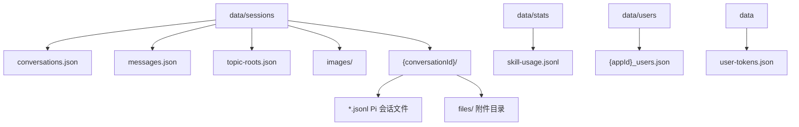
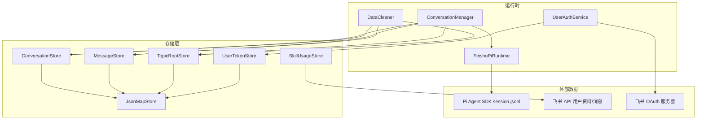
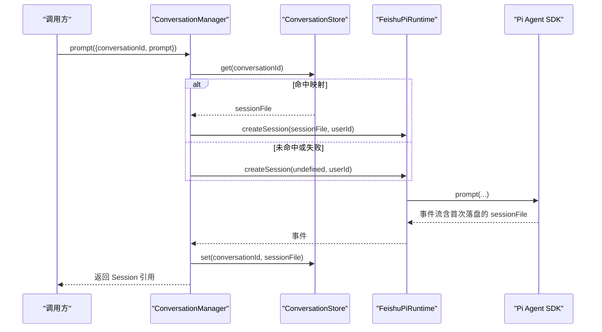
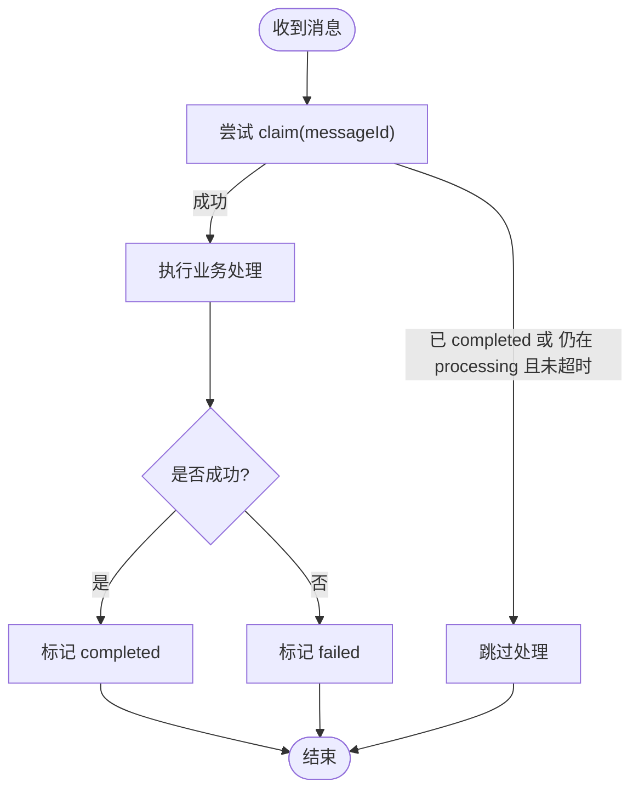
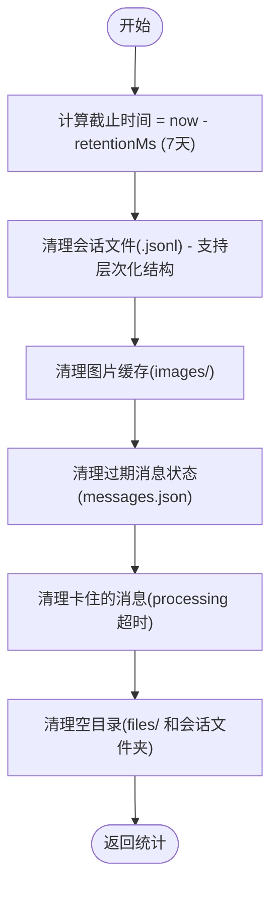
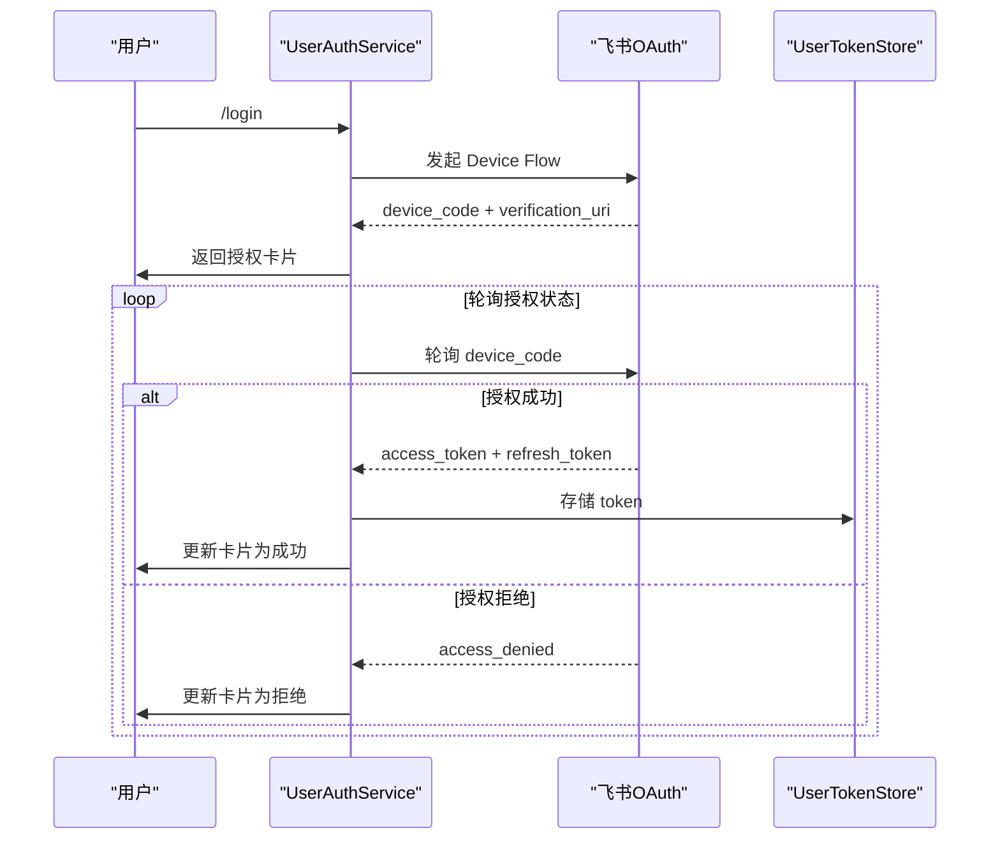
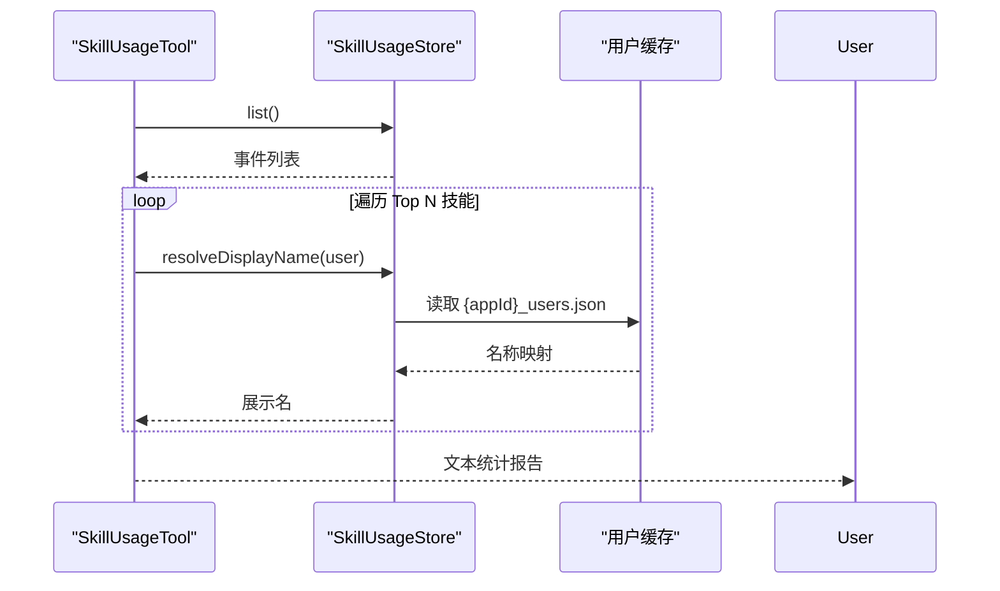
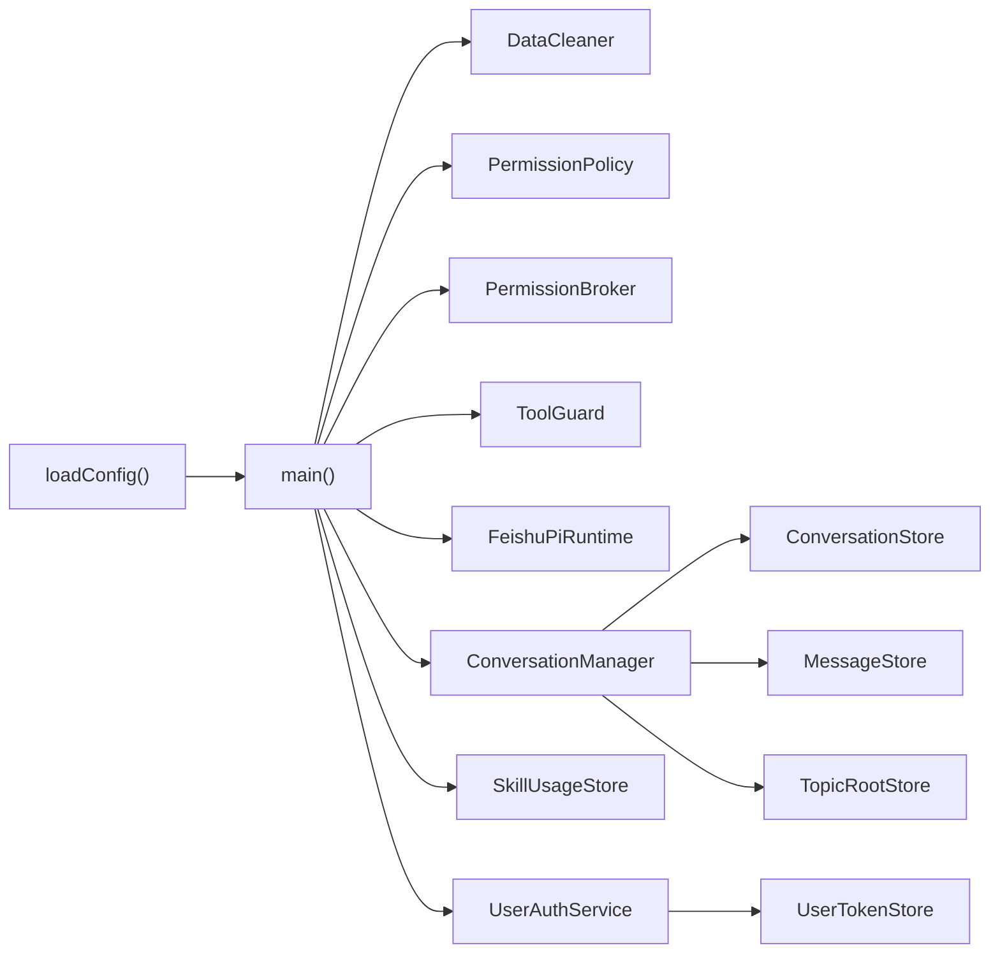

基于我对代码的分析，现在我将更新数据管理文档以反映这些重大变更。让我创建更新后的文档：

# 数据管理

<cite>
**本文引用的文件**
- [src/utils/json-store.ts](file://src/utils/json-store.ts)
- [src/runtime/conversation-store.ts](file://src/runtime/conversation-store.ts)
- [src/feishu/message-store.ts](file://src/feishu/message-store.ts)
- [src/runtime/data-cleaner.ts](file://src/runtime/data-cleaner.ts)
- [src/stats/skill-usage-store.ts](file://src/stats/skill-usage-store.ts)
- [src/stats/skill-usage-tool.ts](file://src/stats/skill-usage-tool.ts)
- [src/feishu/topic-root-store.ts](file://src/feishu/topic-root-store.ts)
- [src/feishu/session-alias.ts](file://src/feishu/session-alias.ts)
- [src/config.ts](file://src/config.ts)
- [src/main.ts](file://src/main.ts)
- [docs/data-management.md](file://docs/data-management.md)
- [src/utils/session-paths.ts](file://src/utils/session-paths.ts)
- [src/feishu/user-auth.ts](file://src/feishu/user-auth.ts)
</cite>

## 更新摘要
**已进行的更改**
- 会话文件架构从扁平结构升级为层次化组织（data/sessions/{conversationId}/）
- 新增 user-tokens.json 用于存储用户认证 token
- 增强数据清理功能，支持7天保留策略和空目录自动清理
- 完善附件管理和会话文件夹生命周期管理

## 目录
1. [简介](#简介)
2. [项目结构](#项目结构)
3. [核心组件](#核心组件)
4. [架构总览](#架构总览)
5. [详细组件分析](#详细组件分析)
6. [依赖关系分析](#依赖关系分析)
7. [性能考虑](#性能考虑)
8. [故障排查指南](#故障排查指南)
9. [结论](#结论)
10. [附录：数据模型与API说明](#附录数据模型与api说明)

## 简介
本文件为数据管理系统的综合文档，覆盖会话数据存储、消息去重机制、数据清理策略、用户信息缓存、技能使用统计与本地文件存储。同时给出数据持久化格式、备份恢复建议、数据迁移方案、访问模式、缓存策略与性能优化技巧，并提供数据模型定义、API 接口说明和使用示例，帮助开发者快速掌握并扩展系统的数据管理能力。

## 项目结构
数据相关文件主要位于 data 目录下，采用层次化组织结构：
- sessions：会话路由表、消息去重表、话题根映射、图片与附件缓存、Pi Agent 会话文件（按 conversationId 组织）
- stats：技能使用事件流（长期留存）
- users：用户资料缓存（按 appId 隔离）
- user-tokens.json：用户飞书身份认证 token

**图表来源**
- [docs/data-management.md:5-26](file://docs/data-management.md#L5-L26)

**章节来源**
- [docs/data-management.md:1-26](file://docs/data-management.md#L1-L26)

## 核心组件
- JsonMapStore：提供 JSON 字典文件的懒加载、并发安全读取与串行原子写入（临时文件 + rename）。
- ConversationStore：维护 conversationId → Pi Session 文件路径的映射，支持 get/set/delete。
- MessageStore：维护消息处理状态（processing/completed/failed），实现跨群聊全局消息去重与"卡住"保护。
- TopicRootStore：维护 chatId → 待定的话题根 messageId，确保话题群消息收敛到同一会话。
- DataCleaner：定期清理过期会话文件、图片缓存、过期消息状态与卡住的消息，支持7天保留策略和空目录自动清理。
- SkillUsageStore：追加式事件流记录技能使用，支持展示名解析与批量查询。
- SkillUsageTool：面向用户的自然语言查询入口，聚合统计并返回可读结果。
- LarkCli（用户缓存）：三级查询用户资料并缓存，带双 TTL（有档案 3 天、空档案 1 天）。
- UserAuthService：用户飞书身份授权服务，基于 Device Flow 实现 OAuth 2.0 授权，token 存储在 user-tokens.json。
- session-alias：会话 ID 短别名生成，用于卡片小字展示。

**章节来源**
- [src/utils/json-store.ts:1-58](file://src/utils/json-store.ts#L1-L58)
- [src/runtime/conversation-store.ts:1-31](file://src/runtime/conversation-store.ts#L1-L31)
- [src/feishu/message-store.ts:1-49](file://src/feishu/message-store.ts#L1-L49)
- [src/feishu/topic-root-store.ts:1-27](file://src/feishu/topic-root-store.ts#L1-L27)
- [src/runtime/data-cleaner.ts:1-241](file://src/runtime/data-cleaner.ts#L1-L241)
- [src/stats/skill-usage-store.ts:1-157](file://src/stats/skill-usage-store.ts#L1-L157)
- [src/stats/skill-usage-tool.ts:1-100](file://src/stats/skill-usage-tool.ts#L1-L100)
- [src/feishu/lark-cli.ts:37-268](file://src/feishu/lark-cli.ts#L37-L268)
- [src/feishu/user-auth.ts:1-392](file://src/feishu/user-auth.ts#L1-L392)
- [src/feishu/session-alias.ts:1-34](file://src/feishu/session-alias.ts#L1-L34)

## 架构总览
系统以"会话 + 消息 + 统计 + 用户缓存 + 用户认证"为核心数据域，通过统一的持久化基类保障一致性，配合定时清理保证磁盘占用可控。

**图表来源**
- [src/main.ts:28-247](file://src/main.ts#L28-L247)
- [src/runtime/conversation-manager.ts:22-119](file://src/runtime/conversation-manager.ts#L22-L119)
- [src/runtime/data-cleaner.ts:30-67](file://src/runtime/data-cleaner.ts#L30-L67)
- [src/utils/json-store.ts:10-57](file://src/utils/json-store.ts#L10-L57)
- [src/feishu/user-auth.ts:112-127](file://src/feishu/user-auth.ts#L112-L127)

## 详细组件分析

### 会话数据存储（ConversationStore 与 ConversationManager）
- **架构升级**：会话文件从扁平结构改为层次化组织，每个会话拥有独立文件夹 `{sessionRoot}/{消毒后的 conversationId}/`
- **职责**：将飞书 conversationId 与 Pi Session 文件路径建立映射；在首个 message_end 落盘时立即持久化，避免重启后丢失上下文。
- **关键流程**：
  - 获取或创建会话状态，优先从持久化映射恢复，失败则新建。
  - 新消息到达时打断在途请求，保证顺序执行。
  - 事件回调中检查 sessionFile 并持久化映射。
  - 支持清空与中断指定会话。

**图表来源**
- [src/runtime/conversation-manager.ts:33-96](file://src/runtime/conversation-manager.ts#L33-L96)
- [src/runtime/conversation-store.ts:12-29](file://src/runtime/conversation-store.ts#L12-L29)

**章节来源**
- [src/runtime/conversation-manager.ts:22-119](file://src/runtime/conversation-manager.ts#L22-L119)
- [src/runtime/conversation-store.ts:1-31](file://src/runtime/conversation-store.ts#L1-L31)

### 消息去重机制（MessageStore）
- **职责**：跨所有群聊的全局消息去重，防止重复投递导致多次回复。
- **状态机**：
  - processing：正在处理；若超过阈值仍为 processing，视为卡住可重新认领。
  - completed：处理完成。
  - failed：处理失败，避免立即重试。
- **关键操作**：claim/complete/fail，内部统一写回并持久化。

**图表来源**
- [src/feishu/message-store.ts:14-47](file://src/feishu/message-store.ts#L14-L47)

**章节来源**
- [src/feishu/message-store.ts:1-49](file://src/feishu/message-store.ts#L1-L49)

### 数据清理策略（DataCleaner）
- **架构升级**：支持层次化会话文件夹结构和7天保留策略
- **清理对象**：
  - 会话文件（.jsonl）：按文件修改时间，保留 7 天，支持会话文件夹内和根目录下的 jsonl 文件。
  - 图片缓存：按文件修改时间，保留 7 天。
  - 消息状态：按 updatedAt 时间戳，清理过期条目。
  - 卡住的消息：processing 状态超过阈值（默认 1 小时）清理。
  - **新增功能**：空目录自动清理，当 files/ 目录清空后自动移除会话文件夹。
- **触发时机**：启动时执行一次，之后每 24 小时自动执行。
- **输出**：统计各类型检查与删除数量。

**图表来源**
- [src/runtime/data-cleaner.ts:44-67](file://src/runtime/data-cleaner.ts#L44-L67)
- [src/runtime/data-cleaner.ts:164-182](file://src/runtime/data-cleaner.ts#L164-L182)

**章节来源**
- [src/runtime/data-cleaner.ts:1-241](file://src/runtime/data-cleaner.ts#L1-L241)
- [docs/data-management.md:143-162](file://docs/data-management.md#L143-L162)

### 用户认证管理（UserAuthService）
- **新增功能**：基于 OAuth 2.0 Device Flow 的用户身份授权
- **存储位置**：data/user-tokens.json，按 openId 存储用户 token
- **核心特性**：
  - Device Flow 授权流程，无需公网回调地址
  - Token 自动刷新机制，access token 临期静默刷新
  - 增量授权支持，按需申请所需 scope
  - 登录状态管理，支持 /login 和 /logout 命令
- **安全模型**：
  - device_code 与发起用户的 openId 绑定
  - scope 由配置控制，最小权限原则
  - 实际可访问数据 = 应用 scope ∩ 用户本人可见范围

**图表来源**
- [src/feishu/user-auth.ts:133-185](file://src/feishu/user-auth.ts#L133-L185)
- [src/feishu/user-auth.ts:296-344](file://src/feishu/user-auth.ts#L296-L344)

**章节来源**
- [src/feishu/user-auth.ts:1-392](file://src/feishu/user-auth.ts#L1-L392)

### 用户信息缓存（LarkCli）
- **策略**：三级查询（应用成员、群成员、搜索）获取中文名/英文名/部门；缓存至 data/users/{appId}_users.json。
- **过期规则**：有档案 3 天、空档案 1 天；过期失败时降级入库但保留旧字段，避免频繁重查。
- **用途**：技能统计展示名解析、权限策略等场景复用。

**章节来源**
- [src/feishu/lark-cli.ts:37-268](file://src/feishu/lark-cli.ts#L37-L268)
- [docs/data-management.md:135-142](file://docs/data-management.md#L135-L142)

### 技能使用统计（SkillUsageStore 与 SkillUsageTool）
- **事件流**：data/stats/skill-usage.jsonl，只增不删，长期留存。
- **匹配规则**：识别 read/file_path 参数指向的技能目录 .md 文件，提取技能名。
- **展示名解析**：优先英文名，其次中文名，最后 Open ID。
- **查询工具**：聚合近 7 天使用量、技能排行、个人使用明细。

**图表来源**
- [src/stats/skill-usage-tool.ts:46-99](file://src/stats/skill-usage-tool.ts#L46-L99)
- [src/stats/skill-usage-store.ts:67-157](file://src/stats/skill-usage-store.ts#L67-L157)

**章节来源**
- [src/stats/skill-usage-store.ts:1-157](file://src/stats/skill-usage-store.ts#L1-L157)
- [src/stats/skill-usage-tool.ts:1-100](file://src/stats/skill-usage-tool.ts#L1-L100)
- [docs/data-management.md:83-97](file://docs/data-management.md#L83-L97)

### 本地文件存储与会话文件
- **架构升级**：层次化会话文件夹结构 `{sessionRoot}/{消毒后的 conversationId}/`
- **Pi 会话文件（.jsonl）**：由 SDK 管理，包含完整对话历史与工具调用记录；命名含 ISO 时间与随机 ID。
- **图片缓存**：images/ 下按 imageKey 命名，便于调试与回溯。
- **附件缓存**：files/ 下缓存 file/audio/video 附件；已纳入 DataCleaner 清理范围（7天保留）。
- **会话文件夹生命周期**：当 files/ 目录清空后，自动移除空壳会话文件夹。

**章节来源**
- [docs/data-management.md:98-134](file://docs/data-management.md#L98-L134)
- [src/utils/session-paths.ts:1-26](file://src/utils/session-paths.ts#L1-L26)

### 话题根持久化（TopicRootStore）
- **作用**：记录 chatId → 待定话题根 messageId，确保首条无 threadId 的消息与后续消息收敛到同一会话。
- **生命周期**：登记后当 threadId 稳定时清除。

**章节来源**
- [src/feishu/topic-root-store.ts:1-27](file://src/feishu/topic-root-store.ts#L1-L27)

### 会话 ID 短别名（session-alias）
- **作用**：为长会话 ID 生成稳定短别名，用于卡片小字展示。
- **冲突处理**：同名时追加序号后缀。

**章节来源**
- [src/feishu/session-alias.ts:1-34](file://src/feishu/session-alias.ts#L1-L34)

## 依赖关系分析
- **配置驱动**：主入口通过 loadConfig 获取 sessionDir、模型配置、审核配置等，初始化各组件。
- **启动流程**：创建 DataCleaner 并执行清理；构建 PermissionPolicy、PermissionBroker、ToolGuard；注册技能统计路由；创建 FeishuPiRuntime、ConversationManager、MessageStore、TopicRootStore、SkillUsageStore、UserAuthService；启动传输层与调度服务。

**图表来源**
- [src/config.ts:25-50](file://src/config.ts#L25-L50)
- [src/main.ts:28-247](file://src/main.ts#L28-L247)

**章节来源**
- [src/config.ts:1-72](file://src/config.ts#L1-L72)
- [src/main.ts:1-286](file://src/main.ts#L1-L286)

## 性能考虑
- **读写一致性与并发**：
  - JsonMapStore 使用懒加载与并发读保护（loadPromise），避免重复 IO。
  - 写操作串行队列 + 临时文件 + rename 原子替换，避免读到半写文件。
- **I/O 优化**：
  - 会话映射仅在首个 message_end 落盘时持久化，减少频繁写。
  - 技能统计采用追加写（appendFile），降低锁竞争。
  - 层次化会话文件夹减少文件查找开销。
- **缓存策略**：
  - 用户资料缓存双 TTL，减少 API 调用。
  - 内存 Map 缓存事件与用户映射，提升查询性能。
  - Token 缓存与自动刷新机制。
- **清理策略**：
  - 仅清理过期数据，保留必要映射；7天保留策略平衡存储空间和数据可用性。
  - 空目录自动清理，避免磁盘碎片化。

## 故障排查指南
- **消息重复处理**：
  - 检查 messages.json 中对应 messageId 的状态是否为 completed；若长时间 processing，可能被 DataCleaner 清理。
- **会话丢失**：
  - 检查 conversations.json 是否存在映射；若 Pi 会话文件被清理，下次对话会新建会话。
  - 验证层次化会话文件夹结构是否正确创建。
- **用户认证问题**：
  - 检查 user-tokens.json 是否存在及 token 有效性。
  - 确认 Device Flow 授权流程是否正常完成。
  - 验证 refresh token 刷新机制是否工作正常。
- **用户展示名异常**：
  - 检查 data/users/{appId}_users.json 是否存在及更新时间；确认展示名解析优先级（英文名 > 中文名 > Open ID）。
- **技能统计缺失**：
  - 检查 skill-usage.jsonl 是否追加成功；确认 matchSkillRead 是否能正确识别技能路径。
- **清理误删**：
  - 使用 dryRun 模式先统计再执行；确认 retentionDays 与阈值设置是否符合预期。
  - 验证空目录清理逻辑是否影响重要数据。

**章节来源**
- [src/runtime/data-cleaner.ts:127-182](file://src/runtime/data-cleaner.ts#L127-L182)
- [src/stats/skill-usage-store.ts:84-120](file://src/stats/skill-usage-store.ts#L84-L120)
- [src/feishu/lark-cli.ts:236-268](file://src/feishu/lark-cli.ts#L236-L268)
- [src/feishu/user-auth.ts:191-226](file://src/feishu/user-auth.ts#L191-L226)

## 结论
本数据管理系统通过统一的持久化基类、严格的去重与清理策略、完善的用户缓存与统计体系，实现了高可靠、可扩展的数据管理能力。结合层次化会话文件夹设计、用户认证机制、话题根收敛与短期/长期数据分离设计，既保证了用户体验的一致性，又控制了资源占用。建议在生产环境开启定期清理与监控，并根据业务规模调整保留期与阈值。

## 附录：数据模型与API说明

### 数据模型定义
- **会话映射（conversations.json）**
  - 键：conversationId（私聊/群聊/话题群话题）
  - 值：{ sessionFile, updatedAt }
- **消息去重（messages.json）**
  - 键：messageId
  - 值：{ status: processing|completed|failed, updatedAt: epoch ms }
- **话题根（topic-roots.json）**
  - 键：chatId
  - 值：rootMessageId
- **技能使用事件（skill-usage.jsonl）**
  - 字段：ts, user, skill, chatId?
- **用户缓存（{appId}_users.json）**
  - 键：openId
  - 值：{ openId, name?, englishName?, departmentNames?[], updatedAt }
- **用户认证令牌（user-tokens.json）**
  - 键：openId
  - 值：{ openId, accessToken, refreshToken, expiresAt, refreshExpiresAt, scope, updatedAt }

**章节来源**
- [docs/data-management.md:22-97](file://docs/data-management.md#L22-L97)
- [src/stats/skill-usage-store.ts:13-30](file://src/stats/skill-usage-store.ts#L13-L30)
- [src/feishu/user-auth.ts:48-60](file://src/feishu/user-auth.ts#L48-L60)

### API 接口说明（数据层）
- **JsonMapStore（抽象基类）**
  - ensureLoaded(): 懒加载文件到内存
  - persist(): 串行原子写
  - remove(key): 删除并落盘
- **ConversationStore**
  - get(conversationId): 返回 sessionFile
  - set(conversationId, sessionFile): 原子保存映射
  - delete(conversationId): 删除映射
- **MessageStore**
  - claim(messageId): 尝试认领，返回是否成功
  - complete(messageId): 标记完成
  - fail(messageId): 标记失败
- **TopicRootStore**
  - get(chatId): 获取待定根消息 ID
  - set(chatId, rootMessageId): 登记根消息
  - clear(chatId): 清除根映射
- **SkillUsageStore**
  - record(event): 追加事件
  - list(): 读取全部事件
  - resolveDisplayName(openId): 解析展示名
  - displayNameMap(): 批量解析
- **DataCleaner**
  - cleanup(): 清理过期数据并返回统计
  - cleanupStuckMessages(timeoutMs?): 清理卡住消息
- **UserTokenStore**
  - get(openId): 获取用户 token
  - put(token): 保存用户 token
  - delete(openId): 删除用户 token

**章节来源**
- [src/utils/json-store.ts:10-57](file://src/utils/json-store.ts#L10-L57)
- [src/runtime/conversation-store.ts:12-29](file://src/runtime/conversation-store.ts#L12-L29)
- [src/feishu/message-store.ts:14-47](file://src/feishu/message-store.ts#L14-L47)
- [src/feishu/topic-root-store.ts:8-25](file://src/feishu/topic-root-store.ts#L8-L25)
- [src/stats/skill-usage-store.ts:67-157](file://src/stats/skill-usage-store.ts#L67-L157)
- [src/runtime/data-cleaner.ts:30-67](file://src/runtime/data-cleaner.ts#L30-L67)
- [src/runtime/data-cleaner.ts:173-182](file://src/runtime/data-cleaner.ts#L173-L182)
- [src/feishu/user-auth.ts:62-77](file://src/feishu/user-auth.ts#L62-L77)

### 使用示例（概念性）
- **会话创建与发送消息**：
  - 调用 ConversationManager.prompt 传入 conversationId 与 prompt，内部自动恢复或新建会话，并在首个 message_end 落盘时持久化映射。
- **消息去重**：
  - 在处理消息前调用 MessageStore.claim，成功后执行业务逻辑，最终调用 complete 或 fail。
- **清理任务**：
  - 启动时调用 DataCleaner.cleanup 与 cleanupStuckMessages，随后每 24 小时定时执行。
- **技能统计查询**：
  - 通过 SkillUsageTool 暴露的自然语言入口，调用 SkillUsageStore.list 与 resolveDisplayName 生成统计报告。
- **用户认证**：
  - 调用 UserAuthService.startLogin 发起 Device Flow 授权，后台轮询完成后自动存储 token。
  - 使用 getUserAccessToken 获取有效 token，支持自动刷新机制。

### 备份与恢复建议
- **备份范围**：
  - data/sessions/*.jsonl（会话历史，包括层次化文件夹中的文件）
  - data/sessions/conversations.json（会话路由）
  - data/sessions/messages.json（消息去重）
  - data/sessions/topic-roots.json（话题根）
  - data/stats/skill-usage.jsonl（统计事件）
  - data/users/{appId}_users.json（用户缓存）
  - data/user-tokens.json（用户认证 token）
- **恢复步骤**：
  - 停止服务，拷贝上述文件至目标目录，保持相对路径不变。
  - 启动服务，系统将自动加载并重建内存映射。
- **注意事项**：
  - Pi 会话文件由 SDK 管理，请勿手动修改其格式。
  - 若 images/files 目录过大，可在停机窗口进行归档与清理。
  - user-tokens.json 包含敏感认证信息，应妥善保管。

### 数据迁移方案
- **版本升级**：
  - 新增字段：保持向后兼容，读取时忽略未知字段。
  - 废弃字段：保留一段时间并记录日志，逐步下线。
- **格式变更**：
  - 引入迁移脚本，在启动时检测版本号并转换旧格式到新格式。
  - 对 JSONL 文件进行增量迁移，避免全量重写。
  - **会话文件迁移**：从扁平结构迁移到层次化结构，需要迁移所有 .jsonl 文件到对应的会话文件夹。
- **校验与回滚**：
  - 迁移前后进行完整性校验（如行数、关键字段）。
  - 保留旧版本副本，必要时回滚。