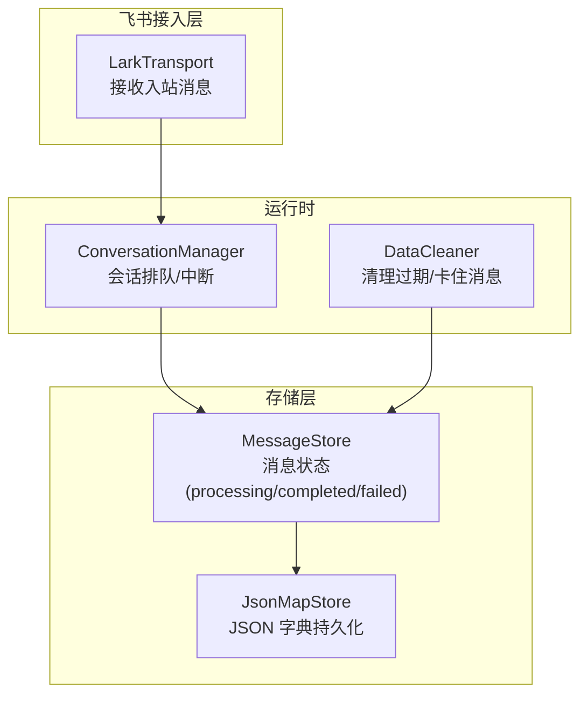
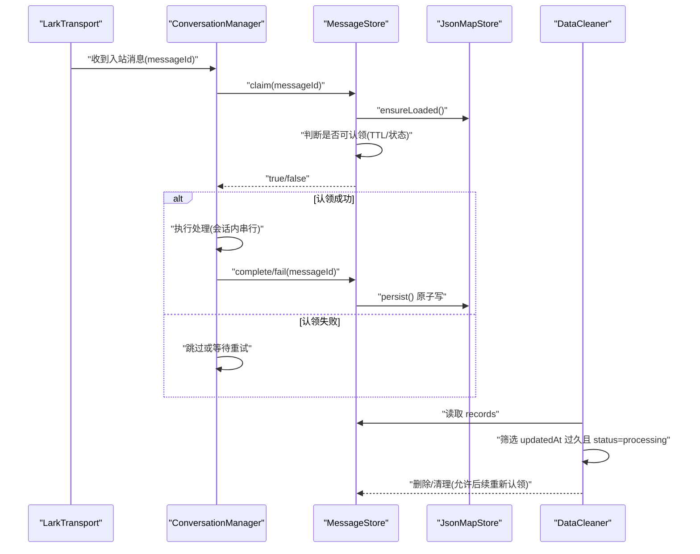
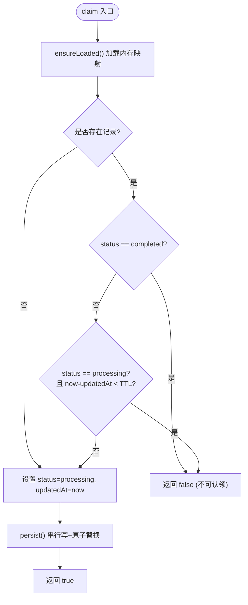
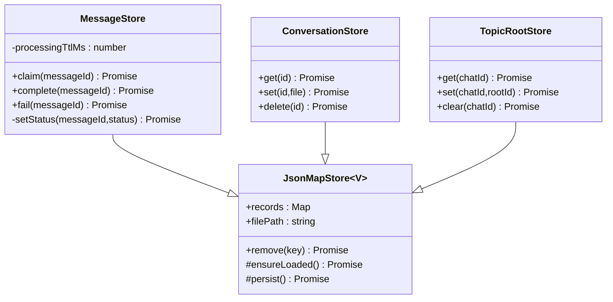
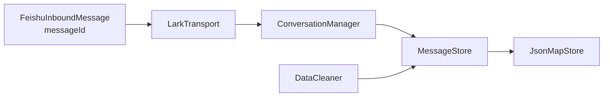

# 消息存储与去重

<cite>
**本文引用的文件**
- [message-store.ts](file://src/feishu/message-store.ts)
- [json-store.ts](file://src/utils/json-store.ts)
- [data-cleaner.ts](file://src/runtime/data-cleaner.ts)
- [conversation-manager.ts](file://src/runtime/conversation-manager.ts)
- [lark-transport.ts](file://src/feishu/lark-transport.ts)
- [types.ts](file://src/feishu/types.ts)
- [reliability.test.ts](file://test/reliability.test.ts)
</cite>

## 目录
1. [简介](#简介)
2. [项目结构](#项目结构)
3. [核心组件](#核心组件)
4. [架构总览](#架构总览)
5. [详细组件分析](#详细组件分析)
6. [依赖关系分析](#依赖关系分析)
7. [性能考量](#性能考量)
8. [故障排查指南](#故障排查指南)
9. [结论](#结论)
10. [附录：使用示例与最佳实践](#附录使用示例与最佳实践)

## 简介
本文件围绕消息存储与去重机制，系统性说明 MessageStore 的实现原理与使用方式。重点覆盖：
- 消息状态管理（processing、completed、failed）
- 原子认领与重复投递防护
- 处理超时检测、TTL 机制与卡住消息的重新认领策略
- JSON 文件持久化格式、数据结构与并发安全保证
- 消息生命周期管理、错误处理策略与性能优化技巧
- 具体使用示例与最佳实践

## 项目结构
消息存储与去重相关代码主要分布在以下模块：
- feishu/message-store.ts：定义消息状态与原子认领逻辑
- utils/json-store.ts：提供 JSON 字典文件的懒加载、串行写队列与原子替换落盘能力
- runtime/data-cleaner.ts：负责清理过期与卡住的消息状态
- feishu/lark-transport.ts：消费方在入站消息处理中调用 MessageStore 进行认领
- runtime/conversation-manager.ts：会话级排队与中断，配合消息去重形成端到端可靠性
- feishu/types.ts：入站消息类型定义，包含 messageId 等关键字段
- test/reliability.test.ts：对消息认领幂等性与持久化的测试用例

图表来源
- [lark-transport.ts:155-175](file://src/feishu/lark-transport.ts#L155-L175)
- [conversation-manager.ts:65-96](file://src/runtime/conversation-manager.ts#L65-L96)
- [message-store.ts:14-47](file://src/feishu/message-store.ts#L14-L47)
- [json-store.ts:10-56](file://src/utils/json-store.ts#L10-L56)
- [data-cleaner.ts:164-182](file://src/runtime/data-cleaner.ts#L164-L182)

章节来源
- [message-store.ts:1-48](file://src/feishu/message-store.ts#L1-L48)
- [json-store.ts:1-58](file://src/utils/json-store.ts#L1-L58)
- [data-cleaner.ts:164-182](file://src/runtime/data-cleaner.ts#L164-L182)
- [lark-transport.ts:155-175](file://src/feishu/lark-transport.ts#L155-L175)
- [conversation-manager.ts:65-96](file://src/runtime/conversation-manager.ts#L65-L96)
- [types.ts:8-20](file://src/feishu/types.ts#L8-L20)
- [reliability.test.ts:39-46](file://test/reliability.test.ts#L39-L46)

## 核心组件
- MessageStore：基于 JsonMapStore 实现消息状态管理与原子认领，支持 processingTtlMs 控制“卡住”阈值。
- JsonMapStore：提供统一的 JSON 字典持久化能力，包括懒加载、并发安全的串行写入与临时文件原子替换。
- DataCleaner：定时或按需清理过期与卡住的消息状态，释放资源并允许后续重新认领。
- ConversationManager：按会话维度串行执行任务，并在有新消息时打断在途请求，避免长尾阻塞。
- LarkTransport：将入站消息路由到对应会话，并在处理前尝试认领消息。

章节来源
- [message-store.ts:14-47](file://src/feishu/message-store.ts#L14-L47)
- [json-store.ts:10-56](file://src/utils/json-store.ts#L10-L56)
- [data-cleaner.ts:164-182](file://src/runtime/data-cleaner.ts#L164-L182)
- [conversation-manager.ts:65-96](file://src/runtime/conversation-manager.ts#L65-L96)
- [lark-transport.ts:155-175](file://src/feishu/lark-transport.ts#L155-L175)

## 架构总览
消息从飞书进入后，先由传输层构造 conversationId 并交由会话管理器排队执行；在执行前通过 MessageStore 进行原子认领，确保同一消息不会被重复执行。处理完成后标记 completed，失败则标记 failed。后台 DataCleaner 定期清理长时间处于 processing 且超时的记录，以便后续重试。

图表来源
- [lark-transport.ts:155-175](file://src/feishu/lark-transport.ts#L155-L175)
- [conversation-manager.ts:65-96](file://src/runtime/conversation-manager.ts#L65-L96)
- [message-store.ts:23-47](file://src/feishu/message-store.ts#L23-L47)
- [json-store.ts:32-56](file://src/utils/json-store.ts#L32-L56)
- [data-cleaner.ts:164-182](file://src/runtime/data-cleaner.ts#L164-L182)

## 详细组件分析

### MessageStore：消息状态与原子认领
- 状态模型
  - 状态枚举：processing、completed、failed
  - 记录结构：status + updatedAt（毫秒时间戳）
- 关键方法
  - claim(messageId)：若不存在或已 expired（processing 超过 processingTtlMs），则原子设置为 processing 并返回 true；否则返回 false
  - complete(messageId)：标记为 completed
  - fail(messageId)：标记为 failed
- 并发与一致性
  - 通过 ensureLoaded() 懒加载内存映射
  - 通过 persist() 的串行写队列与临时文件 rename 原子替换，避免并发写导致的数据损坏
- TTL 与卡住处理
  - processingTtlMs 默认 10 分钟，用于判定“仍在处理”还是“卡住”
  - 结合 DataCleaner 的 cleanupStuckMessages（默认 1 小时）共同构成双重保护

图表来源
- [message-store.ts:23-47](file://src/feishu/message-store.ts#L23-L47)
- [json-store.ts:32-56](file://src/utils/json-store.ts#L32-L56)

章节来源
- [message-store.ts:1-48](file://src/feishu/message-store.ts#L1-L48)
- [json-store.ts:10-56](file://src/utils/json-store.ts#L10-L56)

### JsonMapStore：JSON 字典持久化与并发安全
- 设计要点
  - 懒加载：首次访问时读取文件，ENOTENT 视为空映射
  - 并发读：loadPromise 缓存，避免并发重复 IO
  - 串行写：writeQueue 保证写操作顺序执行
  - 原子写：先写临时文件再 rename 替换目标文件，避免读到半写数据
- 复杂度
  - 读：O(N) 解析 JSON 到 Map
  - 写：O(N) 序列化 Map 到 JSON，I/O 受磁盘影响
- 扩展性
  - 通过泛型 V 支持不同记录类型（如 ConversationRecord、TopicRootStore 等）

章节来源
- [json-store.ts:1-58](file://src/utils/json-store.ts#L1-L58)

### DataCleaner：过期与卡住消息清理
- 功能
  - cleanupMessages：根据 cutoffTime 清理 updatedAt 早于阈值的记录
  - cleanupStuckMessages：清理 status=processing 且 updatedAt 超过 timeoutMs（默认 1 小时）的记录
- 作用
  - 释放长期占用状态，使后续流程可重新认领
  - 与 MessageStore 的 processingTtlMs 互补：前者更激进（快速恢复），后者更保守（防止误判）

章节来源
- [data-cleaner.ts:164-182](file://src/runtime/data-cleaner.ts#L164-L182)

### 消费方集成：LarkTransport 与 ConversationManager
- LarkTransport
  - 构造 conversationId 并路由消息
  - 在处理前调用 MessageStore.claim 进行去重
- ConversationManager
  - 会话内串行执行，新消息到达时中断在途请求，降低尾部延迟
  - 与 MessageStore 协作，确保每个会话内的消息有序且幂等

章节来源
- [lark-transport.ts:155-175](file://src/feishu/lark-transport.ts#L155-L175)
- [conversation-manager.ts:65-96](file://src/runtime/conversation-manager.ts#L65-L96)

### 类图：存储层关系

图表来源
- [json-store.ts:10-56](file://src/utils/json-store.ts#L10-L56)
- [message-store.ts:14-47](file://src/feishu/message-store.ts#L14-L47)
- [runtime/conversation-store.ts:1-30](file://src/runtime/conversation-store.ts#L1-L30)
- [feishu/topic-root-store.ts:1-26](file://src/feishu/topic-root-store.ts#L1-L26)

## 依赖关系分析
- MessageStore 依赖 JsonMapStore 提供的持久化能力
- DataCleaner 直接读取并清理消息状态文件，与 MessageStore 共享同一数据格式
- LarkTransport 与 ConversationManager 作为上层消费者，组合使用 MessageStore 完成可靠处理
- types.ts 定义了入站消息结构，其中 messageId 是去重键

图表来源
- [types.ts:8-20](file://src/feishu/types.ts#L8-L20)
- [lark-transport.ts:155-175](file://src/feishu/lark-transport.ts#L155-L175)
- [conversation-manager.ts:65-96](file://src/runtime/conversation-manager.ts#L65-L96)
- [message-store.ts:14-47](file://src/feishu/message-store.ts#L14-L47)
- [json-store.ts:10-56](file://src/utils/json-store.ts#L10-L56)
- [data-cleaner.ts:164-182](file://src/runtime/data-cleaner.ts#L164-L182)

章节来源
- [types.ts:8-20](file://src/feishu/types.ts#L8-L20)
- [lark-transport.ts:155-175](file://src/feishu/lark-transport.ts#L155-L175)
- [conversation-manager.ts:65-96](file://src/runtime/conversation-manager.ts#L65-L96)
- [message-store.ts:14-47](file://src/feishu/message-store.ts#L14-L47)
- [json-store.ts:10-56](file://src/utils/json-store.ts#L10-L56)
- [data-cleaner.ts:164-182](file://src/runtime/data-cleaner.ts#L164-L182)

## 性能考量
- 读写路径
  - 读：首次加载全量 JSON 到内存 Map，后续仅内存操作
  - 写：串行队列 + 临时文件 + rename，避免锁竞争与部分写入
- I/O 优化
  - 懒加载减少冷启动开销
  - 合并多次写入（通过 writeQueue）降低磁盘抖动
- 并发安全
  - 并发读共享 loadPromise，避免重复 IO
  - 写串行化保证最终一致性
- 建议
  - 合理设置 processingTtlMs 与 DataCleaner 的 timeoutMs，平衡“误判”与“恢复速度”
  - 监控持久化文件大小与写入频率，必要时分片或归档历史状态

[本节为通用性能讨论，不直接分析具体文件]

## 故障排查指南
- 症状：消息被重复执行
  - 检查是否在每条处理路径都调用了 claim，并确保在异常分支也调用 complete/fail
  - 确认 MessageStore 的文件路径一致，避免多实例写入不同文件
- 症状：消息长期卡在 processing
  - 检查 DataCleaner 是否运行，timeoutMs 配置是否过小导致频繁清理
  - 调整 MessageStore 的 processingTtlMs，使其大于典型处理时长
- 症状：持久化失败或数据不一致
  - 检查磁盘空间与权限
  - 观察临时文件是否残留，确认 rename 是否成功
- 症状：高并发下响应变慢
  - 评估会话内排队长度，必要时拆分会话粒度
  - 关注 DataCleaner 清理频率与负载

章节来源
- [message-store.ts:23-47](file://src/feishu/message-store.ts#L23-L47)
- [data-cleaner.ts:164-182](file://src/runtime/data-cleaner.ts#L164-L182)
- [json-store.ts:32-56](file://src/utils/json-store.ts#L32-L56)

## 结论
MessageStore 以极简的状态模型与可靠的持久化基类，实现了消息处理的幂等与去重。结合 DataCleaner 的超时清理与 ConversationManager 的会话级串行化，系统在高并发与不稳定网络环境下仍能保证正确性与可恢复性。通过合理的 TTL 与清理策略，可在“防抖”和“快速恢复”之间取得平衡。

[本节为总结性内容，不直接分析具体文件]

## 附录：使用示例与最佳实践

### 基本用法
- 初始化 MessageStore 并指定持久化文件路径
- 在处理入站消息前调用 claim，成功才继续处理
- 处理完成后调用 complete，失败调用 fail
- 定期运行 DataCleaner 清理卡住消息

参考测试用例
- [reliability.test.ts:39-46](file://test/reliability.test.ts#L39-L46)

### 配置建议
- processingTtlMs：建议略大于典型处理时长，避免正常处理被误判为卡住
- DataCleaner.timeoutMs：建议大于 processingTtlMs，作为兜底清理策略
- 持久化目录：确保进程有读写权限，避免跨进程共享冲突

### 常见模式
- 幂等处理：无论成功或失败，最终都要落盘状态，确保重启后可恢复
- 会话隔离：通过 ConversationManager 保证同一会话内消息顺序执行
- 超时与重试：利用 DataCleaner 清理卡住消息，配合上游重试机制

章节来源
- [reliability.test.ts:39-46](file://test/reliability.test.ts#L39-L46)
- [message-store.ts:14-47](file://src/feishu/message-store.ts#L14-L47)
- [data-cleaner.ts:164-182](file://src/runtime/data-cleaner.ts#L164-L182)
- [conversation-manager.ts:65-96](file://src/runtime/conversation-manager.ts#L65-L96)