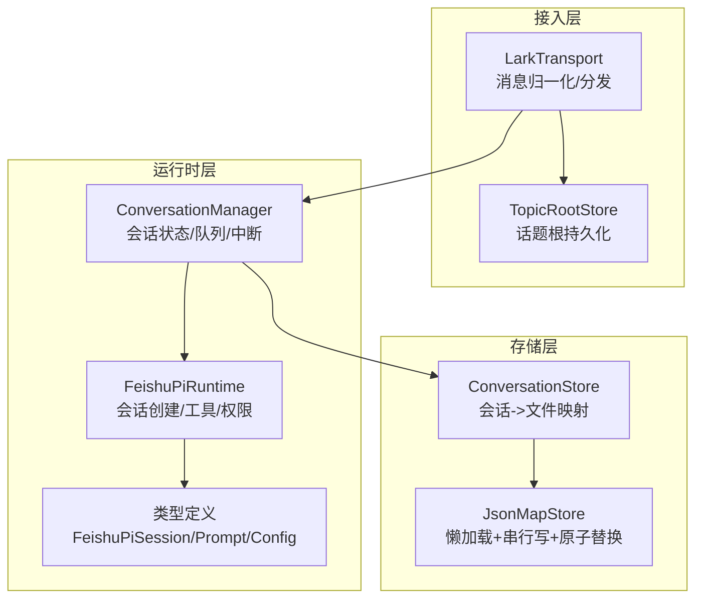
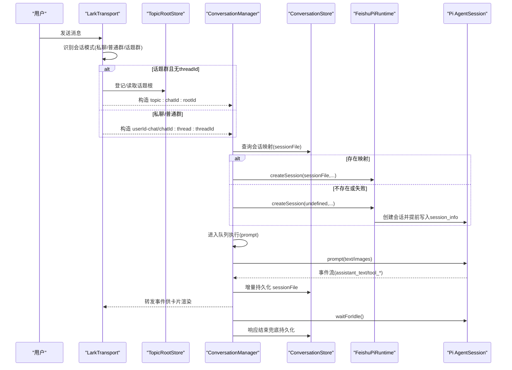
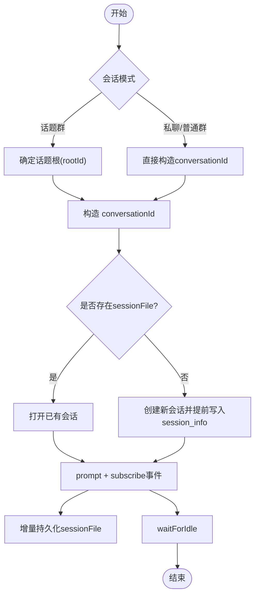
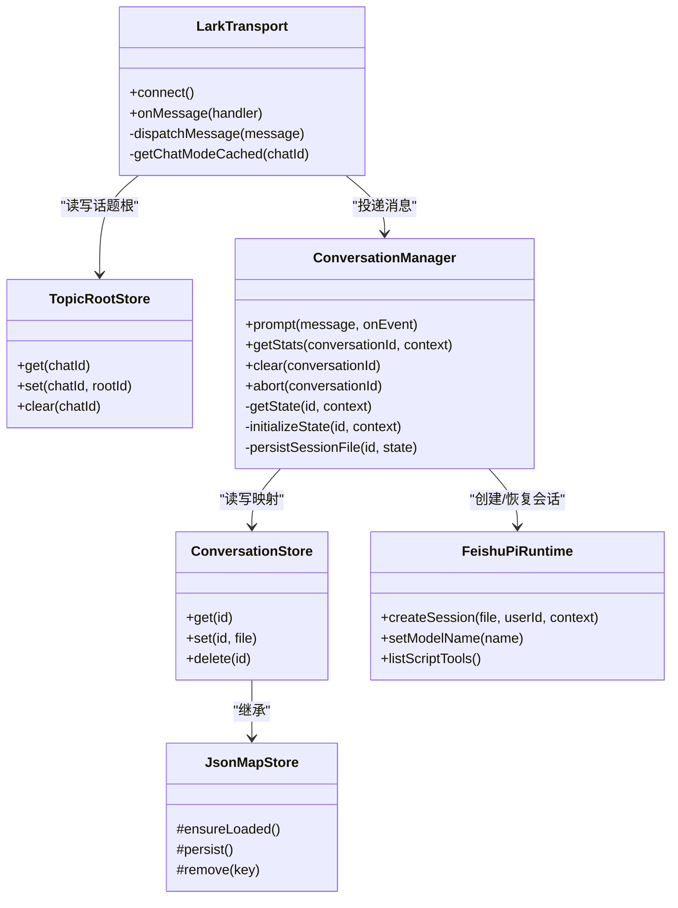

# 会话管理

<cite>
**本文引用的文件**
- [conversation-manager.ts](file://src/runtime/conversation-manager.ts)
- [conversation-store.ts](file://src/runtime/conversation-store.ts)
- [feishu-pi-runtime.ts](file://src/runtime/feishu-pi-runtime.ts)
- [types.ts](file://src/runtime/types.ts)
- [lark-transport.ts](file://src/feishu/lark-transport.ts)
- [topic-root-store.ts](file://src/feishu/topic-root-store.ts)
- [session-alias.ts](file://src/feishu/session-alias.ts)
- [json-store.ts](file://src/utils/json-store.ts)
- [types.ts（飞书接入层）](file://src/feishu/types.ts)
- [types.ts（上下文）](file://src/context/types.ts)
</cite>

## 目录
1. [简介](#简介)
2. [项目结构](#项目结构)
3. [核心组件](#核心组件)
4. [架构总览](#架构总览)
5. [详细组件分析](#详细组件分析)
6. [依赖关系分析](#依赖关系分析)
7. [性能考虑](#性能考虑)
8. [故障排查指南](#故障排查指南)
9. [结论](#结论)
10. [附录](#附录)

## 简介
本文件围绕“会话管理”展开，系统性说明多轮对话的状态维护机制、会话生命周期管理、上下文恢复策略与增量持久化实现；并覆盖会话隔离规则（私聊、普通群、话题群）、会话别名映射、会话存储结构；给出会话创建、更新、销毁的完整流程、错误恢复机制与性能优化策略；最后提供会话状态监控、调试技巧与常见问题解决方案。

## 项目结构
会话管理涉及三层：
- 接入层：负责从飞书接收消息、识别会话模式（私聊/普通群/话题群），构造 conversationId 并投递到上层处理。
- 运行时层：负责会话状态管理、会话恢复、事件订阅与流式输出、统计与中断控制。
- 存储层：基于 JSON 字典文件的原子持久化，用于会话映射与话题根等关键元数据。

图表来源
- [lark-transport.ts:141-248](file://src/feishu/lark-transport.ts#L141-L248)
- [conversation-manager.ts:23-118](file://src/runtime/conversation-manager.ts#L23-L118)
- [feishu-pi-runtime.ts:147-284](file://src/runtime/feishu-pi-runtime.ts#L147-L284)
- [conversation-store.ts:12-30](file://src/runtime/conversation-store.ts#L12-L30)
- [json-store.ts:10-58](file://src/utils/json-store.ts#L10-L58)

章节来源
- [lark-transport.ts:141-248](file://src/feishu/lark-transport.ts#L141-L248)
- [conversation-manager.ts:23-118](file://src/runtime/conversation-manager.ts#L23-L118)
- [feishu-pi-runtime.ts:147-284](file://src/runtime/feishu-pi-runtime.ts#L147-L284)
- [conversation-store.ts:12-30](file://src/runtime/conversation-store.ts#L12-L30)
- [json-store.ts:10-58](file://src/utils/json-store.ts#L10-L58)

## 核心组件
- 会话管理器（ConversationManager）：维护每个 conversationId 的会话状态、消息队列、忙闲标志、增量持久化与会话中断。
- 会话存储（ConversationStore）：将 conversationId 与 Pi Session JSONL 文件路径进行映射持久化，支持 get/set/delete。
- 运行时（FeishuPiRuntime）：封装 Pi AgentSession，负责模型选择、资源加载、工具注册、权限过滤、beforeToolCall 钩子、会话文件提前落盘。
- 传输层（LarkTransport）：解析飞书消息、识别会话模式、构造 conversationId、图片/附件处理、卡片回调与模型切换。
- 话题根存储（TopicRootStore）：在话题群首条消息无 threadId 时，持久化待定的话题根 messageId，确保后续消息收敛到同一会话。
- 会话别名（sessionAlias）：为长 conversationId 生成稳定短别名，便于 UI 展示。
- 通用存储基类（JsonMapStore）：懒加载、串行写队列、临时文件原子替换，保证并发安全与一致性。

章节来源
- [conversation-manager.ts:23-118](file://src/runtime/conversation-manager.ts#L23-L118)
- [conversation-store.ts:12-30](file://src/runtime/conversation-store.ts#L12-L30)
- [feishu-pi-runtime.ts:16-74,147-284:16-74](file://src/runtime/feishu-pi-runtime.ts#L16-L74)
- [lark-transport.ts:141-248,314-328:141-248](file://src/feishu/lark-transport.ts#L141-L248)
- [topic-root-store.ts:8-26](file://src/feishu/topic-root-store.ts#L8-L26)
- [session-alias.ts:6-32](file://src/feishu/session-alias.ts#L6-L32)
- [json-store.ts:10-58](file://src/utils/json-store.ts#L10-L58)

## 架构总览
下图展示了从飞书消息到达，到会话创建/恢复、事件流式输出、以及增量持久化的整体流程。

图表来源
- [lark-transport.ts:155-175](file://src/feishu/lark-transport.ts#L155-L175)
- [topic-root-store.ts:8-26](file://src/feishu/topic-root-store.ts#L8-L26)
- [conversation-manager.ts:33-95](file://src/runtime/conversation-manager.ts#L33-L95)
- [conversation-store.ts:12-30](file://src/runtime/conversation-store.ts#L12-L30)
- [feishu-pi-runtime.ts:147-224](file://src/runtime/feishu-pi-runtime.ts#L147-L224)

## 详细组件分析

### 会话生命周期管理（创建/更新/销毁）
- 创建
  - 接入层根据 chatMode 与 threadId 构造 conversationId。
  - 会话管理器尝试从 ConversationStore 恢复 sessionFile；若不存在或恢复失败，则创建新会话。
  - 运行时在创建会话后，若尚未有 sessionFile，会立即追加 session_info，使 sessionFile 立即可用，从而支持更早的增量持久化。
- 更新
  - 每次收到 Pi 事件（如 assistant_text、tool_*），会话管理器都会检查并持久化当前 sessionFile，实现增量持久化。
  - 响应结束后再次兜底持久化，确保映射一致。
- 销毁
  - clear(conversationId)：删除内存中的会话状态与持久化映射，释放资源。
  - abort(conversationId)：中断当前正在执行的会话响应。

图表来源
- [lark-transport.ts:155-175](file://src/feishu/lark-transport.ts#L155-L175)
- [conversation-manager.ts:43-95](file://src/runtime/conversation-manager.ts#L43-L95)
- [feishu-pi-runtime.ts:218-224](file://src/runtime/feishu-pi-runtime.ts#L218-L224)

章节来源
- [conversation-manager.ts:33-118](file://src/runtime/conversation-manager.ts#L33-L118)
- [feishu-pi-runtime.ts:147-224](file://src/runtime/feishu-pi-runtime.ts#L147-L224)
- [lark-transport.ts:155-175](file://src/feishu/lark-transport.ts#L155-L175)

### 上下文恢复策略与增量持久化
- 恢复策略
  - 优先使用 ConversationStore 中记录的 sessionFile 恢复会话；若恢复失败（例如文件损坏或版本不兼容），自动降级为新建会话，保障可用性。
- 增量持久化
  - 在 Pi 首个 message_end 落盘 sessionFile 时，通过事件订阅立即持久化映射，避免等待整轮完成才落盘。
  - 即使随后被中断或崩溃，下次也能恢复到同一会话，提升可靠性。
- 兜底机制
  - 响应结束后再次检查并持久化，确保映射最终一致。

章节来源
- [conversation-manager.ts:43-95](file://src/runtime/conversation-manager.ts#L43-L95)
- [conversation-store.ts:12-30](file://src/runtime/conversation-store.ts#L12-L30)
- [feishu-pi-runtime.ts:218-224](file://src/runtime/feishu-pi-runtime.ts#L218-L224)

### 会话隔离规则（私聊、普通群、话题群）
- 私聊/普通群
  - 按用户隔离：conversationId 包含 openId，确保不同用户互不影响。
  - 线程内共享：若存在 threadId，则在同一线程内复用会话。
- 话题群
  - 同一话题内所有用户共享一个会话：以 topic:chatId:rootId 形式标识。
  - 首条消息无 threadId 时，使用 messageId 作为 rootId 并持久化；后续消息携带 threadId=根消息 ID，可稳定收敛到同一会话。
  - 当 threadId 出现时，清除待定话题根，避免残留影响。

章节来源
- [lark-transport.ts:155-175](file://src/feishu/lark-transport.ts#L155-L175)
- [topic-root-store.ts:8-26](file://src/feishu/topic-root-store.ts#L8-L26)

### 会话别名映射机制
- 目的：完整 conversationId 过长，UI 小字仅展示短别名，内部维护 别名→完整ID 的映射。
- 规则：
  - 去掉连字符后取前 8 位作为基础别名；冲突时追加后缀。
  - 同一完整 ID 永远映射到同一别名，保证显示稳定。
  - 空会话返回“未知”。

章节来源
- [session-alias.ts:6-32](file://src/feishu/session-alias.ts#L6-L32)

### 会话存储结构
- 会话映射记录（ConversationRecord）
  - sessionFile：该会话对应的 Pi Session JSONL 文件路径。
  - updatedAt：最近一次写入时间（ISO 字符串）。
- 存储特性（JsonMapStore）
  - 懒加载：首次访问时读取 JSON 文件到内存 Map。
  - 串行写队列：多次写入合并为顺序执行，避免竞争。
  - 原子替换：先写临时文件再 rename，防止读到半写文件。

章节来源
- [conversation-store.ts:3-30](file://src/runtime/conversation-store.ts#L3-L30)
- [json-store.ts:10-58](file://src/utils/json-store.ts#L10-L58)

### 会话创建与运行（含权限与工具）
- 模型与环境
  - 根据配置设置 API Key，选择模型；支持 baseUrl 自定义。
- 资源与工具
  - 加载 Skills（对所有用户开放）；脚本工具按所属组白名单注册。
  - 内置工具：负责人全量注册（read/bash/write/edit），用户组仅注册 bash/read。
- 权限与审计
  - beforeToolCall 钩子：read 操作按 read/skills 范围判定；其他工具走 ToolGuard 授权卡。
  - 技能使用统计：对范围内的技能读取记录使用事件（失败仅告警不阻塞）。
- 会话文件提前落盘
  - 若 Pi 尚未生成 sessionFile，主动追加 session_info，使 sessionFile 立即可用，便于更早持久化映射。

章节来源
- [feishu-pi-runtime.ts:147-284](file://src/runtime/feishu-pi-runtime.ts#L147-L284)
- [types.ts（运行时）:27-64](file://src/runtime/types.ts#L27-L64)

### 事件流与中断
- 事件流
  - 订阅 Pi 事件，转换为统一 FeishuPiEvent（assistant_text、tool_started/updated/finished），由调用方渲染卡片。
- 中断
  - 新消息到达时，若当前会话仍在忙（busy=true），先 abort 在途请求，再排队立即执行新消息，保证交互及时响应。
  - 支持显式 abort(conversationId) 中断指定会话。

章节来源
- [conversation-manager.ts:65-95](file://src/runtime/conversation-manager.ts#L65-L95)
- [feishu-pi-runtime.ts:41-74](file://src/runtime/feishu-pi-runtime.ts#L41-L74)

## 依赖关系分析

图表来源
- [lark-transport.ts:141-248](file://src/feishu/lark-transport.ts#L141-L248)
- [topic-root-store.ts:8-26](file://src/feishu/topic-root-store.ts#L8-L26)
- [conversation-manager.ts:23-118](file://src/runtime/conversation-manager.ts#L23-L118)
- [conversation-store.ts:12-30](file://src/runtime/conversation-store.ts#L12-L30)
- [feishu-pi-runtime.ts:147-284](file://src/runtime/feishu-pi-runtime.ts#L147-L284)
- [json-store.ts:10-58](file://src/utils/json-store.ts#L10-L58)

章节来源
- [lark-transport.ts:141-248](file://src/feishu/lark-transport.ts#L141-L248)
- [conversation-manager.ts:23-118](file://src/runtime/conversation-manager.ts#L23-L118)
- [conversation-store.ts:12-30](file://src/runtime/conversation-store.ts#L12-L30)
- [feishu-pi-runtime.ts:147-284](file://src/runtime/feishu-pi-runtime.ts#L147-L284)
- [json-store.ts:10-58](file://src/utils/json-store.ts#L10-L58)

## 性能考虑
- 并发安全
  - 会话初始化合并：同一 conversationId 的并发首次初始化会被合并，避免重复创建会话。
  - 消息顺序：每个会话维护队列，保证消息顺序执行。
- I/O 优化
  - 懒加载：JSON 存储仅在首次访问时加载。
  - 串行写队列：多次写入合并为顺序执行，减少磁盘竞争。
  - 原子替换：临时文件 + rename，避免读到半写文件。
- 网络与事件
  - 事件流式输出：通过 subscribe 实时推送 assistant_text 与工具事件，降低延迟。
  - 新消息打断：在高负载下快速响应最新输入，提升交互体验。
- 资源加载
  - Skills 全量加载但工具按组策略注册，减少不必要的权限判断开销。
  - 脚本工具按需过滤，避免无关工具参与调度。

[本节为通用性能讨论，无需特定文件引用]

## 故障排查指南
- 无法恢复会话
  - 现象：启动后无法恢复上次会话。
  - 排查：检查 ConversationStore 是否记录了 sessionFile；确认 Pi 会话文件是否存在且可读。
  - 参考：[conversation-manager.ts:43-53](file://src/runtime/conversation-manager.ts#L43-L53)、[conversation-store.ts:12-30](file://src/runtime/conversation-store.ts#L12-L30)
- 话题群会话分裂
  - 现象：同一话题的消息被分到多个会话。
  - 排查：确认 TopicRootStore 是否正确登记 rootId；当 threadId 出现时是否清除了待定根。
  - 参考：[lark-transport.ts:155-175](file://src/feishu/lark-transport.ts#L155-L175)、[topic-root-store.ts:8-26](file://src/feishu/topic-root-store.ts#L8-L26)
- 工具调用被拦截
  - 现象：read/bash/write/edit 等工具调用被拒绝。
  - 排查：检查 beforeToolCall 钩子中的 read 范围判定与 ToolGuard 授权卡逻辑；确认所属组策略。
  - 参考：[feishu-pi-runtime.ts:226-282](file://src/runtime/feishu-pi-runtime.ts#L226-L282)
- 模型切换无效
  - 现象：管理员切换模型后未生效。
  - 排查：确认 .env 是否更新；运行时是否调用 setModelName；新会话是否使用新模型。
  - 参考：[lark-transport.ts:330-338](file://src/feishu/lark-transport.ts#L330-L338)、[feishu-pi-runtime.ts:98-101](file://src/runtime/feishu-pi-runtime.ts#L98-L101)
- 卡片回调超时
  - 现象：卡片点击后提示“目标回调服务超时未响应”。
  - 排查：确认底层 WSClient 事件分发与 ACK 行为；避免在消息处理中长时间阻塞。
  - 参考：[lark-transport.ts:33-41](file://src/feishu/lark-transport.ts#L33-L41)

章节来源
- [conversation-manager.ts:43-95](file://src/runtime/conversation-manager.ts#L43-L95)
- [conversation-store.ts:12-30](file://src/runtime/conversation-store.ts#L12-L30)
- [lark-transport.ts:155-175](file://src/feishu/lark-transport.ts#L155-L175)
- [topic-root-store.ts:8-26](file://src/feishu/topic-root-store.ts#L8-L26)
- [feishu-pi-runtime.ts:226-282](file://src/runtime/feishu-pi-runtime.ts#L226-L282)
- [lark-transport.ts:330-338](file://src/feishu/lark-transport.ts#L330-L338)
- [feishu-pi-runtime.ts:98-101](file://src/runtime/feishu-pi-runtime.ts#L98-L101)
- [lark-transport.ts:33-41](file://src/feishu/lark-transport.ts#L33-L41)

## 结论
本系统通过接入层识别会话模式、运行时层维护会话状态与事件流、存储层提供可靠持久化，实现了高可用、可扩展的多轮对话会话管理。其关键优势包括：
- 会话恢复与增量持久化：尽早落盘 sessionFile，提高中断/崩溃后的恢复能力。
- 会话隔离与收敛：私聊/普通群按用户隔离，话题群按 rootId 收敛，避免会话分裂。
- 高性能与可靠性：并发合并、队列顺序、原子写入、事件流式输出与新消息打断。
- 权限与安全：统一的 beforeToolCall 钩子与 ToolGuard，结合技能使用统计，保障可控与可审计。

[本节为总结性内容，无需特定文件引用]

## 附录

### 会话状态监控与调试技巧
- 获取会话统计
  - 使用 getStats(conversationId, context) 获取当前会话的真实统计信息（如 token 使用、上下文窗口占比等）。
  - 参考：[conversation-manager.ts:98-102](file://src/runtime/conversation-manager.ts#L98-L102)、[feishu-pi-runtime.ts:28-39](file://src/runtime/feishu-pi-runtime.ts#L28-L39)
- 查看会话别名
  - 使用 sessionAlias(conversationId) 获取短别名，便于日志与 UI 展示。
  - 参考：[session-alias.ts:17-32](file://src/feishu/session-alias.ts#L17-L32)
- 观察事件流
  - 通过 subscribe 监听 assistant_text 与 tool_* 事件，定位工具执行与文本流式输出。
  - 参考：[feishu-pi-runtime.ts:41-55](file://src/runtime/feishu-pi-runtime.ts#L41-L55)
- 检查持久化
  - 查看 ConversationStore 对应 JSON 文件，确认 sessionFile 与 updatedAt 字段。
  - 参考：[conversation-store.ts:3-30](file://src/runtime/conversation-store.ts#L3-L30)

章节来源
- [conversation-manager.ts:98-102](file://src/runtime/conversation-manager.ts#L98-L102)
- [feishu-pi-runtime.ts:28-39](file://src/runtime/feishu-pi-runtime.ts#L28-L39)
- [session-alias.ts:17-32](file://src/feishu/session-alias.ts#L17-L32)
- [feishu-pi-runtime.ts:41-55](file://src/runtime/feishu-pi-runtime.ts#L41-L55)
- [conversation-store.ts:3-30](file://src/runtime/conversation-store.ts#L3-L30)

### 常见问答
- 为什么话题群需要 TopicRootStore？
  - 因为首条消息没有 threadId，需持久化 rootId 以确保后续消息收敛到同一会话。
  - 参考：[topic-root-store.ts:3-26](file://src/feishu/topic-root-store.ts#L3-L26)
- 如何确保会话不被重复创建？
  - 通过 ConversationManager 的 getState 合并首次初始化，并使用队列保证顺序。
  - 参考：[conversation-manager.ts:33-40](file://src/runtime/conversation-manager.ts#L33-L40)
- 如何快速定位某个会话的上下文占用？
  - 通过 getStats 或 getContextUsage 获取 token 数、上下文窗口与百分比。
  - 参考：[feishu-pi-runtime.ts:28-39](file://src/runtime/feishu-pi-runtime.ts#L28-L39)

章节来源
- [topic-root-store.ts:3-26](file://src/feishu/topic-root-store.ts#L3-L26)
- [conversation-manager.ts:33-40](file://src/runtime/conversation-manager.ts#L33-L40)
- [feishu-pi-runtime.ts:28-39](file://src/runtime/feishu-pi-runtime.ts#L28-L39)