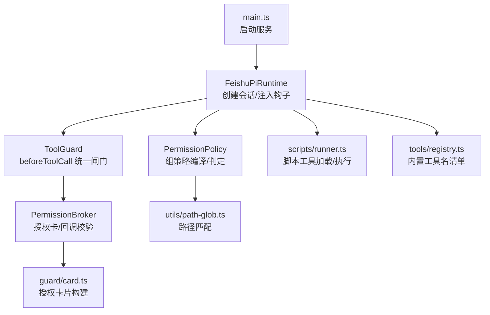
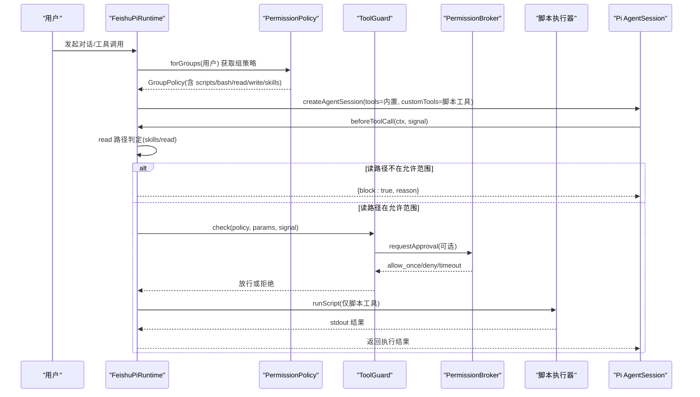
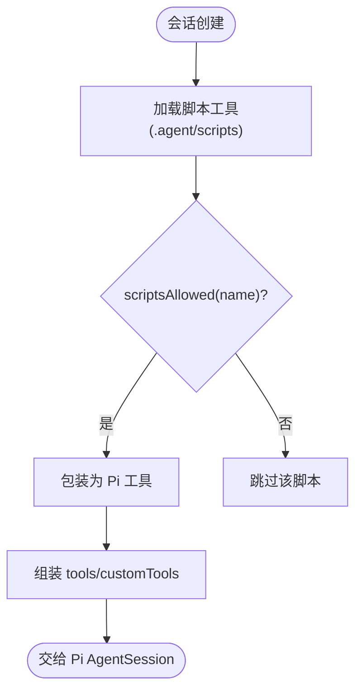
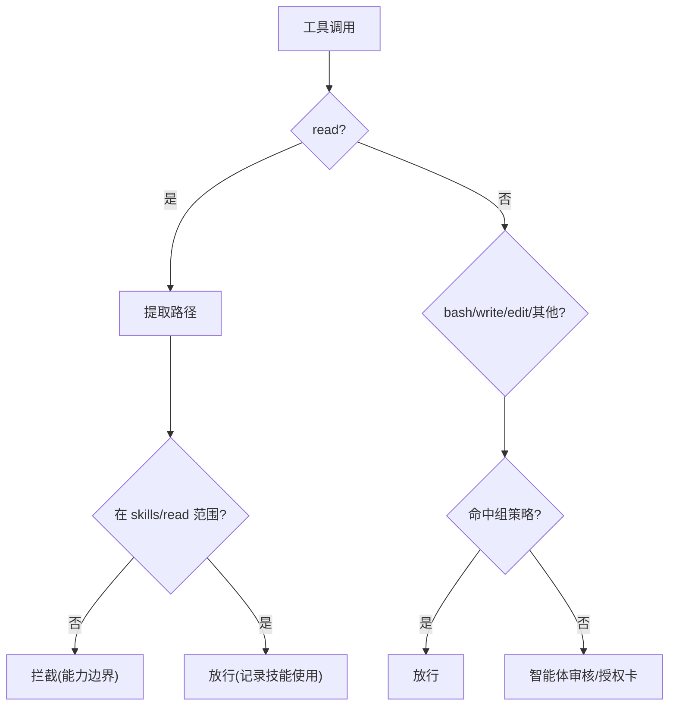
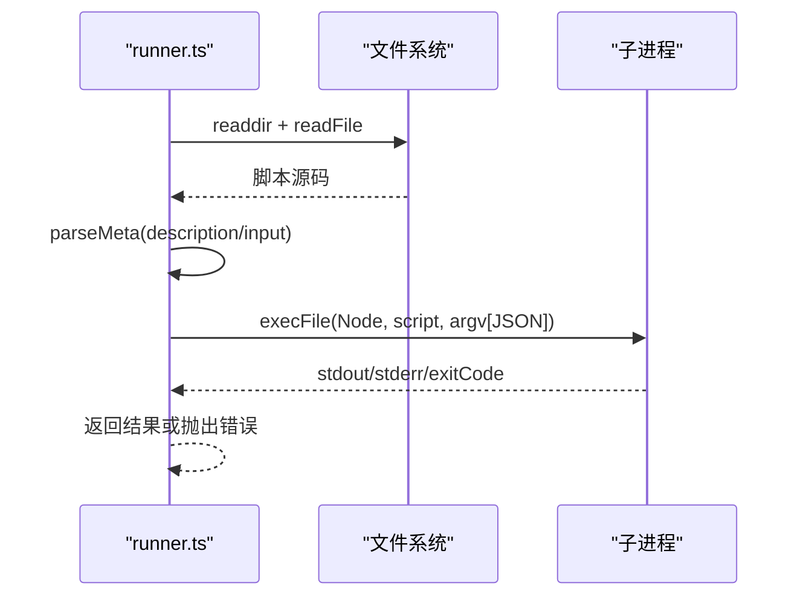
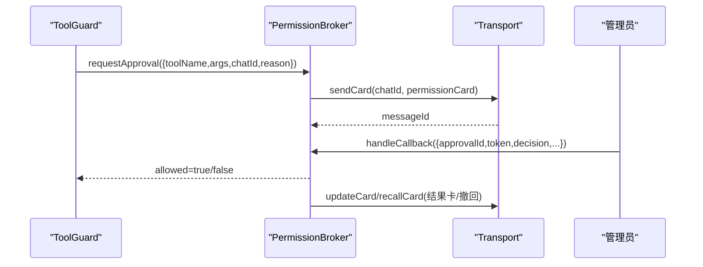
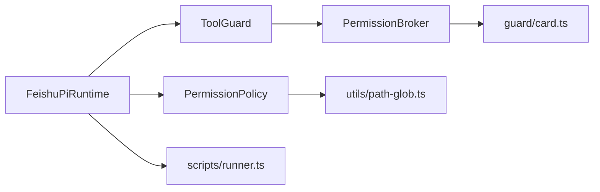

# 工具执行

<cite>
**本文引用的文件**
- [src/main.ts](file://src/main.ts)
- [src/runtime/feishu-pi-runtime.ts](file://src/runtime/feishu-pi-runtime.ts)
- [src/runtime/types.ts](file://src/runtime/types.ts)
- [src/tools/registry.ts](file://src/tools/registry.ts)
- [src/scripts/runner.ts](file://src/scripts/runner.ts)
- [src/permission/policy.ts](file://src/permission/policy.ts)
- [src/guard/broker.ts](file://src/guard/broker.ts)
- [src/guard/card.ts](file://src/guard/card.ts)
- [src/utils/path-glob.ts](file://src/utils/path-glob.ts)
- [test/tool-guard.test.ts](file://test/tool-guard.test.ts)
- [README.md](file://README.md)
</cite>

## 目录
1. [简介](#简介)
2. [项目结构](#项目结构)
3. [核心组件](#核心组件)
4. [架构总览](#架构总览)
5. [详细组件分析](#详细组件分析)
6. [依赖关系分析](#依赖关系分析)
7. [性能与资源管理](#性能与资源管理)
8. [故障排查指南](#故障排查指南)
9. [结论](#结论)
10. [附录：开发指南与最佳实践](#附录开发指南与最佳实践)

## 简介
本文件系统化说明“工具执行系统”的设计与实现，覆盖工具注册机制、执行环境隔离、安全控制策略、内置工具（read、bash、write、edit）的实现原理、脚本工具的加载与执行流程、权限控制与风险评估、高危工具保护、调用链与错误处理、资源管理与性能优化。目标是让读者既能快速上手，也能深入理解代码级细节。

## 项目结构
仓库围绕“运行时 + 权限策略 + 工具守卫 + 脚本执行器”组织：
- 运行时：负责会话创建、模型接入、工具装配与 beforeToolCall 钩子注入
- 权限策略：基于 .agent/permissions.json 的组策略，提供 scripts/bash/read/write/skills 判定
- 工具守卫：beforeToolCall 的统一闸门，结合策略与智能体审核、管理员授权卡
- 脚本执行器：扫描 .agent/scripts/*.ts，解析元数据并以子进程方式执行
- 辅助能力：路径 glob 匹配、卡片构建、日志等

图表来源
- [src/main.ts:106-132](file://src/main.ts#L106-L132)
- [src/runtime/feishu-pi-runtime.ts:147-284](file://src/runtime/feishu-pi-runtime.ts#L147-L284)
- [src/permission/policy.ts:68-158](file://src/permission/policy.ts#L68-L158)
- [src/scripts/runner.ts:31-96](file://src/scripts/runner.ts#L31-L96)
- [src/tools/registry.ts:8-45](file://src/tools/registry.ts#L8-L45)
- [src/utils/path-glob.ts:10-41](file://src/utils/path-glob.ts#L10-L41)
- [src/guard/broker.ts:46-199](file://src/guard/broker.ts#L46-L199)
- [src/guard/card.ts:27-86](file://src/guard/card.ts#L27-L86)

章节来源
- [src/main.ts:27-286](file://src/main.ts#L27-L286)
- [src/runtime/feishu-pi-runtime.ts:1-301](file://src/runtime/feishu-pi-runtime.ts#L1-L301)
- [src/permission/policy.ts:1-253](file://src/permission/policy.ts#L1-L253)
- [src/scripts/runner.ts:1-96](file://src/scripts/runner.ts#L1-L96)
- [src/tools/registry.ts:1-46](file://src/tools/registry.ts#L1-L46)
- [src/utils/path-glob.ts:1-55](file://src/utils/path-glob.ts#L1-L55)
- [src/guard/broker.ts:1-200](file://src/guard/broker.ts#L1-L200)
- [src/guard/card.ts:1-102](file://src/guard/card.ts#L1-L102)

## 核心组件
- 运行时 FeishuPiRuntime：组装模型、会话、工具；在 beforeToolCall 中实施 read 范围判定与 ToolGuard 拦截；记录技能使用统计；按组策略注册脚本工具。
- 权限策略 PermissionPolicy：从 .agent/permissions.json 加载并热重载；合并 common ∪ 各组；提供 scriptsAllowed、bashAllowed、readAllowed、writeAllowed、skillsAllowed 判定函数。
- 工具守卫 ToolGuard：统一闸门，先走策略白名单放行，再走智能体综合判断，最后回退到管理员授权卡；支持 risky 标记强制弹卡。
- 授权中枢 PermissionBroker：维护待授权请求、发送/更新/撤回卡片、转发管理员私聊、服务端强校验 token/卡片来源/管理员身份。
- 脚本执行器 runner：扫描 .agent/scripts/*.ts，解析顶部注释元数据，封装为可注册工具；以子进程执行，限制超时与输出大小。
- 路径匹配 path-glob：glob → 正则，支持 cwd 归一化、家目录展开、任意深度匹配。

章节来源
- [src/runtime/feishu-pi-runtime.ts:147-284](file://src/runtime/feishu-pi-runtime.ts#L147-L284)
- [src/permission/policy.ts:68-158](file://src/permission/policy.ts#L68-L158)
- [src/scripts/runner.ts:31-96](file://src/scripts/runner.ts#L31-L96)
- [src/guard/broker.ts:46-199](file://src/guard/broker.ts#L46-L199)
- [src/utils/path-glob.ts:10-41](file://src/utils/path-glob.ts#L10-L41)

## 架构总览
下图展示一次工具调用的完整链路：从会话创建、工具装配、beforeToolCall 钩子、策略判定、智能体审核、授权卡交互到最终执行。

图表来源
- [src/runtime/feishu-pi-runtime.ts:147-284](file://src/runtime/feishu-pi-runtime.ts#L147-L284)
- [src/permission/policy.ts:110-158](file://src/permission/policy.ts#L110-L158)
- [src/scripts/runner.ts:62-79](file://src/scripts/runner.ts#L62-L79)
- [src/guard/broker.ts:78-129](file://src/guard/broker.ts#L78-L129)

## 详细组件分析

### 工具注册机制
- 内置工具名清单：DEFAULT_BUILTIN_TOOLS = ["read", "write", "edit", "bash"]，由 registry 暴露。
- 运行时装配：
  - 负责人组：注册 read、bash、write、edit
  - 普通用户组：注册 bash、read
  - 脚本工具：loadScriptTools 扫描 .agent/scripts/*.ts，按组 scriptsAllowed 过滤后包装为 Pi 工具
  - 自定义工具：若存在 risk: "high" 则进入 riskyTools 集合，后续强制走授权卡
- 旧版自定义工具目录（.agent/tools）已退役，改为脚本模式。

图表来源
- [src/tools/registry.ts:8-45](file://src/tools/registry.ts#L8-L45)
- [src/runtime/feishu-pi-runtime.ts:170-216](file://src/runtime/feishu-pi-runtime.ts#L170-L216)
- [src/scripts/runner.ts:31-59](file://src/scripts/runner.ts#L31-L59)

章节来源
- [src/tools/registry.ts:1-46](file://src/tools/registry.ts#L1-L46)
- [src/runtime/feishu-pi-runtime.ts:170-216](file://src/runtime/feishu-pi-runtime.ts#L170-L216)
- [src/scripts/runner.ts:31-59](file://src/scripts/runner.ts#L31-L59)

### 执行环境隔离与安全控制
- 脚本执行隔离：通过 child_process.execFile 以独立 Node 进程运行脚本，参数经 JSON 序列化传入 argv；设置超时与输出上限，避免资源滥用。
- 路径访问隔离：read 工具在 beforeToolCall 中根据 skills 可见范围与 read 范围判定；范围外直接拦截不弹卡。
- 命令执行隔离：bash 命中组 bash 名单放行；含 shell 拼接符的命令不参与前缀匹配，交由授权卡。
- 写操作隔离：write/edit 命中组 write 范围放行；范围外交智能体/授权卡。
- 高风险工具：自定义工具标记 risk: "high" 时强制走授权卡。

图表来源
- [src/runtime/feishu-pi-runtime.ts:226-282](file://src/runtime/feishu-pi-runtime.ts#L226-L282)
- [src/permission/policy.ts:145-155](file://src/permission/policy.ts#L145-L155)
- [src/scripts/runner.ts:62-79](file://src/scripts/runner.ts#L62-L79)

章节来源
- [src/runtime/feishu-pi-runtime.ts:226-282](file://src/runtime/feishu-pi-runtime.ts#L226-L282)
- [src/permission/policy.ts:145-155](file://src/permission/policy.ts#L145-L155)
- [src/scripts/runner.ts:62-79](file://src/scripts/runner.ts#L62-L79)

### 内置工具实现原理（read、bash、write、edit）
- 这些工具由 Pi 框架提供，运行时通过名称列表注入。
- 行为受 beforeToolCall 钩子约束：
  - read：路径必须在组的 skills/read 范围内，否则直接拦截
  - bash：命令必须命中组 bash 名单（精确/前缀），含拼接符则交授权卡
  - write/edit：路径必须在组 write 范围内，否则交智能体/授权卡
- 风险点：read 范围外是能力边界，不会弹卡；其余场景遵循“非允许即 ask”。

章节来源
- [src/runtime/feishu-pi-runtime.ts:204-282](file://src/runtime/feishu-pi-runtime.ts#L204-L282)
- [src/permission/policy.ts:145-155](file://src/permission/policy.ts#L145-L155)

### 脚本工具的加载与执行流程
- 加载：扫描 .agent/scripts/*.ts，读取源码顶部注释解析 description/input 元数据；缺失 description 的脚本被跳过。
- 包装：将每个脚本包装为 ScriptTool，name 为文件名去扩展名，run(input) 以子进程执行。
- 执行：execFile(process.execPath, [abs, JSON.stringify(input)])，设置超时与 maxBuffer；stdout 作为结果，stderr/error 作为失败原因；输出截断防止过大。
- 权限：仅在组 scriptsAllowed 名单内的脚本才会注册到会话。

图表来源
- [src/scripts/runner.ts:31-96](file://src/scripts/runner.ts#L31-L96)

章节来源
- [src/scripts/runner.ts:31-96](file://src/scripts/runner.ts#L31-L96)

### 权限策略与风险评估
- 策略文件：.agent/permissions.json，定义 common 与各组成员、scripts、bash、read、write、skills。
- 合并规则：生效范围 = common ∪ 所属各组；owner 默认全量；未配置 user 保守缺省（仅技能目录可读）。
- 判定函数：
  - scriptsAllowed：脚本名是否允许
  - bashAllowed：命令精确/前缀匹配，含 shell 拼接符直接拒绝匹配
  - readAllowed / writeAllowed：路径 glob 匹配
  - skillsAllowed：技能文件可见性
- 风险评估：risky 标记的工具强制走授权卡；read 范围外直接拦截；bash 拼接逃逸不走前缀匹配。

章节来源
- [src/permission/policy.ts:68-158](file://src/permission/policy.ts#L68-L158)
- [src/runtime/feishu-pi-runtime.ts:199-207](file://src/runtime/feishu-pi-runtime.ts#L199-L207)

### 授权卡与回调安全
- 授权卡：包含工具摘要、脱敏参数、三个按钮（允许一次/拒绝/转发管理员）。
- 服务端校验：approvalId + token 一致、卡片来源匹配、点击者必须是管理员、decision 合法、未处理过。
- 生命周期：发送授权卡 → 等待决策 → 超时/取消/拒绝 → 更新/撤回卡片；允许一次后放行。

图表来源
- [src/guard/broker.ts:78-199](file://src/guard/broker.ts#L78-L199)
- [src/guard/card.ts:27-86](file://src/guard/card.ts#L27-L86)

章节来源
- [src/guard/broker.ts:78-199](file://src/guard/broker.ts#L78-L199)
- [src/guard/card.ts:27-86](file://src/guard/card.ts#L27-L86)

### 调用链与错误处理
- 调用链：用户 → Runtime → Policy → ToolGuard → Broker → Transport → 子进程/外部 API
- 错误处理：
  - 策略文件解析失败：按保守默认处理
  - 脚本执行失败：stderr/error 信息截断后返回
  - Guard 异常：按拒绝处理并记录告警
  - 授权卡发送失败：直接拒绝并唤醒等待方
  - 会话中断：/stop 触发 AbortSignal，取消授权等待并收尾卡片

章节来源
- [src/permission/policy.ts:178-210](file://src/permission/policy.ts#L178-L210)
- [src/scripts/runner.ts:62-79](file://src/scripts/runner.ts#L62-L79)
- [src/runtime/feishu-pi-runtime.ts:261-282](file://src/runtime/feishu-pi-runtime.ts#L261-L282)
- [src/guard/broker.ts:108-129](file://src/guard/broker.ts#L108-L129)

## 依赖关系分析
- Runtime 依赖 Policy 与 ToolGuard，ToolGuard 依赖 Broker 与可选的智能体审核
- Scripts Runner 被 Runtime 用于加载脚本工具
- Path-Glob 被 Policy 与 Runtime 用于路径匹配
- Card 模块被 Broker 用于构建授权卡片

图表来源
- [src/runtime/feishu-pi-runtime.ts:147-284](file://src/runtime/feishu-pi-runtime.ts#L147-L284)
- [src/permission/policy.ts:68-158](file://src/permission/policy.ts#L68-L158)
- [src/scripts/runner.ts:31-96](file://src/scripts/runner.ts#L31-L96)
- [src/utils/path-glob.ts:10-41](file://src/utils/path-glob.ts#L10-L41)
- [src/guard/broker.ts:46-199](file://src/guard/broker.ts#L46-L199)
- [src/guard/card.ts:27-86](file://src/guard/card.ts#L27-L86)

章节来源
- [src/runtime/feishu-pi-runtime.ts:147-284](file://src/runtime/feishu-pi-runtime.ts#L147-L284)
- [src/permission/policy.ts:68-158](file://src/permission/policy.ts#L68-L158)
- [src/scripts/runner.ts:31-96](file://src/scripts/runner.ts#L31-L96)
- [src/utils/path-glob.ts:10-41](file://src/utils/path-glob.ts#L10-L41)
- [src/guard/broker.ts:46-199](file://src/guard/broker.ts#L46-L199)
- [src/guard/card.ts:27-86](file://src/guard/card.ts#L27-L86)

## 性能与资源管理
- 脚本执行资源限制：
  - 超时：EXEC_TIMEOUT_MS 防止长时间阻塞
  - 输出上限：OUTPUT_CAP 限制 stdout 长度，避免消息过大
  - 缓冲区：maxBuffer 限制子进程输出缓冲
- 路径匹配性能：glob → 正则一次性编译，matchGlobs 对目标路径进行相对/绝对双测，避免穿越路径误判
- 策略热重载：基于 mtime 的文件监听，新会话即时生效，减少重启成本
- 技能使用统计：独立追加式事件流，不影响主流程，失败仅告警

章节来源
- [src/scripts/runner.ts:20-22](file://src/scripts/runner.ts#L20-L22)
- [src/scripts/runner.ts:62-79](file://src/scripts/runner.ts#L62-L79)
- [src/utils/path-glob.ts:10-41](file://src/utils/path-glob.ts#L10-L41)
- [src/permission/policy.ts:178-210](file://src/permission/policy.ts#L178-L210)

## 故障排查指南
- 策略文件问题：
  - 现象：权限异常或工具不可用
  - 排查：检查 .agent/permissions.json 语法与字段；确认 mtime 变化已生效；查看日志中的策略加载提示
- 脚本工具问题：
  - 现象：脚本未注册或执行失败
  - 排查：确认脚本位于 .agent/scripts/ 且以 .ts 结尾；顶部注释包含 description；检查 stderr 与退出码
- 授权卡问题：
  - 现象：无法授权或授权无效
  - 排查：确认 adminOpenIds 已配置；检查回调参数 approvalId/token/chatId 一致性；查看 Broker 日志
- read 范围拦截：
  - 现象：read 被直接拦截且不弹卡
  - 排查：确认目标路径是否在组的 skills/read 范围内；必要时调整 permissions.json 的 read/skills 配置
- 会话中断：
  - 现象：/stop 后授权卡未清理
  - 排查：确认 shouldRecall 逻辑与 recallCard 实现；检查 Broker finalizeCards 是否执行

章节来源
- [src/permission/policy.ts:178-210](file://src/permission/policy.ts#L178-L210)
- [src/scripts/runner.ts:31-59](file://src/scripts/runner.ts#L31-L59)
- [src/guard/broker.ts:58-72](file://src/guard/broker.ts#L58-L72)
- [src/runtime/feishu-pi-runtime.ts:226-282](file://src/runtime/feishu-pi-runtime.ts#L226-L282)

## 结论
本系统通过“策略文件 + 统一闸门 + 授权卡”的三层控制，实现了工具执行的细粒度权限控制与风险隔离。内置工具与脚本工具在运行时按需装配，beforeToolCall 钩子确保每次调用都经过策略与风险评估。脚本执行以子进程隔离，配合超时与输出限制保障稳定性。授权卡流程提供人机协同的安全兜底，支持转发管理员私聊与结果可视化。整体设计兼顾安全性、可维护性与可扩展性。

## 附录：开发指南与最佳实践

### 工具开发指南
- 脚本工具规范：
  - 位置：.agent/scripts/*.ts
  - 元数据：顶部注释声明 description（必需）、input（可选）
  - 输入输出：通过 process.argv[2] 接收 JSON 参数；console.log 输出结果
  - 退出码：非零视为失败
- 自定义工具（TypeScript）：
  - 可通过 runtime 的 customTools 注入；如需强制弹卡，设置 risk: "high"
  - 注意：自定义工具准入已在注册层按组过滤，risk 标记用于二次防护

章节来源
- [src/scripts/runner.ts:6-18](file://src/scripts/runner.ts#L6-L18)
- [src/scripts/runner.ts:31-59](file://src/scripts/runner.ts#L31-L59)
- [src/runtime/feishu-pi-runtime.ts:199-207](file://src/runtime/feishu-pi-runtime.ts#L199-L207)

### 调试方法
- 日志定位：关注 [Scripts]、[Policy]、[Broker]、[Runtime] 等日志前缀
- 策略验证：使用 /perm 指令查看当前生效策略与成员
- 脚本调试：在脚本中打印关键变量；检查 stderr 与退出码；确认超时与输出上限
- 授权卡调试：确认 adminOpenIds 配置；检查回调参数与卡片来源；观察结果卡内容

章节来源
- [src/scripts/runner.ts:44-57](file://src/scripts/runner.ts#L44-L57)
- [src/permission/policy.ts:191-210](file://src/permission/policy.ts#L191-L210)
- [src/guard/broker.ts:108-129](file://src/guard/broker.ts#L108-L129)

### 性能优化技巧
- 脚本工具：尽量轻量，避免重型依赖；合理拆分职责，减少单次执行时间
- 路径匹配：使用精准 glob，避免过度宽泛的 ** 匹配
- 策略文件：精简 rules，避免过多条目导致合并开销
- 授权卡：合理使用 allow 规则减少弹卡频率；启用精简模式自动撤回卡片

章节来源
- [src/utils/path-glob.ts:10-41](file://src/utils/path-glob.ts#L10-L41)
- [src/permission/policy.ts:120-133](file://src/permission/policy.ts#L120-L133)
- [src/guard/broker.ts:58-72](file://src/guard/broker.ts#L58-L72)

### 测试与回归
- 单元测试：参考 tool-guard.test.ts 中对策略、智能体、授权卡的组合用例
- 回归要点：bash 前缀匹配、write 路径范围、scripts 名单、risky 标记、read 范围拦截

章节来源
- [test/tool-guard.test.ts:1-91](file://test/tool-guard.test.ts#L1-L91)