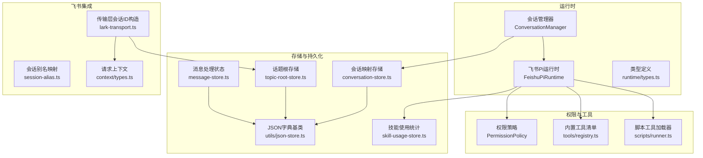
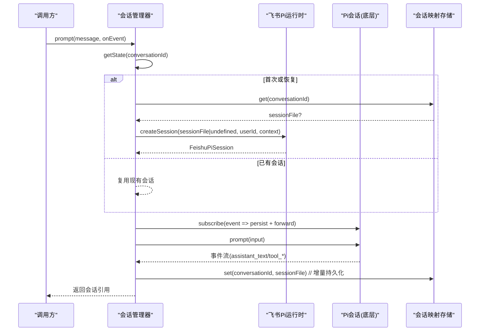
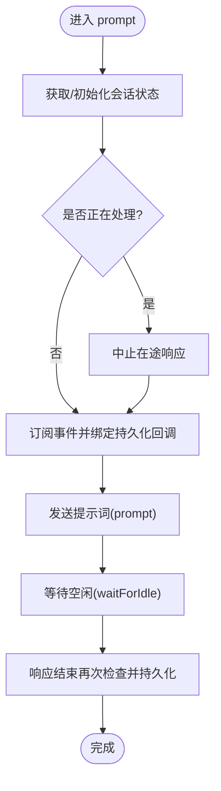
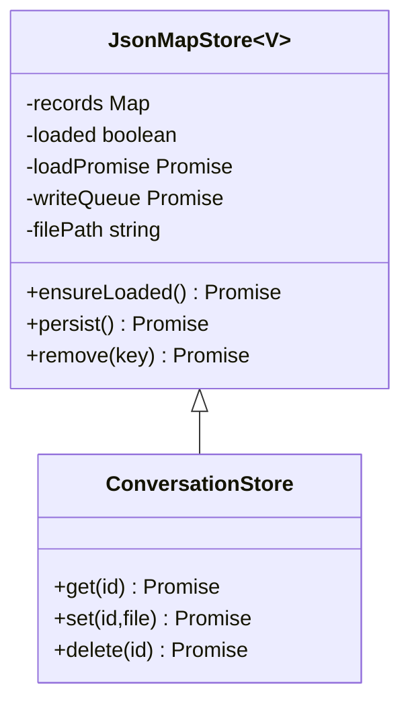
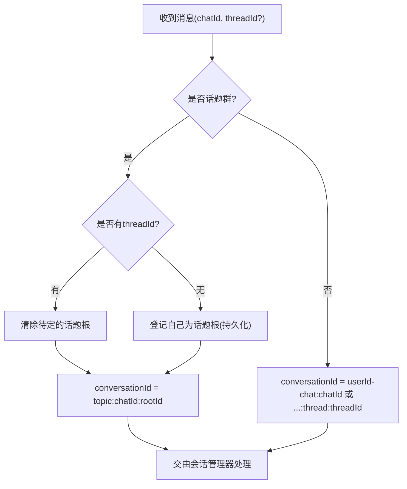
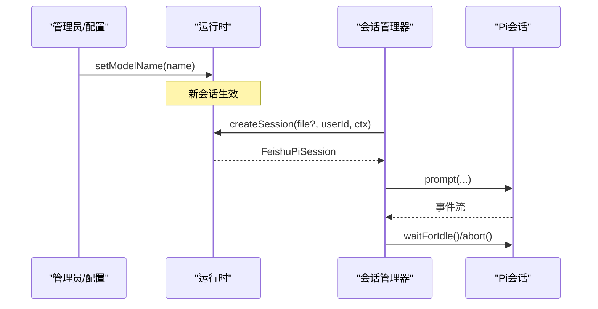
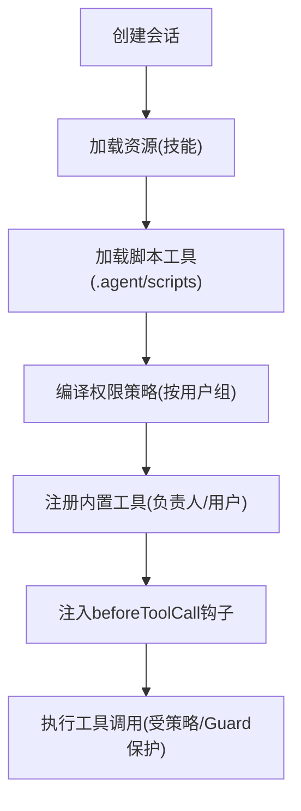
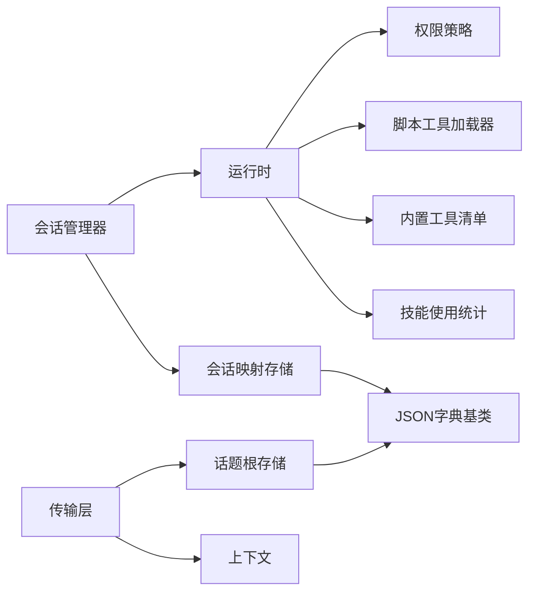

# 智能体运行时

<cite>
**本文引用的文件**
- [conversation-manager.ts](file://src/runtime/conversation-manager.ts)
- [conversation-store.ts](file://src/runtime/conversation-store.ts)
- [feishu-pi-runtime.ts](file://src/runtime/feishu-pi-runtime.ts)
- [types.ts](file://src/runtime/types.ts)
- [json-store.ts](file://src/utils/json-store.ts)
- [policy.ts](file://src/permission/policy.ts)
- [runner.ts](file://src/scripts/runner.ts)
- [registry.ts](file://src/tools/registry.ts)
- [skill-usage-tool.ts](file://src/stats/skill-usage-tool.ts)
- [skill-usage-store.ts](file://src/stats/skill-usage-store.ts)
- [topic-root-store.ts](file://src/feishu/topic-root-store.ts)
- [message-store.ts](file://src/feishu/message-store.ts)
- [session-alias.ts](file://src/feishu/session-alias.ts)
- [lark-transport.ts](file://src/feishu/lark-transport.ts)
- [types.ts（上下文）](file://src/context/types.ts)
</cite>

## 目录
1. [简介](#简介)
2. [项目结构](#项目结构)
3. [核心组件](#核心组件)
4. [架构总览](#架构总览)
5. [详细组件分析](#详细组件分析)
6. [依赖关系分析](#依赖关系分析)
7. [性能考虑](#性能考虑)
8. [故障排查指南](#故障排查指南)
9. [结论](#结论)
10. [附录](#附录)

## 简介
本文件面向开发者，系统化说明智能体运行时的会话管理、模型切换、工具执行环境、资源加载、会话隔离与持久化恢复策略。重点覆盖：
- 多轮对话状态维护与会话队列串行化
- 会话映射的增量持久化与崩溃恢复
- 会话别名映射与话题根持久化
- 模型切换逻辑与会话生命周期管理
- 工具执行环境与权限策略（负责人/用户组）
- 错误恢复机制与性能优化建议

## 项目结构
运行时相关代码主要分布在 runtime、permission、scripts、stats、utils、feishu 等模块中，围绕“会话管理器 + 运行时 + 权限策略 + 存储”展开。

图表来源
- [conversation-manager.ts:22-118](file://src/runtime/conversation-manager.ts#L22-L118)
- [feishu-pi-runtime.ts:81-289](file://src/runtime/feishu-pi-runtime.ts#L81-L289)
- [policy.ts:68-158](file://src/permission/policy.ts#L68-L158)
- [runner.ts:31-96](file://src/scripts/runner.ts#L31-L96)
- [json-store.ts:10-57](file://src/utils/json-store.ts#L10-L57)
- [conversation-store.ts:12-30](file://src/runtime/conversation-store.ts#L12-L30)
- [topic-root-store.ts:8-26](file://src/feishu/topic-root-store.ts#L8-L26)
- [message-store.ts:14-48](file://src/feishu/message-store.ts#L14-L48)
- [skill-usage-store.ts:67-157](file://src/stats/skill-usage-store.ts#L67-L157)
- [lark-transport.ts:155-175](file://src/feishu/lark-transport.ts#L155-L175)
- [types.ts（上下文）:1-11](file://src/context/types.ts#L1-L11)

章节来源
- [conversation-manager.ts:22-118](file://src/runtime/conversation-manager.ts#L22-L118)
- [feishu-pi-runtime.ts:81-289](file://src/runtime/feishu-pi-runtime.ts#L81-L289)
- [policy.ts:68-158](file://src/permission/policy.ts#L68-L158)
- [json-store.ts:10-57](file://src/utils/json-store.ts#L10-L57)

## 核心组件
- 会话管理器（ConversationManager）：负责同一会话内的消息排队、在途中断、事件订阅与增量持久化，保证多轮对话顺序执行与可恢复性。
- 飞书Pi运行时（FeishuPiRuntime）：封装 Pi AgentSession 创建、模型选择、资源加载、工具注册与 beforeToolCall 钩子（权限过滤与统计）。
- 权限策略（PermissionPolicy）：统一解析 .agent/permissions.json，按身份组合并生效范围，提供 read/write/bash/scripts/skills 判定。
- 存储层（JsonMapStore 及其子类）：懒加载、串行写队列、原子替换，支撑会话映射、话题根、消息状态等持久化。
- 脚本工具加载器（scripts/runner.ts）：扫描 .agent/scripts/*.ts，解析元数据并包装为可执行工具。
- 技能使用统计（SkillUsageStore + query 工具）：追加式 JSONL 记录与查询能力，支持展示名解析。

章节来源
- [conversation-manager.ts:22-118](file://src/runtime/conversation-manager.ts#L22-L118)
- [feishu-pi-runtime.ts:81-289](file://src/runtime/feishu-pi-runtime.ts#L81-L289)
- [policy.ts:68-158](file://src/permission/policy.ts#L68-L158)
- [json-store.ts:10-57](file://src/utils/json-store.ts#L10-L57)
- [runner.ts:31-96](file://src/scripts/runner.ts#L31-L96)
- [skill-usage-tool.ts:46-99](file://src/stats/skill-usage-tool.ts#L46-L99)
- [skill-usage-store.ts:67-157](file://src/stats/skill-usage-store.ts#L67-L157)

## 架构总览
运行时以“会话管理器”为中心，将上层传入的消息路由到对应会话的 Pi Session；运行时负责模型、资源、工具与权限策略装配；存储层保障会话映射与话题根的持久化与恢复。

图表来源
- [conversation-manager.ts:33-95](file://src/runtime/conversation-manager.ts#L33-L95)
- [conversation-store.ts:12-30](file://src/runtime/conversation-store.ts#L12-L30)
- [feishu-pi-runtime.ts:147-284](file://src/runtime/feishu-pi-runtime.ts#L147-L284)

## 详细组件分析

### 会话管理器：多轮对话状态维护、队列与中断
- 会话状态：每个 conversationId 对应一个 Promise<ConversationState>，包含 session、任务队列、忙标记与已持久化的 sessionFile。
- 并发控制：同一会话内通过 Promise 链串行执行消息；新消息到达时若处于 busy，先 abort 在途响应再立即开始当前消息。
- 事件订阅：在 prompt 期间订阅 Pi 事件，收到 message_end 等时机即时持久化 sessionFile，确保中断后仍可恢复。
- 恢复策略：initializeState 先从存储读取上次 sessionFile，失败则新建会话；userId 从 conversationId 解析。
- 清理与中止：clear 删除内存映射与存储记录；abort 直接中断指定会话。

图表来源
- [conversation-manager.ts:65-95](file://src/runtime/conversation-manager.ts#L65-L95)

章节来源
- [conversation-manager.ts:22-118](file://src/runtime/conversation-manager.ts#L22-L118)

### 会话持久化与增量落盘
- 会话映射存储（ConversationStore）：维护 conversationId -> { sessionFile, updatedAt } 的映射，基于 JsonMapStore 实现懒加载与原子写入。
- 增量持久化：在 Pi 首个 message_end 生成 sessionFile 后立即写入映射，不等整轮完成；即使随后被中断，下次也能恢复到同一会话。
- 原子写：临时文件 + rename 替换，避免读到半写文件。

图表来源
- [json-store.ts:10-57](file://src/utils/json-store.ts#L10-L57)
- [conversation-store.ts:12-30](file://src/runtime/conversation-store.ts#L12-L30)

章节来源
- [conversation-store.ts:12-30](file://src/runtime/conversation-store.ts#L12-L30)
- [json-store.ts:10-57](file://src/utils/json-store.ts#L10-L57)

### 会话别名映射
- 目的：卡片小字展示短别名，内部维护 别名 → 完整会话ID 的映射，保证同一会话显示稳定。
- 规则：去掉连字符后取前8位作为基础别名；冲突时追加后缀；空输入返回“未知”。

章节来源
- [session-alias.ts:1-34](file://src/feishu/session-alias.ts#L1-L34)

### 话题群与会话隔离规则
- 会话ID构造：
  - 私聊/普通群：按用户隔离，格式如 userId-chat:chatId 或 userId-chatId:thread:threadId。
  - 话题群：同一话题内所有用户共享一个会话，首条消息无 threadId 时用 messageId 作为话题根键并持久化；后续消息 threadId=根消息ID，收敛到同一会话。
- 话题根持久化：TopicRootStore 保存 chatId -> 待定话题根 messageId，确保首条消息中断后仍能正确收敛。
- 消息去重与防重复执行：MessageStore 对消息进行认领（claim），已完成或仍在处理的消息不会重复执行，处理超时可重新认领。

图表来源
- [lark-transport.ts:155-175](file://src/feishu/lark-transport.ts#L155-L175)
- [topic-root-store.ts:8-26](file://src/feishu/topic-root-store.ts#L8-L26)
- [message-store.ts:14-48](file://src/feishu/message-store.ts#L14-L48)

章节来源
- [lark-transport.ts:155-175](file://src/feishu/lark-transport.ts#L155-L175)
- [topic-root-store.ts:8-26](file://src/feishu/topic-root-store.ts#L8-L26)
- [message-store.ts:14-48](file://src/feishu/message-store.ts#L14-L48)

### 模型切换逻辑与会话生命周期
- 模型切换：运行时提供 setModelName，仅对新创建的会话生效；已存在会话沿用旧模型直到清空或重建。
- 会话生命周期：
  - 创建：createSession 根据 sessionFile 决定打开或新建；设置 API Key、加载资源、注册工具、注入 beforeToolCall。
  - 运行：prompt 触发模型推理与工具调用；事件流转发 assistant_text 与工具执行事件。
  - 空闲：waitForIdle 等待会话空闲；abort 中断当前响应。
  - 清理：clear 删除内存映射与存储记录。

图表来源
- [feishu-pi-runtime.ts:98-101](file://src/runtime/feishu-pi-runtime.ts#L98-L101)
- [feishu-pi-runtime.ts:147-284](file://src/runtime/feishu-pi-runtime.ts#L147-L284)
- [conversation-manager.ts:65-118](file://src/runtime/conversation-manager.ts#L65-L118)

章节来源
- [feishu-pi-runtime.ts:98-101](file://src/runtime/feishu-pi-runtime.ts#L98-L101)
- [feishu-pi-runtime.ts:147-284](file://src/runtime/feishu-pi-runtime.ts#L147-L284)
- [conversation-manager.ts:65-118](file://src/runtime/conversation-manager.ts#L65-L118)

### 工具执行环境与资源加载流程
- 资源加载：运行时创建 DefaultResourceLoader，reload 后可加载 skills；技能文档对所有用户开放，不做权限过滤。
- 脚本工具：扫描 .agent/scripts/*.ts，解析 description/input 元数据，包装为工具；按所属组的 scripts 名单注册。
- 内置工具：负责人组全量注册（read/bash/write/edit），用户组仅 bash/read；具体命令与路径约束由策略判定。
- 自定义工具：可标记 risk:"high"，不走策略放行，仍走授权卡。
- beforeToolCall 钩子：
  - read：技能文件按 skills 可见范围判定，其余路径按 read 范围判定；范围内记录技能使用事件。
  - 其他工具：调用 ToolGuard 按组策略判定；异常按拒绝处理。

图表来源
- [feishu-pi-runtime.ts:103-145](file://src/runtime/feishu-pi-runtime.ts#L103-L145)
- [feishu-pi-runtime.ts:170-284](file://src/runtime/feishu-pi-runtime.ts#L170-L284)
- [policy.ts:109-158](file://src/permission/policy.ts#L109-L158)
- [runner.ts:31-96](file://src/scripts/runner.ts#L31-L96)
- [registry.ts:1-46](file://src/tools/registry.ts#L1-L46)

章节来源
- [feishu-pi-runtime.ts:103-145](file://src/runtime/feishu-pi-runtime.ts#L103-L145)
- [feishu-pi-runtime.ts:170-284](file://src/runtime/feishu-pi-runtime.ts#L170-L284)
- [policy.ts:109-158](file://src/permission/policy.ts#L109-L158)
- [runner.ts:31-96](file://src/scripts/runner.ts#L31-L96)
- [registry.ts:1-46](file://src/tools/registry.ts#L1-L46)

### 技能使用统计与查询
- 记录点：在 beforeToolCall 中对 read 技能文件读取进行匹配与记录；统计失败不阻塞工具执行。
- 查询工具：query_skill_usage 提供近7天统计、排行、个人使用等；支持解析用户展示名。
- 存储：JSONL 追加写，内存缓存，读时懒加载。

章节来源
- [feishu-pi-runtime.ts:230-284](file://src/runtime/feishu-pi-runtime.ts#L230-L284)
- [skill-usage-tool.ts:46-99](file://src/stats/skill-usage-tool.ts#L46-L99)
- [skill-usage-store.ts:67-157](file://src/stats/skill-usage-store.ts#L67-L157)

### 上下文与会话标识
- 上下文（FeishuContext）：携带 userOpenId、userName、departmentNames、chatId、threadId、conversationId、isAdmin 等，贯穿会话创建与工具调用。
- 会话ID构造：私聊/普通群按用户隔离；话题群按话题根聚合。

章节来源
- [types.ts（上下文）:1-11](file://src/context/types.ts#L1-L11)
- [lark-transport.ts:155-175](file://src/feishu/lark-transport.ts#L155-L175)

## 依赖关系分析
- 会话管理器依赖运行时与存储：通过运行时创建/恢复会话，通过存储进行映射持久化。
- 运行时依赖权限策略、脚本工具加载器、内置工具清单、技能使用统计。
- 存储层统一基于 JsonMapStore，提供懒加载与原子写。
- 传输层负责会话ID构造与话题根持久化，影响会话隔离与恢复。

图表来源
- [conversation-manager.ts:22-118](file://src/runtime/conversation-manager.ts#L22-L118)
- [feishu-pi-runtime.ts:81-289](file://src/runtime/feishu-pi-runtime.ts#L81-L289)
- [json-store.ts:10-57](file://src/utils/json-store.ts#L10-L57)
- [lark-transport.ts:155-175](file://src/feishu/lark-transport.ts#L155-L175)
- [topic-root-store.ts:8-26](file://src/feishu/topic-root-store.ts#L8-L26)

章节来源
- [conversation-manager.ts:22-118](file://src/runtime/conversation-manager.ts#L22-L118)
- [feishu-pi-runtime.ts:81-289](file://src/runtime/feishu-pi-runtime.ts#L81-L289)
- [json-store.ts:10-57](file://src/utils/json-store.ts#L10-L57)
- [lark-transport.ts:155-175](file://src/feishu/lark-transport.ts#L155-L175)
- [topic-root-store.ts:8-26](file://src/feishu/topic-root-store.ts#L8-L26)

## 性能考虑
- 会话队列串行化：避免同一会话内并发导致的上下文竞争与状态不一致。
- 增量持久化：在首个 message_end 即持久化 sessionFile，缩短恢复窗口，降低丢失风险。
- 原子写：临时文件 + rename 避免读到半写文件，提升稳定性。
- 懒加载与缓存：存储层懒加载文件，减少冷启动开销；技能使用统计内存缓存事件列表。
- 工具执行限制：脚本工具输出截断与超时控制，防止长输出与长时间占用。
- 权限判定前置：beforeToolCall 提前拦截非法访问，减少无效调用成本。

[本节为通用性能讨论，不直接分析具体文件]

## 故障排查指南
- 无法恢复会话：检查会话映射存储是否存在有效 sessionFile；确认运行时 createSession 成功；查看日志中的模型与API Key配置。
- 新消息未打断在途响应：确认会话管理器 busy 标志与 abort 调用；检查事件订阅是否正确释放。
- 工具调用被拒绝：检查权限策略中 read/bash/scripts 配置；确认 beforeToolCall 钩子与 ToolGuard 返回值；关注高风险工具是否需授权卡。
- 技能使用统计缺失：确认 beforeToolCall 中 matchSkillRead 匹配成功；检查 SkillUsageStore 写入是否成功；查看日志告警。
- 话题群会话分裂：检查 TopicRootStore 是否正确登记与清除；确认 lark-transport 会话ID构造逻辑。

章节来源
- [conversation-manager.ts:65-118](file://src/runtime/conversation-manager.ts#L65-L118)
- [feishu-pi-runtime.ts:230-284](file://src/runtime/feishu-pi-runtime.ts#L230-L284)
- [policy.ts:109-158](file://src/permission/policy.ts#L109-L158)
- [skill-usage-store.ts:84-119](file://src/stats/skill-usage-store.ts#L84-L119)
- [topic-root-store.ts:8-26](file://src/feishu/topic-root-store.ts#L8-L26)
- [lark-transport.ts:155-175](file://src/feishu/lark-transport.ts#L155-L175)

## 结论
本运行时通过会话管理器、运行时、权限策略与存储层的协同，实现了可靠的多轮对话状态维护、增量持久化与快速恢复；通过灵活的模型切换、工具执行环境与权限控制，满足私聊、普通群与话题群的差异化隔离需求；结合技能使用统计与原子写、懒加载等优化手段，兼顾了功能完整性与系统稳定性。

[本节为总结性内容，不直接分析具体文件]

## 附录
- 关键接口与类型参考：
  - 会话事件与提示词：FeishuPiEvent、FeishuPiPrompt、FeishuPiSession
  - 运行时配置：FeishuPiConfig（含 modelProvider/modelName/adminId/permissionPolicy/toolGuard/skillUsageStore/scheduleService）
  - 权限策略：GroupPolicy（scriptsAllowed/bashAllowed/readAllowed/writeAllowed/skillsAllowed/describe）
  - 上下文：FeishuContext（userOpenId/chatId/threadId/conversationId/isAdmin）

章节来源
- [types.ts:13-67](file://src/runtime/types.ts#L13-L67)
- [policy.ts:43-57](file://src/permission/policy.ts#L43-L57)
- [types.ts（上下文）:1-11](file://src/context/types.ts#L1-L11)