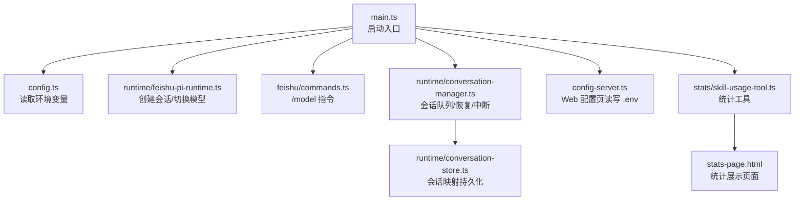
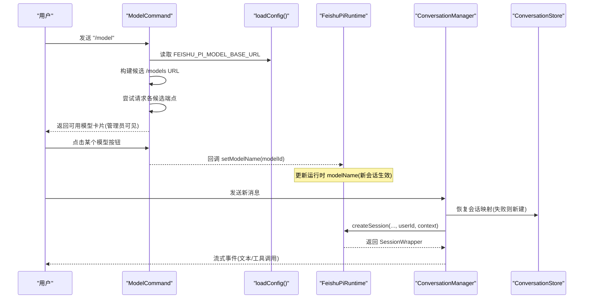
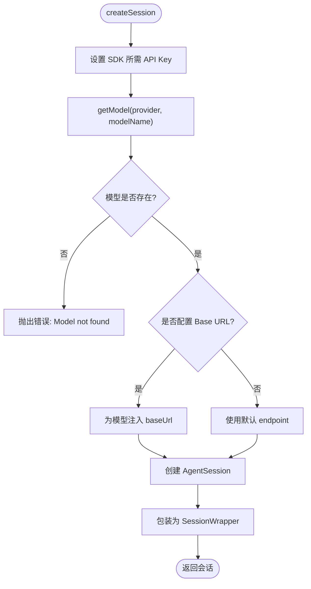
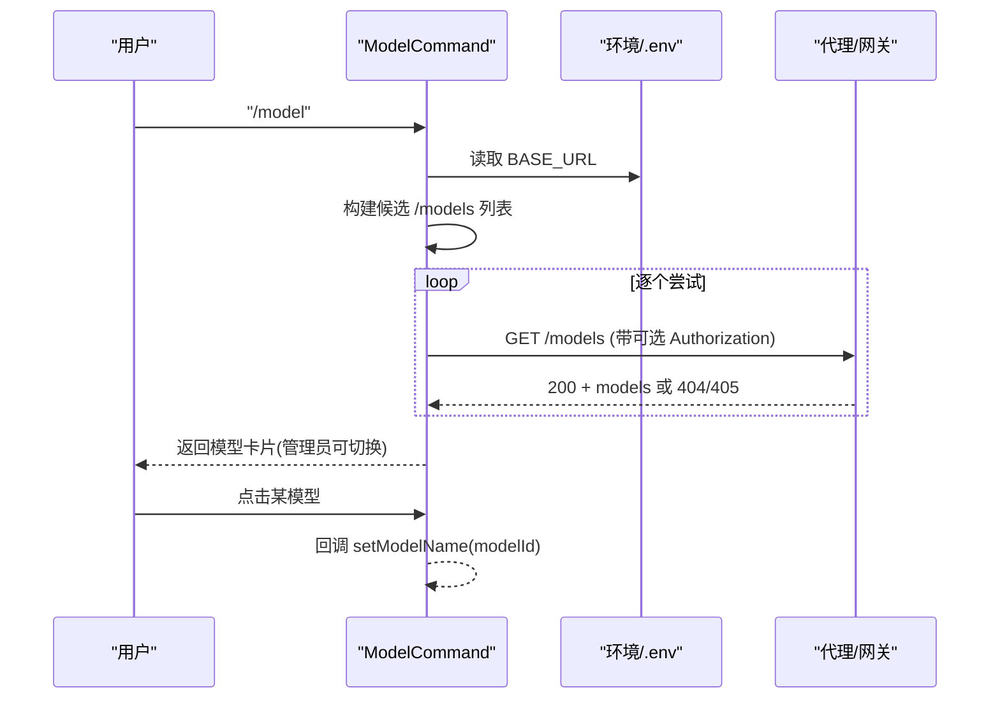
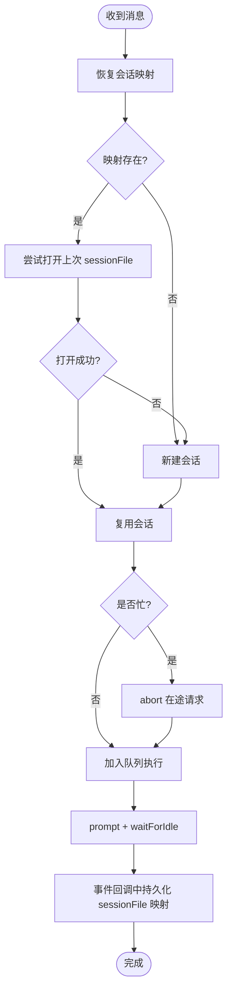
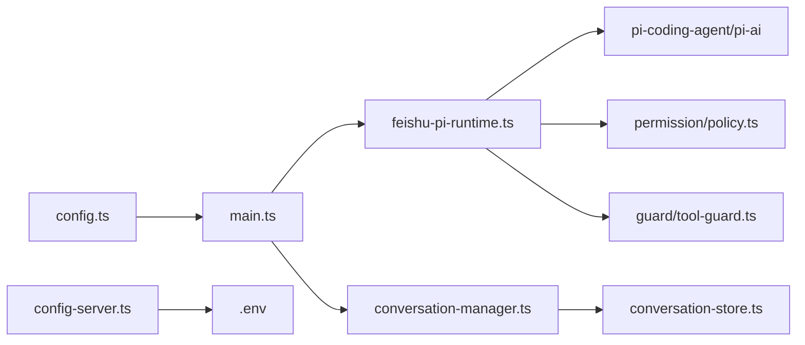

# 模型管理

<cite>
**本文引用的文件**
- [src/config.ts](file://src/config.ts)
- [src/config-server.ts](file://src/config-server.ts)
- [src/main.ts](file://src/main.ts)
- [src/feishu/commands.ts](file://src/feishu/commands.ts)
- [src/runtime/feishu-pi-runtime.ts](file://src/runtime/feishu-pi-runtime.ts)
- [src/runtime/conversation-manager.ts](file://src/runtime/conversation-manager.ts)
- [src/runtime/conversation-store.ts](file://src/runtime/conversation-store.ts)
- [src/stats/skill-usage-tool.ts](file://src/stats/skill-usage-tool.ts)
- [src/stats-page.html](file://src/stats-page.html)
</cite>

## 目录
1. [简介](#简介)
2. [项目结构](#项目结构)
3. [核心组件](#核心组件)
4. [架构总览](#架构总览)
5. [详细组件分析](#详细组件分析)
6. [依赖关系分析](#依赖关系分析)
7. [性能与监控](#性能与监控)
8. [故障排查指南](#故障排查指南)
9. [结论](#结论)
10. [附录：配置与环境变量](#附录：配置与环境变量)

## 简介
本文件面向“模型管理”主题，系统性说明本仓库中的模型切换逻辑、模型配置管理、运行时模型选择策略，以及支持的模型提供商（Anthropic、OpenAI）配置方式、API 密钥管理与模型参数调优。同时覆盖会话处理、回滚机制、性能监控、最佳实践与故障排查建议，帮助读者在生产环境中稳定、高效地运行多模型智能体服务。

## 项目结构
围绕模型管理的代码主要分布在以下模块：
- 配置层：从环境变量加载模型相关配置，并提供 Web 配置界面持久化到 .env
- 运行时层：创建 Pi 会话、注入模型与工具、支持运行时切换模型名称
- 会话管理层：会话恢复、中断、排队与持久化映射
- 指令层：通过 /model 命令列出并切换模型
- 统计层：技能使用统计页面与查询工具（间接用于模型使用观察）

图表来源
- [src/main.ts:27-224](file://src/main.ts#L27-L224)
- [src/config.ts:25-50](file://src/config.ts#L25-L50)
- [src/runtime/feishu-pi-runtime.ts:81-101](file://src/runtime/feishu-pi-runtime.ts#L81-L101)
- [src/feishu/commands.ts:38-183](file://src/feishu/commands.ts#L38-L183)
- [src/runtime/conversation-manager.ts:42-118](file://src/runtime/conversation-manager.ts#L42-L118)
- [src/runtime/conversation-store.ts:1-30](file://src/runtime/conversation-store.ts#L1-L30)
- [src/config-server.ts:41-88](file://src/config-server.ts#L41-L88)
- [src/stats/skill-usage-tool.ts:1-26](file://src/stats/skill-usage-tool.ts#L1-L26)
- [src/stats-page.html:94-134](file://src/stats-page.html#L94-L134)

章节来源
- [src/main.ts:27-224](file://src/main.ts#L27-L224)
- [src/config.ts:25-50](file://src/config.ts#L25-L50)

## 核心组件
- 配置加载器：集中读取模型提供商、模型名、Base URL、系统提示词等环境变量，提供默认值与校验
- 运行时：封装 Pi 会话创建、模型选择、工具注册、权限策略、会话统计；支持运行时切换模型名
- 会话管理器：负责会话恢复、事件订阅、消息排队、中断与持久化映射
- 指令处理器：/model 命令拉取可用模型列表，生成卡片供管理员点击切换
- 配置服务器：提供 Web 界面编辑 .env，仅管理指定键，保留其他键不变

章节来源
- [src/config.ts:25-50](file://src/config.ts#L25-L50)
- [src/runtime/feishu-pi-runtime.ts:81-101](file://src/runtime/feishu-pi-runtime.ts#L81-L101)
- [src/runtime/conversation-manager.ts:42-118](file://src/runtime/conversation-manager.ts#L42-L118)
- [src/feishu/commands.ts:38-183](file://src/feishu/commands.ts#L38-L183)
- [src/config-server.ts:41-88](file://src/config-server.ts#L41-L88)

## 架构总览
下图展示了从用户发送 /model 到切换模型、再到新会话生效的完整流程，包括候选端点探测、会话恢复与中断、以及运行时热切换。

图表来源
- [src/feishu/commands.ts:43-133](file://src/feishu/commands.ts#L43-L133)
- [src/feishu/commands.ts:144-182](file://src/feishu/commands.ts#L144-L182)
- [src/runtime/feishu-pi-runtime.ts:98-101](file://src/runtime/feishu-pi-runtime.ts#L98-L101)
- [src/runtime/conversation-manager.ts:42-96](file://src/runtime/conversation-manager.ts#L42-L96)
- [src/runtime/conversation-store.ts:14-23](file://src/runtime/conversation-store.ts#L14-L23)

## 详细组件分析

### 模型配置管理（环境变量与 Web 配置）
- 环境变量加载：集中解析模型提供商、模型名、Base URL、系统提示词等，提供默认值与必填项校验
- Web 配置：提供表单编辑 .env，仅管理一组受控键，保存时保留其他键不被覆盖
- 关键要点：
  - 模型提供商与模型名决定底层模型选择
  - Base URL 指向兼容 OpenAI/Anthropic 协议的代理或网关
  - API Key 统一由 FEISHU_PI_MODEL_API_KEY 注入，运行时根据 provider 设置对应 SDK 所需的环境变量

章节来源
- [src/config.ts:25-50](file://src/config.ts#L25-L50)
- [src/config-server.ts:41-88](file://src/config-server.ts#L41-L88)

### 运行时模型选择策略
- 创建会话时：
  - 将 FEISHU_PI_MODEL_API_KEY 写入 ANTHROPIC_API_KEY 或 OPENAI_API_KEY（取决于 modelProvider）
  - 通过 getModel(provider, modelName) 获取模型对象；若未找到则报错
  - 若配置了 modelBaseUrl，则将其注入模型对象作为 baseUrl
- 运行时切换：
  - 通过 setModelName 修改运行时当前 modelName，新创建的会话立即生效；已存在会话沿用旧模型直到重建或清空

图表来源
- [src/runtime/feishu-pi-runtime.ts:147-216](file://src/runtime/feishu-pi-runtime.ts#L147-L216)
- [src/runtime/feishu-pi-runtime.ts:98-101](file://src/runtime/feishu-pi-runtime.ts#L98-L101)

章节来源
- [src/runtime/feishu-pi-runtime.ts:147-216](file://src/runtime/feishu-pi-runtime.ts#L147-L216)
- [src/runtime/feishu-pi-runtime.ts:98-101](file://src/runtime/feishu-pi-runtime.ts#L98-L101)

### 模型切换逻辑（/model 指令）
- 前置条件：必须配置 FEISHU_PI_MODEL_BASE_URL，否则返回错误卡片
- 候选端点探测：
  - 基于 baseURL 智能构造多个 /models 候选地址（含版本段与已知兼容后缀剥离）
  - 依次尝试，优先返回成功且非 404/405 的结果
- 交互流程：
  - 管理员可见模型列表卡片，点击按钮触发回调
  - 回调中调用运行时 setModelName，实现热切换（新会话生效）

图表来源
- [src/feishu/commands.ts:43-133](file://src/feishu/commands.ts#L43-L133)
- [src/feishu/commands.ts:144-182](file://src/feishu/commands.ts#L144-L182)

章节来源
- [src/feishu/commands.ts:43-133](file://src/feishu/commands.ts#L43-L133)
- [src/feishu/commands.ts:144-182](file://src/feishu/commands.ts#L144-L182)

### 会话处理与回滚机制
- 会话恢复：
  - 启动或首次请求时，尝试从 ConversationStore 恢复上次会话映射；失败则新建会话
  - 会话文件一旦可用（首个 message_end 落盘），立即持久化映射，确保中断/崩溃后仍可恢复
- 中断与排队：
  - 新消息到达时，若当前会话仍在处理，会先 abort 在途响应，再排队执行新消息
  - 每个会话维护独立队列，避免并发冲突
- 清理与中止：
  - 支持按 conversationId 清空历史与中断响应

图表来源
- [src/runtime/conversation-manager.ts:42-96](file://src/runtime/conversation-manager.ts#L42-L96)
- [src/runtime/conversation-store.ts:14-23](file://src/runtime/conversation-store.ts#L14-L23)

章节来源
- [src/runtime/conversation-manager.ts:42-118](file://src/runtime/conversation-manager.ts#L42-L118)
- [src/runtime/conversation-store.ts:1-30](file://src/runtime/conversation-store.ts#L1-L30)

### 支持的模型提供商与参数调优
- 提供商：
  - Anthropic：provider=anthropic，SDK 需要 ANTHROPIC_API_KEY
  - OpenAI：provider=openai，SDK 需要 OPENAI_API_KEY
- 参数调优：
  - 通过 FEISHU_PI_MODEL_NAME 指定具体模型版本
  - 通过 FEISHU_PI_MODEL_BASE_URL 指向兼容网关/代理，便于统一鉴权与路由
  - 通过 FEISHU_PI_SYSTEM_PROMPT 注入系统提示词，影响模型行为
  - 工具能力与权限由 .agent/permissions.json 控制，不在环境变量中配置

章节来源
- [src/config.ts:25-50](file://src/config.ts#L25-L50)
- [src/runtime/feishu-pi-runtime.ts:147-168](file://src/runtime/feishu-pi-runtime.ts#L147-L168)

### 运行时模型切换与持久化
- 切换入口：
  - 通过 /model 指令卡片回调触发 setModelName
  - main 中将 transport 的 onModelSwitch 绑定到 runtime.setModelName
- 持久化：
  - 切换后的模型名由 transport 写回 .env（由配置服务器管理受控键）
  - 新会话创建时读取最新 modelName，立即生效

章节来源
- [src/main.ts:90-104](file://src/main.ts#L90-L104)
- [src/runtime/feishu-pi-runtime.ts:98-101](file://src/runtime/feishu-pi-runtime.ts#L98-L101)
- [src/config-server.ts:41-88](file://src/config-server.ts#L41-L88)

## 依赖关系分析
- 配置依赖：
  - loadConfig 提供模型相关配置；config-server 管理 .env 受控键
- 运行时依赖：
  - FeishuPiRuntime 依赖 @earendil-works/pi-coding-agent 与 @earendil-works/pi-ai/compat 进行模型与会话管理
  - 通过 permissionPolicy 与 toolGuard 控制工具调用与权限
- 会话依赖：
  - ConversationManager 依赖 ConversationStore 做映射持久化
  - 依赖 Transport 的 onModelSwitch 回调实现热切换

图表来源
- [src/config.ts:25-50](file://src/config.ts#L25-L50)
- [src/config-server.ts:41-88](file://src/config-server.ts#L41-L88)
- [src/main.ts:27-224](file://src/main.ts#L27-L224)
- [src/runtime/feishu-pi-runtime.ts:81-216](file://src/runtime/feishu-pi-runtime.ts#L81-L216)
- [src/runtime/conversation-manager.ts:42-118](file://src/runtime/conversation-manager.ts#L42-L118)
- [src/runtime/conversation-store.ts:1-30](file://src/runtime/conversation-store.ts#L1-L30)

章节来源
- [src/main.ts:27-224](file://src/main.ts#L27-L224)
- [src/runtime/feishu-pi-runtime.ts:81-216](file://src/runtime/feishu-pi-runtime.ts#L81-L216)

## 性能与监控
- 会话统计：
  - 通过 SessionWrapper.getStats 获取会话级统计（如 token 用量、上下文窗口占用等）
  - 可通过 getStats 接口聚合查看
- 技能使用统计：
  - 记录技能文件读取事件，提供 /stats 页面与查询工具，辅助评估模型对技能的调用情况
- 建议：
  - 结合 getStats 与技能使用统计，评估不同模型的效率与成本
  - 合理设置超时与中断策略，避免长耗时任务阻塞

章节来源
- [src/runtime/feishu-pi-runtime.ts:28-39](file://src/runtime/feishu-pi-runtime.ts#L28-L39)
- [src/stats/skill-usage-tool.ts:1-26](file://src/stats/skill-usage-tool.ts#L1-L26)
- [src/stats-page.html:94-134](file://src/stats-page.html#L94-L134)

## 故障排查指南
- 无法获取模型列表：
  - 检查 FEISHU_PI_MODEL_BASE_URL 是否正确
  - 确认代理/网关暴露 /v1/models 或兼容路径
  - 查看日志中候选端点尝试结果与最后错误信息
- 切换模型无效：
  - 确认已通过 /model 指令触发 setModelName
  - 确认新会话已创建（旧会话不会自动切换）
- 会话丢失或重复：
  - 检查 ConversationStore 映射是否持久化成功
  - 关注事件回调中 sessionFile 是否及时写入
- 工具调用被拒绝：
  - 检查 .agent/permissions.json 与 ToolGuard 策略
  - 高危险工具需走授权卡流程

章节来源
- [src/feishu/commands.ts:43-133](file://src/feishu/commands.ts#L43-L133)
- [src/runtime/conversation-manager.ts:42-118](file://src/runtime/conversation-manager.ts#L42-L118)
- [src/runtime/feishu-pi-runtime.ts:226-282](file://src/runtime/feishu-pi-runtime.ts#L226-L282)

## 结论
本仓库实现了完整的模型管理能力：从配置加载、运行时模型选择、到 /model 指令驱动的在线切换；配合会话恢复、中断与持久化映射，保障高可用与一致性。通过统计与监控能力，可进一步评估模型表现与优化策略。生产部署建议：
- 明确 Base URL 与 API Key 的安全管理
- 使用 Web 配置页统一管理受控键，避免误改
- 结合权限策略与工具守卫，确保工具调用安全可控
- 定期清理过期数据，保持系统健康

## 附录：配置与环境变量
- 模型相关环境变量：
  - FEISHU_PI_MODEL_PROVIDER：模型提供商（anthropic/openai）
  - FEISHU_PI_MODEL_NAME：模型名称
  - FEISHU_PI_MODEL_BASE_URL：模型网关/代理 Base URL
  - FEISHU_PI_MODEL_API_KEY：统一 API Key（运行时注入对应 SDK）
  - FEISHU_PI_SYSTEM_PROMPT：系统提示词（可选）
- 其他相关：
  - FEISHU_GUARD_*：审核接口相关（可选）
  - FEISHU_APPROVAL_TIMEOUT_MS：授权卡片等待超时

章节来源
- [src/config.ts:25-50](file://src/config.ts#L25-L50)
- [src/config-server.ts:41-88](file://src/config-server.ts#L41-L88)