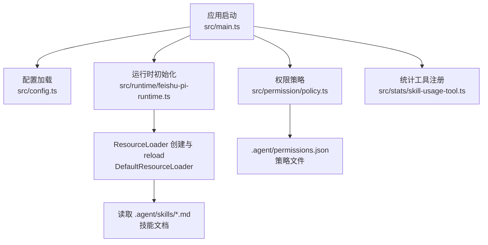
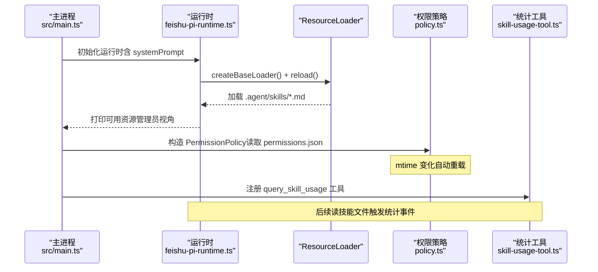
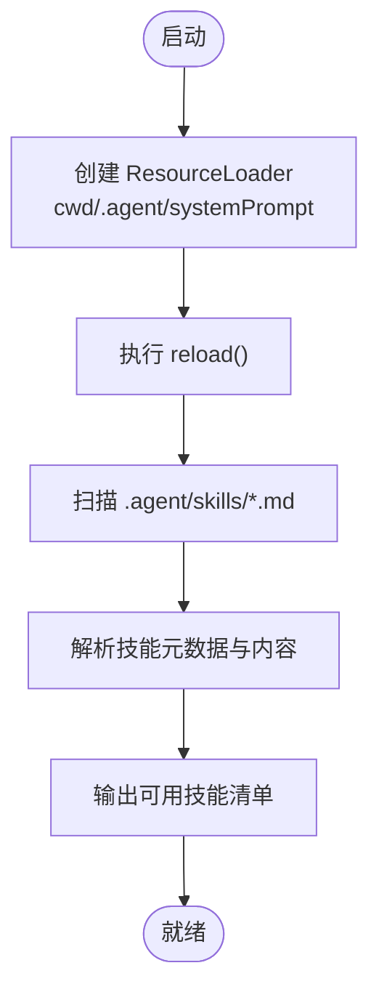
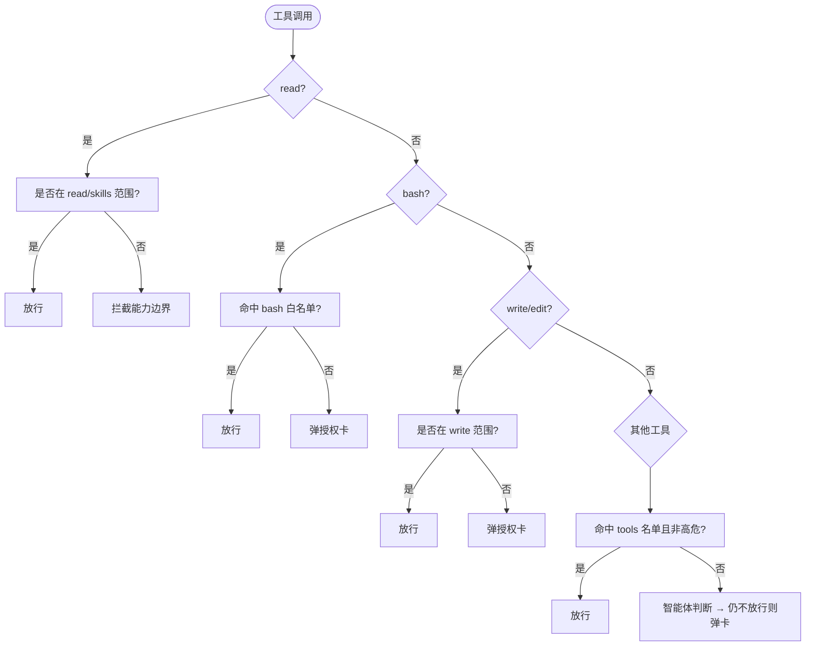
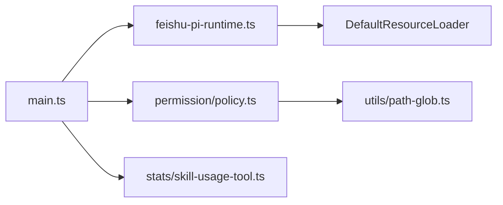

# 资源加载

<cite>
**本文引用的文件**
- [README.md](file://README.md)
- [package.json](file://package.json)
- [.agent/permissions.json](file://.agent/permissions.json)
- [src/main.ts](file://src/main.ts)
- [src/config.ts](file://src/config.ts)
- [src/runtimе/feishu-pi-runtime.ts](file://src/runtime/feishu-pi-runtime.ts)
- [src/permission/policy.ts](file://src/permission/policy.ts)
- [src/stats/skill-usage-tool.ts](file://src/stats/skill-usage-tool.ts)
- [src/utils/json-store.ts](file://src/utils/json-store.ts)
- [test/policy.test.ts](file://test/policy.test.ts)
</cite>

## 目录
1. [简介](#简介)
2. [项目结构](#项目结构)
3. [核心组件](#核心组件)
4. [架构总览](#架构总览)
5. [详细组件分析](#详细组件分析)
6. [依赖关系分析](#依赖关系分析)
7. [性能与缓存](#性能与缓存)
8. [故障排查](#故障排查)
9. [结论](#结论)
10. [附录：开发规范与调试](#附录：开发规范与调试)

## 简介
本文件聚焦“资源加载机制”，围绕技能文档（Skills）的加载流程、资源目录结构、版本管理、系统提示词配置、自定义资源的发现与加载策略，以及热重载、缓存与性能优化展开。同时给出资源开发规范、调试工具与常见问题解决方案，并解释权限控制与访问控制策略如何作用于资源可见性与调用边界。

## 项目结构
- 资源根目录
  - .agent/skills：技能说明文档（Markdown），用于指导 AI 的思考与执行流程
  - .agent/scripts：脚本型工具（TypeScript），作为可执行能力注册到 Agent
  - .agent/permissions.json：统一权限策略，定义 common、owner 与各用户组的 read/write/bash/scripts/skills 范围
- 运行时入口
  - src/main.ts：应用启动、初始化运行时、连接飞书传输层、注册权限策略与工具守卫
  - src/config.ts：从环境变量加载配置，包含系统提示词等
  - src/runtime/feishu-pi-runtime.ts：创建基础 ResourceLoader，reload 后加载 Skills，打印可用资源
- 权限与统计
  - src/permission/policy.ts：权限策略解析、组判定、热重载、生效范围合并
  - src/stats/skill-usage-tool.ts：技能使用统计查询工具
  - src/utils/json-store.ts：JSON 存储基类，提供懒加载与原子写入
- 测试
  - test/policy.test.ts：验证权限策略的多组合并、热重载、默认行为等

图表来源
- [src/main.ts:211-227](file://src/main.ts#L211-L227)
- [src/runtime/feishu-pi-runtime.ts:103-130](file://src/runtime/feishu-pi-runtime.ts#L103-L130)
- [src/permission/policy.ts:68-158](file://src/permission/policy.ts#L68-L158)
- [.agent/permissions.json:1-21](file://.agent/permissions.json#L1-L21)

章节来源
- [src/main.ts:211-227](file://src/main.ts#L211-L227)
- [src/config.ts:24-50](file://src/config.ts#L24-L50)
- [src/runtime/feishu-pi-runtime.ts:103-130](file://src/runtime/feishu-pi-runtime.ts#L103-L130)
- [src/permission/policy.ts:68-158](file://src/permission/policy.ts#L68-L158)
- [.agent/permissions.json:1-21](file://.agent/permissions.json#L1-L21)

## 核心组件
- 运行时与资源加载器
  - 通过 DefaultResourceLoader 指定 cwd、agentDir 与 systemPrompt，并在启动时执行 reload，从而扫描并加载 .agent/skills 下的技能文档
  - 启动日志会输出管理员视角下已加载的 Skills 列表，便于确认资源是否生效
- 权限策略
  - 基于 .agent/permissions.json 的分组策略，支持 common 通用层与 owner、任意命名用户组；生效范围为 common ∪ 所属各组
  - 对 skills 字段限定技能可见路径（如 .agent/skills/**、.pi/skills/**、.agents/skills/**），其余路径走 read/write 判定
  - 支持 mtime 热重载，新会话即时生效
- 系统提示词
  - 通过环境变量 FEISHU_PI_SYSTEM_PROMPT 注入到 ResourceLoader，影响所有会话的系统上下文
- 技能使用统计
  - 当 Agent 读取技能文件时记录事件，提供自然语言查询与本地可视化界面

章节来源
- [src/runtime/feishu-pi-runtime.ts:103-130](file://src/runtime/feishu-pi-runtime.ts#L103-L130)
- [src/permission/policy.ts:59-63](file://src/permission/policy.ts#L59-L63)
- [src/permission/policy.ts:178-210](file://src/permission/policy.ts#L178-L210)
- [src/config.ts:24-50](file://src/config.ts#L24-L50)
- [README.md:252-430](file://README.md#L252-L430)

## 架构总览
下图展示从启动到资源加载、权限过滤与统计记录的完整链路。

图表来源
- [src/main.ts:211-227](file://src/main.ts#L211-L227)
- [src/runtime/feishu-pi-runtime.ts:103-130](file://src/runtime/feishu-pi-runtime.ts#L103-L130)
- [src/permission/policy.ts:178-210](file://src/permission/policy.ts#L178-L210)
- [src/stats/skill-usage-tool.ts:46-99](file://src/stats/skill-usage-tool.ts#L46-L99)

## 详细组件分析

### 技能文档（Skills）加载流程
- 加载时机
  - 应用启动时，运行时创建基础 ResourceLoader 并执行 reload，扫描 agentDir（即 .agent）下的技能文档
- 加载内容
  - 读取 .agent/skills/*.md 等技能目录，解析为技能元数据与内容，供模型在对话中按需引用
- 启动可见性
  - 启动日志输出管理员视角的可用技能清单，便于快速验证加载结果

图表来源
- [src/runtime/feishu-pi-runtime.ts:103-130](file://src/runtime/feishu-pi-runtime.ts#L103-L130)

章节来源
- [src/runtime/feishu-pi-runtime.ts:103-130](file://src/runtime/feishu-pi-runtime.ts#L103-L130)

### 资源目录结构与版本管理
- 目录约定
  - .agent/skills：技能说明文档（Markdown）
  - .agent/scripts：脚本型工具（TypeScript），按文件名注册为工具
  - .agent/permissions.json：权限策略文件
- 版本管理
  - 策略文件采用 mtime 热重载：修改后立即对新会话生效
  - 技能文档随文件系统变更被重新扫描（由 ResourceLoader 负责）
  - 无显式版本号字段；以文件变更驱动更新

章节来源
- [src/permission/policy.ts:178-210](file://src/permission/policy.ts#L178-L210)
- [README.md:411-430](file://README.md#L411-L430)

### 系统提示词（System Prompt）配置
- 配置方式
  - 通过环境变量 FEISHU_PI_SYSTEM_PROMPT 注入到 ResourceLoader，参与所有会话的系统上下文
- 作用范围
  - 全局生效，不区分用户或会话；如需个性化，可在 Skill 中结合上下文动态调整

章节来源
- [src/config.ts:24-50](file://src/config.ts#L24-L50)
- [src/runtime/feishu-pi-runtime.ts:103-112](file://src/runtime/feishu-pi-runtime.ts#L103-L112)

### 自定义资源的发现与加载策略
- 自定义脚本工具
  - 位于 .agent/scripts/*.ts，按文件名去扩展名注册为工具名
  - 可通过权限策略 scripts 字段限制可调用的脚本集合
- 技能可见性
  - 通过权限策略 skills 字段限定技能文件可见范围（如 .agent/skills/**、.pi/skills/**、.agents/skills/**）
- 读取范围
  - 非技能路径的读取受 read 字段约束；超出范围直接拦截（能力边界）

章节来源
- [src/permission/policy.ts:59-63](file://src/permission/policy.ts#L59-L63)
- [src/permission/policy.ts:110-158](file://src/permission/policy.ts#L110-L158)

### 权限控制与访问控制策略
- 策略文件
  - .agent/permissions.json 定义 common、owner 与各用户组的成员、scripts、bash、read、write、skills
- 生效规则
  - 生效范围 = common ∪ 所属各组（并集）
  - owner 未配置字段取全量缺省；无组用户保守缺省（仅技能目录可读）
- 判定时序
  - read：命中 read/skills 范围放行，否则拦截（不弹卡）
  - bash：命中白名单放行，含 shell 拼接符的命令不参与匹配，交授权卡
  - write/edit：命中 write 范围放行
  - 其他工具：命中 tools 名单且非高危放行；未命中则智能体综合判断，仍不放行则弹授权卡
- 热重载
  - 策略文件 mtime 变化自动重载，新会话即时生效

图表来源
- [src/permission/policy.ts:110-158](file://src/permission/policy.ts#L110-L158)
- [README.md:488-518](file://README.md#L488-L518)

章节来源
- [src/permission/policy.ts:68-158](file://src/permission/policy.ts#L68-L158)
- [README.md:440-518](file://README.md#L440-L518)

### 技能使用统计与审计
- 记录时机
  - 当 Agent 通过 read 工具读取技能文件（.agent/skills、.pi/skills、.agents/skills 下的 .md）时记录事件
- 存储与展示
  - 独立追加式事件流（data/stats/skill-usage.jsonl），长期留存
  - 提供飞书内自然语言查询工具 query_skill_usage，以及本地可视化页面 /stats
- 用户展示名
  - 优先英文名 > 中文名 > Open ID

章节来源
- [README.md:594-613](file://README.md#L594-L613)
- [src/stats/skill-usage-tool.ts:46-99](file://src/stats/skill-usage-tool.ts#L46-L99)

## 依赖关系分析
- 运行时依赖
  - feishu-pi-runtime 依赖 DefaultResourceLoader 进行资源加载
  - main 组装运行时、权限策略、工具守卫与统计工具
- 权限策略依赖
  - policy 依赖 path-glob 匹配与 fs 操作，支持 mtime 热重载
- 统计依赖
  - skill-usage-tool 依赖 SkillUsageStore（追加式 JSONL 存储）

图表来源
- [src/main.ts:211-227](file://src/main.ts#L211-L227)
- [src/runtime/feishu-pi-runtime.ts:103-130](file://src/runtime/feishu-pi-runtime.ts#L103-L130)
- [src/permission/policy.ts:1-3](file://src/permission/policy.ts#L1-L3)
- [src/stats/skill-usage-tool.ts:1-10](file://src/stats/skill-usage-tool.ts#L1-L10)

章节来源
- [src/main.ts:211-227](file://src/main.ts#L211-L227)
- [src/permission/policy.ts:1-3](file://src/permission/policy.ts#L1-L3)

## 性能与缓存
- 策略文件热重载
  - 通过 mtime 检测避免重复解析，仅在文件变更时重新加载
- 用户档案缓存
  - 权限策略内部维护 users 文件的内存缓存，减少频繁 IO
- JSON 存储优化
  - 懒加载与并发安全：首次读取时缓存 promise，避免重复 IO
  - 原子写入：临时文件 + rename，防止读到半写状态
- 建议
  - 合理拆分技能文档，避免单次过大导致 Token 消耗过高
  - 将稳定流程沉淀为 Tool，减少 Skill 多轮思考带来的延迟与成本

章节来源
- [src/permission/policy.ts:178-229](file://src/permission/policy.ts#L178-L229)
- [src/utils/json-store.ts:32-57](file://src/utils/json-store.ts#L32-L57)
- [README.md:252-430](file://README.md#L252-L430)

## 故障排查
- 策略文件解析失败
  - 现象：权限策略无法生效，回退保守默认（user 仅技能目录可读、无脚本、无命令）
  - 处理：检查 .agent/permissions.json 语法与字段类型；确认 mtime 更新
- 技能未加载
  - 现象：启动日志未显示任何 Skills
  - 处理：确认 .agent/skills 目录下存在 .md 文件；检查 ResourceLoader 的 agentDir 配置
- 权限误判
  - 现象：read 范围外被拦截或 bash 命令被拒绝
  - 处理：核对 read/write/bash/scripts/skills 的 glob 规则；注意 shell 拼接符会导致前缀/精确匹配失效
- 统计缺失
  - 现象：技能使用统计为空
  - 处理：确认 Agent 确实通过 read 工具读取了技能文件；检查 data/stats/skill-usage.jsonl 是否存在

章节来源
- [src/permission/policy.ts:178-210](file://src/permission/policy.ts#L178-L210)
- [src/runtime/feishu-pi-runtime.ts:118-130](file://src/runtime/feishu-pi-runtime.ts#L118-L130)
- [README.md:488-518](file://README.md#L488-L518)

## 结论
本项目的资源加载机制以 DefaultResourceLoader 为核心，配合 .agent/skills 目录与权限策略实现“可发现、可过滤、可审计”的技能体系。系统提示词通过环境变量注入，统一影响所有会话。权限策略支持多组合并与热重载，确保灵活与安全。统计与可视化帮助持续评估技能价值，推动从 Skill 向 Tool 的演进。

## 附录：开发规范与调试
- 资源开发规范
  - 技能文档：放在 .agent/skills/*.md，描述流程与决策点；避免承载敏感信息
  - 脚本工具：放在 .agent/scripts/*.ts，按文件名注册；通过权限策略 scripts 字段控制可见性
  - 权限策略：在 .agent/permissions.json 中明确 read/write/bash/scripts/skills；遵循最小权限原则
- 调试工具
  - 启动日志：查看已加载的 Skills 与 Tools（管理员视角）
  - /perm 指令：查看当前策略与生效范围（管理员）
  - 本地统计页面：http://localhost:3456/stats，查看技能使用排行与明细
- 常见问题
  - 外部成员用户信息不完整：需配置 lark-cli 或使用群成员列表降级查询
  - bash 命令逃逸防护：含 ; && | ` $( 的命令不参与匹配，直接交授权卡
  - 策略文件写坏：系统按保守默认处理，不会放大权限

章节来源
- [README.md:171-185](file://README.md#L171-L185)
- [README.md:440-518](file://README.md#L440-L518)
- [test/policy.test.ts:97-105](file://test/policy.test.ts#L97-L105)