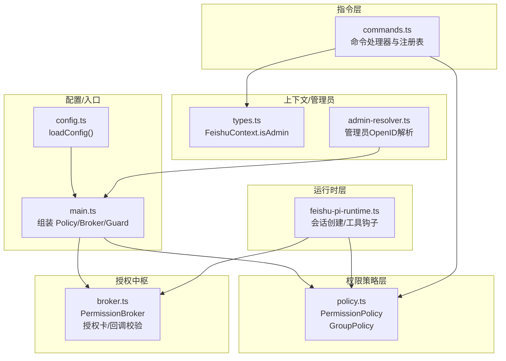
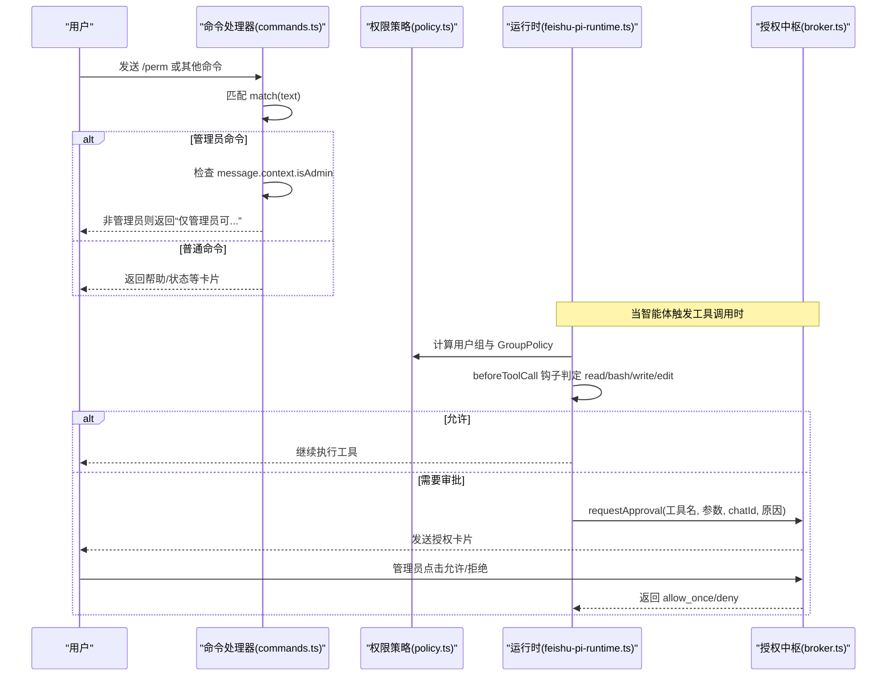
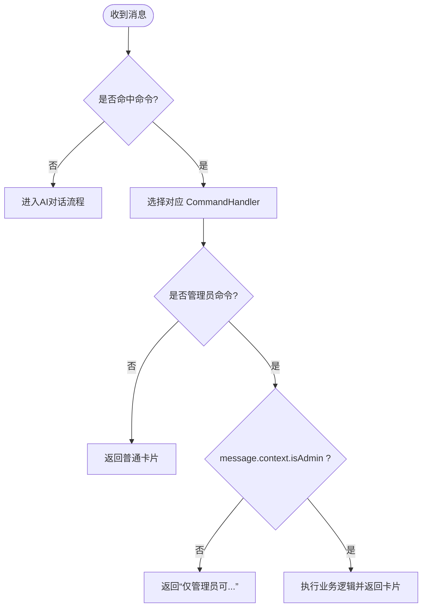
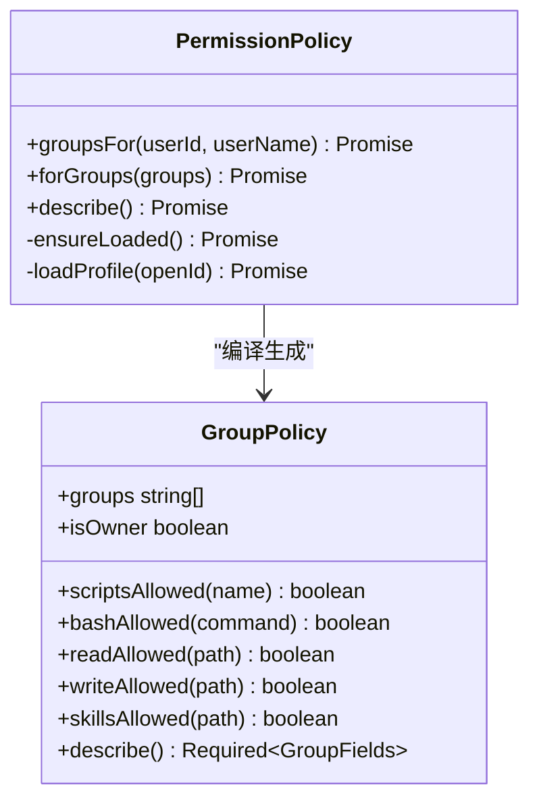
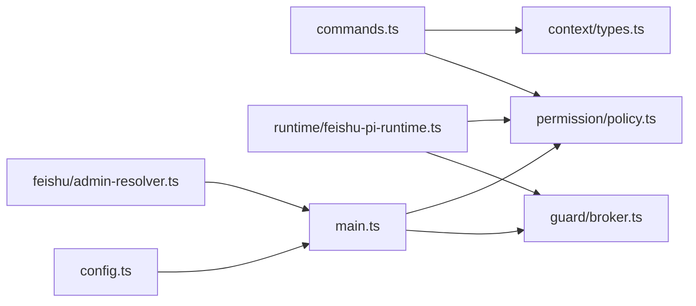

# 命令权限控制

<cite>
**本文引用的文件**
- [commands.ts](file://src/feishu/commands.ts)
- [policy.ts](file://src/permission/policy.ts)
- [admin-resolver.ts](file://src/feishu/admin-resolver.ts)
- [types.ts](file://src/context/types.ts)
- [feishu-pi-runtime.ts](file://src/runtime/feishu-pi-runtime.ts)
- [broker.ts](file://src/guard/broker.ts)
- [config.ts](file://src/config.ts)
- [main.ts](file://src/main.ts)
- [agent-bridge.ts](file://src/feishu/agent-bridge.ts)
- [commands.md](file://docs/commands.md)
</cite>

## 目录
1. [简介](#简介)
2. [项目结构](#项目结构)
3. [核心组件](#核心组件)
4. [架构总览](#架构总览)
5. [详细组件分析](#详细组件分析)
6. [依赖关系分析](#依赖关系分析)
7. [性能与可靠性](#性能与可靠性)
8. [故障排查指南](#故障排查指南)
9. [结论](#结论)
10. [附录：配置与开发参考](#附录：配置与开发参考)

## 简介
本文件系统性说明飞书机器人命令的权限控制机制，覆盖管理员命令与普通命令的差异、命令执行前的权限验证流程、不同用户角色的访问控制、管理命令 /perm 的实现原理、参数级权限检查、结果展示过滤、命令权限与用户组映射、动态权限更新、以及命令审计日志记录。同时提供命令权限配置示例、自定义命令开发指南与常见问题调试方法，为管理员提供完整的命令管理参考。

## 项目结构
围绕命令权限的关键代码分布在以下模块：
- 指令层：命令匹配与执行（/model、/help、/new、/stop、/detail、/perm）
- 权限策略层：基于 .agent/permissions.json 的用户组与能力范围
- 运行时层：会话创建时按组策略注入工具与资源，并在工具调用前进行拦截判定
- 授权中枢：对需要人工审批的操作发送授权卡片并等待管理员决策
- 上下文与管理员解析：将管理员身份注入消息上下文，供命令与回调校验使用



图表来源
- [commands.ts:1-339](file://src/feishu/commands.ts#L1-L339)
- [policy.ts:1-253](file://src/permission/policy.ts#L1-L253)
- [feishu-pi-runtime.ts:147-284](file://src/runtime/feishu-pi-runtime.ts#L147-L284)
- [broker.ts:1-200](file://src/guard/broker.ts#L1-L200)
- [types.ts:1-11](file://src/context/types.ts#L1-L11)
- [admin-resolver.ts:1-100](file://src/feishu/admin-resolver.ts#L1-L100)
- [config.ts:1-51](file://src/config.ts#L1-L51)
- [main.ts:106-132](file://src/main.ts#L106-L132)

章节来源
- [commands.ts:1-339](file://src/feishu/commands.ts#L1-L339)
- [policy.ts:1-253](file://src/permission/policy.ts#L1-L253)
- [feishu-pi-runtime.ts:147-284](file://src/runtime/feishu-pi-runtime.ts#L147-L284)
- [broker.ts:1-200](file://src/guard/broker.ts#L1-L200)
- [types.ts:1-11](file://src/context/types.ts#L1-L11)
- [admin-resolver.ts:1-100](file://src/feishu/admin-resolver.ts#L1-L100)
- [config.ts:1-51](file://src/config.ts#L1-L51)
- [main.ts:106-132](file://src/main.ts#L106-L132)

## 核心组件
- 命令处理器接口与注册表：统一 match/execute 协议，支持扩展新命令；默认包含 /model、/help、/new、/stop、/detail，/perm 作为额外命令注入。
- 权限策略 PermissionPolicy：从 .agent/permissions.json 加载 common 与各用户组，合并生效范围；提供 scripts/bash/read/write/skills 的准入判定函数。
- 运行时 FeishuPiRuntime：创建会话时根据用户所属组注入可用脚本工具与内置工具，并通过 beforeToolCall 钩子在工具调用前做细粒度权限拦截。
- 授权中枢 PermissionBroker：对需审批的工具调用发送授权卡片，严格校验 token、来源、操作者是否为管理员，超时或中断自动拒绝。
- 管理员解析与上下文：通过 admin-resolver 解析 FEISHU_ADMIN 为 Open ID，并在消息上下文中设置 isAdmin，供命令与回调校验。

章节来源
- [commands.ts:7-339](file://src/feishu/commands.ts#L7-L339)
- [policy.ts:34-158](file://src/permission/policy.ts#L34-L158)
- [feishu-pi-runtime.ts:147-284](file://src/runtime/feishu-pi-runtime.ts#L147-L284)
- [broker.ts:41-166](file://src/guard/broker.ts#L41-L166)
- [admin-resolver.ts:18-99](file://src/feishu/admin-resolver.ts#L18-L99)
- [types.ts:1-11](file://src/context/types.ts#L1-L11)

## 架构总览
命令权限控制贯穿“命令识别 → 权限判定 → 工具调用拦截 → 授权审批 → 结果反馈”全链路。



图表来源
- [commands.ts:287-313](file://src/feishu/commands.ts#L287-L313)
- [policy.ts:91-158](file://src/permission/policy.ts#L91-L158)
- [feishu-pi-runtime.ts:226-282](file://src/runtime/feishu-pi-runtime.ts#L226-L282)
- [broker.ts:78-166](file://src/guard/broker.ts#L78-L166)

## 详细组件分析

### 命令处理器与权限前置校验
- 命令匹配：CommandRegistry 按注册顺序查找第一个 match 成功的处理器。
- 管理员命令：/perm 在 execute 中检查 message.context.isAdmin，非管理员直接返回提示卡片。
- 模型切换：/model 列表对所有用户可见，但按钮行为受后续回调权限控制（由上层桥接逻辑结合 isAdmin 判断）。
- 其他命令：/help、/new、/stop、/detail 为通用或会话级控制命令，不涉及敏感权限。



图表来源
- [commands.ts:316-339](file://src/feishu/commands.ts#L316-L339)
- [commands.ts:287-313](file://src/feishu/commands.ts#L287-L313)
- [types.ts:1-11](file://src/context/types.ts#L1-L11)

章节来源
- [commands.ts:38-206](file://src/feishu/commands.ts#L38-L206)
- [commands.ts:234-266](file://src/feishu/commands.ts#L234-L266)
- [commands.ts:287-313](file://src/feishu/commands.ts#L287-L313)
- [types.ts:1-11](file://src/context/types.ts#L1-L11)

### 权限策略与用户组映射
- 策略文件：.agent/permissions.json 定义 common 与各用户组，字段包括 members、scripts、bash、read、write、skills。
- 组合并：生效范围 = common ∪ 所属各组（并集），owner 缺省为全量能力。
- 成员匹配：支持 openId、中文名、英文名（从用户缓存解析）。
- 判定函数：forGroups 返回 GroupPolicy，提供 scriptsAllowed、bashAllowed、readAllowed、writeAllowed、skillsAllowed。
- 动态更新：策略文件 mtime 变化即热重载，新会话立即生效。



图表来源
- [policy.ts:68-158](file://src/permission/policy.ts#L68-L158)
- [policy.ts:160-176](file://src/permission/policy.ts#L160-L176)
- [policy.ts:178-230](file://src/permission/policy.ts#L178-L230)

章节来源
- [policy.ts:5-32](file://src/permission/policy.ts#L5-L32)
- [policy.ts:34-57](file://src/permission/policy.ts#L34-L57)
- [policy.ts:91-158](file://src/permission/policy.ts#L91-L158)
- [policy.ts:160-176](file://src/permission/policy.ts#L160-L176)
- [policy.ts:178-230](file://src/permission/policy.ts#L178-L230)

### 运行时工具调用拦截与权限过滤
- 会话创建：根据用户所属组决定可注册的脚本工具与内置工具（owner 拥有 read/write/edit，普通用户仅有 bash/read）。
- 技能可见性：技能文档全量加载，但 read 调用时对技能路径按 skills 可见范围判定，非技能路径按 read 范围判定。
- 工具审核：未放行的工具调用交由 ToolGuard 与 PermissionBroker 处理，必要时弹出授权卡片。
- 统计记录：对范围内的技能读取记录使用事件（失败仅告警不阻塞）。

```mermaid
sequenceDiagram
participant RT as "运行时"
participant POL as "策略"
participant TG as "ToolGuard"
participant BRK as "Broker"
RT->>POL : groupsFor(userId, userName)
POL-->>RT : GroupPolicy
RT->>RT : 注册脚本工具(按 scriptsAllowed)
RT->>RT : 注册内置工具(owner : read/write/edit; user : bash/read)
RT->>RT : beforeToolCall 钩子
alt read 工具
RT->>POL : skillsAllowed/readAllowed
POL-->>RT : 允许/拒绝
else 其他工具
RT->>TG : 调用审核
TG->>BRK : requestApproval(若需审批)
BRK-->>TG : allow_once/deny
TG-->>RT : 放行/拒绝
end
```

图表来源
- [feishu-pi-runtime.ts:147-216](file://src/runtime/feishu-pi-runtime.ts#L147-L216)
- [feishu-pi-runtime.ts:226-282](file://src/runtime/feishu-pi-runtime.ts#L226-L282)
- [broker.ts:78-166](file://src/guard/broker.ts#L78-L166)

章节来源
- [feishu-pi-runtime.ts:147-216](file://src/runtime/feishu-pi-runtime.ts#L147-L216)
- [feishu-pi-runtime.ts:226-282](file://src/runtime/feishu-pi-runtime.ts#L226-L282)

### 管理命令 /perm 实现原理
- 权限前置：仅在 message.context.isAdmin 为真时返回策略概览，否则返回提示。
- 数据源：调用 listPolicy()（由外部注入，通常来自 runtime 的策略描述），输出 common 与各组的生效范围与成员。
- 展示格式：以 Markdown 卡片列出脚本、命令、可读、可写、技能分布，并提示名单外调用的授权流程。

章节来源
- [commands.ts:287-313](file://src/feishu/commands.ts#L287-L313)
- [policy.ts:160-176](file://src/permission/policy.ts#L160-L176)

### 命令参数级权限检查
- bash 命令：策略层对 shell 元字符进行逃逸防护，命中即不参与匹配并转交授权卡；其余走精确或前缀匹配。
- read 路径：技能路径按 skills 可见范围判定，非技能路径按 read 范围判定，越界直接拦截且不弹卡。
- write/edit：由 owner 专属或策略白名单控制，未放行进入审核流程。

章节来源
- [policy.ts:135-155](file://src/permission/policy.ts#L135-L155)
- [feishu-pi-runtime.ts:233-259](file://src/runtime/feishu-pi-runtime.ts#L233-L259)

### 命令执行结果的权限过滤
- 命令响应本身不包含敏感信息；/perm 仅管理员可见。
- 模型列表对所有用户可见，但切换动作由回调层结合 isAdmin 控制。
- 工具调用结果遵循策略与审核结果，被拦截的请求不会返回实际数据。

章节来源
- [commands.ts:104-133](file://src/feishu/commands.ts#L104-L133)
- [commands.ts:287-313](file://src/feishu/commands.ts#L287-L313)

### 命令权限与用户组的映射关系
- 用户归属：通过 PermissionPolicy.groupsFor 将 userId 与用户名（含英文名）匹配到一组或多组；FEISHU_ADMIN 自动归属 owner。
- 生效范围：common 与所属各组取并集；无组用户采用保守缺省（仅技能目录可读，无脚本与命令）。
- 角色差异：owner 具备全量能力；普通用户受限为策略声明的能力集合。

章节来源
- [policy.ts:91-107](file://src/permission/policy.ts#L91-L107)
- [policy.ts:109-158](file://src/permission/policy.ts#L109-L158)
- [policy.ts:232-238](file://src/permission/policy.ts#L232-L238)

### 动态权限更新机制
- 策略文件热重载：PermissionPolicy.ensureLoaded 监听策略文件 mtime，变更即重新加载；新会话立即生效。
- 用户缓存热重载：usersFile 变更时刷新用户姓名/英文名缓存，提升组成员匹配准确性。
- 会话隔离：旧会话沿用已创建的 GroupPolicy，新会话使用最新策略。

章节来源
- [policy.ts:178-230](file://src/permission/policy.ts#L178-L230)

### 命令审计日志记录
- 技能使用统计：read 命中技能路径时记录使用事件（包含时间、用户、技能名、会话），失败仅告警。
- 策略加载日志：策略文件加载成功会记录日志；解析失败按保守默认处理并记录警告。
- 授权流程日志：Broker 在发送/更新/撤回卡片及异常时记录日志，便于追踪。

章节来源
- [feishu-pi-runtime.ts:250-258](file://src/runtime/feishu-pi-runtime.ts#L250-L258)
- [policy.ts:199-209](file://src/permission/policy.ts#L199-L209)
- [broker.ts:58-72](file://src/guard/broker.ts#L58-L72)

## 依赖关系分析
- 命令层依赖上下文中的 isAdmin 与策略描述接口。
- 运行时依赖策略层提供的 GroupPolicy，并在工具调用前进行拦截。
- 授权中枢依赖传输层发送/更新卡片，并与 Bridge 协作判断是否撤回卡片。
- 管理员解析器为 main 提供管理员 Open ID，用于 Broker 与策略层。



图表来源
- [commands.ts:1-339](file://src/feishu/commands.ts#L1-L339)
- [policy.ts:1-253](file://src/permission/policy.ts#L1-L253)
- [feishu-pi-runtime.ts:1-301](file://src/runtime/feishu-pi-runtime.ts#L1-L301)
- [broker.ts:1-200](file://src/guard/broker.ts#L1-L200)
- [admin-resolver.ts:1-100](file://src/feishu/admin-resolver.ts#L1-L100)
- [config.ts:1-51](file://src/config.ts#L1-L51)
- [main.ts:106-132](file://src/main.ts#L106-L132)

章节来源
- [main.ts:106-132](file://src/main.ts#L106-L132)
- [agent-bridge.ts:28-64](file://src/feishu/agent-bridge.ts#L28-L64)

## 性能与可靠性
- 策略热重载：避免重启服务即可更新权限，降低运维成本。
- 保守缺省：无组用户仅技能目录可读，防止误配导致越权。
- 授权超时：Broker 默认超时拒绝，避免长时间阻塞。
- 技能统计：记录失败仅告警，不影响主流程。
- 模型候选端点：/model 尝试多个候选 URL，提高可用性。

[本节为通用指导，无需特定文件引用]

## 故障排查指南
- 无法查看 /perm：确认 message.context.isAdmin 是否正确设置；检查 FEISHU_ADMIN 是否成功解析为 Open ID。
- 权限未生效：检查 .agent/permissions.json 语法与 mtime；确认新会话已创建以加载最新策略。
- 工具调用被拒绝：查看策略中 bash/read/write 规则；注意 shell 元字符会导致逃逸保护触发。
- 授权卡片无响应：检查 Broker 超时配置；确认管理员 Open ID 列表正确；核对回调 token 与来源一致性。
- 模型列表为空：检查中转站 URL 配置与网络连通性；查看日志中的候选端点尝试情况。

章节来源
- [admin-resolver.ts:18-99](file://src/feishu/admin-resolver.ts#L18-L99)
- [policy.ts:178-209](file://src/permission/policy.ts#L178-L209)
- [broker.ts:78-166](file://src/guard/broker.ts#L78-L166)
- [commands.ts:56-102](file://src/feishu/commands.ts#L56-L102)

## 结论
本系统通过“命令层 → 策略层 → 运行时拦截 → 授权中枢”的分层设计，实现了细粒度的命令与工具权限控制。管理员可通过 /perm 直观了解权限分布，策略文件热重载保障动态更新，授权卡片确保高风险操作的二次确认。整体方案兼顾安全性与易用性，适合多角色协作场景。

[本节为总结，无需特定文件引用]

## 附录：配置与开发参考

### 命令权限配置示例
- 策略文件位置：.agent/permissions.json
- 关键字段：
  - common：所有人共享的基础能力
  - owner：负责人组，默认全量能力
  - 用户组：members 指定成员，scripts/bash/read/write/skills 定义能力范围
- 示例要点：
  - 使用 glob 限制 read/write 范围
  - 使用精确或前缀匹配限制 bash 命令
  - 使用脚本名限制 scripts 工具
  - 使用 skills 控制技能可见性

章节来源
- [policy.ts:5-32](file://src/permission/policy.ts#L5-L32)
- [policy.ts:34-57](file://src/permission/policy.ts#L34-L57)
- [policy.ts:109-158](file://src/permission/policy.ts#L109-L158)

### 自定义命令开发指南
- 实现 CommandHandler：
  - match：匹配命令文本
  - execute：执行业务逻辑并返回卡片
- 注册命令：
  - 在 createDefaultRegistry 或 extraCommands 中注册
  - 如需管理员权限，在 execute 中检查 message.context.isAdmin
- 交互卡片：
  - 使用 CardKit 2.0 结构
  - 按钮 behaviors 携带回调值，由上层桥接处理

章节来源
- [commands.ts:7-20](file://src/feishu/commands.ts#L7-L20)
- [commands.ts:316-339](file://src/feishu/commands.ts#L316-L339)
- [agent-bridge.ts:28-64](file://src/feishu/agent-bridge.ts#L28-L64)

### 命令权限问题调试方法
- 启用日志：关注策略加载、工具调用拦截、授权卡片发送/更新/撤回日志
- 验证上下文：确认 isAdmin 与用户标识是否正确注入
- 检查策略：确认 permissions.json 语法与 mtime 更新
- 模拟测试：构造不同用户与命令组合，观察放行/拒绝行为

章节来源
- [policy.ts:199-209](file://src/permission/policy.ts#L199-L209)
- [broker.ts:58-72](file://src/guard/broker.ts#L58-L72)
- [commands.md:42-56](file://docs/commands.md#L42-L56)