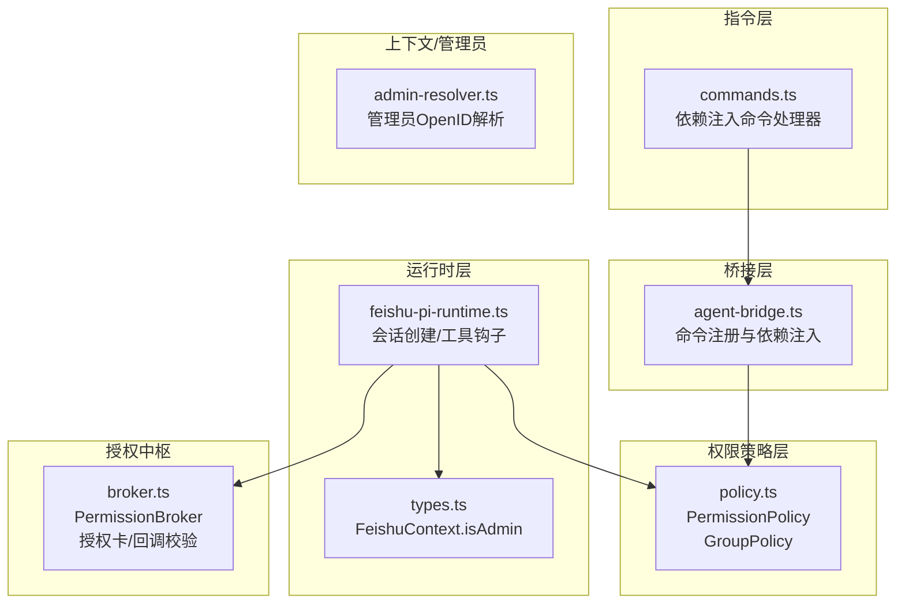
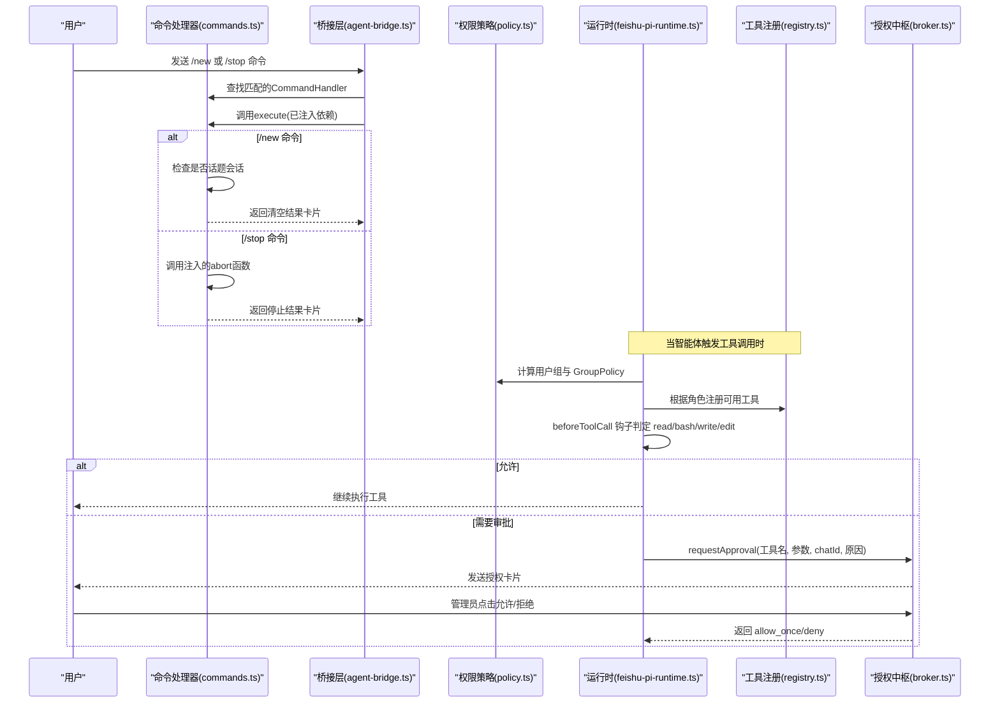
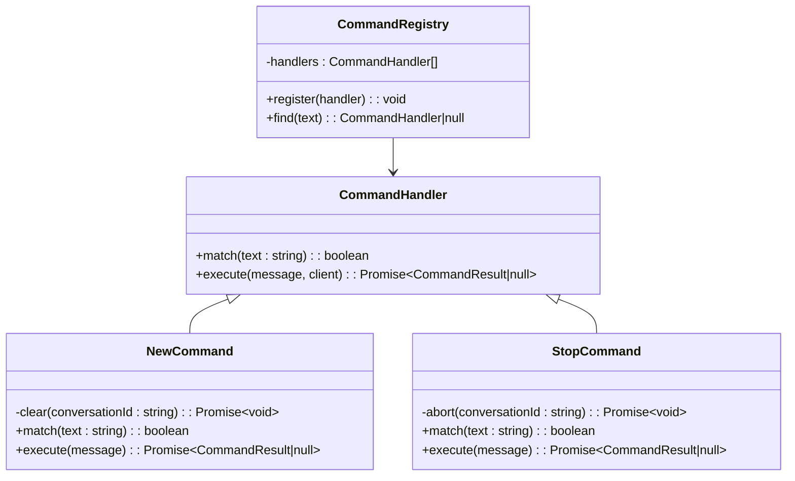
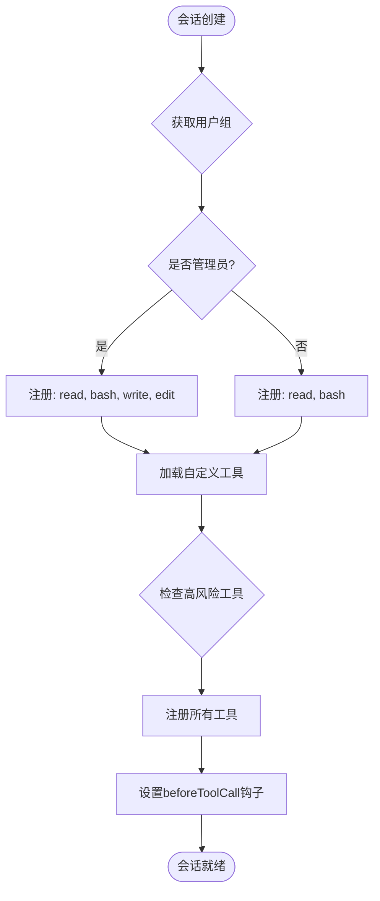
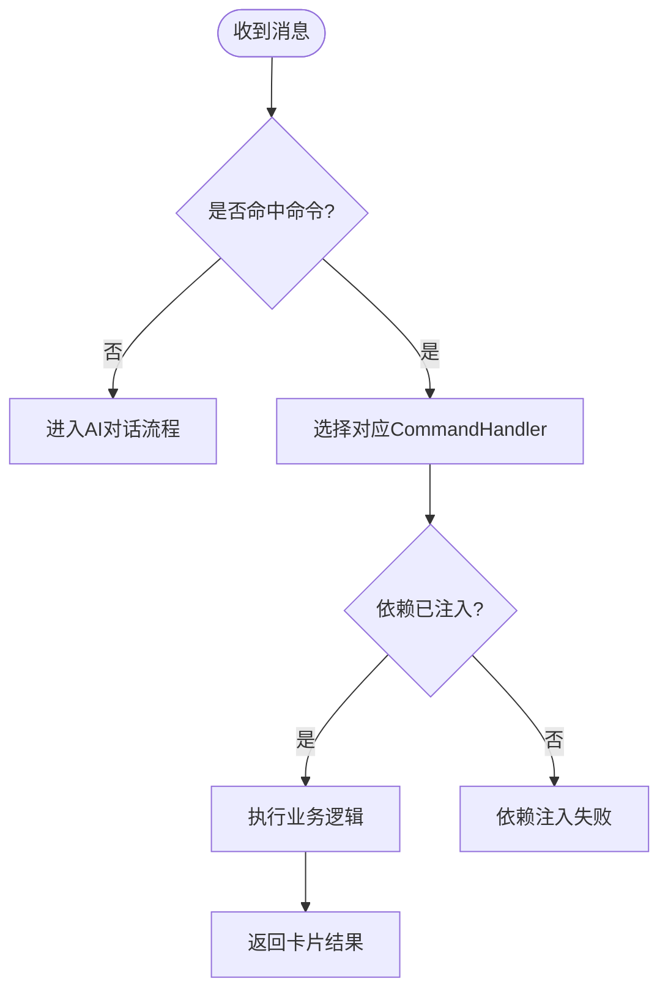
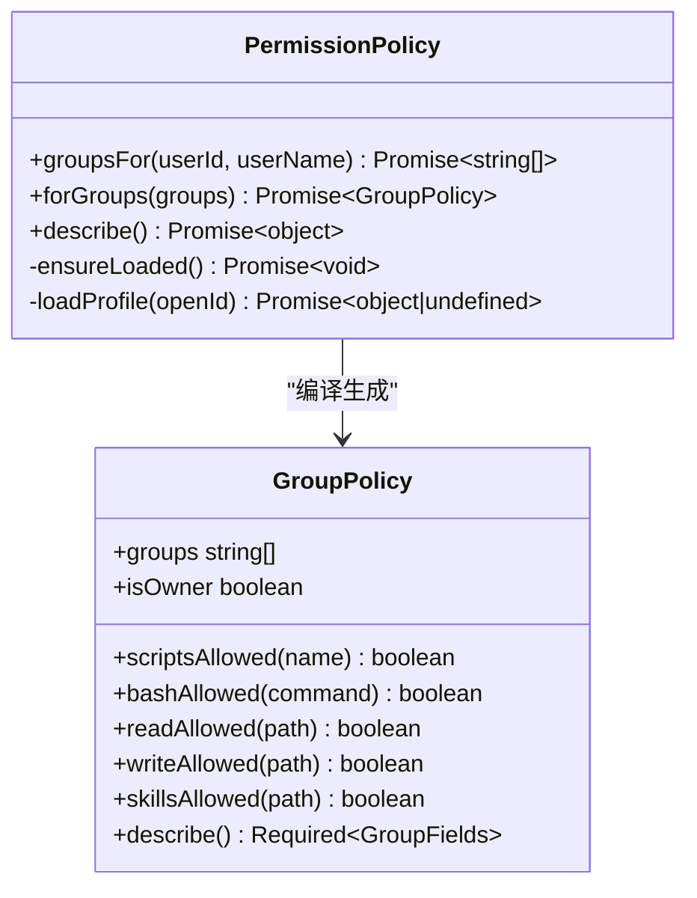
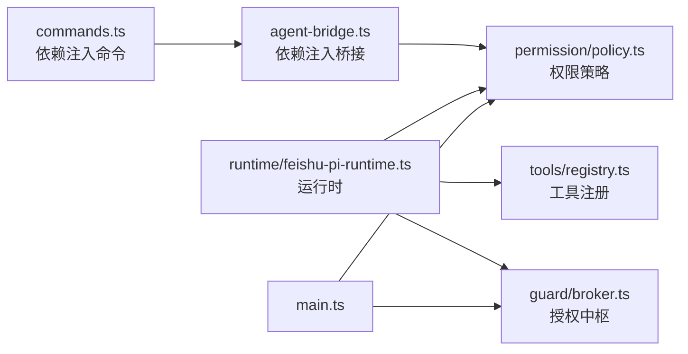

基于我对代码的分析，我现在了解了变更的核心内容。让我更新命令权限控制文档以反映这些重要的架构变更：

# 命令权限控制

<cite>
**本文引用的文件**
- [commands.ts](file://src/feishu/commands.ts)
- [agent-bridge.ts](file://src/feishu/agent-bridge.ts)
- [policy.ts](file://src/permission/policy.ts)
- [feishu-pi-runtime.ts](file://src/runtime/feishu-pi-runtime.ts)
- [registry.ts](file://src/tools/registry.ts)
- [types.ts](file://src/context/types.ts)
- [admin-resolver.ts](file://src/feishu/admin-resolver.ts)
- [config.ts](file://src/config.ts)
- [main.ts](file://src/main.ts)
- [broker.ts](file://src/guard/broker.ts)
- [user-auth.ts](file://src/feishu/user-auth.ts)
- [cardkit-reply.ts](file://src/feishu/cardkit-reply.ts)
- [cardkit-stream.ts](file://src/feishu/cardkit-stream.ts)
</cite>

## 更新摘要
**变更内容**
- **架构重构**：命令处理从字符串路由模式迁移到依赖注入模式，提升可测试性和模块化
- **角色基注册**：工具注册表实现基于角色的访问控制，read操作对所有用户开放，bash执行受组策略控制，write/edit仅限管理员
- **命令处理器解耦**：/new和@stop等命令现在使用注入式处理器，与核心逻辑分离
- **增强权限过滤**：运行时工具调用拦截更加精细化，支持细粒度权限控制

## 目录
1. [简介](#简介)
2. [项目结构](#项目结构)
3. [核心组件](#核心组件)
4. [架构总览](#架构总览)
5. [详细组件分析](#详细组件分析)
6. [依赖关系分析](#依赖关系分析)
7. [性能与可靠性](#性能与可靠性)
8. [故障排查指南](#故障排查指南)
9. [结论](#结论)
10. [附录：配置与开发参考](#附录：配置与开发参考)

## 简介
本文件系统性说明飞书机器人命令的权限控制机制，覆盖管理员命令与普通命令的差异、命令执行前的权限验证流程、不同用户角色的访问控制、管理命令 /perm 的实现原理、参数级权限检查、结果展示过滤、命令权限与用户组映射、动态权限更新、以及命令审计日志记录。**重要更新**包括命令处理架构从字符串路由重构为依赖注入模式，实现了更清晰的职责分离和更好的可测试性；工具注册表采用角色基访问控制，确保不同用户角色获得适当的工具访问权限。

## 项目结构
围绕命令权限的关键代码分布在以下模块：
- **指令层**：基于依赖注入的命令处理器（/model、/help、/new、/stop、/detail、/perm）
- **桥接层**：FeishuAgentBridge负责命令注册和依赖注入
- **权限策略层**：基于 .agent/permissions.json 的用户组与能力范围
- **运行时层**：会话创建时按组策略注入工具与资源，并在工具调用前进行拦截判定
- **工具注册层**：角色基工具注册，区分read/bash/write/edit权限
- **授权中枢**：对需要人工审批的操作发送授权卡并等待管理员决策
- **上下文与管理解析**：将管理员身份注入消息上下文，供命令与回调校验使用



**图表来源**
- [commands.ts:1-398](file://src/feishu/commands.ts#L1-L398)
- [agent-bridge.ts:60-71](file://src/feishu/agent-bridge.ts#L60-L71)
- [policy.ts:1-288](file://src/permission/policy.ts#L1-L288)
- [feishu-pi-runtime.ts:195-325](file://src/runtime/feishu-pi-runtime.ts#L195-L325)
- [registry.ts:1-169](file://src/tools/registry.ts#L1-L169)

**章节来源**
- [commands.ts:1-398](file://src/feishu/commands.ts#L1-L398)
- [agent-bridge.ts:60-71](file://src/feishu/agent-bridge.ts#L60-L71)
- [policy.ts:1-288](file://src/permission/policy.ts#L1-L288)
- [feishu-pi-runtime.ts:195-325](file://src/runtime/feishu-pi-runtime.ts#L195-L325)
- [registry.ts:1-169](file://src/tools/registry.ts#L1-L169)

## 核心组件
- **依赖注入命令处理器**：每个命令实现CommandHandler接口，通过构造函数注入依赖（会话操作、策略查询、模型信息），避免全局状态和硬编码依赖
- **命令注册表**：CommandRegistry按注册顺序匹配处理器，支持动态扩展新命令
- **桥接层依赖注入**：FeishuAgentBridge在构造时为命令处理器注入具体依赖（如会话清空、中断函数）
- **权限策略 PermissionPolicy**：从 .agent/permissions.json 加载 common 与各用户组，合并生效范围；提供 scripts/bash/read/write/skills 的准入判定函数
- **角色基工具注册**：根据用户所属组决定可注册的内置工具（owner拥有read/write/edit，普通用户仅有bash/read）
- **运行时工具拦截**：beforeToolCall钩子在工具调用前进行细粒度权限判定
- **授权中枢 PermissionBroker**：对需审批的工具调用发送授权卡片，严格校验token、来源、操作者是否为管理员

**章节来源**
- [commands.ts:13-26](file://src/feishu/commands.ts#L13-L26)
- [commands.ts:374-398](file://src/feishu/commands.ts#L374-L398)
- [agent-bridge.ts:60-71](file://src/feishu/agent-bridge.ts#L60-L71)
- [policy.ts:57-161](file://src/permission/policy.ts#L57-L161)
- [feishu-pi-runtime.ts:237-241](file://src/runtime/feishu-pi-runtime.ts#L237-L241)
- [feishu-pi-runtime.ts:260-322](file://src/runtime/feishu-pi-runtime.ts#L260-L322)

## 架构总览
命令权限控制贯穿"命令识别 → 依赖注入 → 权限判定 → 工具调用拦截 → 授权审批 → 结果反馈"全链路。**架构重构**后，命令处理器完全解耦，通过依赖注入获得所需功能，提升了可测试性和维护性。



**图表来源**
- [agent-bridge.ts:85-90](file://src/feishu/agent-bridge.ts#L85-L90)
- [agent-bridge.ts:244-289](file://src/feishu/agent-bridge.ts#L244-L289)
- [commands.ts:237-281](file://src/feishu/commands.ts#L237-L281)
- [feishu-pi-runtime.ts:207-241](file://src/runtime/feishu-pi-runtime.ts#L207-L241)
- [feishu-pi-runtime.ts:260-322](file://src/runtime/feishu-pi-runtime.ts#L260-L322)

## 详细组件分析

### 依赖注入命令处理器架构
**重大架构变更**：命令处理从字符串路由模式重构为依赖注入模式，每个命令处理器通过构造函数接收所需依赖，实现真正的关注点分离。

- **CommandHandler接口**：定义match和execute方法，所有命令处理器统一实现
- **依赖注入模式**：命令处理器不直接访问全局状态，而是通过构造函数注入会话操作、策略查询等功能
- **命令注册表**：CommandRegistry管理所有命令处理器，按注册顺序匹配
- **桥接层注入**：FeishuAgentBridge在构造时为命令处理器注入具体依赖



**图表来源**
- [commands.ts:13-26](file://src/feishu/commands.ts#L13-L26)
- [commands.ts:237-281](file://src/feishu/commands.ts#L237-L281)
- [commands.ts:374-398](file://src/feishu/commands.ts#L374-L398)

**章节来源**
- [commands.ts:13-26](file://src/feishu/commands.ts#L13-L26)
- [commands.ts:237-281](file://src/feishu/commands.ts#L237-L281)
- [commands.ts:374-398](file://src/feishu/commands.ts#L374-L398)

### 角色基工具注册与权限控制
**新增功能**：工具注册表实现了基于角色的访问控制，确保不同用户角色获得适当的工具访问权限。

- **内置工具角色分配**：read操作对所有用户开放，bash执行受组策略控制，write/edit仅限管理员
- **组策略集成**：工具可用性由用户所属组的策略决定，支持细粒度控制
- **自定义工具标记**：自定义工具可通过risk字段标记高风险操作，强制走授权流程
- **运行时工具绑定**：会话创建时根据用户角色动态注册可用工具



**图表来源**
- [feishu-pi-runtime.ts:207-241](file://src/runtime/feishu-pi-runtime.ts#L207-L241)
- [feishu-pi-runtime.ts:232-235](file://src/runtime/feishu-pi-runtime.ts#L232-L235)

**章节来源**
- [feishu-pi-runtime.ts:207-241](file://src/runtime/feishu-pi-runtime.ts#L207-L241)
- [feishu-pi-runtime.ts:232-235](file://src/runtime/feishu-pi-runtime.ts#L232-L235)

### 命令处理器与权限前置校验
**架构更新**：命令处理器现在完全通过依赖注入工作，不再直接访问全局状态。

- **命令匹配**：CommandRegistry按注册顺序查找第一个match成功的处理器
- **管理员命令**：/perm在execute中检查message.context.isAdmin，非管理员直接返回提示卡片
- **会话操作命令**：/new和@stop通过注入的clear和abort函数操作会话，无需直接访问会话管理器
- **模型切换**：/model列表对所有用户可见，但按钮行为受后续回调权限控制
- **其他命令**：/help、/detail为通用或会话级控制命令，不涉及敏感权限



**图表来源**
- [commands.ts:374-398](file://src/feishu/commands.ts#L374-L398)
- [agent-bridge.ts:60-71](file://src/feishu/agent-bridge.ts#L60-L71)
- [commands.ts:237-281](file://src/feishu/commands.ts#L237-L281)

**章节来源**
- [commands.ts:237-281](file://src/feishu/commands.ts#L237-L281)
- [commands.ts:374-398](file://src/feishu/commands.ts#L374-L398)
- [agent-bridge.ts:60-71](file://src/feishu/agent-bridge.ts#L60-L71)

### 权限策略与用户组映射
- **策略文件**：.agent/permissions.json 定义 common 与各用户组，字段包括 members、scripts、bash、read、write、skills
- **组合并**：生效范围 = common ∪ 所属各组（并集），owner 缺省为全量能力
- **成员匹配**：支持 openId、中文名、英文名（从用户缓存解析）
- **判定函数**：forGroups 返回 GroupPolicy，提供 scripts/bash/read/write/skills 的准入判定函数
- **动态更新**：策略文件 mtime 变化即热重载，新会话立即生效



**图表来源**
- [policy.ts:57-161](file://src/permission/policy.ts#L57-L161)
- [policy.ts:163-176](file://src/permission/policy.ts#L163-L176)
- [policy.ts:178-230](file://src/permission/policy.ts#L178-L230)

**章节来源**
- [policy.ts:5-35](file://src/permission/policy.ts#L5-L35)
- [policy.ts:57-100](file://src/permission/policy.ts#L57-L100)
- [policy.ts:128-161](file://src/permission/policy.ts#L128-L161)
- [policy.ts:163-176](file://src/permission/policy.ts#L163-L176)
- [policy.ts:178-230](file://src/permission/policy.ts#L178-L230)

### 运行时工具调用拦截与权限过滤
**增强功能**：运行时工具调用拦截现在支持更精细的权限控制，结合角色基注册和策略判定。

- **会话创建**：根据用户所属组决定可注册的脚本工具与内置工具（owner 拥有 read/write/edit，普通用户仅有 bash/read）
- **技能可见性**：技能文档全量加载，但 read 调用时对技能路径按 skills 可见范围判定，非技能路径按 read 范围判定
- **工具审核**：未放行的工具调用交由 ToolGuard 与 PermissionBroker 处理，必要时弹出授权卡片
- **统计记录**：对范围内的技能读取记录使用事件（失败仅告警不阻塞）

```mermaid
sequenceDiagram
participant RT as "运行时"
participant POL as "策略"
participant TG as "ToolGuard"
participant BRK as "Broker"
RT->>POL : groupsFor(userId, userName)
POL-->>RT : GroupPolicy
RT->>RT : 注册脚本工具(按 scriptsAllowed)
RT->>RT : 注册内置工具(owner : read/write/edit; user : bash/read)
RT->>RT : beforeToolCall 钩子
alt read 工具
RT->>POL : skillsAllowed/readAllowed
POL-->>RT : 允许/拒绝
else 其他工具
RT->>TG : 调用审核
TG->>BRK : requestApproval(若需审批)
BRK-->>TG : allow_once/deny
TG-->>RT : 放行/拒绝
end
```

**图表来源**
- [feishu-pi-runtime.ts:207-241](file://src/runtime/feishu-pi-runtime.ts#L207-L241)
- [feishu-pi-runtime.ts:260-322](file://src/runtime/feishu-pi-runtime.ts#L260-L322)

**章节来源**
- [feishu-pi-runtime.ts:207-241](file://src/runtime/feishu-pi-runtime.ts#L207-L241)
- [feishu-pi-runtime.ts:260-322](file://src/runtime/feishu-pi-runtime.ts#L260-L322)

### 管理命令 /perm 实现原理
- **权限前置**：仅在 message.context.isAdmin 为真时返回策略概览，否则返回提示
- **数据源**：调用 listPolicy()（由外部注入，通常来自 runtime 的策略描述），输出 common 与各组的生效范围与成员
- **展示格式**：以 Markdown 卡片列出脚本、命令、可读、可写、技能分布，并提示名单外调用的授权流程

**章节来源**
- [commands.ts:327-371](file://src/feishu/commands.ts#L327-L371)
- [policy.ts:163-176](file://src/permission/policy.ts#L163-L176)

### 命令参数级权限检查
- **bash 命令**：策略层对 shell 元字符进行逃逸防护，命中即不参与匹配并转交授权卡；其余走精确或前缀匹配
- **read 路径**：技能路径按 skills 可见范围判定，非技能路径按 read 范围判定，越界直接拦截且不弹卡
- **write/edit**：由 owner 专属或策略白名单控制，未放行进入审核流程

**章节来源**
- [policy.ts:149-158](file://src/permission/policy.ts#L149-L158)
- [feishu-pi-runtime.ts:268-287](file://src/runtime/feishu-pi-runtime.ts#L268-L287)

### 命令执行结果的权限过滤
- **命令响应本身不包含敏感信息**：/perm 仅管理员可见
- **模型列表对所有用户可见**：但切换动作由回调层结合 isAdmin 控制
- **工具调用结果遵循策略与审核结果**：被拦截的请求不会返回实际数据
- **用户认证状态**：/login 和 /logout 的状态变化通过 CardKit 卡片实时更新，确保用户获得即时反馈

**章节来源**
- [commands.ts:132-135](file://src/feishu/commands.ts#L132-L135)
- [commands.ts:338-341](file://src/feishu/commands.ts#L338-L341)

### 命令权限与用户组的映射关系
- **用户归属**：通过 PermissionPolicy.groupsFor 将 userId 与用户名（含英文名）匹配到一组或多组；FEISHU_ADMIN 自动归属 owner
- **生效范围**：common 与所属各组取并集；无组用户采用保守缺省（仅技能目录可读，无脚本与命令）
- **角色差异**：owner 具备全量能力；普通用户受限为策略声明的能力集合

**章节来源**
- [policy.ts:84-100](file://src/permission/policy.ts#L84-L100)
- [policy.ts:128-161](file://src/permission/policy.ts#L128-L161)
- [policy.ts:236-242](file://src/permission/policy.ts#L236-L242)

### 动态权限更新机制
- **策略文件热重载**：PermissionPolicy.ensureLoaded 监听策略文件 mtime，变更即重新加载；新会话立即生效
- **用户缓存热重载**：usersFile 变更时刷新用户姓名/英文名缓存，提升组成员匹配准确性
- **会话隔离**：旧会话沿用已创建的 GroupPolicy，新会话使用最新策略
- **用户令牌自动刷新**：UserAuthService 在 access_token 临期时自动使用 refresh_token 刷新，refresh_token 失效则要求重新登录

**章节来源**
- [policy.ts:178-230](file://src/permission/policy.ts#L178-L230)

### 命令审计日志记录
- **技能使用统计**：read 命中技能路径时记录使用事件（包含时间、用户、技能名、会话），失败仅告警
- **策略加载日志**：策略文件加载成功会记录日志；解析失败按保守默认处理并记录警告
- **授权流程日志**：Broker 在发送/更新/撤回卡片及异常时记录日志，便于追踪
- **用户认证日志**：UserAuthService 记录授权开始、成功、失败、令牌刷新等操作日志

**章节来源**
- [feishu-pi-runtime.ts:277-285](file://src/runtime/feishu-pi-runtime.ts#L277-L285)
- [policy.ts:199-209](file://src/permission/policy.ts#L199-L209)

## 依赖关系分析
**架构更新**：依赖注入模式改变了组件间的依赖关系，命令处理器不再直接依赖全局状态。

- **命令层**：通过CommandHandler接口抽象，依赖由桥接层注入
- **桥接层**：FeishuAgentBridge负责命令注册和依赖注入
- **运行时层**：依赖策略层提供的 GroupPolicy，并在工具调用前进行拦截
- **工具注册层**：根据用户角色动态注册可用工具
- **授权中枢**：依赖传输层发送/更新卡片，并与 Bridge 协作判断是否撤回卡片



**图表来源**
- [commands.ts:1-398](file://src/feishu/commands.ts#L1-L398)
- [agent-bridge.ts:60-71](file://src/feishu/agent-bridge.ts#L60-L71)
- [policy.ts:1-288](file://src/permission/policy.ts#L1-L288)
- [feishu-pi-runtime.ts:1-353](file://src/runtime/feishu-pi-runtime.ts#L1-L353)
- [registry.ts:1-169](file://src/tools/registry.ts#L1-L169)

**章节来源**
- [agent-bridge.ts:60-71](file://src/feishu/agent-bridge.ts#L60-L71)

## 性能与可靠性
- **策略热重载**：避免重启服务即可更新权限，降低运维成本
- **保守缺省**：无组用户仅技能目录可读，防止误配导致越权
- **授权超时**：Broker 默认超时拒绝，避免长时间阻塞
- **技能统计**：记录失败仅告警，不影响主流程
- **模型候选端点**：/model 尝试多个候选 URL，提高可用性
- **依赖注入优势**：命令处理器可独立测试，提高代码质量和可维护性
- **角色基注册**：减少不必要的工具注册，提升启动性能

## 故障排查指南
- **无法查看 /perm**：确认 message.context.isAdmin 是否正确设置；检查 FEISHU_ADMIN 是否成功解析为 Open ID
- **权限未生效**：检查 .agent/permissions.json 语法与 mtime；确认新会话已创建以加载最新策略
- **工具调用被拒绝**：查看策略中 bash/read/write 规则；注意 shell 元字符会导致逃逸保护触发
- **授权卡片无响应**：检查 Broker 超时配置；确认管理员 Open ID 列表正确；核对回调 token 与来源一致性
- **模型列表为空**：检查中转站 URL 配置与网络连通性；查看日志中的候选端点尝试情况
- **命令执行失败**：检查依赖注入是否正确配置；查看命令处理器的构造函数参数
- **工具注册问题**：检查用户组策略；确认角色基工具注册逻辑

**章节来源**
- [agent-bridge.ts:60-71](file://src/feishu/agent-bridge.ts#L60-L71)
- [policy.ts:178-209](file://src/permission/policy.ts#L178-L209)
- [feishu-pi-runtime.ts:237-241](file://src/runtime/feishu-pi-runtime.ts#L237-L241)

## 结论
本系统通过**依赖注入架构重构**和**角色基工具注册**，实现了更加清晰、可测试、安全的命令权限控制机制。新的架构设计使得命令处理器完全解耦，通过依赖注入获得所需功能，大幅提升了代码的可维护性和可测试性。工具注册表的角色基访问控制确保了不同用户角色获得适当的工具访问权限，配合精细化的权限策略和运行时拦截，构建了完整的安全边界。整体方案兼顾了安全性、易用性和可维护性，适合多角色协作场景。

## 附录：配置与开发参考

### 命令权限配置示例
- **策略文件位置**：.agent/permissions.json
- **关键字段**：
  - common：所有人共享的基础能力
  - admin：负责人组，默认全量能力
  - 用户组：members 指定成员，scripts/bash/read/write/skills 定义能力范围
- **示例要点**：
  - 使用 glob 限制 read/write 范围
  - 使用精确或前缀匹配限制 bash 命令
  - 使用脚本名限制 scripts 工具
  - 使用 skills 控制技能可见性

**章节来源**
- [policy.ts:5-35](file://src/permission/policy.ts#L5-L35)
- [policy.ts:128-161](file://src/permission/policy.ts#L128-L161)

### 自定义命令开发指南
**架构更新**：现在需要实现依赖注入模式的命令处理器。

- **实现 CommandHandler**：
  - match：匹配命令文本
  - execute：执行业务逻辑并返回卡片
- **注册命令**：
  - 在 createDefaultRegistry 或 extraCommands 中注册
  - 如需管理员权限，在 execute 中检查 message.context.isAdmin
- **依赖注入**：
  - 通过构造函数注入所需依赖（会话操作、策略查询等）
  - 避免直接访问全局状态
- **交互卡片**：
  - 使用 CardKit 2.0 结构
  - 按钮 behaviors 携带回调值，由上层桥接处理

**章节来源**
- [commands.ts:13-26](file://src/feishu/commands.ts#L13-L26)
- [commands.ts:374-398](file://src/feishu/commands.ts#L374-L398)
- [agent-bridge.ts:60-71](file://src/feishu/agent-bridge.ts#L60-L71)

### 命令权限问题调试方法
- **启用日志**：关注策略加载、工具调用拦截、授权卡片发送/更新/撤回日志
- **验证上下文**：确认 isAdmin 与用户标识是否正确注入
- **检查策略**：确认 permissions.json 语法与 mtime 更新
- **模拟测试**：构造不同用户与命令组合，观察放行/拒绝行为
- **依赖注入调试**：检查命令处理器的依赖是否正确注入
- **角色基注册调试**：确认用户组策略与工具注册逻辑

**章节来源**
- [policy.ts:199-209](file://src/permission/policy.ts#L199-L209)
- [feishu-pi-runtime.ts:237-241](file://src/runtime/feishu-pi-runtime.ts#L237-L241)

### 用户认证配置与使用
- **Device Flow 授权**：
  - 无需公网回调地址，适合内网部署
  - 支持 RFC 8628 标准，与官方 lark-cli 行为一致
  - 自动处理 slow_down、access_denied、expired_token 等状态
- **令牌管理**：
  - 按 openId 持久化到 data/user-tokens.json
  - 支持 access_token 自动刷新和 refresh_token 过期检测
  - 增量权限申请：按需申请缺失的 scope
- **安全考虑**：
  - device_code 与用户 openId 绑定，不支持代他人授权
  - 实际可访问数据 = 应用申请的 scope ∩ 用户本人可见范围
  - 不绕过 Guard 的组策略闸门

**章节来源**
- [user-auth.ts:1-18](file://src/feishu/user-auth.ts#L1-L18)
- [user-auth.ts:48-77](file://src/feishu/user-auth.ts#L48-L77)
- [user-auth.ts:234-285](file://src/feishu/user-auth.ts#L234-L285)