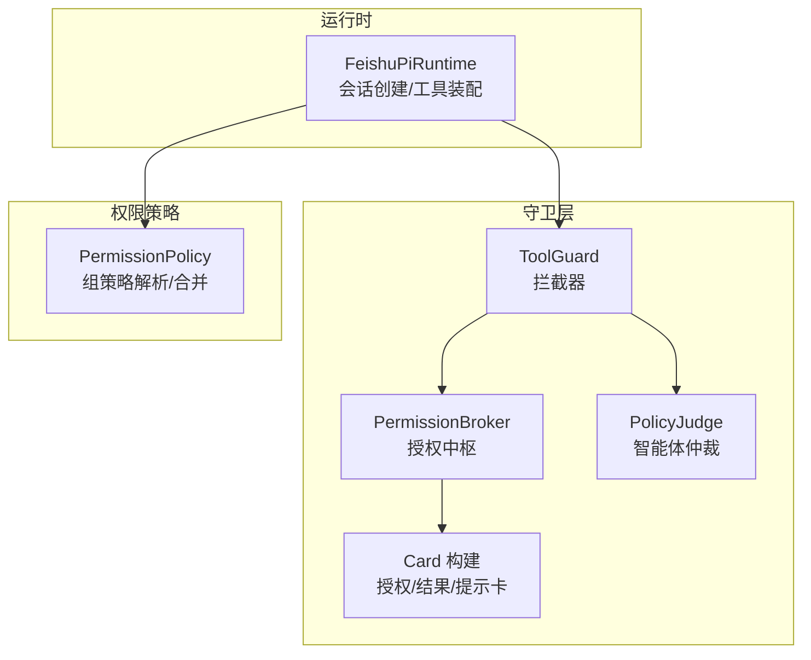
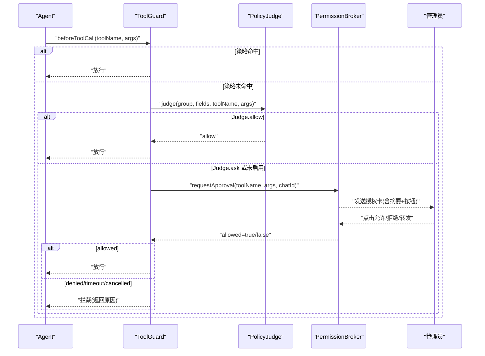
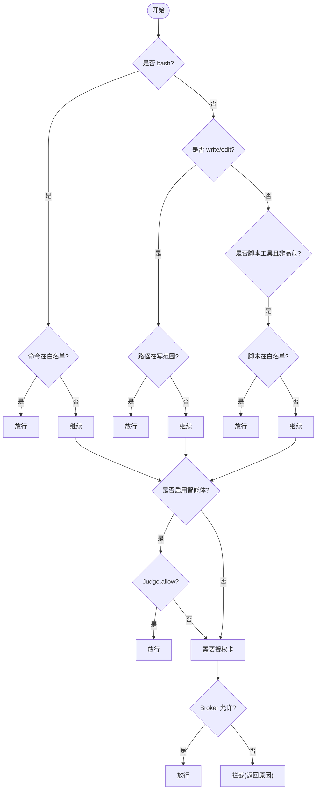
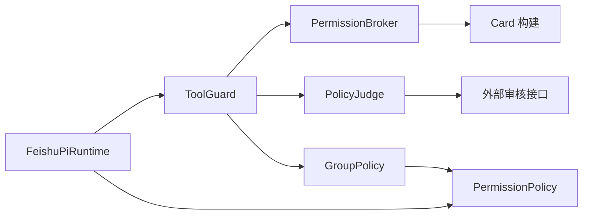

# 工具守卫系统

<cite>
**本文引用的文件**
- [src/guard/broker.ts](file://src/guard/broker.ts)
- [src/guard/card.ts](file://src/guard/card.ts)
- [src/guard/tool-guard.ts](file://src/guard/tool-guard.ts)
- [src/guard/judge.ts](file://src/guard/judge.ts)
- [src/permission/policy.ts](file://src/permission/policy.ts)
- [src/tools/registry.ts](file://src/tools/registry.ts)
- [src/runtime/feishu-pi-runtime.ts](file://src/runtime/feishu-pi-runtime.ts)
- [test/tool-guard.test.ts](file://test/tool-guard.test.ts)
- [README.md](file://README.md)
</cite>

## 目录
1. [简介](#简介)
2. [项目结构](#项目结构)
3. [核心组件](#核心组件)
4. [架构总览](#架构总览)
5. [详细组件分析](#详细组件分析)
6. [依赖关系分析](#依赖关系分析)
7. [性能与可靠性](#性能与可靠性)
8. [故障排查指南](#故障排查指南)
9. [结论](#结论)
10. [附录：配置与最佳实践](#附录配置与最佳实践)

## 简介
本文件系统化说明“工具守卫系统”的设计与实现，覆盖以下关键主题：
- 白名单机制：基于身份组的脚本、命令、路径、技能可见性策略。
- 授权卡系统：Broker 管理待授权请求、卡片发送/更新/撤回、管理员决策回调校验。
- 智能体仲裁：策略未命中时，调用外部审核模型进行综合判断（allow/ask）。
- Broker 类的工具执行拦截流程：从 Guard 到 Broker 的完整链路。
- CardGuard 的卡片操作权限控制：卡片参数脱敏、来源校验、仅管理员可操作。
- 工具注册时的权限过滤、执行时的动态授权判断、越权访问处理。
- 配置方式、自定义守卫开发、常见问题排查与安全最佳实践。

## 项目结构
围绕工具守卫的核心目录与职责：
- src/guard：守卫层，包含 ToolGuard（拦截器）、PermissionBroker（授权中枢）、Card 构建（卡片模板）、PolicyJudge（智能体仲裁）。
- src/permission：权限策略解析与合并（按组并集生效）。
- src/tools：工具注册表（已退役的自定义工具加载逻辑，当前以脚本工具为主）。
- src/runtime：运行时装配，将策略与工具注册结合，注入 Guard。
- test：针对 ToolGuard 的行为测试。



图表来源
- [src/guard/tool-guard.ts:1-114](file://src/guard/tool-guard.ts#L1-L114)
- [src/guard/broker.ts:1-200](file://src/guard/broker.ts#L1-L200)
- [src/guard/judge.ts:1-121](file://src/guard/judge.ts#L1-L121)
- [src/guard/card.ts:1-102](file://src/guard/card.ts#L1-L102)
- [src/permission/policy.ts:1-253](file://src/permission/policy.ts#L1-L253)
- [src/runtime/feishu-pi-runtime.ts:147-200](file://src/runtime/feishu-pi-runtime.ts#L147-L200)

章节来源
- [src/guard/tool-guard.ts:1-114](file://src/guard/tool-guard.ts#L1-L114)
- [src/guard/broker.ts:1-200](file://src/guard/broker.ts#L1-L200)
- [src/guard/judge.ts:1-121](file://src/guard/judge.ts#L1-L121)
- [src/guard/card.ts:1-102](file://src/guard/card.ts#L1-L102)
- [src/permission/policy.ts:1-253](file://src/permission/policy.ts#L1-L253)
- [src/runtime/feishu-pi-runtime.ts:147-200](file://src/runtime/feishu-pi-runtime.ts#L147-L200)

## 核心组件
- ToolGuard：作为 Pi Agent 的 beforeToolCall 钩子，执行三层判定（策略 → 智能体 → 授权卡），决定放行或拦截。
- PermissionBroker：维护待授权请求，发送授权卡、接收回调、服务端强制校验、超时与中断处理、结果卡更新/撤回。
- PolicyJudge：可选的智能体审核，多模型并行取安全交集（全部 allow 才放行；任一 ask 即弹卡）。
- PermissionPolicy：解析 .agent/permissions.json，计算用户所属组及合并后的策略（scripts/bash/read/write/skills）。
- Card 构建：生成授权卡、结果卡、提示卡，并对敏感字段脱敏。
- FeishuPiRuntime：在会话创建时计算用户组策略，并按策略过滤脚本工具注册；将 ToolGuard 接入工具执行前钩子。

章节来源
- [src/guard/tool-guard.ts:1-114](file://src/guard/tool-guard.ts#L1-L114)
- [src/guard/broker.ts:1-200](file://src/guard/broker.ts#L1-L200)
- [src/guard/judge.ts:1-121](file://src/guard/judge.ts#L1-L121)
- [src/permission/policy.ts:1-253](file://src/permission/policy.ts#L1-L253)
- [src/guard/card.ts:1-102](file://src/guard/card.ts#L1-L102)
- [src/runtime/feishu-pi-runtime.ts:147-200](file://src/runtime/feishu-pi-runtime.ts#L147-L200)

## 架构总览
工具调用的整体流程如下：
- 工具注册阶段：按用户所属组的 scripts 名单过滤脚本工具注册；内置工具由策略控制。
- 工具执行阶段：ToolGuard 先按策略放行（bash 名单、write/edit 路径范围、scripts 名单且非高危）；未命中则进入智能体仲裁；仍不确定则发授权卡等待管理员单次确认。
- 授权卡阶段：Broker 发送授权卡，支持转发到管理员私聊；回调时严格校验 token、消息来源、操作者身份、decision 合法性；超时或会话中断自动收尾。
- 结果处理：允许一次则放行执行；拒绝/超时/取消则拦截并返回原因。



图表来源
- [src/guard/tool-guard.ts:36-95](file://src/guard/tool-guard.ts#L36-L95)
- [src/guard/judge.ts:55-66](file://src/guard/judge.ts#L55-L66)
- [src/guard/broker.ts:78-129](file://src/guard/broker.ts#L78-L129)
- [src/guard/broker.ts:131-198](file://src/guard/broker.ts#L131-L198)

## 详细组件分析

### ToolGuard：工具执行拦截器
- 三层判定：
  - 策略命中：bash 命令在白名单、write/edit 路径在写范围、scripts 名单内且非高危，直接放行。
  - 智能体仲裁：策略未命中时，若启用 PolicyJudge，传入该组策略上下文进行综合判断；allow 放行，ask 走授权卡。
  - 授权卡：无会话或需人工确认时，调用 Broker 发送授权卡；允许一次则放行，否则拦截。
- 风险标记：risky 为 true 的工具跳过策略放行，强制走授权卡。
- 默认理由：未启用智能体时，给出明确的拦截原因（命令不在名单、写入路径不在范围、工具不可用）。



图表来源
- [src/guard/tool-guard.ts:36-95](file://src/guard/tool-guard.ts#L36-L95)

章节来源
- [src/guard/tool-guard.ts:1-114](file://src/guard/tool-guard.ts#L1-L114)
- [test/tool-guard.test.ts:44-91](file://test/tool-guard.test.ts#L44-L91)

### PermissionBroker：授权中枢
- 待授权队列：每个授权请求有唯一 approvalId 和一次性 token，记录 chatId、toolName、args、messageId、forwarded messageId、定时器与 resolve。
- 发送授权卡：构造授权卡（含工具名、脱敏参数摘要、三个按钮：允许一次、拒绝、转发管理员），发送到发起会话，记录 messageId。
- 回调校验：handleCallback 严格校验 approvalId、token、消息来源（原卡或转发卡）、operatorOpenId 是否为管理员、decision 合法；通过后清除定时器、删除队列项、resolve 等待方，并收尾卡片（精简模式撤回，详细模式更新结果卡）。
- 转发管理员：forwardToAdmin 校验后把授权卡发到管理员私聊，原卡更新为提示卡。
- 超时与中断：超时视为拒绝；会话中断（AbortSignal）立即取消等待、收尾卡片。

```mermaid
classDiagram
class PermissionBroker {
+constructor(options)
+requestApproval(request, signal) Promise~{allowed,detail}~
+handleCallback(params) Promise~{accepted,detail}~
+forwardToAdmin(params) Promise~{accepted,detail}~
-finalizeCards(pending, decision) void
}
```

图表来源
- [src/guard/broker.ts:46-198](file://src/guard/broker.ts#L46-L198)

章节来源
- [src/guard/broker.ts:1-200](file://src/guard/broker.ts#L1-L200)

### Card 构建与权限控制
- 授权卡：展示工具名与参数摘要（敏感字段脱敏），提供三个按钮（允许一次、拒绝、转发管理员）。
- 结果卡：根据决策显示“已授权一次/已拒绝/已超时/已取消”。
- 提示卡：用于转发状态等提示，不保留可点击按钮。
- 敏感字段脱敏：对 token、password、api_key、apikey、secret、cookie、authorization 等键递归替换为 ***。
- 命令摘要上限：最多展示 1200 字符，避免过长信息。

章节来源
- [src/guard/card.ts:1-102](file://src/guard/card.ts#L1-L102)

### PolicyJudge：智能体仲裁
- 启用条件：必须配置 baseUrl 与 models 列表。
- 多模型并行：所有模型均 allow 才放行；任一 ask 即弹卡。
- 输入上下文：包含用户所属组、该组策略字段（scripts/bash/read/write/skills）、本次调用（工具名与参数）。
- 失败安全：网络异常、超时、无法解析输出均返回 ask，交由授权卡兜底。

章节来源
- [src/guard/judge.ts:1-121](file://src/guard/judge.ts#L1-L121)

### PermissionPolicy：权限策略解析与合并
- 组定义：common（通用层）、owner（负责人，FEISHU_ADMIN 自动归属）、任意 user 组。
- 成员匹配：openId、中文名、英文名均可匹配 members。
- 策略合并：common ∪ 所属各组（并集）；空缺省回退（read 空→技能目录；skills 空→全部；scripts/bash/write 空保持空）。
- 判定函数：scriptsAllowed、bashAllowed、readAllowed、writeAllowed、skillsAllowed。
- 热重载：策略文件 mtime 变化时重新加载；解析失败按保守默认处理。

章节来源
- [src/permission/policy.ts:1-253](file://src/permission/policy.ts#L1-L253)

### 运行时装配与工具注册过滤
- 会话创建时计算用户组策略，并按 scripts 名单过滤脚本工具注册。
- 自定义工具可标记 risk: "high"，跳过策略放行，强制走授权卡。
- 内置工具（read/write/edit/bash）由策略控制；read 的可读范围在运行时先行处理，不会进入 ToolGuard。

章节来源
- [src/runtime/feishu-pi-runtime.ts:147-200](file://src/runtime/feishu-pi-runtime.ts#L147-L200)
- [src/tools/registry.ts:1-46](file://src/tools/registry.ts#L1-L46)

## 依赖关系分析
- ToolGuard 依赖 PermissionBroker 与 PolicyJudge，以及 GroupPolicy（来自 PermissionPolicy）。
- PermissionBroker 依赖 Card 构建函数与日志工具。
- PolicyJudge 依赖外部审核接口（OpenAI 兼容）。
- PermissionPolicy 依赖文件系统读取与 glob 匹配。
- FeishuPiRuntime 依赖 PermissionPolicy 与脚本工具加载器，负责将策略与工具注册结合。



图表来源
- [src/guard/tool-guard.ts:1-114](file://src/guard/tool-guard.ts#L1-L114)
- [src/guard/broker.ts:1-200](file://src/guard/broker.ts#L1-L200)
- [src/guard/judge.ts:1-121](file://src/guard/judge.ts#L1-L121)
- [src/permission/policy.ts:1-253](file://src/permission/policy.ts#L1-L253)
- [src/runtime/feishu-pi-runtime.ts:147-200](file://src/runtime/feishu-pi-runtime.ts#L147-L200)

章节来源
- [src/guard/tool-guard.ts:1-114](file://src/guard/tool-guard.ts#L1-L114)
- [src/guard/broker.ts:1-200](file://src/guard/broker.ts#L1-L200)
- [src/guard/judge.ts:1-121](file://src/guard/judge.ts#L1-L121)
- [src/permission/policy.ts:1-253](file://src/permission/policy.ts#L1-L253)
- [src/runtime/feishu-pi-runtime.ts:147-200](file://src/runtime/feishu-pi-runtime.ts#L147-L200)

## 性能与可靠性
- 策略判定为确定性快速路径（字符串匹配与 glob 匹配），开销低。
- 智能体仲裁采用多模型并行，超时保护；失败一律 ask，保证安全。
- 授权卡回调严格校验，防止伪造与越权；超时与中断及时释放资源。
- 精简模式下自动撤回授权卡，减少会话占用；详细模式保留结果卡便于审计。

[本节为通用指导，无需具体文件引用]

## 故障排查指南
常见权限问题与定位方法：
- 命令不在 bash 允许名单：检查策略文件中 bash 规则（精确/前缀匹配），注意防拼接命令（含 ; && | ` $( 不参与匹配，会交授权卡）。
- 写入路径不在允许范围：检查 write 规则与 cwd 归一化路径；确保路径未被穿越串绕过。
- 工具不在可用清单：检查 scripts 名单与 risky 标记；自定义工具若标 high 风险，将强制走授权卡。
- 授权卡未弹出或无效：确认 chatId 存在；检查 Broker 的 adminOpenIds 配置；核对审批回调中的 token、approvalId、chatId、operatorOpenId 一致性。
- 智能体仲裁异常：检查 baseUrl、models、apiKey 配置；关注超时与 HTTP 错误；失败将退回授权卡。
- 策略文件解析失败：查看日志警告；缺失或非法时按保守默认处理（用户仅技能目录可读、无工具）。

章节来源
- [src/guard/tool-guard.ts:73-95](file://src/guard/tool-guard.ts#L73-L95)
- [src/guard/broker.ts:78-198](file://src/guard/broker.ts#L78-L198)
- [src/guard/judge.ts:55-119](file://src/guard/judge.ts#L55-L119)
- [src/permission/policy.ts:178-210](file://src/permission/policy.ts#L178-L210)

## 结论
工具守卫系统通过“策略白名单 + 智能体仲裁 + 授权卡”三层机制，在保证最小权限的前提下，兼顾灵活性与安全性：
- 策略层提供确定性的快速放行路径。
- 智能体仲裁对复杂场景进行意图判断，降低误拦率。
- 授权卡提供最终的人机协同兜底，确保高风险操作受控。
- 卡片操作权限严格控制，仅管理员可决策，且每次授权一次性有效。

[本节为总结，无需具体文件引用]

## 附录：配置与最佳实践

### 配置方式
- 策略文件：.agent/permissions.json，定义 common、owner、user 等组的成员与能力范围（scripts/bash/read/write/skills）。
- 授权卡超时：通过环境变量 FEISHU_APPROVAL_TIMEOUT_MS 设置等待时间（毫秒）。
- 智能体仲裁：配置 FEISHU_GUARD_*（baseUrl、models、apiKey、timeoutMs），启用后策略外调用可获综合判断。
- 管理员标识：FEISHU_ADMIN 用于 owner 组与管理员操作校验。

章节来源
- [README.md:440-574](file://README.md#L440-L574)
- [src/guard/broker.ts:5-18](file://src/guard/broker.ts#L5-L18)
- [src/guard/judge.ts:4-11](file://src/guard/judge.ts#L4-L11)

### 自定义守卫开发
- 扩展 ToolGuard：可在 beforeToolCall 钩子中增加额外校验逻辑（如业务上下文、外部服务鉴权）。
- 扩展 PolicyJudge：可替换审核模型或调整提示词，增强意图判断能力。
- 扩展 Broker：可自定义卡片样式、转发策略、结果展示与撤回行为。

章节来源
- [src/guard/tool-guard.ts:14-34](file://src/guard/tool-guard.ts#L14-L34)
- [src/guard/judge.ts:26-37](file://src/guard/judge.ts#L26-L37)
- [src/guard/broker.ts:5-18](file://src/guard/broker.ts#L5-L18)

### 安全最佳实践
- 明确最小权限：仅在策略中开放必要能力，避免宽泛通配。
- 谨慎使用通配符：bash 的 * 与路径的 ** 需谨慎配置，防止意外放行。
- 标记高风险工具：自定义工具若涉及破坏性操作，应标记 risk: "high"，强制走授权卡。
- 定期审查策略：使用 /perm 查看生效范围，清理不再需要的规则。
- 监控与审计：开启详细模式保留工具调用过程；利用结果卡与日志追踪授权决策。

章节来源
- [README.md:511-518](file://README.md#L511-L518)
- [src/guard/card.ts:88-101](file://src/guard/card.ts#L88-L101)
- [src/runtime/feishu-pi-runtime.ts:194-200](file://src/runtime/feishu-pi-runtime.ts#L194-L200)