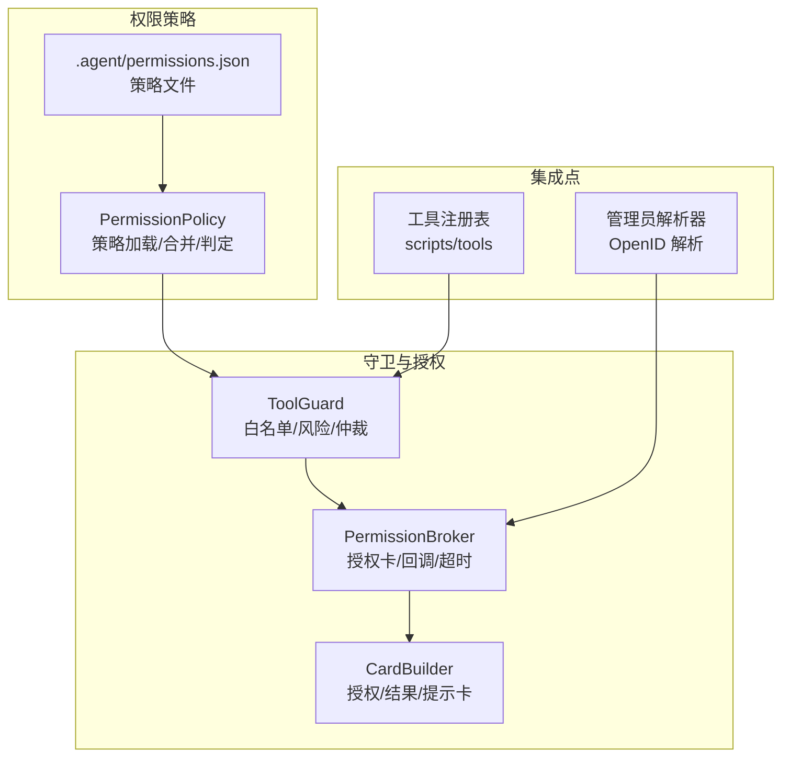
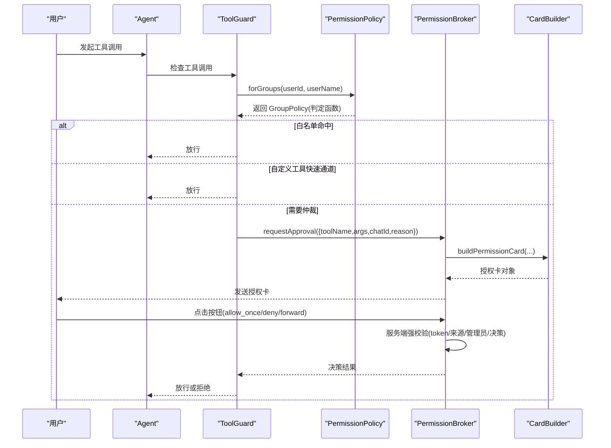
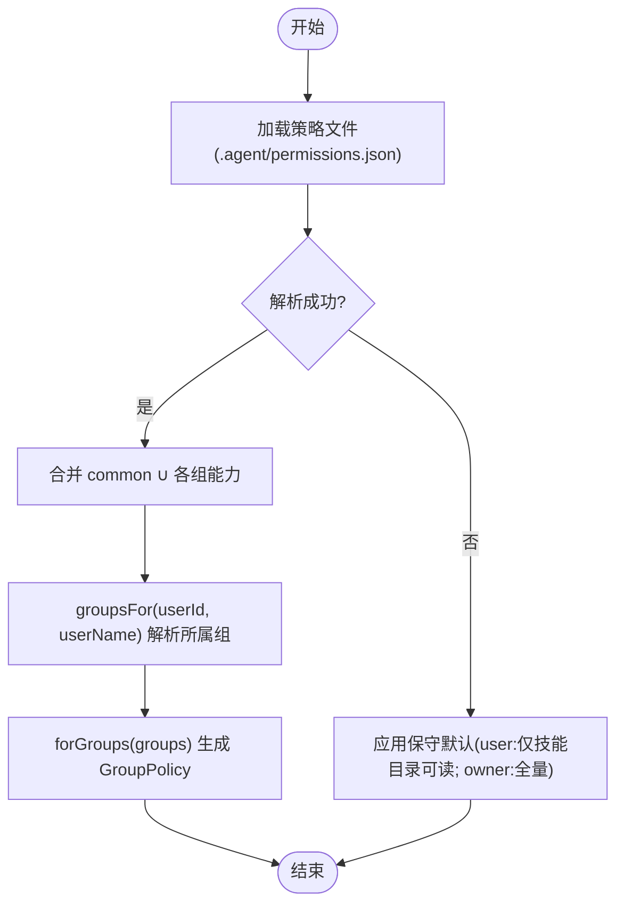
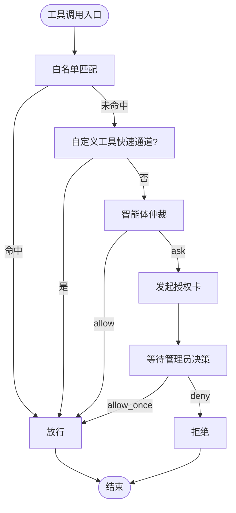
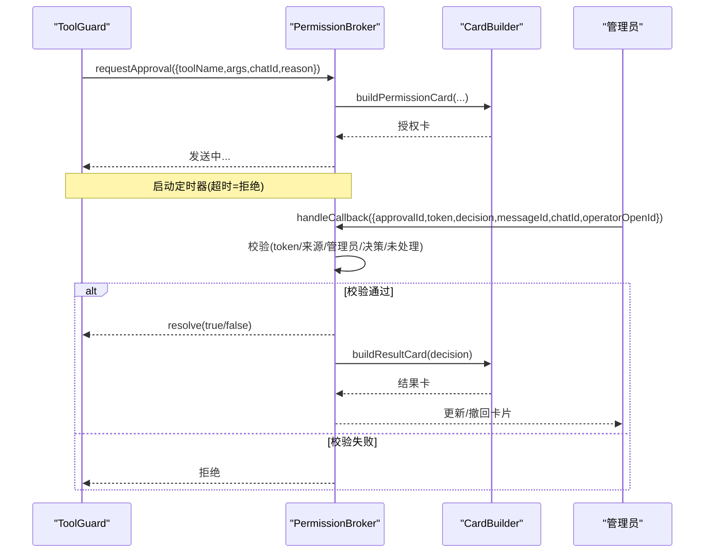
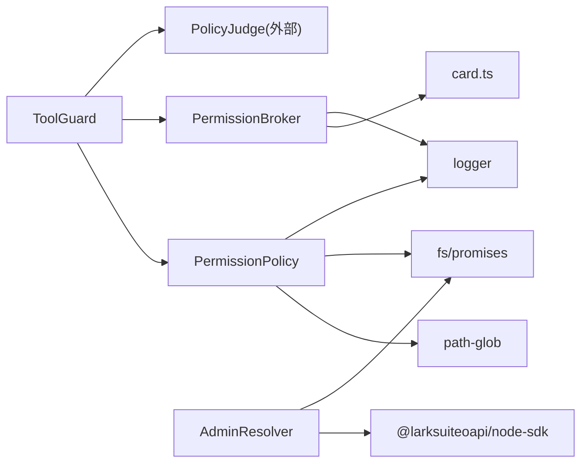

# 权限控制系统

<cite>
**本文引用的文件**
- [src/permission/policy.ts](file://src/permission/policy.ts)
- [src/guard/broker.ts](file://src/guard/broker.ts)
- [src/guard/card.ts](file://src/guard/card.ts)
- [.agent/permissions.json](file://.agent/permissions.json)
- [test/policy.test.ts](file://test/policy.test.ts)
- [test/tool-guard.test.ts](file://test/tool-guard.test.ts)
- [src/tools/registry.ts](file://src/tools/registry.ts)
- [src/feishu/admin-resolver.ts](file://src/feishu/admin-resolver.ts)
- [README.md](file://README.md)
</cite>

## 目录
1. [简介](#简介)
2. [项目结构](#项目结构)
3. [核心组件](#核心组件)
4. [架构总览](#架构总览)
5. [详细组件分析](#详细组件分析)
6. [依赖关系分析](#依赖关系分析)
7. [性能与可扩展性](#性能与可扩展性)
8. [故障排查指南](#故障排查指南)
9. [结论](#结论)
10. [附录：配置与开发指南](#附录配置与开发指南)

## 简介
本系统提供面向飞书 Agent 的“三级权限控制”（管理员/团队/普通用户），以策略文件驱动、代码层门禁拦截、智能体仲裁与授权卡审批相结合的机制，实现工具调用与资源访问的安全边界。其核心包括：
- 统一权限策略：通过 .agent/permissions.json 定义 common、owner 及任意用户组的能力范围，支持脚本、命令、读写路径、技能可见性等维度。
- 工具调用守卫：在每次工具执行前进行白名单匹配、风险标记判断与智能体综合判定；未命中则发起授权卡由管理员单次确认。
- 授权中枢：管理待授权请求、卡片回调校验、超时处理、转发到管理员私聊以及结果卡片更新。
- 动态重载与安全：策略文件 mtime 热重载；参数脱敏；防 shell 逃逸；fail-safe 保守默认。

该设计确保“非允许即 ask”，最小权限原则贯穿始终，同时兼顾灵活性与可审计性。

**章节来源**
- [README.md:17-23](file://README.md#L17-L23)
- [README.md:440-575](file://README.md#L440-L575)

## 项目结构
权限相关的关键目录与文件：
- 策略引擎：src/permission/policy.ts
- 守卫与授权：src/guard/broker.ts、src/guard/card.ts
- 策略示例：.agent/permissions.json
- 测试用例：test/policy.test.ts、test/tool-guard.test.ts
- 工具注册：src/tools/registry.ts
- 管理员解析：src/feishu/admin-resolver.ts
- 文档说明：README.md

**图表来源**
- [src/permission/policy.ts:68-158](file://src/permission/policy.ts#L68-L158)
- [src/guard/broker.ts:46-199](file://src/guard/broker.ts#L46-L199)
- [src/guard/card.ts:28-86](file://src/guard/card.ts#L28-L86)
- [src/tools/registry.ts:42-45](file://src/tools/registry.ts#L42-L45)
- [src/feishu/admin-resolver.ts:18-99](file://src/feishu/admin-resolver.ts#L18-L99)

**章节来源**
- [src/permission/policy.ts:1-32](file://src/permission/policy.ts#L1-L32)
- [src/guard/broker.ts:1-45](file://src/guard/broker.ts#L1-L45)
- [src/guard/card.ts:1-27](file://src/guard/card.ts#L1-L27)
- [src/tools/registry.ts:1-46](file://src/tools/registry.ts#L1-L46)
- [src/feishu/admin-resolver.ts:1-100](file://src/feishu/admin-resolver.ts#L1-L100)
- [.agent/permissions.json:1-21](file://.agent/permissions.json#L1-L21)

## 核心组件
- PermissionPolicy：负责加载并缓存策略文件，按用户身份解析所属组，合并 common 与各组能力，生成 GroupPolicy 判定函数（脚本、bash、read/write、skills）。
- ToolGuard：在工具调用前进行三层判定——白名单放行、自定义工具快速通道、智能体仲裁；未命中则触发授权卡流程。
- PermissionBroker：维护待授权请求，发送授权卡，接收回调并进行服务端强校验（token、消息来源、操作者身份、决策合法性），支持转发到管理员私聊与超时处理。
- CardBuilder：构建授权卡、结果卡、提示卡，并对敏感字段进行递归脱敏，限制命令展示长度。
- 管理员解析器：将管理员标识（Open ID/姓名/邮箱）解析为 Open ID，供权限系统识别负责人。
- 工具注册表：加载用户自定义工具与内置工具，结合策略进行准入过滤。

**章节来源**
- [src/permission/policy.ts:68-158](file://src/permission/policy.ts#L68-L158)
- [test/tool-guard.test.ts:1-92](file://test/tool-guard.test.ts#L1-92)
- [src/guard/broker.ts:46-199](file://src/guard/broker.ts#L46-L199)
- [src/guard/card.ts:28-102](file://src/guard/card.ts#L28-L102)
- [src/feishu/admin-resolver.ts:18-99](file://src/feishu/admin-resolver.ts#L18-L99)
- [src/tools/registry.ts:42-45](file://src/tools/registry.ts#L42-L45)

## 架构总览
权限控制的整体流程如下：
- 策略加载：读取 .agent/permissions.json，按 mtime 热重载；缺失或解析失败时回退保守默认。
- 组判定：根据 FEISHU_ADMIN 与 members 列表（openId/中文名/英文名）确定用户所属组集合。
- 能力合并：common ∪ 各组并集，生成 GroupPolicy 判定函数。
- 工具守卫：先白名单放行，再自定义工具快速通道，最后智能体仲裁；未命中则发授权卡。
- 授权审批：PermissionBroker 管理待授权请求，回调时严格校验 token、消息来源、操作者身份与决策值；支持转发与超时。
- 结果反馈：更新或撤回授权卡，返回最终决策。

**图表来源**
- [src/permission/policy.ts:91-158](file://src/permission/policy.ts#L91-L158)
- [src/guard/broker.ts:78-166](file://src/guard/broker.ts#L78-L166)
- [src/guard/card.ts:28-86](file://src/guard/card.ts#L28-L86)
- [test/tool-guard.test.ts:44-90](file://test/tool-guard.test.ts#L44-L90)

**章节来源**
- [README.md:488-518](file://README.md#L488-L518)
- [README.md:519-575](file://README.md#L519-L575)

## 详细组件分析

### 权限策略引擎（PermissionPolicy）
- 策略文件语法：
  - common：通用层，所有用户自动获得的能力。
  - owner：负责人组，FEISHU_ADMIN 自动属于；未配置的字段取全量缺省。
  - 其他组名：members 指定成员（openId/中文名/英文名），scripts/bash/read/write/skills 定义能力范围。
- 生效范围：common ∪ 所属各组（并集）。
- 动态重载：基于文件 mtime 的热重载，新会话立即生效。
- 安全默认：策略缺失或解析失败时，user 仅技能目录可读、无脚本与命令；owner 全量缺省。
- 用户缓存：可选 usersFile 缓存 openId→中文名/英文名，用于组成员匹配。

**图表来源**
- [src/permission/policy.ts:68-158](file://src/permission/policy.ts#L68-L158)
- [src/permission/policy.ts:178-210](file://src/permission/policy.ts#L178-L210)
- [src/permission/policy.ts:232-248](file://src/permission/policy.ts#L232-L248)

**章节来源**
- [src/permission/policy.ts:5-32](file://src/permission/policy.ts#L5-L32)
- [src/permission/policy.ts:91-158](file://src/permission/policy.ts#L91-L158)
- [src/permission/policy.ts:178-210](file://src/permission/policy.ts#L178-L210)
- [src/permission/policy.ts:232-248](file://src/permission/policy.ts#L232-L248)
- [test/policy.test.ts:14-121](file://test/policy.test.ts#L14-L121)

### 工具调用守卫（ToolGuard）
- 白名单机制：
  - 裸工具名、Tool(path)、Bash(cmd[:*]) 等规则命中则放行。
  - read 范围外直接拦截（能力边界），不弹授权卡。
- 自定义工具快速通道：非内置且未标 risk:"high" 的工具直接放行（准入风险已在注册层由组过滤决定）。
- 智能体仲裁：策略未命中时，以组策略为参考进行综合判断；符合意图则放行，否则进入授权卡流程。
- 授权卡：当仲裁结果为 ask 或未配置智能体时，发起授权卡等待管理员单次确认。

**图表来源**
- [test/tool-guard.test.ts:44-90](file://test/tool-guard.test.ts#L44-L90)
- [README.md:519-575](file://README.md#L519-L575)

**章节来源**
- [test/tool-guard.test.ts:1-92](file://test/tool-guard.test.ts#L1-L92)
- [README.md:519-575](file://README.md#L519-L575)

### 授权中枢（PermissionBroker）
- 待授权队列：维护 pending Map，包含 approvalId、token、chatId、toolName、toolArgs、messageId、timer、resolve。
- 授权卡发送：构建授权卡并发送到发起会话；支持转发到管理员私聊。
- 回调校验：严格校验 approvalId、token、消息来源（原卡或转发卡）、operatorOpenId 是否为管理员、decision 是否合法、是否已处理。
- 超时与中断：超时视为拒绝；会话中断（/stop）立即取消等待并收尾卡片。
- 结果处理：精简模式撤回卡片，详细模式更新为结果卡。

**图表来源**
- [src/guard/broker.ts:78-166](file://src/guard/broker.ts#L78-L166)
- [src/guard/card.ts:28-86](file://src/guard/card.ts#L28-L86)

**章节来源**
- [src/guard/broker.ts:46-199](file://src/guard/broker.ts#L46-L199)
- [src/guard/card.ts:28-102](file://src/guard/card.ts#L28-L102)

### 管理员身份解析（AdminResolver）
- 支持 Open ID、中文姓名、英文姓名、邮箱等多种标识。
- 优先从本地缓存（data/users/{appId}_users.json）查找；失败则通过飞书 API 查询。
- 解析结果用于权限系统中的 owner 组判定与授权卡操作者校验。

**章节来源**
- [src/feishu/admin-resolver.ts:18-99](file://src/feishu/admin-resolver.ts#L18-L99)

### 工具注册与策略联动（Registry）
- 加载用户自定义工具（.agent/tools/*.ts）与内置工具。
- 策略层对 scripts/tools 进行准入过滤；高风险工具可通过 risk:"high" 强制走授权卡。
- 与 PermissionPolicy 的 scriptsAllowed 配合，确保只有授权组才能注册/调用对应脚本。

**章节来源**
- [src/tools/registry.ts:1-46](file://src/tools/registry.ts#L1-L46)
- [src/permission/policy.ts:110-158](file://src/permission/policy.ts#L110-L158)

## 依赖关系分析
- PermissionPolicy 依赖：
  - fs/promises：读取策略文件与用户缓存。
  - path-glob：路径 glob 匹配。
  - logger：日志记录。
- PermissionBroker 依赖：
  - card.ts：构建授权卡与结果卡。
  - logger：日志记录。
- ToolGuard 依赖：
  - PermissionPolicy：获取 GroupPolicy 判定函数。
  - PermissionBroker：发起授权卡。
  - 智能体仲裁接口：PolicyJudge（外部注入）。
- 管理员解析器依赖：
  - 飞书 SDK：用户信息查询。
  - fs/promises：读取本地缓存。

**图表来源**
- [src/permission/policy.ts:1-3](file://src/permission/policy.ts#L1-L3)
- [src/guard/broker.ts:1-3](file://src/guard/broker.ts#L1-L3)
- [src/guard/card.ts:1-2](file://src/guard/card.ts#L1-L2)
- [src/feishu/admin-resolver.ts:5-8](file://src/feishu/admin-resolver.ts#L5-L8)

**章节来源**
- [src/permission/policy.ts:1-3](file://src/permission/policy.ts#L1-L3)
- [src/guard/broker.ts:1-3](file://src/guard/broker.ts#L1-L3)
- [src/guard/card.ts:1-2](file://src/guard/card.ts#L1-L2)
- [src/feishu/admin-resolver.ts:5-8](file://src/feishu/admin-resolver.ts#L5-L8)

## 性能与可扩展性
- 策略文件热重载：基于 mtime 检测，避免频繁 IO；用户缓存也按 mtime 刷新。
- 保守默认：策略缺失或解析失败时降级为最小权限，保障系统稳定性。
- 防 shell 逃逸：bash 命令含连接符或子命令时不参与前缀匹配，直接交授权卡。
- 参数脱敏：授权卡中敏感字段递归脱敏，命令展示长度限制。
- 可扩展点：
  - 新增组：在 permissions.json 中添加组名与成员、能力范围。
  - 新增工具：在 .agent/tools/ 下添加脚本，并通过策略 scripts 字段授权。
  - 智能体仲裁：通过 PolicyJudge 注入自定义判断逻辑。

[本节为通用指导，无需具体文件分析]

## 故障排查指南
- 策略文件解析失败：
  - 现象：权限回退保守默认，日志输出警告。
  - 处理：检查 .agent/permissions.json 格式与字段类型；确认文件存在且可读。
- 授权卡未收到或无效：
  - 现象：回调被拒绝，detail 提示 token 或来源不匹配。
  - 处理：确认 approvalId、token、messageId、chatId 一致；操作者为管理员；未重复处理。
- bash 命令被拦截：
  - 现象：含连接符或子命令的命令无法前缀匹配，进入授权卡。
  - 处理：拆分命令或使用精确匹配；必要时申请授权。
- 用户不在任何组：
  - 现象：仅技能目录可读，无脚本与命令。
  - 处理：在 permissions.json 中添加成员到相应组；或启用 common 能力。

**章节来源**
- [src/permission/policy.ts:178-210](file://src/permission/policy.ts#L178-L210)
- [src/guard/broker.ts:131-166](file://src/guard/broker.ts#L131-L166)
- [src/guard/card.ts:88-102](file://src/guard/card.ts#L88-L102)
- [test/policy.test.ts:87-105](file://test/policy.test.ts#L87-L105)

## 结论
本权限控制系统通过策略文件驱动、代码层门禁、智能体仲裁与授权卡审批的组合，实现了细粒度、可审计、高安全的权限管理。其设计遵循最小权限原则，具备热重载、防逃逸、参数脱敏等安全保障，并为管理员与开发者提供了灵活的扩展点。建议在生产环境中合理配置 common、owner 与用户组，结合智能体仲裁与授权卡流程，平衡安全性与可用性。

[本节为总结，无需具体文件分析]

## 附录：配置与开发指南

### 权限策略文件语法
- common：通用能力，所有用户自动获得。
- owner：负责人组，FEISHU_ADMIN 自动属于；未配置字段取全量缺省。
- 用户组：members 指定成员（openId/中文名/英文名），scripts/bash/read/write/skills 定义能力范围。
- 生效范围：common ∪ 各组并集。
- 动态重载：修改策略文件后新会话立即生效。

**章节来源**
- [src/permission/policy.ts:5-32](file://src/permission/policy.ts#L5-L32)
- [.agent/permissions.json:1-21](file://.agent/permissions.json#L1-L21)

### 命令权限控制
- bash 命令支持精确匹配、前缀匹配（cmd:*）与全部（*）。
- 含 shell 连接符或子命令的命令不参与前缀匹配，直接交授权卡。
- 建议将常用命令拆分为前缀匹配，减少误判。

**章节来源**
- [src/permission/policy.ts:138-152](file://src/permission/policy.ts#L138-L152)
- [README.md:519-575](file://README.md#L519-L575)

### 自定义权限策略开发
- 新增组：在 permissions.json 中添加组名与成员、能力范围。
- 新增脚本：在 .agent/scripts/ 下添加脚本，并在策略 scripts 字段授权。
- 高风险工具：通过 risk:"high" 强制走授权卡。
- 智能体仲裁：注入 PolicyJudge 实现自定义判断逻辑。

**章节来源**
- [src/tools/registry.ts:1-46](file://src/tools/registry.ts#L1-L46)
- [src/permission/policy.ts:110-158](file://src/permission/policy.ts#L110-L158)
- [test/tool-guard.test.ts:1-92](file://test/tool-guard.test.ts#L1-L92)

### 权限配置示例
- 示例策略文件位于 .agent/permissions.json，定义了 common、owner、user1 三组能力。
- 管理员可通过 /perm 查看当前策略与生效范围。

**章节来源**
- [.agent/permissions.json:1-21](file://.agent/permissions.json#L1-L21)
- [README.md:507-510](file://README.md#L507-L510)