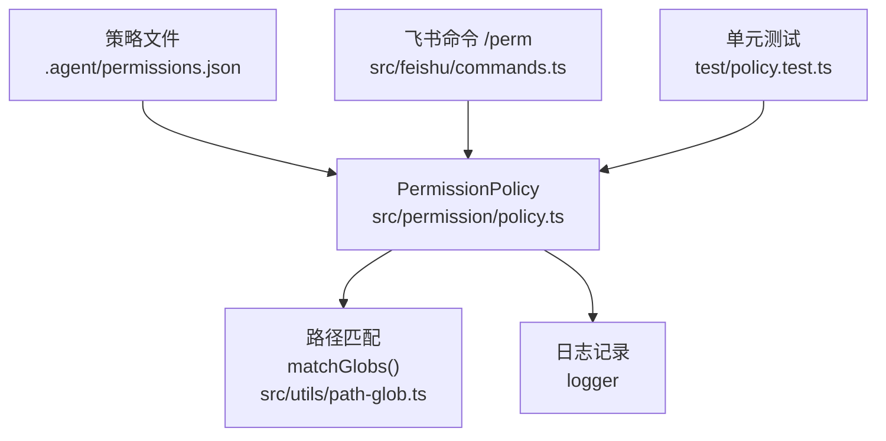
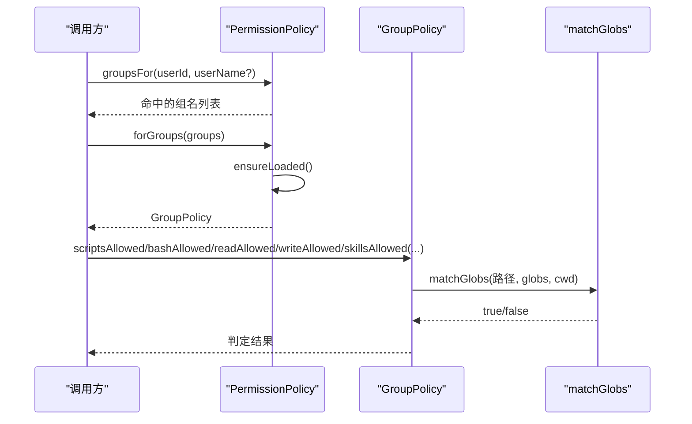
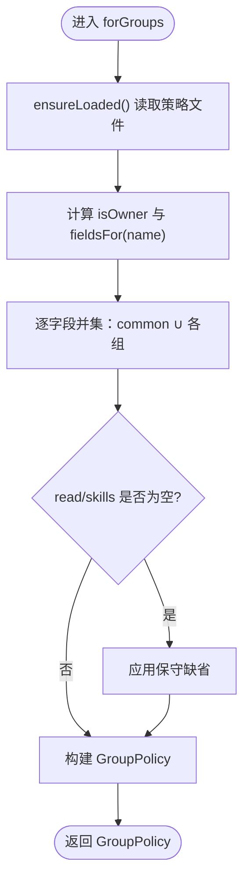
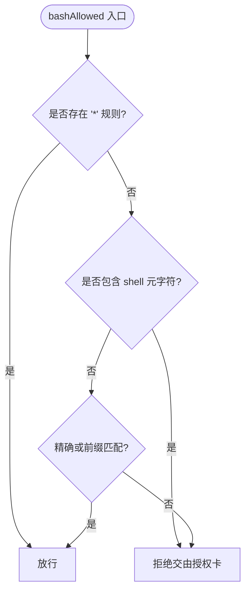
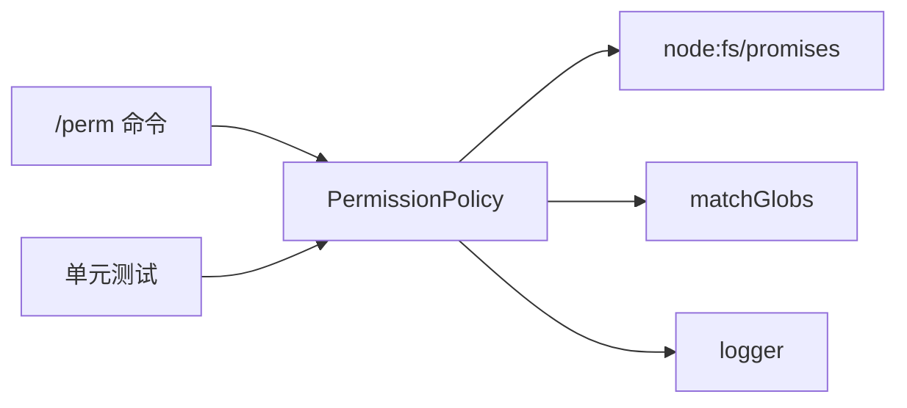
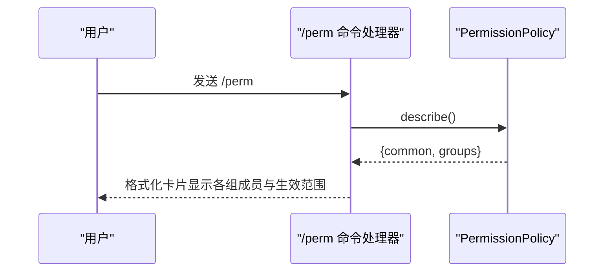

# 权限策略引擎

<cite>
**本文引用的文件**
- [policy.ts](file://src/permission/policy.ts)
- [permissions.json](file://.agent/permissions.json)
- [path-glob.ts](file://src/utils/path-glob.ts)
- [commands.ts](file://src/feishu/commands.ts)
- [policy.test.ts](file://test/policy.test.ts)
</cite>

## 目录
1. [简介](#简介)
2. [项目结构](#项目结构)
3. [核心组件](#核心组件)
4. [架构总览](#架构总览)
5. [详细组件分析](#详细组件分析)
6. [依赖关系分析](#依赖关系分析)
7. [性能考量](#性能考量)
8. [故障排查指南](#故障排查指南)
9. [结论](#结论)
10. [附录](#附录)

## 简介
本文档系统性说明权限策略引擎的实现与使用，聚焦 PermissionPolicy 类的核心机制：三级权限控制（管理员/负责人 owner/普通用户）、策略文件解析与验证、GroupFields 接口定义、编译后的 GroupPolicy 对象、以及 scriptsAllowed/bashAllowed/readAllowed/writeAllowed/skillsAllowed 等权限检查方法。同时覆盖策略文件热重载、用户缓存系统、保守默认安全策略、配置示例、组合并规则与自定义开发指南，为管理员提供完整的权限配置参考。

## 项目结构
权限策略引擎位于 src/permission/policy.ts，策略配置文件位于 .agent/permissions.json，路径匹配工具在 src/utils/path-glob.ts，权限查看命令在 src/feishu/commands.ts，单元测试在 test/policy.test.ts。



**图表来源**
- [policy.ts:68-210](file://src/permission/policy.ts#L68-L210)
- [path-glob.ts:10-41](file://src/utils/path-glob.ts#L10-L41)
- [commands.ts:287-313](file://src/feishu/commands.ts#L287-L313)
- [permissions.json:1-21](file://.agent/permissions.json#L1-L21)

**章节来源**
- [policy.ts:1-32](file://src/permission/policy.ts#L1-L32)
- [permissions.json:1-21](file://.agent/permissions.json#L1-L21)

## 核心组件
- GroupFields：组字段定义，包含成员名单、脚本白名单、bash 命令白名单、可读/可写路径 glob、技能可见性 glob。
- GroupPolicy：编译后的策略对象，暴露 isOwner、scriptsAllowed、bashAllowed、readAllowed、writeAllowed、skillsAllowed、describe 等方法。
- PermissionPolicy：策略加载、合并、判定入口；支持热重载与用户缓存。

**章节来源**
- [policy.ts:34-57](file://src/permission/policy.ts#L34-L57)
- [policy.ts:68-158](file://src/permission/policy.ts#L68-L158)

## 架构总览
权限策略引擎以“声明式策略 + 运行时判定”的方式工作：
- 策略文件定义 common、owner 及任意命名组，描述各组的成员与能力范围。
- 运行时根据用户标识（openId/中文名/英文名）命中一个或多个组，合并生效范围（common ∪ 各组）。
- 通过 GroupPolicy 的判定函数对脚本、命令、读写路径、技能可见性进行快速判断。
- 策略文件 mtime 变化时自动重载，新会话立即生效。



**图表来源**
- [policy.ts:91-158](file://src/permission/policy.ts#L91-L158)
- [path-glob.ts:34-41](file://src/utils/path-glob.ts#L34-L41)

## 详细组件分析

### PermissionPolicy：三级权限控制与策略合并
- 三级权限控制
  - 管理员：传入 adminId 的用户被视为负责人（owner），拥有全量缺省权限。
  - 负责人（owner）：若未显式配置 owner 字段，则采用全量缺省（所有脚本、命令、读写、技能均放行）。
  - 普通用户：不在任何组时采用保守缺省（仅技能目录可读，无脚本、无命令、不可写）。
- 组判定
  - 支持 openId、中文名、英文名（从用户缓存补充）三种标识匹配 members。
  - 一人可属多组，最终能力取并集。
- 策略合并
  - 生效范围 = common ∪ 所属各组（逐字段并集）。
  - read 空回退到技能目录；skills 空回退到全部；scripts/bash/write 空保持空（保守）。
- 热重载
  - 基于策略文件 mtime 检测变更，首次或变更后重新解析 JSON，失败时按空组处理并记录警告。
- 用户缓存
  - 可选 usersFile 提供 openId → {name, englishName} 映射，按 mtime 缓存，用于成员名匹配。



**图表来源**
- [policy.ts:109-158](file://src/permission/policy.ts#L109-L158)
- [policy.ts:178-210](file://src/permission/policy.ts#L178-L210)

**章节来源**
- [policy.ts:68-158](file://src/permission/policy.ts#L68-L158)
- [policy.ts:178-229](file://src/permission/policy.ts#L178-L229)

### GroupFields 接口定义
- members：成员标识数组（openId/中文名/英文名）。
- scripts：该组可调用的脚本名（.agent/scripts/ 文件名去扩展名）。
- bash：该组可执行的命令，支持精确匹配、cmd:* 前缀匹配、* 全放行。
- read：可读路径 glob。
- write：可写路径 glob。
- skills：技能文件可见性 glob（如 .agent/skills/**）。

**章节来源**
- [policy.ts:34-41](file://src/permission/policy.ts#L34-L41)

### GroupPolicy：编译后的策略对象
- groups：命中的组名（含 owner）。
- isOwner：是否负责人。
- scriptsAllowed(name)：脚本准入判定。
- bashAllowed(command)：命令准入判定（含 shell 元字符防护）。
- readAllowed(path)：路径可读判定。
- writeAllowed(path)：路径可写判定。
- skillsAllowed(path)：技能可见性判定。
- describe()：返回生效范围（用于 /perm 展示）。

**章节来源**
- [policy.ts:43-57](file://src/permission/policy.ts#L43-L57)
- [policy.ts:142-157](file://src/permission/policy.ts#L142-L157)

### 权限检查方法实现逻辑
- scriptsAllowed
  - 负责人且未配置 owner.scripts 时，允许全部脚本。
  - 否则按 merged.scripts 集合（不区分大小写）判定。
- bashAllowed
  - 若存在 * 规则，直接放行。
  - 若命令包含 shell 元字符（如 ; & | ` $( ），拒绝匹配，交由授权卡处理。
  - 否则按精确匹配或 cmd:* 前缀匹配判定。
- readAllowed / writeAllowed / skillsAllowed
  - 统一使用 matchGlobs(globs, path, cwd) 进行 glob 匹配。
  - 支持相对/绝对路径、~ 展开、跨平台斜杠归一化。



**图表来源**
- [policy.ts:146-152](file://src/permission/policy.ts#L146-L152)

**章节来源**
- [policy.ts:135-155](file://src/permission/policy.ts#L135-L155)

### 策略文件解析与验证
- 解析流程
  - 读取 .agent/permissions.json，解析为 Record<string, GroupFields>。
  - 提取 common 作为通用层；跳过 _ 开头的键（注释）。
  - 其余键作为用户组，使用 sanitize 过滤非法字段类型。
- 验证与安全
  - sanitize 仅保留 members/scripts/bash/read/write/skills 字符串数组。
  - 解析失败时记录警告并回退为空策略（fail-safe）。
- 热重载
  - 每次访问前 stat 获取 mtime，若变化则重新加载。
  - 用户缓存 usersFile 同样基于 mtime 刷新。

**章节来源**
- [policy.ts:178-210](file://src/permission/policy.ts#L178-L210)
- [policy.ts:240-248](file://src/permission/policy.ts#L240-L248)

### 用户缓存系统
- 目的：将 openId 映射到中文名/英文名，以便 members 匹配。
- 机制：按需读取 usersFile，按 mtime 缓存 Map，避免重复 IO。
- 容错：读取失败返回 undefined，不影响其他功能。

**章节来源**
- [policy.ts:212-229](file://src/permission/policy.ts#L212-L229)

### 保守默认的安全策略
- 无组用户：仅技能目录可读（.agent/skills/**、.pi/skills/**、.agents/skills/**），无脚本、无命令、不可写。
- 负责人未配置：默认全量放行（scripts/bash/read/write/skills 均为 * 或 **）。
- 策略缺失/解析失败：按空组处理，确保最小权限。

**章节来源**
- [policy.ts:62-66](file://src/permission/policy.ts#L62-L66)
- [policy.ts:232-238](file://src/permission/policy.ts#L232-L238)

### 权限策略配置示例与组合并规则
- 示例文件：.agent/permissions.json
  - common：所有人具备的技能目录可读与技能可见性。
  - owner：负责人成员名单与受限命令白名单、读写范围。
  - user1：普通用户组，限定脚本、命令、可读路径。
- 组合并规则
  - 生效范围 = common ∪ 所属各组（逐字段并集）。
  - 一人多组：能力取并集，互不影响。
  - owner 缺省全量：未配置的 owner 字段视为全量。

**章节来源**
- [permissions.json:1-21](file://.agent/permissions.json#L1-L21)
- [policy.ts:120-133](file://src/permission/policy.ts#L120-L133)

### 自定义权限策略开发指南
- 新增组
  - 在 permissions.json 中添加新键（非 common、非 _ 开头），设置 members 与所需能力字段。
- 调整 common
  - 建议仅授予最小必要能力（如技能目录可读），避免过度开放。
- 命令白名单
  - 使用精确匹配或 cmd:* 前缀匹配，避免使用 * 全放行。
  - 注意 shell 元字符会被拒绝匹配，防止逃逸。
- 路径范围
  - 使用 glob 表达读/写范围，结合 cwd 进行匹配。
- 测试验证
  - 使用 /perm 指令查看当前策略生效范围。
  - 通过单元测试思路验证边界情况（无组、owner 缺省、热重载）。

**章节来源**
- [commands.ts:287-313](file://src/feishu/commands.ts#L287-L313)
- [policy.test.ts:14-121](file://test/policy.test.ts#L14-L121)

## 依赖关系分析
- PermissionPolicy 依赖
  - node:fs/promises：读取策略文件与统计 mtime。
  - path-glob.matchGlobs：路径 glob 匹配。
  - logger：记录加载与错误信息。
- 外部集成
  - 飞书命令 /perm 调用 describe 输出策略概览。
  - 单元测试覆盖组判定、合并、热重载、保守缺省等行为。



**图表来源**
- [policy.ts:1-3](file://src/permission/policy.ts#L1-L3)
- [commands.ts:287-313](file://src/feishu/commands.ts#L287-L313)
- [policy.test.ts:1-121](file://test/policy.test.ts#L1-L121)

**章节来源**
- [policy.ts:1-3](file://src/permission/policy.ts#L1-L3)
- [commands.ts:287-313](file://src/feishu/commands.ts#L287-L313)
- [policy.test.ts:1-121](file://test/policy.test.ts#L1-L121)

## 性能考量
- 热重载基于 mtime，避免频繁解析；仅在文件变更时重新加载。
- 用户缓存 Map 减少重复 IO；usersFile 变更才刷新。
- 路径匹配使用预编译正则，批量 globs 一次匹配多个条目。
- 合并过程使用 Set 去重，降低后续判定开销。

[本节为通用性能讨论，无需特定文件引用]

## 故障排查指南
- 策略文件缺失或解析失败
  - 现象：按空组处理，仅技能目录可读，无脚本与命令。
  - 处理：检查 .agent/permissions.json 语法与路径；确认 mtime 更新。
- 命令被拒绝
  - 现象：包含 shell 元字符的命令不参与匹配，交由授权卡。
  - 处理：移除危险字符或使用白名单前缀匹配。
- 用户未命中任何组
  - 现象：采用保守缺省。
  - 处理：检查 members 名单与用户缓存 usersFile；确认 openId/中文名/英文名匹配。
- 查看当前策略
  - 使用 /perm 指令查看 common 与各组生效范围。

**章节来源**
- [policy.ts:178-210](file://src/permission/policy.ts#L178-L210)
- [commands.ts:287-313](file://src/feishu/commands.ts#L287-L313)

## 结论
权限策略引擎通过声明式策略文件与运行时判定相结合，实现了灵活、安全、可扩展的三级权限控制。其保守默认、热重载、用户缓存与路径 glob 匹配等特性，确保了在复杂场景下的可用性与安全性。管理员可通过合理配置 permissions.json 精细控制团队资源访问与执行能力，并通过 /perm 与单元测试进行验证与排障。

[本节为总结性内容，无需特定文件引用]

## 附录

### 类图：PermissionPolicy 与相关接口
```mermaid
classDiagram
class GroupFields {
+string[] members
+string[] scripts
+string[] bash
+string[] read
+string[] write
+string[] skills
}
class GroupPolicy {
+string[] groups
+boolean isOwner
+scriptsAllowed(name) boolean
+bashAllowed(command) boolean
+readAllowed(path) boolean
+writeAllowed(path) boolean
+skillsAllowed(path) boolean
+describe() Required~Omit~GroupFields,members~~
}
class PermissionPolicy {
-filePath string
-adminId string?
-usersFile string?
-cwd string
-common GroupFields
-groups Record~string,GroupFields~
-loadedMtimeMs number
-warned boolean
-profileCache Map~string,{name?,englishName?}~
-profileMtimeMs number
+groupsFor(userId, userName?) Promise~string[]~
+forGroups(groups) Promise~GroupPolicy~
+describe() Promise~{common,groups}~
-ensureLoaded() Promise~void~
-loadProfile(openId) Promise~{name?,englishName?}|undefined~
}
PermissionPolicy --> GroupPolicy : "创建"
GroupPolicy --> GroupFields : "描述"
```

**图表来源**
- [policy.ts:34-57](file://src/permission/policy.ts#L34-L57)
- [policy.ts:68-229](file://src/permission/policy.ts#L68-L229)

### 序列图：/perm 命令查看策略


**图表来源**
- [commands.ts:287-313](file://src/feishu/commands.ts#L287-L313)
- [policy.ts:160-176](file://src/permission/policy.ts#L160-L176)