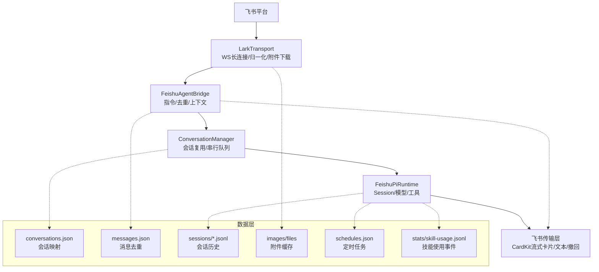
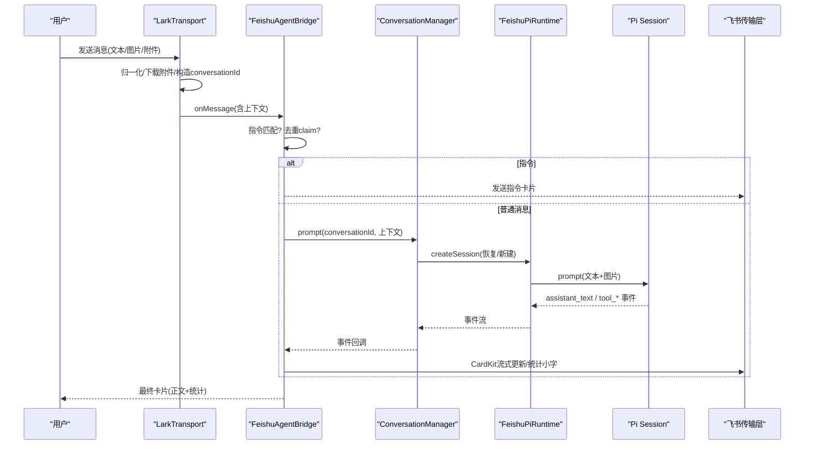
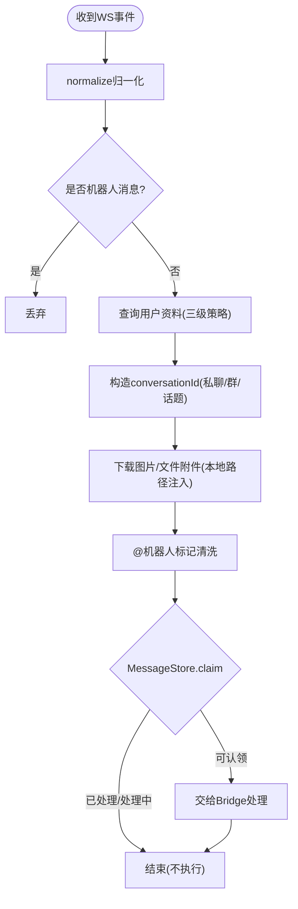
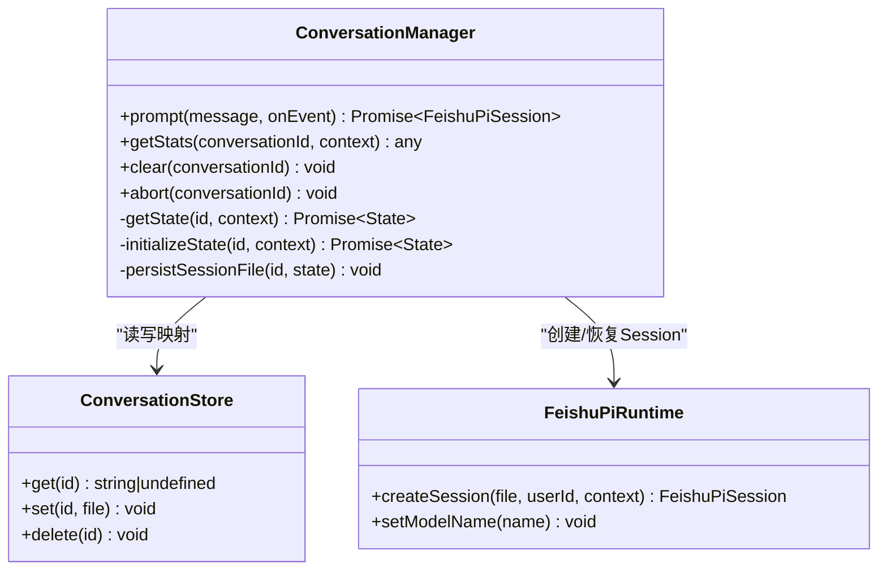
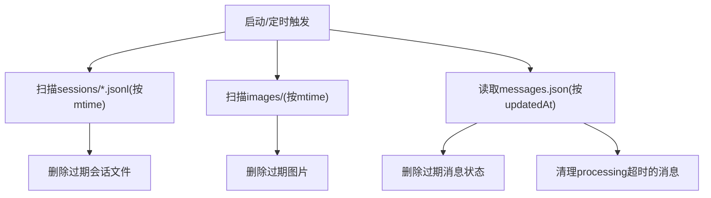
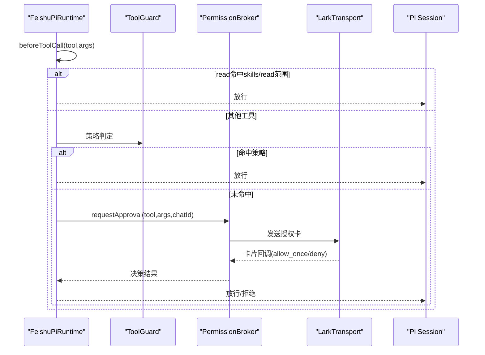
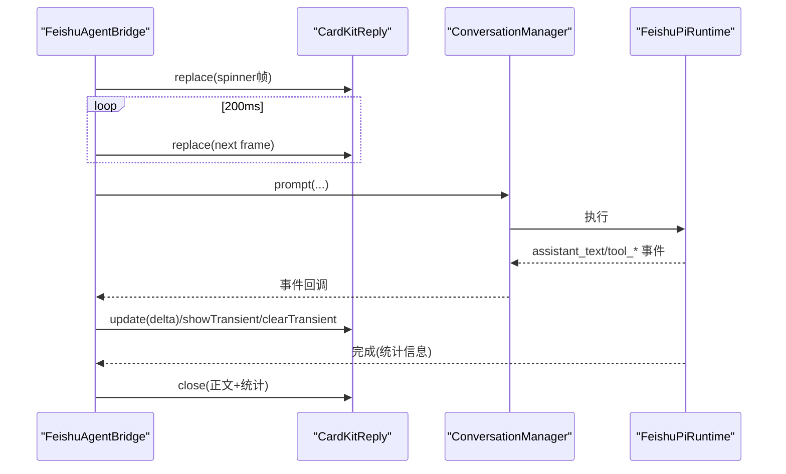
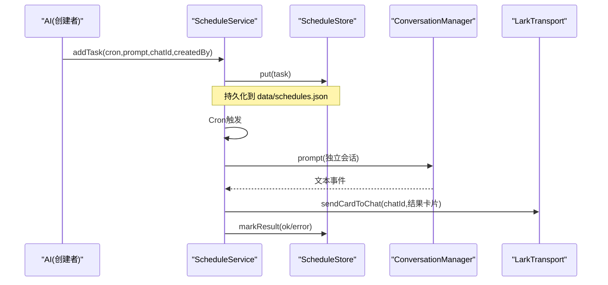
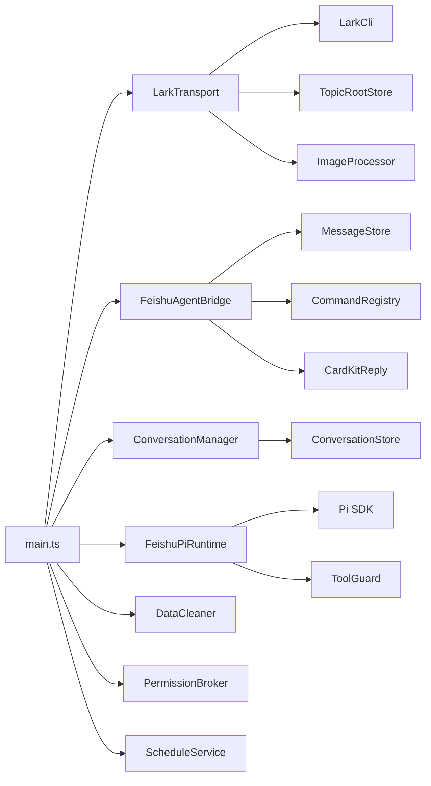

# 数据流设计

<cite>
**本文引用的文件**
- [src/main.ts](file://src/main.ts)
- [src/config.ts](file://src/config.ts)
- [src/feishu/lark-transport.ts](file://src/feishu/lark-transport.ts)
- [src/feishu/agent-bridge.ts](file://src/feishu/agent-bridge.ts)
- [src/feishu/message-store.ts](file://src/feishu/message-store.ts)
- [src/runtime/conversation-manager.ts](file://src/runtime/conversation-manager.ts)
- [src/runtime/conversation-store.ts](file://src/runtime/conversation-store.ts)
- [src/runtime/feishu-pi-runtime.ts](file://src/runtime/feishu-pi-runtime.ts)
- [src/runtime/data-cleaner.ts](file://src/runtime/data-cleaner.ts)
- [src/guard/broker.ts](file://src/guard/broker.ts)
- [src/schedule/service.ts](file://src/schedule/service.ts)
- [docs/architecture.md](file://docs/architecture.md)
- [docs/data-management.md](file://docs/data-management.md)
- [package.json](file://package.json)
</cite>

## 目录
1. [引言](#引言)
2. [项目结构](#项目结构)
3. [核心组件](#核心组件)
4. [架构总览](#架构总览)
5. [详细组件分析](#详细组件分析)
6. [依赖关系分析](#依赖关系分析)
7. [性能考虑](#性能考虑)
8. [故障排查指南](#故障排查指南)
9. [结论](#结论)
10. [附录](#附录)

## 引言
本文件聚焦 mini-claw 的数据流设计，完整描述消息从飞书平台进入、经智能体处理到响应返回的全过程。重点覆盖：
- 入站消息的处理流程：解析、去重、路由与上下文构建
- 会话状态维护：多轮对话的持久化与恢复策略
- 数据存储方案：本地文件存储、缓存策略与清理机制
- 关键业务场景的数据流图与序列图
- 性能优化：批量处理、异步操作与内存管理策略

## 项目结构
系统采用分层架构：
- 传输层：基于飞书 WSClient 的消息接收与卡片回调处理
- 会话层：按用户或话题隔离的会话管理与串行队列
- 权限与 Guard：统一策略 + 动态审核（策略 → 智能体 → 授权卡）
- Agent 运行时：Pi Session、模型适配、工具注册与生命周期事件
- 回复层：CardKit 2.0 流式卡片、统计小字与表情反馈
- 数据层：会话映射、消息去重、图片/附件缓存、定时任务与统计事件流

图表来源
- [src/feishu/lark-transport.ts:82-133](file://src/feishu/lark-transport.ts#L82-L133)
- [src/feishu/agent-bridge.ts:66-99](file://src/feishu/agent-bridge.ts#L66-L99)
- [src/runtime/conversation-manager.ts:33-95](file://src/runtime/conversation-manager.ts#L33-L95)
- [src/runtime/feishu-pi-runtime.ts:147-284](file://src/runtime/feishu-pi-runtime.ts#L147-L284)
- [docs/data-management.md:20-195](file://docs/data-management.md#L20-L195)

章节来源
- [docs/architecture.md:19-33](file://docs/architecture.md#L19-L33)
- [docs/data-management.md:20-195](file://docs/data-management.md#L20-L195)

## 核心组件
- LarkTransport：飞书底层 WSClient 接入，消息归一化、资源下载、卡片回调路由
- FeishuAgentBridge：消息入口编排（指令识别、去重、上下文、流式卡片、统计收尾）
- ConversationManager：会话复用、串行队列、中断与增量持久化
- FeishuPiRuntime：创建 Pi Session、注入工具与 beforeToolCall 钩子、模型切换
- MessageStore：消息去重与“卡住”恢复
- DataCleaner：启动与定时清理会话、图片、消息状态
- PermissionBroker：授权卡生命周期管理（发送、转发、校验、结果更新/撤回）
- ScheduleService：cron 调度、任务持久化与执行回推

章节来源
- [src/feishu/lark-transport.ts:82-248](file://src/feishu/lark-transport.ts#L82-L248)
- [src/feishu/agent-bridge.ts:71-236](file://src/feishu/agent-bridge.ts#L71-L236)
- [src/runtime/conversation-manager.ts:22-118](file://src/runtime/conversation-manager.ts#L22-L118)
- [src/runtime/feishu-pi-runtime.ts:147-284](file://src/runtime/feishu-pi-runtime.ts#L147-L284)
- [src/feishu/message-store.ts:13-48](file://src/feishu/message-store.ts#L13-L48)
- [src/runtime/data-cleaner.ts:30-184](file://src/runtime/data-cleaner.ts#L30-L184)
- [src/guard/broker.ts:46-199](file://src/guard/broker.ts#L46-L199)
- [src/schedule/service.ts:105-238](file://src/schedule/service.ts#L105-L238)

## 架构总览
整体数据流遵循“传输层 → 会话层 → 权限/Guard → Agent 运行时 → 回复层”的分层路径。所有能力通过统一策略与 Guard 控制，确保工具调用安全可控；会话按用户或话题隔离，支持重启恢复；数据以本地文件持久化，配合自动清理保障长期运行稳定性。

图表来源
- [src/feishu/lark-transport.ts:88-248](file://src/feishu/lark-transport.ts#L88-L248)
- [src/feishu/agent-bridge.ts:71-236](file://src/feishu/agent-bridge.ts#L71-L236)
- [src/runtime/conversation-manager.ts:65-95](file://src/runtime/conversation-manager.ts#L65-L95)
- [src/runtime/feishu-pi-runtime.ts:147-284](file://src/runtime/feishu-pi-runtime.ts#L147-L284)

## 详细组件分析

### 入站消息处理流程（解析、去重、路由、上下文构建）
- 解析：LarkTransport 使用官方 SDK 的 normalize 将原始事件归一化为统一结构，剥离机器人自身消息，清洗 @机器人标记，并下载图片/文件附件，将本地路径写入消息文本供 Agent 读取。
- 去重：FeishuAgentBridge 在入口处调用 MessageStore.claim，若消息已完成或仍在处理且未超时则直接丢弃，避免重复执行。
- 路由：根据 chat 类型（私聊/群/话题）与 threadId 计算 conversationId；话题群首条消息作为根并持久化，后续消息收敛至同一会话。
- 上下文：LarkTransport 查询用户资料（联系人 API → 群成员列表 → 外部 CLI），填充 userOpenId、userName、departmentNames、isAdmin 等上下文字段，传递给上层。

图表来源
- [src/feishu/lark-transport.ts:88-248](file://src/feishu/lark-transport.ts#L88-L248)
- [src/feishu/message-store.ts:23-48](file://src/feishu/message-store.ts#L23-L48)
- [docs/architecture.md:51-67](file://docs/architecture.md#L51-L67)

章节来源
- [src/feishu/lark-transport.ts:88-248](file://src/feishu/lark-transport.ts#L88-L248)
- [src/feishu/message-store.ts:13-48](file://src/feishu/message-store.ts#L13-L48)
- [docs/architecture.md:51-67](file://docs/architecture.md#L51-L67)

### 会话状态维护（多轮对话持久化与恢复）
- 会话键：私聊/普通群按用户隔离；话题群按话题根共享；定时任务按任务隔离。
- 持久化：首次 message_end 时由 Pi 落盘 session 文件；ConversationManager 监听事件并在首个 sessionFile 可用时立即写入 conversations.json，即使中途中断也能恢复。
- 恢复：服务重启后按映射重新打开 Pi Session，继续上下文；若映射指向的文件被清理，会话层容错新建会话。
- 并发与中断：同一会话串行队列，新消息到达会 abort 在途请求，保证最新意图优先。

图表来源
- [src/runtime/conversation-manager.ts:22-118](file://src/runtime/conversation-manager.ts#L22-L118)
- [src/runtime/conversation-store.ts:11-30](file://src/runtime/conversation-store.ts#L11-L30)
- [src/runtime/feishu-pi-runtime.ts:147-224](file://src/runtime/feishu-pi-runtime.ts#L147-L224)

章节来源
- [src/runtime/conversation-manager.ts:33-95](file://src/runtime/conversation-manager.ts#L33-L95)
- [src/runtime/conversation-store.ts:11-30](file://src/runtime/conversation-store.ts#L11-L30)
- [docs/data-management.md:22-49](file://docs/data-management.md#L22-L49)

### 消息存储方案（本地文件、缓存与清理）
- 会话映射：conversations.json 记录 conversationId → sessionFile，不参与过期清理，残留映射由会话层容错。
- 消息去重：messages.json 记录 messageId 的状态与更新时间，用于跨群去重与“卡住”恢复。
- 会话历史：data/sessions/*.jsonl 为 Pi 管理的会话文件，保留 7 天。
- 附件缓存：images/ 与 files/ 存放图片与文件附件，图片参与清理，files 当前不在清理范围（已知缺口）。
- 统计与任务：stats/skill-usage.jsonl 长期留存；schedules.json 持久化定时任务。
- 清理策略：DataCleaner 启动执行一次，之后每 24 小时清理会话、图片、过期消息状态与“卡住”消息。

图表来源
- [src/runtime/data-cleaner.ts:44-184](file://src/runtime/data-cleaner.ts#L44-L184)
- [docs/data-management.md:143-162](file://docs/data-management.md#L143-L162)

章节来源
- [docs/data-management.md:20-195](file://docs/data-management.md#L20-L195)
- [src/runtime/data-cleaner.ts:30-184](file://src/runtime/data-cleaner.ts#L30-L184)

### 权限与授权（策略 → 智能体 → 授权卡）
- 静态策略：.agent/permissions.json 定义 common/owner/user 的能力边界（工具、命令、读写范围、脚本可见性）。
- 动态 Guard：beforeToolCall 钩子对 read 进行范围判定（skills/read），其他工具走 ToolGuard；命中策略放行，否则交由智能体综合判断，必要时弹出授权卡。
- 授权卡：PermissionBroker 负责发送、转发、服务端校验（approvalId/token/chat_id/管理员身份）、超时拒绝、结果更新或精简模式撤回。

图表来源
- [src/runtime/feishu-pi-runtime.ts:226-284](file://src/runtime/feishu-pi-runtime.ts#L226-L284)
- [src/guard/broker.ts:78-166](file://src/guard/broker.ts#L78-L166)
- [docs/architecture.md:82-127](file://docs/architecture.md#L82-L127)

章节来源
- [src/guard/broker.ts:46-199](file://src/guard/broker.ts#L46-L199)
- [src/runtime/feishu-pi-runtime.ts:226-284](file://src/runtime/feishu-pi-runtime.ts#L226-L284)
- [docs/architecture.md:82-127](file://docs/architecture.md#L82-L127)

### 回复层（CardKit 流式卡片与统计收尾）
- 首帧动画：Bridge 创建 spinner 并周期性替换卡片内容，直到首个真实内容到达。
- 增量推送：assistant_text 事件以增量方式 update 卡片；工具调用在详细模式下永久保留，精简模式下临时显示后清除。
- 统计小字：结束时追加模型名、token 用量（含本次新增）、上下文占用百分比、费用、耗时与会话别名。
- 异常降级：CardKit 异常时降级为普通文本消息，失败时更新卡片提示并记录日志。

图表来源
- [src/feishu/agent-bridge.ts:102-236](file://src/feishu/agent-bridge.ts#L102-L236)
- [src/runtime/conversation-manager.ts:65-95](file://src/runtime/conversation-manager.ts#L65-L95)

章节来源
- [src/feishu/agent-bridge.ts:102-236](file://src/feishu/agent-bridge.ts#L102-L236)

### 定时任务数据流
- 创建：负责人通过 AI 指令创建 cron 任务，持久化到 schedules.json。
- 调度：ScheduleService 启动时恢复启用任务，到点触发 runTask。
- 执行：runTask 以创建者身份在新会话中执行，输出结果卡片推回目标会话，失败记录 lastStatus。

图表来源
- [src/schedule/service.ts:131-238](file://src/schedule/service.ts#L131-L238)
- [src/main.ts:179-209](file://src/main.ts#L179-L209)

章节来源
- [src/schedule/service.ts:105-238](file://src/schedule/service.ts#L105-L238)
- [src/main.ts:179-209](file://src/main.ts#L179-L209)

## 依赖关系分析
- main.ts 组装各组件：配置加载、消息存储、DataCleaner、飞书 Client、LarkTransport、PermissionBroker、ToolGuard、FeishuPiRuntime、ConversationManager、FeishuAgentBridge、ScheduleService。
- 组件耦合：
  - LarkTransport 依赖 LarkCli、TopicRootStore、ImageProcessor，提供 onMessage/onApproval 回调
  - FeishuAgentBridge 依赖 ConversationManager、MessageStore、CommandRegistry、CardKitReply
  - ConversationManager 依赖 FeishuPiRuntime、ConversationStore
  - FeishuPiRuntime 依赖 Pi SDK、ResourceLoader、工具注册与 Guard
  - DataCleaner 依赖文件系统与 messages.json
  - PermissionBroker 依赖卡片发送/更新/撤回接口
  - ScheduleService 依赖 Store 与 runTask 注入

图表来源
- [src/main.ts:27-247](file://src/main.ts#L27-L247)
- [src/feishu/lark-transport.ts:64-80](file://src/feishu/lark-transport.ts#L64-L80)
- [src/feishu/agent-bridge.ts:33-64](file://src/feishu/agent-bridge.ts#L33-L64)
- [src/runtime/conversation-manager.ts:22-31](file://src/runtime/conversation-manager.ts#L22-L31)
- [src/runtime/feishu-pi-runtime.ts:81-112](file://src/runtime/feishu-pi-runtime.ts#L81-L112)
- [src/runtime/data-cleaner.ts:30-40](file://src/runtime/data-cleaner.ts#L30-L40)
- [src/guard/broker.ts:46-52](file://src/guard/broker.ts#L46-L52)
- [src/schedule/service.ts:105-114](file://src/schedule/service.ts#L105-L114)

章节来源
- [src/main.ts:27-247](file://src/main.ts#L27-L247)

## 性能考虑
- 异步与并发：
  - LarkTransport 对消息处理采用 fire-and-forget，避免阻塞 SDK 事件循环；会话内串行、会话间并行。
  - CardKit 流式更新使用节流与写队列串行化，防止频繁 PUT/PATCH 造成拥塞。
- 批处理与缓存：
  - 用户资料三级查询与 TTL 缓存减少 API 调用；会话映射与 topic 根持久化降低重复计算。
  - 附件下载批量处理（最多 5 个），图片与文件分别缓存。
- 内存管理：
  - 会话文件按 7 天清理，消息状态按 updatedAt 清理；“卡住”消息超过阈值自动释放。
  - 精简模式下授权卡确认后撤回，减少会话占用。
- 错误与降级：
  - CardKit 异常降级为文本消息；Guard 异常默认拒绝；授权卡超时视为拒绝。
- 启动与优雅退出：
  - 启动时执行一次清理，之后定时清理；优雅退出关闭定时器与连接，短宽限后强制退出。

章节来源
- [src/feishu/lark-transport.ts:135-248](file://src/feishu/lark-transport.ts#L135-L248)
- [src/feishu/agent-bridge.ts:110-137](file://src/feishu/agent-bridge.ts#L110-L137)
- [src/runtime/data-cleaner.ts:44-184](file://src/runtime/data-cleaner.ts#L44-L184)
- [src/guard/broker.ts:78-129](file://src/guard/broker.ts#L78-L129)
- [src/main.ts:50-59](file://src/main.ts#L50-L59)
- [src/main.ts:254-283](file://src/main.ts#L254-L283)

## 故障排查指南
- 消息重复处理：检查 messages.json 中对应 messageId 的状态是否为 completed；若为 processing 且长时间未变，可能被 DataCleaner 清理并重新认领。
- 会话丢失或上下文断裂：确认 conversations.json 是否存在映射；若映射文件被清理，会话层会新建会话。
- 卡片不更新：检查 CardKit 流式更新是否成功；异常时会降级为文本消息；可查看日志中的 CardKit 错误。
- 授权卡无效：确认 approvalId/token 一致且点击者为管理员；跨会话转发点击无效；服务重启后旧卡失效。
- 定时任务未触发：检查 schedules.json 中任务是否 enabled；cron 表达式是否有效；查看 lastStatus 与 lastError。

章节来源
- [src/feishu/message-store.ts:23-48](file://src/feishu/message-store.ts#L23-L48)
- [src/runtime/data-cleaner.ts:164-184](file://src/runtime/data-cleaner.ts#L164-L184)
- [src/feishu/agent-bridge.ts:226-236](file://src/feishu/agent-bridge.ts#L226-L236)
- [src/guard/broker.ts:131-166](file://src/guard/broker.ts#L131-L166)
- [src/schedule/service.ts:131-171](file://src/schedule/service.ts#L131-L171)

## 结论
mini-claw 的数据流设计以分层解耦为核心，通过 LarkTransport、FeishuAgentBridge、ConversationManager、FeishuPiRuntime 等组件协作，实现了从飞书消息到智能体处理再到响应返回的完整闭环。消息去重与会话持久化保障了可靠性，权限与 Guard 确保了安全性，数据清理与缓存策略提升了长期运行的稳定性。结合流式卡片与统计收尾，提供了良好的用户体验与可观测性。

## 附录
- 环境变量与配置：见 src/config.ts 与 docs/architecture.md 的配置说明
- 数据目录结构：见 docs/data-management.md
- 依赖版本：见 package.json

章节来源
- [src/config.ts:24-50](file://src/config.ts#L24-L50)
- [docs/architecture.md:177-195](file://docs/architecture.md#L177-L195)
- [docs/data-management.md:20-195](file://docs/data-management.md#L20-L195)
- [package.json:14-23](file://package.json#L14-L23)