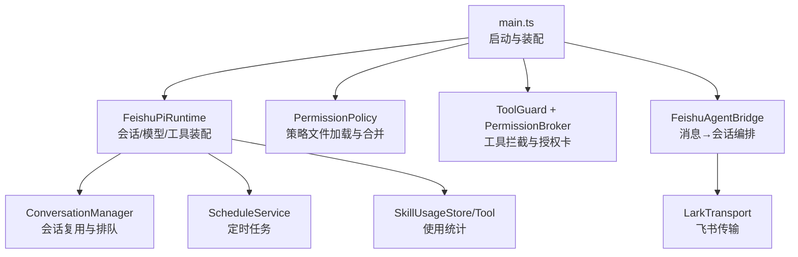
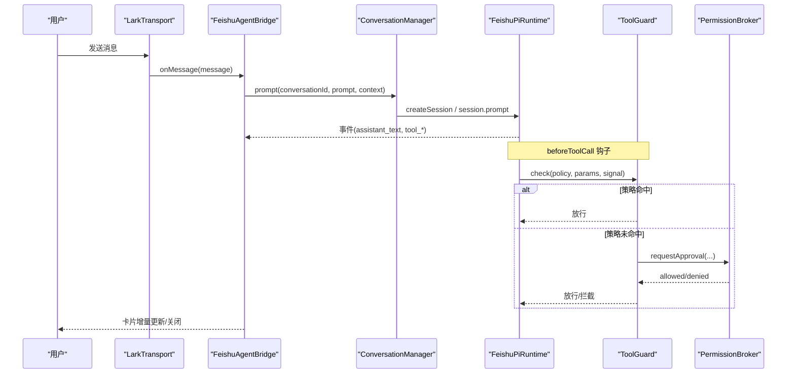
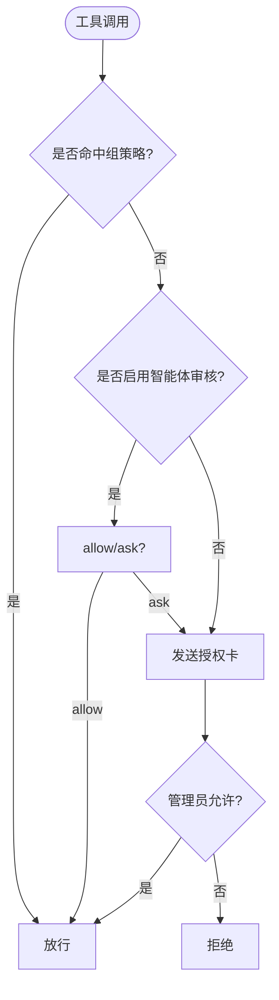
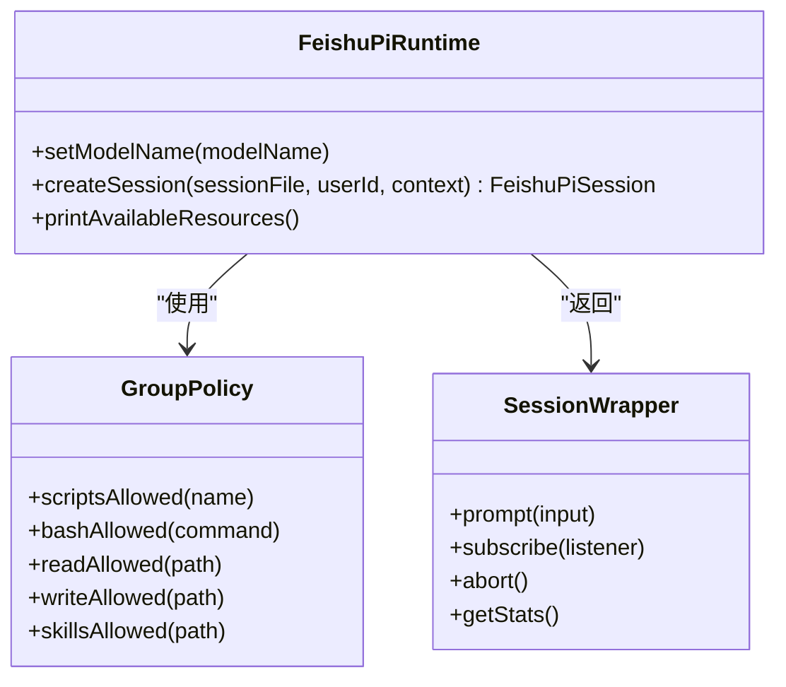
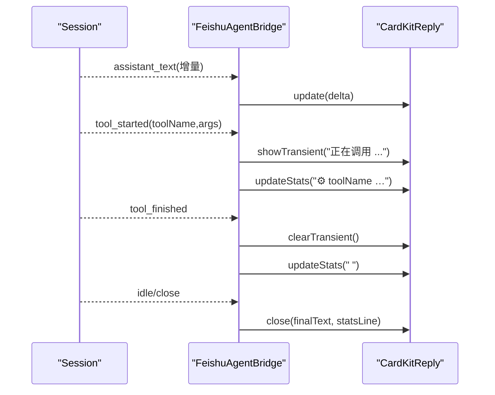
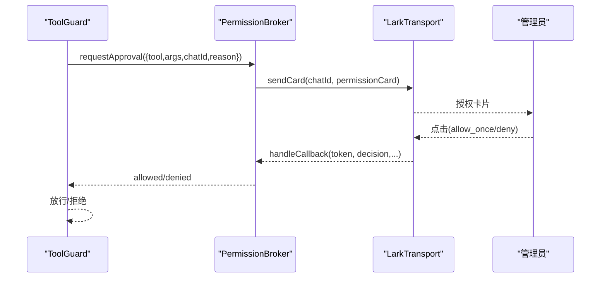
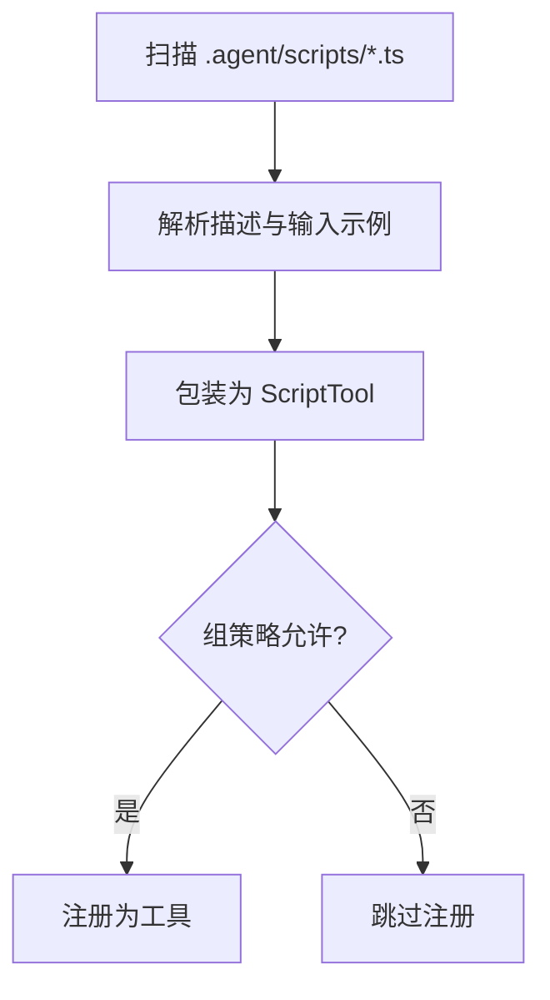
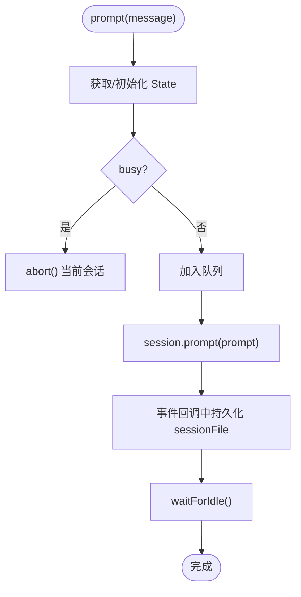
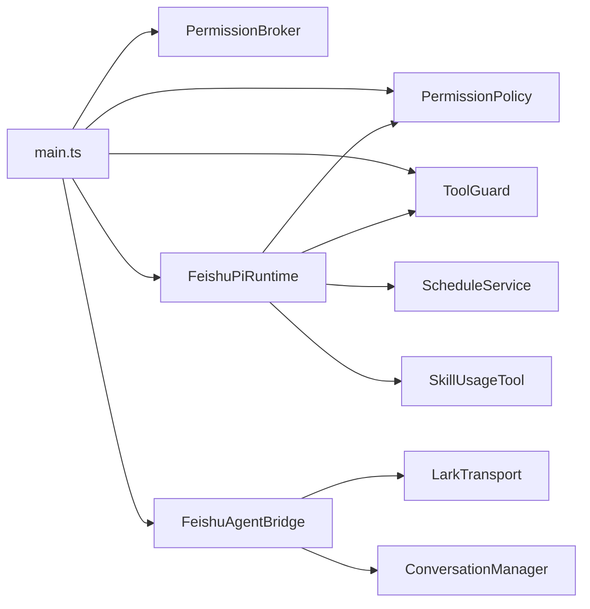

# 架构模式

<cite>
**本文引用的文件**
- [src/main.ts](file://src/main.ts)
- [src/permission/policy.ts](file://src/permission/policy.ts)
- [src/guard/tool-guard.ts](file://src/guard/tool-guard.ts)
- [src/guard/broker.ts](file://src/guard/broker.ts)
- [src/scripts/runner.ts](file://src/scripts/runner.ts)
- [src/tools/registry.ts](file://src/tools/registry.ts)
- [src/runtime/feishu-pi-runtime.ts](file://src/runtime/feishu-pi-runtime.ts)
- [src/runtime/conversation-manager.ts](file://src/runtime/conversation-manager.ts)
- [src/feishu/agent-bridge.ts](file://src/feishu/agent-bridge.ts)
- [src/schedule/service.ts](file://src/schedule/service.ts)
- [src/stats/skill-usage-tool.ts](file://src/stats/skill-usage-tool.ts)
- [src/config.ts](file://src/config.ts)
- [package.json](file://package.json)
</cite>

## 目录
1. [简介](#简介)
2. [项目结构](#项目结构)
3. [核心组件](#核心组件)
4. [架构总览](#架构总览)
5. [详细组件分析](#详细组件分析)
6. [依赖关系分析](#依赖关系分析)
7. [性能考量](#性能考量)
8. [故障排查指南](#故障排查指南)
9. [结论](#结论)
10. [附录：扩展与最佳实践](#附录：扩展与最佳实践)

## 简介
本文件系统性梳理 mini-claw 的架构模式与模块化设计，重点覆盖策略模式（权限控制）、工厂模式（组件创建）、观察者模式（事件处理）、中介者模式（组件通信），并说明插件化架构的实现方式、可扩展性设计与最佳实践。目标是帮助读者在不深入源码的情况下理解系统如何组织职责、如何松耦合地扩展新功能。

## 项目结构
mini-claw 采用分层与按功能域组织的混合结构：
- 入口与装配：main.ts 负责启动、配置加载、组件组装、生命周期管理
- 运行时：runtime 封装会话、模型、工具注册、权限注入
- 权限与守卫：permission 定义策略；guard 实现授权卡与工具调用拦截
- 飞书桥接：feishu 层负责消息收发、卡片交互、指令解析
- 脚本与工具：scripts 提供脚本工具加载器；tools 提供工具注册表
- 调度与统计：schedule 提供定时任务；stats 记录技能使用
- 配置：config.ts 集中读取环境变量

图表来源
- [src/main.ts:27-247](file://src/main.ts#L27-L247)
- [src/runtime/feishu-pi-runtime.ts:81-285](file://src/runtime/feishu-pi-runtime.ts#L81-L285)
- [src/permission/policy.ts:68-158](file://src/permission/policy.ts#L68-L158)
- [src/guard/tool-guard.ts:27-95](file://src/guard/tool-guard.ts#L27-L95)
- [src/guard/broker.ts:46-166](file://src/guard/broker.ts#L46-L166)
- [src/feishu/agent-bridge.ts:16-69](file://src/feishu/agent-bridge.ts#L16-L69)
- [src/runtime/conversation-manager.ts:23-96](file://src/runtime/conversation-manager.ts#L23-L96)
- [src/schedule/service.ts:105-123](file://src/schedule/service.ts#L105-L123)

章节来源
- [src/main.ts:27-247](file://src/main.ts#L27-L247)
- [package.json:1-34](file://package.json#L1-L34)

## 核心组件
- 策略模式（权限控制）：PermissionPolicy 以 .agent/permissions.json 为唯一事实源，按身份组合并策略，提供 scripts/bash/read/write/skills 判定函数，并在运行时通过 ToolGuard 执行“名单内放行、名单外交互授权”的策略。
- 工厂模式（组件创建）：FeishuPiRuntime.createSession 根据用户身份组动态装配工具集（内置工具、脚本工具、统计与调度工具），并注入 beforeToolCall 钩子；同时 SessionWrapper 包装底层 AgentSession，屏蔽差异。
- 观察者模式（事件处理）：FeishuAgentBridge 订阅 FeishuPiSession 的事件流，将 assistant_text、tool_started/updated/finished 等事件转换为 UI 更新（卡片正文、小字统计、工具调用动画）。
- 中介者模式（组件通信）：PermissionBroker 作为授权中枢，协调 ToolGuard、飞书传输与管理员决策，统一处理授权卡发送、回调校验、超时与撤回。

章节来源
- [src/permission/policy.ts:68-158](file://src/permission/policy.ts#L68-L158)
- [src/runtime/feishu-pi-runtime.ts:147-285](file://src/runtime/feishu-pi-runtime.ts#L147-L285)
- [src/feishu/agent-bridge.ts:154-196](file://src/feishu/agent-bridge.ts#L154-L196)
- [src/guard/broker.ts:46-166](file://src/guard/broker.ts#L46-L166)

## 架构总览
整体流程：
- main.ts 加载配置，初始化数据清理、飞书客户端、权限策略、授权中枢、工具守卫、运行时、会话管理器、桥接层与定时任务，最后启动消息监听。
- 入站消息经 FeishuAgentBridge 路由到 ConversationManager，后者维护会话队列与状态，调用 FeishuPiRuntime 创建或恢复会话，并将事件回推至前端卡片。
- 工具调用在 Runtime 的 beforeToolCall 中由 ToolGuard 拦截，先走策略匹配，再走智能体综合判断（可选），最后落到授权卡流程（PermissionBroker）。
- 脚本工具与技能文档通过约定式扫描加载，零元数据、零改造即可扩展能力。

图表来源
- [src/feishu/agent-bridge.ts:72-196](file://src/feishu/agent-bridge.ts#L72-L196)
- [src/runtime/conversation-manager.ts:66-96](file://src/runtime/conversation-manager.ts#L66-L96)
- [src/runtime/feishu-pi-runtime.ts:226-282](file://src/runtime/feishu-pi-runtime.ts#L226-L282)
- [src/guard/tool-guard.ts:36-95](file://src/guard/tool-guard.ts#L36-L95)
- [src/guard/broker.ts:78-166](file://src/guard/broker.ts#L78-L166)

## 详细组件分析

### 策略模式：权限控制（PermissionPolicy + ToolGuard）
- 策略文件：.agent/permissions.json 定义 common、owner 与各用户组的成员与能力范围（scripts、bash、read、write、skills）。
- 组合并：forGroups 将 common 与所属各组字段取并集，并应用保守缺省（无组时仅技能目录可读）。
- 运行时注入：createSession 根据用户身份计算组与策略，过滤脚本工具注册，并在 beforeToolCall 中对 read 路径做 skills/read 判定，对其他工具交由 ToolGuard。
- 工具守卫：ToolGuard.check 三层判定——策略命中放行 → 智能体综合判断（可选）→ 授权卡（PermissionBroker）。

图表来源
- [src/permission/policy.ts:110-158](file://src/permission/policy.ts#L110-L158)
- [src/runtime/feishu-pi-runtime.ts:226-282](file://src/runtime/feishu-pi-runtime.ts#L226-L282)
- [src/guard/tool-guard.ts:36-95](file://src/guard/tool-guard.ts#L36-L95)

章节来源
- [src/permission/policy.ts:68-158](file://src/permission/policy.ts#L68-L158)
- [src/guard/tool-guard.ts:27-95](file://src/guard/tool-guard.ts#L27-L95)
- [src/runtime/feishu-pi-runtime.ts:147-285](file://src/runtime/feishu-pi-runtime.ts#L147-L285)

### 工厂模式：组件创建（FeishuPiRuntime.createSession）
- 输入：sessionFile、userId、context
- 输出：FeishuPiSession（包装后的 AgentSession）
- 行为：
  - 设置 API Key 与环境变量
  - 计算用户身份组与策略
  - 创建 ResourceLoader 并 reload
  - 扫描脚本工具并按组过滤注册
  - 注入统计查询工具与调度工具（负责人可用）
  - 注册内置工具（owner 全量，用户 bash+read）
  - 注入 beforeToolCall 钩子进行权限拦截与统计记录
  - 提前落盘 session_info，确保中断可恢复

图表来源
- [src/runtime/feishu-pi-runtime.ts:81-285](file://src/runtime/feishu-pi-runtime.ts#L81-L285)
- [src/permission/policy.ts:43-57](file://src/permission/policy.ts#L43-L57)

章节来源
- [src/runtime/feishu-pi-runtime.ts:147-285](file://src/runtime/feishu-pi-runtime.ts#L147-L285)

### 观察者模式：事件处理（FeishuAgentBridge 与 Session 事件）
- Bridge 订阅 Session 事件，将 assistant_text 增量推送至卡片正文，将工具事件转为临时/永久展示与小字动画。
- 支持详细/精简两种模式：详细模式保留工具调用历史，精简模式仅临时显示并在结束后清除。
- 首帧立即显示 spinner，真实内容到达后停止动画并清空累积器，避免混入正文。

图表来源
- [src/feishu/agent-bridge.ts:154-220](file://src/feishu/agent-bridge.ts#L154-L220)

章节来源
- [src/feishu/agent-bridge.ts:72-237](file://src/feishu/agent-bridge.ts#L72-L237)

### 中介者模式：组件通信（PermissionBroker）
- 角色：授权中枢，统一管理待授权请求、发送授权卡、处理回调、转发管理员私聊、超时与取消收尾。
- 安全：服务端强制校验 token、卡片来源、操作人是否为管理员，防止伪造回调。
- 体验：精简模式下授权确认后撤回卡片，减少会话占用；详细模式更新结果卡。

图表来源
- [src/guard/broker.ts:78-166](file://src/guard/broker.ts#L78-L166)
- [src/guard/tool-guard.ts:80-95](file://src/guard/tool-guard.ts#L80-L95)

章节来源
- [src/guard/broker.ts:46-166](file://src/guard/broker.ts#L46-L166)
- [src/guard/tool-guard.ts:27-95](file://src/guard/tool-guard.ts#L27-L95)

### 插件化架构：脚本工具与技能文档
- 脚本工具：.agent/scripts/*.ts 每个文件即一个工具，约定顶部注释声明 description/input，文件名即工具名，通过 runner.ts 扫描并包装为可注册工具。
- 技能文档：.agent/skills/** 等目录下的 Markdown 被 Pi 资源加载器自动发现，对所有用户开放（只读说明，不暴露能力）。
- 注册与过滤：脚本工具按组策略 scripts 名单注册；技能可见性由 skills glob 控制。

图表来源
- [src/scripts/runner.ts:32-59](file://src/scripts/runner.ts#L32-L59)
- [src/runtime/feishu-pi-runtime.ts:170-186](file://src/runtime/feishu-pi-runtime.ts#L170-L186)

章节来源
- [src/scripts/runner.ts:6-96](file://src/scripts/runner.ts#L6-L96)
- [src/runtime/feishu-pi-runtime.ts:118-145](file://src/runtime/feishu-pi-runtime.ts#L118-L145)

### 会话管理与并发控制（ConversationManager）
- 会话复用：按 conversationId 缓存 Promise<State>，合并首次初始化。
- 顺序执行：同一会话内消息串行排队，新消息到达时可打断在途响应。
- 持久化：首个 message_end 落盘后立即同步映射，崩溃/中断可恢复。

图表来源
- [src/runtime/conversation-manager.ts:66-96](file://src/runtime/conversation-manager.ts#L66-L96)

章节来源
- [src/runtime/conversation-manager.ts:23-119](file://src/runtime/conversation-manager.ts#L23-L119)

### 定时任务（ScheduleService）
- 持久化：data/schedules.json，原子写入（tmp + rename）。
- 调度：croner 驱动，服务启动恢复已启用任务。
- 执行：runTask 注入，复用会话链路与飞书传输，结果以卡片推送。

章节来源
- [src/schedule/service.ts:105-238](file://src/schedule/service.ts#L105-L238)

### 技能使用统计（SkillUsageTool）
- 记录：在 read 命中技能文件时记录事件（不影响拦截逻辑）。
- 查询：提供 query_skill_usage 工具，按近 7 天统计、排行、个人使用汇总。

章节来源
- [src/stats/skill-usage-tool.ts:46-99](file://src/stats/skill-usage-tool.ts#L46-L99)
- [src/runtime/feishu-pi-runtime.ts:250-258](file://src/runtime/feishu-pi-runtime.ts#L250-L258)

## 依赖关系分析
- main.ts 作为装配中心，依赖 config、各子系统实例，并通过构造函数注入协作对象（如 PermissionPolicy、ToolGuard、PermissionBroker、ScheduleService）。
- runtime 依赖策略与工具守卫，但不直接感知外部协议；bridge 依赖 transport 与 conversation manager，屏蔽具体传输细节。
- guard 层解耦了策略与授权流程，broker 仅关注授权生命周期，judge 可插拔（可选）。
- schedule 与 stats 通过接口注入到 runtime，降低耦合度。

图表来源
- [src/main.ts:27-247](file://src/main.ts#L27-L247)
- [src/runtime/feishu-pi-runtime.ts:81-285](file://src/runtime/feishu-pi-runtime.ts#L81-L285)
- [src/feishu/agent-bridge.ts:16-69](file://src/feishu/agent-bridge.ts#L16-L69)

章节来源
- [src/main.ts:27-247](file://src/main.ts#L27-L247)
- [src/runtime/feishu-pi-runtime.ts:81-285](file://src/runtime/feishu-pi-runtime.ts#L81-L285)

## 性能考量
- 会话级串行与打断：ConversationManager 保证同一会话内消息有序，新消息可打断旧响应，避免堆积。
- 事件驱动的 UI 更新：Bridge 使用增量更新与临时展示，减少卡片刷新开销。
- 策略热重载：PermissionPolicy 基于 mtime 热重载策略文件，无需重启服务。
- 异步与超时：脚本工具执行带超时与输出截断；授权卡有超时处理，避免阻塞。
- 存储原子写：ScheduleStore 使用 tmp + rename 保证一致性。

[本节为通用指导，不直接分析具体文件]

## 故障排查指南
- 策略文件解析失败：PermissionPolicy 会按保守默认处理并记录告警，检查 .agent/permissions.json 语法与字段类型。
- 无法发送授权卡：ToolGuard 在无 chatId 时会拒绝；确认上下文传递与传输层可用性。
- 会话中断导致旧授权卡失效：Broker.handleCallback 会检测不存在或 token 不匹配，并提示重新发起任务。
- 脚本执行失败：runner 捕获 stderr 并限制输出长度，检查脚本描述与参数格式。
- 定时任务无效：ScheduleService 会校验 cron 表达式并记录错误，检查表达式与任务状态。

章节来源
- [src/permission/policy.ts:178-210](file://src/permission/policy.ts#L178-L210)
- [src/guard/tool-guard.ts:80-95](file://src/guard/tool-guard.ts#L80-L95)
- [src/guard/broker.ts:131-166](file://src/guard/broker.ts#L131-L166)
- [src/scripts/runner.ts:62-79](file://src/scripts/runner.ts#L62-L79)
- [src/schedule/service.ts:131-150](file://src/schedule/service.ts#L131-L150)

## 结论
mini-claw 通过清晰的职责分离与松耦合设计，将权限策略、工具守卫、会话编排、消息桥接、定时任务与统计模块有机组合。策略模式确保能力边界清晰可控；工厂模式简化了复杂对象的创建与装配；观察者模式实现了流畅的用户体验；中介者模式统一了跨组件的授权流程。插件化架构使得新增脚本工具与技能文档几乎零成本，且不影响现有系统稳定性。

## 附录：扩展与最佳实践

### 添加新的脚本工具
- 在 .agent/scripts/ 下新增 .ts 文件，顶部注释声明 description 与 input 示例。
- 在 .agent/permissions.json 对应组的 scripts 列表中添加文件名（去扩展名）。
- 重启服务或等待策略热重载后即可在会话中注册并使用。

章节来源
- [src/scripts/runner.ts:6-18](file://src/scripts/runner.ts#L6-L18)
- [src/scripts/runner.ts:32-59](file://src/scripts/runner.ts#L32-L59)
- [src/permission/policy.ts:110-158](file://src/permission/policy.ts#L110-L158)

### 添加新的技能文档
- 在 .agent/skills/** 或 .pi/skills/**、.agents/skills/** 下新增 Markdown 文件。
- 技能对所有人可见；如需限制可见范围，调整策略文件的 skills glob。

章节来源
- [src/permission/policy.ts:59-63](file://src/permission/policy.ts#L59-L63)
- [src/runtime/feishu-pi-runtime.ts:118-145](file://src/runtime/feishu-pi-runtime.ts#L118-L145)

### 扩展权限策略
- 新增用户组或在 common/owner 中调整 scripts、bash、read、write、skills。
- 注意 bash 命令中的 shell 元字符会被拦截，避免逃逸风险。

章节来源
- [src/permission/policy.ts:18-31](file://src/permission/policy.ts#L18-L31)
- [src/permission/policy.ts:146-152](file://src/permission/policy.ts#L146-L152)

### 启用智能体审核（可选）
- 配置 guardBaseUrl、guardModels、guardApiKey、guardTimeoutMs。
- 未命中策略的工具将交由智能体综合判断，allow 放行，ask 转授权卡。

章节来源
- [src/config.ts:13-21](file://src/config.ts#L13-L21)
- [src/guard/tool-guard.ts:57-67](file://src/guard/tool-guard.ts#L57-L67)

### 自定义工具与风险标记
- 自定义工具可通过 risk: "high" 标记，绕过策略放行，始终走授权卡流程。
- 适用于高风险操作，确保管理员二次确认。

章节来源
- [src/runtime/feishu-pi-runtime.ts:199-202](file://src/runtime/feishu-pi-runtime.ts#L199-L202)

### 会话与消息可靠性
- 会话文件提前落盘，崩溃后可恢复。
- 消息状态追踪（claim/complete/fail）避免重复处理。

章节来源
- [src/runtime/feishu-pi-runtime.ts:218-224](file://src/runtime/feishu-pi-runtime.ts#L218-L224)
- [src/feishu/agent-bridge.ts:72-84](file://src/feishu/agent-bridge.ts#L72-L84)