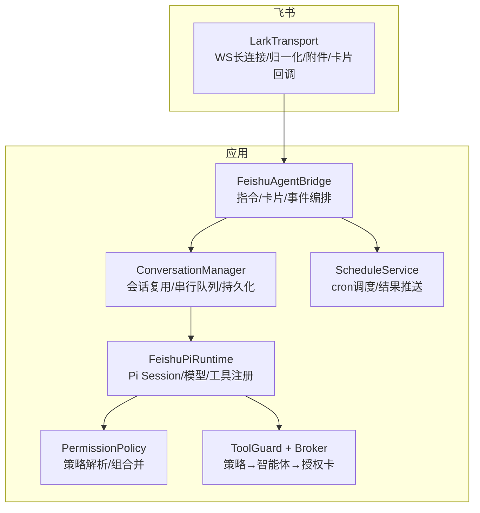
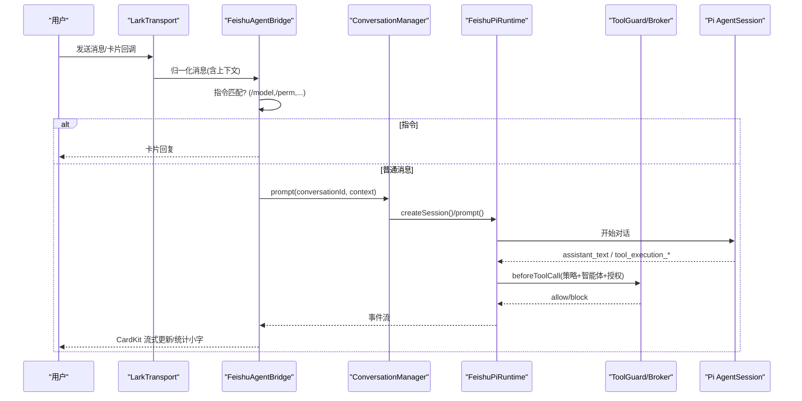
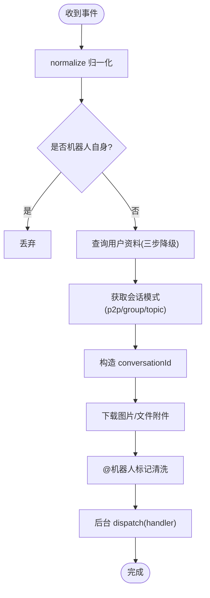
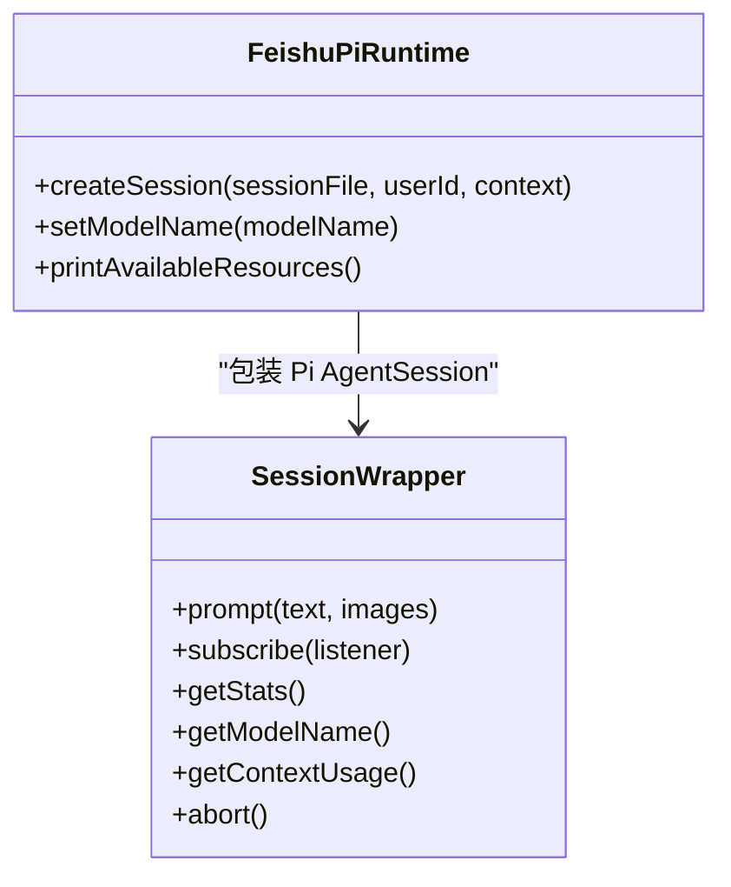
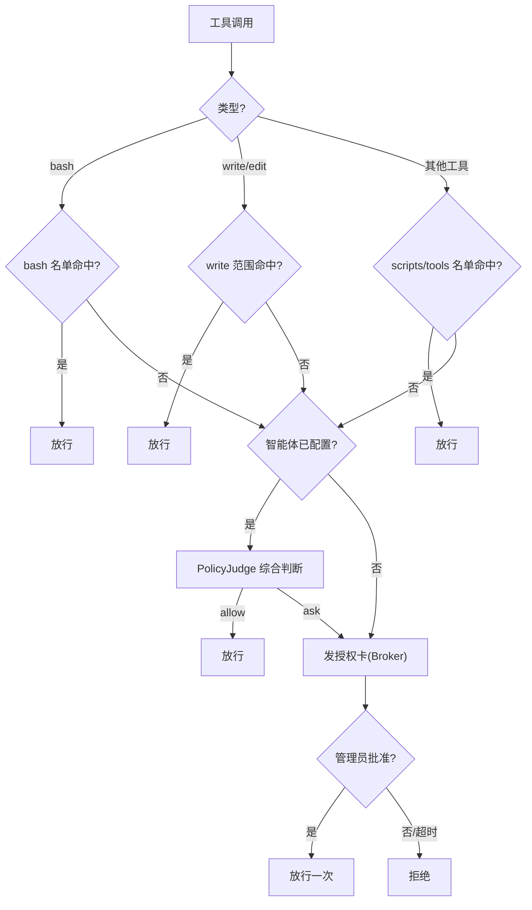
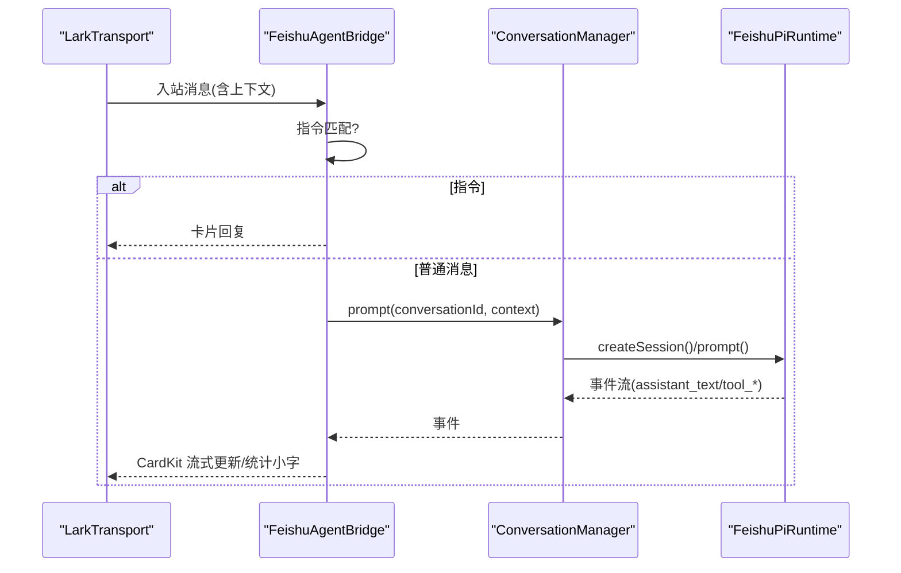
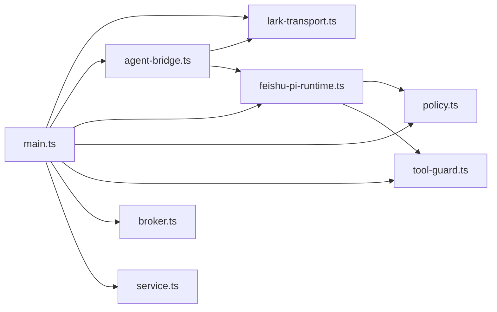
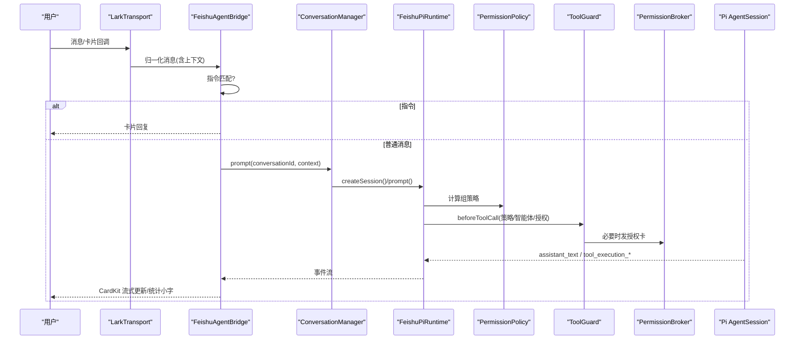
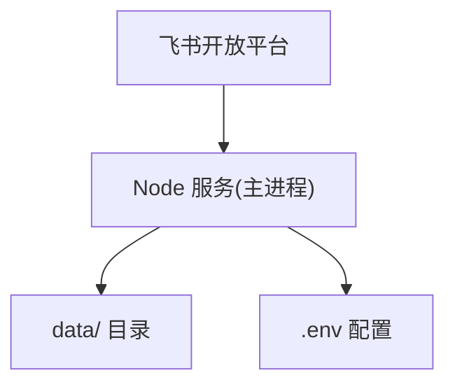

# 架构设计

<cite>
**本文引用的文件**   
- [README.md](file://README.md)
- [package.json](file://package.json)
- [src/main.ts](file://src/main.ts)
- [docs/architecture.md](file://docs/architecture.md)
- [src/config.ts](file://src/config.ts)
- [src/feishu/lark-transport.ts](file://src/feishu/lark-transport.ts)
- [src/runtime/feishu-pi-runtime.ts](file://src/runtime/feishu-pi-runtime.ts)
- [src/guard/broker.ts](file://src/guard/broker.ts)
- [src/permission/policy.ts](file://src/permission/policy.ts)
- [src/context/types.ts](file://src/context/types.ts)
- [src/feishu/agent-bridge.ts](file://src/feishu/agent-bridge.ts)
- [src/runtime/conversation-manager.ts](file://src/runtime/conversation-manager.ts)
- [src/guard/tool-guard.ts](file://src/guard/tool-guard.ts)
- [src/schedule/service.ts](file://src/schedule/service.ts)
</cite>

## 目录
1. [引言](#引言)
2. [项目结构](#项目结构)
3. [核心组件](#核心组件)
4. [架构总览](#架构总览)
5. [详细组件分析](#详细组件分析)
6. [依赖关系分析](#依赖关系分析)
7. [性能与可扩展性](#性能与可扩展性)
8. [故障排查指南](#故障排查指南)
9. [结论](#结论)
10. [附录：数据流与部署拓扑](#附录数据流与部署拓扑)

## 引言
本设计文档面向 mini-claw（即 feishu-pi）项目的系统架构，聚焦飞书集成层、智能体运行时、权限控制系统等关键模块的职责与交互方式。文档从分层视角解释技术选型、架构模式与设计原则，并给出系统边界、组件依赖关系图与关键数据流图，帮助开发者快速建立整体视图。

## 项目结构
mini-claw 采用“传输层—会话层—权限/Guard—Agent 运行时—回复层”的分层组织，围绕 Pi Agent 运行时进行能力拼装与扩展：
- 传输层：基于飞书官方 SDK 的底层 WSClient + EventDispatcher，负责消息归一化、用户资料查询、附件下载、卡片回调路由。
- 会话层：按 conversationId 复用 Pi Session，支持私聊/群聊/话题群的隔离与共享策略，增量持久化映射。
- 权限与 Guard：统一策略文件驱动两档身份（负责人/用户），工具调用前经策略判定、智能体综合判断、授权卡确认三层闸门。
- Agent 运行时：通过 Pi 公开 SDK 创建 AgentSession，注入资源加载、工具注册、beforeToolCall 钩子。
- 回复层：CardKit 2.0 流式卡片、思考动画、统计小字、指令处理。

图表来源
- [src/feishu/lark-transport.ts:82-133](file://src/feishu/lark-transport.ts#L82-L133)
- [src/feishu/agent-bridge.ts:66-196](file://src/feishu/agent-bridge.ts#L66-L196)
- [src/runtime/conversation-manager.ts:33-95](file://src/runtime/conversation-manager.ts#L33-L95)
- [src/runtime/feishu-pi-runtime.ts:147-284](file://src/runtime/feishu-pi-runtime.ts#L147-L284)
- [src/permission/policy.ts:86-157](file://src/permission/policy.ts#L86-L157)
- [src/guard/tool-guard.ts:36-95](file://src/guard/tool-guard.ts#L36-L95)
- [src/schedule/service.ts:116-149](file://src/schedule/service.ts#L116-L149)

章节来源
- [docs/architecture.md:19-33](file://docs/architecture.md#L19-L33)
- [src/main.ts:27-247](file://src/main.ts#L27-L247)

## 核心组件
- 飞书传输层（LarkTransport）：建立 WS 长连接、消息归一化、用户资料查询与缓存、图片/文件附件下载、卡片回调路由（授权卡、模型切换）。
- 会话管理器（ConversationManager）：按 conversationId 复用 Pi Session，保证同一会话串行执行，新消息可中断在途请求；增量持久化 sessionFile 映射。
- 智能体运行时（FeishuPiRuntime）：创建/恢复 Pi Session，加载技能与脚本工具，按组策略注册内置工具，注入 beforeToolCall 钩子实现 read 范围与 ToolGuard 判定。
- 权限策略（PermissionPolicy）：解析 .agent/permissions.json，计算 common ∪ 所属组的生效范围，提供 bash/read/write/scripts/skills 判定函数。
- 工具调用 Guard（ToolGuard + PermissionBroker）：策略命中免审放行；未命中走智能体综合判断；仍不确定则发授权卡由管理员单次确认；支持转发到管理员私聊。
- 定时任务（ScheduleService）：持久化 cron 任务，启动时恢复调度，触发时以创建者身份运行智能体并将结果卡片推回目标会话。
- 配置与启动（main.ts / config.ts）：加载环境变量、初始化各组件、注册授权回调、优雅退出。

章节来源
- [src/feishu/lark-transport.ts:141-247](file://src/feishu/lark-transport.ts#L141-L247)
- [src/runtime/conversation-manager.ts:33-95](file://src/runtime/conversation-manager.ts#L33-L95)
- [src/runtime/feishu-pi-runtime.ts:147-284](file://src/runtime/feishu-pi-runtime.ts#L147-L284)
- [src/permission/policy.ts:86-157](file://src/permission/policy.ts#L86-L157)
- [src/guard/tool-guard.ts:36-95](file://src/guard/tool-guard.ts#L36-L95)
- [src/guard/broker.ts:78-165](file://src/guard/broker.ts#L78-L165)
- [src/schedule/service.ts:116-149](file://src/schedule/service.ts#L116-L149)
- [src/config.ts:24-50](file://src/config.ts#L24-L50)
- [src/main.ts:27-247](file://src/main.ts#L27-L247)

## 架构总览
系统遵循“低耦合、高内聚”的分层架构：
- 传输层屏蔽飞书差异，向上提供统一入站消息与卡片回调。
- 会话层抽象出“会话键”与“串行队列”，对上层暴露 prompt/abort/getStats。
- 权限层将“静态策略”和“动态审核”解耦，策略文件零侵入，工具零改造。
- 运行时仅关注 Agent 生命周期与事件映射，不感知飞书细节。
- 回复层专注 CardKit 流式体验与指令处理。

图表来源
- [src/feishu/lark-transport.ts:82-133](file://src/feishu/lark-transport.ts#L82-L133)
- [src/feishu/agent-bridge.ts:72-196](file://src/feishu/agent-bridge.ts#L72-L196)
- [src/runtime/conversation-manager.ts:66-95](file://src/runtime/conversation-manager.ts#L66-L95)
- [src/runtime/feishu-pi-runtime.ts:209-284](file://src/runtime/feishu-pi-runtime.ts#L209-L284)
- [src/guard/tool-guard.ts:36-95](file://src/guard/tool-guard.ts#L36-L95)

## 详细组件分析

### 飞书集成层（LarkTransport）
职责
- 使用官方底层 WSClient + EventDispatcher 建立长连接，避免高层封装的 ACK 丢弃与去重吞事件问题。
- 消息管线：过滤机器人自身消息、查询用户资料（三步降级）、构造 conversationId、下载图片/文件附件、清洗 @机器人 标记、fire-and-forget 交给上层 handler。
- 卡片回调路由：授权卡转交 PermissionBroker；模型切换按钮校验管理员后写回 .env 并触发热切换。
- 会话模式缓存：p2p/group/topic，影响会话隔离策略。

关键点
- 话题根收敛：首条无 threadId 的消息作为话题根并持久化，后续消息自然收敛。
- 附件下载：image/file/audio/video/media 落盘并追加路径提示，供 Agent 直接 read/bash 访问。
- 超时与重连：握手 15s、ping 30s，SDK 自动重连。

图表来源
- [src/feishu/lark-transport.ts:82-133](file://src/feishu/lark-transport.ts#L82-L133)
- [src/feishu/lark-transport.ts:141-247](file://src/feishu/lark-transport.ts#L141-L247)
- [src/feishu/lark-transport.ts:314-338](file://src/feishu/lark-transport.ts#L314-L338)

章节来源
- [src/feishu/lark-transport.ts:82-133](file://src/feishu/lark-transport.ts#L82-L133)
- [src/feishu/lark-transport.ts:141-247](file://src/feishu/lark-transport.ts#L141-L247)
- [src/feishu/lark-transport.ts:250-312](file://src/feishu/lark-transport.ts#L250-L312)
- [src/feishu/lark-transport.ts:314-338](file://src/feishu/lark-transport.ts#L314-L338)

### 智能体运行时（FeishuPiRuntime）
职责
- 创建/恢复 Pi Session，加载 DefaultResourceLoader（技能全量开放）。
- 按组策略注册脚本工具与内置工具（owner 全量，user 仅 bash/read）。
- 注入 beforeToolCall 钩子：read 先判 skills/read 范围，其余走 ToolGuard；范围内读取记录技能使用事件。
- 支持运行时切换模型（新会话生效）。

关键点
- 会话头提前写入：首个 message_end 之前即写入 session_info，确保中断/崩溃后可恢复。
- 工具风险标记：自定义工具可标 risk:"high"，强制走授权卡。

图表来源
- [src/runtime/feishu-pi-runtime.ts:16-74](file://src/runtime/feishu-pi-runtime.ts#L16-L74)
- [src/runtime/feishu-pi-runtime.ts:147-284](file://src/runtime/feishu-pi-runtime.ts#L147-L284)

章节来源
- [src/runtime/feishu-pi-runtime.ts:147-284](file://src/runtime/feishu-pi-runtime.ts#L147-L284)

### 权限控制系统（PermissionPolicy + ToolGuard + Broker）
职责
- 策略文件：.agent/permissions.json 定义 common/owner/user 等组的能力（scripts/bash/read/write/skills），mtime 热重载。
- 会话级策略编译：common ∪ 所属组并集，空缺省保守处理。
- 工具调用 Guard：策略命中免审放行；未命中走智能体综合判断；仍不确定发授权卡；支持转发到管理员私聊。
- 授权卡服务端校验：唯一 approvalId + token，点击者必须为管理员，跨会话转发无效，单次有效。

关键点
- read 范围外直接拦截（能力问题不问人），bash 命令含 shell 元字符不参与前缀匹配（防逃逸）。
- 敏感参数脱敏展示，命令长度限制。

图表来源
- [src/permission/policy.ts:86-157](file://src/permission/policy.ts#L86-L157)
- [src/guard/tool-guard.ts:36-95](file://src/guard/tool-guard.ts#L36-L95)
- [src/guard/broker.ts:78-165](file://src/guard/broker.ts#L78-L165)

章节来源
- [src/permission/policy.ts:86-157](file://src/permission/policy.ts#L86-L157)
- [src/guard/tool-guard.ts:36-95](file://src/guard/tool-guard.ts#L36-L95)
- [src/guard/broker.ts:78-165](file://src/guard/broker.ts#L78-L165)

### 会话与回复层（ConversationManager + FeishuAgentBridge）
职责
- ConversationManager：按 conversationId 复用 Pi Session，串行队列，新消息打断在途请求；增量持久化 sessionFile 映射。
- FeishuAgentBridge：指令处理（/model /perm /help /new /stop /detail），CardKit 流式卡片、随机表情反应、统计小字、详细/精简模式。

关键点
- 话题内禁止 /new（共享会话不允许单人清空）。
- 详细模式下工具调用永久保留在正文；精简模式临时显示并在结束后清除。

图表来源
- [src/feishu/agent-bridge.ts:72-196](file://src/feishu/agent-bridge.ts#L72-L196)
- [src/runtime/conversation-manager.ts:33-95](file://src/runtime/conversation-manager.ts#L33-L95)

章节来源
- [src/feishu/agent-bridge.ts:72-196](file://src/feishu/agent-bridge.ts#L72-L196)
- [src/runtime/conversation-manager.ts:33-95](file://src/runtime/conversation-manager.ts#L33-L95)

### 定时任务（ScheduleService）
职责
- 持久化 cron 任务，服务启动恢复调度；触发时以创建者身份运行智能体，结果卡片推回目标会话；失败记录 lastStatus。

关键点
- 任务独立会话：{创建人}-schedule:{任务ID}，避免干扰用户会话。
- 原子写入：JSON 文件 tmp + rename 保证一致性。

章节来源
- [src/schedule/service.ts:116-149](file://src/schedule/service.ts#L116-L149)
- [src/schedule/service.ts:212-235](file://src/schedule/service.ts#L212-L235)

## 依赖关系分析
- 外部依赖
  - 飞书 Node SDK：底层 WSClient + EventDispatcher 用于长连接与事件分发。
  - Pi Agent 生态：pi-coding-agent、pi-ai、pi-agent-core，提供 Session、模型适配、工具循环与编码工具。
  - Express/Croner/Dotenv：配置页、定时任务、环境变量。
- 内部依赖
  - main.ts 组装所有组件，注册授权回调、启动传输层与调度服务。
  - 运行时依赖策略与 Guard，传输层依赖会话与用户资料缓存。
  - 回复层依赖会话管理与传输层 API。

图表来源
- [src/main.ts:27-247](file://src/main.ts#L27-L247)
- [src/feishu/lark-transport.ts:82-133](file://src/feishu/lark-transport.ts#L82-L133)
- [src/feishu/agent-bridge.ts:66-196](file://src/feishu/agent-bridge.ts#L66-L196)
- [src/runtime/feishu-pi-runtime.ts:147-284](file://src/runtime/feishu-pi-runtime.ts#L147-L284)
- [src/permission/policy.ts:86-157](file://src/permission/policy.ts#L86-L157)
- [src/guard/tool-guard.ts:36-95](file://src/guard/tool-guard.ts#L36-L95)
- [src/guard/broker.ts:78-165](file://src/guard/broker.ts#L78-L165)
- [src/schedule/service.ts:116-149](file://src/schedule/service.ts#L116-L149)

章节来源
- [package.json:14-23](file://package.json#L14-L23)
- [src/main.ts:27-247](file://src/main.ts#L27-L247)

## 性能与可扩展性
- 性能优化
  - 传输层：WS 长连接、SDK 自动重连；消息处理 fire-and-forget，避免阻塞事件循环。
  - 会话层：Promise 队列串行，新消息 abort 在途请求，减少冗余计算。
  - 用户资料：三级查询 + TTL 缓存（空档案 1 天、有档案 3 天），降低 API 调用。
  - 卡片流式：CardKit 2.0 节流 800ms、写队列串行，避免频繁网络抖动。
  - 数据清理：DataCleaner 定期清理过期会话、图片、消息，控制磁盘增长。
- 可扩展性
  - 策略文件驱动权限，新增角色/规则无需改代码。
  - 工具注册与技能加载解耦，新增脚本工具或技能无需改动运行时。
  - 定时任务可插拔 runTask，便于接入更多业务场景。
  - 传输层与回复层接口清晰，便于替换或扩展其他渠道。

[本节为通用指导，不直接分析具体文件]

## 故障排查指南
- 常见问题定位
  - 卡片回调无响应：检查 card.action.trigger 处理器是否正确返回 toast，避免 ACK 缺失。
  - 授权卡失效：确认 approvalId/token 一致、点击者为管理员、卡片来源匹配；服务重启后旧卡会失效。
  - 会话丢失：检查 conversations.json 映射是否写入；若打开失败，会话层会新建会话。
  - 附件下载失败：检查 filesCacheDir 权限与网络；日志中查看 downloadResource 错误。
  - 模型切换失败：确认管理员权限、.env 写入成功、运行时 setModelName 被调用。
- 日志与观测
  - 传输层：WS 连接状态、消息归一化/分发错误。
  - 权限层：策略文件解析失败告警、bash 命令逃逸检测。
  - 运行时：工具调用 Guard 异常、技能使用记录失败。
  - 定时任务：cron 表达式无效、执行失败记录 lastError。

章节来源
- [src/feishu/lark-transport.ts:250-312](file://src/feishu/lark-transport.ts#L250-L312)
- [src/guard/broker.ts:131-165](file://src/guard/broker.ts#L131-L165)
- [src/runtime/conversation-manager.ts:43-62](file://src/runtime/conversation-manager.ts#L43-L62)
- [src/permission/policy.ts:178-210](file://src/permission/policy.ts#L178-L210)
- [src/schedule/service.ts:191-235](file://src/schedule/service.ts#L191-L235)

## 结论
mini-claw 以 Pi 为运行时底座，围绕飞书渠道构建轻量、可控、可审计的 Agent 平台。通过分层架构与策略驱动的权限体系，实现了“工具零改造、技能零侵入”的安全边界；借助 CardKit 流式卡片与精细化会话管理，提供了良好的用户体验。未来可按业务需要逐步接入长期记忆与飞书业务能力，保持最小必要复杂度。

[本节为总结，不直接分析具体文件]

## 附录：数据流与部署拓扑

### 一条消息的端到端数据流

图表来源
- [src/feishu/lark-transport.ts:82-133](file://src/feishu/lark-transport.ts#L82-L133)
- [src/feishu/agent-bridge.ts:72-196](file://src/feishu/agent-bridge.ts#L72-L196)
- [src/runtime/conversation-manager.ts:66-95](file://src/runtime/conversation-manager.ts#L66-L95)
- [src/runtime/feishu-pi-runtime.ts:209-284](file://src/runtime/feishu-pi-runtime.ts#L209-L284)
- [src/permission/policy.ts:86-157](file://src/permission/policy.ts#L86-L157)
- [src/guard/tool-guard.ts:36-95](file://src/guard/tool-guard.ts#L36-L95)
- [src/guard/broker.ts:78-165](file://src/guard/broker.ts#L78-L165)

### 部署拓扑
- 单进程 Node.js 服务，绑定本地配置页（127.0.0.1:3456）。
- 通过飞书 WS 长连接接收事件与卡片回调。
- 数据持久化于 data/ 目录（会话、消息、图片、用户缓存、统计、定时任务）。
- 建议以低权限账号运行，工作目录隔离；凭据通过环境变量注入。

图表来源
- [src/main.ts:27-247](file://src/main.ts#L27-L247)
- [src/config.ts:24-50](file://src/config.ts#L24-L50)

章节来源
- [README.md:120-250](file://README.md#L120-L250)
- [docs/architecture.md:177-195](file://docs/architecture.md#L177-L195)