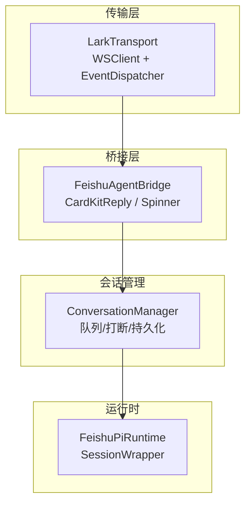
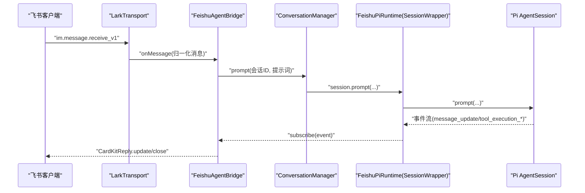
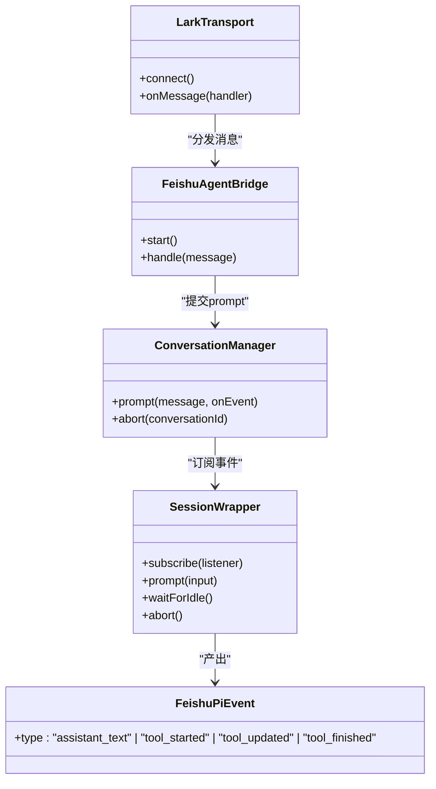
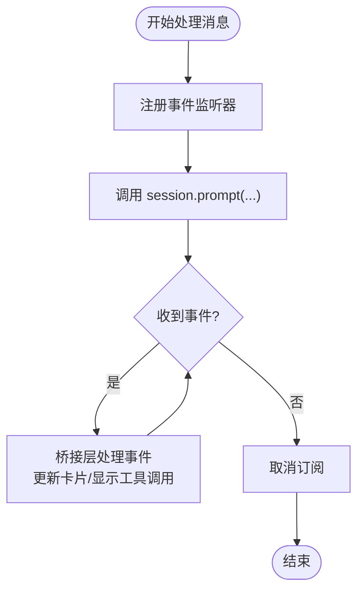
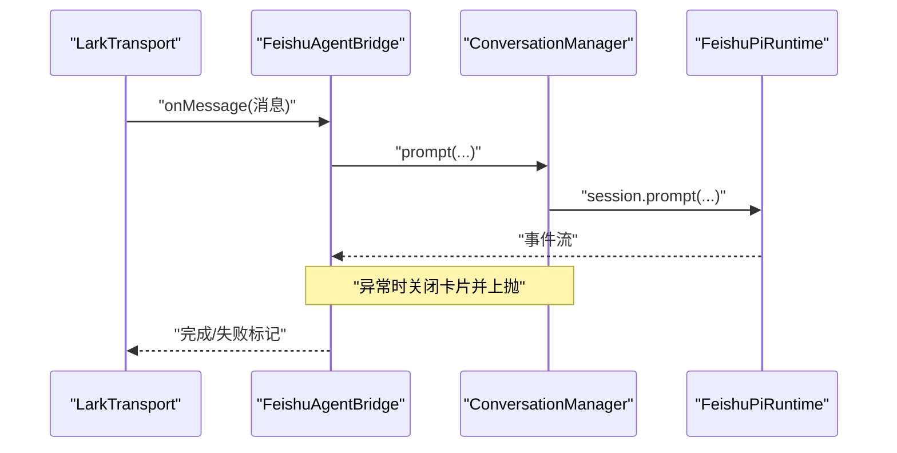
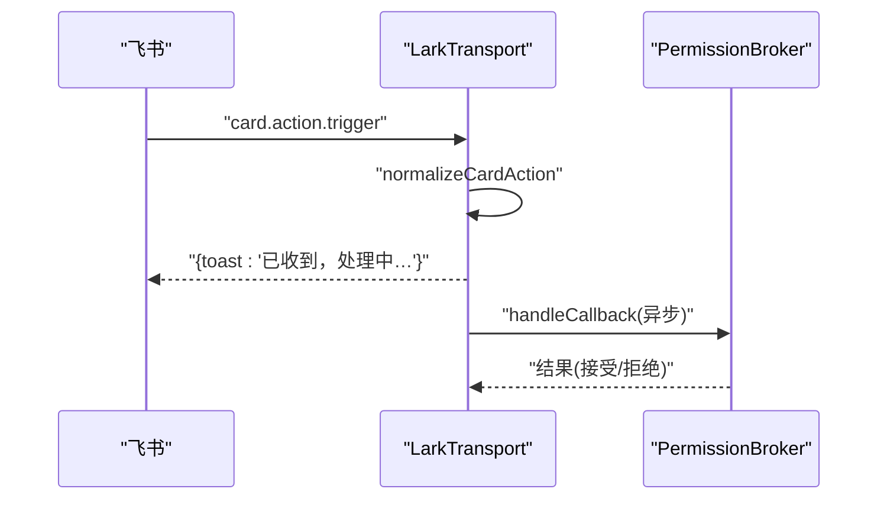
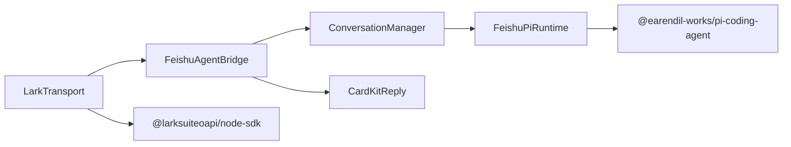

# 事件系统

<cite>
**本文引用的文件**
- [src/main.ts](file://src/main.ts)
- [src/feishu/lark-transport.ts](file://src/feishu/lark-transport.ts)
- [src/feishu/agent-bridge.ts](file://src/feishu/agent-bridge.ts)
- [src/runtime/conversation-manager.ts](file://src/runtime/conversation-manager.ts)
- [src/runtime/feishu-pi-runtime.ts](file://src/runtime/feishu-pi-runtime.ts)
- [src/runtime/types.ts](file://src/runtime/types.ts)
- [src/feishu/types.ts](file://src/feishu/types.ts)
- [src/feishu/message-store.ts](file://src/feishu/message-store.ts)
- [src/utils/logger.ts](file://src/utils/logger.ts)
- [test/agent-events.test.ts](file://test/agent-events.test.ts)
- [docs/issue-draft-node-sdk-card-callback.md](file://docs/issue-draft-node-sdk-card-callback.md)
</cite>

## 目录
1. [简介](#简介)
2. [项目结构](#项目结构)
3. [核心组件](#核心组件)
4. [架构总览](#架构总览)
5. [详细组件分析](#详细组件分析)
6. [依赖关系分析](#依赖关系分析)
7. [性能与背压](#性能与背压)
8. [故障排查指南](#故障排查指南)
9. [结论](#结论)
10. [附录：扩展指南](#附录：扩展指南)

## 简介
本文件系统性梳理本项目的事件系统，重点说明基于事件的异步处理机制、发布订阅模式在系统中的实现、事件类型（消息事件、工具执行事件、会话状态事件等）、监听器的注册/触发/销毁、事件流管道与错误传播、调试与日志记录、性能监控，以及优先级、批量处理与背压控制的实现细节。同时提供自定义事件类型与事件处理器的扩展指南，帮助开发者安全地扩展事件能力。

## 项目结构
事件系统贯穿“传输层 → 桥接层 → 会话管理 → 运行时”的链路：
- 传输层负责接入飞书 WebSocket，归一化消息与卡片回调，并转发给上层。
- 桥接层将入站消息转换为 Pi 会话请求，订阅会话事件并渲染到卡片。
- 会话管理层保证同一会话顺序执行、支持打断与中断。
- 运行时封装底层 AgentSession，将内部事件标准化为统一事件模型。

图表来源
- [src/feishu/lark-transport.ts:82-133](file://src/feishu/lark-transport.ts#L82-L133)
- [src/feishu/agent-bridge.ts:66-196](file://src/feishu/agent-bridge.ts#L66-L196)
- [src/runtime/conversation-manager.ts:65-96](file://src/runtime/conversation-manager.ts#L65-L96)
- [src/runtime/feishu-pi-runtime.ts:16-74](file://src/runtime/feishu-pi-runtime.ts#L16-L74)

章节来源
- [src/main.ts:93-247](file://src/main.ts#L93-L247)
- [src/feishu/lark-transport.ts:82-133](file://src/feishu/lark-transport.ts#L82-L133)
- [src/feishu/agent-bridge.ts:66-196](file://src/feishu/agent-bridge.ts#L66-L196)
- [src/runtime/conversation-manager.ts:65-96](file://src/runtime/conversation-manager.ts#L65-L96)
- [src/runtime/feishu-pi-runtime.ts:16-74](file://src/runtime/feishu-pi-runtime.ts#L16-L74)

## 核心组件
- LarkTransport：基于 WSClient + EventDispatcher 接收飞书消息与卡片回调，归一化后交给桥接层；对卡片回调返回 ACK 数据体，避免客户端超时提示。
- FeishuAgentBridge：订阅会话事件，驱动 CardKitReply 进行流式更新；维护精简/详细模式，展示工具调用动画与统计信息。
- ConversationManager：按会话维度排队执行 prompt，新消息可打断在途请求；在事件到达时持久化 sessionFile，确保中断恢复。
- SessionWrapper（FeishuPiRuntime）：将底层 Pi 事件映射为统一事件模型 assistant_text/tool_started/tool_updated/tool_finished，并提供 subscribe/unsubscribe。
- MessageStore：消息级去重与重试保护，避免重复投递与重复执行。

章节来源
- [src/feishu/lark-transport.ts:82-133](file://src/feishu/lark-transport.ts#L82-L133)
- [src/feishu/agent-bridge.ts:66-196](file://src/feishu/agent-bridge.ts#L66-L196)
- [src/runtime/conversation-manager.ts:65-96](file://src/runtime/conversation-manager.ts#L65-L96)
- [src/runtime/feishu-pi-runtime.ts:16-74](file://src/runtime/feishu-pi-runtime.ts#L16-L74)
- [src/feishu/message-store.ts:23-35](file://src/feishu/message-store.ts#L23-L35)

## 架构总览
事件从飞书进入，经传输层归一化后进入桥接层，桥接层通过会话管理器创建或复用会话，并在运行时代理中订阅事件，最终将事件推送到 UI（卡片）。

图表来源
- [src/feishu/lark-transport.ts:88-112](file://src/feishu/lark-transport.ts#L88-L112)
- [src/feishu/agent-bridge.ts:154-196](file://src/feishu/agent-bridge.ts#L154-L196)
- [src/runtime/conversation-manager.ts:65-96](file://src/runtime/conversation-manager.ts#L65-L96)
- [src/runtime/feishu-pi-runtime.ts:41-55](file://src/runtime/feishu-pi-runtime.ts#L41-L55)

## 详细组件分析

### 事件类型与生命周期
- 消息事件：由传输层接收并归一化，作为桥接层的输入。
- 工具执行事件：tool_started、tool_updated、tool_finished，用于驱动工具调用动画与临时正文。
- 会话状态事件：assistant_text 增量文本，用于流式输出。
- 卡片回调事件：card.action.trigger，用于授权卡与管理员操作。

图表来源
- [src/runtime/types.ts:13-18](file://src/runtime/types.ts#L13-L18)
- [src/runtime/feishu-pi-runtime.ts:41-55](file://src/runtime/feishu-pi-runtime.ts#L41-L55)
- [src/runtime/conversation-manager.ts:65-96](file://src/runtime/conversation-manager.ts#L65-L96)
- [src/feishu/lark-transport.ts:88-112](file://src/feishu/lark-transport.ts#L88-L112)
- [src/feishu/agent-bridge.ts:66-196](file://src/feishu/agent-bridge.ts#L66-L196)

章节来源
- [src/runtime/types.ts:13-18](file://src/runtime/types.ts#L13-L18)
- [src/runtime/feishu-pi-runtime.ts:41-55](file://src/runtime/feishu-pi-runtime.ts#L41-L55)
- [src/feishu/agent-bridge.ts:160-196](file://src/feishu/agent-bridge.ts#L160-L196)
- [test/agent-events.test.ts:4-12](file://test/agent-events.test.ts#L4-L12)

### 事件监听器的注册、触发与销毁
- 注册：桥接层在每次 prompt 期间通过会话 subscribe 注册事件监听器。
- 触发：运行时将底层 Pi 事件映射为标准事件，并通过监听器回调推送至桥接层。
- 销毁：finally 块中调用 unsubscribe 取消订阅，避免内存泄漏。

图表来源
- [src/runtime/conversation-manager.ts:75-95](file://src/runtime/conversation-manager.ts#L75-L95)
- [src/runtime/feishu-pi-runtime.ts:41-55](file://src/runtime/feishu-pi-runtime.ts#L41-L55)
- [src/feishu/agent-bridge.ts:154-196](file://src/feishu/agent-bridge.ts#L154-L196)

章节来源
- [src/runtime/conversation-manager.ts:75-95](file://src/runtime/conversation-manager.ts#L75-L95)
- [src/runtime/feishu-pi-runtime.ts:41-55](file://src/runtime/feishu-pi-runtime.ts#L41-L55)
- [src/feishu/agent-bridge.ts:154-196](file://src/feishu/agent-bridge.ts#L154-L196)

### 事件流的管道处理与错误传播
- 管道：传输层归一化 → 桥接层渲染 → 会话管理器排队 → 运行时事件映射。
- 错误传播：传输层 catch 仅记录日志；桥接层捕获异常并关闭卡片，再上抛；会话管理器在 finally 中清理资源。
- 幂等与去重：MessageStore.claim 防止重复投递；会话内顺序由 ConversationManager 队列保证。

图表来源
- [src/feishu/lark-transport.ts:141-248](file://src/feishu/lark-transport.ts#L141-L248)
- [src/feishu/agent-bridge.ts:222-236](file://src/feishu/agent-bridge.ts#L222-L236)
- [src/runtime/conversation-manager.ts:75-95](file://src/runtime/conversation-manager.ts#L75-L95)
- [src/feishu/message-store.ts:23-35](file://src/feishu/message-store.ts#L23-L35)

章节来源
- [src/feishu/lark-transport.ts:141-248](file://src/feishu/lark-transport.ts#L141-L248)
- [src/feishu/agent-bridge.ts:222-236](file://src/feishu/agent-bridge.ts#L222-L236)
- [src/runtime/conversation-manager.ts:75-95](file://src/runtime/conversation-manager.ts#L75-L95)
- [src/feishu/message-store.ts:23-35](file://src/feishu/message-store.ts#L23-L35)

### 卡片回调事件与ACK
- 使用底层 WSClient + EventDispatcher 而非 LarkChannel，以保留 handler 返回值写入 ACK，避免客户端超时提示。
- 对 card.action.trigger 立即返回 toast ACK，后续处理后台执行。

图表来源
- [src/feishu/lark-transport.ts:104-111](file://src/feishu/lark-transport.ts#L104-L111)
- [src/feishu/lark-transport.ts:251-312](file://src/feishu/lark-transport.ts#L251-L312)
- [docs/issue-draft-node-sdk-card-callback.md:13-73](file://docs/issue-draft-node-sdk-card-callback.md#L13-L73)

章节来源
- [src/feishu/lark-transport.ts:104-111](file://src/feishu/lark-transport.ts#L104-L111)
- [src/feishu/lark-transport.ts:251-312](file://src/feishu/lark-transport.ts#L251-L312)
- [docs/issue-draft-node-sdk-card-callback.md:13-73](file://docs/issue-draft-node-sdk-card-callback.md#L13-L73)

### 会话状态事件与持久化
- 首个 message_end 落盘后，会话管理器立即持久化 sessionFile，确保中断后可恢复。
- 事件到达时检查并更新持久化映射，避免丢失。

章节来源
- [src/runtime/conversation-manager.ts:56-63](file://src/runtime/conversation-manager.ts#L56-L63)
- [src/runtime/conversation-manager.ts:75-95](file://src/runtime/conversation-manager.ts#L75-L95)

## 依赖关系分析
- 传输层依赖飞书 SDK 的 WSClient 与 EventDispatcher，负责长连接与事件分发。
- 桥接层依赖会话管理器与 CardKitReply，负责事件渲染与用户交互。
- 会话管理器依赖运行时接口，屏蔽底层会话差异。
- 运行时依赖 Pi 框架与策略/守卫，注入 beforeToolCall 钩子。

图表来源
- [src/feishu/lark-transport.ts:1-7](file://src/feishu/lark-transport.ts#L1-L7)
- [src/feishu/agent-bridge.ts:1-14](file://src/feishu/agent-bridge.ts#L1-L14)
- [src/runtime/conversation-manager.ts:1-5](file://src/runtime/conversation-manager.ts#L1-L5)
- [src/runtime/feishu-pi-runtime.ts:1-14](file://src/runtime/feishu-pi-runtime.ts#L1-L14)

章节来源
- [src/feishu/lark-transport.ts:1-7](file://src/feishu/lark-transport.ts#L1-L7)
- [src/feishu/agent-bridge.ts:1-14](file://src/feishu/agent-bridge.ts#L1-L14)
- [src/runtime/conversation-manager.ts:1-5](file://src/runtime/conversation-manager.ts#L1-L5)
- [src/runtime/feishu-pi-runtime.ts:1-14](file://src/runtime/feishu-pi-runtime.ts#L1-L14)

## 性能与背压
- 背压控制：
  - 传输层 fire-and-forget 分发消息，避免阻塞事件循环；会话内顺序由队列保证。
  - 会话管理器串行执行 prompt，新消息可打断在途请求，避免堆积。
- 批量处理：
  - 附件下载限制最多 5 个，避免一次性拉取过多资源。
  - 图片与文件缓存目录减少重复 IO。
- 性能监控：
  - 小字统计包含模型名、累计 token、新增 token、上下文占用百分比、成本与耗时。
  - 技能使用统计独立存储，不参与常规清理。
- 优先级：
  - 当前未实现显式事件优先级；可通过会话隔离与命令优先处理（指令优先于普通消息）间接体现。

章节来源
- [src/feishu/lark-transport.ts:141-248](file://src/feishu/lark-transport.ts#L141-L248)
- [src/runtime/conversation-manager.ts:65-96](file://src/runtime/conversation-manager.ts#L65-L96)
- [src/feishu/agent-bridge.ts:198-220](file://src/feishu/agent-bridge.ts#L198-L220)
- [src/feishu/lark-transport.ts:200-217](file://src/feishu/lark-transport.ts#L200-L217)

## 故障排查指南
- 常见问题定位：
  - 卡片回调无 data：确认使用底层 WSClient + EventDispatcher，并返回 toast/card。
  - 重复点击被丢弃：确认 MessageStore.claim 与会话队列是否生效。
  - 响应卡顿：检查会话是否 busy，必要时发送 /stop 中断。
- 日志与调试：
  - 使用统一 logger 输出用户输入与 AI 响应，便于追踪。
  - 关注传输层、桥接层与会话管理器的错误日志。
- 恢复与清理：
  - DataCleaner 定期清理过期会话与卡住的消息，启动时也会执行一次。

章节来源
- [docs/issue-draft-node-sdk-card-callback.md:13-73](file://docs/issue-draft-node-sdk-card-callback.md#L13-L73)
- [src/feishu/message-store.ts:23-35](file://src/feishu/message-store.ts#L23-L35)
- [src/feishu/agent-bridge.ts:222-236](file://src/feishu/agent-bridge.ts#L222-L236)
- [src/utils/logger.ts:24-39](file://src/utils/logger.ts#L24-L39)
- [src/main.ts:31-59](file://src/main.ts#L31-L59)

## 结论
本事件系统通过分层设计实现了高可靠、可扩展的异步事件处理：传输层解耦外部协议，桥接层专注渲染与交互，会话管理层保障顺序与中断，运行时统一事件模型。结合消息去重、会话持久化与完善的日志监控，系统在稳定性与可观测性方面表现良好。对于需要扩展的场景，建议遵循现有事件类型与接口约定，谨慎扩展 beforeToolCall 钩子与事件处理器。

## 附录：扩展指南
- 自定义事件类型：
  - 在运行时 SessionWrapper 中扩展事件映射，保持向后兼容。
  - 在桥接层增加对应的事件分支处理逻辑。
- 自定义事件处理器：
  - 通过 FeishuEventHandler 在桥接层注册，注意幂等与异常处理。
  - 如需持久化或统计，使用独立的存储与日志通道。
- 最佳实践：
  - 避免在事件处理中进行长时间阻塞操作，采用后台任务。
  - 对关键路径添加日志与指标，便于问题定位。
  - 使用会话隔离与队列，避免跨会话事件干扰。

章节来源
- [src/runtime/types.ts:13-18](file://src/runtime/types.ts#L13-L18)
- [src/runtime/feishu-pi-runtime.ts:41-55](file://src/runtime/feishu-pi-runtime.ts#L41-L55)
- [src/feishu/types.ts:37-39](file://src/feishu/types.ts#L37-L39)
- [src/feishu/agent-bridge.ts:160-196](file://src/feishu/agent-bridge.ts#L160-L196)