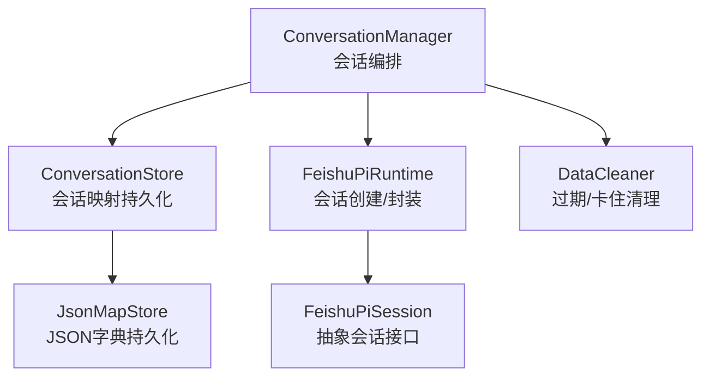
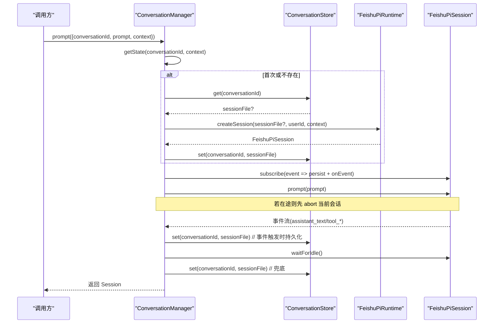
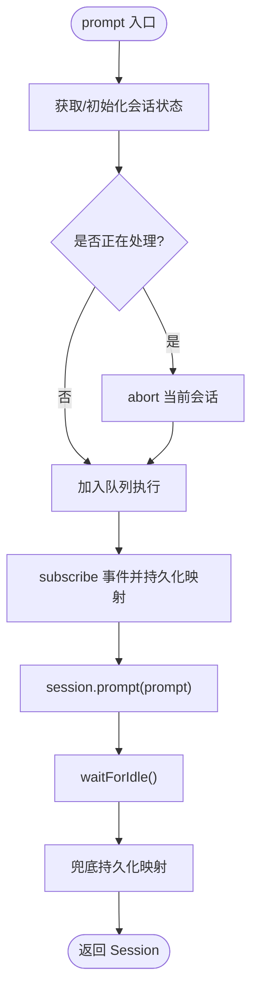
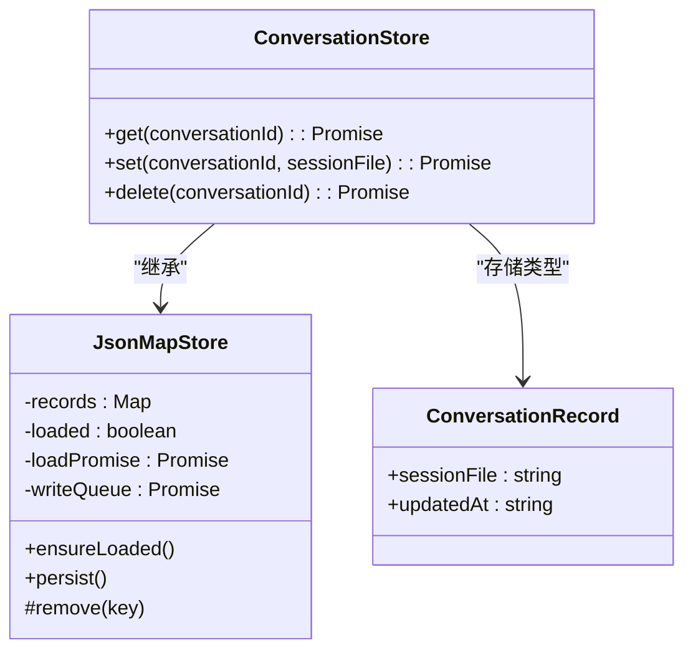
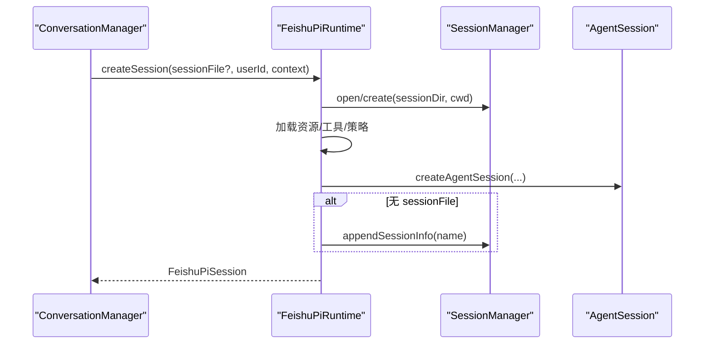
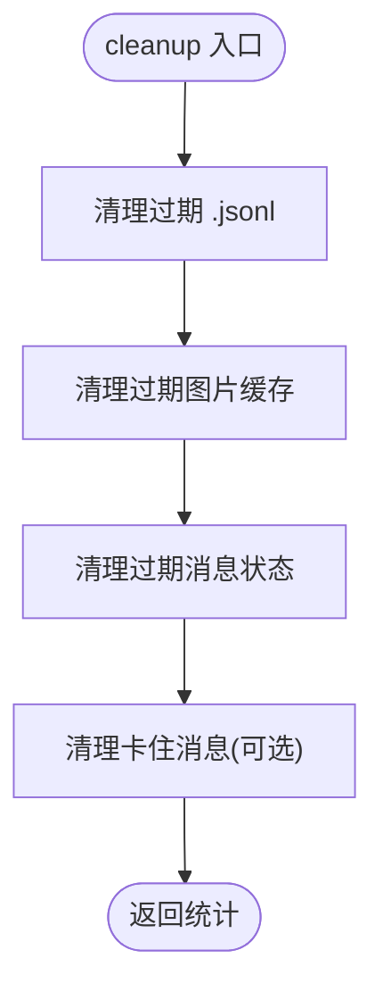
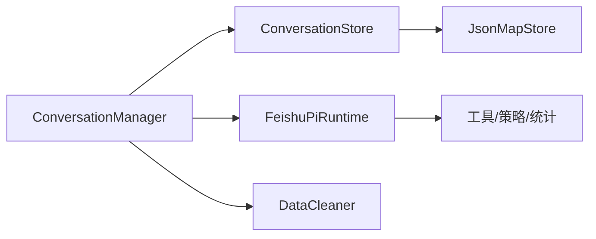

# 会话管理器

<cite>
**本文引用的文件**
- [conversation-manager.ts](file://src/runtime/conversation-manager.ts)
- [conversation-store.ts](file://src/runtime/conversation-store.ts)
- [types.ts](file://src/runtime/types.ts)
- [feishu-pi-runtime.ts](file://src/runtime/feishu-pi-runtime.ts)
- [json-store.ts](file://src/utils/json-store.ts)
- [data-cleaner.ts](file://src/runtime/data-cleaner.ts)
- [types.ts（上下文）](file://src/context/types.ts)
</cite>

## 目录
1. [简介](#简介)
2. [项目结构](#项目结构)
3. [核心组件](#核心组件)
4. [架构总览](#架构总览)
5. [详细组件分析](#详细组件分析)
6. [依赖关系分析](#依赖关系分析)
7. [性能与并发特性](#性能与并发特性)
8. [故障排查指南](#故障排查指南)
9. [结论](#结论)
10. [附录：扩展与自定义指南](#附录：扩展与自定义指南)

## 简介
本文件面向开发者，系统化说明会话管理器的设计与实现，重点覆盖 ConversationManager 与 ConversationStore 的职责、多轮对话状态管理、会话创建/更新/持久化/清理流程、存储结构与元数据、生命周期管理（超时、内存优化、磁盘清理）、查询/搜索/导出能力、并发访问控制、数据一致性与备份恢复机制，并提供自定义会话存储与扩展功能的实践指导。

## 项目结构
会话管理相关代码集中在 runtime 层，围绕“会话编排”和“会话映射持久化”两个职责展开：
- 会话编排：ConversationManager 负责会话复用、消息排队、中断与事件订阅、统计获取、清理与中止。
- 会话映射持久化：ConversationStore 维护 conversationId 到 Pi Session 文件路径的映射，提供原子写入与删除。
- 运行时封装：FeishuPiRuntime 负责创建/打开 Pi AgentSession，包装为 FeishuPiSession 接口，并注入工具、权限策略、技能使用统计等。
- 通用持久化基类：JsonMapStore 提供懒加载、串行写队列与原子替换的 JSON 字典存储能力。
- 数据清理：DataCleaner 负责过期会话文件、图片缓存、消息状态的清理与卡住消息修复。

图表来源
- [conversation-manager.ts:23-118](file://src/runtime/conversation-manager.ts#L23-L118)
- [conversation-store.ts:12-30](file://src/runtime/conversation-store.ts#L12-L30)
- [feishu-pi-runtime.ts:16-74](file://src/runtime/feishu-pi-runtime.ts#L16-L74)
- [json-store.ts:10-57](file://src/utils/json-store.ts#L10-L57)
- [data-cleaner.ts:30-67](file://src/runtime/data-cleaner.ts#L30-L67)

章节来源
- [conversation-manager.ts:23-118](file://src/runtime/conversation-manager.ts#L23-L118)
- [conversation-store.ts:12-30](file://src/runtime/conversation-store.ts#L12-L30)
- [feishu-pi-runtime.ts:16-74](file://src/runtime/feishu-pi-runtime.ts#L16-L74)
- [json-store.ts:10-57](file://src/utils/json-store.ts#L10-L57)
- [data-cleaner.ts:30-67](file://src/runtime/data-cleaner.ts#L30-L67)

## 核心组件
- ConversationManager：会话复用、消息顺序执行、新消息打断在途请求、事件订阅与持久化、统计与清理、中止响应。
- ConversationStore：基于 JsonMapStore 的轻量映射存储，记录每个会话对应的 Pi Session 文件路径及更新时间。
- FeishuPiRuntime：创建或打开 Pi AgentSession，封装为 FeishuPiSession；注入工具、权限策略、技能使用统计；提前落盘 session_info 保证中断可恢复。
- JsonMapStore：懒加载、串行写队列、临时文件+rename 原子替换的 JSON 字典存储基类。
- DataCleaner：按保留天数清理过期 .jsonl 会话文件、图片缓存、messages.json 中的过期条目，以及清理卡住的消息。

章节来源
- [conversation-manager.ts:23-118](file://src/runtime/conversation-manager.ts#L23-L118)
- [conversation-store.ts:12-30](file://src/runtime/conversation-store.ts#L12-L30)
- [feishu-pi-runtime.ts:147-285](file://src/runtime/feishu-pi-runtime.ts#L147-L285)
- [json-store.ts:10-57](file://src/utils/json-store.ts#L10-L57)
- [data-cleaner.ts:30-184](file://src/runtime/data-cleaner.ts#L30-L184)

## 架构总览
会话管理的整体流程如下：
- 调用方通过 ConversationManager.prompt 发送消息，内部根据 conversationId 获取或初始化会话状态。
- 若存在在途请求，先 abort 当前会话，再排队执行新消息，确保同一会话内消息顺序执行且支持打断。
- 会话事件订阅中持续检查并持久化 sessionFile 映射，即使中途中断也能在下一次恢复。
- 会话结束后等待空闲并再次兜底持久化。
- 清理由 DataCleaner 定时或按需执行，保障磁盘空间与一致性。

图表来源
- [conversation-manager.ts:33-96](file://src/runtime/conversation-manager.ts#L33-L96)
- [conversation-store.ts:14-24](file://src/runtime/conversation-store.ts#L14-L24)
- [feishu-pi-runtime.ts:147-224](file://src/runtime/feishu-pi-runtime.ts#L147-L224)

## 详细组件分析

### ConversationManager：会话编排与状态机
- 会话复用与合并初始化：通过 Map<conversationId, Promise<State>> 避免重复创建，并发首次初始化合并。
- 状态结构：包含 session、任务队列 queue、busy 标志、已持久化的 sessionFile 防抖。
- 初始化流程：从 store 读取 sessionFile，尝试恢复；失败则新建；立即持久化映射。
- 消息处理：新消息到达时若 busy 则 abort 当前会话，然后排队执行；事件回调中持续持久化映射；完成后 waitForIdle 并兜底持久化。
- 统计与清理：getStats 直接转发至底层 Session；clear 删除内存映射与持久化映射；abort 中断指定会话。

图表来源
- [conversation-manager.ts:33-96](file://src/runtime/conversation-manager.ts#L33-L96)

章节来源
- [conversation-manager.ts:23-118](file://src/runtime/conversation-manager.ts#L23-L118)

### ConversationStore：会话映射持久化
- 数据结构：每条记录包含 sessionFile（Pi Session JSONL 路径）与 updatedAt（最近写入时间）。
- 操作语义：get/set/delete 均会 ensureLoaded 后操作内存映射，set 后持久化；delete 委托基类 remove。
- 一致性：基于 JsonMapStore 的串行写队列与原子替换，避免并发写导致的数据损坏。

图表来源
- [json-store.ts:10-57](file://src/utils/json-store.ts#L10-L57)
- [conversation-store.ts:4-30](file://src/runtime/conversation-store.ts#L4-L30)

章节来源
- [conversation-store.ts:12-30](file://src/runtime/conversation-store.ts#L12-L30)
- [json-store.ts:10-57](file://src/utils/json-store.ts#L10-L57)

### FeishuPiRuntime：会话创建与封装
- 会话创建：根据 sessionFile 决定 open/create；设置模型 API Key；解析用户身份组并加载策略；构建 ResourceLoader 与工具集；创建 AgentSession。
- 提前落盘：若尚未生成 sessionFile，追加 session_info 使映射立即可用，提升中断恢复能力。
- 工具与权限：注入 beforeToolCall 钩子，read 走可读范围判定，其他工具走 ToolGuard；可选注入技能使用统计与定时任务工具。
- 会话封装：SessionWrapper 将底层事件转换为统一 FeishuPiEvent，暴露 prompt/subscribe/waitForIdle/abort/getStats/getContextUsage 等接口。

图表来源
- [feishu-pi-runtime.ts:147-224](file://src/runtime/feishu-pi-runtime.ts#L147-L224)

章节来源
- [feishu-pi-runtime.ts:16-74](file://src/runtime/feishu-pi-runtime.ts#L16-L74)
- [feishu-pi-runtime.ts:147-285](file://src/runtime/feishu-pi-runtime.ts#L147-L285)

### DataCleaner：过期与卡住清理
- 会话文件清理：扫描 sessionDir 下 .jsonl，按 mtime 判断是否超过保留天数，删除并计数。
- 图片缓存清理：扫描 images 子目录，按 mtime 清理过期图片。
- 消息状态清理：读取 messages.json，按谓词过滤并写回；支持清理“processing 超时的卡住消息”。
- dryRun 模式：仅统计不实际删除，便于评估影响。

图表来源
- [data-cleaner.ts:44-67](file://src/runtime/data-cleaner.ts#L44-L67)
- [data-cleaner.ts:70-184](file://src/runtime/data-cleaner.ts#L70-L184)

章节来源
- [data-cleaner.ts:30-184](file://src/runtime/data-cleaner.ts#L30-L184)

## 依赖关系分析
- ConversationManager 依赖：
  - ConversationStore：用于会话映射的读写。
  - FeishuPiRuntime：用于创建/恢复会话。
  - 日志工具：记录打断与异常信息。
- ConversationStore 依赖：
  - JsonMapStore：提供统一的持久化能力。
- FeishuPiRuntime 依赖：
  - 外部库：@earendil-works/pi-coding-agent、@earendil-works/pi-ai。
  - 内部模块：工具注册、脚本工具、权限策略、技能使用统计、定时任务工具。
- DataCleaner 依赖：
  - Node fs/promises：文件系统操作。
  - 日志工具：记录清理过程与错误。

图表来源
- [conversation-manager.ts:23-118](file://src/runtime/conversation-manager.ts#L23-L118)
- [conversation-store.ts:12-30](file://src/runtime/conversation-store.ts#L12-L30)
- [feishu-pi-runtime.ts:147-285](file://src/runtime/feishu-pi-runtime.ts#L147-L285)
- [json-store.ts:10-57](file://src/utils/json-store.ts#L10-L57)
- [data-cleaner.ts:30-184](file://src/runtime/data-cleaner.ts#L30-L184)

章节来源
- [conversation-manager.ts:23-118](file://src/runtime/conversation-manager.ts#L23-L118)
- [conversation-store.ts:12-30](file://src/runtime/conversation-store.ts#L12-L30)
- [feishu-pi-runtime.ts:147-285](file://src/runtime/feishu-pi-runtime.ts#L147-L285)
- [json-store.ts:10-57](file://src/utils/json-store.ts#L10-L57)
- [data-cleaner.ts:30-184](file://src/runtime/data-cleaner.ts#L30-L184)

## 性能与并发特性
- 并发安全：
  - 会话初始化合并：Map 中保存 Promise<State>，并发首次初始化共享同一任务，避免重复创建。
  - 消息顺序执行：每个会话维护一个 queue，后续消息依次排队，保证顺序。
  - 原子写：JsonMapStore 使用临时文件+rename 原子替换，避免并发写破坏。
- 中断与恢复：
  - 新消息到达时 abort 在途请求，防止堆积与竞态。
  - 事件回调中持续持久化 sessionFile，即使中断也可恢复。
  - 会话创建时提前 appendSessionInfo，使 sessionFile 尽早可用。
- 内存优化：
  - 会话状态仅在活跃期间驻留；clear 会释放内存映射与持久化映射。
  - 队列任务失败时以 catch(() => undefined) 避免阻塞后续任务。
- 磁盘清理：
  - DataCleaner 按保留天数清理过期 .jsonl、图片缓存与消息状态，支持 dryRun 评估。
  - 卡住消息清理：对长时间处于 processing 的消息进行修复。

[本节为通用性能讨论，无需特定文件引用]

## 故障排查指南
- 无法恢复会话：
  - 检查 ConversationStore 中是否存在对应 conversationId 的映射。
  - 确认 Pi Session 文件未被 DataCleaner 误删（查看 retentionDays 配置）。
- 消息未顺序执行：
  - 确认同一 conversationId 的请求是否被正确排队（queue 机制）。
  - 检查是否有异常导致队列中断（catch 分支不会抛错但会跳过后续任务）。
- 中断无效：
  - 确认 abort 调用是否命中正确的会话状态（getState 返回的 Promise 需 await）。
- 磁盘占用过高：
  - 调整 DataCleaner 的 retentionDays，定期执行 cleanup。
  - 检查 images 目录与 messages.json 是否被正确清理。
- 权限拦截：
  - read 工具受 groupPolicy.readAllowed/skillsAllowed 限制；其他工具受 ToolGuard 控制。
  - 检查 groupsFor/forGroups 策略是否正确加载。

章节来源
- [conversation-manager.ts:65-118](file://src/runtime/conversation-manager.ts#L65-L118)
- [conversation-store.ts:14-30](file://src/runtime/conversation-store.ts#L14-L30)
- [data-cleaner.ts:70-184](file://src/runtime/data-cleaner.ts#L70-L184)
- [feishu-pi-runtime.ts:226-285](file://src/runtime/feishu-pi-runtime.ts#L226-L285)

## 结论
会话管理器通过 ConversationManager 与 ConversationStore 的组合，实现了高可靠的多轮对话状态管理：会话复用、顺序执行、中断恢复、持久化映射、统计与清理。配合 FeishuPiRuntime 的会话封装与权限注入，以及 DataCleaner 的磁盘清理，形成完整的会话生命周期闭环。该设计在保证一致性的同时兼顾了性能与可维护性，适合在高并发场景下稳定运行。

[本节为总结性内容，无需特定文件引用]

## 附录：扩展与自定义指南

### 自定义会话存储
- 目标：替换 ConversationStore 的默认 JSON 映射存储，例如接入数据库或分布式 KV。
- 步骤：
  - 实现与 ConversationStore 相同的接口：get/set/delete。
  - 保持幂等与原子性：set 应保证写入可见性；delete 应确保删除生效。
  - 注意并发：若后端非事务型，需在应用层加锁或版本号控制。
  - 在 ConversationManager 构造时传入自定义 store。

章节来源
- [conversation-store.ts:12-30](file://src/runtime/conversation-store.ts#L12-L30)
- [conversation-manager.ts:28-31](file://src/runtime/conversation-manager.ts#L28-L31)

### 扩展会话功能
- 新增会话元数据：可在 ConversationRecord 中扩展字段（如 tenantId、tags），并在 set 时写入。
- 自定义清理策略：扩展 DataCleaner，增加按标签或租户维度的清理逻辑。
- 增强事件：在 SessionWrapper 中扩展 FeishuPiEvent，转发更多底层事件。
- 工具与权限：在 FeishuPiRuntime 中注入新的 customTools，并通过 ToolGuard 控制访问。

章节来源
- [conversation-store.ts:4-9](file://src/runtime/conversation-store.ts#L4-L9)
- [data-cleaner.ts:12-28](file://src/runtime/data-cleaner.ts#L12-L28)
- [feishu-pi-runtime.ts:16-74](file://src/runtime/feishu-pi-runtime.ts#L16-L74)
- [feishu-pi-runtime.ts:194-285](file://src/runtime/feishu-pi-runtime.ts#L194-L285)

### 查询、搜索与导出
- 查询：通过 ConversationStore.get 获取会话对应的 sessionFile，结合外部索引（如按 userId/chatId 前缀）实现快速定位。
- 搜索：可在上层维护索引表（如 conversationId -> 元数据），支持按关键词或时间范围检索。
- 导出：读取 sessionFile（.jsonl）与 images 目录，打包为归档文件；导出前可调用 DataCleaner 清理过期数据以减少体积。

章节来源
- [conversation-store.ts:14-24](file://src/runtime/conversation-store.ts#L14-L24)
- [data-cleaner.ts:70-125](file://src/runtime/data-cleaner.ts#L70-L125)

### 备份与恢复
- 备份：定期复制 sessionDir 下的 .jsonl 与 images 目录，以及 ConversationStore 的映射文件。
- 恢复：将备份文件放回原路径，重启服务后 ConversationManager 可从 store 恢复会话映射并继续对话。
- 一致性：建议在备份前暂停写入或使用快照机制，避免半写状态。

章节来源
- [json-store.ts:47-57](file://src/utils/json-store.ts#L47-L57)
- [conversation-manager.ts:42-63](file://src/runtime/conversation-manager.ts#L42-L63)