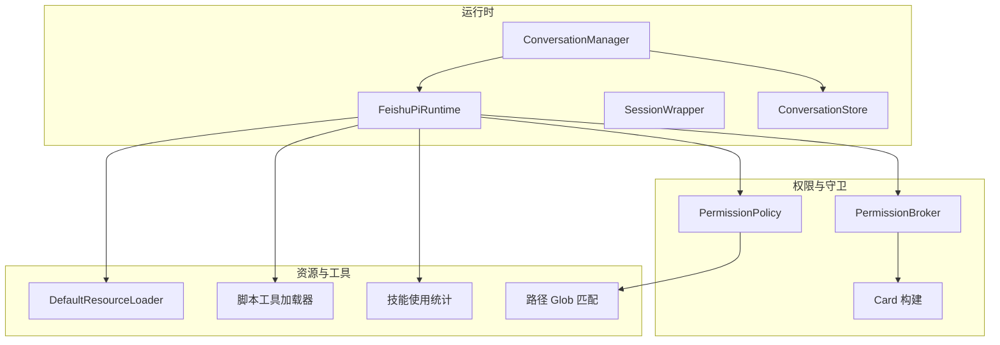
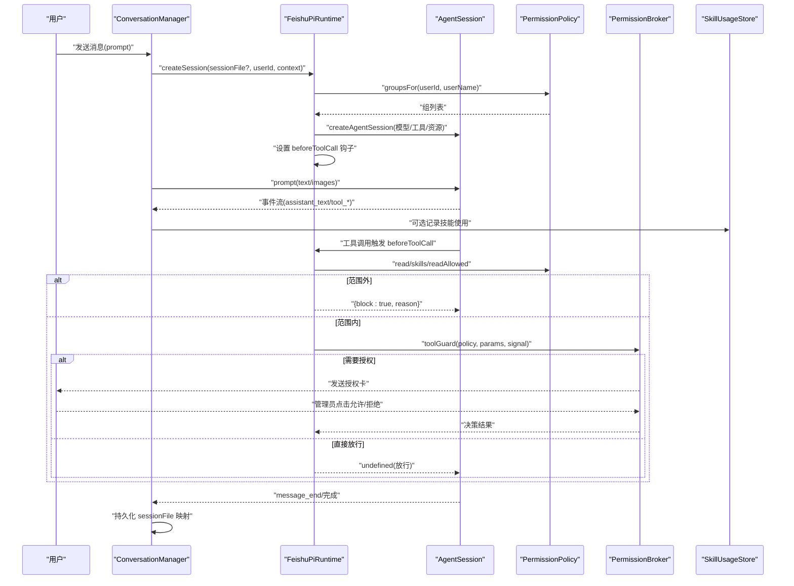
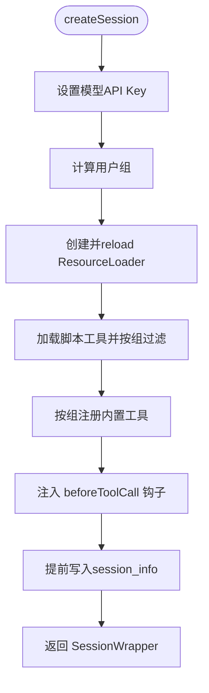
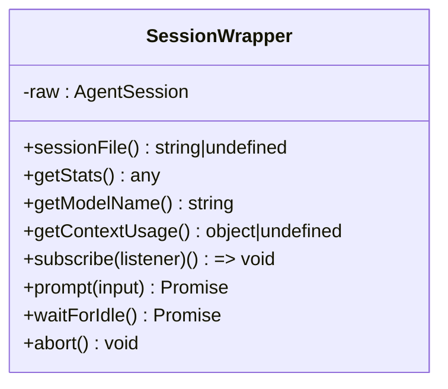
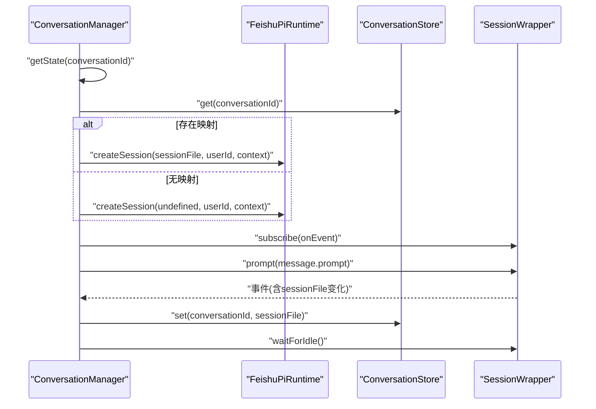
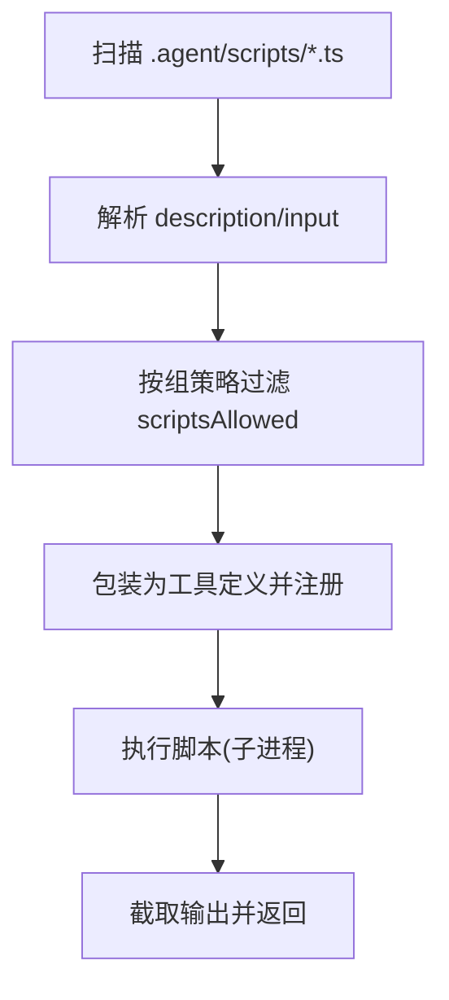
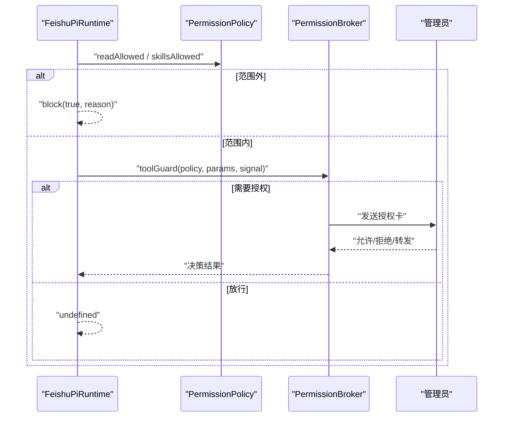
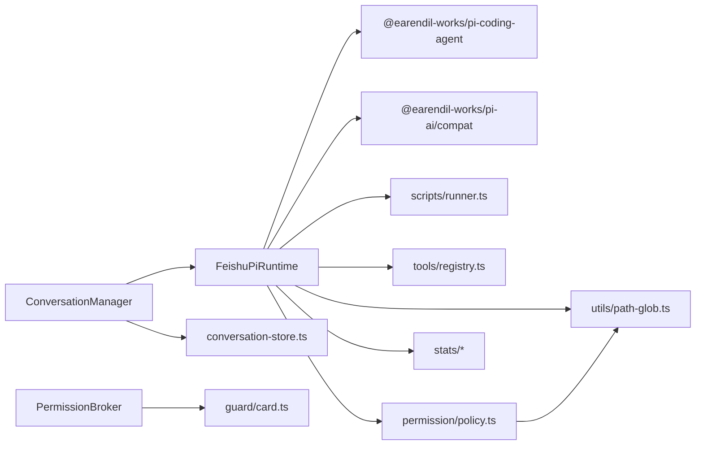

# 智能体运行时

<cite>
**本文引用的文件**
- [feishu-pi-runtime.ts](file://src/runtime/feishu-pi-runtime.ts)
- [types.ts](file://src/runtime/types.ts)
- [conversation-manager.ts](file://src/runtime/conversation-manager.ts)
- [conversation-store.ts](file://src/runtime/conversation-store.ts)
- [runner.ts](file://src/scripts/runner.ts)
- [policy.ts](file://src/permission/policy.ts)
- [skill-usage-tool.ts](file://src/stats/skill-usage-tool.ts)
- [skill-usage-store.ts](file://src/stats/skill-usage-store.ts)
- [path-glob.ts](file://src/utils/path-glob.ts)
- [broker.ts](file://src/guard/broker.ts)
- [card.ts](file://src/guard/card.ts)
- [registry.ts](file://src/tools/registry.ts)
- [main.ts](file://src/main.ts)
- [architecture.md](file://docs/architecture.md)
</cite>

## 目录
1. [简介](#简介)
2. [项目结构](#项目结构)
3. [核心组件](#核心组件)
4. [架构总览](#架构总览)
5. [详细组件分析](#详细组件分析)
6. [依赖关系分析](#依赖关系分析)
7. [性能考虑](#性能考虑)
8. [故障排查指南](#故障排查指南)
9. [结论](#结论)
10. [附录](#附录)

## 简介
本文件面向开发者与运维人员，系统化阐述智能体运行时的设计与实现，重点围绕 FeishuPiRuntime 类、SessionWrapper 封装、资源加载器（ResourceLoader）配置与技能/脚本工具动态加载、ToolGuard 权限控制策略、会话生命周期管理、错误处理机制与性能优化建议。文档同时提供可视化架构图、时序图与流程图，帮助快速理解并扩展运行时能力。

## 项目结构
运行时相关代码主要分布在 runtime、scripts、permission、guard、stats、tools 等模块：
- runtime：会话创建、模型切换、事件订阅转发、工具注册与执行钩子、会话复用与持久化映射
- scripts：脚本工具扫描与执行（.agent/scripts/*.ts）
- permission：统一权限策略（permissions.json），组策略合并与匹配
- guard：授权卡与审批中枢（PermissionBroker、卡片构建）
- stats：技能使用统计记录与查询工具
- tools：内置工具名常量与历史自定义工具加载（已迁移至脚本工具）
- utils：路径 glob 匹配工具

图表来源
- [feishu-pi-runtime.ts:81-284](file://src/runtime/feishu-pi-runtime.ts#L81-L284)
- [conversation-manager.ts:23-118](file://src/runtime/conversation-manager.ts#L23-L118)
- [conversation-store.ts:12-30](file://src/runtime/conversation-store.ts#L12-L30)
- [policy.ts:68-158](file://src/permission/policy.ts#L68-L158)
- [broker.ts:46-199](file://src/guard/broker.ts#L46-L199)
- [runner.ts:32-96](file://src/scripts/runner.ts#L32-L96)
- [skill-usage-store.ts:67-157](file://src/stats/skill-usage-store.ts#L67-L157)
- [path-glob.ts:11-41](file://src/utils/path-glob.ts#L11-L41)

章节来源
- [feishu-pi-runtime.ts:81-284](file://src/runtime/feishu-pi-runtime.ts#L81-L284)
- [conversation-manager.ts:23-118](file://src/runtime/conversation-manager.ts#L23-L118)
- [conversation-store.ts:12-30](file://src/runtime/conversation-store.ts#L12-L30)
- [policy.ts:68-158](file://src/permission/policy.ts#L68-L158)
- [broker.ts:46-199](file://src/guard/broker.ts#L46-L199)
- [runner.ts:32-96](file://src/scripts/runner.ts#L32-L96)
- [skill-usage-store.ts:67-157](file://src/stats/skill-usage-store.ts#L67-L157)
- [path-glob.ts:11-41](file://src/utils/path-glob.ts#L11-L41)

## 核心组件
- FeishuPiRuntime：运行时入口，负责模型切换、资源加载、会话创建、工具注册、beforeToolCall 钩子注入、技能使用统计记录。
- SessionWrapper：对底层 AgentSession 的轻量封装，屏蔽 Pi 事件细节，统一为 FeishuPiEvent 事件流；支持 prompt、waitForIdle、abort、getStats、getModelName、getContextUsage。
- ConversationManager：会话复用与消息队列，保证同一会话内顺序执行；新消息到达时中断在途请求；自动持久化 sessionFile 映射。
- ConversationStore：JSON 持久化“飞书会话 → Pi Session 文件”的映射，支持 get/set/delete。
- PermissionPolicy：统一权限策略，解析 permissions.json，按 common ∪ 所属组合并规则，提供 read/write/bash/scripts/skills 判定函数。
- ToolGuard + PermissionBroker：工具调用守卫与授权卡中枢，策略未命中时走智能体判断或授权卡流程，支持超时、撤回、转发管理员。
- 脚本工具加载器：扫描 .agent/scripts/*.ts，解析元数据，以子进程方式执行，输出 stdout 作为结果。
- 技能使用统计：在 beforeToolCall 中捕获 read 技能读取行为，记录到 JSONL 文件，并提供查询工具。

章节来源
- [feishu-pi-runtime.ts:16-74](file://src/runtime/feishu-pi-runtime.ts#L16-L74)
- [feishu-pi-runtime.ts:81-284](file://src/runtime/feishu-pi-runtime.ts#L81-L284)
- [conversation-manager.ts:23-118](file://src/runtime/conversation-manager.ts#L23-L118)
- [conversation-store.ts:12-30](file://src/runtime/conversation-store.ts#L12-L30)
- [policy.ts:68-158](file://src/permission/policy.ts#L68-L158)
- [runner.ts:32-96](file://src/scripts/runner.ts#L32-L96)
- [skill-usage-tool.ts:46-99](file://src/stats/skill-usage-tool.ts#L46-L99)
- [skill-usage-store.ts:67-157](file://src/stats/skill-usage-store.ts#L67-L157)

## 架构总览
下图展示了从用户消息到模型响应、工具执行、权限校验与授权卡的完整链路。

图表来源
- [feishu-pi-runtime.ts:147-284](file://src/runtime/feishu-pi-runtime.ts#L147-L284)
- [conversation-manager.ts:66-95](file://src/runtime/conversation-manager.ts#L66-L95)
- [policy.ts:91-158](file://src/permission/policy.ts#L91-L158)
- [broker.ts:78-165](file://src/guard/broker.ts#L78-L165)
- [skill-usage-store.ts:84-96](file://src/stats/skill-usage-store.ts#L84-L96)

## 详细组件分析

### FeishuPiRuntime：会话创建、模型切换、工具注册与执行流程
- 模型切换：setModelName 仅更新配置，对新会话生效；调用方需持久化模型选择。
- 资源加载：createBaseLoader 构造 DefaultResourceLoader 并 reload，确保 skills 可用。
- 会话创建：
  - 设置 API Key 环境变量（anthropic/openai）。
  - 计算用户身份组（owner/user），编译 GroupPolicy。
  - 根据组策略注册脚本工具（scriptsAllowed）、内置工具（read/bash/write/edit 或 bash/read）。
  - 注入 beforeToolCall 钩子：read 先判技能可见范围再判 read 范围；其他工具走 toolGuard；范围内 read 记录技能使用。
  - 立即落盘 session_info，使 sessionFile 尽早可用，便于会话恢复。
- 打印可用资源：启动时列出 Skills、脚本工具、内置工具清单。

图表来源
- [feishu-pi-runtime.ts:147-284](file://src/runtime/feishu-pi-runtime.ts#L147-L284)
- [feishu-pi-runtime.ts:103-112](file://src/runtime/feishu-pi-runtime.ts#L103-L112)
- [feishu-pi-runtime.ts:118-145](file://src/runtime/feishu-pi-runtime.ts#L118-L145)

章节来源
- [feishu-pi-runtime.ts:98-101](file://src/runtime/feishu-pi-runtime.ts#L98-L101)
- [feishu-pi-runtime.ts:103-112](file://src/runtime/feishu-pi-runtime.ts#L103-L112)
- [feishu-pi-runtime.ts:147-284](file://src/runtime/feishu-pi-runtime.ts#L147-L284)

### SessionWrapper：对 AgentSession 的封装与事件转换
- 暴露最小接口：sessionFile、subscribe、prompt、waitForIdle、abort、getStats、getModelName、getContextUsage。
- 事件转换：将 Pi 的 message_update、tool_execution_* 转换为 assistant_text、tool_started/updated/finished。
- 图片提示：将 Uint8Array 转为 base64 并通过 images 参数传入。

图表来源
- [feishu-pi-runtime.ts:16-74](file://src/runtime/feishu-pi-runtime.ts#L16-L74)

章节来源
- [feishu-pi-runtime.ts:16-74](file://src/runtime/feishu-pi-runtime.ts#L16-L74)
- [types.ts:53-64](file://src/runtime/types.ts#L53-L64)

### 会话生命周期管理：ConversationManager 与 ConversationStore
- 会话复用：按 conversationId 获取或初始化状态，并发安全地合并首次初始化。
- 顺序执行：每个会话维护一个 queue，保证消息串行处理。
- 打断机制：新消息到达时 abort 当前在途响应，立即排队执行新消息。
- 持久化映射：当 Pi 首次落盘 sessionFile 时立即持久化映射，崩溃/中断后可恢复。
- 清理与中断：clear 删除映射；abort 中断指定会话。

图表来源
- [conversation-manager.ts:33-95](file://src/runtime/conversation-manager.ts#L33-L95)
- [conversation-store.ts:12-30](file://src/runtime/conversation-store.ts#L12-L30)

章节来源
- [conversation-manager.ts:33-95](file://src/runtime/conversation-manager.ts#L33-L95)
- [conversation-store.ts:12-30](file://src/runtime/conversation-store.ts#L12-L30)

### 资源加载器（ResourceLoader）与技能文档
- 基础加载器：DefaultResourceLoader 通过 cwd、agentDir、systemPrompt 初始化，必须 reload 后才能加载 skills。
- 技能可见性：skills 字段控制技能文件可见范围；不在范围内的技能读取会被拦截。
- 启动日志：printAvailableResources 列出已加载的 Skills、脚本工具、内置工具。

章节来源
- [feishu-pi-runtime.ts:103-112](file://src/runtime/feishu-pi-runtime.ts#L103-L112)
- [feishu-pi-runtime.ts:118-145](file://src/runtime/feishu-pi-runtime.ts#L118-L145)
- [policy.ts:59-64](file://src/permission/policy.ts#L59-L64)

### 技能文档与脚本工具的动态加载机制
- 脚本工具：扫描 .agent/scripts/*.ts，解析顶部注释中的 description 与 input 元数据，文件名即工具名；执行通过子进程，stdout 作为结果，支持超时与输出截断。
- 权限控制：脚本工具仅在策略文件的 scripts 名单内注册；标记 risk: "high" 的工具强制走授权卡。
- 技能使用统计：read 工具读取技能文件时，matchSkillRead 识别技能名并记录事件；提供 query_skill_usage 工具进行自然语言查询。

图表来源
- [runner.ts:32-96](file://src/scripts/runner.ts#L32-L96)
- [feishu-pi-runtime.ts:173-187](file://src/runtime/feishu-pi-runtime.ts#L173-L187)
- [skill-usage-store.ts:39-61](file://src/stats/skill-usage-store.ts#L39-L61)
- [skill-usage-tool.ts:46-99](file://src/stats/skill-usage-tool.ts#L46-L99)

章节来源
- [runner.ts:32-96](file://src/scripts/runner.ts#L32-L96)
- [feishu-pi-runtime.ts:173-187](file://src/runtime/feishu-pi-runtime.ts#L173-L187)
- [skill-usage-store.ts:39-61](file://src/stats/skill-usage-store.ts#L39-L61)
- [skill-usage-tool.ts:46-99](file://src/stats/skill-usage-tool.ts#L46-L99)

### 工具守卫（ToolGuard）与权限控制策略
- 策略层：PermissionPolicy 解析 permissions.json，合并 common 与所属组，提供 read/write/bash/scripts/skills 判定函数。
- 守卫层：beforeToolCall 钩子中，read 先判技能可见范围再判 read 范围；其他工具走 toolGuard；策略未命中时进入授权卡流程。
- 授权卡：PermissionBroker 发送授权卡片，等待管理员决策；支持超时、撤回、转发管理员；回调时服务端强校验 token、chatId、operatorOpenId。
- 卡片构建：敏感字段脱敏，命令摘要展示，按钮包含允许一次、拒绝、转发管理员。

图表来源
- [policy.ts:91-158](file://src/permission/policy.ts#L91-L158)
- [feishu-pi-runtime.ts:233-282](file://src/runtime/feishu-pi-runtime.ts#L233-L282)
- [broker.ts:78-165](file://src/guard/broker.ts#L78-L165)
- [card.ts:28-86](file://src/guard/card.ts#L28-L86)

章节来源
- [policy.ts:91-158](file://src/permission/policy.ts#L91-L158)
- [feishu-pi-runtime.ts:233-282](file://src/runtime/feishu-pi-runtime.ts#L233-L282)
- [broker.ts:78-165](file://src/guard/broker.ts#L78-L165)
- [card.ts:28-86](file://src/guard/card.ts#L28-L86)

### 错误处理与异常安全
- 策略文件缺失/解析失败：按保守默认处理（user 仅技能目录可读、无脚本、无命令）。
- Guard 异常：beforeToolCall 中 toolGuard 抛错按拒绝处理，并记录告警。
- 技能使用记录失败：只告警不阻塞工具执行。
- 脚本执行失败：子进程非零退出码视为失败，stderr 截断后返回错误信息。
- 授权卡发送失败：直接拒绝并唤醒等待方，释放队列。

章节来源
- [policy.ts:179-209](file://src/permission/policy.ts#L179-L209)
- [feishu-pi-runtime.ts:261-282](file://src/runtime/feishu-pi-runtime.ts#L261-L282)
- [skill-usage-store.ts:84-96](file://src/stats/skill-usage-store.ts#L84-L96)
- [runner.ts:63-79](file://src/scripts/runner.ts#L63-L79)
- [broker.ts:108-128](file://src/guard/broker.ts#L108-L128)

### 性能优化建议
- 会话复用与顺序执行：ConversationManager 保证同一会话内串行，避免并发竞争；新消息打断在途响应，减少无效计算。
- 早持久化：会话创建后立即写入 session_info，缩短恢复时间，降低丢失风险。
- 资源热重载：PermissionPolicy 基于 mtime 热重载策略文件，无需重启服务。
- 脚本执行限制：超时与输出截断防止长耗时与内存占用。
- 统计写入队列：SkillUsageStore 使用串行写队列，避免并发写冲突。

章节来源
- [conversation-manager.ts:66-95](file://src/runtime/conversation-manager.ts#L66-L95)
- [feishu-pi-runtime.ts:218-224](file://src/runtime/feishu-pi-runtime.ts#L218-L224)
- [policy.ts:179-209](file://src/permission/policy.ts#L179-L209)
- [runner.ts:63-79](file://src/scripts/runner.ts#L63-L79)
- [skill-usage-store.ts:84-96](file://src/stats/skill-usage-store.ts#L84-L96)

## 依赖关系分析
- FeishuPiRuntime 依赖：
  - @earendil-works/pi-coding-agent：会话创建、ResourceLoader、SessionManager
  - @earendil-works/pi-ai/compat：模型获取
  - 内部模块：scripts/runner.ts、tools/registry.ts、stats/*、permission/policy.ts、utils/path-glob.ts
- ConversationManager 依赖：FeishuPiRuntime、ConversationStore
- PermissionPolicy 依赖：utils/path-glob.ts
- PermissionBroker 依赖：guard/card.ts
- SkillUsageStore 依赖：fs/promises、utils/logger.ts

图表来源
- [feishu-pi-runtime.ts:1-14](file://src/runtime/feishu-pi-runtime.ts#L1-L14)
- [conversation-manager.ts:1-5](file://src/runtime/conversation-manager.ts#L1-L5)
- [policy.ts:1-3](file://src/permission/policy.ts#L1-L3)
- [broker.ts:1-3](file://src/guard/broker.ts#L1-L3)

章节来源
- [feishu-pi-runtime.ts:1-14](file://src/runtime/feishu-pi-runtime.ts#L1-L14)
- [conversation-manager.ts:1-5](file://src/runtime/conversation-manager.ts#L1-L5)
- [policy.ts:1-3](file://src/permission/policy.ts#L1-L3)
- [broker.ts:1-3](file://src/guard/broker.ts#L1-L3)

## 性能考虑
- 会话级串行化：避免同一会话并发导致的上下文竞争与重复计算。
- 早持久化与热重载：减少恢复时间与配置变更延迟。
- 脚本执行边界：超时与缓冲限制保障稳定性。
- 统计写入批量化：串行队列降低磁盘压力。
- 模型切换即时生效：新会话采用最新模型，旧会话沿用直至重建。

[本节为通用指导，不直接分析具体文件]

## 故障排查指南
- 无法创建会话：检查 FEISHU_PI_MODEL_API_KEY 是否设置；确认 modelProvider/modelName 有效。
- 工具被拦截：查看 beforeToolCall 返回的 block reason；确认策略文件中 read/skills/bash/scripts 配置。
- 授权卡未出现：检查 PermissionBroker 是否配置管理员 Open ID；确认 sendCard 成功；关注超时与撤回逻辑。
- 技能使用统计为空：确认 read 工具路径位于技能目录且为 .md；检查 SkillUsageStore 文件是否存在与可写。
- 脚本执行失败：查看 stderr 输出；确认脚本元数据 description 存在；检查子进程超时与输出截断。

章节来源
- [feishu-pi-runtime.ts:147-157](file://src/runtime/feishu-pi-runtime.ts#L147-L157)
- [feishu-pi-runtime.ts:233-282](file://src/runtime/feishu-pi-runtime.ts#L233-L282)
- [broker.ts:78-128](file://src/guard/broker.ts#L78-L128)
- [skill-usage-store.ts:84-96](file://src/stats/skill-usage-store.ts#L84-L96)
- [runner.ts:63-79](file://src/scripts/runner.ts#L63-L79)

## 结论
FeishuPiRuntime 提供了统一的智能体运行时抽象，结合 SessionWrapper、ConversationManager、PermissionPolicy 与 ToolGuard，实现了安全的工具调用、灵活的权限控制与稳定的会话生命周期管理。通过脚本工具与技能文档的动态加载，系统具备高度可扩展性；配合技能使用统计与授权卡机制，既满足业务需求又保障安全合规。建议在生产环境中合理配置策略文件、监控授权卡流程与脚本执行指标，持续优化性能与用户体验。

[本节为总结性内容，不直接分析具体文件]

## 附录
- 自定义工具扩展：
  - 在 .agent/scripts/ 下新增 .ts 脚本，声明 description 与 input 元数据，文件名即工具名。
  - 在 permissions.json 中将该脚本名加入目标组的 scripts 名单。
  - 如需强制授权，可在工具定义中标记 risk: "high"。
- 扩展运行时：
  - 通过 createSession 的 customTools 注入额外工具。
  - 通过 toolGuard 钩子实现更细粒度的权限控制。
  - 通过 skillUsageStore 记录自定义使用事件。

[本节为概念性说明，不直接分析具体文件]