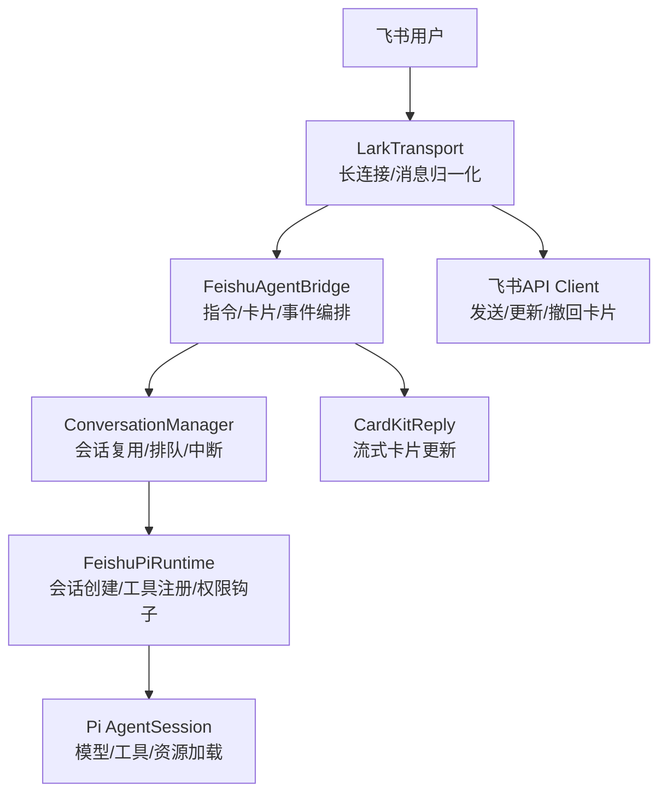
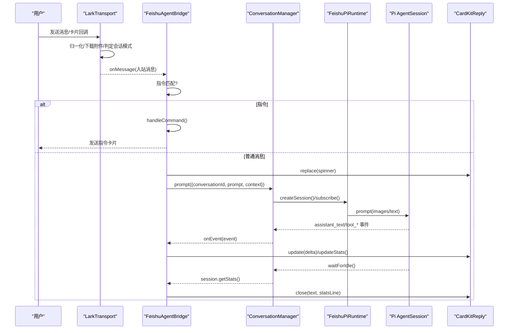
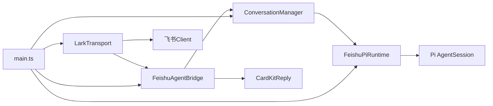
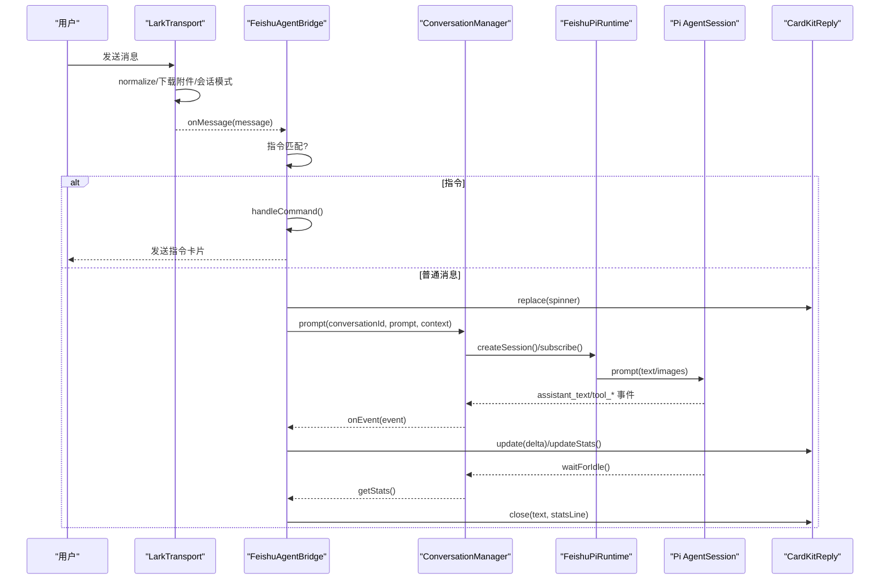
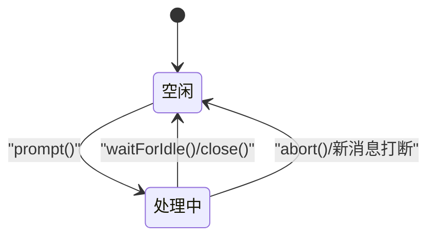
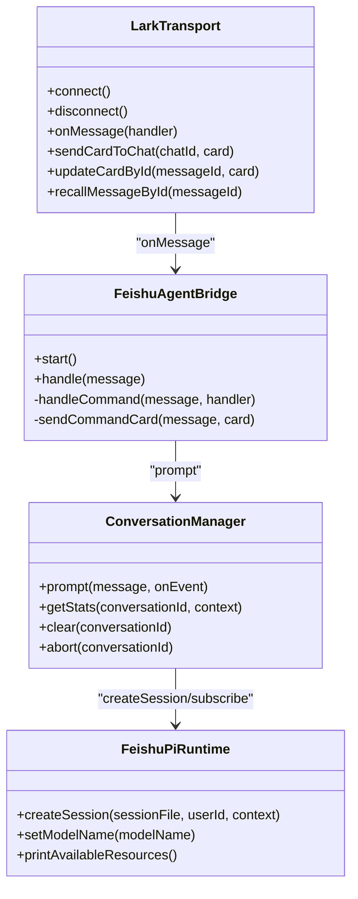

# 核心组件

<cite>
**本文引用的文件**
- [main.ts](file://src/main.ts)
- [config.ts](file://src/config.ts)
- [feishu-pi-runtime.ts](file://src/runtime/feishu-pi-runtime.ts)
- [conversation-manager.ts](file://src/runtime/conversation-manager.ts)
- [agent-bridge.ts](file://src/feishu/agent-bridge.ts)
- [lark-transport.ts](file://src/feishu/lark-transport.ts)
- [types.ts（运行时）](file://src/runtime/types.ts)
- [types.ts（飞书接入层）](file://src/feishu/types.ts)
- [README.md](file://README.md)
</cite>

## 目录
1. [简介](#简介)
2. [项目结构](#项目结构)
3. [核心组件](#核心组件)
4. [架构总览](#架构总览)
5. [详细组件分析](#详细组件分析)
6. [依赖关系分析](#依赖关系分析)
7. [性能与可靠性](#性能与可靠性)
8. [故障排查指南](#故障排查指南)
9. [结论](#结论)
10. [附录：扩展与自定义指南](#附录扩展与自定义指南)

## 简介
本文件聚焦 mini-claw 的核心组件设计与实现，围绕 FeishuPiRuntime、FeishuAgentBridge、LarkTransport、ConversationManager 四大组件展开，说明其职责边界、接口定义、内部工作机制、事件驱动与异步处理机制、初始化配置、生命周期管理、错误处理策略，并提供交互时序图与状态转换图，帮助开发者理解消息处理的完整流程并指导扩展与自定义。

## 项目结构
mini-claw 采用分层组织：
- 接入层（feishu）：负责飞书长连接、消息归一化、卡片回调、图片与附件处理、会话模式判定等。
- 运行时（runtime）：封装 Pi Agent 会话创建、工具注册与权限钩子、会话复用与排队、统计与持久化。
- 桥接层（bridge）：将入站消息转换为 Pi 提示词，驱动会话执行，并通过 CardKit 流式渲染回复。
- 入口与装配（main.ts）：组装各组件、注入权限策略与授权卡、启动服务与优雅退出。

图表来源
- [lark-transport.ts:82-133](file://src/feishu/lark-transport.ts#L82-L133)
- [agent-bridge.ts:66-237](file://src/feishu/agent-bridge.ts#L66-L237)
- [conversation-manager.ts:33-96](file://src/runtime/conversation-manager.ts#L33-L96)
- [feishu-pi-runtime.ts:147-285](file://src/runtime/feishu-pi-runtime.ts#L147-L285)

章节来源
- [main.ts:27-247](file://src/main.ts#L27-L247)
- [README.md:63-77](file://README.md#L63-L77)

## 核心组件
- LarkTransport：基于飞书官方 WSClient + EventDispatcher 的传输层，负责长连接、消息归一化、卡片回调、会话模式判定、图片与附件下载、管理员校验与模型切换持久化。
- ConversationManager：按 conversationId 管理会话复用，保证同一会话内消息顺序执行，支持新消息打断在途请求、sessionFile 增量持久化、统计读取与会话清理/中断。
- FeishuPiRuntime：封装 Pi AgentSession 的创建与配置，注入权限策略、工具白名单与高危标记、beforeToolCall 钩子（read 范围判定、ToolGuard）、技能使用统计与定时任务工具注入。
- FeishuAgentBridge：消息到提示词的转换器，指令路由、CardKit 流式回复、工具调用动画与统计小字、详细/精简模式控制、授权卡撤回联动。

章节来源
- [lark-transport.ts:11-80](file://src/feishu/lark-transport.ts#L11-L80)
- [conversation-manager.ts:22-118](file://src/runtime/conversation-manager.ts#L22-L118)
- [feishu-pi-runtime.ts:81-289](file://src/runtime/feishu-pi-runtime.ts#L81-L289)
- [agent-bridge.ts:15-64](file://src/feishu/agent-bridge.ts#L15-L64)

## 架构总览
系统以事件驱动和异步处理为核心：
- 飞书通过 WebSocket 推送消息与卡片回调，LarkTransport 接收后归一化为统一消息格式，后台异步交给 Bridge。
- Bridge 解析指令或构造 prompt，交由 ConversationManager 排队执行；管理器确保同一会话顺序执行，并在有新消息时中断旧响应。
- Runtime 创建/恢复 Pi Session，注入权限与工具，执行前通过 beforeToolCall 进行 read 范围与 ToolGuard 判定，记录技能使用统计。
- 事件回传至 Bridge，通过 CardKit 流式更新正文与小字，最终 close 输出统计信息。

图表来源
- [lark-transport.ts:82-248](file://src/feishu/lark-transport.ts#L82-L248)
- [agent-bridge.ts:71-237](file://src/feishu/agent-bridge.ts#L71-L237)
- [conversation-manager.ts:65-96](file://src/runtime/conversation-manager.ts#L65-L96)
- [feishu-pi-runtime.ts:147-285](file://src/runtime/feishu-pi-runtime.ts#L147-L285)

## 详细组件分析

### LarkTransport
职责边界
- 建立/维护飞书 WebSocket 长连接，订阅 im.message.receive_v1 与 card.action.trigger。
- 消息归一化、@机器人标记清洗、图片与文件附件下载缓存。
- 会话模式判定（私聊/群/话题），topic 根消息收敛与持久化。
- 管理员身份校验、模型切换持久化、卡片更新/撤回/发送。

关键机制
- 使用底层 WSClient + EventDispatcher，避免高层封装对 ACK 与去重的限制。
- 消息分发 fire-and-forget，不阻塞 SDK 事件处理；顺序由 ConversationManager 保证，去重由 MessageStore.claim 保证。
- 话题根持久化：首条无 threadId 的消息作为根键，后续 threadId 命中则清除待登记。

错误处理
- 归一化/分发失败记录日志。
- 卡片回调异常捕获并记录。
- 资源下载失败降级为警告并继续处理。

章节来源
- [lark-transport.ts:82-133](file://src/feishu/lark-transport.ts#L82-L133)
- [lark-transport.ts:141-248](file://src/feishu/lark-transport.ts#L141-L248)
- [lark-transport.ts:250-312](file://src/feishu/lark-transport.ts#L250-L312)
- [lark-transport.ts:314-363](file://src/feishu/lark-transport.ts#L314-L363)
- [lark-transport.ts:365-423](file://src/feishu/lark-transport.ts#L365-L423)

### ConversationManager
职责边界
- 按 conversationId 管理会话复用，合并并发首次初始化。
- 保证同一会话内消息顺序执行，支持新消息打断在途请求。
- 增量持久化 sessionFile，崩溃/中断后可恢复。
- 提供 getStats/clear/abort 能力。

关键机制
- getState(initializeState) 从持久化映射恢复 Pi Session，失败则新建。
- prompt 中 subscribe 事件并同步检查 sessionFile，立即落盘映射。
- 队列串联任务，busy 标志用于新消息打断。

错误处理
- 恢复失败回退到新建会话。
- 任务异常不影响队列连续性（catch 后继续）。

章节来源
- [conversation-manager.ts:33-96](file://src/runtime/conversation-manager.ts#L33-L96)
- [conversation-manager.ts:98-118](file://src/runtime/conversation-manager.ts#L98-L118)

### FeishuPiRuntime
职责边界
- 创建/恢复 Pi AgentSession，注入模型、资源加载器、脚本工具与内置工具。
- 设置 beforeToolCall 钩子：read 路径范围判定、Skill 可见性、ToolGuard 审核、技能使用统计记录。
- 支持运行时模型热切换（setModelName），影响新会话。

关键机制
- 根据用户所属组（owner/user）决定内置工具集与脚本工具注册。
- 高危工具（risk: "high"）强制走授权卡。
- 技能使用统计独立存储，失败仅告警不阻塞。

错误处理
- 缺少 API Key 抛出错误。
- 模型不存在抛出错误。
- Guard 异常按拒绝处理并记录。

章节来源
- [feishu-pi-runtime.ts:81-145](file://src/runtime/feishu-pi-runtime.ts#L81-L145)
- [feishu-pi-runtime.ts:147-285](file://src/runtime/feishu-pi-runtime.ts#L147-L285)

### FeishuAgentBridge
职责边界
- 监听 Transport 消息，解析指令（/model、/new、/stop、/detail 等），构造 prompt 并驱动会话。
- 使用 CardKit 流式更新正文与小字，展示工具调用动画与统计信息。
- 维护详细/精简模式，联动授权卡撤回。

关键机制
- 指令优先于普通消息处理；/new 在话题内禁止；/stop 中断当前响应。
- 首个真实内容到达时停止思考动画，清空累积器，从头推送真实内容。
- 工具调用行格式化与截断，避免刷屏。

错误处理
- CardKit 未启用或 client 缺失抛错。
- 处理失败关闭卡片并上抛原始错误。
- 命令执行失败记录日志并标记消息完成/失败。

章节来源
- [agent-bridge.ts:66-237](file://src/feishu/agent-bridge.ts#L66-L237)
- [agent-bridge.ts:239-303](file://src/feishu/agent-bridge.ts#L239-L303)
- [agent-bridge.ts:306-348](file://src/feishu/agent-bridge.ts#L306-L348)

## 依赖关系分析
- main.ts 装配：创建 PermissionPolicy、PermissionBroker、ToolGuard、ScheduleService、SkillUsageStore，注入 Runtime 与 Bridge，启动 Transport。
- Transport 依赖：LarkCli（用户档案）、TopicRootStore（话题根）、ImageProcessor（图片处理）、飞书 Client（消息/卡片 API）。
- Bridge 依赖：ConversationManager、CardKitReply、MessageStore、ReactionController、Commands。
- Runtime 依赖：Pi AgentSession、DefaultResourceLoader、脚本工具加载、技能使用统计、调度服务、权限策略与工具守卫。

图表来源
- [main.ts:90-247](file://src/main.ts#L90-L247)
- [lark-transport.ts:64-80](file://src/feishu/lark-transport.ts#L64-L80)
- [agent-bridge.ts:15-64](file://src/feishu/agent-bridge.ts#L15-L64)
- [conversation-manager.ts:22-31](file://src/runtime/conversation-manager.ts#L22-L31)
- [feishu-pi-runtime.ts:81-112](file://src/runtime/feishu-pi-runtime.ts#L81-L112)

章节来源
- [main.ts:90-247](file://src/main.ts#L90-L247)

## 性能与可靠性
- 事件驱动与异步：Transport 分发消息不阻塞 SDK 事件处理；Bridge 使用定时器刷新 spinner 与工具动画，降低主线程压力。
- 会话顺序与中断：ConversationManager 队列串行执行，新消息可打断在途请求，提升交互体验。
- 增量持久化：sessionFile 在首个 message_end 即落盘映射，崩溃/中断可恢复，减少数据丢失风险。
- 资源缓存：图片与文件附件本地缓存，减少重复下载与网络开销。
- 超时与重试：WebSocket 自动重连；卡片回调失败有回退更新策略（messageId 持久更新 -> token 临时更新）。

[本节为通用性能讨论，不直接分析具体文件]

## 故障排查指南
- 无法收到消息：检查 WSClient 连接日志、normalize 是否返回空、botOpenId 是否正确过滤自身消息。
- 卡片回调无效：确认 card.action.trigger 已注册 handler，返回值进入 ACK；非管理员点击会被拒绝。
- 会话混乱：检查 conversationId 生成逻辑（私聊/群/话题），确认 topic 根持久化与 threadId 命中。
- 工具被拦截：查看 beforeToolCall 中的 read 范围判定与 ToolGuard 结果；高危工具需授权卡。
- 统计缺失：技能使用记录失败仅告警，检查 SkillUsageStore 写入权限与路径。

章节来源
- [lark-transport.ts:82-133](file://src/feishu/lark-transport.ts#L82-L133)
- [lark-transport.ts:250-312](file://src/feishu/lark-transport.ts#L250-L312)
- [feishu-pi-runtime.ts:226-282](file://src/runtime/feishu-pi-runtime.ts#L226-L282)

## 结论
mini-claw 通过 LarkTransport、ConversationManager、FeishuPiRuntime、FeishuAgentBridge 四层协作，实现了飞书渠道下的可靠、可扩展、可审计的 Agent 平台。事件驱动与异步处理保障了高吞吐与低延迟，权限策略与工具守卫确保了安全边界，增量持久化提升了鲁棒性。开发者可基于此架构快速扩展技能与工具，满足多样化业务需求。

[本节为总结，不直接分析具体文件]

## 附录：扩展与自定义指南
- 扩展工具
  - 在 .agent/scripts/ 下添加脚本工具，Runtime 会自动加载并按组策略注册；如需强制授权卡，标记 risk: "high"。
  - 自定义工具可通过 ToolGuard 的 risky 通道进入授权卡流程。
- 扩展技能
  - 在 .agent/skills/ 下添加 Markdown 技能文档，所有用户可见；读权限由 read/skills 范围控制。
- 扩展指令
  - 通过 Bridge 的 extraCommands 注册 CommandHandler，实现自定义指令与卡片回复。
- 权限策略
  - 修改 .agent/permissions.json 调整工具、bash、read/write、skills 的组策略；策略变更对新会话生效。
- 模型切换
  - 使用 /model 指令或 Transport 的 onModelSwitch 回调，Runtime 会在新会话中应用新模型并持久化到 .env。
- 授权卡流程
  - 通过 PermissionBroker 处理服务端校验，支持转发到管理员私聊；精简模式下确认后自动撤回授权卡。

章节来源
- [feishu-pi-runtime.ts:170-216](file://src/runtime/feishu-pi-runtime.ts#L170-L216)
- [agent-bridge.ts:55-64](file://src/feishu/agent-bridge.ts#L55-L64)
- [main.ts:106-169](file://src/main.ts#L106-L169)
- [lark-transport.ts:330-338](file://src/feishu/lark-transport.ts#L330-L338)

## 组件交互时序图（消息处理全流程）

图表来源
- [lark-transport.ts:82-248](file://src/feishu/lark-transport.ts#L82-L248)
- [agent-bridge.ts:71-237](file://src/feishu/agent-bridge.ts#L71-L237)
- [conversation-manager.ts:65-96](file://src/runtime/conversation-manager.ts#L65-L96)
- [feishu-pi-runtime.ts:147-285](file://src/runtime/feishu-pi-runtime.ts#L147-L285)

## 状态转换图（会话状态）

图表来源
- [conversation-manager.ts:65-96](file://src/runtime/conversation-manager.ts#L65-L96)

## 类图（核心类关系）

图表来源
- [lark-transport.ts:82-423](file://src/feishu/lark-transport.ts#L82-L423)
- [agent-bridge.ts:66-303](file://src/feishu/agent-bridge.ts#L66-L303)
- [conversation-manager.ts:22-118](file://src/runtime/conversation-manager.ts#L22-L118)
- [feishu-pi-runtime.ts:81-289](file://src/runtime/feishu-pi-runtime.ts#L81-L289)

## 接口定义速查
- FeishuInboundMessage：入站消息（messageId、chatId、context、text、images）。
- FeishuTransport：传输层接口（connect/disconnect/onMessage）。
- FeishuPiPrompt：提示词（text、images、context）。
- FeishuPiSession：会话接口（subscribe/prompt/waitForIdle/abort/getStats/getModelName/getContextUsage）。
- FeishuPiConfig：运行时配置（cwd/sessionDir/modelProvider/modelName/systemPrompt/adminId/permissionPolicy/toolGuard/skillUsageStore/scheduleService）。

章节来源
- [types.ts（飞书接入层）:9-39](file://src/feishu/types.ts#L9-L39)
- [types.ts（运行时）:20-67](file://src/runtime/types.ts#L20-L67)

## 初始化配置与生命周期
- 启动装配：main.ts 加载配置、创建 PermissionPolicy/PermissionBroker/ToolGuard/ScheduleService/SkillUsageStore，实例化 LarkTransport/FeishuPiRuntime/ConversationManager/FeishuAgentBridge，注册授权卡回调，启动 Transport 与 Bridge，恢复定时任务。
- 生命周期：
  - Transport：connect() 建立长连接，disconnect() 断开。
  - Bridge：start() 注册消息处理器，handle() 处理单条消息。
  - ConversationManager：prompt() 执行会话任务，clear()/abort() 管理会话。
  - Runtime：createSession() 创建/恢复会话，setModelName() 热切换模型。
- 优雅退出：捕获 SIGINT/SIGTERM/SIGBREAK，停止清理定时器与调度服务，断开连接并延时退出。

章节来源
- [main.ts:27-286](file://src/main.ts#L27-L286)
- [config.ts:24-51](file://src/config.ts#L24-L51)