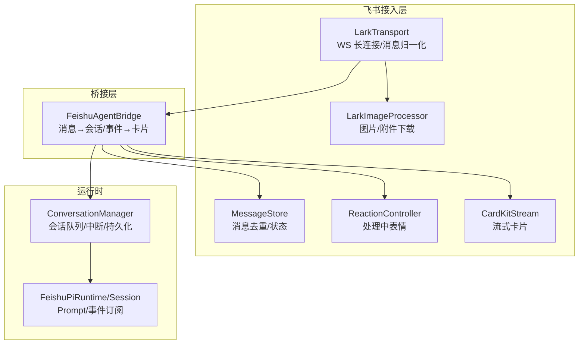
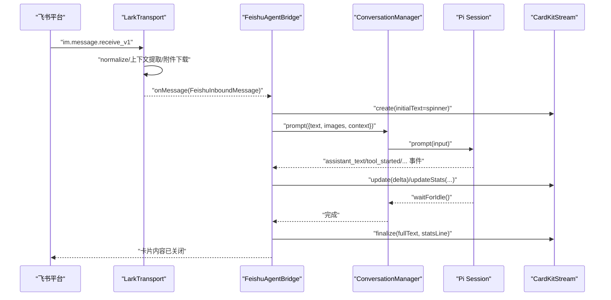
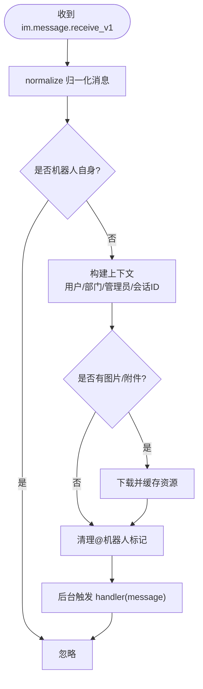
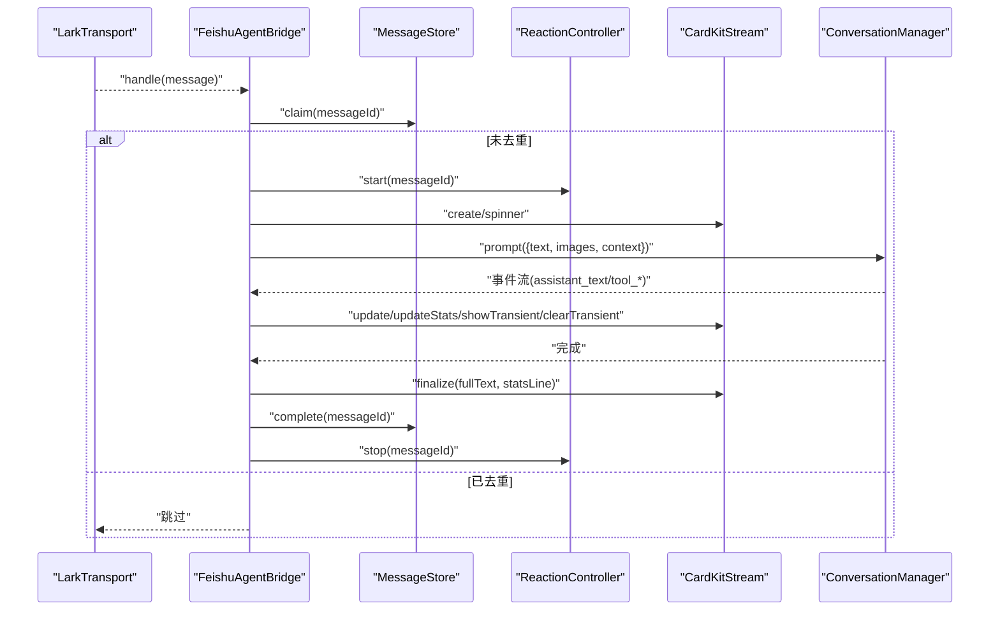
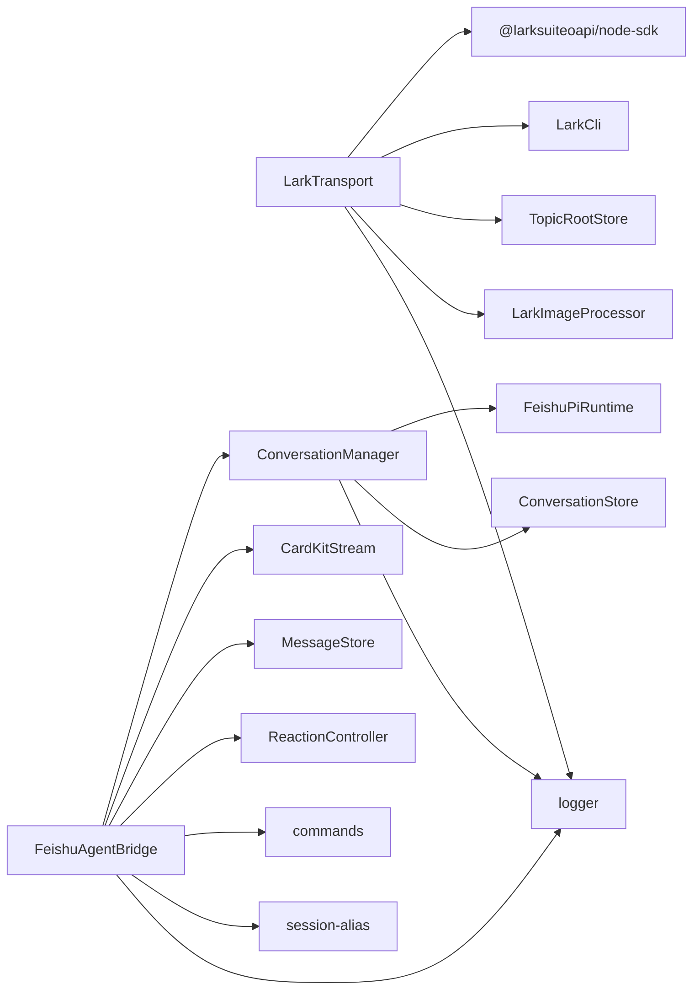

# 消息桥接层

<cite>
**本文引用的文件**
- [agent-bridge.ts](file://src/feishu/agent-bridge.ts)
- [lark-transport.ts](file://src/feishu/lark-transport.ts)
- [types.ts（飞书接入层）](file://src/feishu/types.ts)
- [message-store.ts](file://src/feishu/message-store.ts)
- [conversation-manager.ts](file://src/runtime/conversation-manager.ts)
- [cardkit-stream.ts](file://src/feishu/cardkit-stream.ts)
- [reaction-controller.ts](file://src/feishu/reaction-controller.ts)
- [image-processor.ts](file://src/feishu/image-processor.ts)
- [types.ts（运行时）](file://src/runtime/types.ts)
- [types.ts（上下文）](file://src/context/types.ts)
</cite>

## 目录
1. [简介](#简介)
2. [项目结构](#项目结构)
3. [核心组件](#核心组件)
4. [架构总览](#架构总览)
5. [详细组件分析](#详细组件分析)
6. [依赖关系分析](#依赖关系分析)
7. [性能与可靠性](#性能与可靠性)
8. [故障排查指南](#故障排查指南)
9. [结论](#结论)
10. [附录：扩展指南](#附录扩展指南)

## 简介
本章节面向“消息桥接层”，聚焦于将飞书消息与智能体会话进行双向转换的机制。重点包括：
- FeishuAgentBridge：负责入站消息到会话提示、事件流到卡片渲染、指令处理与状态收尾。
- LarkTransport：基于飞书底层 WSClient + EventDispatcher 的长连接传输，负责消息归一化、上下文提取、话题收敛、附件下载与卡片回调。
- 会话管理：ConversationManager 保证同一会话内顺序执行、并发打断与持久化恢复。
- 卡片流式更新：CardKitStream 提供高性能流式卡片渲染、节流与错误恢复。
- 可靠性：MessageStore 实现消息去重与失败保护；ReactionController 提供处理中表情反馈。
- 安全与权限：管理员校验、模型切换限制、文件名清洗等。

## 项目结构
消息桥接层位于 src/feishu 与 src/runtime 两个目录：
- feishu：接入层与传输层（LarkTransport）、桥接器（FeishuAgentBridge）、卡片流（CardKitStream）、图片处理（ImageProcessor）、反应控制器（ReactionController）、消息去重（MessageStore）。
- runtime：会话管理与类型定义（ConversationManager、FeishuPiSession、FeishuPiEvent 等）。

图表来源
- [lark-transport.ts:82-133](file://src/feishu/lark-transport.ts#L82-L133)
- [agent-bridge.ts:66-237](file://src/feishu/agent-bridge.ts#L66-L237)
- [conversation-manager.ts:65-96](file://src/runtime/conversation-manager.ts#L65-L96)
- [cardkit-stream.ts:57-152](file://src/feishu/cardkit-stream.ts#L57-L152)
- [message-store.ts:23-40](file://src/feishu/message-store.ts#L23-L40)
- [image-processor.ts:40-81](file://src/feishu/image-processor.ts#L40-L81)
- [reaction-controller.ts:67-99](file://src/feishu/reaction-controller.ts#L67-L99)

章节来源
- [lark-transport.ts:82-133](file://src/feishu/lark-transport.ts#L82-L133)
- [agent-bridge.ts:66-237](file://src/feishu/agent-bridge.ts#L66-L237)
- [conversation-manager.ts:65-96](file://src/runtime/conversation-manager.ts#L65-L96)

## 核心组件
- LarkTransport：建立并维护飞书 WebSocket 长连接，注册事件分发器，归一化消息，构造上下文，处理卡片回调，支持附件下载与卡片更新。
- FeishuAgentBridge：订阅传输层消息，解析指令，创建 CardKit 流式卡片，调用 ConversationManager 发起会话提示，根据事件流更新卡片正文与小字统计，最终关闭卡片并记录日志。
- ConversationManager：按 conversationId 管理会话，串行执行 prompt，支持新消息打断在途请求，持久化 session 文件以保障中断恢复。
- CardKitStream：封装飞书 CardKit v1 流式卡片 API，提供增量更新、替换、临时文本、统计小字写入、流式模式开关与自动重试。
- MessageStore：基于 JSON 存储的消息处理状态机，防止重复投递与重复执行。
- ReactionController：在处理消息时添加随机表情，完成后移除，提升交互体验。
- LarkImageProcessor：下载图片/附件并转换为 Pi 可用格式，支持本地缓存与 MIME 检测。

章节来源
- [lark-transport.ts:11-80](file://src/feishu/lark-transport.ts#L11-L80)
- [agent-bridge.ts:15-64](file://src/feishu/agent-bridge.ts#L15-L64)
- [conversation-manager.ts:22-54](file://src/runtime/conversation-manager.ts#L22-L54)
- [cardkit-stream.ts:20-55](file://src/feishu/cardkit-stream.ts#L20-L55)
- [message-store.ts:1-21](file://src/feishu/message-store.ts#L1-L21)
- [reaction-controller.ts:56-65](file://src/feishu/reaction-controller.ts#L56-L65)
- [image-processor.ts:24-38](file://src/feishu/image-processor.ts#L24-L38)

## 架构总览
消息从飞书进入，经 LarkTransport 归一化为统一结构，交由 FeishuAgentBridge 处理。Bridge 通过 ConversationManager 与运行时会话交互，使用 CardKitStream 实时渲染卡片正文与统计信息。附件与图片由 ImageProcessor 下载并注入上下文。ReactionController 提供处理中的表情反馈。MessageStore 确保消息不重复执行。

图表来源
- [lark-transport.ts:87-133](file://src/feishu/lark-transport.ts#L87-L133)
- [lark-transport.ts:141-248](file://src/feishu/lark-transport.ts#L141-L248)
- [agent-bridge.ts:71-237](file://src/feishu/agent-bridge.ts#L71-L237)
- [conversation-manager.ts:65-96](file://src/runtime/conversation-manager.ts#L65-L96)
- [cardkit-stream.ts:57-152](file://src/feishu/cardkit-stream.ts#L57-L152)

## 详细组件分析

### LarkTransport：WebSocket 连接管理、消息路由与上下文提取
- 连接管理：使用 WSClient + EventDispatcher 注册 im.message.receive_v1 与 card.action.trigger 事件；内置握手超时、ping 超时、重连与错误日志。
- 消息路由：normalize 归一化消息，过滤机器人自身消息，构造 conversationId（私聊/群聊/话题群），下载图片与附件，清理 @机器人 标记，记录用户输入日志。
- 上下文提取：获取用户 profile（openId、名称、部门），判断管理员身份，组装 FeishuContext（含 conversationId、chatId、threadId、isAdmin）。
- 卡片回调：解析 value（对象或 JSON 字符串），授权卡回调转交上层处理器；非管理员点击模型切换卡片返回拒绝提示；管理员切换后持久化模型名并更新卡片。
- 会话模式缓存：查询 chat_mode（p2p/group/topic），用于话题群会话收敛策略。
- 资源下载：统一将 image/file/audio/video/media 等资源下载为 Buffer，保存到本地缓存目录，并在消息文本中追加路径提示。

图表来源
- [lark-transport.ts:87-133](file://src/feishu/lark-transport.ts#L87-L133)
- [lark-transport.ts:141-248](file://src/feishu/lark-transport.ts#L141-L248)
- [lark-transport.ts:314-338](file://src/feishu/lark-transport.ts#L314-L338)
- [lark-transport.ts:365-372](file://src/feishu/lark-transport.ts#L365-L372)

章节来源
- [lark-transport.ts:82-133](file://src/feishu/lark-transport.ts#L82-L133)
- [lark-transport.ts:141-248](file://src/feishu/lark-transport.ts#L141-L248)
- [lark-transport.ts:250-312](file://src/feishu/lark-transport.ts#L250-L312)
- [lark-transport.ts:314-338](file://src/feishu/lark-transport.ts#L314-L338)
- [lark-transport.ts:365-372](file://src/feishu/lark-transport.ts#L365-L372)

### FeishuAgentBridge：消息到会话的转换与卡片渲染
- 入站消息处理：
  - 去重：通过 MessageStore.claim 避免重复执行 Agent。
  - 指令识别：匹配 /new、/stop、/detail 等指令，执行相应逻辑并发送卡片回复。
  - 表情反馈：开始处理时添加随机 reaction，完成后移除。
  - 卡片初始化：创建 CardKit 流式卡片，首帧显示 spinner 动画。
  - 会话提示：调用 ConversationManager.prompt，传入文本、图片与完整上下文。
  - 事件流处理：
    - assistant_text：首次真实内容到达时停止动画，清空累积器，增量推送 update。
    - tool_started/tool_finished：工具调用行在精简模式下临时显示，结束后清除；详细模式下永久保留；小字位置同步工具动画。
  - 收尾：计算本次新增 token、成本、耗时、上下文占用百分比，写入统计小字，关闭卡片，记录响应日志，标记消息完成。
- 错误处理：捕获异常，标记消息失败，关闭卡片并上抛原始错误。
- 命令卡片发送：直接调用飞书消息接口发送 interactive 卡片，附带幂等 uuid。

图表来源
- [agent-bridge.ts:71-237](file://src/feishu/agent-bridge.ts#L71-L237)
- [message-store.ts:23-40](file://src/feishu/message-store.ts#L23-L40)
- [reaction-controller.ts:67-99](file://src/feishu/reaction-controller.ts#L67-L99)
- [cardkit-stream.ts:57-152](file://src/feishu/cardkit-stream.ts#L57-L152)
- [conversation-manager.ts:65-96](file://src/runtime/conversation-manager.ts#L65-L96)

章节来源
- [agent-bridge.ts:71-237](file://src/feishu/agent-bridge.ts#L71-L237)
- [agent-bridge.ts:239-303](file://src/feishu/agent-bridge.ts#L239-L303)

### ConversationManager：会话队列、中断与持久化
- 会话复用：按 conversationId 获取或初始化会话状态，合并并发首次初始化。
- 顺序执行：每个会话维护一个 Promise 队列，确保消息顺序执行。
- 新消息打断：当新消息到达且当前 busy，先 abort 在途请求，再排队立即开始。
- 持久化：监听 session 事件，在首个 message_end 落盘后立即持久化映射，即使后续被中断也能恢复。
- 统计与清理：提供 getStats、clear、abort 等方法。

章节来源
- [conversation-manager.ts:22-54](file://src/runtime/conversation-manager.ts#L22-L54)
- [conversation-manager.ts:65-96](file://src/runtime/conversation-manager.ts#L65-L96)
- [conversation-manager.ts:98-117](file://src/runtime/conversation-manager.ts#L98-L117)

### CardKitStream：流式卡片渲染与节流
- 创建卡片：POST /open-apis/cardkit/v1/cards，启用 streaming_mode。
- 增量更新：PUT elements/content，带 sequence 与 uuid，内部节流最小间隔，避免频繁请求。
- 替换与临时文本：replace 覆盖全文；showTransient/clearTransient 附加临时文本（如工具调用行），避免闪烁。
- 统计小字：独立元素更新 stats。
- 关闭流程：等待客户端渲染完成，写入统计小字，关闭流式模式，最终内容不再覆盖正在渲染的文本。
- 错误恢复：官方约 10 分钟会关闭流式模式，PUT 失败时尝试重新开启并重试一次。

章节来源
- [cardkit-stream.ts:57-152](file://src/feishu/cardkit-stream.ts#L57-L152)
- [cardkit-stream.ts:159-246](file://src/feishu/cardkit-stream.ts#L159-L246)
- [cardkit-stream.ts:248-287](file://src/feishu/cardkit-stream.ts#L248-L287)

### 图片与附件处理：LarkImageProcessor
- 下载图片：调用 im.image.get，兼容不同 SDK 返回结构（Buffer、Uint8Array、ReadableStream、writeFile）。
- 批量处理：Promise.allSettled 并行处理多张图片，过滤失败项。
- 本地缓存：可选写入指定目录，便于调试与离线查看。
- MIME 检测：根据文件头识别 PNG/JPEG/GIF/WebP，默认 JPEG。

章节来源
- [image-processor.ts:40-81](file://src/feishu/image-processor.ts#L40-L81)
- [image-processor.ts:83-152](file://src/feishu/image-processor.ts#L83-L152)

### 消息去重与状态同步：MessageStore
- 状态机：processing/completed/failed，持久化到 JSON 文件。
- 认领逻辑：若已完成或仍在处理且未超过 TTL，则拒绝再次执行；否则标记 processing。
- 完成/失败：标记状态并落盘，避免重复投递导致重复执行 Agent。

章节来源
- [message-store.ts:1-49](file://src/feishu/message-store.ts#L1-L49)

### 安全性与权限控制
- 管理员校验：卡片回调仅允许管理员执行模型切换；非管理员点击返回拒绝提示。
- 模型切换持久化：将模型名写入 .env，并通知运行时热切换。
- 文件名清洗：下载附件时对文件名进行清洗，防止路径逃逸。
- 指令限制：话题内禁止 /new，避免共享会话被误清空。

章节来源
- [lark-transport.ts:250-312](file://src/feishu/lark-transport.ts#L250-L312)
- [lark-transport.ts:330-338](file://src/feishu/lark-transport.ts#L330-L338)
- [lark-transport.ts:425-428](file://src/feishu/lark-transport.ts#L425-L428)
- [agent-bridge.ts:249-262](file://src/feishu/agent-bridge.ts#L249-L262)

## 依赖关系分析
- LarkTransport 依赖：
  - @larksuiteoapi/node-sdk：WSClient、EventDispatcher、Client。
  - LarkCli：用户资料查询。
  - TopicRootStore：话题根持久化。
  - LarkImageProcessor：图片/附件下载。
  - logger：日志记录。
- FeishuAgentBridge 依赖：
  - ConversationManager：会话管理。
  - CardKitReply/CardKitStream：卡片流式更新。
  - MessageStore：消息去重。
  - ReactionController：表情反馈。
  - commands：指令注册与执行。
  - session-alias：会话别名展示。
  - logger：日志记录。
- ConversationManager 依赖：
  - FeishuPiRuntime：会话创建与管理。
  - ConversationStore：会话文件映射持久化。
  - logger：日志记录。

图表来源
- [lark-transport.ts:1-10](file://src/feishu/lark-transport.ts#L1-L10)
- [agent-bridge.ts:1-13](file://src/feishu/agent-bridge.ts#L1-L13)
- [conversation-manager.ts:1-5](file://src/runtime/conversation-manager.ts#L1-L5)

章节来源
- [lark-transport.ts:1-10](file://src/feishu/lark-transport.ts#L1-L10)
- [agent-bridge.ts:1-13](file://src/feishu/agent-bridge.ts#L1-L13)
- [conversation-manager.ts:1-5](file://src/runtime/conversation-manager.ts#L1-L5)

## 性能与可靠性
- 流式渲染性能：
  - CardKitStream 支持可配置的 printFrequencyMs（默认 30ms）与 printStep（默认 3），加快客户端打字机渲染。
  - 节流最小间隔（默认 800ms）减少网络请求频率。
  - 临时文本与正文分离，避免并发 patch 导致的闪烁。
- 连接可靠性：
  - WSClient 自带重连机制，提供 onReconnecting/onReconnected/onError 日志。
  - 卡片流式模式可能被关闭，CardKitStream 自动重试重新开启。
- 消息去重与失败保护：
  - MessageStore 基于 TTL 的 processing 状态，避免重复执行与卡住任务。
  - 错误路径标记 fail，防止立即重试风暴。
- 会话中断与恢复：
  - ConversationManager 支持新消息打断在途请求，并在首个 message_end 落盘后立即持久化映射，确保中断后可恢复。
- 资源下载优化：
  - 图片/附件批量下载使用 Promise.allSettled，单个失败不影响整体。
  - 本地缓存目录可选，便于调试与离线查看。

[本节为通用性能讨论，不直接分析具体文件]

## 故障排查指南
- WebSocket 连接问题：
  - 检查握手超时与 ping 超时配置，关注 onReconnecting/onReconnected/onError 日志。
  - 确认 appId/appSecret/source 配置正确。
- 消息归一化失败：
  - 检查 normalize 参数（botIdentity、stripBotMentions、includeRaw）。
  - 确认消息结构符合预期。
- 卡片回调超时：
  - 使用底层 WSClient 方式，handler 返回值原样进 ACK，避免高层封装吞事件。
  - 授权卡回调需在上层 PermissionBroker 中校验管理员身份。
- 卡片更新失败：
  - 优先按 messageId 更新，失败回退到 token 更新。
  - 流式模式可能被官方关闭，CardKitStream 会自动重试。
- 图片/附件下载失败：
  - 检查资源类型与 fileKey，确认缓存目录存在且可写。
  - 兼容不同 SDK 返回结构（Buffer、ReadableStream、writeFile）。
- 会话中断与恢复：
  - 确认 ConversationManager 的 persistSessionFile 在事件中被调用。
  - 检查 sessionFile 是否成功落盘与映射持久化。

章节来源
- [lark-transport.ts:87-133](file://src/feishu/lark-transport.ts#L87-L133)
- [lark-transport.ts:250-312](file://src/feishu/lark-transport.ts#L250-L312)
- [cardkit-stream.ts:168-192](file://src/feishu/cardkit-stream.ts#L168-L192)
- [image-processor.ts:83-152](file://src/feishu/image-processor.ts#L83-L152)
- [conversation-manager.ts:56-63](file://src/runtime/conversation-manager.ts#L56-L63)

## 结论
消息桥接层通过 LarkTransport 与 FeishuAgentBridge 协同工作，实现了飞书消息到智能体会话的高效转换。借助 ConversationManager 的会话队列与中断机制、CardKitStream 的流式渲染与节流、MessageStore 的去重与失败保护，系统在高并发与不稳定网络环境下仍能提供稳定可靠的交互体验。同时，通过管理员校验、文件名清洗与指令限制等措施，保障了安全性与可控性。

[本节为总结性内容，不直接分析具体文件]

## 附录：扩展指南
- 自定义消息处理器：
  - 在 FeishuAgentBridge.handle 中扩展指令识别与处理逻辑，或通过 CommandRegistry 注册额外指令。
  - 在 LarkTransport.dispatchMessage 中扩展上下文提取与附件处理逻辑。
- 自定义传输协议：
  - 实现 FeishuTransport 接口，替换 LarkTransport，适配其他平台或协议。
  - 保持 onMessage 回调契约，确保 Bridge 层无需改动。
- 自定义卡片渲染：
  - 扩展 CardKitStream 或替换为其他渲染后端，保持 update/close/stats 接口一致。
- 自定义会话管理：
  - 扩展 ConversationManager，支持更多会话策略（如跨群共享、多轮对话合并）。
- 自定义权限与审计：
  - 在 LarkTransport.handleCardAction 中扩展权限校验逻辑，记录审计日志。
- 监控与指标：
  - 在关键路径（连接、消息处理、卡片更新、资源下载）埋点，收集延迟、成功率与错误率。

[本节为概念性指导，不直接分析具体文件]