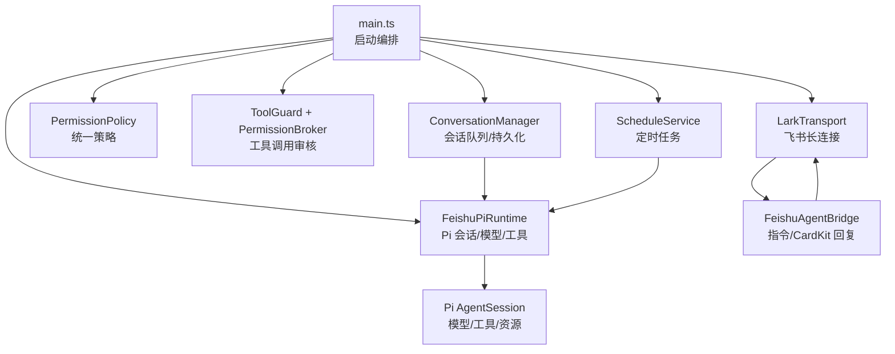
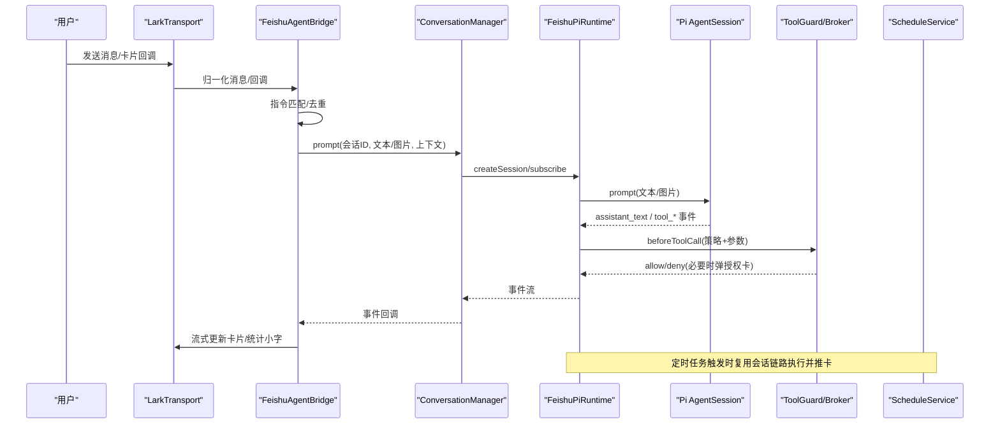
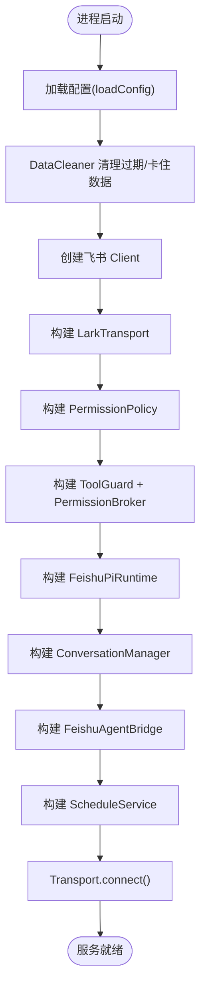
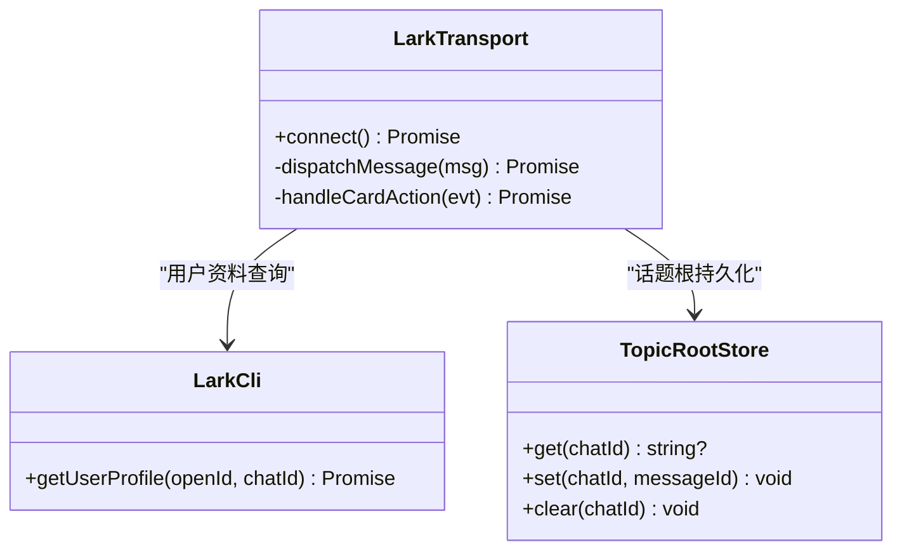
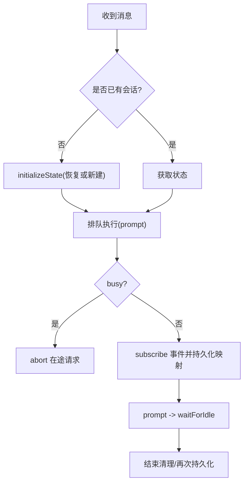
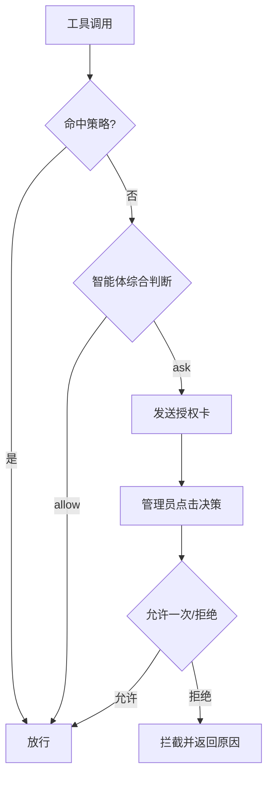
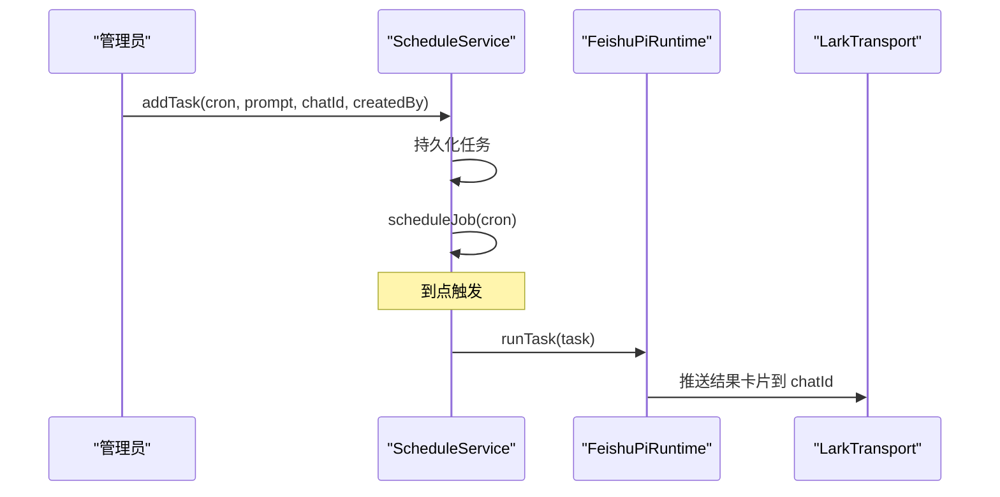
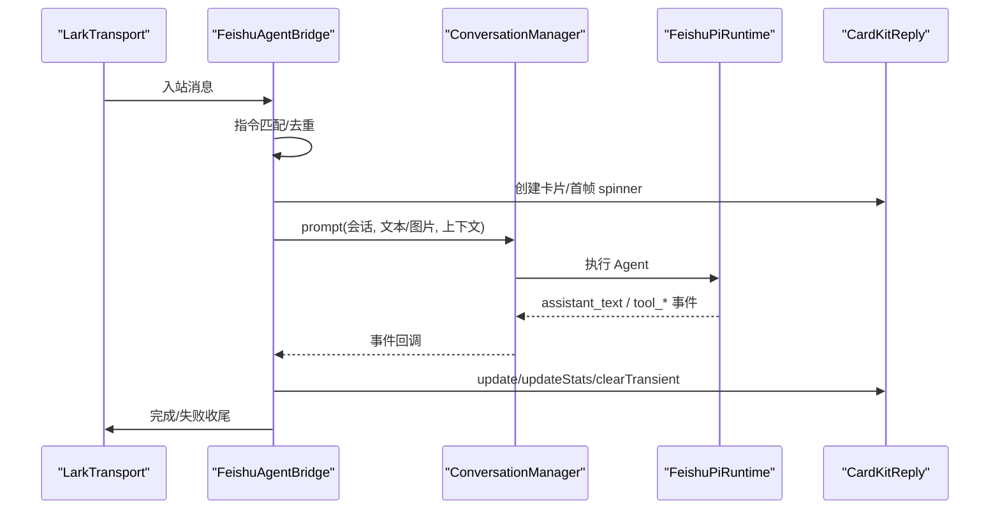
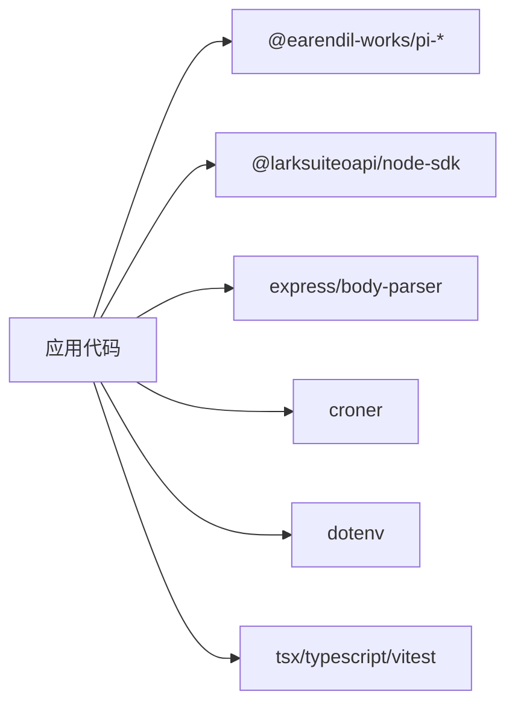

# 系统概览

<cite>
**本文引用的文件**
- [src/main.ts](file://src/main.ts)
- [package.json](file://package.json)
- [README.md](file://README.md)
- [docs/architecture.md](file://docs/architecture.md)
- [src/config.ts](file://src/config.ts)
- [src/feishu/lark-transport.ts](file://src/feishu/lark-transport.ts)
- [src/runtime/conversation-manager.ts](file://src/runtime/conversation-manager.ts)
- [src/permission/policy.ts](file://src/permission/policy.ts)
- [src/schedule/service.ts](file://src/schedule/service.ts)
- [src/guard/broker.ts](file://src/guard/broker.ts)
- [src/runtime/feishu-pi-runtime.ts](file://src/runtime/feishu-pi-runtime.ts)
- [src/feishu/agent-bridge.ts](file://src/feishu/agent-bridge.ts)
- [src/guard/tool-guard.ts](file://src/guard/tool-guard.ts)
- [src/config-server.ts](file://src/config-server.ts)
</cite>

## 目录
1. [简介](#简介)
2. [项目结构](#项目结构)
3. [核心组件](#核心组件)
4. [架构总览](#架构总览)
5. [详细组件分析](#详细组件分析)
6. [依赖分析](#依赖分析)
7. [性能考虑](#性能考虑)
8. [故障排查指南](#故障排查指南)
9. [结论](#结论)
10. [附录](#附录)

## 简介
mini-claw（仓库名 feishu-pi）是一个基于 Pi Agent 运行时、深度集成飞书身份与会话的轻量级 AI Agent 平台。其核心价值主张是：以最小自有代码实现“飞书消息 → 智能体执行 → 卡片回复”的闭环，同时提供按人/群隔离的会话、统一权限策略与工具调用审核、定时任务调度以及技能使用统计等能力。系统通过飞书长连接接收消息，经会话路由与上下文恢复后交由 Pi 运行智能体，最终通过 CardKit 流式卡片将结果实时推送回飞书会话。

## 项目结构
- 入口与启动：src/main.ts 负责加载配置、初始化数据清理、创建飞书 Client、构建传输层、权限策略、授权中枢、运行时、会话管理器、桥接器与定时任务服务，并启动优雅退出流程。
- 飞书集成层：src/feishu/* 包含 LarkTransport（WS 长连接、消息归一化、用户资料查询、附件下载）、AgentBridge（指令处理、CardKit 流式回复、表情反馈）、消息存储、主题根持久化等。
- 智能体运行时：src/runtime/* 封装 Pi Session、模型切换、资源加载、工具注册与事件映射。
- 权限控制系统：src/permission/policy.ts 解析统一策略文件；src/guard/* 实现工具调用 Guard、授权卡 Broker、卡片构建与判定逻辑。
- 定时任务调度：src/schedule/service.ts 基于 croner 管理持久化任务与触发执行。
- 配置与可视化：src/config-server.ts 提供本地 Web 配置页与 /stats 统计页面。
- 技术栈：TypeScript + Node.js，依赖 @larksuiteoapi/node-sdk、@earendil-works/pi-* 系列、express、croner、dotenv 等。

图表来源
- [src/main.ts:27-247](file://src/main.ts#L27-L247)
- [src/feishu/lark-transport.ts:82-133](file://src/feishu/lark-transport.ts#L82-L133)
- [src/runtime/conversation-manager.ts:22-96](file://src/runtime/conversation-manager.ts#L22-L96)
- [src/runtime/feishu-pi-runtime.ts:147-200](file://src/runtime/feishu-pi-runtime.ts#L147-L200)
- [src/schedule/service.ts:116-123](file://src/schedule/service.ts#L116-L123)
- [src/feishu/agent-bridge.ts:66-69](file://src/feishu/agent-bridge.ts#L66-L69)

章节来源
- [src/main.ts:27-247](file://src/main.ts#L27-L247)
- [package.json:1-34](file://package.json#L1-L34)
- [docs/architecture.md:19-33](file://docs/architecture.md#L19-L33)

## 核心组件
- 飞书集成层（LarkTransport）：基于官方底层 WSClient + EventDispatcher 建立长连接，归一化消息、下载附件、构造 conversationId、路由卡片回调。
- 智能体运行时（FeishuPiRuntime）：创建/恢复 Pi Session，注入模型、资源加载、工具注册与 beforeToolCall 钩子，支持运行时模型切换。
- 权限控制系统（PermissionPolicy + ToolGuard + PermissionBroker）：统一策略文件驱动两档身份（owner/user），工具调用三层判定（策略 → 智能体综合判断 → 授权卡）。
- 会话管理（ConversationManager）：按用户或话题隔离会话，Promise 队列串行执行，增量持久化映射，支持中断与恢复。
- 定时任务（ScheduleService）：持久化任务表，cron 调度，触发时以创建者身份在独立会话执行并推送结果卡片。
- 桥接与回复（FeishuAgentBridge + CardKit）：指令路由、随机表情、流式卡片更新、统计小字、详细/精简模式。

章节来源
- [src/feishu/lark-transport.ts:82-200](file://src/feishu/lark-transport.ts#L82-L200)
- [src/runtime/feishu-pi-runtime.ts:147-200](file://src/runtime/feishu-pi-runtime.ts#L147-L200)
- [src/permission/policy.ts:68-158](file://src/permission/policy.ts#L68-L158)
- [src/guard/tool-guard.ts:27-95](file://src/guard/tool-guard.ts#L27-L95)
- [src/guard/broker.ts:46-166](file://src/guard/broker.ts#L46-L166)
- [src/runtime/conversation-manager.ts:22-96](file://src/runtime/conversation-manager.ts#L22-L96)
- [src/schedule/service.ts:105-123](file://src/schedule/service.ts#L105-L123)
- [src/feishu/agent-bridge.ts:66-200](file://src/feishu/agent-bridge.ts#L66-L200)

## 架构总览
系统采用分层设计：飞书消息进入传输层，经会话路由与上下文恢复后进入 Agent 运行时，工具调用经过权限策略与 Guard 审核，最终通过 CardKit 流式卡片返回结果。

图表来源
- [src/feishu/lark-transport.ts:82-133](file://src/feishu/lark-transport.ts#L82-L133)
- [src/feishu/agent-bridge.ts:66-200](file://src/feishu/agent-bridge.ts#L66-L200)
- [src/runtime/conversation-manager.ts:65-96](file://src/runtime/conversation-manager.ts#L65-L96)
- [src/runtime/feishu-pi-runtime.ts:147-200](file://src/runtime/feishu-pi-runtime.ts#L147-L200)
- [src/guard/tool-guard.ts:36-95](file://src/guard/tool-guard.ts#L36-L95)
- [src/schedule/service.ts:116-123](file://src/schedule/service.ts#L116-L123)

## 详细组件分析

### 启动流程（从 main.ts 到各组件初始化）
- 加载配置与环境变量，初始化消息存储与数据清理（过期数据与卡住消息）。
- 创建飞书 Client，自动获取 Bot Open ID，解析管理员 Open ID。
- 构建 LarkTransport（长连接、消息归一化、附件下载、卡片回调路由）。
- 构建 PermissionPolicy（读取 .agent/permissions.json），构建 PermissionBroker（授权卡发送/更新/撤回）与 ToolGuard（策略→智能体→授权卡）。
- 构建 FeishuPiRuntime（模型、资源加载、工具注册、beforeToolCall 钩子）。
- 构建 ConversationManager（会话队列、增量持久化）。
- 构建 FeishuAgentBridge（指令、CardKit 流式回复、表情反馈）。
- 启动 ScheduleService（恢复并调度已启用任务）。
- 启动 Transport 连接，打印配置页面地址，注册优雅退出信号处理。

图表来源
- [src/main.ts:27-247](file://src/main.ts#L27-L247)
- [src/config.ts:24-51](file://src/config.ts#L24-L51)

章节来源
- [src/main.ts:27-247](file://src/main.ts#L27-L247)
- [src/config.ts:24-51](file://src/config.ts#L24-L51)

### 飞书集成层（LarkTransport）
- 使用官方底层 WSClient + EventDispatcher 建立长连接，避免高层 LarkChannel 的 ACK 与去重问题。
- 消息归一化：过滤机器人自身消息、查询用户资料、构造 conversationId、下载图片/文件附件、清洗 @ 标记。
- 卡片回调路由：授权卡转发给管理员、模型切换按钮校验管理员并热切换。

图表来源
- [src/feishu/lark-transport.ts:42-80](file://src/feishu/lark-transport.ts#L42-L80)
- [src/feishu/lark-transport.ts:82-200](file://src/feishu/lark-transport.ts#L82-L200)

章节来源
- [src/feishu/lark-transport.ts:82-200](file://src/feishu/lark-transport.ts#L82-L200)

### 会话层（ConversationManager）
- 按 conversationId 复用 Pi Session，私聊/普通群按用户隔离，话题群按话题共享。
- 新消息到达时打断在途请求（abort），同一会话内串行执行。
- 首个 message_end 事件即持久化 sessionFile 映射，确保中断后可恢复。

图表来源
- [src/runtime/conversation-manager.ts:33-96](file://src/runtime/conversation-manager.ts#L33-L96)

章节来源
- [src/runtime/conversation-manager.ts:33-96](file://src/runtime/conversation-manager.ts#L33-L96)

### 权限控制（PermissionPolicy + ToolGuard + PermissionBroker）
- 统一策略文件定义 common/owner/user 组的能力范围（tools/bash/read/write/skills），生效范围为并集。
- 工具调用 Guard 三层判定：命中策略免审放行；未命中则智能体综合判断；仍不确定则弹授权卡由负责人单次确认。
- 授权卡服务端校验：唯一 approvalId + token，点击者必须为管理员，卡片来源需匹配，决策后收尾（精简模式撤回，详细模式更新结果卡）。

图表来源
- [src/permission/policy.ts:68-158](file://src/permission/policy.ts#L68-L158)
- [src/guard/tool-guard.ts:36-95](file://src/guard/tool-guard.ts#L36-L95)
- [src/guard/broker.ts:78-166](file://src/guard/broker.ts#L78-L166)

章节来源
- [src/permission/policy.ts:68-158](file://src/permission/policy.ts#L68-L158)
- [src/guard/tool-guard.ts:36-95](file://src/guard/tool-guard.ts#L36-L95)
- [src/guard/broker.ts:78-166](file://src/guard/broker.ts#L78-L166)

### 定时任务（ScheduleService）
- 任务持久化在 data/schedules.json，服务启动后恢复已启用任务的调度。
- 触发时以创建者身份在独立会话执行，输出以卡片推回目标会话；失败记录 lastStatus。
- 支持添加/删除/启停/立即触发等操作。

图表来源
- [src/schedule/service.ts:131-150](file://src/schedule/service.ts#L131-L150)
- [src/schedule/service.ts:191-200](file://src/schedule/service.ts#L191-L200)

章节来源
- [src/schedule/service.ts:131-150](file://src/schedule/service.ts#L131-L150)
- [src/schedule/service.ts:191-200](file://src/schedule/service.ts#L191-L200)

### 桥接与回复（FeishuAgentBridge + CardKit）
- 指令路由：/model、/perm、/help、/new、/stop、/detail on|off。
- 流式卡片：创建 streaming_mode 卡片实体，增量 PUT/PATCH 更新，处理官方自动关流重试。
- 表情反馈：处理中标记随机表情，完成后移除。
- 统计小字：显示模型、上下文 token、费用、耗时与会话短别名；工具调用期间显示动画。

图表来源
- [src/feishu/agent-bridge.ts:66-200](file://src/feishu/agent-bridge.ts#L66-L200)
- [src/runtime/conversation-manager.ts:65-96](file://src/runtime/conversation-manager.ts#L65-L96)

章节来源
- [src/feishu/agent-bridge.ts:66-200](file://src/feishu/agent-bridge.ts#L66-L200)

## 依赖分析
- 运行时底座：@earendil-works/pi-coding-agent、pi-agent-core、pi-ai（模型流、Session、工具循环、Provider 适配）。
- 飞书 SDK：@larksuiteoapi/node-sdk（底层 WSClient + EventDispatcher）。
- Web 配置与统计：express、body-parser。
- 定时任务：croner。
- 环境变量：dotenv。
- 开发工具：tsx、typescript、vitest、vite。

图表来源
- [package.json:14-32](file://package.json#L14-L32)

章节来源
- [package.json:14-32](file://package.json#L14-L32)

## 性能考虑
- 长连接与自动重连：WSClient 自带重连，设置握手与 ping 超时，降低断线影响。
- 会话串行与中断：同一会话内消息排队，新消息可 abort 在途请求，避免阻塞。
- 增量持久化：首个 message_end 即落盘映射，缩短恢复时间。
- 流式卡片：800ms 节流与写队列串行化，减少频繁写入开销。
- 数据清理：启动与每日定时清理过期会话、图片与消息，控制磁盘增长。

[本节为通用指导，不直接分析具体文件]

## 故障排查指南
- 无法接收消息：检查 WS 连接日志与重连提示；确认事件订阅与回调路由。
- 授权卡无效：核对 approvalId/token、卡片来源、点击者是否为管理员；服务重启后旧卡会失效。
- 会话丢失：检查 conversations.json 映射与 sessionFile 是否存在；异常打开时会自动新建会话。
- 定时任务未触发：验证 cron 表达式与任务 enabled 状态；查看 lastStatus 与 lastError。
- 配置保存失败：确认 .env 文件读写权限；仅 MANAGED_KEYS 会被表单覆盖，其他键保留。

章节来源
- [src/feishu/lark-transport.ts:82-133](file://src/feishu/lark-transport.ts#L82-L133)
- [src/guard/broker.ts:131-166](file://src/guard/broker.ts#L131-L166)
- [src/runtime/conversation-manager.ts:42-63](file://src/runtime/conversation-manager.ts#L42-L63)
- [src/schedule/service.ts:131-150](file://src/schedule/service.ts#L131-L150)
- [src/config-server.ts:110-120](file://src/config-server.ts#L110-L120)

## 结论
mini-claw 以 Pi 为运行时底座，聚焦飞书场景下的身份上下文、会话隔离、权限管控与工具审核，配合 CardKit 流式卡片与定时任务，形成稳定、可控且易扩展的 Agent 平台。通过统一策略与三层 Guard，系统在灵活性与安全性之间取得平衡；通过会话管理与数据清理，保障长期运行的可靠性。开发者可在该基础上按需扩展业务工具与记忆能力。

[本节为总结性内容，不直接分析具体文件]

## 附录
- 技术栈选择理由：
  - TypeScript/Node.js：类型安全与生态成熟，便于快速迭代。
  - 飞书 SDK：官方底层连接保证稳定性与回调行为一致。
  - Pi Agent：复用成熟的模型流、Session、工具循环与 Provider 适配，避免重复造轮子。
- 关键依赖说明：
  - @larksuiteoapi/node-sdk：长连接与消息/卡片 API。
  - @earendil-works/pi-*：Agent 运行时与编码工具。
  - express/body-parser：本地配置与统计页面。
  - croner：定时任务调度。
  - dotenv：环境变量加载。

[本节为概念性内容，不直接分析具体文件]