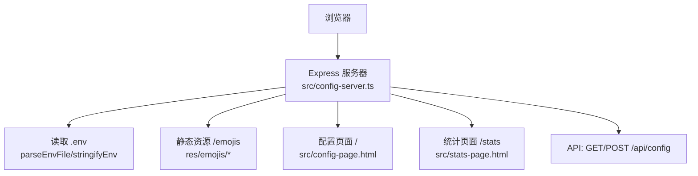
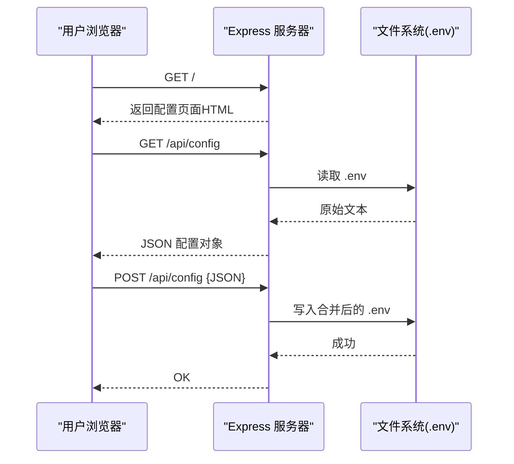
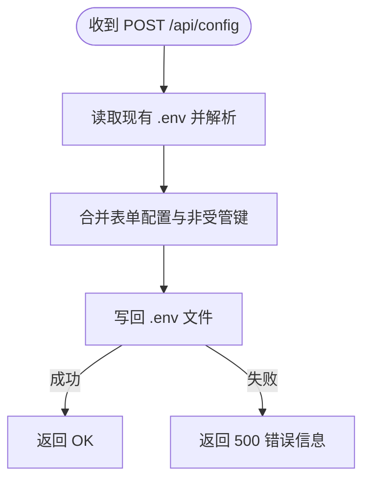
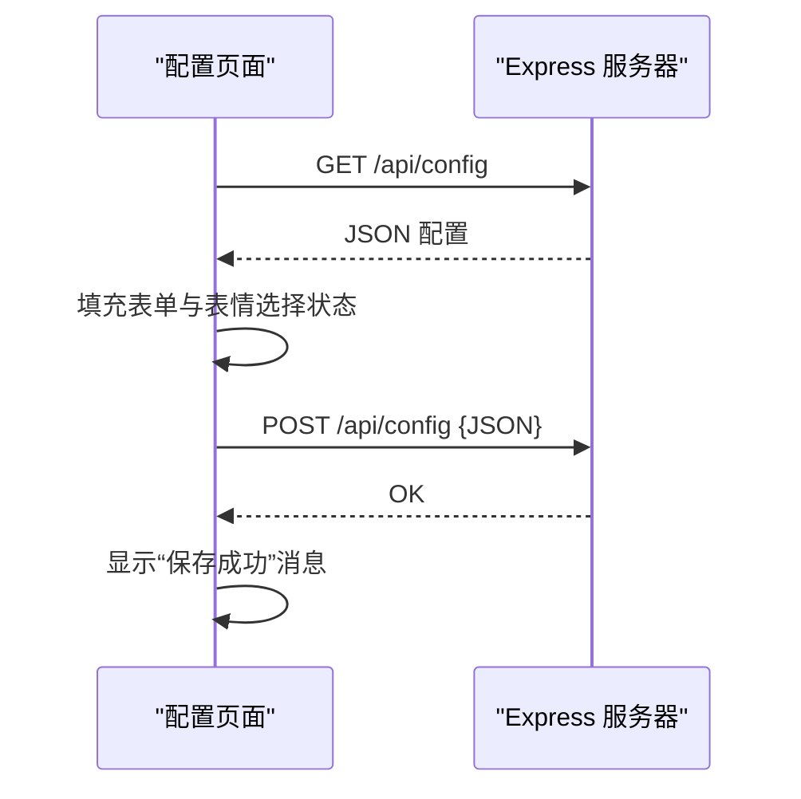
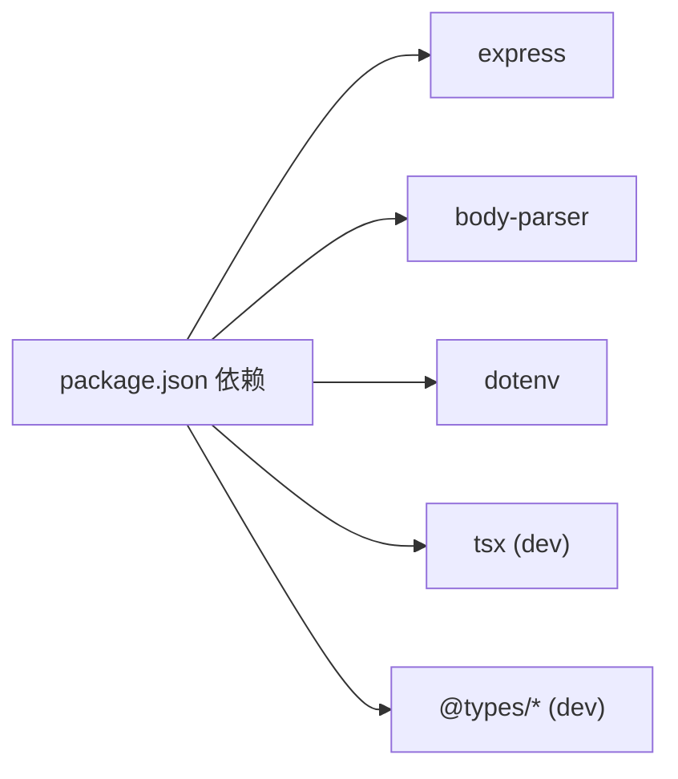

# Web配置服务器

<cite>
**本文引用的文件**
- [src/config-server.ts](file://src/config-server.ts)
- [src/config-page.html](file://src/config-page.html)
- [src/stats-page.html](file://src/stats-page.html)
- [src/config.ts](file://src/config.ts)
- [package.json](file://package.json)
</cite>

## 目录
1. [简介](#简介)
2. [项目结构](#项目结构)
3. [核心组件](#核心组件)
4. [架构总览](#架构总览)
5. [详细组件分析](#详细组件分析)
6. [依赖关系分析](#依赖关系分析)
7. [性能考虑](#性能考虑)
8. [故障排查指南](#故障排查指南)
9. [结论](#结论)
10. [附录：API 接口文档](#附录api-接口文档)

## 简介
本仓库包含一个基于 Express.js 的轻量级 Web 配置服务器，提供可视化界面用于编辑 .env 配置文件，并暴露 RESTful API 以获取和保存配置。该服务仅监听本地回环地址（127.0.0.1），避免将明文敏感信息暴露到局域网或公网。同时提供静态资源托管（表情图片）与技能使用统计页面。

## 项目结构
- 配置服务器入口与路由：src/config-server.ts
- 配置表单前端页面：src/config-page.html
- 技能统计页面：src/stats-page.html
- 应用启动时读取的环境变量映射：src/config.ts
- 脚本与依赖定义：package.json
- 静态资源：res/emojis（由服务器通过 /emojis 路径提供）

图表来源
- [src/config-server.ts:12-21](file://src/config-server.ts#L12-L21)
- [src/config-server.ts:94-120](file://src/config-server.ts#L94-L120)

章节来源
- [src/config-server.ts:12-21](file://src/config-server.ts#L12-L21)
- [package.json:6-12](file://package.json#L6-L12)

## 核心组件
- 配置服务器（Express 应用）
  - 中间件：JSON 与 URL 编码解析
  - 静态资源：/emojis 指向 res/emojis
  - 路由：
    - GET /：返回配置页面 HTML
    - GET /api/config：读取 .env 并解析为 JSON
    - POST /api/config：接收 JSON 配置，合并保留非受管键后写回 .env
    - GET /stats：返回统计页面 HTML
    - GET /api/stats/events：返回事件与用户展示名映射（需外部注册 SkillUsageStore）
- 配置页面前端（config-page.html）
  - 加载 /api/config 填充表单
  - 提交表单至 /api/config 保存
  - 管理随机表情选择（FEISHU_RANDOM_EMOJIS）
- 环境变量与运行时配置（config.ts）
  - 定义 FeishuPiAppConfig 类型
  - loadConfig 从 process.env 读取并校验必填项，供主程序启动时使用

章节来源
- [src/config-server.ts:16-21](file://src/config-server.ts#L16-L21)
- [src/config-server.ts:94-143](file://src/config-server.ts#L94-L143)
- [src/config-page.html:131-270](file://src/config-page.html#L131-L270)
- [src/config.ts:1-51](file://src/config.ts#L1-L51)

## 架构总览
Web 配置服务器采用前后端同进程部署：Express 负责渲染页面、提供 API 以及读写 .env；前端通过 fetch 调用后端 API 完成配置的读取与保存。敏感配置（如 App Secret、API Key）在 .env 中明文存储，因此服务必须限制访问范围（仅本机）。

图表来源
- [src/config-server.ts:94-120](file://src/config-server.ts#L94-L120)

## 详细组件分析

### 配置服务器（Express）
- 监听地址与端口
  - 仅监听 127.0.0.1:3456，防止外部网络访问
- 中间件
  - body-parser：支持 JSON 与 URL-encoded 请求体
- 静态资源
  - /emojis 映射到 res/emojis 目录，供前端表情网格加载图片
- 配置解析与序列化
  - parseEnvFile：忽略注释与空行，按 key=value 解析
  - stringifyEnv：按固定顺序输出受管键，并保留非受管键（如 FEISHU_GUARD_*、FEISHU_TEAM_MEMBERS 等），确保保存时不丢失
- 路由
  - GET /：返回配置页面
  - GET /api/config：读取并返回 .env 内容（JSON）
  - POST /api/config：接收配置对象，合并后写回 .env
  - GET /stats：返回统计页面
  - GET /api/stats/events：返回事件列表与用户展示名映射（需外部注册 SkillUsageStore）

图表来源
- [src/config-server.ts:26-88](file://src/config-server.ts#L26-L88)
- [src/config-server.ts:110-120](file://src/config-server.ts#L110-L120)

章节来源
- [src/config-server.ts:12-21](file://src/config-server.ts#L12-L21)
- [src/config-server.ts:26-88](file://src/config-server.ts#L26-L88)
- [src/config-server.ts:94-143](file://src/config-server.ts#L94-L143)

### 配置页面前端（config-page.html）
- 页面布局
  - 飞书应用配置区：App ID、App Secret（密码输入框）、管理员标识
  - AI 模型配置区：提供商、模型名称、Base URL
  - API Key 区：模型 API Key（密码输入框）
  - 系统提示词区：可选
  - 随机表情配置区：网格展示 res/emojis 下的图片，支持全选/反选/全不选
- 交互逻辑
  - 页面加载时调用 GET /api/config 填充表单
  - 提交表单时构造 JSON 并 POST 到 /api/config
  - 表情选择结果写入隐藏字段 FEISHU_RANDOM_EMOJIS（逗号分隔）
  - 密码显示切换按钮提升易用性

图表来源
- [src/config-page.html:210-260](file://src/config-page.html#L210-L260)
- [src/config-server.ts:99-120](file://src/config-server.ts#L99-L120)

章节来源
- [src/config-page.html:47-128](file://src/config-page.html#L47-L128)
- [src/config-page.html:131-270](file://src/config-page.html#L131-L270)

### 环境变量与运行时配置（config.ts）
- 类型定义：FeishuPiAppConfig 描述应用所需配置项
- 读取逻辑：loadConfig 从 process.env 读取，并对必填项进行校验，缺失则抛出错误
- 与配置服务器的关系：配置服务器修改 .env 后，需要重启主服务才能生效（因为主服务启动时读取环境变量）

章节来源
- [src/config.ts:1-51](file://src/config.ts#L1-L51)

### 静态资源管理（表情图片）
- 路径：/emojis/<name>.png
- 目录：res/emojis
- 前端通过相对路径加载图片，无需额外构建步骤

章节来源
- [src/config-server.ts:20-21](file://src/config-server.ts#L20-L21)
- [src/config-page.html:159-170](file://src/config-page.html#L159-L170)

## 依赖关系分析
- 运行时依赖
  - express：HTTP 框架
  - body-parser：请求体解析
  - dotenv：主程序可能用于加载 .env（配置服务器直接读写 .env 文件）
- 开发依赖
  - tsx：TypeScript 运行器
  - typescript、@types/*：类型检查与声明
- 脚本
  - npm run config：启动配置服务器
  - npm start：启动主程序

图表来源
- [package.json:14-32](file://package.json#L14-L32)

章节来源
- [package.json:6-12](file://package.json#L6-L12)
- [package.json:14-32](file://package.json#L14-L32)

## 性能考虑
- I/O 操作
  - 每次请求都会读取或写入 .env 文件，属于磁盘 I/O，在高并发场景下可能成为瓶颈
- 建议
  - 控制并发：配置服务器仅用于本地运维，不建议对外暴露高并发访问
  - 缓存策略：可在内存中缓存 .env 解析结果并在一定时间内复用，减少频繁磁盘读取（当前实现未内置）
  - 原子写入：可引入临时文件 + 重命名方式避免部分写入导致的不一致（当前实现直接覆盖）

[本节为通用指导，不直接分析具体文件]

## 故障排查指南
- 无法读取 .env
  - 检查 .env 是否存在于工作目录根路径
  - 确认 Node 进程对该文件具有读权限
- 保存配置失败
  - 检查工作目录是否对 Node 进程有写权限
  - 检查磁盘空间与文件系统权限
- 页面无法加载表情图片
  - 确认 res/emojis 目录下存在对应图片文件
  - 确认浏览器能访问 /emojis 路径（本地环境默认可用）
- 配置未生效
  - 修改 .env 后需重启主服务，因为主服务在启动时读取环境变量

章节来源
- [src/config-server.ts:99-120](file://src/config-server.ts#L99-L120)

## 结论
该 Web 配置服务器以最小化依赖实现了 .env 可视化管理与基础统计页面，适合本地运维场景。通过仅监听本地回环地址保障安全，结合受管键与非受管键的合并策略，既简化了常用配置编辑，又避免了破坏其他自定义环境变量。对于生产环境，建议增加鉴权、审计与更严格的访问控制。

[本节为总结性内容，不直接分析具体文件]

## 附录：API 接口文档

### 获取配置
- 方法：GET
- 路径：/api/config
- 请求头：无特殊要求
- 响应体：JSON 对象，键值对形式表示 .env 中的配置项
- 状态码：
  - 200：成功
  - 500：读取失败（附带错误信息）

示例响应（示意）
- {"FEISHU_APP_ID":"...","FEISHU_APP_SECRET":"...","FEISHU_PI_MODEL_API_KEY":"..."}

章节来源
- [src/config-server.ts:99-108](file://src/config-server.ts#L99-L108)

### 保存配置
- 方法：POST
- 路径：/api/config
- 请求头：Content-Type: application/json
- 请求体：JSON 对象，包含要更新的配置项（仅 MANAGED_KEYS 会被写入）
- 响应体：纯文本 "OK"
- 状态码：
  - 200：成功
  - 500：保存失败（附带错误信息）

注意事项
- 非受管键（如 FEISHU_GUARD_*、FEISHU_TEAM_MEMBERS 等）会在保存时被保留，不会被清空
- 修改 .env 后需重启主服务以生效

章节来源
- [src/config-server.ts:110-120](file://src/config-server.ts#L110-L120)

### 其他页面与接口
- GET /：返回配置页面 HTML
- GET /stats：返回统计页面 HTML
- GET /api/stats/events：返回事件列表与用户展示名映射（需外部注册 SkillUsageStore）

章节来源
- [src/config-server.ts:94-97](file://src/config-server.ts#L94-L97)
- [src/config-server.ts:124-143](file://src/config-server.ts#L124-L143)