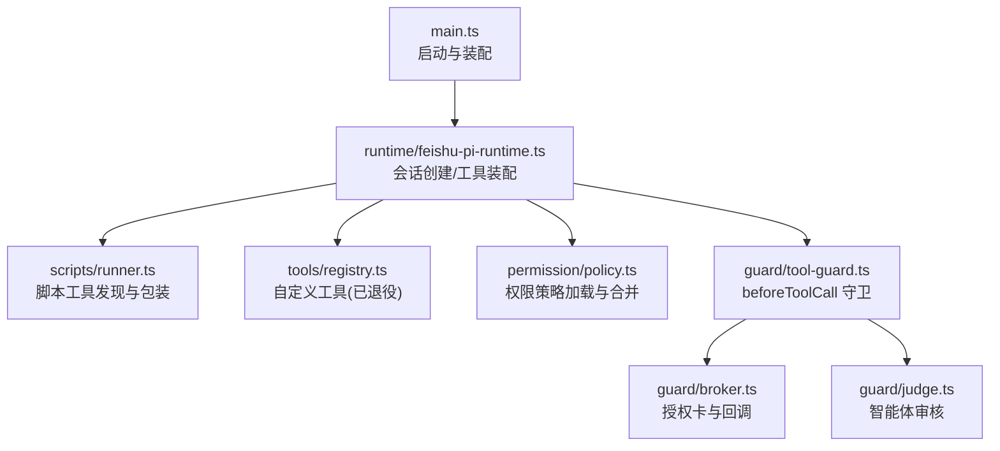
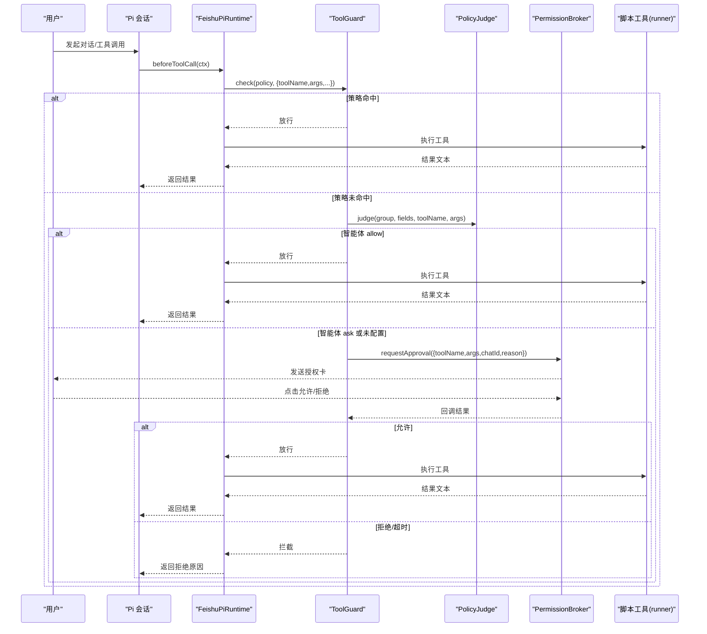
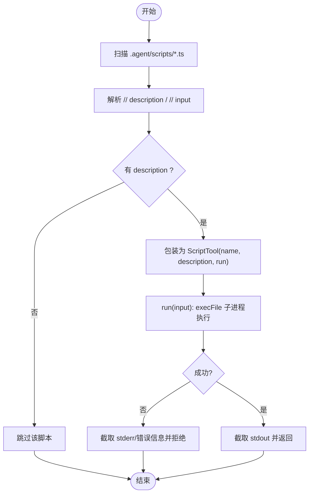
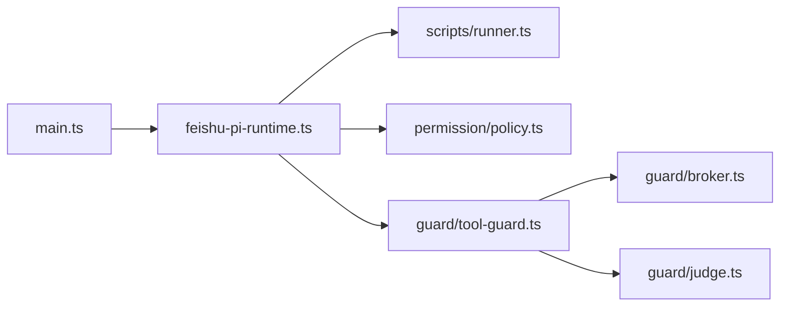

# 工具注册表系统

<cite>
**本文引用的文件**
- [src/tools/registry.ts](file://src/tools/registry.ts)
- [src/scripts/runner.ts](file://src/scripts/runner.ts)
- [src/runtime/types.ts](file://src/runtime/types.ts)
- [src/runtimе/feishu-pi-runtime.ts](file://src/runtime/feishu-pi-runtime.ts)
- [src/guard/tool-guard.ts](file://src/guard/tool-guard.ts)
- [src/guard/broker.ts](file://src/guard/broker.ts)
- [src/guard/judge.ts](file://src/guard/judge.ts)
- [src/permission/policy.ts](file://src/permission/policy.ts)
- [src/main.ts](file://src/main.ts)
- [package.json](file://package.json)
- [README.md](file://README.md)
</cite>

## 目录
1. [简介](#简介)
2. [项目结构](#项目结构)
3. [核心组件](#核心组件)
4. [架构总览](#架构总览)
5. [详细组件分析](#详细组件分析)
6. [依赖关系分析](#依赖关系分析)
7. [性能考量](#性能考量)
8. [故障排查指南](#故障排查指南)
9. [结论](#结论)
10. [附录](#附录)

## 简介
本文件系统性地梳理并文档化“工具注册表系统”，覆盖工具的动态加载、生命周期管理、注册流程（元数据定义、依赖解析、版本兼容性）、调用协议（参数验证、错误处理、结果序列化）、扩展开发指南（接口规范、最佳实践、调试技巧）、权限控制（访问策略、执行沙箱、资源限制）、热重载机制，以及工具市场集成方案。内容基于仓库现有实现与约定进行归纳，确保与实际代码一致。

## 项目结构
- 入口与运行时：
  - 主程序负责启动服务、初始化传输层、会话、权限策略、Guard、调度等，并在创建会话时组装可用的工具集合。
- 工具发现与加载：
  - 脚本工具：位于 .agent/scripts/*.ts，通过 runner.ts 扫描并包装为可注册工具。
  - 自定义工具（历史）：位于 .agent/tools/*.ts/.js，由 registry.ts 动态导入；当前已退役，统一迁移到 scripts。
- 权限与守卫：
  - 权限策略：.agent/permissions.json 驱动组策略合并与判定。
  - 工具守卫：beforeToolCall 钩子，按策略→智能体→授权卡三层决策。
  - 授权中枢：PermissionBroker 管理授权卡片、回调校验与超时处理。
- 类型与事件：
  - runtime/types.ts 定义了运行时配置、会话事件、工具类型等。



图表来源
- [src/main.ts:211-224](file://src/main.ts#L211-L224)
- [src/runtime/feishu-pi-runtime.ts:173-197](file://src/runtime/feishu-pi-runtime.ts#L173-L197)
- [src/scripts/runner.ts:31-60](file://src/scripts/runner.ts#L31-L60)
- [src/tools/registry.ts:13-45](file://src/tools/registry.ts#L13-L45)
- [src/permission/policy.ts:109-157](file://src/permission/policy.ts#L109-L157)
- [src/guard/tool-guard.ts:36-71](file://src/guard/tool-guard.ts#L36-L71)
- [src/guard/broker.ts:78-129](file://src/guard/broker.ts#L78-L129)
- [src/guard/judge.ts:55-66](file://src/guard/judge.ts#L55-L66)

章节来源
- [src/main.ts:211-224](file://src/main.ts#L211-L224)
- [src/runtime/feishu-pi-runtime.ts:173-197](file://src/runtime/feishu-pi-runtime.ts#L173-L197)
- [src/scripts/runner.ts:31-60](file://src/scripts/runner.ts#L31-L60)
- [src/tools/registry.ts:13-45](file://src/tools/registry.ts#L13-L45)
- [src/permission/policy.ts:109-157](file://src/permission/policy.ts#L109-L157)
- [src/guard/tool-guard.ts:36-71](file://src/guard/tool-guard.ts#L36-L71)
- [src/guard/broker.ts:78-129](file://src/guard/broker.ts#L78-L129)
- [src/guard/judge.ts:55-66](file://src/guard/judge.ts#L55-L66)

## 核心组件
- 脚本工具加载器（scripts/runner.ts）
  - 扫描 .agent/scripts/*.ts，解析顶部注释的 description 与 input 示例，封装为 ScriptTool，提供 run(input) 执行能力。
  - 执行采用子进程方式，带超时与输出截断，失败返回错误信息。
- 工具注册表（tools/registry.ts）
  - 支持从 .agent/tools 动态导入模块（已退役），兼容默认导出或命名导出，要求具备 name 与 execute。
  - 对外暴露 createToolRegistryAsync 用于组合自定义工具与传入工具列表。
- 运行时装配（runtime/feishu-pi-runtime.ts）
  - 在创建会话时加载基础 ResourceLoader、脚本工具，并按权限策略过滤后注入 Pi 会话。
  - 注入技能使用统计查询工具与定时任务管理工具（负责人）。
  - 设置 beforeToolCall 钩子，接入 ToolGuard。
- 权限策略（permission/policy.ts）
  - 读取 .agent/permissions.json，合并 common 与各用户组策略，生成 GroupPolicy 判定函数（scriptsAllowed、bashAllowed、readAllowed、writeAllowed、skillsAllowed）。
  - 支持 mtime 热重载，缺失/非法时保守默认。
- 工具守卫（guard/tool-guard.ts）
  - 三层决策：策略命中放行 → 智能体综合判断（可选）→ 授权卡确认。
  - 对 bash/write/edit 做路径/命令提取与匹配，非命中则进入后续流程。
- 授权中枢（guard/broker.ts）
  - 发送授权卡、维护待授权队列、处理回调（含转发管理员私聊）、超时与取消收尾。
- 智能体审核（guard/judge.ts）
  - 调用 OpenAI 兼容接口，多模型并行取安全交集，未启用/异常一律 ask。

章节来源
- [src/scripts/runner.ts:31-60](file://src/scripts/runner.ts#L31-L60)
- [src/scripts/runner.ts:62-79](file://src/scripts/runner.ts#L62-L79)
- [src/tools/registry.ts:13-45](file://src/tools/registry.ts#L13-L45)
- [src/runtime/feishu-pi-runtime.ts:173-197](file://src/runtime/feishu-pi-runtime.ts#L173-L197)
- [src/permission/policy.ts:109-157](file://src/permission/policy.ts#L109-L157)
- [src/guard/tool-guard.ts:36-71](file://src/guard/tool-guard.ts#L36-L71)
- [src/guard/broker.ts:78-129](file://src/guard/broker.ts#L78-L129)
- [src/guard/judge.ts:55-66](file://src/guard/judge.ts#L55-L66)

## 架构总览
工具注册与调用链路如下：
- 启动阶段：main.ts 构建运行时、权限策略、Guard、Broker，并启动传输层。
- 会话创建：FeishuPiRuntime.createSession 加载脚本工具，按策略过滤，注入 Pi 会话。
- 工具调用：Pi 触发 beforeToolCall，ToolGuard 依据策略/智能体/授权卡决策。
- 执行与结果：脚本工具以子进程执行，stdout 作为结果文本；错误被捕获并回传。



图表来源
- [src/runtime/feishu-pi-runtime.ts:249-282](file://src/runtime/feishu-pi-runtime.ts#L249-L282)
- [src/guard/tool-guard.ts:36-71](file://src/guard/tool-guard.ts#L36-L71)
- [src/guard/judge.ts:55-66](file://src/guard/judge.ts#L55-L66)
- [src/guard/broker.ts:78-129](file://src/guard/broker.ts#L78-L129)
- [src/scripts/runner.ts:62-79](file://src/scripts/runner.ts#L62-L79)

## 详细组件分析

### 脚本工具加载与执行（scripts/runner.ts）
- 发现：扫描 .agent/scripts/*.ts，跳过测试文件。
- 元数据：解析顶部注释 description（必需）与 input（可选），用于向模型描述工具与输入示例。
- 执行：以 Node 子进程执行脚本，参数通过 argv 传递 JSON，stdout 作为结果，stderr/错误信息截断后返回。
- 超时与缓冲：EXEC_TIMEOUT_MS 与 maxBuffer 限制资源占用。



图表来源
- [src/scripts/runner.ts:31-60](file://src/scripts/runner.ts#L31-L60)
- [src/scripts/runner.ts:62-79](file://src/scripts/runner.ts#L62-L79)

章节来源
- [src/scripts/runner.ts:31-60](file://src/scripts/runner.ts#L31-L60)
- [src/scripts/runner.ts:62-79](file://src/scripts/runner.ts#L62-L79)

### 自定义工具注册（tools/registry.ts）
- 位置：.agent/tools/*.ts/.js（已退役，建议迁移至 scripts）。
- 动态导入：使用 pathToFileURL + import() 动态加载模块。
- 导出格式：支持默认导出或命名导出，需包含 name 与 execute。
- 错误处理：单个模块加载失败记录警告，不影响其他工具。

章节来源
- [src/tools/registry.ts:13-45](file://src/tools/registry.ts#L13-L45)

### 运行时装配与会话注入（runtime/feishu-pi-runtime.ts）
- 基础资源加载：createBaseLoader 加载 skills 与系统提示词。
- 脚本工具装配：loadScriptTools 获取脚本工具，按 groupPolicy.scriptsAllowed 过滤后映射为 FeishuPiTool 注入会话。
- 额外工具注入：
  - 技能使用统计查询工具（所有身份可用）。
  - 定时任务管理工具（仅 owner 组）。
- beforeToolCall 钩子：
  - read 分支：范围内读取记录使用事件并放行。
  - 其余工具：交由 ToolGuard 决策。

章节来源
- [src/runtime/feishu-pi-runtime.ts:173-197](file://src/runtime/feishu-pi-runtime.ts#L173-L197)
- [src/runtime/feishu-pi-runtime.ts:249-282](file://src/runtime/feishu-pi-runtime.ts#L249-L282)

### 权限策略与组合并（permission/policy.ts）
- 策略文件：.agent/permissions.json，定义 common 与各组字段（members、scripts、bash、read、write、skills）。
- 合并规则：生效范围 = common ∪ 所属各组（并集），owner 缺省全量，ungrouped 缺省仅技能目录可读。
- 判定函数：
  - scriptsAllowed：脚本名白名单（owner 未配置 scripts 时默认全部）。
  - bashAllowed：精确/前缀匹配，含 shell 元字符直接拒绝（防逃逸）。
  - readAllowed/writeAllowed/skillsAllowed：glob 匹配。
- 热重载：监听文件 mtime，新会话生效。

章节来源
- [src/permission/policy.ts:109-157](file://src/permission/policy.ts#L109-L157)
- [src/permission/policy.ts:178-210](file://src/permission/policy.ts#L178-L210)

### 工具守卫与授权流程（guard/tool-guard.ts, guard/broker.ts, guard/judge.ts）
- 守卫决策：
  - 策略命中：bash/write/read 等直接放行。
  - 策略未命中：若启用 PolicyJudge，则多模型并行审核，全部 allow 才放行，否则进入授权卡。
- 授权卡：
  - PermissionBroker 发送授权卡，维护 pending 队列，支持转发管理员私聊。
  - 回调校验：approval_id、token、消息来源、操作者身份、decision 合法性。
  - 超时/取消：清理定时器与卡片，统一收尾（撤回或更新结果卡）。

```mermaid
classDiagram
class ToolGuard {
+check(policy, params, signal) Promise~{block|undefined}~
}
class PermissionBroker {
+requestApproval(request, signal) Promise~{allowed,detail}~
+handleCallback(params) Promise~{accepted,detail}~
+forwardToAdmin(params) Promise~{accepted,detail}~
}
class PolicyJudge {
+judge(input) Promise~{decision,reason}~
}
ToolGuard --> PermissionBroker : "请求授权"
ToolGuard --> PolicyJudge : "智能体审核"
```

图表来源
- [src/guard/tool-guard.ts:36-71](file://src/guard/tool-guard.ts#L36-L71)
- [src/guard/broker.ts:78-129](file://src/guard/broker.ts#L78-L129)
- [src/guard/judge.ts:55-66](file://src/guard/judge.ts#L55-L66)

章节来源
- [src/guard/tool-guard.ts:36-71](file://src/guard/tool-guard.ts#L36-L71)
- [src/guard/broker.ts:78-129](file://src/guard/broker.ts#L78-L129)
- [src/guard/judge.ts:55-66](file://src/guard/judge.ts#L55-L66)

### 工具调用协议（参数验证、错误处理、结果序列化）
- 参数验证：
  - 脚本工具：参数以 JSON 字符串经 argv 传递，脚本内部自行解析。
  - 守卫层：对 bash 命令与 write/edit 路径进行提取与匹配。
- 错误处理：
  - 脚本执行失败：stderr/错误信息截断后作为错误返回。
  - Guard 异常：按拒绝处理并返回原因。
  - 授权卡：超时/取消/非法回调均视为拒绝。
- 结果序列化：
  - 脚本工具 stdout 作为结果文本，长度受限。
  - 会话事件：tool_started、tool_updated、tool_finished 用于前端渲染。

章节来源
- [src/scripts/runner.ts:62-79](file://src/scripts/runner.ts#L62-L79)
- [src/runtime/types.ts:14-18](file://src/runtime/types.ts#L14-L18)
- [src/guard/tool-guard.ts:73-95](file://src/guard/tool-guard.ts#L73-L95)

### 工具扩展开发指南（接口规范、最佳实践、调试技巧）
- 接口规范：
  - 脚本工具：文件名即工具名；顶部注释声明 description（必需）与 input（可选）；主体接收 JSON 参数并输出结果。
  - 自定义工具（历史）：导出对象需包含 name 与 execute。
- 最佳实践：
  - 将稳定流程封装为脚本工具，减少 Token 消耗与多轮交互。
  - 通过 .agent/permissions.json 精细控制各组的脚本/命令/读写范围。
  - 敏感操作标记风险（如 risk: "high"）强制走授权卡。
- 调试技巧：
  - 查看日志：工具加载失败、Guard 拦截、授权卡回调均有日志。
  - 本地运行脚本：使用 node 直接执行脚本并传入 JSON 参数，快速定位问题。
  - 使用 /perm 指令查看策略生效范围。

章节来源
- [src/scripts/runner.ts:31-60](file://src/scripts/runner.ts#L31-L60)
- [src/tools/registry.ts:13-45](file://src/tools/registry.ts#L13-L45)
- [src/permission/policy.ts:109-157](file://src/permission/policy.ts#L109-L157)

### 工具权限控制（访问策略、执行沙箱、资源限制）
- 访问策略：
  - 通过 .agent/permissions.json 定义 groups，合并生效范围。
  - scriptsAllowed 控制脚本工具注册；bashAllowed 控制命令执行；read/write 控制路径范围。
- 执行沙箱：
  - 脚本工具以子进程执行，独立进程隔离；超时与缓冲区限制防止资源滥用。
- 资源限制：
  - 脚本输出截断（OUTPUT_CAP），避免过大响应。
  - Guard 对危险命令（含 shell 元字符）直接拒绝，交授权卡。

章节来源
- [src/permission/policy.ts:109-157](file://src/permission/policy.ts#L109-L157)
- [src/scripts/runner.ts:62-79](file://src/scripts/runner.ts#L62-L79)
- [src/guard/tool-guard.ts:36-71](file://src/guard/tool-guard.ts#L36-L71)

### 工具热重载机制（运行时更新无需重启）
- 策略文件热重载：
  - .agent/permissions.json 变更时，PermissionPolicy 通过 mtime 检测并重新加载，新会话生效。
- 脚本工具热重载：
  - 每次会话创建时重新扫描 .agent/scripts/*.ts，新增/修改脚本即时可用。
- 注意：
  - 当前会话中已注册的脚本工具不会自动热更新，需新建会话或重新触发会话创建。

章节来源
- [src/permission/policy.ts:178-210](file://src/permission/policy.ts#L178-L210)
- [src/runtime/feishu-pi-runtime.ts:173-197](file://src/runtime/feishu-pi-runtime.ts#L173-L197)

### 工具市场集成方案（第三方工具发现与安装）
- 现状：
  - 仓库未内置“工具市场”功能；工具以本地脚本形式提供。
- 可行方案（基于现有能力）：
  - 将第三方工具打包为 .agent/scripts/*.ts，通过权限策略控制可见性与可用性。
  - 结合 CI/CD 或部署脚本，将第三方工具拉取到 .agent/scripts 目录，并触发新会话生效。
  - 利用 PermissionBroker 的授权卡机制，对高风险工具进行人工审批。
- 建议：
  - 制定工具清单与版本管理，配合 permissions.json 进行灰度发布。
  - 引入签名校验与哈希检查，确保工具来源可信。

[本节为概念性说明，不直接分析具体文件]

## 依赖关系分析
- 主程序依赖运行时、权限策略、Guard、Broker。
- 运行时依赖脚本工具加载器与权限策略。
- 守卫依赖策略与授权中枢，可选依赖智能体审核。
- 脚本工具加载器依赖文件系统与子进程。



图表来源
- [src/main.ts:211-224](file://src/main.ts#L211-L224)
- [src/runtime/feishu-pi-runtime.ts:173-197](file://src/runtime/feishu-pi-runtime.ts#L173-L197)
- [src/guard/tool-guard.ts:36-71](file://src/guard/tool-guard.ts#L36-L71)

章节来源
- [src/main.ts:211-224](file://src/main.ts#L211-L224)
- [src/runtime/feishu-pi-runtime.ts:173-197](file://src/runtime/feishu-pi-runtime.ts#L173-L197)
- [src/guard/tool-guard.ts:36-71](file://src/guard/tool-guard.ts#L36-L71)

## 性能考量
- 脚本工具执行：
  - 子进程启动开销较大，适合低频或耗时任务；高频调用建议缓存或合并。
  - 超时与输出截断防止长时间阻塞与内存膨胀。
- 权限策略合并：
  - 每次会话创建时合并策略，计算复杂度与组数量线性相关；合理分组避免过多组。
- 智能体审核：
  - 多模型并行调用可能带来延迟；未启用时直接走授权卡，降低依赖。

[本节提供一般性指导，不直接分析具体文件]

## 故障排查指南
- 工具加载失败：
  - 检查 .agent/scripts/*.ts 是否包含 description 注释；查看日志中的警告信息。
- 策略未生效：
  - 确认 .agent/permissions.json 语法正确；观察策略文件 mtime 是否更新。
- 授权卡无响应：
  - 检查管理员 Open ID 配置；确认 Broker 超时时间与回调处理逻辑。
- 脚本执行异常：
  - 查看 stderr 输出；确认脚本参数解析与返回值格式。

章节来源
- [src/scripts/runner.ts:31-60](file://src/scripts/runner.ts#L31-L60)
- [src/permission/policy.ts:178-210](file://src/permission/policy.ts#L178-L210)
- [src/guard/broker.ts:78-129](file://src/guard/broker.ts#L78-L129)
- [src/scripts/runner.ts:62-79](file://src/scripts/runner.ts#L62-L79)

## 结论
本系统通过脚本工具与权限策略实现了灵活、安全的工具注册与调用机制。动态加载、热重载、授权卡与智能体审核共同构成了可靠的工具生态。未来可扩展工具市场与版本管理，进一步提升第三方工具的集成体验。

[本节总结性内容，不直接分析具体文件]

## 附录
- 环境变量与配置：
  - package.json 提供启动脚本与依赖；README.md 详细说明配置与使用。
- 关键类型：
  - runtime/types.ts 定义了运行时配置与会话事件，便于扩展与集成。

章节来源
- [package.json:1-34](file://package.json#L1-L34)
- [README.md:120-240](file://README.md#L120-L240)
- [src/runtime/types.ts:27-51](file://src/runtime/types.ts#L27-L51)