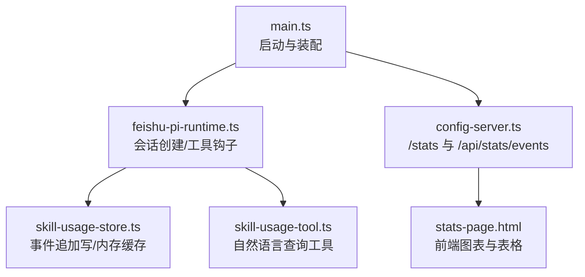
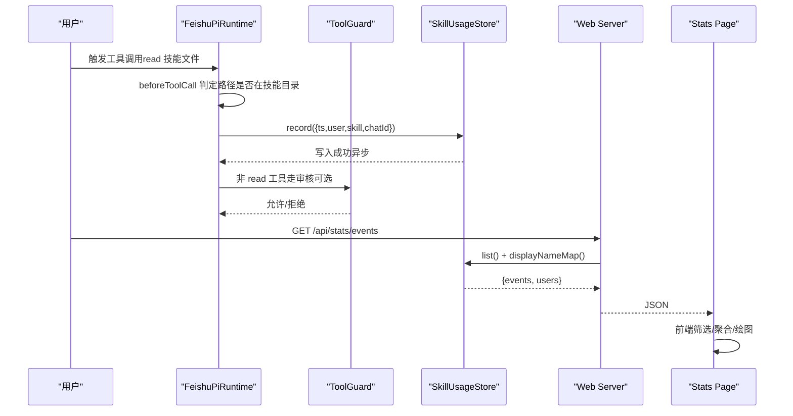
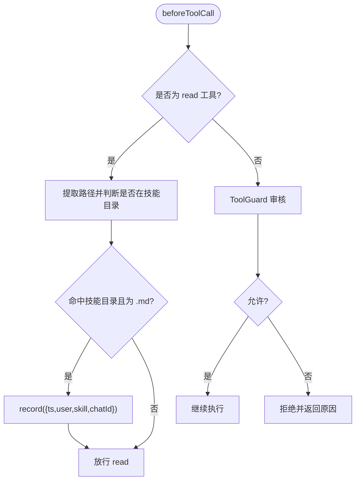
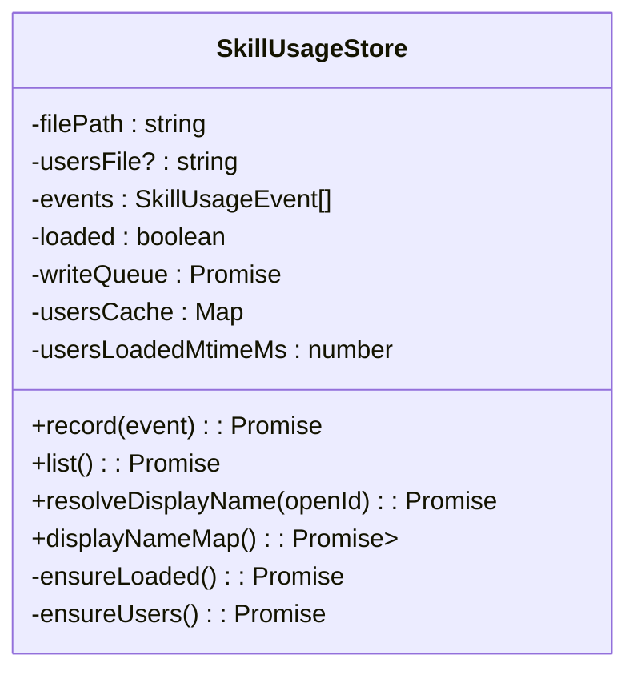
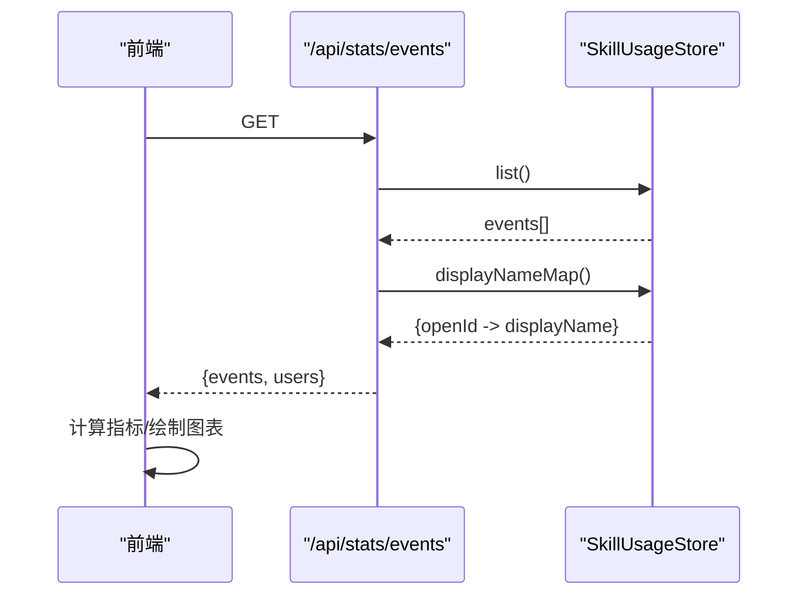
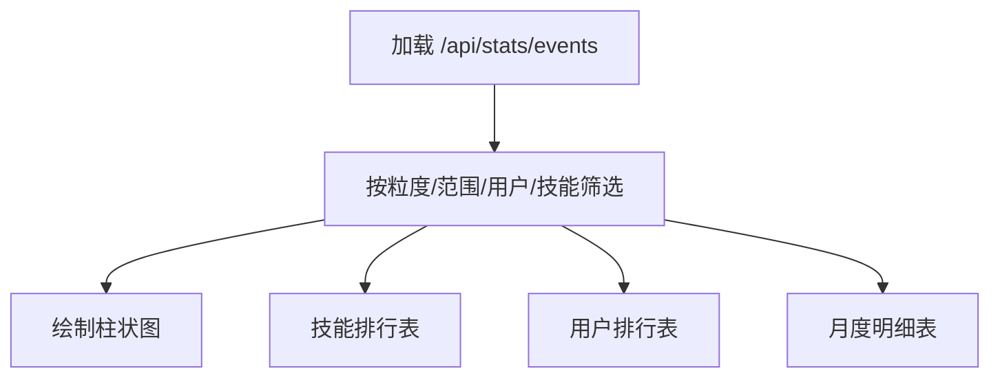
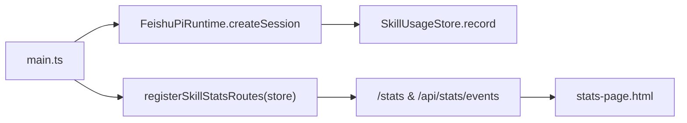

# 技能使用统计系统

<cite>
**本文引用的文件**
- [src/stats/skill-usage-store.ts](file://src/stats/skill-usage-store.ts)
- [src/stats/skill-usage-tool.ts](file://src/stats/skill-usage-tool.ts)
- [src/runtime/feishu-pi-runtime.ts](file://src/runtime/feishu-pi-runtime.ts)
- [src/config-server.ts](file://src/config-server.ts)
- [src/stats-page.html](file://src/stats-page.html)
- [src/main.ts](file://src/main.ts)
- [test/skill-usage.test.ts](file://test/skill-usage.test.ts)
- [package.json](file://package.json)
</cite>

## 目录
1. [简介](#简介)
2. [项目结构](#项目结构)
3. [核心组件](#核心组件)
4. [架构总览](#架构总览)
5. [详细组件分析](#详细组件分析)
6. [依赖关系分析](#依赖关系分析)
7. [性能考虑](#性能考虑)
8. [故障排查指南](#故障排查指南)
9. [结论](#结论)
10. [附录](#附录)

## 简介
本系统为飞书智能体提供“技能使用统计”能力，围绕技能调用事件进行采集、存储、查询与可视化。其目标包括：
- 定义并采集技能调用事件（类型、时机、格式）
- 实现内存缓存与持久化存储策略
- 计算关键指标（使用频率、用户活跃度、调用成功率等）
- 提供前端可视化展示与数据导出能力
- 通过异步与聚合优化性能
- 预留监控告警集成点以检测异常使用模式

## 项目结构
与技能使用统计相关的代码主要分布在 stats、runtime、config-server 以及前端页面中：
- 事件存储与匹配：src/stats/skill-usage-store.ts
- 自然语言查询工具：src/stats/skill-usage-tool.ts
- 运行时钩子注入与事件记录：src/runtime/feishu-pi-runtime.ts
- Web 配置与统计页面路由：src/config-server.ts
- 统计页面渲染逻辑：src/stats-page.html
- 服务启动与装配：src/main.ts
- 单元测试覆盖：test/skill-usage.test.ts

**图示来源**
- [src/main.ts:171-177](file://src/main.ts#L171-L177)
- [src/runtime/feishu-pi-runtime.ts:226-282](file://src/runtime/feishu-pi-runtime.ts#L226-L282)
- [src/stats/skill-usage-store.ts:67-120](file://src/stats/skill-usage-store.ts#L67-L120)
- [src/config-server.ts:127-143](file://src/config-server.ts#L127-L143)
- [src/stats-page.html:175-187](file://src/stats-page.html#L175-L187)

**章节来源**
- [src/main.ts:171-177](file://src/main.ts#L171-L177)
- [src/runtime/feishu-pi-runtime.ts:226-282](file://src/runtime/feishu-pi-runtime.ts#L226-L282)
- [src/stats/skill-usage-store.ts:67-120](file://src/stats/skill-usage-store.ts#L67-L120)
- [src/config-server.ts:127-143](file://src/config-server.ts#L127-L143)
- [src/stats-page.html:175-187](file://src/stats-page.html#L175-L187)

## 核心组件
- 事件存储 SkillUsageStore
  - JSONL 追加式事件流，内存读缓存，按时间懒加载
  - 支持用户展示名解析（英文名 > 中文名 > Open ID）
  - 串行写队列保证并发安全
- 查询工具 createSkillUsageQueryTool
  - 作为 AgentTool 暴露给模型，用于自然语言问答
  - 输出累计次数、涉及技能数、活跃用户数、近 7 天次数、技能排行、最近使用者与本人使用情况
- 运行时钩子 beforeToolCall
  - 在 read 工具执行前判定是否读取技能文件，命中则记录事件
  - 其他工具走 ToolGuard 统一权限审核；失败不阻塞主流程
- 配置服务器与统计页面
  - /stats 返回静态页面
  - /api/stats/events 返回全部事件与用户展示名映射，筛选与聚合由前端完成
- 前端 stats-page.html
  - 支持粒度（日/月/年）、范围（近 7/30/90 天、全部、自定义）、用户与技能筛选
  - 绘制柱状图、技能排行、用户排行、月度明细表

**章节来源**
- [src/stats/skill-usage-store.ts:13-23](file://src/stats/skill-usage-store.ts#L13-L23)
- [src/stats/skill-usage-store.ts:67-120](file://src/stats/skill-usage-store.ts#L67-L120)
- [src/stats/skill-usage-tool.ts:46-99](file://src/stats/skill-usage-tool.ts#L46-L99)
- [src/runtime/feishu-pi-runtime.ts:226-282](file://src/runtime/feishu-pi-runtime.ts#L226-L282)
- [src/config-server.ts:127-143](file://src/config-server.ts#L127-L143)
- [src/stats-page.html:117-389](file://src/stats-page.html#L117-L389)

## 架构总览
系统采用“运行时采集 + 独立事件流 + 前端聚合”的轻量架构：
- 采集层：在会话创建时注入 beforeToolCall 钩子，拦截 read 技能读取并记录事件；其他工具经 ToolGuard 审核后放行
- 存储层：JSONL 追加写，内存 Map 缓存，跨重启恢复
- 查询层：AgentTool 提供自然语言入口；Web API 提供原始事件与用户映射
- 展示层：前端基于事件做多维筛选与聚合，绘制图表与表格

**图示来源**
- [src/runtime/feishu-pi-runtime.ts:226-282](file://src/runtime/feishu-pi-runtime.ts#L226-L282)
- [src/stats/skill-usage-store.ts:84-120](file://src/stats/skill-usage-store.ts#L84-L120)
- [src/config-server.ts:133-141](file://src/config-server.ts#L133-L141)
- [src/stats-page.html:175-187](file://src/stats-page.html#L175-L187)

## 详细组件分析

### 事件采集机制
- 事件类型与字段
  - ts：事件时间（毫秒）
  - user：触发用户 Open ID
  - skill：技能名（文件名去 .md）
  - chatId：发生会话（可选）
- 采集时机
  - 在会话创建时设置 beforeToolCall
  - read 工具：若路径命中技能目录且为 .md，则记录事件后放行
  - 其他工具：先经 ToolGuard 审核，再决定是否继续
- 数据格式规范
  - 单条事件为 JSON 对象，按行追加到 JSONL 文件
  - 读取时过滤非法行，确保 ts/user/skill 存在

**图示来源**
- [src/runtime/feishu-pi-runtime.ts:226-282](file://src/runtime/feishu-pi-runtime.ts#L226-L282)
- [src/stats/skill-usage-store.ts:39-61](file://src/stats/skill-usage-store.ts#L39-L61)

**章节来源**
- [src/runtime/feishu-pi-runtime.ts:226-282](file://src/runtime/feishu-pi-runtime.ts#L226-L282)
- [src/stats/skill-usage-store.ts:39-61](file://src/stats/skill-usage-store.ts#L39-L61)

### 数据存储方案
- 内存缓存
  - events 数组作为内存快照，首次读取时从 JSONL 加载
  - 用户缓存 Map 按 mtime 增量更新，避免重复 IO
- 持久化存储
  - JSONL 追加写，串行写队列避免并发竞争
  - 文件不存在或读取失败时降级为空集合并记录日志
- 展示名解析
  - 优先级：英文名 > 中文名 > Open ID
  - displayNameMap 批量返回映射，供前端一次性渲染

**图示来源**
- [src/stats/skill-usage-store.ts:67-157](file://src/stats/skill-usage-store.ts#L67-L157)

**章节来源**
- [src/stats/skill-usage-store.ts:67-157](file://src/stats/skill-usage-store.ts#L67-L157)

### 统计分析功能
- 关键指标
  - 累计使用次数：事件总数
  - 活跃用户数：去重后的 user 数量
  - 涉及技能数：去重后的 skill 数量
  - 近 7 天使用次数：按 ts 过滤
  - 技能排行：按 count 降序，附带人数与最近使用时间
  - 用户排行：按 count 降序，附带技能数与最近使用时间
  - 月度明细：月份 × 用户 × 技能的调用次数
- 计算位置
  - 后端：SkillUsageStore.list 返回原始事件；displayNameMap 返回用户映射
  - 前端：stats-page.html 负责筛选、聚合与图表绘制

**图示来源**
- [src/config-server.ts:133-141](file://src/config-server.ts#L133-L141)
- [src/stats/skill-usage-store.ts:98-140](file://src/stats/skill-usage-store.ts#L98-L140)
- [src/stats-page.html:261-383](file://src/stats-page.html#L261-L383)

**章节来源**
- [src/config-server.ts:133-141](file://src/config-server.ts#L133-L141)
- [src/stats-page.html:261-383](file://src/stats-page.html#L261-L383)

### 可视化展示
- 页面入口
  - /stats 返回静态页面
  - /api/stats/events 返回事件与用户映射
- 交互能力
  - 粒度切换：日/月/年
  - 范围选择：近 7/30/90 天、全部、自定义日期
  - 用户与技能筛选：多选与快捷操作
- 图表与表格
  - 柱状图：按所选粒度统计调用次数
  - 技能排行：Top N 技能及其人数与最近使用时间
  - 用户排行：Top N 用户及其技能数与最近使用时间
  - 月度明细：月份 × 用户 × 技能 的调用次数表

**图示来源**
- [src/config-server.ts:127-143](file://src/config-server.ts#L127-L143)
- [src/stats-page.html:175-187](file://src/stats-page.html#L175-L187)
- [src/stats-page.html:261-383](file://src/stats-page.html#L261-L383)

**章节来源**
- [src/config-server.ts:127-143](file://src/config-server.ts#L127-L143)
- [src/stats-page.html:175-187](file://src/stats-page.html#L175-L187)
- [src/stats-page.html:261-383](file://src/stats-page.html#L261-L383)

### 数据导出能力
- 当前实现
  - 前端提供“刷新”按钮与完整事件列表，便于复制与二次处理
  - 服务端直接返回原始事件与用户映射，便于外部脚本拉取
- 建议扩展
  - 在后端新增导出接口，支持 CSV/JSON 下载
  - 在前端增加“导出报表”按钮，将当前筛选结果生成 CSV 或 JSON 文件

[本节为通用建议，不直接分析具体文件]

### 监控告警集成点
- 现有日志
  - 事件写入失败、用户缓存读取失败、ToolGuard 异常等均有日志输出
- 建议集成
  - 将关键错误与阈值告警（如连续失败、异常高调用量）上报至监控系统
  - 对异常使用模式（短时间高频调用同一技能）进行规则检测并通知

[本节为通用建议，不直接分析具体文件]

## 依赖关系分析
- main.ts 负责装配 SkillUsageStore 并注册统计路由
- feishu-pi-runtime.ts 在会话创建时注入 beforeToolCall 钩子，调用 SkillUsageStore.record
- config-server.ts 暴露 /stats 与 /api/stats/events
- stats-page.html 消费 /api/stats/events 进行前端聚合与渲染
- package.json 声明 Express 等依赖，用于本地配置与统计页面服务

**图示来源**
- [src/main.ts:171-177](file://src/main.ts#L171-L177)
- [src/runtime/feishu-pi-runtime.ts:147-284](file://src/runtime/feishu-pi-runtime.ts#L147-L284)
- [src/config-server.ts:127-143](file://src/config-server.ts#L127-L143)
- [src/stats-page.html:175-187](file://src/stats-page.html#L175-L187)

**章节来源**
- [src/main.ts:171-177](file://src/main.ts#L171-L177)
- [src/runtime/feishu-pi-runtime.ts:147-284](file://src/runtime/feishu-pi-runtime.ts#L147-L284)
- [src/config-server.ts:127-143](file://src/config-server.ts#L127-L143)
- [src/stats-page.html:175-187](file://src/stats-page.html#L175-L187)

## 性能考虑
- 数据聚合
  - 后端仅返回原始事件与用户映射，复杂聚合在前端完成，降低服务端压力
- 缓存机制
  - 事件内存缓存，首次加载后复用
  - 用户缓存按 mtime 增量更新，避免频繁 IO
- 异步处理
  - 事件写入使用串行写队列，避免并发竞争
  - 写入失败仅告警，不影响主流程
- 资源清理
  - 统计数据不参与 DataCleaner 的 7 天清理，长期留存用于趋势分析

[本节为通用指导，不直接分析具体文件]

## 故障排查指南
- 事件写入失败
  - 检查 data/stats/skill-usage.jsonl 所在目录是否存在且可写
  - 查看日志中的写入失败提示
- 用户展示名解析异常
  - 确认 data/users/{appId}_users.json 存在且格式正确
  - 若文件缺失，将回退为 Open ID
- ToolGuard 异常
  - 审核接口超时或异常会被记录并按拒绝处理，需检查网络与鉴权配置
- 前端无数据
  - 确认 /api/stats/events 返回正常，检查浏览器控制台是否有请求错误

**章节来源**
- [src/stats/skill-usage-store.ts:84-120](file://src/stats/skill-usage-store.ts#L84-L120)
- [src/stats/skill-usage-store.ts:142-155](file://src/stats/skill-usage-store.ts#L142-L155)
- [src/runtime/feishu-pi-runtime.ts:261-282](file://src/runtime/feishu-pi-runtime.ts#L261-L282)

## 结论
本系统通过“运行时钩子 + 独立事件流 + 前端聚合”的方式，实现了轻量而可扩展的技能使用统计。它具备：
- 明确的采集时机与数据格式
- 可靠的内存缓存与持久化策略
- 丰富的统计指标与可视化展示
- 良好的性能与容错设计
后续可在导出与监控告警方面进一步增强，以满足更广泛的运维与分析需求。

## 附录
- 运行方式
  - 使用 package.json 提供的脚本启动服务与测试
- 相关测试
  - 覆盖 matchSkillRead、SkillUsageStore 行为与查询工具输出

**章节来源**
- [package.json:6-12](file://package.json#L6-L12)
- [test/skill-usage.test.ts:11-85](file://test/skill-usage.test.ts#L11-L85)
- [test/skill-usage.test.ts:87-128](file://test/skill-usage.test.ts#L87-L128)