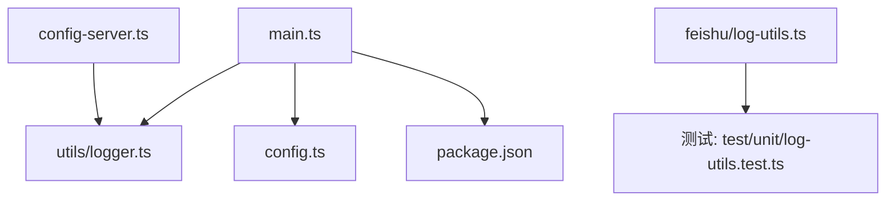
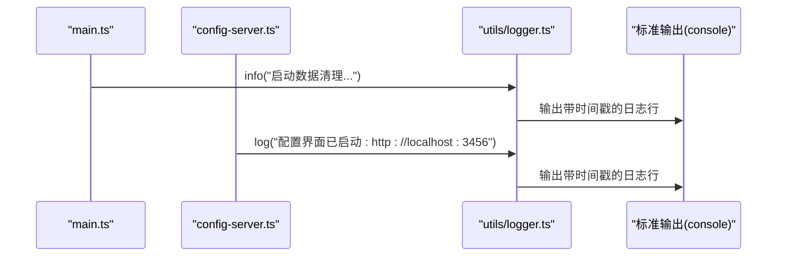
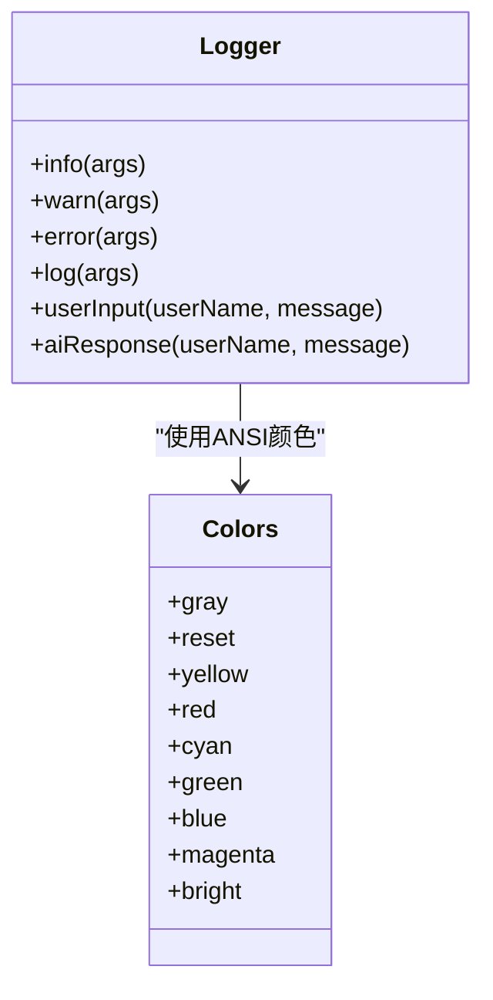
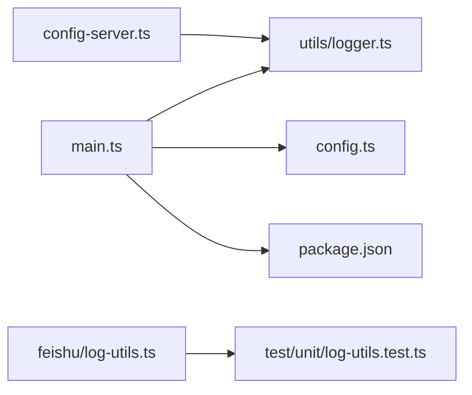

# 日志监控系统

<cite>
**本文引用的文件**
- [src/utils/logger.ts](file://src/utils/logger.ts)
- [src/feishu/log-utils.ts](file://src/feishu/log-utils.ts)
- [test/unit/log-utils.test.ts](file://test/unit/log-utils.test.ts)
- [src/main.ts](file://src/main.ts)
- [src/config-server.ts](file://src/config-server.ts)
- [src/config.ts](file://src/config.ts)
- [package.json](file://package.json)
</cite>

## 目录
1. [简介](#简介)
2. [项目结构](#项目结构)
3. [核心组件](#核心组件)
4. [架构总览](#架构总览)
5. [详细组件分析](#详细组件分析)
6. [依赖关系分析](#依赖关系分析)
7. [性能考量](#性能考量)
8. [故障排查指南](#故障排查指南)
9. [结论](#结论)
10. [附录](#附录)

## 简介
本文件围绕仓库中的日志能力进行系统化说明，涵盖结构化日志设计、日志收集与输出机制、日志分析能力、查询接口、存储策略、告警集成与可视化方案。当前代码库实现了轻量级控制台日志工具与日志文本格式化能力，并在服务启动、配置服务器、飞书桥接等关键路径中广泛使用。本文将基于现有实现给出扩展建议与落地路线，帮助构建完整的日志监控体系。

## 项目结构
- 日志工具位于 utils/logger.ts，提供带时间戳和颜色的统一日志输出方法。
- 日志文本格式化工具位于 feishu/log-utils.ts，用于将多行日志压缩为单行并限制长度，便于在卡片或消息中展示。
- 单元测试覆盖 log-utils 的边界行为（换行去除、长度限制、空串处理等）。
- main.ts 在服务启动阶段使用 logger 记录清理、连接、授权回调等关键事件。
- config-server.ts 提供本地配置页面与统计页面，并通过 logger 记录服务启动与路由注册信息。
- config.ts 定义应用配置加载逻辑，未包含日志级别或输出目标配置项。
- package.json 定义了运行脚本与依赖，不包含日志相关第三方库。

**图表来源**
- [src/main.ts:20-286](file://src/main.ts#L20-L286)
- [src/config-server.ts:9-149](file://src/config-server.ts#L9-L149)
- [src/utils/logger.ts:1-40](file://src/utils/logger.ts#L1-L40)
- [src/feishu/log-utils.ts:1-6](file://src/feishu/log-utils.ts#L1-L6)
- [test/unit/log-utils.test.ts:1-56](file://test/unit/log-utils.test.ts#L1-L56)
- [src/config.ts:1-51](file://src/config.ts#L1-L51)
- [package.json:1-34](file://package.json#L1-L34)

**章节来源**
- [src/utils/logger.ts:1-40](file://src/utils/logger.ts#L1-L40)
- [src/feishu/log-utils.ts:1-6](file://src/feishu/log-utils.ts#L1-L6)
- [test/unit/log-utils.test.ts:1-56](file://test/unit/log-utils.test.ts#L1-L56)
- [src/main.ts:20-286](file://src/main.ts#L20-L286)
- [src/config-server.ts:9-149](file://src/config-server.ts#L9-L149)
- [src/config.ts:1-51](file://src/config.ts#L1-L51)
- [package.json:1-34](file://package.json#L1-L34)

## 核心组件
- 统一日志器：提供 info/warn/error/log/userInput/aiResponse 等方法，自动附加时间戳与 ANSI 颜色，便于终端可读性。
- 日志文本格式化：将多行文本替换为空格并截断到指定长度，适合在卡片或消息中显示。
- 服务启动日志：main.ts 在数据清理、模型切换、授权回调、优雅退出等关键节点记录日志。
- 配置服务器日志：config-server.ts 记录配置页面启动、路由注册等信息。
- 单元测试：验证日志格式化函数的正确性与边界条件。

**章节来源**
- [src/utils/logger.ts:1-40](file://src/utils/logger.ts#L1-L40)
- [src/feishu/log-utils.ts:1-6](file://src/feishu/log-utils.ts#L1-L6)
- [src/main.ts:27-286](file://src/main.ts#L27-L286)
- [src/config-server.ts:94-149](file://src/config-server.ts#L94-L149)
- [test/unit/log-utils.test.ts:1-56](file://test/unit/log-utils.test.ts#L1-L56)

## 架构总览
当前日志系统采用“集中式工具 + 分散调用”的模式：
- 所有模块通过导入 logger 统一输出，保证时间戳与颜色一致。
- 日志直接写入标准输出（console），由运行环境或容器平台负责采集与持久化。
- 日志文本格式化函数用于在卡片或消息中展示时控制长度与格式。

**图表来源**
- [src/main.ts:27-48](file://src/main.ts#L27-L48)
- [src/config-server.ts:145-149](file://src/config-server.ts#L145-L149)
- [src/utils/logger.ts:24-39](file://src/utils/logger.ts#L24-L39)

## 详细组件分析

### 结构化日志设计
- 日志级别：info、warn、error、log，以及业务语义化的 userInput、aiResponse。
- 字段规范：每条日志均包含时间戳；warn/error 附带级别标签；userInput/aiResponse 包含用户标识与消息内容。
- 输出格式：时间戳置于方括号内，级别以彩色标签标注，支持 ANSI 颜色增强可读性。
- 可扩展点：可在 logger 中增加模块名、会话ID、请求ID等上下文字段，便于后续聚合与分析。

**图表来源**
- [src/utils/logger.ts:11-39](file://src/utils/logger.ts#L11-L39)

**章节来源**
- [src/utils/logger.ts:1-40](file://src/utils/logger.ts#L1-L40)

### 日志收集机制（同步/异步、缓冲区、性能优化）
- 当前实现为同步输出：logger 直接调用 console.info/warn/error/log，无缓冲队列与异步批处理。
- 优点：简单可靠，调试直观；缺点：在高并发场景可能阻塞主线程，且无法批量落盘。
- 建议优化方向：
  - 引入异步写入队列与固定大小缓冲区，降低 IO 开销。
  - 支持按级别过滤与采样，减少低优先级日志对性能的影响。
  - 将日志转为结构化 JSON 行（JSON Lines），便于外部采集器解析与索引。
  - 提供可插拔的目标（控制台、文件、远程日志服务），通过配置切换。

[本节为通用优化建议，不直接分析具体文件]

### 日志分析功能（错误追踪、性能监控、业务指标）
- 错误追踪：当前通过 error 级别记录异常信息与上下文，建议在错误对象中包含堆栈、模块名、请求ID等，便于定位问题。
- 性能监控：可在关键路径（如网络请求、模型调用、消息处理）记录耗时指标，并以结构化形式输出，供外部系统聚合。
- 业务指标：结合技能使用统计（SkillUsageStore）与日志，形成“事件流 + 日志”的双通道分析，前端通过 /stats 页面展示。

**章节来源**
- [src/main.ts:171-177](file://src/main.ts#L171-L177)
- [src/config-server.ts:127-143](file://src/config-server.ts#L127-L143)

### 日志查询接口（时间范围、级别、模块筛选）
- 当前未提供内置查询接口；日志输出为标准输出，可由容器平台或日志采集器（如 stdout -> 文件/远端）进行检索。
- 建议方案：
  - 将日志输出为 JSON Lines，包含 time、level、module、message、context 等字段。
  - 暴露 HTTP 查询接口（如 GET /api/logs?level=error&start=...&end=...&module=...），后端从文件或远端日志服务读取并返回分页结果。
  - 结合前端仪表盘实现多维筛选与高亮。

[本节为概念性设计，不直接分析具体文件]

### 日志存储策略（本地文件、远程服务、归档）
- 当前：日志输出至标准输出，未直接写入本地文件或远端服务。
- 建议：
  - 本地文件：按日期或大小轮转，保留最近 N 天，避免磁盘占用过大。
  - 远程服务：对接集中式日志平台（如 ELK、云厂商日志服务），实现实时采集与检索。
  - 归档机制：定期压缩历史日志并迁移至冷存储，满足合规与审计需求。

[本节为通用策略建议，不直接分析具体文件]

### 告警系统集成（异常实时监控与通知推送）
- 当前：通过 error 级别记录异常，但未集成告警推送。
- 建议：
  - 在 error 级别触发告警规则（如连续错误数、特定关键字匹配）。
  - 对接通知渠道（企业微信、飞书、邮件、短信），发送告警消息。
  - 支持告警降噪与分级，避免告警风暴。

[本节为通用集成建议，不直接分析具体文件]

### 日志可视化工具（仪表盘、趋势图、异常检测）
- 当前：提供 /stats 页面用于技能使用统计，非日志可视化。
- 建议：
  - 仪表盘：展示日志量、错误率、响应时间趋势。
  - 趋势图：按小时/天维度统计各模块日志量与错误占比。
  - 异常检测：基于阈值或机器学习识别异常波动，联动告警系统。

[本节为通用可视化建议，不直接分析具体文件]

## 依赖关系分析
- main.ts 依赖 logger 记录启动流程与关键事件。
- config-server.ts 依赖 logger 记录服务状态与路由注册。
- log-utils.ts 被测试覆盖，确保日志文本格式化的稳定性。
- config.ts 提供应用配置，未包含日志相关配置项。
- package.json 未引入日志框架，保持轻量。

**图表来源**
- [src/main.ts:20-286](file://src/main.ts#L20-L286)
- [src/config-server.ts:9-149](file://src/config-server.ts#L9-L149)
- [src/feishu/log-utils.ts:1-6](file://src/feishu/log-utils.ts#L1-L6)
- [test/unit/log-utils.test.ts:1-56](file://test/unit/log-utils.test.ts#L1-L56)
- [src/config.ts:1-51](file://src/config.ts#L1-L51)
- [package.json:1-34](file://package.json#L1-L34)

**章节来源**
- [src/main.ts:20-286](file://src/main.ts#L20-L286)
- [src/config-server.ts:9-149](file://src/config-server.ts#L9-L149)
- [src/feishu/log-utils.ts:1-6](file://src/feishu/log-utils.ts#L1-L6)
- [test/unit/log-utils.test.ts:1-56](file://test/unit/log-utils.test.ts#L1-L56)
- [src/config.ts:1-51](file://src/config.ts#L1-L51)
- [package.json:1-34](file://package.json#L1-L34)

## 性能考量
- 当前日志为同步输出，可能在高频调用场景影响性能。
- 建议引入异步队列与批处理，减少 IO 次数。
- 支持日志级别过滤与采样，降低低优先级日志的开销。
- 将日志转为结构化 JSON，便于高效解析与索引。

[本节为通用性能建议，不直接分析具体文件]

## 故障排查指南
- 启动失败：检查 main.ts 中的初始化日志，确认数据清理、模型切换、授权回调是否正常。
- 配置页面不可用：查看 config-server.ts 的启动日志，确认端口监听与路由注册。
- 错误定位：通过 error 级别日志获取异常信息与上下文，必要时增加模块名与请求ID。
- 日志格式异常：使用 log-utils.formatLogText 确保在卡片或消息中显示时格式正确。

**章节来源**
- [src/main.ts:27-286](file://src/main.ts#L27-L286)
- [src/config-server.ts:145-149](file://src/config-server.ts#L145-L149)
- [src/feishu/log-utils.ts:1-6](file://src/feishu/log-utils.ts#L1-L6)

## 结论
当前日志系统提供了简洁实用的控制台日志能力，并通过统一的 logger 与格式化函数提升了可读性与一致性。为满足生产环境的监控与分析需求，建议逐步引入结构化日志、异步写入、远程采集、查询接口与可视化仪表盘，构建完整的日志监控闭环。

[本节为总结性内容，不直接分析具体文件]

## 附录
- 环境变量与配置：config.ts 定义了应用配置加载逻辑，未包含日志相关配置项。
- 运行脚本：package.json 提供了 start/dev/test 等脚本，便于开发与测试。

**章节来源**
- [src/config.ts:1-51](file://src/config.ts#L1-L51)
- [package.json:1-34](file://package.json#L1-L34)