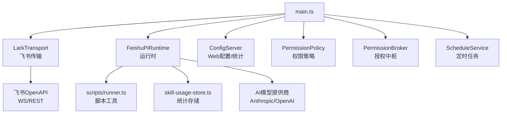
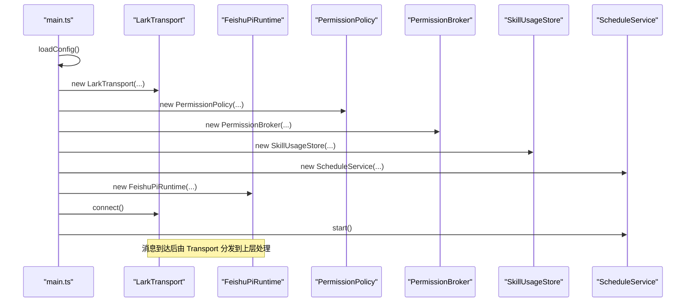
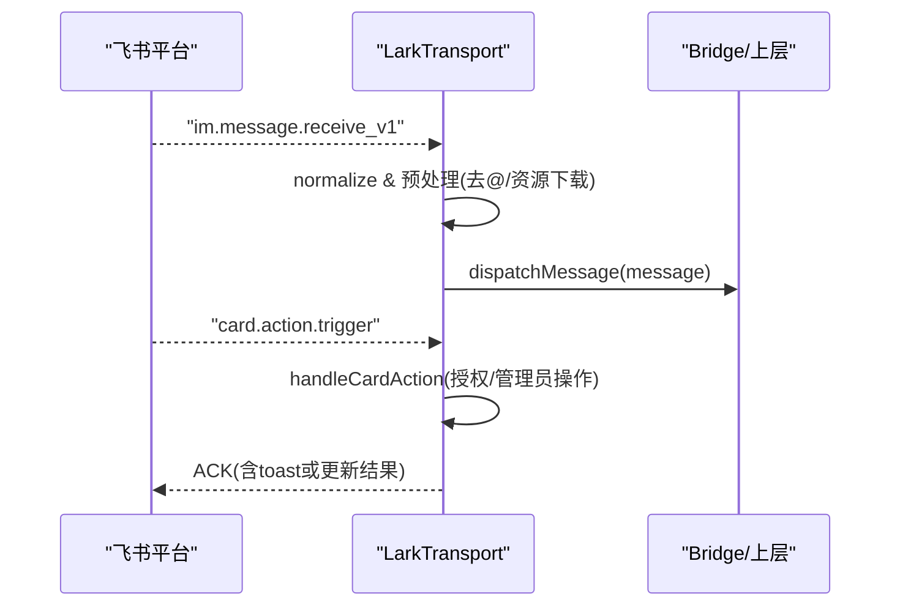
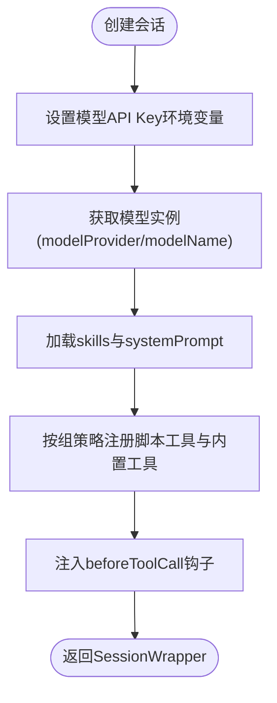
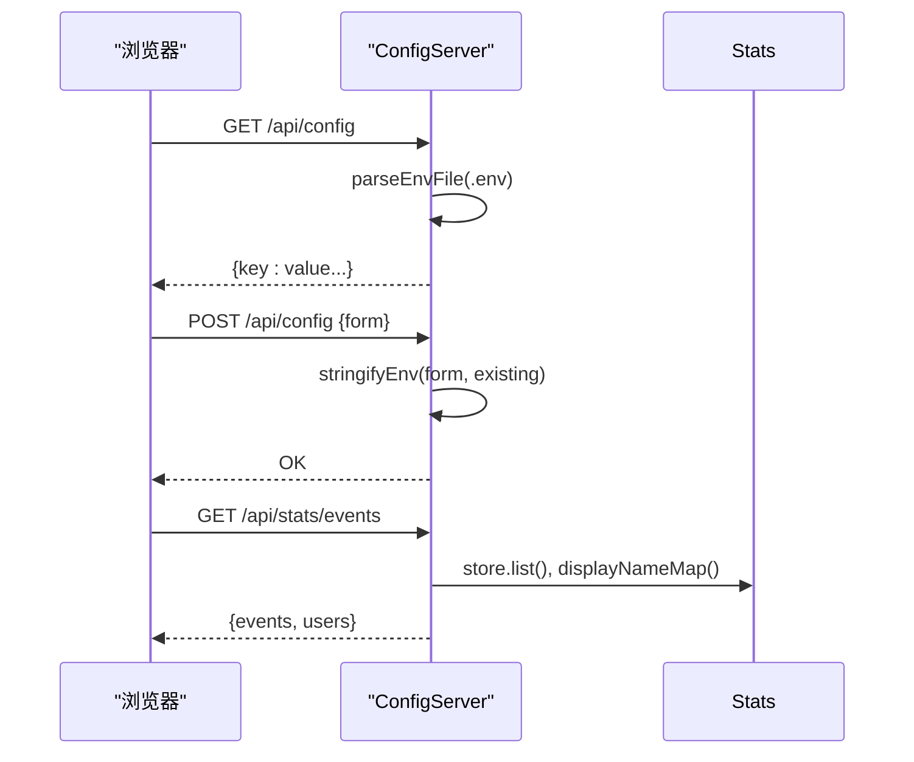
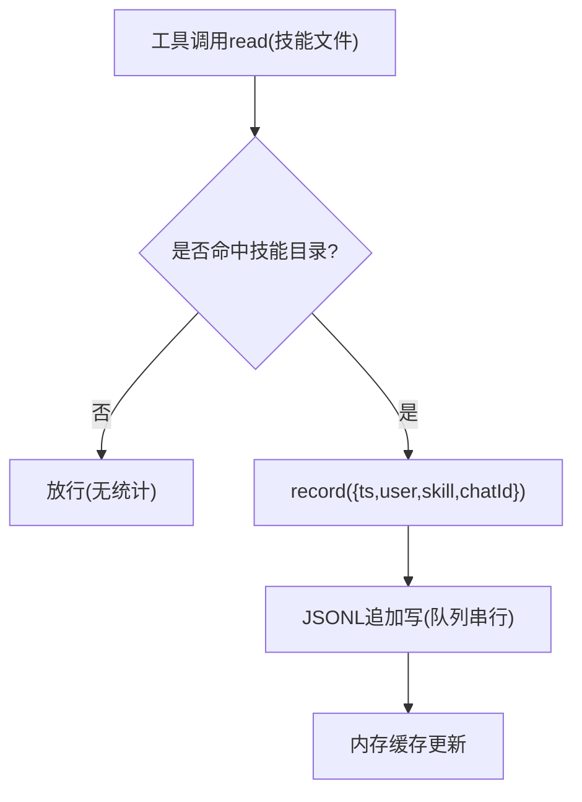
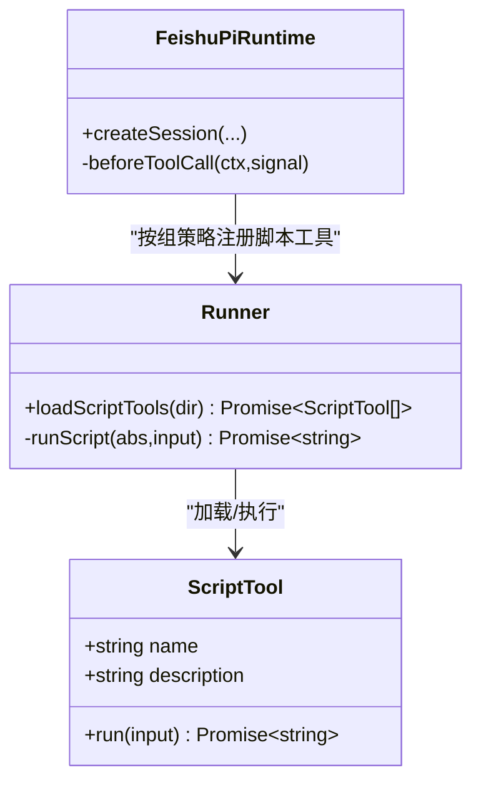
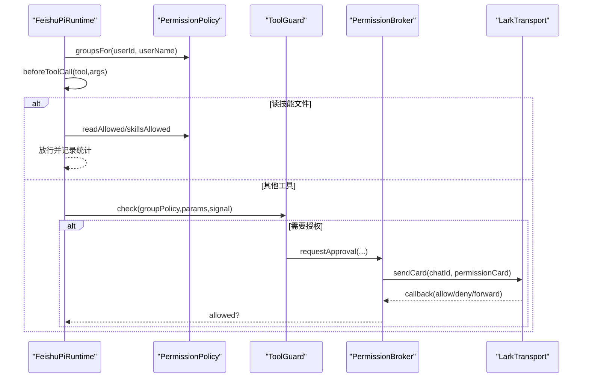
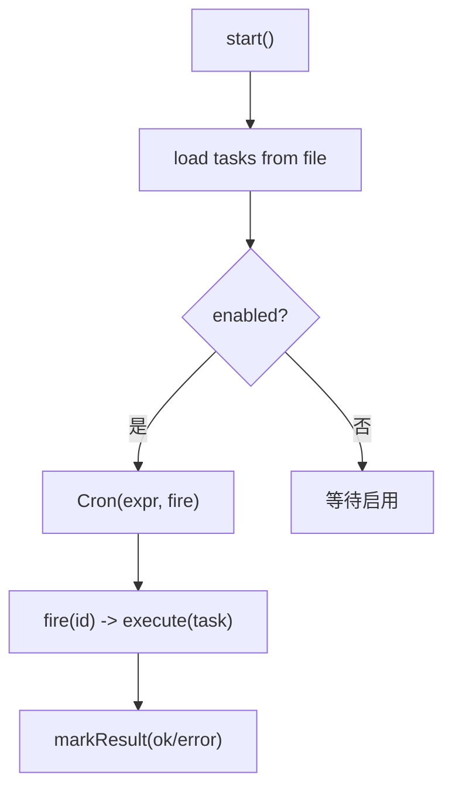
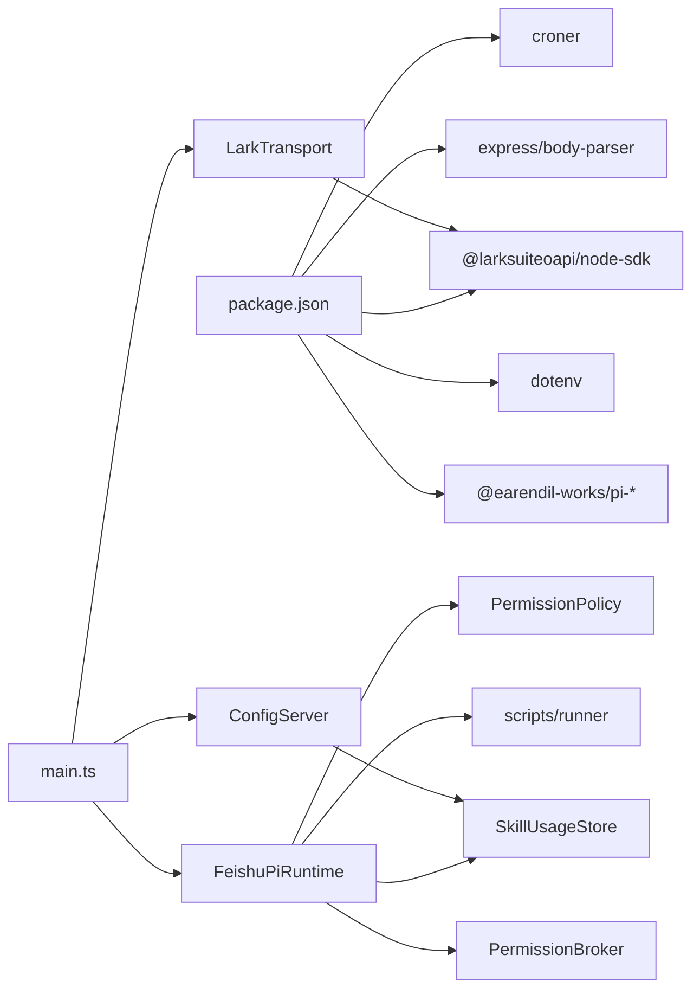

# 集成点设计

<cite>
**本文引用的文件**
- [src/main.ts](file://src/main.ts)
- [src/config-server.ts](file://src/config-server.ts)
- [src/config.ts](file://src/config.ts)
- [src/feishu/lark-transport.ts](file://src/feishu/lark-transport.ts)
- [src/runtime/feishu-pi-runtime.ts](file://src/runtime/feishu-pi-runtime.ts)
- [src/utils/logger.ts](file://src/utils/logger.ts)
- [src/stats/skill-usage-store.ts](file://src/stats/skill-usage-store.ts)
- [src/stats/skill-usage-tool.ts](file://src/stats/skill-usage-tool.ts)
- [src/tools/registry.ts](file://src/tools/registry.ts)
- [src/scripts/runner.ts](file://src/scripts/runner.ts)
- [src/permission/policy.ts](file://src/permission/policy.ts)
- [src/guard/broker.ts](file://src/guard/broker.ts)
- [src/schedule/service.ts](file://src/schedule/service.ts)
- [package.json](file://package.json)
</cite>

## 目录
1. [简介](#简介)
2. [项目结构](#项目结构)
3. [核心组件](#核心组件)
4. [架构总览](#架构总览)
5. [详细组件分析](#详细组件分析)
6. [依赖关系分析](#依赖关系分析)
7. [性能考量](#性能考量)
8. [故障排查指南](#故障排查指南)
9. [结论](#结论)
10. [附录](#附录)

## 简介
本文件面向 mini-claw 的“集成点设计”，聚焦系统与外部服务的集成方式与扩展机制，覆盖：
- 飞书 OpenAPI 集成（消息收发、卡片回调、资源下载）
- AI 模型提供商集成（多厂商适配、动态模型切换）
- 文件系统与脚本工具（动态加载、权限控制）
- Web 配置服务器（动态配置更新、统计页面）
- 技能使用统计系统（采集、存储、查询）
- 工具注册表与第三方工具扩展
- 日志系统（结构化输出、级别控制、格式）
- 监控与告警（健康检查、指标收集）

## 项目结构
mini-claw 采用分层与按功能域组织的方式：
- 入口与装配：main.ts 负责启动、装配各子系统
- 传输层：feishu/lark-transport.ts 对接飞书 WS 事件与 API
- 运行时：runtime/feishu-pi-runtime.ts 封装会话、模型、工具注入与策略执行
- 权限与守卫：permission/policy.ts + guard/broker.ts 实现组策略与授权卡
- 工具与脚本：tools/registry.ts + scripts/runner.ts 提供内置与脚本工具
- 统计：stats/* 提供技能使用事件的采集、存储与查询
- 配置服务：config-server.ts 提供 Web 配置与统计页面
- 调度：schedule/service.ts 提供定时任务能力
- 日志：utils/logger.ts 统一日志输出

图表来源
- [src/main.ts:27-247](file://src/main.ts#L27-L247)
- [src/feishu/lark-transport.ts:82-133](file://src/feishu/lark-transport.ts#L82-L133)
- [src/runtime/feishu-pi-runtime.ts:147-284](file://src/runtime/feishu-pi-runtime.ts#L147-L284)
- [src/config-server.ts:94-149](file://src/config-server.ts#L94-L149)
- [src/permission/policy.ts:68-158](file://src/permission/policy.ts#L68-L158)
- [src/guard/broker.ts:46-129](file://src/guard/broker.ts#L46-L129)
- [src/schedule/service.ts:105-123](file://src/schedule/service.ts#L105-L123)

章节来源
- [src/main.ts:27-247](file://src/main.ts#L27-L247)
- [package.json:1-34](file://package.json#L1-L34)

## 核心组件
- 飞书传输层 LarkTransport：基于官方 SDK 的 WSClient 建立长连接，归一化消息、处理卡片回调、下载附件、发送/更新卡片。
- 运行时 FeishuPiRuntime：创建会话、注入模型与工具、执行 beforeToolCall 钩子（读路径校验、ToolGuard 审核）、记录技能使用。
- 权限策略 PermissionPolicy：从 .agent/permissions.json 解析组策略，合并 common 与用户组，提供 read/write/bash/scripts/skills 判定。
- 授权中枢 PermissionBroker：管理待授权请求，发送授权卡片，服务端校验 token/chat/operator，支持转发管理员私聊与超时处理。
- 脚本工具 runner：扫描 .agent/scripts/*.ts，以子进程执行，限制超时与输出大小。
- 技能使用统计 SkillUsageStore：追加式 JSONL 事件流，懒加载内存缓存，支持展示名解析。
- Web 配置服务器 ConfigServer：Express 服务，提供 /api/config 读写 .env，/stats 统计页面与 /api/stats/events 数据接口。
- 定时任务 ScheduleService：croner 调度，持久化 data/schedules.json，触发时调用 runTask 推送结果卡片。

章节来源
- [src/feishu/lark-transport.ts:11-80](file://src/feishu/lark-transport.ts#L11-L80)
- [src/runtime/feishu-pi-runtime.ts:81-145](file://src/runtime/feishu-pi-runtime.ts#L81-L145)
- [src/permission/policy.ts:68-158](file://src/permission/policy.ts#L68-L158)
- [src/guard/broker.ts:46-129](file://src/guard/broker.ts#L46-L129)
- [src/scripts/runner.ts:31-79](file://src/scripts/runner.ts#L31-L79)
- [src/stats/skill-usage-store.ts:67-157](file://src/stats/skill-usage-store.ts#L67-L157)
- [src/config-server.ts:94-149](file://src/config-server.ts#L94-L149)
- [src/schedule/service.ts:105-123](file://src/schedule/service.ts#L105-L123)

## 架构总览
系统由“传输层—运行时—策略/守卫—工具/脚本—统计—配置服务—调度”构成。main.ts 作为装配中心，将各组件串联：
- 启动时清理过期数据，初始化飞书 Client，获取 Bot Open ID 与管理员 Open ID
- 构建 LarkTransport，注册消息与卡片回调
- 构建 PermissionPolicy 与 PermissionBroker，接入 ToolGuard
- 构建 SkillUsageStore 并注册统计路由
- 构建 ScheduleService，注入 runTask
- 构建 FeishuPiRuntime，设置模型、策略、工具守卫、统计存储
- 启动 Bridge、Transport、Schedule，打印配置页面地址

图表来源
- [src/main.ts:27-247](file://src/main.ts#L27-L247)
- [src/feishu/lark-transport.ts:82-133](file://src/feishu/lark-transport.ts#L82-L133)
- [src/runtime/feishu-pi-runtime.ts:147-284](file://src/runtime/feishu-pi-runtime.ts#L147-L284)
- [src/permission/policy.ts:68-158](file://src/permission/policy.ts#L68-L158)
- [src/guard/broker.ts:46-129](file://src/guard/broker.ts#L46-L129)
- [src/stats/skill-usage-store.ts:67-157](file://src/stats/skill-usage-store.ts#L67-L157)
- [src/schedule/service.ts:105-123](file://src/schedule/service.ts#L105-L123)

## 详细组件分析

### 飞书 OpenAPI 集成（LarkTransport）
- 长连接与事件分发：通过 WSClient 订阅 im.message.receive_v1 与 card.action.trigger，normalize 归一化消息内容、资源与 @ 标记，后台 fire-and-forget 交给上层 handler。
- 会话收敛：根据 chatId 查询会话模式（p2p/group/topic），话题群以根消息 messageId 为键收敛会话；普通会话按用户隔离。
- 资源处理：图片走 LarkImageProcessor 缓存；file/audio/video/media 附件下载到本地缓存目录，并在消息文本中追加路径提示。
- 卡片回调：区分授权类回调（tool_approval/forward_approval）与管理员操作（如 /model 切换模型），非管理员点击会拒绝并提示。
- 卡片更新：优先按 messageId 持久更新，失败回退到 token 临时更新；支持撤回消息。

图表来源
- [src/feishu/lark-transport.ts:82-133](file://src/feishu/lark-transport.ts#L82-L133)
- [src/feishu/lark-transport.ts:141-248](file://src/feishu/lark-transport.ts#L141-L248)
- [src/feishu/lark-transport.ts:250-312](file://src/feishu/lark-transport.ts#L250-L312)
- [src/feishu/lark-transport.ts:340-422](file://src/feishu/lark-transport.ts#L340-L422)

章节来源
- [src/feishu/lark-transport.ts:11-80](file://src/feishu/lark-transport.ts#L11-L80)
- [src/feishu/lark-transport.ts:82-133](file://src/feishu/lark-transport.ts#L82-L133)
- [src/feishu/lark-transport.ts:141-248](file://src/feishu/lark-transport.ts#L141-L248)
- [src/feishu/lark-transport.ts:250-312](file://src/feishu/lark-transport.ts#L250-L312)
- [src/feishu/lark-transport.ts:340-422](file://src/feishu/lark-transport.ts#L340-L422)

### AI 模型提供商集成（FeishuPiRuntime）
- 模型选择：根据 modelProvider 与 modelName 获取模型实例，支持 baseUrl 覆盖（兼容不同厂商）。
- 环境变量注入：在创建会话前设置 ANTHROPIC_API_KEY 或 OPENAI_API_KEY。
- 动态模型切换：运行时 setModelName 立即对新会话生效；底层由 transport 写 .env 持久化。
- 资源加载：DefaultResourceLoader 加载 skills 与 systemPrompt；脚本工具按组策略过滤后注册。

图表来源
- [src/runtime/feishu-pi-runtime.ts:147-216](file://src/runtime/feishu-pi-runtime.ts#L147-L216)
- [src/runtime/feishu-pi-runtime.ts:226-284](file://src/runtime/feishu-pi-runtime.ts#L226-L284)
- [src/runtime/feishu-pi-runtime.ts:98-101](file://src/runtime/feishu-pi-runtime.ts#L98-L101)

章节来源
- [src/runtime/feishu-pi-runtime.ts:81-145](file://src/runtime/feishu-pi-runtime.ts#L81-L145)
- [src/runtime/feishu-pi-runtime.ts:147-284](file://src/runtime/feishu-pi-runtime.ts#L147-L284)

### Web 配置服务器（ConfigServer）
- 静态页面：/ 返回配置页面 HTML；/stats 返回统计页面 HTML。
- 配置读取与保存：/api/config GET 读取 .env 解析为对象；POST 保存表单字段，保留未托管键。
- 统计接口：/api/stats/events 返回全部事件与用户展示名映射，前端完成筛选聚合。
- 安全：仅监听 127.0.0.1，避免暴露敏感信息到局域网。

图表来源
- [src/config-server.ts:94-149](file://src/config-server.ts#L94-L149)

章节来源
- [src/config-server.ts:1-150](file://src/config-server.ts#L1-L150)

### 技能使用统计系统
- 采集点：在 FeishuPiRuntime.beforeToolCall 中，当 read 命中技能文件时记录事件（user、skill、chatId、ts）。
- 存储：SkillUsageStore 使用 JSONL 追加写，内存缓存懒加载；失败只告警不阻塞主流程。
- 查询：createSkillUsageQueryTool 提供自然语言入口，聚合近 7 天数据、技能排行、个人使用等。
- 展示名：从用户缓存文件解析英文名 > 中文名 > Open ID。

图表来源
- [src/runtime/feishu-pi-runtime.ts:226-284](file://src/runtime/feishu-pi-runtime.ts#L226-L284)
- [src/stats/skill-usage-store.ts:84-120](file://src/stats/skill-usage-store.ts#L84-L120)
- [src/stats/skill-usage-tool.ts:46-99](file://src/stats/skill-usage-tool.ts#L46-L99)

章节来源
- [src/stats/skill-usage-store.ts:1-157](file://src/stats/skill-usage-store.ts#L1-L157)
- [src/stats/skill-usage-tool.ts:1-100](file://src/stats/skill-usage-tool.ts#L1-L100)
- [src/runtime/feishu-pi-runtime.ts:226-284](file://src/runtime/feishu-pi-runtime.ts#L226-L284)

### 工具注册表与第三方工具扩展
- 内置工具：read、write、edit、bash 按身份组注册（owner 全量，user 受限）。
- 脚本工具：.agent/scripts/*.ts 自动发现，解析 description/input 元数据，以子进程执行，超时与输出上限保护。
- 自定义工具：tools/registry.ts 已退役为脚本工具方案；当前以脚本即工具的模式扩展。
- 高风险工具：可标记 risk:"high"，强制走授权卡流程。

图表来源
- [src/scripts/runner.ts:31-79](file://src/scripts/runner.ts#L31-L79)
- [src/runtime/feishu-pi-runtime.ts:170-197](file://src/runtime/feishu-pi-runtime.ts#L170-L197)
- [src/tools/registry.ts:1-46](file://src/tools/registry.ts#L1-L46)

章节来源
- [src/scripts/runner.ts:1-96](file://src/scripts/runner.ts#L1-L96)
- [src/tools/registry.ts:1-46](file://src/tools/registry.ts#L1-L46)
- [src/runtime/feishu-pi-runtime.ts:170-197](file://src/runtime/feishu-pi-runtime.ts#L170-L197)

### 权限策略与授权卡
- 策略文件：.agent/permissions.json 定义 common 与各用户组，支持 members、scripts、bash、read、write、skills。
- 合并规则：common ∪ 所属各组；缺失时保守默认（user 仅技能目录可读、无脚本/命令）。
- 授权卡：PermissionBroker 发送授权卡片，等待管理员决策；支持转发管理员私聊、超时拒绝、精简模式撤回卡片。
- 审核：ToolGuard 可接入 OpenAI 兼容审核接口，策略外调用需授权。

图表来源
- [src/permission/policy.ts:91-158](file://src/permission/policy.ts#L91-L158)
- [src/guard/broker.ts:78-129](file://src/guard/broker.ts#L78-L129)
- [src/guard/broker.ts:131-198](file://src/guard/broker.ts#L131-L198)
- [src/runtime/feishu-pi-runtime.ts:226-284](file://src/runtime/feishu-pi-runtime.ts#L226-L284)

章节来源
- [src/permission/policy.ts:1-253](file://src/permission/policy.ts#L1-L253)
- [src/guard/broker.ts:1-200](file://src/guard/broker.ts#L1-L200)
- [src/runtime/feishu-pi-runtime.ts:226-284](file://src/runtime/feishu-pi-runtime.ts#L226-L284)

### 定时任务（ScheduleService）
- 持久化：data/schedules.json，原子写入（tmp+rename），串行队列保证一致性。
- 调度：croner 表达式校验与调度；服务重启恢复启用任务。
- 执行：runTask 由 main 注入，复用会话链路与飞书传输，结果以卡片形式推送到目标会话。
- 状态：记录 lastRunAt、lastStatus、lastError，便于观测与排障。

图表来源
- [src/schedule/service.ts:116-123](file://src/schedule/service.ts#L116-L123)
- [src/schedule/service.ts:131-179](file://src/schedule/service.ts#L131-L179)
- [src/schedule/service.ts:206-235](file://src/schedule/service.ts#L206-L235)

章节来源
- [src/schedule/service.ts:1-238](file://src/schedule/service.ts#L1-L238)

### 日志系统
- 统一 logger：带时间戳与颜色，info/warn/error/log/userInput/aiResponse。
- 用途：传输层、运行时、策略、统计、调度均通过 logger 输出关键节点日志。
- 建议：生产环境可将 stdout 重定向至日志系统（如 journald/ELK），结合结构化字段（模块、级别、traceId）进行检索与分析。

章节来源
- [src/utils/logger.ts:1-40](file://src/utils/logger.ts#L1-L40)
- [src/feishu/lark-transport.ts:82-133](file://src/feishu/lark-transport.ts#L82-L133)
- [src/runtime/feishu-pi-runtime.ts:118-145](file://src/runtime/feishu-pi-runtime.ts#L118-L145)
- [src/schedule/service.ts:116-123](file://src/schedule/service.ts#L116-L123)

### 监控与告警集成点
- 健康检查：可通过 /api/config 与 /api/stats/events 判断服务可用性与数据新鲜度；也可增加 /health 端点（可扩展）。
- 指标收集：
  - 技能使用事件数（events.length）
  - 最近 7 天使用次数
  - 定时任务执行状态（lastStatus/lastError）
  - 飞书连接状态（WS 重连/错误日志）
- 告警建议：
  - 飞书 WS 频繁断线或握手失败
  - 定时任务连续失败
  - 统计事件长时间无新增
  - 配置保存失败（磁盘/权限问题）

[本节为通用指导，不直接分析具体文件]

## 依赖关系分析
- 外部依赖：
  - @larksuiteoapi/node-sdk：飞书 WS/REST 客户端
  - croner：cron 表达式调度
  - express/body-parser：Web 配置与统计服务
  - dotenv：环境变量加载
  - @earendil-works/pi-*：Agent/模型/编码代理框架
- 内部依赖：
  - main.ts 装配所有子系统
  - runtime 依赖 policy、scripts、stats、guard
  - transport 依赖 lark-cli、image processor、topic root store
  - config-server 依赖 stats store 与 fs

图表来源
- [package.json:14-22](file://package.json#L14-L22)
- [src/main.ts:27-247](file://src/main.ts#L27-L247)

章节来源
- [package.json:1-34](file://package.json#L1-L34)
- [src/main.ts:27-247](file://src/main.ts#L27-L247)

## 性能考量
- 消息处理异步化：LarkTransport 对消息处理采用 fire-and-forget，避免阻塞事件循环；会话顺序由 ConversationManager 保证，消息去重由 MessageStore.claim 保证。
- 附件下载与缓存：图片与文件附件下载到本地缓存目录，减少重复网络开销。
- 统计写入队列：SkillUsageStore 使用串行写队列，避免并发写冲突。
- 定时任务串行：同一任务触发时若上一轮未结束，由会话队列串行，避免并发竞争。
- 模型切换热更新：setModelName 立即对新会话生效，旧会话沿用旧模型直至重建。

[本节为通用指导，不直接分析具体文件]

## 故障排查指南
- 飞书连接异常：
  - 观察 WS 重连与错误日志（LarkTransport）
  - 确认 appId/appSecret 正确
- 卡片回调无效：
  - 检查 card.action.trigger 是否正常进入 handleCardAction
  - 确认管理员身份与 token 校验
- 工具调用被拦截：
  - 查看 PermissionPolicy 的 read/bash/scripts 匹配
  - 检查 ToolGuard 审核接口连通性
- 统计无数据：
  - 确认 beforeToolCall 钩子是否命中技能文件
  - 检查 JSONL 文件写入权限与路径
- 定时任务失败：
  - 查看 lastStatus/lastError
  - 校验 cron 表达式与 runTask 注入

章节来源
- [src/feishu/lark-transport.ts:82-133](file://src/feishu/lark-transport.ts#L82-L133)
- [src/guard/broker.ts:131-198](file://src/guard/broker.ts#L131-L198)
- [src/permission/policy.ts:178-210](file://src/permission/policy.ts#L178-L210)
- [src/stats/skill-usage-store.ts:84-120](file://src/stats/skill-usage-store.ts#L84-L120)
- [src/schedule/service.ts:212-235](file://src/schedule/service.ts#L212-L235)

## 结论
mini-claw 的集成点设计围绕“传输—运行时—策略—工具—统计—配置—调度”展开，具备以下特点：
- 飞书集成稳定：基于官方 SDK 的 WS 长连接与卡片回调，支持资源下载与会话收敛
- 模型灵活：多厂商适配与动态切换，环境变量注入与持久化
- 权限可控：策略文件驱动，细粒度 read/write/bash/scripts/skills 控制，授权卡兜底
- 工具可扩展：脚本即工具，零样板、易扩展，支持高风险工具强制授权
- 统计完备：独立事件流，长期留存，自然语言查询与可视化
- 配置便捷：Web 界面修改 .env，保留未托管键，统计页面实时展示
- 调度可靠：cron 调度与持久化，失败可观测
- 日志清晰：统一 logger，便于生产环境与监控集成

[本节为总结，不直接分析具体文件]

## 附录
- 环境变量参考（部分）：
  - FEISHU_APP_ID、FEISHU_APP_SECRET、FEISHU_ADMIN
  - FEISHU_PI_MODEL_PROVIDER、FEISHU_PI_MODEL_NAME、FEISHU_PI_MODEL_BASE_URL、FEISHU_PI_MODEL_API_KEY、FEISHU_PI_SYSTEM_PROMPT
  - FEISHU_GUARD_*（可选，审核接口）
  - FEISHU_APPROVAL_TIMEOUT_MS（授权超时）
- 关键路径：
  - 会话目录：data/sessions
  - 统计文件：data/stats/skill-usage.jsonl
  - 定时任务：data/schedules.json
  - 权限策略：.agent/permissions.json
  - 脚本工具：.agent/scripts/*.ts

章节来源
- [src/config.ts:25-50](file://src/config.ts#L25-L50)
- [src/main.ts:27-247](file://src/main.ts#L27-L247)
- [src/stats/skill-usage-store.ts:67-157](file://src/stats/skill-usage-store.ts#L67-L157)
- [src/schedule/service.ts:1-238](file://src/schedule/service.ts#L1-L238)
- [src/permission/policy.ts:1-253](file://src/permission/policy.ts#L1-L253)
- [src/scripts/runner.ts:1-96](file://src/scripts/runner.ts#L1-L96)