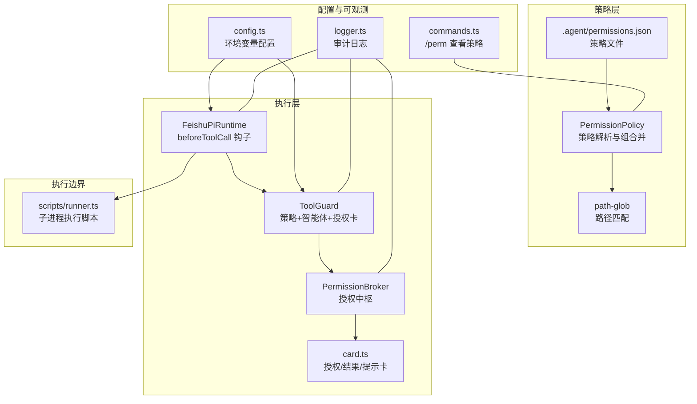
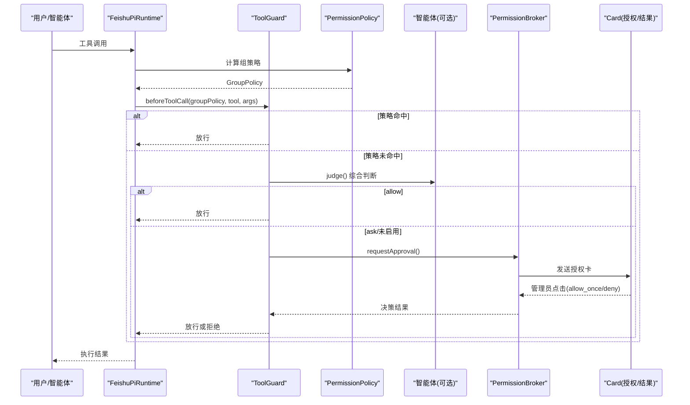
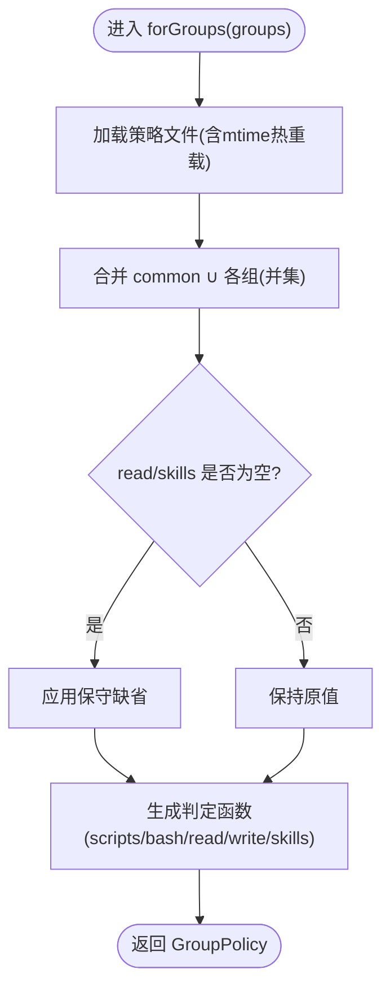
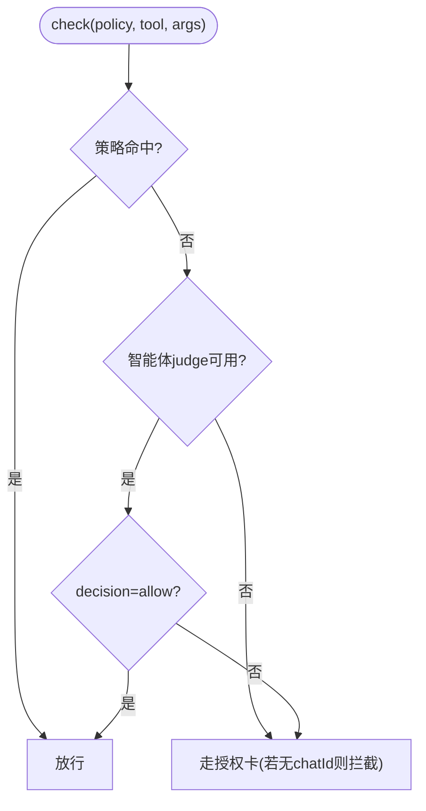
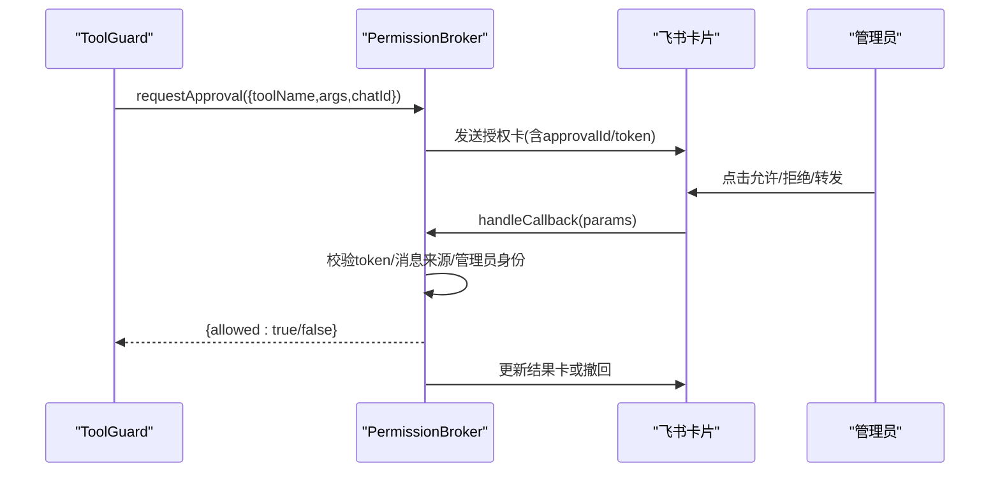
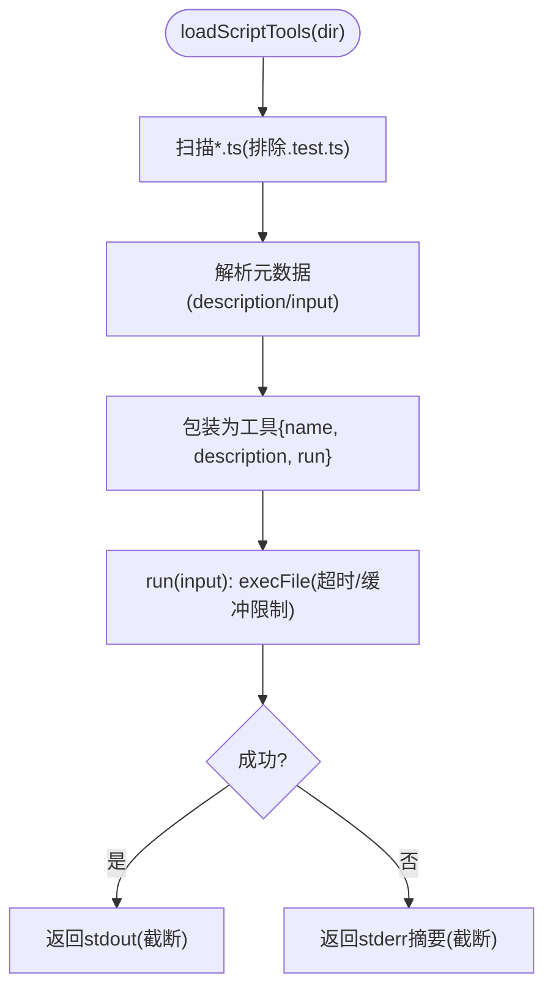
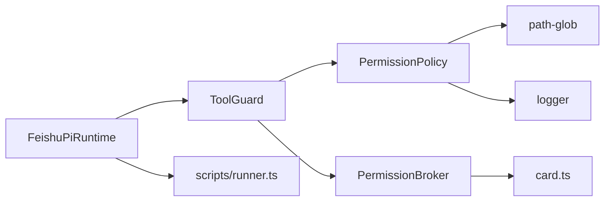

# 安全控制

<cite>
**本文引用的文件**
- [src/guard/broker.ts](file://src/guard/broker.ts)
- [src/guard/card.ts](file://src/guard/card.ts)
- [src/permission/policy.ts](file://src/permission/policy.ts)
- [src/scripts/runner.ts](file://src/scripts/runner.ts)
- [src/tools/registry.ts](file://src/tools/registry.ts)
- [src/utils/path-glob.ts](file://src/utils/path-glob.ts)
- [src/config.ts](file://src/config.ts)
- [src/runtime/feishu-pi-runtime.ts](file://src/runtime/feishu-pi-runtime.ts)
- [src/utils/logger.ts](file://src/utils/logger.ts)
- [src/feishu/commands.ts](file://src/feishu/commands.ts)
- [.agent/permissions.json](file://.agent/permissions.json)
- [test/tool-guard.test.ts](file://test/tool-guard.test.ts)
- [test/policy.test.ts](file://test/policy.test.ts)
- [docs/architecture.md](file://docs/architecture.md)
</cite>

## 目录
1. [简介](#简介)
2. [项目结构](#项目结构)
3. [核心组件](#核心组件)
4. [架构总览](#架构总览)
5. [详细组件分析](#详细组件分析)
6. [依赖关系分析](#依赖关系分析)
7. [性能与资源限制](#性能与资源限制)
8. [故障排查指南](#故障排查指南)
9. [结论](#结论)
10. [附录：配置与审计监控](#附录配置与审计监控)

## 简介
本文件面向管理员与开发者，系统化说明本项目的安全控制机制，覆盖脚本执行边界、权限验证、访问控制、工具守卫（策略评估与执行限制）、进程隔离与资源限制、错误处理策略、安全配置、审计日志与监控方案，以及常见安全风险与防护措施。目标是提供完整的安全实施参考。

## 项目结构
安全相关能力分布在以下模块：
- 权限策略：统一策略文件解析与组策略编译（策略层）
- 工具守卫：策略命中判定、智能体综合判断、授权卡审批（执行层）
- 脚本执行器：子进程执行脚本，带超时与输出限制（执行边界）
- 卡片构建：授权/结果/提示卡片，参数脱敏展示（交互面）
- 路径匹配：glob 规则匹配 read/write/skills 范围（范围判定）
- 运行时钩子：在工具调用前注入守卫检查（集成点）
- 配置加载：环境变量驱动审核与授权超时等（配置面）
- 日志与命令：审计日志与 /perm 查看策略（可观测性）

图表来源
- [src/permission/policy.ts:68-158](file://src/permission/policy.ts#L68-L158)
- [src/utils/path-glob.ts:10-41](file://src/utils/path-glob.ts#L10-L41)
- [src/runtime/feishu-pi-runtime.ts:249-282](file://src/runtime/feishu-pi-runtime.ts#L249-L282)
- [src/guard/broker.ts:46-199](file://src/guard/broker.ts#L46-L199)
- [src/guard/card.ts:27-86](file://src/guard/card.ts#L27-L86)
- [src/scripts/runner.ts:62-79](file://src/scripts/runner.ts#L62-L79)
- [src/config.ts:24-50](file://src/config.ts#L24-L50)
- [src/utils/logger.ts:24-39](file://src/utils/logger.ts#L24-L39)
- [src/feishu/commands.ts:287-313](file://src/feishu/commands.ts#L287-L313)

章节来源
- [docs/architecture.md:82-112](file://docs/architecture.md#L82-L112)
- [docs/architecture.md:197-205](file://docs/architecture.md#L197-L205)

## 核心组件
- 统一权限策略（PermissionPolicy）
  - 从 .agent/permissions.json 加载并热重载；支持 common、owner 与任意用户组；按成员标识（openId/中文名/英文名）入组；合并为 GroupPolicy 判定函数（scripts/bash/read/write/skills）。
  - 默认保守：无组时仅技能目录可读，无脚本与命令权限；owner 未配置字段时全量放行。
- 工具守卫（ToolGuard）
  - 每次工具调用前拦截：先策略命中放行，再交由智能体综合判断（allow/ask），否则走授权卡；read 范围外交直接拦截。
- 授权中枢（PermissionBroker）
  - 管理待授权请求，发送授权卡片，服务端强制校验 approvalId/token/chatId/operatorOpenId，支持转发管理员私聊、精简模式撤回卡片、超时/中断收尾。
- 脚本执行器（scripts/runner.ts）
  - 以子进程执行 .agent/scripts/*.ts，设置超时与输出上限，失败返回 stderr 摘要。
- 路径匹配（path-glob.ts）
  - 将 glob 编译为正则，支持 cwd 基准与相对/绝对路径匹配，防穿越路径误判。
- 配置加载（config.ts）
  - 通过环境变量配置审核接口、模型列表、超时与授权等待时间等。
- 运行时钩子（runtime）
  - 在 beforeToolCall 中注入守卫检查，异常回退为拒绝。
- 日志与命令（logger/commands）
  - 结构化日志；/perm 指令仅管理员可查看当前策略生效范围。

章节来源
- [src/permission/policy.ts:68-158](file://src/permission/policy.ts#L68-L158)
- [src/guard/broker.ts:46-199](file://src/guard/broker.ts#L46-L199)
- [src/scripts/runner.ts:62-79](file://src/scripts/runner.ts#L62-L79)
- [src/utils/path-glob.ts:10-41](file://src/utils/path-glob.ts#L10-L41)
- [src/config.ts:24-50](file://src/config.ts#L24-L50)
- [src/runtime/feishu-pi-runtime.ts:249-282](file://src/runtime/feishu-pi-runtime.ts#L249-L282)
- [src/utils/logger.ts:24-39](file://src/utils/logger.ts#L24-L39)
- [src/feishu/commands.ts:287-313](file://src/feishu/commands.ts#L287-L313)

## 架构总览
安全控制采用“静态策略 + 动态守卫 + 授权审批”的三层体系：
- 策略层：基于 .agent/permissions.json 的组策略，决定会话内可见工具与读写范围。
- 守卫层：对每次工具调用进行策略命中判定；未命中则调用智能体综合判断；仍不确定则发起授权卡。
- 执行层：脚本与 bash 以子进程运行，受超时与输出限制；read/write/edit 由宿主进程权限控制。

图表来源
- [src/runtime/feishu-pi-runtime.ts:249-282](file://src/runtime/feishu-pi-runtime.ts#L249-L282)
- [src/permission/policy.ts:109-158](file://src/permission/policy.ts#L109-L158)
- [src/guard/broker.ts:74-129](file://src/guard/broker.ts#L74-L129)
- [src/guard/card.ts:27-86](file://src/guard/card.ts#L27-L86)

## 详细组件分析

### 权限策略（PermissionPolicy）
- 功能要点
  - 读取 .agent/permissions.json，支持 mtime 热重载；common 与 owner 保留语义；其他组名自定义。
  - 成员匹配支持 openId、中文名、英文名（从 usersFile 缓存解析）。
  - 合并多组策略为并集；空读范围回退到技能目录；skills 空回退为全部。
  - 提供 describe() 用于 /perm 展示。
- 复杂度与性能
  - 组合并使用 Set 去重，O(n)；路径匹配使用预编译正则，单次 O(m)。
- 错误处理
  - 策略文件缺失/解析失败按保守默认处理；usersFile 解析失败忽略。
- 优化建议
  - 大策略文件时减少频繁 reload；按需懒加载 usersFile。

图表来源
- [src/permission/policy.ts:109-158](file://src/permission/policy.ts#L109-L158)
- [src/permission/policy.ts:178-210](file://src/permission/policy.ts#L178-L210)

章节来源
- [src/permission/policy.ts:68-158](file://src/permission/policy.ts#L68-L158)
- [src/permission/policy.ts:178-210](file://src/permission/policy.ts#L178-L210)
- [test/policy.test.ts:14-121](file://test/policy.test.ts#L14-L121)

### 工具守卫（ToolGuard）
- 功能要点
  - 策略命中即放行；未命中则调用智能体 judge；judge 返回 allow 放行，返回 ask 或禁用时走授权卡。
  - read 范围外交直接拦截（能力问题不问人）。
  - scripts 名单外或标记 risky 时走授权卡。
- 错误处理
  - 智能体未配置/超时/异常 → 授权卡；Guard 自身异常 → 拒绝。
- 测试覆盖
  - 覆盖 bash 命中放行、策略未命中且 judge 禁用→拦截、judge allow/ask 分支、write 范围内外、scripts 名单内外与 risky 标记。

图表来源
- [test/tool-guard.test.ts:44-91](file://test/tool-guard.test.ts#L44-L91)
- [src/runtime/feishu-pi-runtime.ts:261-282](file://src/runtime/feishu-pi-runtime.ts#L261-L282)

章节来源
- [test/tool-guard.test.ts:44-91](file://test/tool-guard.test.ts#L44-L91)
- [src/runtime/feishu-pi-runtime.ts:261-282](file://src/runtime/feishu-pi-runtime.ts#L261-L282)

### 授权中枢（PermissionBroker）
- 功能要点
  - 发起授权：生成唯一 approvalId 与一次性 token，发送授权卡片，等待管理员点击；支持转发管理员私聊。
  - 回调校验：严格校验 approvalId/token/chatId/messageId/operatorOpenId；决策者必须是管理员。
  - 收尾逻辑：精简模式撤回卡片，详细模式更新结果卡；支持会话中断取消。
- 安全性
  - 服务端强制校验，跨会话转发无效；授权一次有效，不缓存。
- 错误处理
  - 发送卡片失败直接拒绝；转发失败记录日志并拒绝；超时/中断统一收尾。

图表来源
- [src/guard/broker.ts:74-129](file://src/guard/broker.ts#L74-L129)
- [src/guard/broker.ts:131-199](file://src/guard/broker.ts#L131-L199)
- [src/guard/card.ts:27-86](file://src/guard/card.ts#L27-L86)

章节来源
- [src/guard/broker.ts:46-199](file://src/guard/broker.ts#L46-L199)
- [src/guard/card.ts:27-86](file://src/guard/card.ts#L27-L86)

### 脚本执行器（scripts/runner.ts）
- 功能要点
  - 扫描 .agent/scripts/*.ts，解析元数据（description/input），包装为工具。
  - 以子进程执行脚本，设置超时与输出上限；失败返回 stderr 摘要。
- 信任边界
  - 脚本以子进程全权限运行；能写 scripts 目录（或推 git）的人即拥有进程。
- 错误处理
  - 非零退出码视为失败；输出截断防止过大响应。

图表来源
- [src/scripts/runner.ts:31-79](file://src/scripts/runner.ts#L31-L79)

章节来源
- [src/scripts/runner.ts:31-79](file://src/scripts/runner.ts#L31-L79)

### 路径匹配（path-glob.ts）
- 功能要点
  - 将 glob 编译为正则，支持 cwd 基准与相对/绝对路径匹配；双星加斜杠匹配多层目录。
- 安全性
  - 有 cwd 时同时测试 rel 与 abs 形态，避免穿越路径被原始字符串误判。

章节来源
- [src/utils/path-glob.ts:10-41](file://src/utils/path-glob.ts#L10-L41)

### 运行时钩子（runtime）
- 功能要点
  - 在 beforeToolCall 中注入守卫检查；技能读取命中时记录使用事件；Guard 异常按拒绝处理。
- 错误处理
  - Guard 异常捕获并记录日志，返回 block=true。

章节来源
- [src/runtime/feishu-pi-runtime.ts:249-282](file://src/runtime/feishu-pi-runtime.ts#L249-L282)

### 配置加载（config.ts）
- 关键配置项
  - 审核接口与模型：guardBaseUrl、guardModels、guardApiKey、guardTimeoutMs
  - 授权等待超时：approvalTimeoutMs
  - 工作目录与会话目录：cwd、sessionDir
- 环境变量驱动，便于不同环境部署与安全隔离。

章节来源
- [src/config.ts:24-50](file://src/config.ts#L24-L50)

### 日志与命令（logger/commands）
- 日志
  - 所有日志带时间戳与级别；支持 info/warn/error/log/userInput/aiResponse。
- 命令
  - /perm 仅管理员可查看当前策略生效范围（common 与各组 effective）。

章节来源
- [src/utils/logger.ts:24-39](file://src/utils/logger.ts#L24-L39)
- [src/feishu/commands.ts:287-313](file://src/feishu/commands.ts#L287-L313)

## 依赖关系分析
- PermissionPolicy 依赖 path-glob 进行路径匹配，依赖 logger 记录加载状态。
- ToolGuard 依赖 PermissionPolicy 提供的 GroupPolicy 判定函数，依赖 PermissionBroker 完成授权流程。
- PermissionBroker 依赖 card.ts 构建授权/结果/提示卡片，依赖 logger 记录异常。
- scripts/runner.ts 独立于策略层，但受策略层 scripts 白名单控制注册与调用。
- runtime 作为入口，串联策略、守卫与执行器。

图表来源
- [src/permission/policy.ts:68-158](file://src/permission/policy.ts#L68-L158)
- [src/guard/broker.ts:46-199](file://src/guard/broker.ts#L46-L199)
- [src/scripts/runner.ts:31-79](file://src/scripts/runner.ts#L31-L79)
- [src/runtime/feishu-pi-runtime.ts:249-282](file://src/runtime/feishu-pi-runtime.ts#L249-L282)

章节来源
- [src/permission/policy.ts:68-158](file://src/permission/policy.ts#L68-L158)
- [src/guard/broker.ts:46-199](file://src/guard/broker.ts#L46-L199)
- [src/scripts/runner.ts:31-79](file://src/scripts/runner.ts#L31-L79)
- [src/runtime/feishu-pi-runtime.ts:249-282](file://src/runtime/feishu-pi-runtime.ts#L249-L282)

## 性能与资源限制
- 策略热重载：基于文件 mtime，新会话生效；避免频繁 I/O 重复解析。
- 路径匹配：预编译正则，单次匹配高效；支持 cwd 基准减少误判。
- 脚本执行：30 秒超时、最大缓冲 1MB、输出截断至 8000 字符，防止资源耗尽。
- 授权等待：可配置超时，避免长时间阻塞；支持会话中断快速回收。
- 并发与队列：同一会话串行处理，新消息到达可中止在途请求，降低竞争。

[本节为通用指导，无需特定文件引用]

## 故障排查指南
- 策略文件解析失败
  - 现象：策略加载失败，按保守默认处理（user 仅技能目录可读、无脚本/命令）。
  - 排查：检查 .agent/permissions.json 格式与 members 字段；确认 usersFile 存在且可读。
  - 参考：策略加载与容错逻辑。
- 授权卡无法点击或无效
  - 现象：回调被拒绝，提示 token 或来源不匹配。
  - 排查：确认 approvalId/token 一致；operatorOpenId 属于管理员；消息来源为原卡或已转发卡。
  - 参考：授权回调校验与卡片来源校验。
- 脚本执行失败
  - 现象：非零退出码，返回 stderr 摘要。
  - 排查：检查脚本语法与输入参数；关注超时与输出大小限制。
  - 参考：脚本执行与错误处理。
- 路径读写被拦截
  - 现象：read/write 不在策略范围内被拦截。
  - 排查：确认 glob 规则与 cwd 基准；注意 .. 穿越路径不参与匹配。
  - 参考：路径匹配实现。
- 智能体审核异常
  - 现象：guard 异常导致拒绝。
  - 排查：检查 guardBaseUrl、guardModels、guardApiKey 与超时配置；确认网络连通。
  - 参考：运行时钩子中的异常处理。

章节来源
- [src/permission/policy.ts:178-210](file://src/permission/policy.ts#L178-L210)
- [src/guard/broker.ts:131-199](file://src/guard/broker.ts#L131-L199)
- [src/scripts/runner.ts:62-79](file://src/scripts/runner.ts#L62-L79)
- [src/utils/path-glob.ts:10-41](file://src/utils/path-glob.ts#L10-L41)
- [src/runtime/feishu-pi-runtime.ts:261-282](file://src/runtime/feishu-pi-runtime.ts#L261-L282)

## 结论
本项目通过“策略层 + 守卫层 + 授权审批”的分层安全控制，实现了细粒度的访问控制与风险兜底。策略文件集中管理权限，守卫层确保每次调用可审计、可解释、可干预；授权卡提供人工兜底，结合超时与中断回收保障系统稳定性。配合路径匹配、脚本执行限制与日志审计，形成完整的安全闭环。

[本节为总结，无需特定文件引用]

## 附录：配置与审计监控

### 安全配置指南
- 环境变量
  - 审核接口：FEISHU_GUARD_BASE_URL、FEISHU_GUARD_MODELS、FEISHU_GUARD_API_KEY、FEISHU_GUARD_TIMEOUT_MS
  - 授权超时：FEISHU_APPROVAL_TIMEOUT_MS
  - 工作目录与会话目录：FEISHU_PI_CWD、data/sessions
- 策略文件
  - 编辑 .agent/permissions.json，定义 common、owner 与用户组；members 支持 openId/中文名/英文名。
  - 使用 glob 精确限定 read/write/skills；bash 使用精确或前缀匹配，避免 shell 逃逸。
- 管理员与可见性
  - FEISHU_ADMIN 自动属于 owner；/perm 仅管理员可查看策略生效范围。

章节来源
- [src/config.ts:24-50](file://src/config.ts#L24-L50)
- [.agent/permissions.json:1-21](file://.agent/permissions.json#L1-L21)
- [src/feishu/commands.ts:287-313](file://src/feishu/commands.ts#L287-L313)

### 审计日志与监控方案
- 日志
  - 所有关键操作（策略加载、授权回调、脚本执行、Guard 异常）均记录日志，带时间戳与级别。
- 监控建议
  - 收集授权卡通过率/拒绝率、超时次数、脚本执行失败率、路径拦截统计。
  - 对 Guard 异常与策略解析失败设置告警阈值。
  - 定期导出 /perm 策略快照，对比变更。

章节来源
- [src/utils/logger.ts:24-39](file://src/utils/logger.ts#L24-L39)
- [src/guard/broker.ts:58-72](file://src/guard/broker.ts#L58-L72)
- [src/scripts/runner.ts:62-79](file://src/scripts/runner.ts#L62-L79)
- [src/runtime/feishu-pi-runtime.ts:261-282](file://src/runtime/feishu-pi-runtime.ts#L261-L282)

### 常见安全风险与防护措施
- 风险：脚本写入或系统命令执行导致越权
  - 防护：策略层 scripts/bash 白名单；子进程超时与输出限制；服务以低权限账号运行。
- 风险：路径穿越与越界读写
  - 防护：路径匹配使用 cwd 基准与正则；.. 穿越不参与匹配；read 范围外交直接拦截。
- 风险：授权卡伪造或跨会话劫持
  - 防护：服务端校验 approvalId/token/chatId/operatorOpenId；授权一次有效，不缓存。
- 风险：提示词注入绕过策略
  - 防护：策略判断在代码层执行；策略文件解析失败按最保守处理。
- 风险：凭据泄露
  - 防护：凭据通过环境变量提供，不写入代码或日志。

章节来源
- [docs/architecture.md:197-205](file://docs/architecture.md#L197-L205)
- [src/guard/broker.ts:131-199](file://src/guard/broker.ts#L131-L199)
- [src/utils/path-glob.ts:10-41](file://src/utils/path-glob.ts#L10-L41)
- [src/scripts/runner.ts:62-79](file://src/scripts/runner.ts#L62-L79)