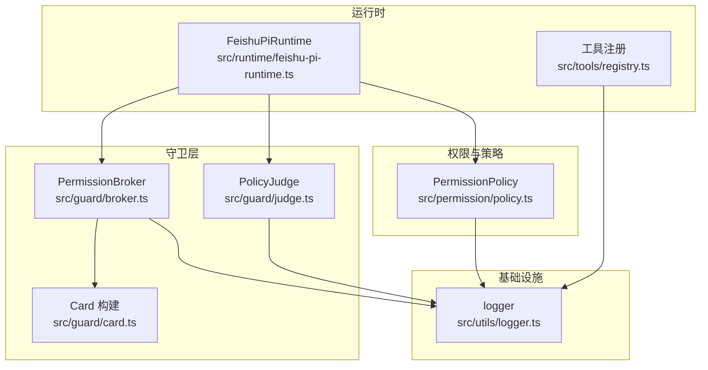
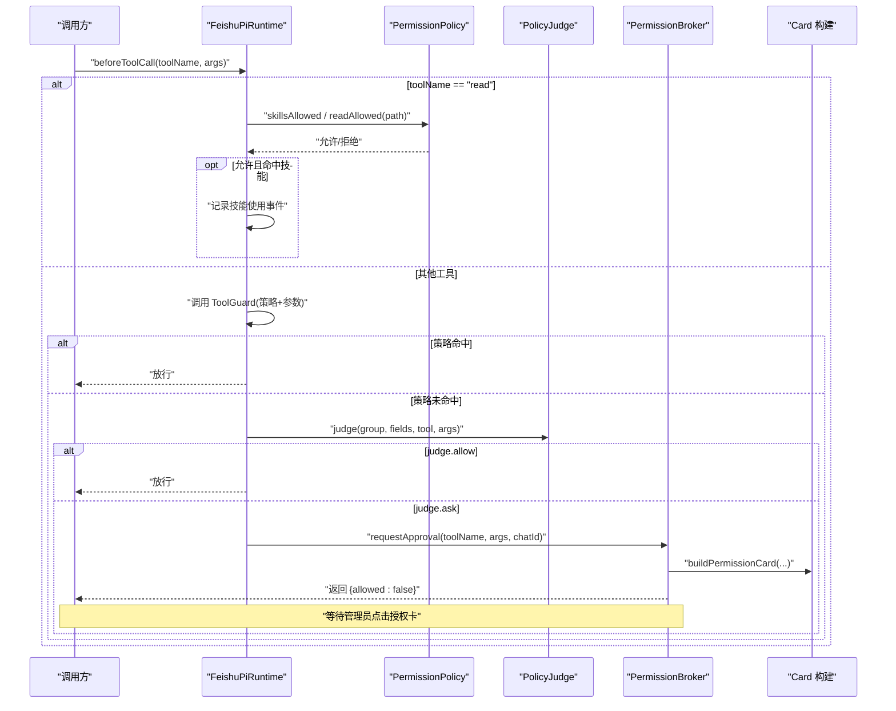
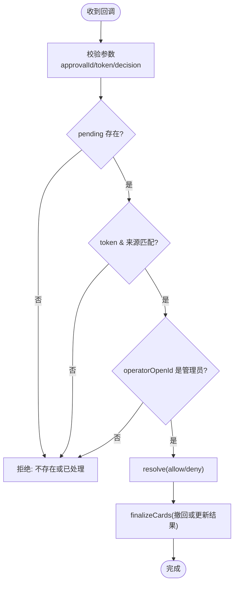
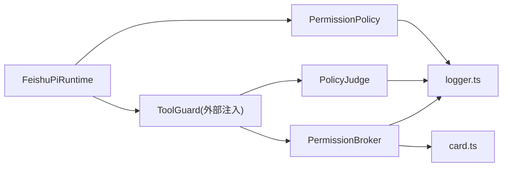

# 工具守卫机制

<cite>
**本文引用的文件**
- [src/guard/broker.ts](file://src/guard/broker.ts)
- [src/guard/card.ts](file://src/guard/card.ts)
- [src/guard/judge.ts](file://src/guard/judge.ts)
- [src/permission/policy.ts](file://src/permission/policy.ts)
- [src/runtime/feishu-pi-runtime.ts](file://src/runtime/feishu-pi-runtime.ts)
- [src/tools/registry.ts](file://src/tools/registry.ts)
- [src/utils/logger.ts](file://src/utils/logger.ts)
- [test/tool-guard.test.ts](file://test/tool-guard.test.ts)
- [README.md](file://README.md)
- [docs/architecture.md](file://docs/architecture.md)
</cite>

## 目录
1. [简介](#简介)
2. [项目结构](#项目结构)
3. [核心组件](#核心组件)
4. [架构总览](#架构总览)
5. [详细组件分析](#详细组件分析)
6. [依赖关系分析](#依赖关系分析)
7. [性能与可靠性](#性能与可靠性)
8. [故障排查指南](#故障排查指南)
9. [结论](#结论)
10. [附录：配置与集成示例](#附录：配置与集成示例)

## 简介
本文件系统性说明“工具守卫机制”的设计与实现，覆盖安全验证流程、审批工作流、执行限制、守卫代理器工作原理、卡片操作安全控制、错误处理策略、工具注册与权限检查、执行上下文管理、自定义守卫开发与集成、以及安全审计、日志记录与监控告警方案。目标是帮助开发者在飞书 Agent 平台中构建可靠、可审计、可扩展的工具调用防护体系。

## 项目结构
围绕工具守卫的关键代码分布在以下模块：
- 授权中枢与卡片：src/guard/broker.ts、src/guard/card.ts
- 智能体审核：src/guard/judge.ts
- 权限策略：src/permission/policy.ts
- 运行时注入 Guard：src/runtime/feishu-pi-runtime.ts
- 工具注册：src/tools/registry.ts
- 日志：src/utils/logger.ts
- 测试用例：test/tool-guard.test.ts
- 文档与架构说明：README.md、docs/architecture.md

图表来源
- [src/runtime/feishu-pi-runtime.ts:147-284](file://src/runtime/feishu-pi-runtime.ts#L147-L284)
- [src/guard/broker.ts:46-199](file://src/guard/broker.ts#L46-L199)
- [src/guard/judge.ts:43-120](file://src/guard/judge.ts#L43-L120)
- [src/permission/policy.ts:68-158](file://src/permission/policy.ts#L68-L158)
- [src/tools/registry.ts:42-45](file://src/tools/registry.ts#L42-L45)
- [src/utils/logger.ts:24-39](file://src/utils/logger.ts#L24-L39)

章节来源
- [docs/architecture.md:82-114](file://docs/architecture.md#L82-L114)
- [README.md:519-574](file://README.md#L519-L574)

## 核心组件
- PermissionBroker（授权中枢）：维护待授权请求、发送/更新/撤回授权卡片、转发管理员私聊、服务端强制校验 token/chatId/operatorOpenId/decision，超时或会话中断自动收尾。
- Card 构建器：生成授权卡、结果卡、提示卡；对敏感字段脱敏，命令摘要截断展示。
- PolicyJudge（智能体审核）：以组策略为参考，调用模型综合判断是否放行或弹卡；多模型并行取安全交集；异常/未配置一律 ask。
- PermissionPolicy（权限策略）：解析 .agent/permissions.json，按 common ∪ 所属组合并策略，提供 scripts/bash/read/write/skills 判定函数。
- FeishuPiRuntime（运行时注入）：在 beforeToolCall 钩子中先判 read 范围，再交由 ToolGuard（由外部注入），并记录技能使用统计。
- 工具注册：加载脚本工具与内置工具，结合策略进行可见性过滤。

章节来源
- [src/guard/broker.ts:46-199](file://src/guard/broker.ts#L46-L199)
- [src/guard/card.ts:1-102](file://src/guard/card.ts#L1-L102)
- [src/guard/judge.ts:43-120](file://src/guard/judge.ts#L43-L120)
- [src/permission/policy.ts:68-158](file://src/permission/policy.ts#L68-L158)
- [src/runtime/feishu-pi-runtime.ts:226-282](file://src/runtime/feishu-pi-runtime.ts#L226-L282)
- [src/tools/registry.ts:42-45](file://src/tools/registry.ts#L42-L45)

## 架构总览
工具调用的完整安全链路如下：
- 运行时在 beforeToolCall 钩子拦截每次工具调用。
- 对 read 工具优先按 skills/read 范围判定，范围外直接拦截不弹卡。
- 其他工具交由 ToolGuard（策略 → 智能体 → 授权卡）。
- 策略命中则放行；未命中进入智能体审核；若允许则放行，否则弹出授权卡等待管理员单次确认。
- 授权卡回调在服务端严格校验 token、消息来源、操作者身份与决策合法性。

图表来源
- [src/runtime/feishu-pi-runtime.ts:226-282](file://src/runtime/feishu-pi-runtime.ts#L226-L282)
- [src/guard/judge.ts:55-66](file://src/guard/judge.ts#L55-L66)
- [src/guard/broker.ts:78-128](file://src/guard/broker.ts#L78-L128)
- [src/guard/card.ts:28-62](file://src/guard/card.ts#L28-L62)
- [src/permission/policy.ts:110-158](file://src/permission/policy.ts#L110-L158)

## 详细组件分析

### 授权中枢（PermissionBroker）
- 职责：发起授权、维护待决队列、处理回调、转发管理员、超时/中止收尾、精简/详细模式下的卡片撤回或结果更新。
- 关键流程：
  - requestApproval：创建 approvalId + token，发送授权卡，设置超时定时器，支持 AbortSignal 取消。
  - handleCallback：校验 approvalId/token/chatId/messageId/operatorOpenId/decision，仅管理员有效，去重处理。
  - forwardToAdmin：将授权卡转发到管理员私聊，原卡更新为提示。
  - finalizeCards：根据 shouldRecall 决定撤回或更新结果卡。

图表来源
- [src/guard/broker.ts:132-166](file://src/guard/broker.ts#L132-L166)
- [src/guard/broker.ts:58-72](file://src/guard/broker.ts#L58-L72)

章节来源
- [src/guard/broker.ts:46-199](file://src/guard/broker.ts#L46-L199)

### 卡片构建与安全展示
- buildPermissionCard：生成包含工具名、参数摘要、三个按钮（允许一次/拒绝/转发管理员）的卡片。
- buildResultCard：显示授权结果（允许一次/拒绝/超时/取消）。
- buildNoticeCard：用于转发提示等无交互场景。
- 敏感字段脱敏：token/password/api_key/secret/cookie/authorization 等递归替换为 ***。
- 命令摘要截断：最多 1200 字符，换行与反引号转义。

章节来源
- [src/guard/card.ts:1-102](file://src/guard/card.ts#L1-L102)

### 智能体审核（PolicyJudge）
- 输入：身份组、该组授权范围、本次工具调用。
- 行为：多模型并行调用 OpenAI 兼容接口，全部 allow 才放行；任一 ask 即弹卡；未配置/超时/异常一律 ask。
- 输出：{ decision: "allow"|"ask", reason }。

章节来源
- [src/guard/judge.ts:43-120](file://src/guard/judge.ts#L43-L120)

### 权限策略（PermissionPolicy）
- 解析 .agent/permissions.json，合并 common 与所属组，生成 GroupPolicy。
- 提供 scriptsAllowed、bashAllowed、readAllowed、writeAllowed、skillsAllowed 判定函数。
- 防逃逸：bash 含 shell 元字符不参与前缀匹配；路径穿越串不参与匹配。
- 热重载：基于 mtime 刷新策略；失败时保守默认。

章节来源
- [src/permission/policy.ts:68-158](file://src/permission/policy.ts#L68-L158)
- [src/permission/policy.ts:178-210](file://src/permission/policy.ts#L178-L210)

### 运行时注入与执行上下文
- 在 createSession 中注入 beforeToolCall：
  - read：按 skills/read 范围判定，命中技能读取记录使用事件。
  - 其他工具：调用外部 ToolGuard（策略→智能体→授权卡）。
  - 异常兜底：Guard 异常按拒绝处理并记录日志。
- 工具注册：脚本工具按组 scripts 名单注册；内置工具按组策略暴露。

章节来源
- [src/runtime/feishu-pi-runtime.ts:147-284](file://src/runtime/feishu-pi-runtime.ts#L147-L284)
- [src/tools/registry.ts:42-45](file://src/tools/registry.ts#L42-L45)

### 测试与行为验证
- 覆盖 bash 白名单放行、策略未命中且智能体未启用时弹卡、智能体 allow/ask 分支、write 范围内外判定、scripts 名单与 risky 标记、scripts 名单外走授权卡等行为。

章节来源
- [test/tool-guard.test.ts:44-91](file://test/tool-guard.test.ts#L44-L91)

## 依赖关系分析
- 运行时依赖策略与守卫：FeishuPiRuntime 通过 permissionPolicy 获取组策略，并通过 toolGuard 钩子接入守卫链。
- 守卫依赖卡片与日志：PermissionBroker 依赖 card 构建与 logger 记录。
- 智能体审核依赖网络与超时控制：PolicyJudge 使用 fetch 调用模型接口，带超时与异常降级。
- 策略依赖文件系统与 glob 匹配：PermissionPolicy 读取策略文件并使用 path-glob 匹配。

图表来源
- [src/runtime/feishu-pi-runtime.ts:226-282](file://src/runtime/feishu-pi-runtime.ts#L226-L282)
- [src/guard/judge.ts:55-120](file://src/guard/judge.ts#L55-L120)
- [src/guard/broker.ts:78-199](file://src/guard/broker.ts#L78-L199)
- [src/permission/policy.ts:110-158](file://src/permission/policy.ts#L110-L158)
- [src/utils/logger.ts:24-39](file://src/utils/logger.ts#L24-L39)

## 性能与可靠性
- 并发与超时：
  - 智能体审核多模型并行，统一超时控制，避免长尾阻塞。
  - 授权卡等待具备超时与 AbortSignal 支持，会话中断及时释放资源。
- 容错与降级：
  - 策略文件解析失败按保守默认处理。
  - 智能体审核异常或未配置一律 ask，确保 fail-safe。
  - 卡片发送/更新/撤回失败记录警告但不阻断主流程。
- 资源占用：
  - 精简模式下授权确认后自动撤回卡片，减少会话占用。
  - 命令与参数摘要截断，避免超长内容影响渲染。

[本节为通用指导，无需特定文件引用]

## 故障排查指南
- 授权卡无效：
  - 检查 approvalId/token 是否一致，消息来源是否为原卡或转发卡，操作者是否为管理员，decision 是否合法，是否重复处理。
- 无法发送/更新卡片：
  - 查看 broker.sendCard/updateCard/recallCard 的错误日志，确认飞书 API 可用性与权限。
- 智能体审核异常：
  - 检查 baseUrl/models/apiKey 配置，确认 HTTP 响应与 JSON 解析；异常会降级为 ask。
- 策略未生效：
  - 确认 .agent/permissions.json 语法正确、mtime 变化后新会话重新加载；解析失败会回退保守默认。
- 日志定位：
  - 使用 logger.info/warn/error 输出，关注 [Broker]、[Judge]、[Policy]、[Runtime] 等标签。

章节来源
- [src/guard/broker.ts:58-72](file://src/guard/broker.ts#L58-L72)
- [src/guard/judge.ts:102-119](file://src/guard/judge.ts#L102-L119)
- [src/permission/policy.ts:178-210](file://src/permission/policy.ts#L178-L210)
- [src/utils/logger.ts:24-39](file://src/utils/logger.ts#L24-L39)

## 结论
工具守卫机制通过“策略白名单 + 智能体综合判断 + 管理员授权卡”三层防线，在保证灵活性的同时实现了最小权限与可审计的执行环境。PermissionBroker 提供强一致的服务端校验与完善的卡片生命周期管理；PolicyJudge 解决复杂命令与边界场景的综合判断；PermissionPolicy 提供可热重载、防逃逸的权限判定。配合运行时注入的 beforeToolCall 钩子，形成从工具注册到执行的全链路安全防护。

[本节为总结性内容，无需特定文件引用]

## 附录：配置与集成示例

### 守卫配置示例
- 环境变量：
  - FEISHU_APPROVAL_TIMEOUT_MS：授权卡等待超时（毫秒）。
  - FEISHU_GUARD_*：智能体审核相关配置（baseUrl、models、apiKey、timeoutMs）。
- 策略文件：
  - .agent/permissions.json：定义 common、owner、user 组的 tools、bash、read、write、skills。
- 白名单（可选）：
  - .agent/settings.json 中的 permissions.allow 采用 Claude Code 风格规则，用于免审放行。

章节来源
- [README.md:546-574](file://README.md#L546-L574)

### 自定义守卫开发与集成
- 在运行时配置中注入 toolGuard 钩子，接收 groupPolicy 与调用参数，返回 undefined（放行）或 { block: true, reason }（拦截）。
- 典型实现：
  - 策略命中放行。
  - 策略未命中调用 PolicyJudge 综合判断。
  - 需要人工介入时调用 PermissionBroker.requestApproval 发起授权卡。
- 集成点：
  - FeishuPiRuntime.createSession 中设置 session.agent.beforeToolCall。
  - 工具注册阶段按组策略过滤脚本工具。

章节来源
- [src/runtime/feishu-pi-runtime.ts:226-282](file://src/runtime/feishu-pi-runtime.ts#L226-L282)
- [src/tools/registry.ts:42-45](file://src/tools/registry.ts#L42-L45)

### 安全审计、日志与监控告警
- 审计要点：
  - 授权卡回调必须通过 PermissionBroker.handleCallback 校验，禁止前端绕过。
  - 所有敏感参数在授权卡中脱敏展示。
  - read 范围外直接拦截，不弹卡，避免泄露能力边界。
- 日志建议：
  - 使用 logger 输出关键节点：策略加载、授权卡发送/更新/撤回、智能体审核结果、Guard 异常。
  - 结合业务指标（如弹卡率、超时率、拒绝率）建立监控看板。
- 告警建议：
  - 授权卡发送/更新/撤回失败告警。
  - 智能体审核接口异常或超时告警。
  - 策略文件解析失败告警。

章节来源
- [src/guard/broker.ts:58-72](file://src/guard/broker.ts#L58-L72)
- [src/guard/judge.ts:102-119](file://src/guard/judge.ts#L102-L119)
- [src/utils/logger.ts:24-39](file://src/utils/logger.ts#L24-L39)