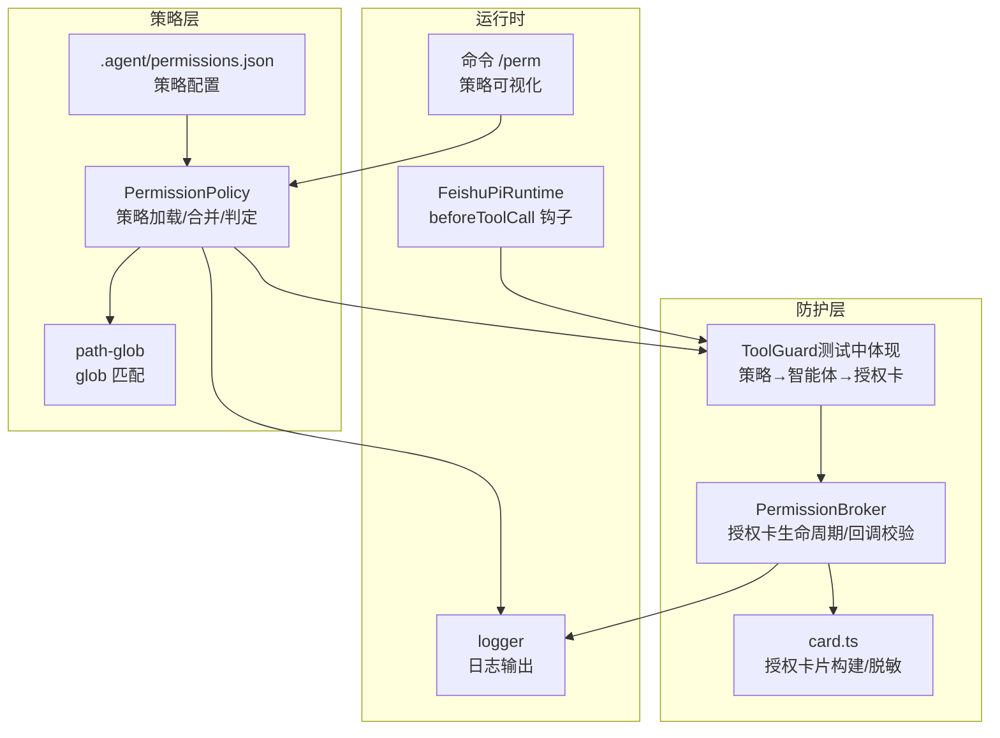
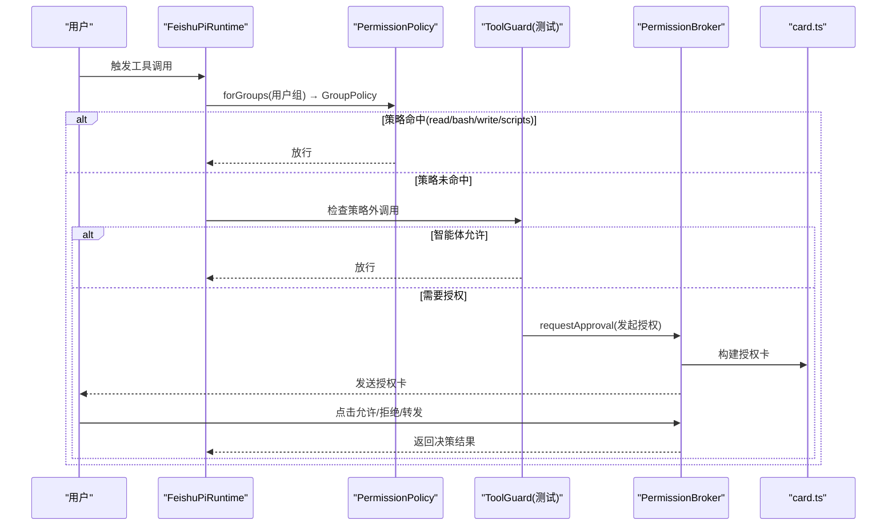
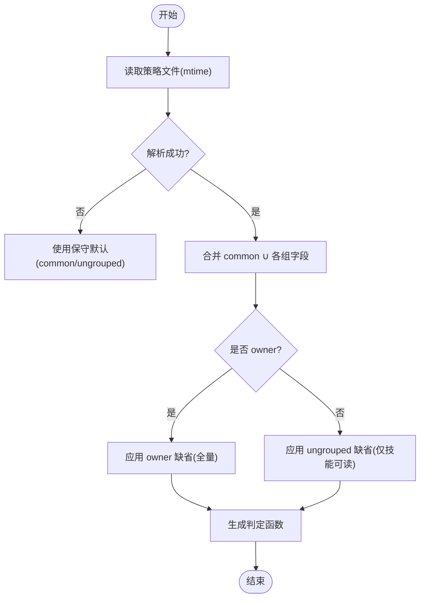
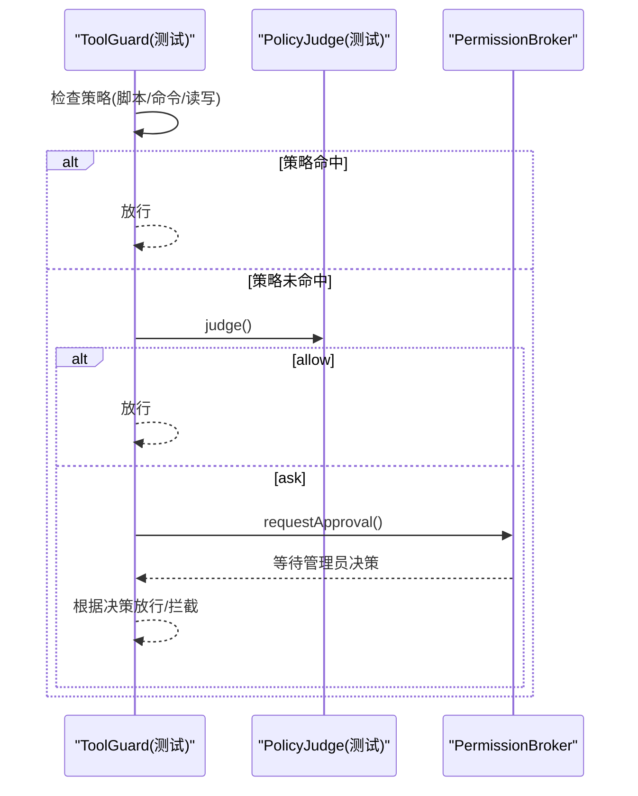
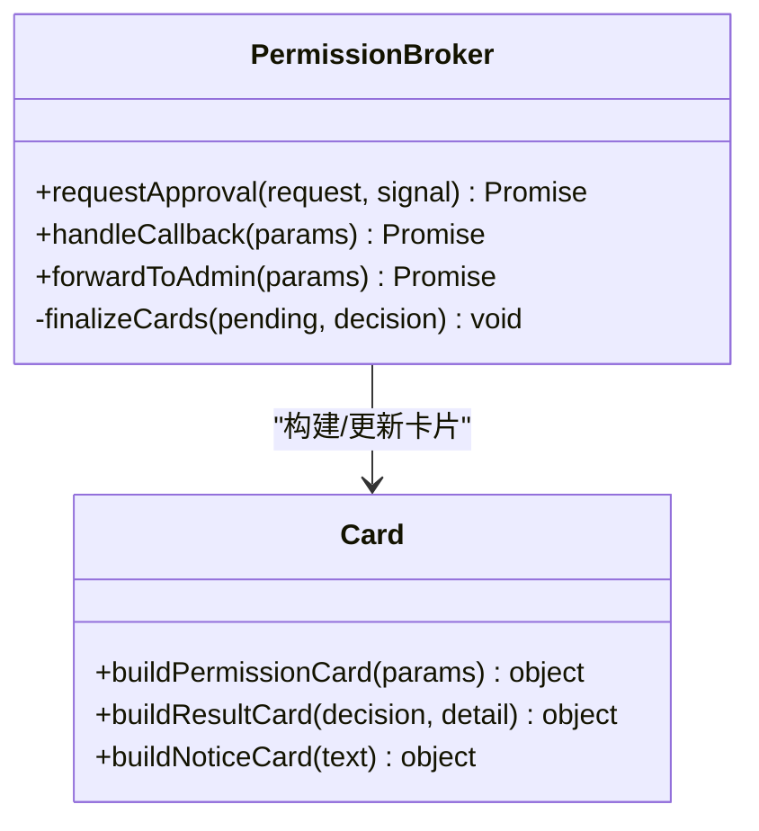
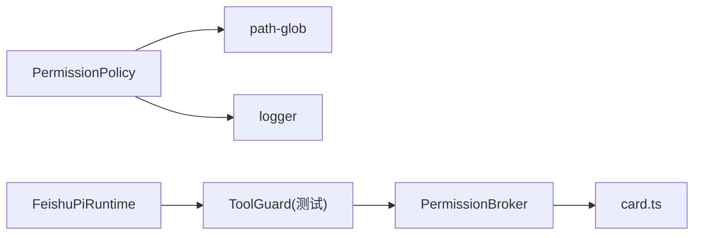

# 权限策略引擎

<cite>
**本文引用的文件**
- [src/permission/policy.ts](file://src/permission/policy.ts)
- [.agent/permissions.json](file://.agent/permissions.json)
- [src/guard/broker.ts](file://src/guard/broker.ts)
- [src/guard/card.ts](file://src/guard/card.ts)
- [src/utils/path-glob.ts](file://src/utils/path-glob.ts)
- [src/utils/logger.ts](file://src/utils/logger.ts)
- [src/runtime/feishu-pi-runtime.ts](file://src/runtime/feishu-pi-runtime.ts)
- [src/feishu/commands.ts](file://src/feishu/commands.ts)
- [test/policy.test.ts](file://test/policy.test.ts)
- [test/tool-guard.test.ts](file://test/tool-guard.test.ts)
- [docs/architecture.md](file://docs/architecture.md)
</cite>

## 目录
1. [简介](#简介)
2. [项目结构](#项目结构)
3. [核心组件](#核心组件)
4. [架构总览](#架构总览)
5. [详细组件分析](#详细组件分析)
6. [依赖关系分析](#依赖关系分析)
7. [性能与缓存](#性能与缓存)
8. [故障排查指南](#故障排查指南)
9. [结论](#结论)
10. [附录：配置示例与最佳实践](#附录：配置示例与最佳实践)

## 简介
本文件为“权限策略引擎”的完整技术与管理参考，聚焦基于组的细粒度权限控制机制。内容覆盖用户组管理、工具访问控制、策略评估流程、策略配置格式与规则定义、继承关系、执行时机、缓存机制与性能优化、策略配置示例、最佳实践、故障排查以及权限审计日志与监控方案，帮助管理员全面掌握权限管理能力。

## 项目结构
权限策略引擎由“策略解析与合并”“路径匹配”“授权卡与审批中枢”“运行时钩子集成”“指令展示”等模块组成，围绕统一策略文件进行集中式治理。

**图表来源**
- [src/permission/policy.ts:68-210](file://src/permission/policy.ts#L68-L210)
- [src/utils/path-glob.ts:10-41](file://src/utils/path-glob.ts#L10-L41)
- [src/guard/broker.ts:46-199](file://src/guard/broker.ts#L46-L199)
- [src/guard/card.ts:27-86](file://src/guard/card.ts#L27-L86)
- [src/runtime/feishu-pi-runtime.ts:249-282](file://src/runtime/feishu-pi-runtime.ts#L249-L282)
- [src/feishu/commands.ts:287-313](file://src/feishu/commands.ts#L287-L313)
- [src/utils/logger.ts:24-39](file://src/utils/logger.ts#L24-L39)

**章节来源**
- [docs/architecture.md:82-114](file://docs/architecture.md#L82-L114)
- [src/permission/policy.ts:68-210](file://src/permission/policy.ts#L68-L210)
- [src/guard/broker.ts:46-199](file://src/guard/broker.ts#L46-L199)
- [src/guard/card.ts:27-86](file://src/guard/card.ts#L27-L86)
- [src/utils/path-glob.ts:10-41](file://src/utils/path-glob.ts#L10-L41)
- [src/runtime/feishu-pi-runtime.ts:249-282](file://src/runtime/feishu-pi-runtime.ts#L249-L282)
- [src/feishu/commands.ts:287-313](file://src/feishu/commands.ts#L287-L313)
- [src/utils/logger.ts:24-39](file://src/utils/logger.ts#L24-L39)

## 核心组件
- PermissionPolicy：负责加载策略文件、按成员标识匹配组、合并 common 与各组权限、生成可执行的判定函数（脚本、bash、read/write、skills）。
- path-glob：提供 glob 到正则的转换与路径匹配能力，用于 read/write/skills 范围判定。
- ToolGuard（在测试中体现）：将策略判定结果与智能体判断结合，必要时发起授权卡审批。
- PermissionBroker：管理授权请求的生命周期，发送/更新/撤回卡片，处理回调并强制校验。
- card.ts：构建授权卡片、结果卡、提示卡，并对敏感参数进行脱敏展示。
- FeishuPiRuntime：在 beforeToolCall 钩子中注入策略与 Guard，实现每次工具调用的安全拦截。
- 命令 /perm：向管理员展示当前策略与生效范围。

**章节来源**
- [src/permission/policy.ts:34-158](file://src/permission/policy.ts#L34-L158)
- [src/utils/path-glob.ts:10-41](file://src/utils/path-glob.ts#L10-L41)
- [test/tool-guard.test.ts:1-91](file://test/tool-guard.test.ts#L1-L91)
- [src/guard/broker.ts:46-199](file://src/guard/broker.ts#L46-L199)
- [src/guard/card.ts:27-86](file://src/guard/card.ts#L27-L86)
- [src/runtime/feishu-pi-runtime.ts:249-282](file://src/runtime/feishu-pi-runtime.ts#L249-L282)
- [src/feishu/commands.ts:287-313](file://src/feishu/commands.ts#L287-L313)

## 架构总览
权限策略引擎采用“静态策略 + 动态审核”的双层机制：
- 静态策略：通过 .agent/permissions.json 声明组成员、脚本白名单、bash 命令白名单、read/write 路径范围、技能可见范围；common 层对所有用户生效，owner 拥有默认全量权限。
- 动态审核：每次工具调用进入 beforeToolCall 钩子，先按策略放行或拦截；未命中时交由智能体综合判断；仍不确定则弹出授权卡，由管理员一次性决策。

**图表来源**
- [src/runtime/feishu-pi-runtime.ts:249-282](file://src/runtime/feishu-pi-runtime.ts#L249-L282)
- [src/permission/policy.ts:109-158](file://src/permission/policy.ts#L109-L158)
- [test/tool-guard.test.ts:44-91](file://test/tool-guard.test.ts#L44-L91)
- [src/guard/broker.ts:78-129](file://src/guard/broker.ts#L78-L129)
- [src/guard/card.ts:27-86](file://src/guard/card.ts#L27-L86)

## 详细组件分析

### PermissionPolicy：组策略解析与合并
- 成员匹配：支持 openId、中文名、英文名（从用户缓存解析），FEISHU_ADMIN 自动归属 owner。
- 策略合并：生效范围 = common ∪ 所属各组（并集）；owner 缺省全量；无组时保守缺省（仅技能目录可读）。
- 判定函数：scriptsAllowed、bashAllowed、readAllowed、writeAllowed、skillsAllowed。
- 热重载：基于策略文件 mtime 增量加载；解析失败回退保守默认。
- 用户缓存：usersFile 按 mtime 刷新，openId → 姓名映射供成员匹配。

**图表来源**
- [src/permission/policy.ts:109-158](file://src/permission/policy.ts#L109-L158)
- [src/permission/policy.ts:178-210](file://src/permission/policy.ts#L178-L210)
- [src/permission/policy.ts:232-248](file://src/permission/policy.ts#L232-L248)

**章节来源**
- [src/permission/policy.ts:68-210](file://src/permission/policy.ts#L68-L210)
- [test/policy.test.ts:14-121](file://test/policy.test.ts#L14-L121)

### path-glob：路径匹配与范围判定
- 将 glob 转换为正则，支持 **、*、? 及任意深度匹配。
- matchGlobs 支持相对/绝对路径与 cwd 基准，避免穿越路径误判。
- 用于 read/write/skills 的范围判定。

**章节来源**
- [src/utils/path-glob.ts:10-41](file://src/utils/path-glob.ts#L10-L41)

### ToolGuard：策略 → 智能体 → 授权卡
- 策略命中即放行（read 先判 skills 再判 read；bash 白名单；write 白名单；scripts 白名单且非高风险）。
- 策略未命中时交由智能体综合判断；allow 放行，ask 走授权卡。
- 无 chatId 或智能体不可用时直接拦截。

**图表来源**
- [test/tool-guard.test.ts:44-91](file://test/tool-guard.test.ts#L44-L91)

**章节来源**
- [test/tool-guard.test.ts:1-91](file://test/tool-guard.test.ts#L1-L91)

### PermissionBroker：授权卡生命周期与回调校验
- 发起授权：生成唯一 approvalId 与一次性 token，发送授权卡，设置超时。
- 回调校验：token 一致、消息来源匹配、操作者为管理员、决策合法。
- 收尾：精简模式撤回卡片，详细模式更新结果卡；支持转发给管理员私聊。

**图表来源**
- [src/guard/broker.ts:46-199](file://src/guard/broker.ts#L46-L199)
- [src/guard/card.ts:27-86](file://src/guard/card.ts#L27-L86)

**章节来源**
- [src/guard/broker.ts:46-199](file://src/guard/broker.ts#L46-L199)
- [src/guard/card.ts:27-86](file://src/guard/card.ts#L27-L86)

### 运行时集成：beforeToolCall 钩子
- 在工具调用前注入策略与 Guard，记录技能使用事件（read 命中技能目录时）。
- Guard 异常按拒绝处理，确保 fail-safe。

**章节来源**
- [src/runtime/feishu-pi-runtime.ts:249-282](file://src/runtime/feishu-pi-runtime.ts#L249-L282)

### 指令 /perm：策略可视化
- 仅管理员可用，展示 common 与各组成员、生效范围（合并后的 scripts/bash/read/write/skills）。

**章节来源**
- [src/feishu/commands.ts:287-313](file://src/feishu/commands.ts#L287-L313)

## 依赖关系分析
- PermissionPolicy 依赖 path-glob 进行路径匹配，依赖 logger 输出加载状态与错误信息。
- ToolGuard（测试）依赖 PermissionBroker 与 PolicyJudge（测试）完成策略外调用的智能体判断与授权。
- PermissionBroker 依赖 card.ts 构建授权卡片与结果卡。
- FeishuPiRuntime 在 beforeToolCall 中串联策略与 Guard，形成完整的权限拦截链路。

**图表来源**
- [src/permission/policy.ts:68-210](file://src/permission/policy.ts#L68-L210)
- [src/utils/path-glob.ts:10-41](file://src/utils/path-glob.ts#L10-L41)
- [src/utils/logger.ts:24-39](file://src/utils/logger.ts#L24-L39)
- [src/runtime/feishu-pi-runtime.ts:249-282](file://src/runtime/feishu-pi-runtime.ts#L249-L282)
- [test/tool-guard.test.ts:1-91](file://test/tool-guard.test.ts#L1-L91)
- [src/guard/broker.ts:46-199](file://src/guard/broker.ts#L46-L199)
- [src/guard/card.ts:27-86](file://src/guard/card.ts#L27-L86)

**章节来源**
- [docs/architecture.md:82-114](file://docs/architecture.md#L82-L114)

## 性能与缓存
- 策略文件热重载：基于 mtime 增量加载，减少重复 IO；解析失败回退保守默认，保证可用性。
- 用户资料缓存：usersFile 按 mtime 刷新，openId 到姓名的映射缓存于内存 Map，降低查询开销。
- 路径匹配优化：glob 编译为正则后复用，matchGlobs 同时测试相对与绝对路径，避免误判与额外计算。
- 授权卡超时与回收：broker 维护 pending 队列，超时或会话中断及时清理，防止资源泄漏。
- 建议：
  - 合理拆分策略文件，避免过大 JSON 导致解析延迟。
  - 使用精确的前缀匹配（cmd:*）减少 bash 规则数量。
  - 对高频 read/write 路径使用更具体的 glob，提升匹配效率。

**章节来源**
- [src/permission/policy.ts:178-229](file://src/permission/policy.ts#L178-L229)
- [src/utils/path-glob.ts:10-41](file://src/utils/path-glob.ts#L10-L41)
- [src/guard/broker.ts:78-129](file://src/guard/broker.ts#L78-L129)

## 故障排查指南
- 策略文件缺失或解析失败：系统按保守默认处理（user 仅技能目录可读、无脚本与命令），请检查 .agent/permissions.json 语法与路径。
- 成员不生效：确认 members 列表包含 openId/中文名/英文名；检查 usersFile 是否存在且 mtime 已更新。
- bash 命令被拦截：若命令包含 shell 元字符（如 ; & | ` 或 $(...)），不参与匹配，会转交授权卡；请调整命令或使用前缀匹配。
- read/write 不生效：确认 glob 与 cwd 基准一致；避免使用 .. 穿越路径；技能目录优先走 skills 字段。
- 授权卡未送达：检查管理员 Open ID 配置、sendCard/updateCard 回调实现；确认 broker 超时时间合理。
- 日志定位：查看 logger 输出的策略加载与 broker 错误信息，快速定位问题。

**章节来源**
- [src/permission/policy.ts:178-210](file://src/permission/policy.ts#L178-L210)
- [src/guard/broker.ts:78-129](file://src/guard/broker.ts#L78-L129)
- [src/utils/logger.ts:24-39](file://src/utils/logger.ts#L24-L39)

## 结论
权限策略引擎通过“统一策略文件 + 动态审核”的组合，实现了基于组的细粒度权限控制。策略文件集中管理、热重载、保守默认；运行时在 beforeToolCall 钩子中严格拦截；策略外调用引入智能体判断与授权卡机制，兼顾灵活性与安全性。配合路径匹配与缓存优化，整体性能可控、可观测性强，适合多角色协作场景下的权限治理。

## 附录：配置示例与最佳实践

### 策略配置格式说明
- 顶层键：common（通用）、owner（负责人）、自定义组名（如 user1、vip）。
- 字段：
  - members：成员标识（openId/中文名/英文名）
  - scripts：可调用的脚本名（.agent/scripts/ 文件名去扩展名）
  - bash：可执行命令（精确匹配、cmd:* 前缀匹配、* 全部）
  - read/write：路径 glob（读/写范围）
  - skills：技能文件 glob（可见范围）
- 生效范围：common ∪ 所属各组（并集）；owner 缺省全量；无组保守缺省。

**章节来源**
- [.agent/permissions.json:1-21](file://.agent/permissions.json#L1-L21)
- [src/permission/policy.ts:34-67](file://src/permission/policy.ts#L34-L67)
- [src/permission/policy.ts:109-158](file://src/permission/policy.ts#L109-L158)

### 最佳实践
- 最小权限原则：为普通用户仅开放必要脚本与命令，read/write 范围尽量具体。
- 使用 common 层共享基础能力（如技能目录可读），在各组中叠加差异化权限。
- 谨慎使用 * 与 **，避免过度放行；bash 使用前缀匹配提高可控性。
- 定期审查 /perm 输出，确保策略与实际需求一致。
- 将敏感参数在授权卡中脱敏展示，避免泄露。

**章节来源**
- [src/guard/card.ts:1-25](file://src/guard/card.ts#L1-L25)
- [src/feishu/commands.ts:287-313](file://src/feishu/commands.ts#L287-L313)

### 权限审计日志与监控方案
- 策略加载与错误：通过 logger 输出策略加载成功与解析失败信息，便于运维追踪。
- 技能使用统计：read 命中技能目录时记录事件流（data/stats/skill-usage.jsonl），支持自然语言查询与本地可视化页面。
- 授权卡审计：broker 记录 pending 请求与回调结果，支持超时、取消、拒绝等状态；结果卡保留决策痕迹。
- 建议：
  - 将 skill-usage.jsonl 接入长期存储与分析平台，按人/技能/时间聚合。
  - 对 broker 的超时与失败进行告警，确保授权通道健康。
  - 定期导出 /perm 快照，作为策略变更审计依据。

**章节来源**
- [src/utils/logger.ts:24-39](file://src/utils/logger.ts#L24-L39)
- [docs/architecture.md:120-127](file://docs/architecture.md#L120-L127)
- [src/guard/broker.ts:78-199](file://src/guard/broker.ts#L78-L199)