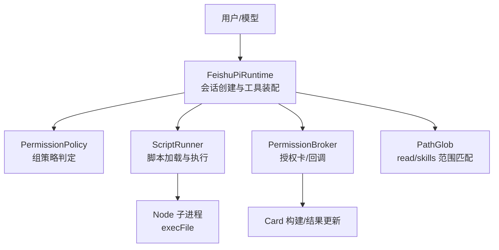
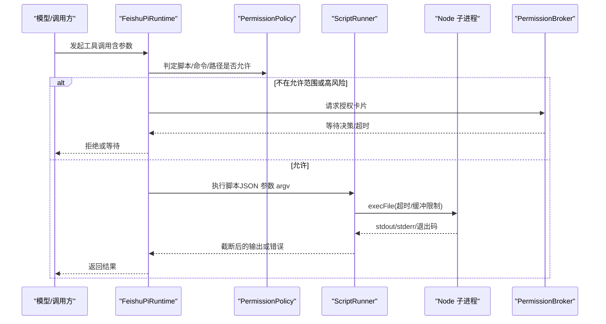
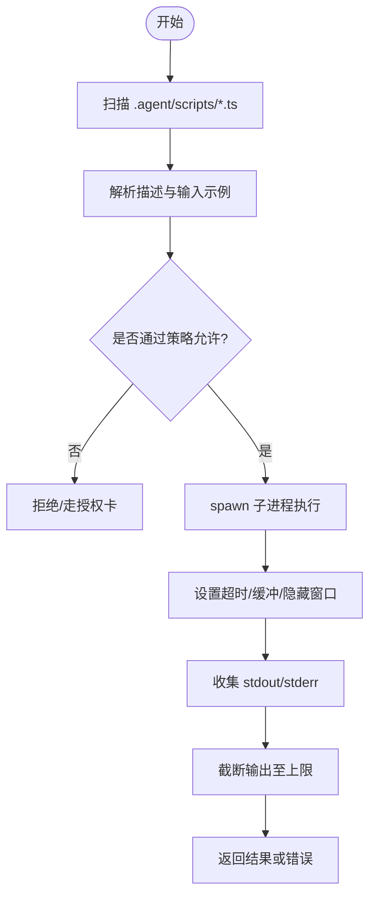
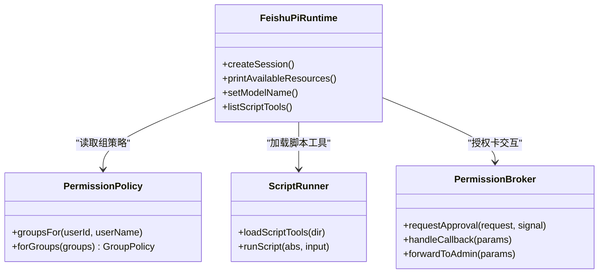
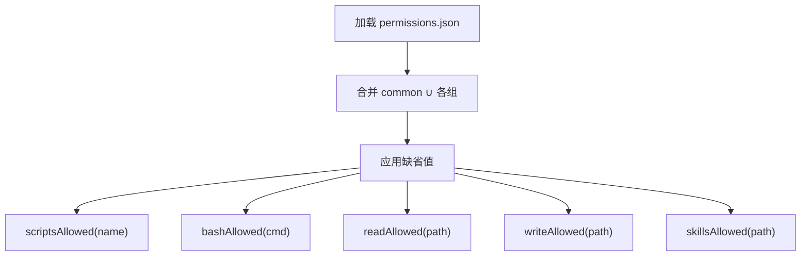
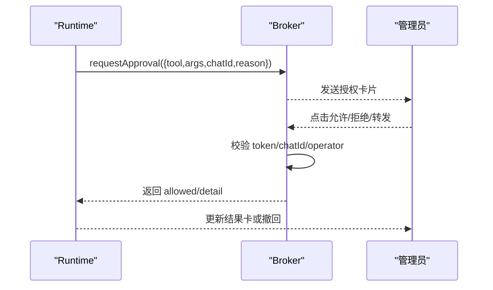
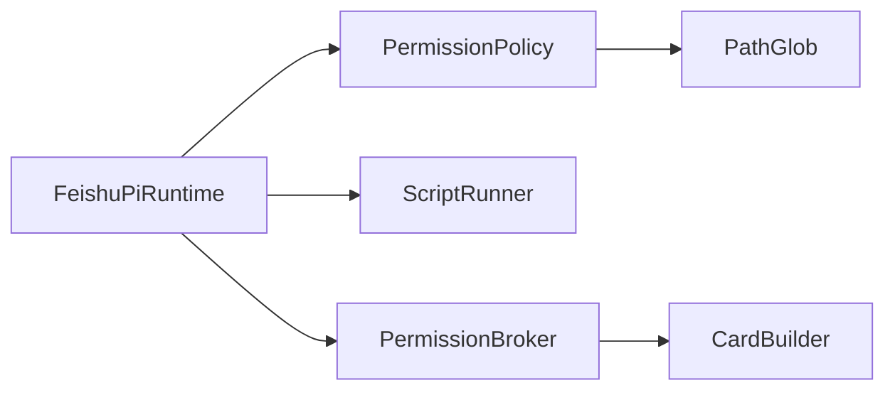

# 脚本安全边界

<cite>
**本文引用的文件**
- [runner.ts](file://src/scripts/runner.ts)
- [feishu-pi-runtime.ts](file://src/runtime/feishu-pi-runtime.ts)
- [policy.ts](file://src/permission/policy.ts)
- [broker.ts](file://src/guard/broker.ts)
- [card.ts](file://src/guard/card.ts)
- [path-glob.ts](file://src/utils/path-glob.ts)
- [start.js](file://scripts/start.js)
- [package.json](file://package.json)
- [architecture.md](file://docs/architecture.md)
</cite>

## 目录
1. [简介](#简介)
2. [项目结构](#项目结构)
3. [核心组件](#核心组件)
4. [架构总览](#架构总览)
5. [详细组件分析](#详细组件分析)
6. [依赖关系分析](#依赖关系分析)
7. [性能与资源限制](#性能与资源限制)
8. [故障排查指南](#故障排查指南)
9. [结论](#结论)
10. [附录：配置与安全清单](#附录：配置与安全清单)

## 简介
本文件聚焦“脚本安全边界”，系统性说明脚本执行的进程隔离机制、资源限制与安全控制点，覆盖超时控制、输出截断、内存限制、文件系统访问控制、脚本加载验证、元数据解析、执行环境隔离、安全配置参数、风险缓解措施与监控方案。同时提供常见安全威胁分析与防护策略，并给出开发者编写和使用脚本的安全实践建议。

## 项目结构
本项目将“脚本工具”以 .agent/scripts/*.ts 形式提供，每个脚本即一个能力；运行时通过子进程执行脚本，并在会话层进行权限与审核拦截。关键路径如下：
- 脚本执行器：src/scripts/runner.ts
- 运行时与会话装配：src/runtime/feishu-pi-runtime.ts
- 权限策略与组范围：src/permission/policy.ts
- 授权中枢（卡片审批）：src/guard/broker.ts, src/guard/card.ts
- 路径匹配工具：src/utils/path-glob.ts
- 启动与退出管理：scripts/start.js
- 依赖与入口：package.json
- 安全边界说明：docs/architecture.md

图表来源
- [feishu-pi-runtime.ts:147-284](file://src/runtime/feishu-pi-runtime.ts#L147-L284)
- [runner.ts:31-79](file://src/scripts/runner.ts#L31-L79)
- [policy.ts:68-158](file://src/permission/policy.ts#L68-L158)
- [broker.ts:46-129](file://src/guard/broker.ts#L46-L129)
- [card.ts:20-62](file://src/guard/card.ts#L20-L62)
- [path-glob.ts:10-41](file://src/utils/path-glob.ts#L10-L41)

章节来源
- [feishu-pi-runtime.ts:147-284](file://src/runtime/feishu-pi-runtime.ts#L147-L284)
- [runner.ts:31-79](file://src/scripts/runner.ts#L31-L79)
- [policy.ts:68-158](file://src/permission/policy.ts#L68-L158)
- [broker.ts:46-129](file://src/guard/broker.ts#L46-L129)
- [card.ts:20-62](file://src/guard/card.ts#L20-L62)
- [path-glob.ts:10-41](file://src/utils/path-glob.ts#L10-L41)

## 核心组件
- 脚本执行器（runner.ts）：扫描 .agent/scripts/*.ts，解析顶部注释元数据（description、input），并以 Node 子进程执行脚本，设置超时与输出上限。
- 运行时（feishu-pi-runtime.ts）：创建会话、装配内置与脚本工具、注入 beforeToolCall 钩子实现 read 范围校验与 ToolGuard 审核、记录技能使用统计。
- 权限策略（policy.ts）：基于 .agent/permissions.json 定义身份组与规则，合并 common 与所属组策略，提供 scripts/bash/read/write/skills 判定函数。
- 授权中枢（broker.ts + card.ts）：发送授权卡片、处理回调、强制服务端校验 token/chatId/操作者身份，支持转发管理员与超时/取消收尾。
- 路径匹配（path-glob.ts）：统一 glob 语义，避免穿越路径误判，支撑 read/skills 范围判定。

章节来源
- [runner.ts:6-21](file://src/scripts/runner.ts#L6-L21)
- [runner.ts:31-79](file://src/scripts/runner.ts#L31-L79)
- [feishu-pi-runtime.ts:147-284](file://src/runtime/feishu-pi-runtime.ts#L147-L284)
- [policy.ts:6-32](file://src/permission/policy.ts#L6-L32)
- [policy.ts:68-158](file://src/permission/policy.ts#L68-L158)
- [broker.ts:41-129](file://src/guard/broker.ts#L41-L129)
- [card.ts:1-102](file://src/guard/card.ts#L1-L102)
- [path-glob.ts:4-41](file://src/utils/path-glob.ts#L4-L41)

## 架构总览
下图展示一次脚本工具调用的端到端流程：从模型触发到脚本执行、权限与审核拦截、以及超时与输出控制。

图表来源
- [feishu-pi-runtime.ts:170-284](file://src/runtime/feishu-pi-runtime.ts#L170-L284)
- [runner.ts:62-79](file://src/scripts/runner.ts#L62-L79)
- [broker.ts:74-129](file://src/guard/broker.ts#L74-L129)

## 详细组件分析

### 脚本执行器（runner.ts）
- 脚本契约与元数据解析：
  - 要求脚本顶部包含 description 与可选 input 注释，用于模型理解与参数提示。
  - 文件名（去扩展名）作为工具名；非零退出码视为失败。
- 执行方式与隔离：
  - 通过 Node 子进程 execFile 运行脚本，参数以 JSON 字符串经 process.argv[2] 传入。
  - 子进程拥有与父进程相同的系统权限，信任边界为“能写脚本目录的人即拥有进程”。
- 资源限制：
  - 超时：固定 30 秒，防止长时间占用。
  - 输出截断：stdout/stderr 最多截取固定长度，避免大输出阻塞或溢出。
  - 缓冲区：maxBuffer 限制子进程输出缓冲大小，防止内存暴涨。
- 错误处理：
  - 异常时返回错误信息（stderr 或 error.message），并截断至输出上限。

图表来源
- [runner.ts:31-79](file://src/scripts/runner.ts#L31-L79)

章节来源
- [runner.ts:6-21](file://src/scripts/runner.ts#L6-L21)
- [runner.ts:31-79](file://src/scripts/runner.ts#L31-L79)

### 运行时与会话装配（feishu-pi-runtime.ts）
- 会话创建与工具装配：
  - 根据用户身份计算所属组，加载策略，按组过滤可注册的脚本工具。
  - 内置工具按组注册（owner 全量，普通用户有限）。
  - 自定义脚本工具通过 runner 加载，仅当策略允许时注册。
- 执行前钩子（beforeToolCall）：
  - read：若目标在技能目录则按 skills 范围判定，否则按 read 范围判定；范围内放行并记录使用事件。
  - 其他工具：交由 ToolGuard 审核，高风险工具强制走授权卡。
- 会话持久化与中断：
  - 提前写入 session_info，确保中断/崩溃不丢失会话映射。
  - 支持 abort 信号，及时终止等待中的授权请求。

图表来源
- [feishu-pi-runtime.ts:147-284](file://src/runtime/feishu-pi-runtime.ts#L147-L284)
- [policy.ts:68-158](file://src/permission/policy.ts#L68-L158)
- [runner.ts:31-79](file://src/scripts/runner.ts#L31-L79)
- [broker.ts:46-129](file://src/guard/broker.ts#L46-L129)

章节来源
- [feishu-pi-runtime.ts:147-284](file://src/runtime/feishu-pi-runtime.ts#L147-L284)

### 权限策略（policy.ts）
- 组策略文件：.agent/permissions.json，定义 common 与各用户组的成员、脚本、bash、read/write、skills 范围。
- 合并与默认：
  - 生效范围 = common ∪ 所属各组（并集）。
  - 未在任何组：保守默认（仅技能目录可读、无脚本、无命令）。
  - owner 缺省字段取全量。
- bash 保护：
  - 检测 shell 元字符（;&|` 与 $(），命中即不参与匹配，转交授权卡，防逃逸。
- 路径匹配：
  - 使用 path-glob 统一语义，resolve/cwd 归一化，避免 .. 穿越被误判。

图表来源
- [policy.ts:6-32](file://src/permission/policy.ts#L6-L32)
- [policy.ts:109-158](file://src/permission/policy.ts#L109-L158)

章节来源
- [policy.ts:6-32](file://src/permission/policy.ts#L6-L32)
- [policy.ts:68-158](file://src/permission/policy.ts#L68-L158)
- [policy.ts:178-210](file://src/permission/policy.ts#L178-L210)

### 授权中枢（broker.ts + card.ts）
- 授权流程：
  - 生成一次性 approvalId 与随机 token，发送授权卡片，等待管理员点击。
  - 回调时服务端强制校验：token 一致、消息来源匹配、操作者为管理员、决策合法。
  - 支持转发给管理员私聊，原卡更新为提示。
- 超时与取消：
  - 超时自动拒绝并收尾卡片。
  - 会话中断（abort）立即取消等待并收尾。
- 卡片内容：
  - 脱敏敏感字段，摘要展示关键参数，按钮三等分（允许一次/拒绝/转发管理员）。

图表来源
- [broker.ts:74-129](file://src/guard/broker.ts#L74-L129)
- [broker.ts:131-198](file://src/guard/broker.ts#L131-L198)
- [card.ts:20-62](file://src/guard/card.ts#L20-L62)

章节来源
- [broker.ts:41-129](file://src/guard/broker.ts#L41-L129)
- [broker.ts:131-198](file://src/guard/broker.ts#L131-L198)
- [card.ts:1-102](file://src/guard/card.ts#L1-L102)

### 路径匹配（path-glob.ts）
- 统一 glob 语义，支持 **、*、? 及任意深度匹配。
- 有 cwd 时测试相对与绝对两种形态，避免 .. 穿越被原始字符串误判。
- 支持 ~/ 展开家目录，规范化路径分隔符。

章节来源
- [path-glob.ts:4-41](file://src/utils/path-glob.ts#L4-L41)

## 依赖关系分析
- 运行时依赖策略与脚本执行器，并通过授权中枢完成高风险操作的审批。
- 策略模块依赖路径匹配工具，保证读/写/技能可见范围的准确判定。
- 启动脚本负责优雅退出，确保子进程清理。

图表来源
- [feishu-pi-runtime.ts:147-284](file://src/runtime/feishu-pi-runtime.ts#L147-L284)
- [policy.ts:68-158](file://src/permission/policy.ts#L68-L158)
- [runner.ts:31-79](file://src/scripts/runner.ts#L31-L79)
- [broker.ts:46-129](file://src/guard/broker.ts#L46-L129)
- [card.ts:20-62](file://src/guard/card.ts#L20-L62)
- [path-glob.ts:10-41](file://src/utils/path-glob.ts#L10-L41)

章节来源
- [feishu-pi-runtime.ts:147-284](file://src/runtime/feishu-pi-runtime.ts#L147-L284)
- [policy.ts:68-158](file://src/permission/policy.ts#L68-L158)
- [runner.ts:31-79](file://src/scripts/runner.ts#L31-L79)
- [broker.ts:46-129](file://src/guard/broker.ts#L46-L129)
- [card.ts:20-62](file://src/guard/card.ts#L20-L62)
- [path-glob.ts:10-41](file://src/utils/path-glob.ts#L10-L41)

## 性能与资源限制
- 超时控制：脚本执行固定 30 秒超时，避免长时间占用 CPU/IO。
- 输出截断：stdout/stderr 最大截取固定长度，防止响应过大。
- 内存限制：子进程 maxBuffer 限制输出缓冲，避免内存暴涨。
- 进程隔离：脚本以独立子进程运行，但共享系统权限；需配合低权限账号与隔离工作目录。
- 会话与资源：会话文件提前落盘，减少中断/崩溃导致的状态丢失。

章节来源
- [runner.ts:20-21](file://src/scripts/runner.ts#L20-L21)
- [runner.ts:62-79](file://src/scripts/runner.ts#L62-L79)
- [architecture.md:197-205](file://docs/architecture.md#L197-L205)

## 故障排查指南
- 脚本加载失败：检查脚本是否包含 description 元数据；查看日志中加载失败的警告。
- 脚本执行超时：确认脚本逻辑是否过于耗时；必要时拆分任务或优化 IO。
- 输出过大：注意输出截断策略；如需完整输出，应改为文件落盘并只返回摘要。
- 权限拒绝：核对 .agent/permissions.json 的 scripts/bash/read/write/skills 配置；关注 shell 元字符导致的拒绝。
- 授权卡问题：确认管理员 Open ID 配置、回调参数校验、网络可达性；检查卡片发送/更新/撤回日志。
- 路径匹配异常：确认 cwd 设置正确；避免使用 .. 穿越路径；检查 glob 模式是否符合预期。

章节来源
- [runner.ts:31-79](file://src/scripts/runner.ts#L31-L79)
- [policy.ts:109-158](file://src/permission/policy.ts#L109-L158)
- [broker.ts:74-129](file://src/guard/broker.ts#L74-L129)
- [card.ts:20-62](file://src/guard/card.ts#L20-L62)
- [path-glob.ts:10-41](file://src/utils/path-glob.ts#L10-L41)

## 结论
本项目的脚本安全边界由“策略+审核+执行隔离”三层构成：
- 策略层：通过 .agent/permissions.json 精确控制脚本、命令、读写与技能可见范围。
- 审核层：高风险或越界调用走授权卡，服务端强校验 token 与操作者身份。
- 执行层：脚本以子进程运行，具备超时、输出截断与缓冲限制；信任边界明确，需以低权限账号与隔离目录运行。

结合上述机制，可在保障灵活性的同时有效降低滥用风险。

## 附录：配置与安全清单
- 环境变量与配置项（来自配置加载）：
  - FEISHU_APP_ID / FEISHU_APP_SECRET / FEISHU_ADMIN
  - FEISHU_PI_CWD / FEISHU_PI_MODEL_PROVIDER / FEISHU_PI_MODEL_NAME / FEISHU_PI_MODEL_BASE_URL / FEISHU_PI_SYSTEM_PROMPT
  - FEISHU_GUARD_BASE_URL / FEISHU_GUARD_MODELS / FEISHU_GUARD_API_KEY / FEISHU_GUARD_TIMEOUT_MS / FEISHU_APPROVAL_TIMEOUT_MS
- 策略文件：.agent/permissions.json
  - 关键字段：common、owner、各用户组；members、scripts、bash、read、write、skills
- 脚本约定：.agent/scripts/*.ts
  - 必须包含 description；可选 input；参数通过 process.argv[2] 获取；console.log 输出结果
- 安全实践：
  - 服务以低权限账号运行，工作目录隔离
  - 严格配置 read/write/skills 范围，避免过宽
  - 对高风险脚本标记 risk: high，强制走授权卡
  - 定期审查 permissions.json 与脚本变更
  - 监控日志：脚本加载、执行、授权卡回调、路径匹配结果

章节来源
- [config.ts:1-51](file://src/config.ts#L1-L51)
- [policy.ts:6-32](file://src/permission/policy.ts#L6-L32)
- [runner.ts:6-21](file://src/scripts/runner.ts#L6-L21)
- [architecture.md:197-205](file://docs/architecture.md#L197-L205)