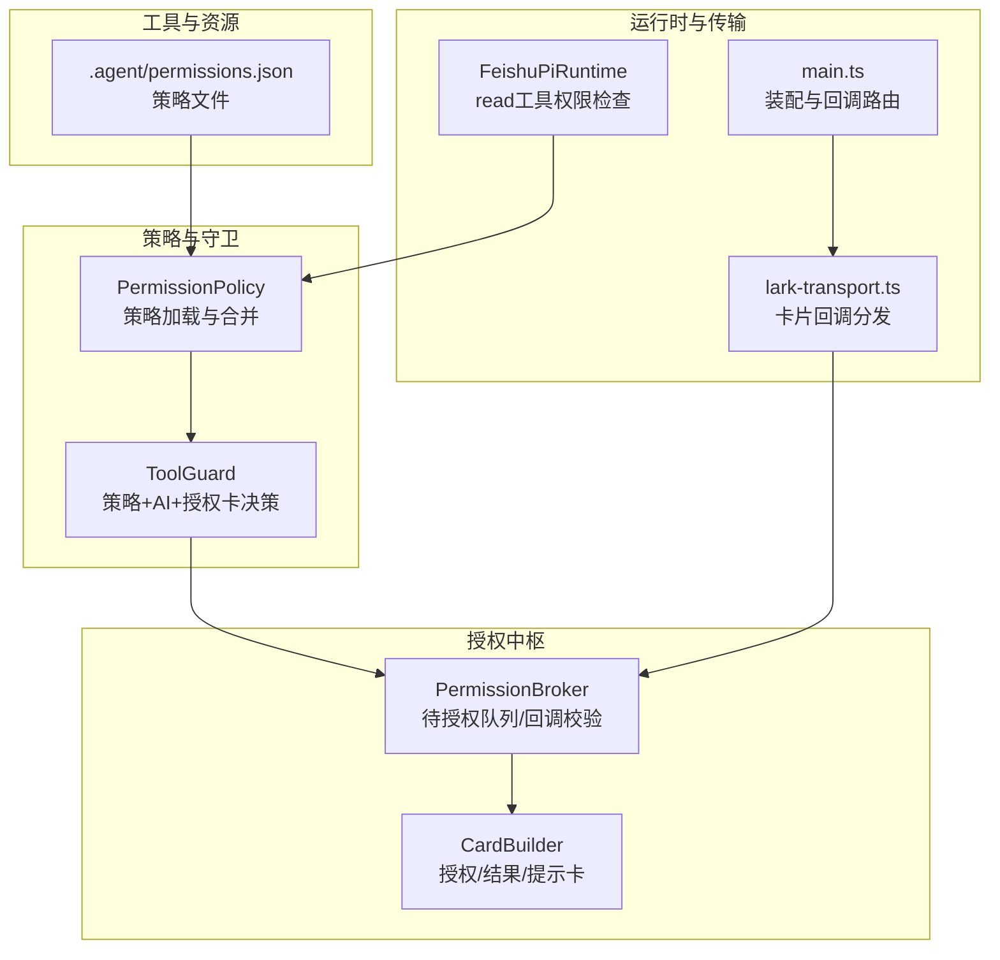
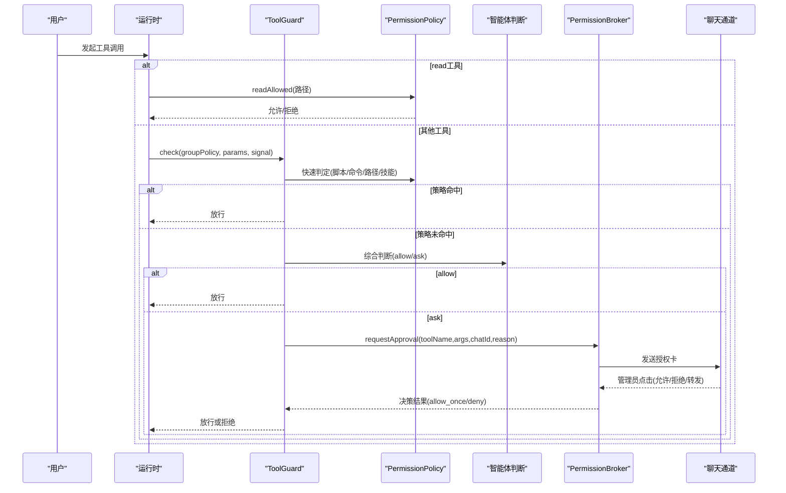
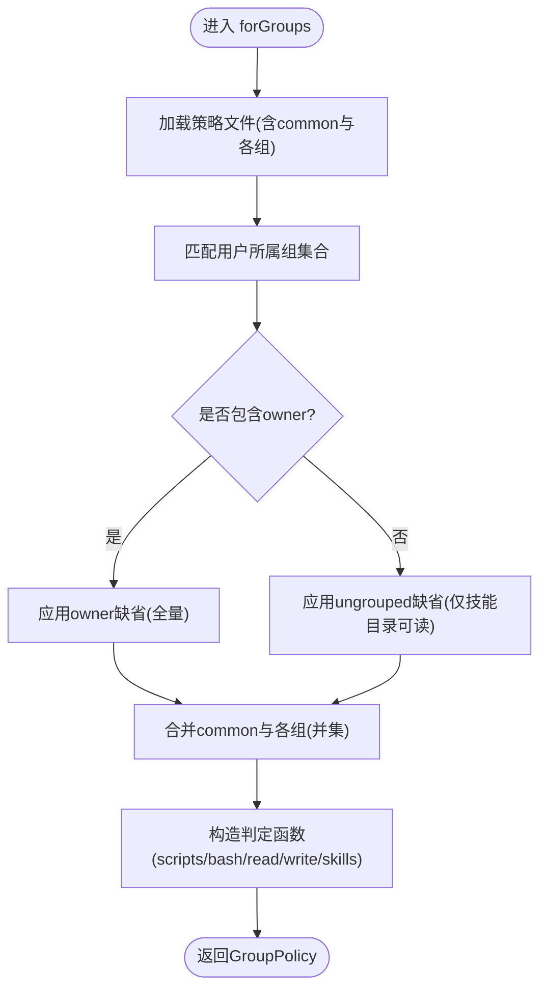
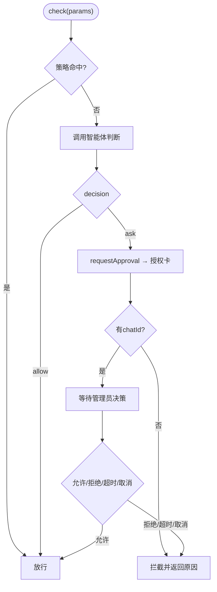
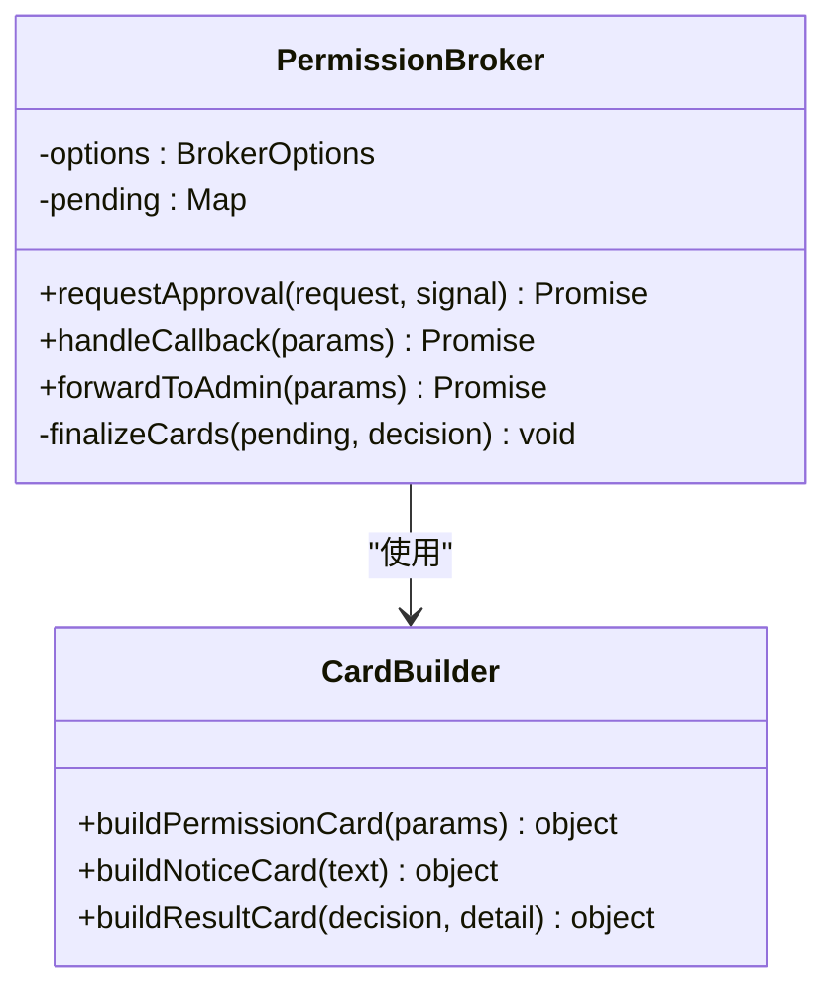
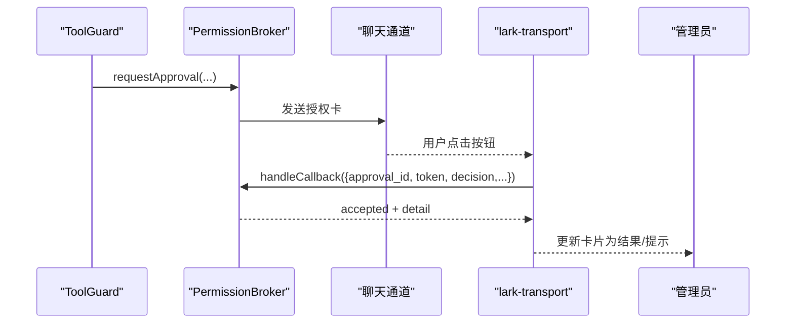
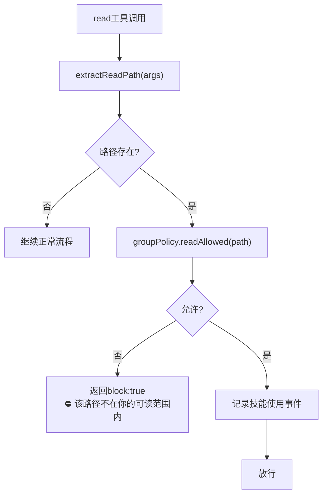
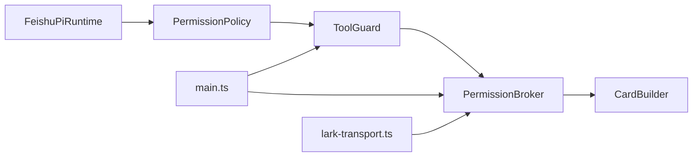

# 工具安全控制

<cite>
**本文引用的文件**
- [src/guard/broker.ts](file://src/guard/broker.ts)
- [src/guard/card.ts](file://src/guard/card.ts)
- [src/permission/policy.ts](file://src/permission/policy.ts)
- [src/tools/registry.ts](file://src/tools/registry.ts)
- [.agent/permissions.json](file://.agent/permissions.json)
- [src/main.ts](file://src/main.ts)
- [src/feishu/lark-transport.ts](file://src/feishu/lark-transport.ts)
- [test/tool-guard.test.ts](file://test/tool-guard.test.ts)
- [test/policy.test.ts](file://test/policy.test.ts)
- [src/runtime/feishu-pi-runtime.ts](file://src/runtime/feishu-pi-runtime.ts)
- [src/guard/tool-guard.ts](file://src/guard/tool-guard.ts)
- [src/guard/judge.ts](file://src/guard/judge.ts)
</cite>

## 更新摘要
**变更内容**
- 移除了旧的受限读取功能（createRestrictedReadTool）和 PermissionFilteredResourceLoader 类
- 所有读访问现在统一通过 permissions.json 策略系统控制，不再提供特殊的只读访问模式
- 更新了运行时中的 read 工具处理逻辑，直接使用 GroupPolicy.readAllowed 进行权限判定
- 简化了资源加载架构，技能文档对所有用户开放，不做权限过滤

## 目录
1. [简介](#简介)
2. [项目结构](#项目结构)
3. [核心组件](#核心组件)
4. [架构总览](#架构总览)
5. [详细组件分析](#详细组件分析)
6. [依赖关系分析](#依赖关系分析)
7. [性能与安全特性](#性能与安全特性)
8. [故障排除指南](#故障排除指南)
9. [结论](#结论)
10. [附录：配置与最佳实践](#附录配置与最佳实践)

## 简介
本文件系统性说明"工具安全控制"的设计与实现，覆盖以下主题：
- 工具调用的权限验证机制：用户组策略评估、工具访问控制、审批流程
- 工具守卫（ToolGuard）工作原理与卡片操作的权限检查
- 安全策略执行流程与异常处理
- 安全配置示例、权限设计模式与常见威胁防护
- 面向管理员与开发者的完整安全配置参考

整体目标是在最小侵入的前提下，通过"策略文件 + 守卫层 + 授权卡"的三层机制，确保敏感工具调用必须经过明确授权或白名单放行。

**更新** 移除了旧的受限读取功能，现在所有读访问都通过统一的 permissions.json 策略系统控制，简化了权限模型并提高了安全性。

## 项目结构
围绕工具安全控制的代码主要分布在 guard、permission、tools、runtime 以及入口 main 中：
- 策略层：PermissionPolicy 负责加载并合并多组权限策略，提供脚本、命令、读写路径、技能可见性等判定函数
- 守卫层：ToolGuard（由测试用例引用）组合策略与智能体判断，决定是否放行、拦截或发起授权卡
- 授权中枢：PermissionBroker 管理待授权请求、发送/更新/撤回卡片、转发到管理员私聊，并在服务端强制校验回调
- 卡片构建：card.ts 生成授权卡、结果卡、提示卡，并对参数进行脱敏展示
- 工具注册：registry.ts 暴露默认内置工具与自定义工具加载能力（当前已退役为脚本方式）
- 运行时集成：main.ts 装配 PermissionPolicy、ToolGuard、PermissionBroker，并将 toolGuard 注入运行时；lark-transport.ts 将卡片回调路由至 broker

图表来源
- [src/permission/policy.ts:68-158](file://src/permission/policy.ts#L68-L158)
- [src/guard/broker.ts:46-199](file://src/guard/broker.ts#L46-L199)
- [src/guard/card.ts:28-86](file://src/guard/card.ts#L28-L86)
- [src/main.ts:130-169](file://src/main.ts#L130-L169)
- [src/feishu/lark-transport.ts:250-280](file://src/feishu/lark-transport.ts#L250-L280)
- [src/runtime/feishu-pi-runtime.ts:194-221](file://src/runtime/feishu-pi-runtime.ts#L194-L221)
- [.agent/permissions.json:1-21](file://.agent/permissions.json#L1-L21)

章节来源
- [src/permission/policy.ts:68-158](file://src/permission/policy.ts#L68-L158)
- [src/guard/broker.ts:46-199](file://src/guard/broker.ts#L46-L199)
- [src/guard/card.ts:28-86](file://src/guard/card.ts#L28-L86)
- [src/main.ts:130-169](file://src/main.ts#L130-L169)
- [src/feishu/lark-transport.ts:250-280](file://src/feishu/lark-transport.ts#L250-L280)
- [src/runtime/feishu-pi-runtime.ts:194-221](file://src/runtime/feishu-pi-runtime.ts#L194-L221)
- [.agent/permissions.json:1-21](file://.agent/permissions.json#L1-L21)

## 核心组件
- 权限策略（PermissionPolicy）
  - 从 .agent/permissions.json 加载 common 与各用户组，按成员标识（openId/中文名/英文名）匹配用户所属组
  - 合并生效范围：common ∪ 各组（并集），owner 未配置时采用全量缺省，无组用户采用保守缺省（仅技能目录可读）
  - 提供 scriptsAllowed、bashAllowed、readAllowed、writeAllowed、skillsAllowed 等判定函数
- 工具守卫（ToolGuard）
  - 先按策略快速放行（如 bash 在白名单、写路径在允许范围、脚本在允许列表且非 risky）
  - 未命中则交由智能体综合判断（allow/ask），ask 走授权卡流程；无 chatId 时直接拦截
- 授权中枢（PermissionBroker）
  - 维护待授权请求 Map，发送授权卡、支持转发到管理员私聊、超时/中断收尾
  - 回调严格校验：approvalId/token/消息来源/管理员身份/决策值合法性，任一不满足即拒绝
- 卡片构建（card.ts）
  - 生成授权卡（含工具摘要与三按钮）、结果卡、提示卡；对敏感字段递归脱敏展示
- 工具注册（registry.ts）
  - 暴露默认内置工具与自定义工具加载（当前以脚本方式为主）

**更新** 移除了 createRestrictedReadTool 和 PermissionFilteredResourceLoader，现在所有读访问都通过 GroupPolicy.readAllowed 进行统一权限检查。

章节来源
- [src/permission/policy.ts:68-158](file://src/permission/policy.ts#L68-L158)
- [test/tool-guard.test.ts:7-17](file://test/tool-guard.test.ts#L7-L17)
- [src/guard/broker.ts:46-199](file://src/guard/broker.ts#L46-L199)
- [src/guard/card.ts:28-101](file://src/guard/card.ts#L28-L101)
- [src/tools/registry.ts:8-45](file://src/tools/registry.ts#L8-L45)

## 架构总览
工具调用安全链路如下：
- 运行时根据用户所属组生成 GroupPolicy
- ToolGuard 基于 GroupPolicy 快速判定；未命中则调用智能体判断
- 若需人工介入，PermissionBroker 发送授权卡并等待管理员决策；回调在服务端强制校验后放行或拒绝
- 卡片内容包含工具摘要与敏感信息脱敏，避免泄露

**更新** read 工具的权限检查现在直接在 FeishuPiRuntime 中进行，使用 GroupPolicy.readAllowed 进行路径范围判定，不再需要专门的受限读取工具。

图表来源
- [src/permission/policy.ts:91-158](file://src/permission/policy.ts#L91-L158)
- [test/tool-guard.test.ts:44-90](file://test/tool-guard.test.ts#L44-L90)
- [src/guard/broker.ts:78-166](file://src/guard/broker.ts#L78-L166)
- [src/feishu/lark-transport.ts:250-280](file://src/feishu/lark-transport.ts#L250-L280)
- [src/main.ts:130-169](file://src/main.ts#L130-L169)
- [src/runtime/feishu-pi-runtime.ts:202-221](file://src/runtime/feishu-pi-runtime.ts#L202-L221)

## 详细组件分析

### 权限策略（PermissionPolicy）
- 组判定与合并
  - 管理员自动归属 owner；其他用户按 members 匹配 openId/中文名/英文名（来自用户缓存）
  - 生效范围 = common ∪ 所属各组（并集）；owner 未配置时采用全量缺省；无组用户采用保守缺省（仅技能目录可读）
- 判定函数
  - scriptsAllowed：脚本名精确匹配（owner 未配置 scripts 时全部放行）
  - bashAllowed：支持精确匹配与前缀匹配（cmd:*），含 shell 元字符逃逸检测
  - readAllowed/writeAllowed/skillsAllowed：基于 glob 匹配
- 热重载
  - 策略文件 mtime 变化时自动重载；解析失败回退到保守默认

图表来源
- [src/permission/policy.ts:91-158](file://src/permission/policy.ts#L91-L158)
- [src/permission/policy.ts:178-210](file://src/permission/policy.ts#L178-L210)
- [src/permission/policy.ts:232-248](file://src/permission/policy.ts#L232-L248)

章节来源
- [src/permission/policy.ts:68-158](file://src/permission/policy.ts#L68-L158)
- [src/permission/policy.ts:178-210](file://src/permission/policy.ts#L178-L210)
- [test/policy.test.ts:14-121](file://test/policy.test.ts#L14-L121)

### 工具守卫（ToolGuard）
- 快速放行
  - bash 命中白名单（含前缀匹配且不含 shell 元字符）
  - write 路径命中 write 范围
  - 脚本在允许列表且未标记 risky
- 智能体判断
  - 未命中策略时，调用 PolicyJudge 综合判断；allow 放行，ask 转授权卡
- 兜底拦截
  - 无 chatId 时无法发起授权卡，直接拦截并返回原因

图表来源
- [test/tool-guard.test.ts:44-90](file://test/tool-guard.test.ts#L44-L90)
- [src/guard/broker.ts:78-129](file://src/guard/broker.ts#L78-L129)

章节来源
- [test/tool-guard.test.ts:44-90](file://test/tool-guard.test.ts#L44-L90)
- [src/guard/broker.ts:78-129](file://src/guard/broker.ts#L78-L129)

### 授权中枢（PermissionBroker）
- 发起授权
  - 生成 approvalId 与一次性 token，发送授权卡，记录待处理项，设置超时与中止监听
- 回调校验
  - 校验 approvalId/token/消息来源/管理员身份/决策值；通过后唤醒等待方并收尾卡片
- 转发管理员
  - 将授权卡转发到管理员私聊，原会话卡片更新为提示
- 卡片收尾
  - 精简模式撤回卡片，详细模式更新为结果卡

图表来源
- [src/guard/broker.ts:46-199](file://src/guard/broker.ts#L46-199)
- [src/guard/card.ts:28-86](file://src/guard/card.ts#L28-86)

章节来源
- [src/guard/broker.ts:46-199](file://src/guard/broker.ts#L46-199)
- [src/guard/card.ts:28-86](file://src/guard/card.ts#L28-86)

### 卡片操作与权限检查
- 授权卡
  - 展示工具名称与参数摘要（敏感字段脱敏），提供"允许一次/拒绝/转发管理员"三个按钮
- 结果卡/提示卡
  - 决策后替换原卡片内容，不再保留可点击按钮；精简模式下撤回卡片减少占用
- 回调路由
  - lark-transport.ts 识别 tool_approval/forward_approval 动作，统一交给 broker 在服务端校验

**更新** read 工具的权限检查现在在 FeishuPiRuntime 中直接进行，使用 GroupPolicy.readAllowed 进行路径范围判定，如果路径不在允许范围内直接拦截，不会弹授权卡。

图表来源
- [src/guard/broker.ts:78-166](file://src/guard/broker.ts#L78-166)
- [src/feishu/lark-transport.ts:250-280](file://src/feishu/lark-transport.ts#L250-280)
- [src/guard/card.ts:28-86](file://src/guard/card.ts#L28-86)

章节来源
- [src/guard/broker.ts:78-166](file://src/guard/broker.ts#L78-166)
- [src/feishu/lark-transport.ts:250-280](file://src/feishu/lark-transport.ts#L250-280)
- [src/guard/card.ts:28-86](file://src/guard/card.ts#L28-86)

### 工具注册与默认工具
- 默认内置工具：read、write、edit、bash
- 自定义工具：已从 .agent/tools 迁移为脚本方式（由 scripts/runner 加载），registry 仍保留兼容接口

**更新** 移除了 createRestrictedReadTool 和 PermissionFilteredResourceLoader，现在所有读访问都通过统一的权限策略系统进行控制。

章节来源
- [src/tools/registry.ts:8-45](file://src/tools/registry.ts#L8-45)

### 运行时中的 read 工具权限检查
**新增** 在 FeishuPiRuntime 中，read 工具的权限检查现在直接在 beforeToolCall 钩子中进行：

- 提取 read 工具调用的路径参数
- 使用 GroupPolicy.readAllowed 进行路径范围判定
- 如果路径不在允许范围内，直接返回拦截结果，不弹授权卡
- 范围内的技能读取会记录使用事件

图表来源
- [src/runtime/feishu-pi-runtime.ts:202-221](file://src/runtime/feishu-pi-runtime.ts#L202-L221)
- [src/runtime/feishu-pi-runtime.ts:256-264](file://src/runtime/feishu-pi-runtime.ts#L256-L264)

章节来源
- [src/runtime/feishu-pi-runtime.ts:202-221](file://src/runtime/feishu-pi-runtime.ts#L202-L221)
- [src/runtime/feishu-pi-runtime.ts:256-264](file://src/runtime/feishu-pi-runtime.ts#L256-L264)

## 依赖关系分析
- PermissionPolicy 依赖文件系统读取与 glob 匹配，提供策略判定函数
- ToolGuard 依赖 PermissionPolicy 与 PermissionBroker，必要时调用智能体判断
- PermissionBroker 依赖卡片构建器与消息通道（sendCard/updateCard/recallCard）
- main.ts 将三者装配，并通过 transport.onApproval 将卡片回调路由到 broker
- lark-transport.ts 负责解析卡片回调并转发给 broker
- FeishuPiRuntime 在 read 工具调用时直接使用 PermissionPolicy 进行权限检查

**更新** 移除了 PermissionFilteredResourceLoader 的依赖，简化了资源加载架构。

图表来源
- [src/permission/policy.ts:68-158](file://src/permission/policy.ts#L68-158)
- [src/guard/broker.ts:46-199](file://src/guard/broker.ts#L46-199)
- [src/main.ts:130-169](file://src/main.ts#L130-169)
- [src/feishu/lark-transport.ts:250-280](file://src/feishu/lark-transport.ts#L250-280)
- [src/runtime/feishu-pi-runtime.ts:194-221](file://src/runtime/feishu-pi-runtime.ts#L194-L221)

章节来源
- [src/permission/policy.ts:68-158](file://src/permission/policy.ts#L68-158)
- [src/guard/broker.ts:46-199](file://src/guard/broker.ts#L46-199)
- [src/main.ts:130-169](file://src/main.ts#L130-169)
- [src/feishu/lark-transport.ts:250-280](file://src/feishu/lark-transport.ts#L250-280)
- [src/runtime/feishu-pi-runtime.ts:194-221](file://src/runtime/feishu-pi-runtime.ts#L194-L221)

## 性能与安全特性
- 性能
  - 策略文件 mtime 热重载，避免重启服务即可生效
  - 用户资料缓存（openId→姓名映射）降低重复 IO
  - 授权卡精简模式可撤回卡片，减少消息占用
- 安全
  - 回调服务端强制校验：token、消息来源、管理员身份、决策值合法性
  - 参数脱敏：敏感键（token/password/api_key/secret/cookie/authorization 等）在展示时替换为 ***
  - 命令逃逸防护：bash 命中规则前检测 shell 元字符，命中即交授权卡
  - 最小权限默认：无组用户仅技能目录可读，无脚本与命令权限

**更新** 移除了受限读取功能后，所有读访问都通过统一的策略系统进行控制，减少了安全漏洞面，提高了安全性。

章节来源
- [src/permission/policy.ts:178-210](file://src/permission/policy.ts#L178-210)
- [src/guard/card.ts:88-101](file://src/guard/card.ts#L88-101)
- [src/guard/broker.ts:142-166](file://src/guard/broker.ts#L142-166)
- [src/permission/policy.ts:146-151](file://src/permission/policy.ts#L146-151)
- [src/runtime/feishu-pi-runtime.ts:202-221](file://src/runtime/feishu-pi-runtime.ts#L202-L221)

## 故障排除指南
- 授权卡无效或被拒绝
  - 检查回调参数是否包含有效的 approval_id、token、decision
  - 确认消息来源与原卡一致（messageId/chatId）或为已转发的管理员私聊卡
  - 确认操作者 openId 在 adminOpenIds 列表中
  - 参考：[src/guard/broker.ts:142-166](file://src/guard/broker.ts#L142-L166)
- 转发失败或服务重启导致失效
  - 主进程会在转发失败或回调被拒时就地更新卡片提示"该授权请求已失效"，请重新发起任务
  - 参考：[src/main.ts:139-168](file://src/main.ts#L139-L168)
- 策略文件解析失败
  - 系统会按保守默认处理（user 仅技能目录可读、无脚本、无命令），并记录告警日志
  - 参考：[src/permission/policy.ts:201-210](file://src/permission/policy.ts#L201-L210)
- 无 chatId 导致无法授权
  - ToolGuard 在无 chatId 时会直接拦截并返回原因，需补充上下文
  - 参考：[test/tool-guard.test.ts:51-69](file://test/tool-guard.test.ts#L51-L69)
- read 工具被拦截
  - 检查路径是否在 permissions.json 的策略允许范围内
  - 确认用户所属组的 read 权限配置是否正确
  - 参考：[src/runtime/feishu-pi-runtime.ts:202-221](file://src/runtime/feishu-pi-runtime.ts#L202-L221)

**更新** 新增了 read 工具被拦截的故障排除指南，因为现在 read 工具的权限检查更加严格。

章节来源
- [src/guard/broker.ts:142-166](file://src/guard/broker.ts#L142-L166)
- [src/main.ts:139-168](file://src/main.ts#L139-L168)
- [src/permission/policy.ts:201-210](file://src/permission/policy.ts#L201-L210)
- [test/tool-guard.test.ts:51-69](file://test/tool-guard.test.ts#L51-L69)
- [src/runtime/feishu-pi-runtime.ts:202-221](file://src/runtime/feishu-pi-runtime.ts#L202-L221)

## 结论
本方案通过"策略文件 + 守卫层 + 授权卡"的组合，实现了细粒度、可审计、可恢复的工具调用安全控制。策略文件驱动的最小权限模型结合管理员审批流程，既保障灵活性又守住安全底线。建议在生产环境启用智能体辅助判断，并结合精简模式优化用户体验。

**更新** 移除受限读取功能后，权限模型更加简洁统一，所有读访问都通过统一的策略系统进行控制，减少了复杂性并提高了安全性。

## 附录：配置与最佳实践

### 安全配置示例
- 策略文件（.agent/permissions.json）
  - 定义 common、owner 与任意用户组；通过 members、scripts、bash、read、write、skills 字段限定能力
  - 示例参考：[.agent/permissions.json:1-21](file://.agent/permissions.json#L1-L21)
- 管理员与超时
  - 在 main.ts 中配置 adminOpenIds 与 timeoutMs，用于授权卡回调与服务端校验
  - 参考：[src/main.ts:130-169](file://src/main.ts#L130-L169)
- 传输与回调
  - 确保 lark-transport.ts 正确识别 tool_approval/forward_approval 并路由到 broker
  - 参考：[src/feishu/lark-transport.ts:250-280](file://src/feishu/lark-transport.ts#L250-L280)

### 权限设计模式
- 最小权限默认：无组用户仅技能目录可读，无脚本与命令权限
- 并集生效：common ∪ 各组；一人多组取并集
- owner 全量缺省：未配置时拥有全部能力，便于负责人应急
- 白名单优先：bash/scripts 白名单快速放行，其余走授权卡

**更新** 现在所有读访问都通过统一的策略系统进行控制，不再有特殊只读访问模式，简化了权限设计。

### 常见威胁与防护
- 命令注入/逃逸：bash 命中规则前检测 shell 元字符，命中即交授权卡
  - 参考：[src/permission/policy.ts:146-151](file://src/permission/policy.ts#L146-L151)
- 越权访问：回调服务端强制校验 token、消息来源与管理员身份
  - 参考：[src/guard/broker.ts:142-166](file://src/guard/broker.ts#L142-L166)
- 敏感信息泄露：参数展示时递归脱敏敏感键
  - 参考：[src/guard/card.ts:88-101](file://src/guard/card.ts#L88-L101)
- 误点/过期授权：超时与中止清理待授权队列，卡片收尾更新或撤回
  - 参考：[src/guard/broker.ts:78-129](file://src/guard/broker.ts#L78-L129)
- 路径遍历攻击：read 工具在运行时直接检查路径范围，防止绕过策略
  - 参考：[src/runtime/feishu-pi-runtime.ts:202-221](file://src/runtime/feishu-pi-runtime.ts#L202-L221)

**更新** 新增了路径遍历攻击的防护措施，因为现在 read 工具的权限检查更加严格。

### 最佳实践
- 明确划分 group：common 放通用能力，owner 留应急，业务组按需最小化开放
- 谨慎使用 *：仅在 owner 或可信场景下使用通配符
- 开启智能体判断：对复杂场景（复合命令、跨域写入）引入 ask 流程
- 使用精简模式：在高并发或长会话中撤回授权卡，减少消息堆积
- 定期审计策略：通过 /perm 查看生效范围，及时收敛权限
- 合理配置 read 权限：为不同组配置合适的读路径范围，避免过度开放

**更新** 新增了 read 权限配置的最佳实践，强调合理配置读路径范围的重要性。

章节来源
- [.agent/permissions.json:1-21](file://.agent/permissions.json#L1-L21)
- [src/main.ts:130-169](file://src/main.ts#L130-L169)
- [src/feishu/lark-transport.ts:250-280](file://src/feishu/lark-transport.ts#L250-L280)
- [src/permission/policy.ts:146-151](file://src/permission/policy.ts#L146-L151)
- [src/guard/broker.ts:142-166](file://src/guard/broker.ts#L142-L166)
- [src/guard/card.ts:88-101](file://src/guard/card.ts#L88-L101)
- [src/guard/broker.ts:78-129](file://src/guard/broker.ts#L78-L129)
- [src/runtime/feishu-pi-runtime.ts:202-221](file://src/runtime/feishu-pi-runtime.ts#L202-L221)