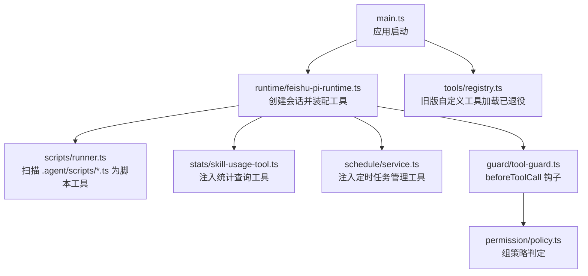
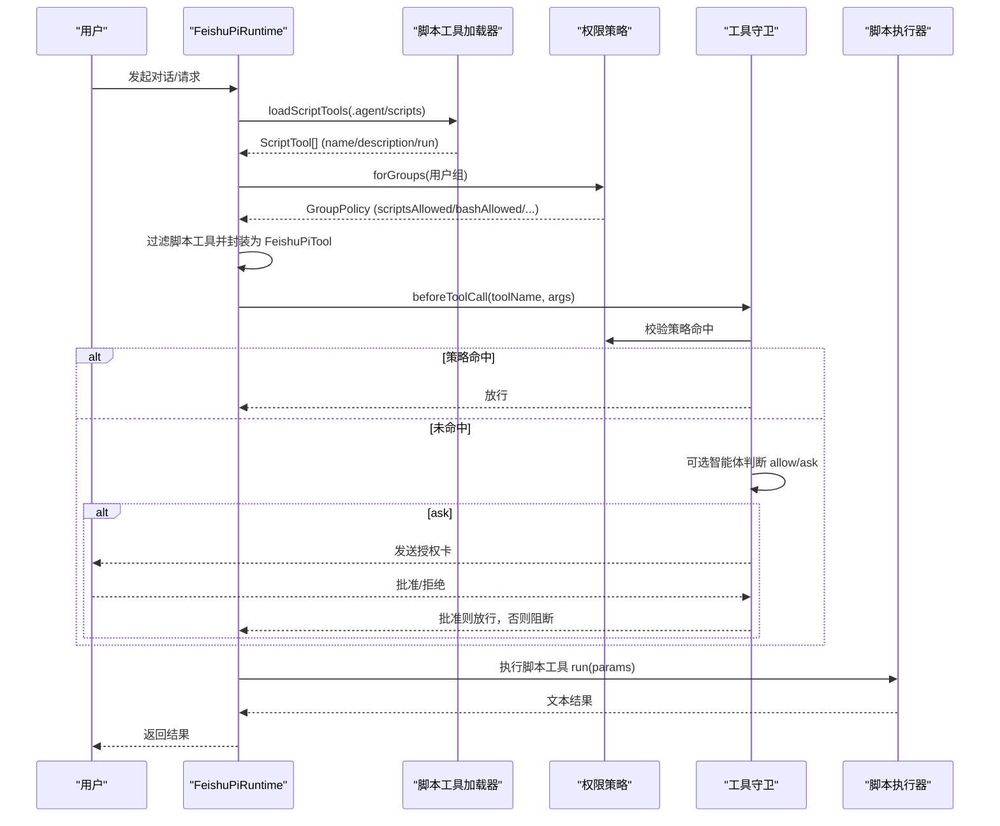
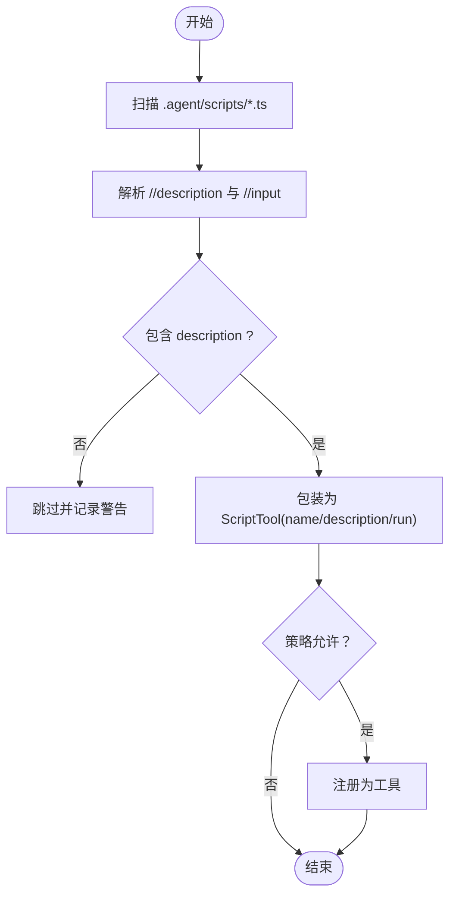
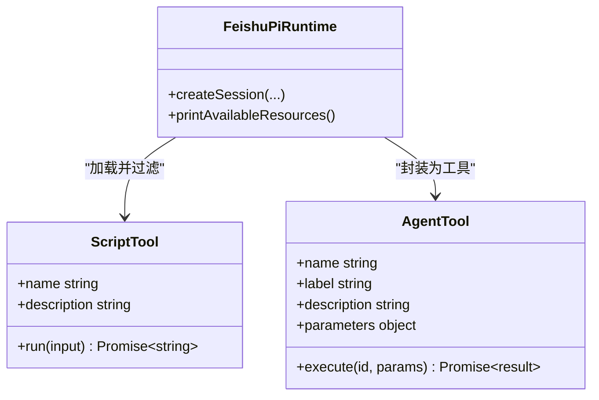
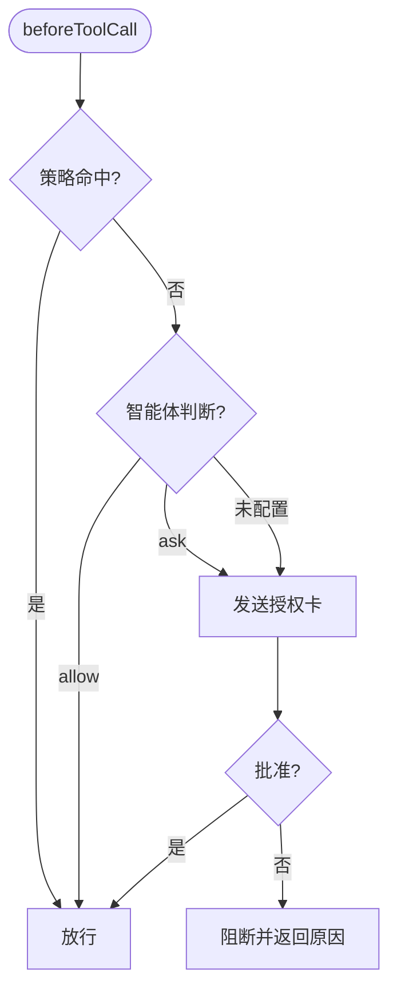
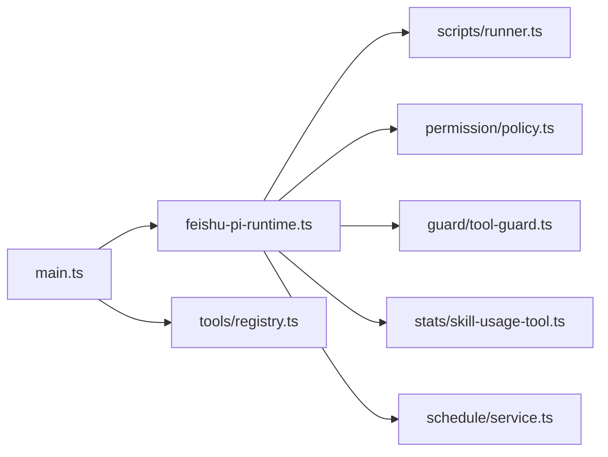

# 工具注册机制

<cite>
**本文引用的文件**
- [src/tools/registry.ts](file://src/tools/registry.ts)
- [src/scripts/runner.ts](file://src/scripts/runner.ts)
- [src/runtime/types.ts](file://src/runtime/types.ts)
- [src/runtime/feishu-pi-runtime.ts](file://src/runtime/feishu-pi-runtime.ts)
- [src/guard/tool-guard.ts](file://src/guard/tool-guard.ts)
- [src/permission/policy.ts](file://src/permission/policy.ts)
- [src/stats/skill-usage-tool.ts](file://src/stats/skill-usage-tool.ts)
- [src/schedule/service.ts](file://src/schedule/service.ts)
- [src/main.ts](file://src/main.ts)
</cite>

## 目录
1. [简介](#简介)
2. [项目结构](#项目结构)
3. [核心组件](#核心组件)
4. [架构总览](#架构总览)
5. [详细组件分析](#详细组件分析)
6. [依赖关系分析](#依赖关系分析)
7. [性能考量](#性能考量)
8. [故障排查指南](#故障排查指南)
9. [结论](#结论)
10. [附录：最佳实践与示例路径](#附录最佳实践与示例路径)

## 简介
本文件系统性说明本仓库的“工具注册机制”，覆盖工具的发现、加载、注册、权限判定、生命周期管理，以及内置工具与自定义工具的差异。重点解释 ToolDefinition 接口使用方式、工具元数据规范、错误处理与调试技巧、性能优化建议，并提供面向开发者的扩展指南。

## 项目结构
围绕工具注册的核心代码分布在以下模块：
- 工具注册表与旧版自定义工具加载：src/tools/registry.ts
- 脚本工具（当前推荐）加载与执行：src/scripts/runner.ts
- 运行时装配与工具注入：src/runtime/feishu-pi-runtime.ts
- 类型定义（含 AgentTool/FeishuPiTool）：src/runtime/types.ts
- 工具调用守卫（策略 + 智能体 + 授权卡）：src/guard/tool-guard.ts
- 权限策略（组与名单）：src/permission/policy.ts
- 内置能力：技能统计查询工具、定时任务管理工具：src/stats/skill-usage-tool.ts、src/schedule/service.ts
- 应用启动与组装：src/main.ts

图表来源
- [src/main.ts:211-227](file://src/main.ts#L211-L227)
- [src/runtime/feishu-pi-runtime.ts:173-197](file://src/runtime/feishu-pi-runtime.ts#L173-L197)
- [src/scripts/runner.ts:31-60](file://src/scripts/runner.ts#L31-L60)
- [src/stats/skill-usage-tool.ts:46-99](file://src/stats/skill-usage-tool.ts#L46-L99)
- [src/schedule/service.ts:105-171](file://src/schedule/service.ts#L105-L171)
- [src/guard/tool-guard.ts:36-71](file://src/guard/tool-guard.ts#L36-L71)
- [src/permission/policy.ts:43-57](file://src/permission/policy.ts#L43-L57)
- [src/tools/registry.ts:13-45](file://src/tools/registry.ts#L13-L45)

章节来源
- [src/main.ts:211-227](file://src/main.ts#L211-L227)
- [src/runtime/feishu-pi-runtime.ts:173-197](file://src/runtime/feishu-pi-runtime.ts#L173-L197)

## 核心组件
- 脚本工具加载器：扫描 .agent/scripts/*.ts，解析顶部注释元数据，包装为可注册工具。
- 运行时装配：在创建会话时按组策略过滤脚本工具，并注入统计查询与定时任务管理工具。
- 工具守卫：统一拦截 beforeToolCall，基于策略、智能体判断与授权卡决定放行或阻断。
- 权限策略：以组为单位声明 scripts/bash/read/write/skills 等白名单，合并多组权限。
- 旧版自定义工具：曾支持从 .agent/tools/*.ts 动态导入，现已退役，迁移到脚本工具。

章节来源
- [src/scripts/runner.ts:6-18](file://src/scripts/runner.ts#L6-L18)
- [src/runtime/feishu-pi-runtime.ts:173-197](file://src/runtime/feishu-pi-runtime.ts#L173-L197)
- [src/guard/tool-guard.ts:14-26](file://src/guard/tool-guard.ts#L14-L26)
- [src/permission/policy.ts:43-57](file://src/permission/policy.ts#L43-L57)
- [src/tools/registry.ts:10-12](file://src/tools/registry.ts#L10-L12)

## 架构总览
下图展示了工具从发现到执行的完整链路，包括权限判定与授权流程。

图表来源
- [src/runtime/feishu-pi-runtime.ts:173-197](file://src/runtime/feishu-pi-runtime.ts#L173-L197)
- [src/scripts/runner.ts:31-60](file://src/scripts/runner.ts#L31-L60)
- [src/guard/tool-guard.ts:36-71](file://src/guard/tool-guard.ts#L36-L71)
- [src/permission/policy.ts:43-57](file://src/permission/policy.ts#L43-L57)

## 详细组件分析

### 脚本工具加载与元数据规范
- 发现：扫描 .agent/scripts/*.ts，忽略测试文件。
- 元数据：通过顶部注释声明 description（必需）与 input（可选），用于向模型描述工具用途与参数示例。
- 执行：以 Node 进程执行脚本，参数通过命令行 JSON 传入，stdout 作为输出；超时与输出长度限制保障稳定性。
- 权限：仅当脚本名在策略组的 scripts 名单内才会被注册到该组会话。

图表来源
- [src/scripts/runner.ts:31-60](file://src/scripts/runner.ts#L31-L60)
- [src/scripts/runner.ts:62-79](file://src/scripts/runner.ts#L62-L79)
- [src/scripts/runner.ts:81-89](file://src/scripts/runner.ts#L81-L89)

章节来源
- [src/scripts/runner.ts:6-18](file://src/scripts/runner.ts#L6-L18)
- [src/scripts/runner.ts:31-60](file://src/scripts/runner.ts#L31-L60)
- [src/scripts/runner.ts:62-79](file://src/scripts/runner.ts#L62-L79)
- [src/scripts/runner.ts:81-89](file://src/scripts/runner.ts#L81-L89)

### 运行时装配与工具注入
- 在创建会话时，加载脚本工具并按组策略过滤，映射为 FeishuPiTool（AgentTool）。
- 注入两类内置能力：
  - 技能使用统计查询工具：所有身份可用，按会话注入上下文。
  - 定时任务管理工具：仅负责人组可用，提供创建/启停/删除任务能力。
- 打印可用资源日志，便于管理员确认。

图表来源
- [src/runtime/feishu-pi-runtime.ts:173-197](file://src/runtime/feishu-pi-runtime.ts#L173-L197)
- [src/runtime/types.ts:66-67](file://src/runtime/types.ts#L66-L67)

章节来源
- [src/runtime/feishu-pi-runtime.ts:132-145](file://src/runtime/feishu-pi-runtime.ts#L132-L145)
- [src/runtime/feishu-pi-runtime.ts:173-197](file://src/runtime/feishu-pi-runtime.ts#L173-L197)
- [src/runtime/types.ts:27-51](file://src/runtime/types.ts#L27-L51)

### 工具守卫与权限策略
- 三层判定：
  1) 策略命中（bash 命令在白名单、写入路径在范围、脚本在 scripts 名单）→ 直接放行。
  2) 策略未命中 → 若启用智能体综合判断，allow 放行，ask 走授权卡。
  3) 未配置智能体 → 名单外调用直接授权卡。
- risky 标记：自定义工具可标记高风险，即使命中策略也需授权卡。
- 无会话 ID 无法发卡时，按拒绝处理。

图表来源
- [src/guard/tool-guard.ts:36-71](file://src/guard/tool-guard.ts#L36-L71)
- [src/guard/tool-guard.ts:73-95](file://src/guard/tool-guard.ts#L73-L95)
- [src/permission/policy.ts:43-57](file://src/permission/policy.ts#L43-L57)

章节来源
- [src/guard/tool-guard.ts:14-26](file://src/guard/tool-guard.ts#L14-L26)
- [src/guard/tool-guard.ts:36-71](file://src/guard/tool-guard.ts#L36-L71)
- [src/guard/tool-guard.ts:73-95](file://src/guard/tool-guard.ts#L73-L95)

### 内置工具与自定义工具对比
- 内置工具：read/write/edit/bash 由框架提供，受策略与守卫控制。
- 自定义工具：
  - 旧版：.agent/tools/*.ts 动态导入（已退役），见 registry 中的注释与实现。
  - 新版：.agent/scripts/*.ts 脚本即工具，约定优于配置，无需样板代码。

章节来源
- [src/tools/registry.ts:8-12](file://src/tools/registry.ts#L8-L12)
- [src/tools/registry.ts:13-45](file://src/tools/registry.ts#L13-L45)
- [src/scripts/runner.ts:6-18](file://src/scripts/runner.ts#L6-L18)

### ToolDefinition 接口与 AgentTool 使用
- 类型来源：AgentTool 来自外部库，FeishuPiTool 为其别名。
- 字段含义：
  - name：工具唯一标识（脚本工具名 = 文件名去扩展名）。
  - label：展示名称。
  - description：给模型看的调用依据（脚本工具通过注释声明）。
  - parameters：参数 Schema（脚本工具使用通用 object 模式）。
  - execute：执行函数，返回内容结构与详情。
- 脚本工具通过 runner 将 stdout 文本包装为 AgentToolResult。

章节来源
- [src/runtime/types.ts:66-67](file://src/runtime/types.ts#L66-L67)
- [src/scripts/runner.ts:23-29](file://src/scripts/runner.ts#L23-L29)
- [src/runtime/feishu-pi-runtime.ts:173-186](file://src/runtime/feishu-pi-runtime.ts#L173-L186)

### 工具生命周期管理
- 发现：启动时扫描脚本目录。
- 装配：创建会话时按组策略过滤并封装为工具。
- 调用：beforeToolCall 钩子进行权限判定与授权。
- 执行：以子进程运行脚本，捕获输出与错误。
- 清理：服务退出时停止调度与断开连接（与工具无关但影响整体生命周期）。

章节来源
- [src/scripts/runner.ts:31-60](file://src/scripts/runner.ts#L31-L60)
- [src/runtime/feishu-pi-runtime.ts:173-197](file://src/runtime/feishu-pi-runtime.ts#L173-L197)
- [src/guard/tool-guard.ts:36-71](file://src/guard/tool-guard.ts#L36-L71)
- [src/main.ts:252-283](file://src/main.ts#L252-L283)

## 依赖关系分析
- main.ts 负责组装运行时、传输层、策略与守卫，并启动服务。
- runtime 依赖 scripts runner 加载脚本工具，依赖 policy 做权限过滤，依赖 guard 做调用拦截。
- stats 与 schedule 作为内置能力按需注入。
- tools/registry 保留旧版兼容逻辑，但不再参与新流程。

图表来源
- [src/main.ts:211-227](file://src/main.ts#L211-L227)
- [src/runtime/feishu-pi-runtime.ts:173-197](file://src/runtime/feishu-pi-runtime.ts#L173-L197)
- [src/scripts/runner.ts:31-60](file://src/scripts/runner.ts#L31-L60)
- [src/permission/policy.ts:43-57](file://src/permission/policy.ts#L43-L57)
- [src/guard/tool-guard.ts:36-71](file://src/guard/tool-guard.ts#L36-L71)
- [src/stats/skill-usage-tool.ts:46-99](file://src/stats/skill-usage-tool.ts#L46-L99)
- [src/schedule/service.ts:105-171](file://src/schedule/service.ts#L105-L171)
- [src/tools/registry.ts:13-45](file://src/tools/registry.ts#L13-L45)

章节来源
- [src/main.ts:211-227](file://src/main.ts#L211-L227)
- [src/runtime/feishu-pi-runtime.ts:173-197](file://src/runtime/feishu-pi-runtime.ts#L173-L197)

## 性能考量
- 脚本执行隔离：每个脚本以独立子进程运行，避免相互干扰；设置超时与输出上限防止长耗时与内存占用。
- 策略预编译：GroupPolicy 在会话创建时计算，减少重复判定开销。
- 工具注册按需：仅在会话创建时加载与过滤脚本工具，避免全局冷启动成本。
- 日志精简：关键路径记录必要信息，便于定位问题而不影响性能。

[本节为通用指导，不直接分析具体文件]

## 故障排查指南
- 脚本缺少 description：会被跳过并记录警告，检查脚本顶部注释。
- 脚本执行失败：捕获 stderr 与错误消息，限制输出长度，查看日志定位。
- 工具被阻断：检查策略是否命中、是否标记 risky、是否配置智能体判断、是否有会话 ID 以便发卡。
- 授权卡无效：服务重启或会话失效会导致旧卡无效，需重新发起任务。
- 定时任务异常：检查 cron 表达式合法性、任务状态与错误记录。

章节来源
- [src/scripts/runner.ts:44-57](file://src/scripts/runner.ts#L44-L57)
- [src/scripts/runner.ts:62-79](file://src/scripts/runner.ts#L62-L79)
- [src/guard/tool-guard.ts:73-95](file://src/guard/tool-guard.ts#L73-L95)
- [src/schedule/service.ts:131-151](file://src/schedule/service.ts#L131-L151)
- [src/schedule/service.ts:212-235](file://src/schedule/service.ts#L212-L235)

## 结论
本项目的工具注册机制以“脚本即工具”为核心，结合策略与守卫实现安全可控的动态扩展。通过会话级装配、组策略过滤与授权卡流程，既保证了灵活性，又确保了安全性。开发者只需遵循脚本元数据约定并在策略中声明名单，即可快速扩展能力。

[本节为总结性内容，不直接分析具体文件]

## 附录：最佳实践与示例路径
- 编写脚本工具：
  - 在 .agent/scripts/ 下新增 .ts 文件，顶部添加 description 与可选 input 注释。
  - 通过 process.argv 读取 JSON 参数，console.log 输出结果。
  - 参考路径：[src/scripts/runner.ts:6-18](file://src/scripts/runner.ts#L6-L18)、[src/scripts/runner.ts:81-89](file://src/scripts/runner.ts#L81-L89)
- 配置权限策略：
  - 在 .agent/permissions.json 中为组声明 scripts、bash、read、write、skills 名单。
  - 负责人组默认全量，其他组保守缺省。
  - 参考路径：[src/permission/policy.ts:43-57](file://src/permission/policy.ts#L43-L57)
- 使用内置能力：
  - 技能统计查询：自动注入，无需额外配置。
  - 定时任务管理：负责人组可用，通过服务管理任务。
  - 参考路径：[src/stats/skill-usage-tool.ts:46-99](file://src/stats/skill-usage-tool.ts#L46-L99)、[src/schedule/service.ts:105-171](file://src/schedule/service.ts#L105-L171)
- 调试与日志：
  - 关注 [Scripts]、[ToolGuard]、[Schedule] 等日志前缀，定位加载、判定与执行问题。
  - 参考路径：[src/scripts/runner.ts:44-57](file://src/scripts/runner.ts#L44-L57)、[src/guard/tool-guard.ts:36-71](file://src/guard/tool-guard.ts#L36-L71)、[src/schedule/service.ts:212-235](file://src/schedule/service.ts#L212-L235)
- 迁移旧版自定义工具：
  - 将 .agent/tools/*.ts 迁移至 .agent/scripts/*.ts，遵循脚本契约。
  - 参考路径：[src/tools/registry.ts:10-12](file://src/tools/registry.ts#L10-L12)、[src/tools/registry.ts:13-45](file://src/tools/registry.ts#L13-L45)