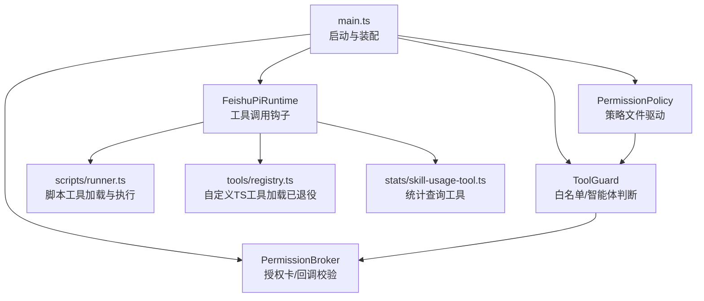
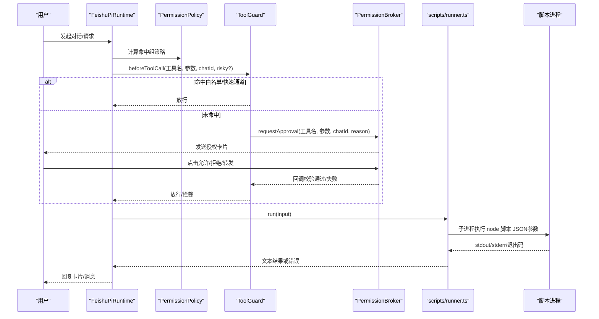
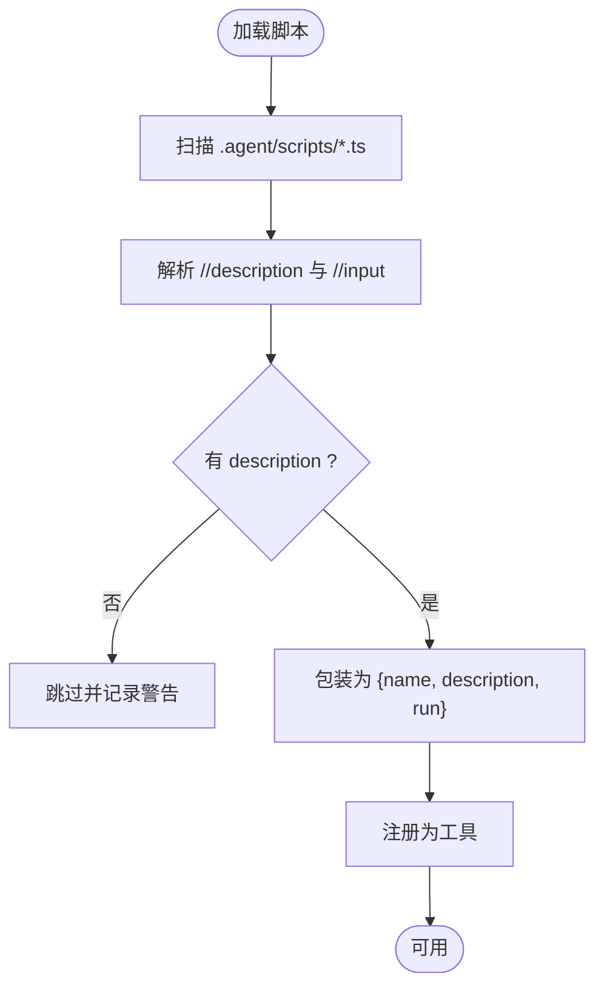
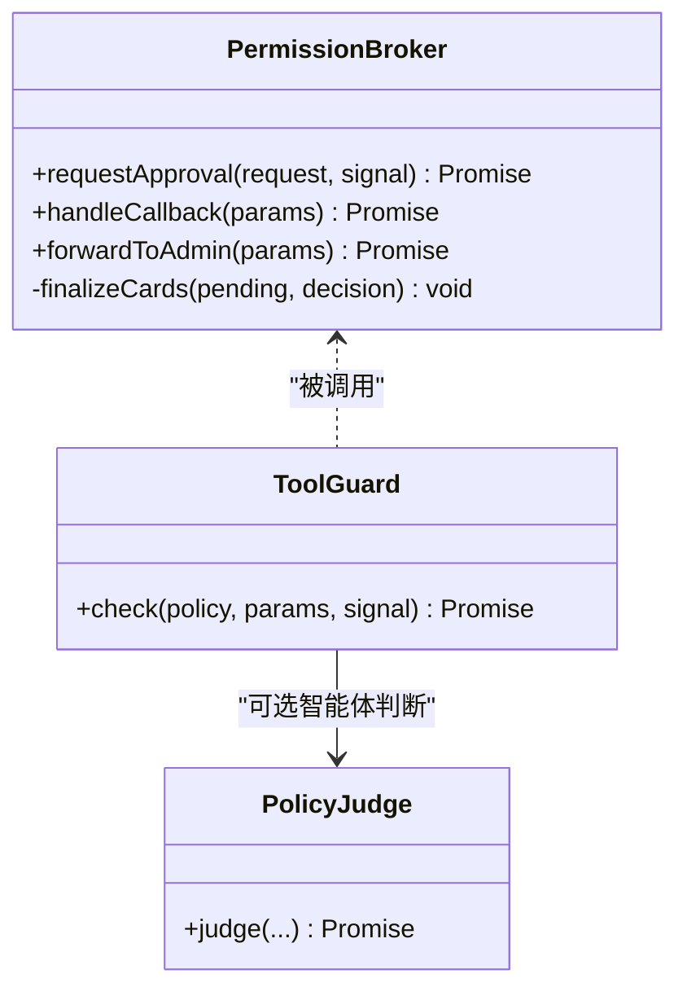
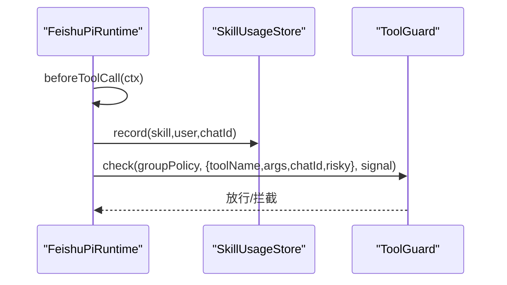
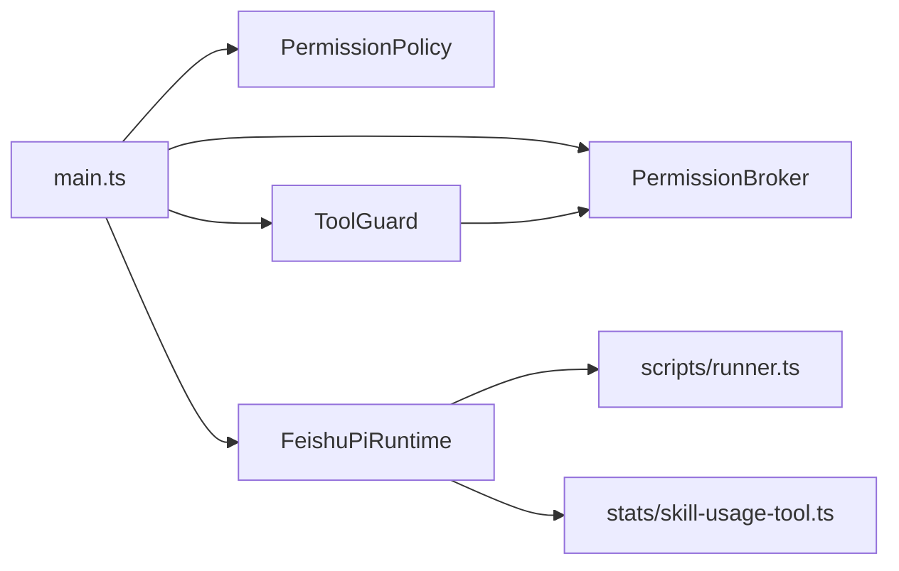

# 工具系统

<cite>
**本文引用的文件**
- [src/scripts/runner.ts](file://src/scripts/runner.ts)
- [src/tools/registry.ts](file://src/tools/registry.ts)
- [src/stats/skill-usage-tool.ts](file://src/stats/skill-usage-tool.ts)
- [src/runtime/types.ts](file://src/runtime/types.ts)
- [src/guard/broker.ts](file://src/guard/broker.ts)
- [src/guard/card.ts](file://src/guard/card.ts)
- [src/main.ts](file://src/main.ts)
- [.agent/scripts/README.md](file://.agent/scripts/README.md)
- [.agent/scripts/get-time.ts](file://.agent/scripts/get-time.ts)
- [.agent/scripts/note-book.ts](file://.agent/scripts/note-book.ts)
- [test/tool-guard.test.ts](file://test/tool-guard.test.ts)
</cite>

## 目录
1. [简介](#简介)
2. [项目结构](#项目结构)
3. [核心组件](#核心组件)
4. [架构总览](#架构总览)
5. [详细组件分析](#详细组件分析)
6. [依赖关系分析](#依赖关系分析)
7. [性能与可靠性](#性能与可靠性)
8. [故障排查指南](#故障排查指南)
9. [结论](#结论)
10. [附录：开发规范、测试与部署](#附录开发规范测试与部署)

## 简介
本文件面向开发者，系统化说明本仓库的“工具系统”：什么是 Tool（工具）、如何注册与执行、脚本工具的约定优于配置模式、元数据解析、参数传递与结果返回、生命周期管理、错误处理与超时控制，以及权限与授权卡机制。同时提供工具开发规范、测试方法与部署指南，并给出实际示例与集成案例，帮助快速扩展能力。

## 项目结构
工具系统由“脚本工具加载器”“工具注册表”“工具调用守卫（Guard）”“授权中枢（Broker）”“运行时钩子”等模块组成，围绕 Pi Agent 的工具循环进行装配。

图表来源
- [src/main.ts:106-132](file://src/main.ts#L106-L132)
- [src/runtime/types.ts:27-51](file://src/runtime/types.ts#L27-L51)
- [src/scripts/runner.ts:6-18](file://src/scripts/runner.ts#L6-L18)
- [src/tools/registry.ts:10-45](file://src/tools/registry.ts#L10-L45)
- [src/stats/skill-usage-tool.ts:46-99](file://src/stats/skill-usage-tool.ts#L46-L99)
- [src/guard/broker.ts:41-129](file://src/guard/broker.ts#L41-L129)

章节来源
- [src/main.ts:106-132](file://src/main.ts#L106-L132)
- [src/runtime/types.ts:27-51](file://src/runtime/types.ts#L27-L51)

## 核心组件
- 脚本工具加载与执行器：扫描 `.agent/scripts/*.ts`，按约定解析元数据，封装为可注册工具；以子进程执行，支持超时与输出截断。
- 工具注册表：曾用于加载用户自定义 TS 工具（已退役），当前以脚本工具为主。
- 工具调用守卫：基于策略文件的组级白名单 + 可选智能体综合判断，未命中则走授权卡。
- 授权中枢：发送授权卡片、等待管理员决策、校验回调、支持转发到管理员私聊、超时与中断处理。
- 运行时钩子：在工具执行前记录技能使用、注入 Guard、暴露事件流。
- 内置统计工具：提供自然语言入口查询技能使用情况。

章节来源
- [src/scripts/runner.ts:6-18](file://src/scripts/runner.ts#L6-L18)
- [src/tools/registry.ts:10-45](file://src/tools/registry.ts#L10-L45)
- [src/guard/broker.ts:41-129](file://src/guard/broker.ts#L41-L129)
- [src/stats/skill-usage-tool.ts:46-99](file://src/stats/skill-usage-tool.ts#L46-L99)
- [src/runtime/types.ts:27-51](file://src/runtime/types.ts#L27-L51)

## 架构总览
工具从“声明（脚本或TS定义）→ 注册 → 调用前守卫 → 执行 → 结果返回”的全链路如下：

图表来源
- [src/main.ts:106-132](file://src/main.ts#L106-L132)
- [src/scripts/runner.ts:62-79](file://src/scripts/runner.ts#L62-L79)
- [src/guard/broker.ts:74-129](file://src/guard/broker.ts#L74-L129)
- [src/runtime/types.ts:27-51](file://src/runtime/types.ts#L27-L51)

## 详细组件分析

### 脚本工具：约定优于配置
- 约定
  - 每个 `.agent/scripts/*.ts` 即一个工具，文件名（去扩展名）= 工具名。
  - 顶部注释声明元数据：`// description:`（必需）、`// input:`（可选）。
  - 参数通过 `process.argv[2]` 传入 JSON 字符串；结果通过 `console.log` 输出到 stdout。
  - 非零退出码视为失败；stderr 信息回传模型。
- 加载与包装
  - 扫描脚本目录，解析元数据，构造 `{ name, description, run }` 对象供注册。
  - 执行时以子进程运行 Node，设置超时与输出上限，避免资源耗尽。
- 权限
  - 脚本名需加入策略文件某组的 `tools` 名单才在该组会话注册；名单外不注册。

图表来源
- [src/scripts/runner.ts:31-59](file://src/scripts/runner.ts#L31-L59)
- [src/scripts/runner.ts:81-89](file://src/scripts/runner.ts#L81-L89)

章节来源
- [src/scripts/runner.ts:6-18](file://src/scripts/runner.ts#L6-L18)
- [src/scripts/runner.ts:31-59](file://src/scripts/runner.ts#L31-L59)
- [src/scripts/runner.ts:62-79](file://src/scripts/runner.ts#L62-L79)
- [src/scripts/runner.ts:81-89](file://src/scripts/runner.ts#L81-L89)
- [.agent/scripts/README.md:5-24](file://.agent/scripts/README.md#L5-L24)

### 工具注册表（历史与现状）
- 历史：曾支持在 `.agent/tools/*.ts` 中放置导出 `ToolDefinition` 的自定义工具，现已退役。
- 现状：统一采用脚本工具；如需 TS 工具，建议迁移至脚本形式或通过策略与 Guard 管控。

章节来源
- [src/tools/registry.ts:10-45](file://src/tools/registry.ts#L10-L45)

### 工具调用守卫（Guard）与授权卡（Broker）
- 策略层：基于 `.agent/permissions.json` 的组策略（common/owner/user）判定工具是否命中白名单。
- 智能体层：未命中时可启用智能体综合判断（allow/ask），默认未配置时直接弹卡。
- 授权卡：发送卡片，等待管理员点击；支持转发到管理员私聊；服务端严格校验 token、卡片来源、操作者身份；支持超时与会话中止。
- 安全细节：敏感字段脱敏、命令展示长度限制、一次性 token、仅一次授权。

图表来源
- [src/guard/broker.ts:41-129](file://src/guard/broker.ts#L41-L129)
- [src/guard/card.ts:1-102](file://src/guard/card.ts#L1-L102)
- [test/tool-guard.test.ts:44-91](file://test/tool-guard.test.ts#L44-L91)

章节来源
- [src/guard/broker.ts:41-129](file://src/guard/broker.ts#L41-L129)
- [src/guard/card.ts:1-102](file://src/guard/card.ts#L1-L102)
- [test/tool-guard.test.ts:44-91](file://test/tool-guard.test.ts#L44-L91)

### 运行时钩子与事件流
- 在工具执行前：
  - 若命中“技能读取”，记录使用事件（独立追加式事件流）。
  - 调用 toolGuard 进行白名单/智能体/授权卡判定。
- 事件流：tool_started / tool_updated / tool_finished，便于前端卡片渲染与状态同步。

图表来源
- [src/runtime/types.ts:27-51](file://src/runtime/types.ts#L27-L51)
- [src/main.ts:211-224](file://src/main.ts#L211-L224)

章节来源
- [src/runtime/types.ts:27-51](file://src/runtime/types.ts#L27-L51)
- [src/main.ts:211-224](file://src/main.ts#L211-L224)

### 内置统计工具：query_skill_usage
- 作用：自然语言入口查询技能使用情况（次数排行、使用者、最近使用时间、个人使用）。
- 实现：封装为 AgentTool，execute 中读取事件流并按规则汇总输出。

章节来源
- [src/stats/skill-usage-tool.ts:46-99](file://src/stats/skill-usage-tool.ts#L46-L99)

### 实际脚本示例
- get-time：无参脚本，打印本地时间。
- note-book：带参数的共享笔记本脚本，支持 read/write/list，路径与扩展名白名单。

章节来源
- [.agent/scripts/get-time.ts:1-4](file://.agent/scripts/get-time.ts#L1-L4)
- [.agent/scripts/note-book.ts:1-75](file://.agent/scripts/note-book.ts#L1-L75)

## 依赖关系分析
- main.ts 装配 PermissionPolicy、ToolGuard、PermissionBroker，并将 toolGuard 注入 FeishuPiRuntime。
- scripts/runner.ts 提供脚本工具加载与执行，作为 Runtime 可调用的工具集合。
- guard 层与 runtime 层解耦：guard 只负责“是否允许”，broker 负责“交互与校验”。
- stats 工具与 usage store 解耦，仅通过接口消费事件。

图表来源
- [src/main.ts:106-132](file://src/main.ts#L106-L132)
- [src/main.ts:211-224](file://src/main.ts#L211-L224)
- [src/scripts/runner.ts:31-59](file://src/scripts/runner.ts#L31-L59)
- [src/stats/skill-usage-tool.ts:46-99](file://src/stats/skill-usage-tool.ts#L46-L99)

章节来源
- [src/main.ts:106-132](file://src/main.ts#L106-L132)
- [src/main.ts:211-224](file://src/main.ts#L211-L224)

## 性能与可靠性
- 脚本执行
  - 超时：默认 30 秒，防止长时间阻塞。
  - 输出上限：stdout 最多截取固定长度，避免过大响应。
  - 缓冲：子进程缓冲区限制，防止内存暴涨。
- 授权卡
  - 超时：可配置，超时视为拒绝。
  - 中断：会话中止（如 /stop）立即取消等待并收尾卡片。
- 健壮性
  - Guard 异常按拒绝处理，fail-safe。
  - 策略文件损坏按保守默认处理。
  - 技能使用记录失败仅告警，不影响主流程。

章节来源
- [src/scripts/runner.ts:20-21](file://src/scripts/runner.ts#L20-L21)
- [src/scripts/runner.ts:62-79](file://src/scripts/runner.ts#L62-L79)
- [src/guard/broker.ts:74-129](file://src/guard/broker.ts#L74-L129)
- [src/main.ts:261-280](file://src/main.ts#L261-L280)

## 故障排查指南
- 脚本未生效
  - 检查是否在 `.agent/scripts/` 下且为 `.ts` 文件。
  - 确认包含 `// description:` 元数据。
  - 确认策略文件中该组 `tools` 包含脚本名。
- 脚本执行失败
  - 查看 stderr 与退出码；确保输入 JSON 合法。
  - 注意输出大小限制与超时。
- 授权卡不出现或无效
  - 检查是否配置了管理员 Open ID。
  - 检查回调参数（approval_id、token）是否匹配。
  - 确认卡片来源与操作者身份校验通过。
- 策略误判
  - 核对 `.agent/permissions.json` 的 tools/bash/read/write/skills 配置。
  - 使用 `/perm` 查看当前策略描述。

章节来源
- [src/scripts/runner.ts:31-59](file://src/scripts/runner.ts#L31-L59)
- [src/scripts/runner.ts:62-79](file://src/scripts/runner.ts#L62-L79)
- [src/guard/broker.ts:74-129](file://src/guard/broker.ts#L74-L129)
- [src/guard/broker.ts:131-166](file://src/guard/broker.ts#L131-L166)

## 结论
本工具系统以“脚本即工具”的约定优于配置为核心，结合策略驱动的权限控制与“非允许即 ask”的授权卡机制，实现了安全、可控、可扩展的工具生态。通过运行时钩子与事件流，工具的执行过程可观测、可审计；通过超时、截断与 fail-safe 设计，保障了系统的稳定性与可靠性。

## 附录：开发规范、测试与部署

### 工具开发规范
- 脚本工具
  - 文件位置：`.agent/scripts/<工具名>.ts`。
  - 元数据：必须包含 `// description:`；可选 `// input:` 示例。
  - 参数与结果：从 `process.argv[2]` 读取 JSON；通过 `console.log` 输出结果。
  - 安全：不要读写 `.agent/` 或 `src/` 等敏感目录；自行做路径与类型校验。
  - 权限：将脚本名加入策略文件对应组的 `tools` 列表。
- 自定义 TS 工具（历史）
  - 已退役，建议迁移为脚本工具。

章节来源
- [.agent/scripts/README.md:5-24](file://.agent/scripts/README.md#L5-L24)
- [src/scripts/runner.ts:6-18](file://src/scripts/runner.ts#L6-L18)

### 测试方法
- 单元测试：使用 Vitest 对 Guard 与策略判定进行覆盖，验证白名单命中、智能体判断、授权卡分支。
- 集成验证：通过飞书对话触发工具调用，观察授权卡与结果卡。

章节来源
- [test/tool-guard.test.ts:44-91](file://test/tool-guard.test.ts#L44-L91)

### 部署指南
- 安装与启动
  - 安装依赖后启动服务；首次启动会清理过期数据与卡住消息。
- 配置要点
  - 配置飞书应用权限与事件订阅。
  - 配置管理员标识（FEISHU_ADMIN）。
  - 配置授权卡超时（环境变量）。
- 权限与策略
  - 维护 `.agent/permissions.json`，按需开放 tools/bash/read/write/skills。
- 监控与统计
  - 技能使用统计写入独立事件流；可通过浏览器界面查看。

章节来源
- [src/main.ts:27-60](file://src/main.ts#L27-L60)
- [src/main.ts:106-132](file://src/main.ts#L106-L132)
- [src/main.ts:171-177](file://src/main.ts#L171-L177)