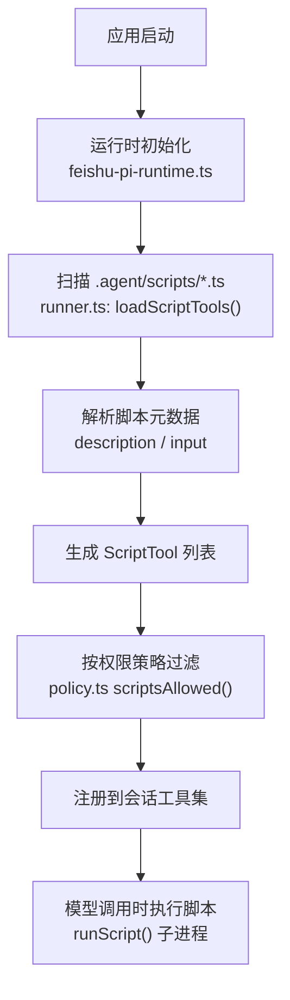
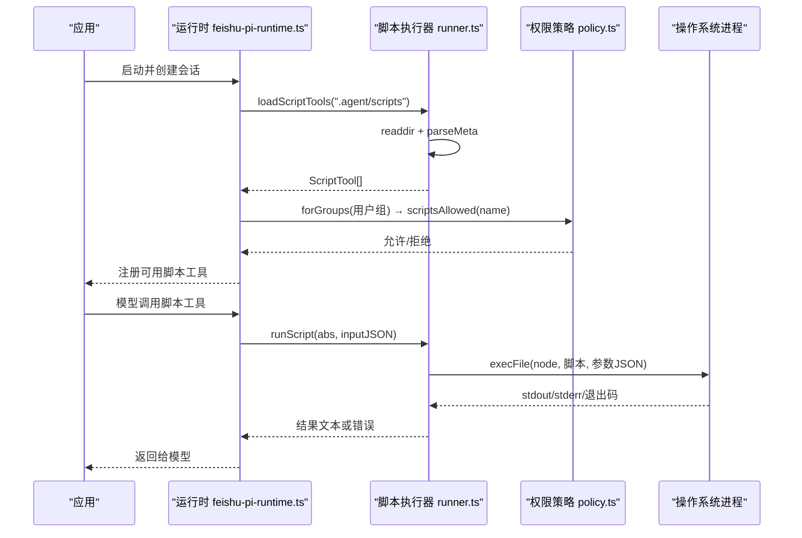
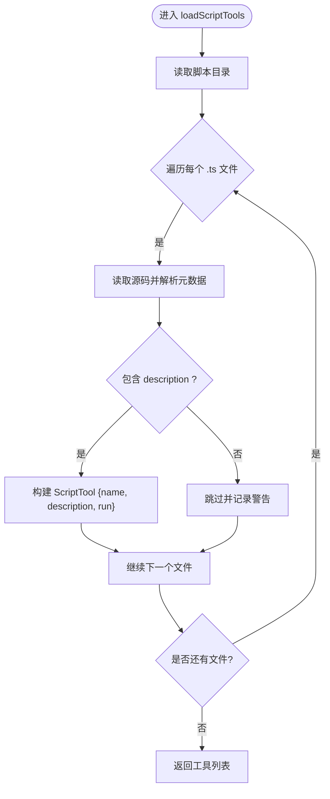
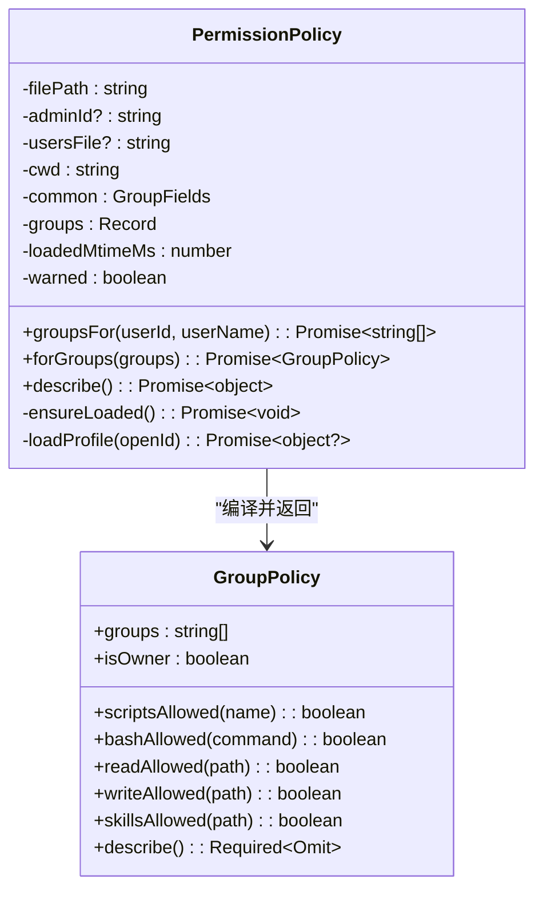
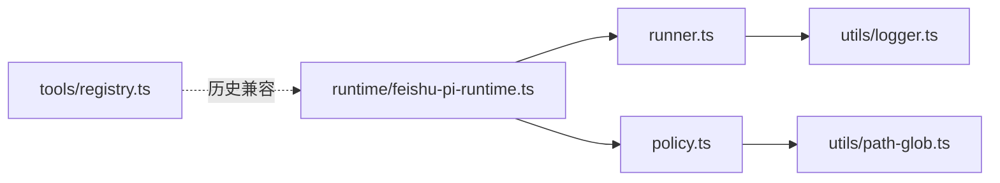

# 脚本执行器

<cite>
**本文引用的文件**
- [src/scripts/runner.ts](file://src/scripts/runner.ts)
- [.agent/scripts/README.md](file://.agent/scripts/README.md)
- [.agent/scripts/get-time.ts](file://.agent/scripts/get-time.ts)
- [.agent/scripts/note-book.ts](file://.agent/scripts/note-book.ts)
- [.agent/permissions.json](file://.agent/permissions.json)
- [src/permission/policy.ts](file://src/permission/policy.ts)
- [src/runtime/feishu-pi-runtime.ts](file://src/runtime/feishu-pi-runtime.ts)
- [src/tools/registry.ts](file://src/tools/registry.ts)
</cite>

## 目录
1. [简介](#简介)
2. [项目结构](#项目结构)
3. [核心组件](#核心组件)
4. [架构总览](#架构总览)
5. [详细组件分析](#详细组件分析)
6. [依赖关系分析](#依赖关系分析)
7. [性能与安全考量](#性能与安全考量)
8. [故障排查指南](#故障排查指南)
9. [结论](#结论)
10. [附录：开发规范与示例](#附录：开发规范与示例)

## 简介
本文件面向开发者，系统化说明 .agent/scripts/ 目录下脚本的加载与执行机制。该子系统采用“约定优于配置”的设计：每个 .ts 脚本即一个工具，无需额外注册；通过顶部注释声明元数据（描述、输入示例），以子进程方式运行，参数通过命令行 JSON 传递，结果通过 stdout 返回。权限由统一策略文件控制，按用户组聚合生效范围，未授权脚本不会在会话中注册。

## 项目结构
- 脚本目录：.agent/scripts/*.ts（每个文件即一个工具）
- 权限策略：.agent/permissions.json（定义组成员、可调用脚本、命令、读写路径等）
- 执行器：src/scripts/runner.ts（扫描、解析、包装、执行脚本）
- 运行时集成：src/runtime/feishu-pi-runtime.ts（启动时加载脚本工具并打印可用能力）
- 权限策略实现：src/permission/policy.ts（组策略合并、匹配与热重载）
- 工具注册表（历史兼容）：src/tools/registry.ts（已退役为脚本模式）

图表来源
- [src/runtime/feishu-pi-runtime.ts:118-145](file://src/runtime/feishu-pi-runtime.ts#L118-L145)
- [src/scripts/runner.ts:31-60](file://src/scripts/runner.ts#L31-L60)
- [src/permission/policy.ts:109-158](file://src/permission/policy.ts#L109-L158)

章节来源
- [src/scripts/runner.ts:1-96](file://src/scripts/runner.ts#L1-L96)
- [src/runtime/feishu-pi-runtime.ts:118-145](file://src/runtime/feishu-pi-runtime.ts#L118-L145)
- [src/permission/policy.ts:1-253](file://src/permission/policy.ts#L1-L253)

## 核心组件
- 脚本工具接口与执行器：定义 ScriptTool 接口，提供 loadScriptTools、runScript、parseMeta、resolveScriptPath 等能力。
- 权限策略：基于 .agent/permissions.json 的组策略，支持 common、owner 及自定义组，合并生效范围，提供 scriptsAllowed 判定。
- 运行时集成：启动时加载脚本工具并输出日志，暴露 listScriptTools 用于展示。

章节来源
- [src/scripts/runner.ts:23-96](file://src/scripts/runner.ts#L23-L96)
- [src/permission/policy.ts:34-158](file://src/permission/policy.ts#L34-L158)
- [src/runtime/feishu-pi-runtime.ts:118-145](file://src/runtime/feishu-pi-runtime.ts#L118-L145)

## 架构总览
脚本执行器将“脚本即工具”的理念落地：
- 约定：脚本顶部注释声明 description（必需）和 input（可选示例）。
- 执行：以 Node 子进程运行脚本，传入 JSON 参数，stdout 作为结果，非零退出码视为失败。
- 权限：仅当脚本名出现在某组的 scripts 名单中，才在该组会话中注册。
- 隔离：脚本在独立进程中运行，具备超时与输出截断保护。

图表来源
- [src/runtime/feishu-pi-runtime.ts:118-145](file://src/runtime/feishu-pi-runtime.ts#L118-L145)
- [src/scripts/runner.ts:31-79](file://src/scripts/runner.ts#L31-L79)
- [src/permission/policy.ts:109-158](file://src/permission/policy.ts#L109-L158)

## 详细组件分析

### 脚本执行器（runner.ts）
- 扫描与解析：loadScriptTools 读取 .agent/scripts 下所有 .ts 文件（排除测试文件），解析顶部注释获取 description 与 input 提示，构造 ScriptTool。
- 执行封装：runScript 使用 child_process.execFile 以当前 Node 执行脚本，传入 JSON 参数，设置超时与缓冲区限制，捕获 stderr 与退出码。
- 元数据解析：parseMeta 通过正则提取 description 与 input 字段。
- 路径解析：resolveScriptPath 支持绝对或相对路径解析。

图表来源
- [src/scripts/runner.ts:31-60](file://src/scripts/runner.ts#L31-L60)
- [src/scripts/runner.ts:81-89](file://src/scripts/runner.ts#L81-L89)

章节来源
- [src/scripts/runner.ts:1-96](file://src/scripts/runner.ts#L1-L96)

### 权限策略（policy.ts）
- 组与合并：common 层并入所有人；owner 默认全量；其他组按 members 匹配；最终效果为 common ∪ 所属各组并集。
- 判定函数：scriptsAllowed、bashAllowed、readAllowed、writeAllowed、skillsAllowed 提供细粒度控制。
- 热重载：监听策略文件 mtime，变更即时生效于新会话。
- 保守缺省：无组时仅技能目录可读，无脚本与命令权限。

图表来源
- [src/permission/policy.ts:68-158](file://src/permission/policy.ts#L68-L158)
- [src/permission/policy.ts:160-253](file://src/permission/policy.ts#L160-L253)

章节来源
- [src/permission/policy.ts:1-253](file://src/permission/policy.ts#L1-L253)

### 运行时集成（feishu-pi-runtime.ts）
- 启动时加载脚本工具：createBaseLoader 后调用 loadScriptTools 并打印可用能力。
- 列出全部脚本工具：listScriptTools 暴露给指令使用。

章节来源
- [src/runtime/feishu-pi-runtime.ts:103-145](file://src/runtime/feishu-pi-runtime.ts#L103-L145)
- [src/runtime/feishu-pi-runtime.ts:284-289](file://src/runtime/feishu-pi-runtime.ts#L284-L289)

### 示例脚本
- get-time.ts：无参脚本，输出本地时间。
- note-book.ts：带参数的共享笔记本脚本，支持 read/write/list 操作，内置目录白名单与扩展名校验。

章节来源
- [.agent/scripts/get-time.ts:1-4](file://.agent/scripts/get-time.ts#L1-L4)
- [.agent/scripts/note-book.ts:1-75](file://.agent/scripts/note-book.ts#L1-L75)

## 依赖关系分析
- runner.ts 依赖 Node 标准库（child_process、fs/promises、path）与 logger。
- policy.ts 依赖 path-glob 进行路径匹配，logger 用于日志。
- runtime 模块依赖 runner 与 policy，负责装配与展示。
- registry.ts 保留历史兼容逻辑，当前脚本模式取代了旧式自定义工具加载。

图表来源
- [src/scripts/runner.ts:1-4](file://src/scripts/runner.ts#L1-L4)
- [src/permission/policy.ts:1-3](file://src/permission/policy.ts#L1-L3)
- [src/runtime/feishu-pi-runtime.ts:118-145](file://src/runtime/feishu-pi-runtime.ts#L118-L145)
- [src/tools/registry.ts:1-45](file://src/tools/registry.ts#L1-L45)

章节来源
- [src/scripts/runner.ts:1-96](file://src/scripts/runner.ts#L1-L96)
- [src/permission/policy.ts:1-253](file://src/permission/policy.ts#L1-L253)
- [src/runtime/feishu-pi-runtime.ts:103-145](file://src/runtime/feishu-pi-runtime.ts#L103-L145)
- [src/tools/registry.ts:1-45](file://src/tools/registry.ts#L1-L45)

## 性能与安全考量
- 执行隔离：脚本以独立子进程运行，避免共享内存与状态污染。
- 超时与缓冲：默认 30 秒超时，最大输出缓冲 1MB，stdout 结果截断至 8000 字符，防止资源耗尽。
- 权限控制：通过策略文件精确限定脚本、命令、读写的范围；未授权脚本不注册。
- 信任边界：脚本拥有进程级权限，应避免直接访问敏感目录（如 .agent、src），并在脚本内部做白名单校验（参考 note-book.ts）。
- 热重载：策略文件修改即时生效于新会话，减少重启成本。

[本节为通用指导，不直接分析具体文件]

## 故障排查指南
- 脚本缺少 description：加载时会跳过并记录警告，检查脚本顶部注释。
- 脚本执行失败：stderr 或非零退出码会被捕获并回传；检查脚本逻辑与参数格式。
- 权限不足：确认 .agent/permissions.json 中对应组的 scripts 名单包含脚本名。
- 路径越界：确保脚本内路径在白名单内，避免访问受限目录。
- 策略文件异常：若解析失败，系统按保守默认处理；检查 JSON 格式与字段类型。

章节来源
- [src/scripts/runner.ts:44-57](file://src/scripts/runner.ts#L44-L57)
- [src/scripts/runner.ts:62-79](file://src/scripts/runner.ts#L62-L79)
- [src/permission/policy.ts:178-210](file://src/permission/policy.ts#L178-L210)

## 结论
脚本执行器以极简约定实现了强大的可扩展能力：每个脚本即工具，无需样板代码；通过策略文件精细控制权限；以子进程隔离执行并提供超时与输出限制。结合示例脚本与运行时集成，开发者可以快速构建安全、可控的脚本工具生态。

[本节为总结性内容，不直接分析具体文件]

## 附录：开发规范与示例

### 脚本约定
- 命名：文件名去扩展名为工具名（例如 weather.ts → 工具 weather）。
- 元数据：顶部注释必须包含 description（必需），可选 input 示例帮助模型正确传参。
- 参数：从 process.argv[2] 读取 JSON 字符串并解析。
- 输出：通过 console.log 输出结果到 stdout；非零退出码表示失败。
- 安全：避免直接访问敏感目录，使用白名单与扩展名校验。

章节来源
- [.agent/scripts/README.md:5-24](file://.agent/scripts/README.md#L5-L24)
- [src/scripts/runner.ts:6-18](file://src/scripts/runner.ts#L6-L18)

### 权限配置
- 策略文件：.agent/permissions.json，定义 common、owner 与自定义组。
- 字段：
  - members：成员标识（openId/中文名/英文名）
  - scripts：可调用脚本名列表
  - bash：可执行命令（支持精确匹配、cmd:* 前缀匹配或 "*"）
  - read/write：路径 glob 范围
  - skills：技能可见范围
- 生效：common ∪ 所属各组并集；owner 未配置时默认全量。

章节来源
- [.agent/permissions.json:1-21](file://.agent/permissions.json#L1-L21)
- [src/permission/policy.ts:5-32](file://src/permission/policy.ts#L5-L32)
- [src/permission/policy.ts:109-158](file://src/permission/policy.ts#L109-L158)

### 实际示例
- 无参脚本：get-time.ts 输出本地时间。
- 带参脚本：note-book.ts 实现共享笔记本，支持 read/write/list，内置目录与扩展名白名单。

章节来源
- [.agent/scripts/get-time.ts:1-4](file://.agent/scripts/get-time.ts#L1-L4)
- [.agent/scripts/note-book.ts:1-75](file://.agent/scripts/note-book.ts#L1-L75)

### 测试方法
- 单元测试：针对策略匹配与权限判定编写用例（如 policy.test.ts）。
- 集成测试：验证脚本加载、注册与执行流程（可通过运行时日志与工具列表检查）。
- 边界用例：覆盖缺少 description、非法路径、权限不足等情况。

章节来源
- [test/policy.test.ts:41-121](file://test/policy.test.ts#L41-L121)

### 部署指南
- 新增脚本：在 .agent/scripts/ 下添加 .ts 文件，遵循约定。
- 配置权限：在 .agent/permissions.json 中为相应组添加脚本名。
- 重启或新会话：修改后新会话生效（当前会话需 /new）。
- 监控日志：查看运行时日志确认脚本加载与可用能力。

章节来源
- [.agent/scripts/README.md:26-31](file://.agent/scripts/README.md#L26-L31)
- [src/runtime/feishu-pi-runtime.ts:118-145](file://src/runtime/feishu-pi-runtime.ts#L118-L145)