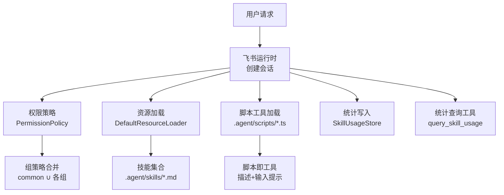
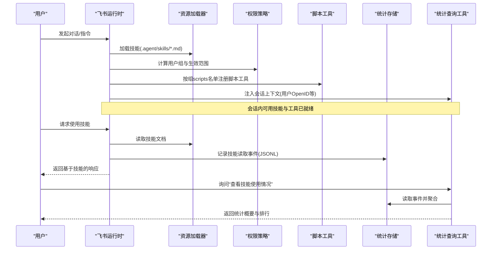
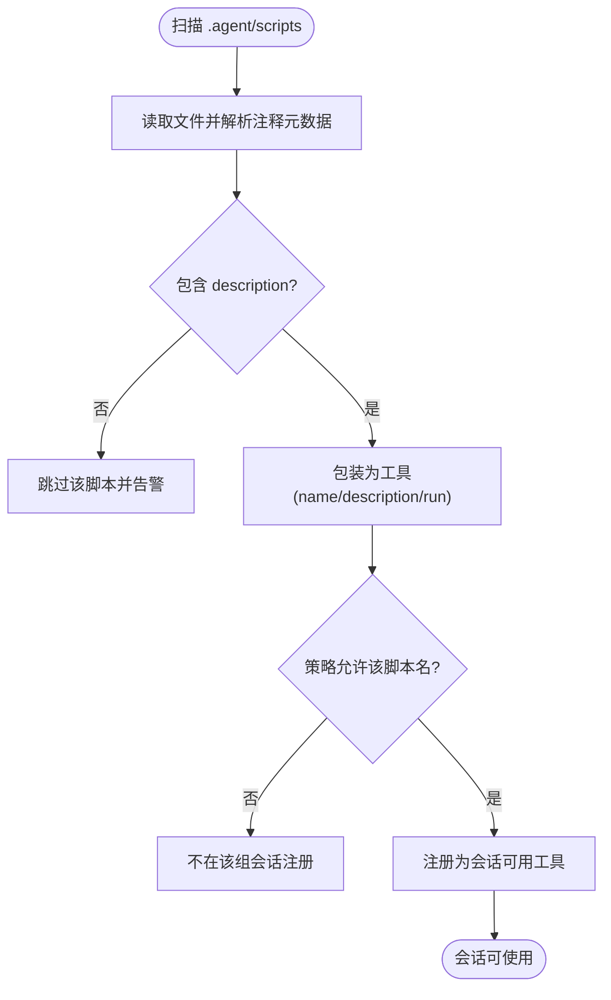
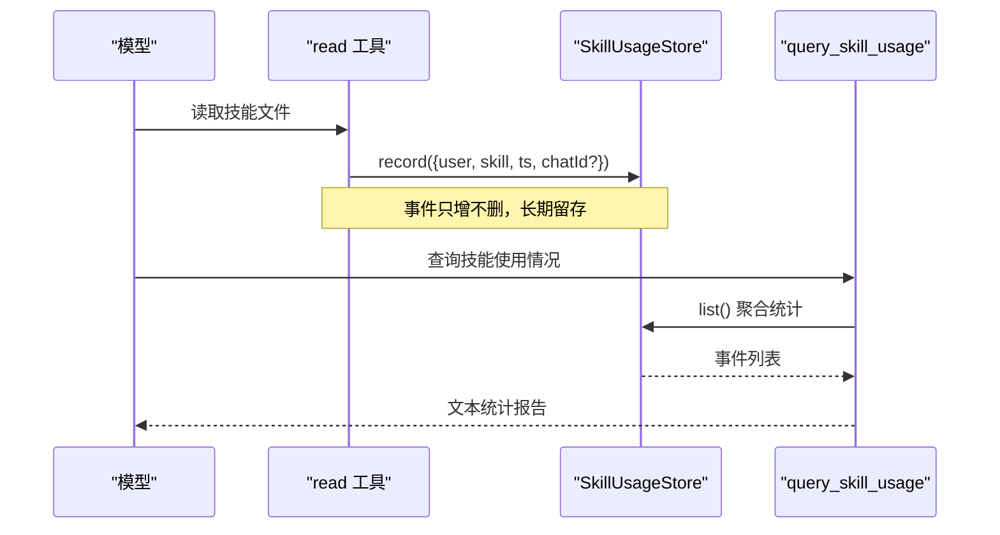
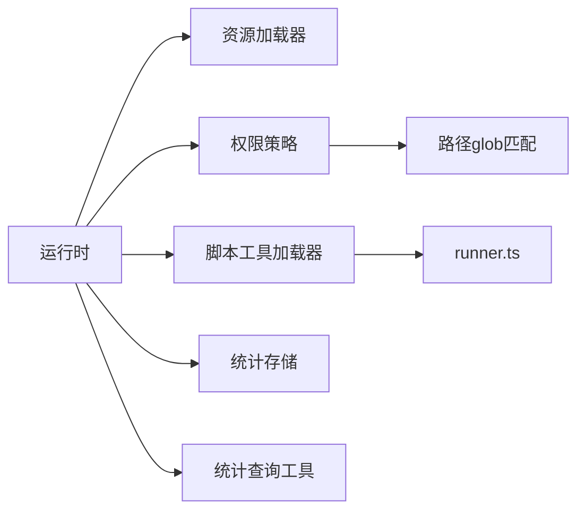

# 技能系统

<cite>
**本文引用的文件**
- [README.md](file://README.md)
- [permissions.json](file://.agent/permissions.json)
- [code-review.md](file://.agent/skills/code-review.md)
- [skill-to-tool.md](file://.agent/skills/skill-to-tool.md)
- [feishu-pi-runtime.ts](file://src/runtime/feishu-pi-runtime.ts)
- [policy.ts](file://src/permission/policy.ts)
- [runner.ts](file://src/scripts/runner.ts)
- [registry.ts](file://src/tools/registry.ts)
- [skill-usage-store.ts](file://src/stats/skill-usage-store.ts)
- [skill-usage-tool.ts](file://src/stats/skill-usage-tool.ts)
- [config.ts](file://src/config.ts)
</cite>

## 目录
1. [简介](#简介)
2. [项目结构](#项目结构)
3. [核心组件](#核心组件)
4. [架构总览](#架构总览)
5. [详细组件分析](#详细组件分析)
6. [依赖关系分析](#依赖关系分析)
7. [性能考虑](#性能考虑)
8. [故障排查指南](#故障排查指南)
9. [结论](#结论)
10. [附录](#附录)

## 简介
本文件面向开发者，系统化说明本仓库中的“技能（Skill）”体系：概念、定义格式、与智能体的交互方式（发现、加载、执行）、权限控制、统计与可观测性，以及从 Skill 演进为脚本工具的最佳实践。同时提供调试方法与性能优化建议，并给出实际示例与集成指引，帮助快速扩展技能能力。

## 项目结构
技能相关资源与代码主要分布在以下位置：
- 技能文档：.agent/skills/*.md（Markdown 指导文档，供 AI 阅读以理解流程）
- 脚本工具：.agent/scripts/*.ts（将固化流程封装为可执行能力，受策略控制）
- 权限策略：.agent/permissions.json（按组授权脚本、bash、读写路径与可见技能）
- 运行时：src/runtime/feishu-pi-runtime.ts（创建会话、加载技能与脚本工具、注入上下文）
- 权限策略引擎：src/permission/policy.ts（解析策略、合并生效范围、判定函数）
- 脚本加载器：src/scripts/runner.ts（扫描脚本、解析元数据、包装为工具）
- 工具注册表：src/tools/registry.ts（内置工具常量与历史自定义工具加载）
- 技能使用统计：src/stats/skill-usage-store.ts、src/stats/skill-usage-tool.ts（记录与查询）
- 配置：src/config.ts（启动参数、超时等）

图表来源
- [feishu-pi-runtime.ts:103-197](file://src/runtime/feishu-pi-runtime.ts#L103-L197)
- [policy.ts:68-158](file://src/permission/policy.ts#L68-L158)
- [runner.ts:31-60](file://src/scripts/runner.ts#L31-L60)
- [skill-usage-store.ts:67-157](file://src/stats/skill-usage-store.ts#L67-L157)
- [skill-usage-tool.ts:46-99](file://src/stats/skill-usage-tool.ts#L46-L99)

章节来源
- [README.md:252-437](file://README.md#L252-L437)
- [permissions.json:1-21](file://.agent/permissions.json#L1-L21)

## 核心组件
- 技能（Skill）：Markdown 格式的“思考指南”，用于引导 AI 完成复杂流程；每次使用时由模型读取完整内容，适合探索期、灵活判断的场景。
- 脚本工具（Script Tool）：.agent/scripts/*.ts 下的脚本文件即工具，通过注释声明 description/input 元数据，运行有超时限制，结果通过 stdout 输出；受策略文件 scripts 名单控制是否对某组可见。
- 权限策略（PermissionPolicy）：统一在 .agent/permissions.json 中定义 common、owner 及任意用户组的 scripts/bash/read/write/skills；生效范围为 common 与各所属组的并集；read 范围外直接拦截，其余未命中走授权卡或智能体仲裁。
- 运行时（FeishuPiRuntime）：创建会话时加载技能与脚本工具，按组策略过滤脚本工具注册，注入当前会话上下文到统计查询工具。
- 技能使用统计（SkillUsageStore + query_skill_usage）：当 Agent 通过 read 工具读取技能文件时自动记录事件（JSONL），并提供自然语言查询入口展示排行、使用者与最近使用时间。

章节来源
- [README.md:252-437](file://README.md#L252-L437)
- [policy.ts:5-32](file://src/permission/policy.ts#L5-L32)
- [feishu-pi-runtime.ts:103-197](file://src/runtime/feishu-pi-runtime.ts#L103-L197)
- [skill-usage-store.ts:1-157](file://src/stats/skill-usage-store.ts#L1-L157)
- [skill-usage-tool.ts:1-99](file://src/stats/skill-usage-tool.ts#L1-L99)

## 架构总览
技能系统围绕“AI 读技能 → 决策调用工具 → 策略与 Guard 管控 → 统计记录”的闭环构建。

图表来源
- [feishu-pi-runtime.ts:103-197](file://src/runtime/feishu-pi-runtime.ts#L103-L197)
- [policy.ts:68-158](file://src/permission/policy.ts#L68-L158)
- [skill-usage-store.ts:67-157](file://src/stats/skill-usage-store.ts#L67-L157)
- [skill-usage-tool.ts:46-99](file://src/stats/skill-usage-tool.ts#L46-L99)

## 详细组件分析

### 技能定义与格式
- 位置与命名：.agent/skills/*.md，文件名（去扩展名）即为技能名。
- 元数据：建议使用 frontmatter 声明 name、description；这些字段有助于日志与展示。
- 内容组织：以 Markdown 描述流程、步骤、输出格式与注意事项，便于 AI 按指导执行。
- 权限：技能文件的可见性由策略文件的 skills 字段控制；read 范围外的读取会被拦截。

章节来源
- [code-review.md:1-52](file://.agent/skills/code-review.md#L1-L52)
- [policy.ts:59-64](file://src/permission/policy.ts#L59-L64)
- [policy.ts:109-158](file://src/permission/policy.ts#L109-L158)

### 技能发现与加载流程
- 运行时在创建基础 ResourceLoader 后 reload，获取技能集合。
- 启动时可打印已加载的技能清单，便于管理员确认。
- 技能属于“对所有人开放”的资源，但具体可见性仍受策略 skills 字段约束。

章节来源
- [feishu-pi-runtime.ts:103-130](file://src/runtime/feishu-pi-runtime.ts#L103-L130)
- [policy.ts:109-158](file://src/permission/policy.ts#L109-L158)

### 脚本工具（Skill → Script）
- 约定优于配置：每个 .ts 文件即一个工具，文件名（去扩展名）= 工具名。
- 元数据：顶部注释声明 description（必需）与 input（可选，示例参数）。
- 执行契约：通过 process.argv[2] 接收 JSON 参数；stdout 输出结果；非零退出码表示失败；默认 30 秒超时。
- 权限：仅在策略文件中目标组的 scripts 名单内的脚本才会对该组会话注册。
- 演进建议：当流程稳定、高频且需严格授权边界时，将 Skill 转为脚本工具。

图表来源
- [runner.ts:31-60](file://src/scripts/runner.ts#L31-L60)
- [policy.ts:109-158](file://src/permission/policy.ts#L109-L158)

章节来源
- [skill-to-tool.md:1-59](file://.agent/skills/skill-to-tool.md#L1-L59)
- [runner.ts:6-18](file://src/scripts/runner.ts#L6-L18)
- [runner.ts:31-60](file://src/scripts/runner.ts#L31-L60)
- [policy.ts:109-158](file://src/permission/policy.ts#L109-L158)

### 权限与可见性
- 策略文件：.agent/permissions.json 定义 common、owner 及任意用户组的能力。
- 生效规则：生效范围 = common ∪ 所属各组；read 空回退到技能目录；skills 空回退到全部；owner 未配置字段取全量缺省。
- 判定函数：scriptsAllowed、bashAllowed、readAllowed、writeAllowed、skillsAllowed。
- 安全设计：bash 命令含 shell 连接符不参与前缀匹配；read 范围外交直接拦截；策略缺失/写坏按保守默认处理。

章节来源
- [permissions.json:1-21](file://.agent/permissions.json#L1-L21)
- [policy.ts:5-32](file://src/permission/policy.ts#L5-L32)
- [policy.ts:109-158](file://src/permission/policy.ts#L109-L158)
- [policy.ts:232-248](file://src/permission/policy.ts#L232-L248)

### 技能使用统计
- 触发点：Agent 通过 read 工具读取技能文件时，在工具执行钩子处记录事件（独立于 session 的追加式 JSONL 文件）。
- 识别规则：兼容内置 read（path 参数）与受限 read（file_path 参数），仅匹配技能目录下的 .md 文件，防止目录穿越误判。
- 查询工具：query_skill_usage 提供自然语言入口，返回累计次数、技能排行、使用者与最近使用时间，并显示调用者本人使用情况。
- 展示名：优先英文名 > 中文名 > Open ID，来自用户缓存文件。

图表来源
- [skill-usage-store.ts:35-61](file://src/stats/skill-usage-store.ts#L35-L61)
- [skill-usage-store.ts:84-120](file://src/stats/skill-usage-store.ts#L84-L120)
- [skill-usage-tool.ts:46-99](file://src/stats/skill-usage-tool.ts#L46-L99)

章节来源
- [skill-usage-store.ts:1-157](file://src/stats/skill-usage-store.ts#L1-L157)
- [skill-usage-tool.ts:1-99](file://src/stats/skill-usage-tool.ts#L1-L99)

### 运行时与会话集成
- 会话创建：设置模型 API Key，加载脚本工具并按组策略过滤注册，注入统计查询工具与上下文。
- 资源打印：启动时打印已加载技能与脚本工具，便于管理员确认。
- 配置项：支持模型 Provider、名称、Base URL、系统提示词、审核接口与超时、授权卡超时等。

章节来源
- [feishu-pi-runtime.ts:103-197](file://src/runtime/feishu-pi-runtime.ts#L103-L197)
- [config.ts:1-51](file://src/config.ts#L1-L51)

## 依赖关系分析
- 运行时依赖资源加载器与权限策略，决定会话可用的技能与脚本工具。
- 脚本工具依赖 runner 的元数据解析与执行环境。
- 统计模块依赖文件系统与用户缓存，提供持久化与展示名解析。
- 工具注册表维护内置工具常量与历史自定义工具加载逻辑。

图表来源
- [feishu-pi-runtime.ts:103-197](file://src/runtime/feishu-pi-runtime.ts#L103-L197)
- [runner.ts:31-60](file://src/scripts/runner.ts#L31-L60)
- [policy.ts:109-158](file://src/permission/policy.ts#L109-L158)

章节来源
- [registry.ts:1-46](file://src/tools/registry.ts#L1-L46)
- [policy.ts:109-158](file://src/permission/policy.ts#L109-L158)

## 性能考虑
- 技能读取成本：Skill 每次使用都会读取完整内容，Token 消耗较高；适合探索期与灵活判断场景。
- 脚本工具优势：固定流程封装为脚本，仅需读取 description，Token 消耗低，执行速度快，可靠性高。
- 统计写入：采用追加式 JSONL 与串行写队列，避免并发写冲突；失败仅告警不影响主流程。
- 超时与限流：脚本执行默认 30 秒超时，复杂任务应拆分；合理设置审核与授权卡超时，避免阻塞。
- 缓存与降级：用户信息缓存减少外部 API 调用；策略文件 mtime 热重载，新会话即时生效。

[本节为通用性能建议，不直接分析具体文件]

## 故障排查指南
- 策略文件异常：若 .agent/permissions.json 缺失或解析失败，系统按保守默认处理（用户仅技能目录可读、无脚本、无命令），并记录警告。
- 脚本加载失败：缺少 description 或解析错误会跳过并告警；检查脚本文件与注释元数据。
- 技能读取未统计：确保 read 工具参数为 path 或 file_path，且路径位于技能目录前缀下并以 .md 结尾；避免目录穿越。
- 统计查询为空：确认事件文件存在且有记录；检查用户缓存文件是否正确生成与更新。
- 启动日志无技能/脚本：确认 .agent/skills 与 .agent/scripts 目录结构与权限；检查运行时是否成功 reload。

章节来源
- [policy.ts:178-210](file://src/permission/policy.ts#L178-L210)
- [runner.ts:31-60](file://src/scripts/runner.ts#L31-L60)
- [skill-usage-store.ts:35-61](file://src/stats/skill-usage-store.ts#L35-L61)
- [skill-usage-store.ts:104-120](file://src/stats/skill-usage-store.ts#L104-L120)

## 结论
本技能系统以“Skill 作为思考指南、脚本工具作为执行能力”的双轨模式，结合统一的权限策略与完善的统计机制，实现了可扩展、可控、可观测的智能体能力体系。开发者可按流程成熟度从 Skill 演进到脚本工具，借助策略文件精细控制可见性与执行边界，并通过统计工具持续评估技能价值与使用趋势。

[本节为总结性内容，不直接分析具体文件]

## 附录

### 技能开发最佳实践
- 明确职责：Skill 负责流程指导，Tool/脚本负责执行；避免在 Skill 中描述工具用法细节。
- 渐进演进：流程稳定后尽快转为脚本工具，降低 Token 消耗、提升可靠性与速度。
- 权限先行：在策略文件中提前规划 scripts、bash、read/write、skills 的可见范围。
- 元数据清晰：脚本注释中的 description 与 input 要准确，帮助模型正确选择与传参。
- 可观测性：利用统计工具评估技能使用情况，及时下线低频或无效技能。

[本节为通用实践建议，不直接分析具体文件]

### 调试方法
- 启动日志：查看运行时打印的已加载技能与脚本工具清单，确认资源是否被识别。
- 策略调试：使用 /perm 指令查看当前策略生效范围与成员列表。
- 脚本调试：检查脚本 stdout 输出与退出码；关注 30 秒超时与参数传递。
- 统计验证：通过“查看技能使用情况”确认事件是否被记录与聚合。

章节来源
- [feishu-pi-runtime.ts:118-145](file://src/runtime/feishu-pi-runtime.ts#L118-L145)
- [skill-usage-tool.ts:46-99](file://src/stats/skill-usage-tool.ts#L46-L99)

### 性能优化建议
- 将高频、固定流程封装为脚本工具，减少多轮对话与 Token 消耗。
- 合理设置审核与授权卡超时，避免长时间阻塞。
- 利用用户信息缓存与策略热重载，减少外部调用与重启成本。
- 定期清理或归档低频技能，保持知识库精简高效。

[本节为通用优化建议，不直接分析具体文件]

### 实际示例与集成指南
- 示例技能：code-review.md（代码审查流程指导）、skill-to-tool.md（流程转脚本指南）。
- 集成步骤：
  1) 在 .agent/skills 下新增 Markdown 技能文件，编写流程与输出格式。
  2) 如需固化执行，在 .agent/scripts 下新增脚本文件，添加 description/input 注释。
  3) 在 .agent/permissions.json 中为目标组添加 scripts 名单与 read/write/skills 范围。
  4) 重启或新建会话使策略生效；通过 /perm 与启动日志验证。
  5) 使用“查看技能使用情况”观察效果，必要时迭代或迁移为脚本工具。

章节来源
- [code-review.md:1-52](file://.agent/skills/code-review.md#L1-L52)
- [skill-to-tool.md:1-59](file://.agent/skills/skill-to-tool.md#L1-L59)
- [permissions.json:1-21](file://.agent/permissions.json#L1-L21)
- [feishu-pi-runtime.ts:103-197](file://src/runtime/feishu-pi-runtime.ts#L103-L197)