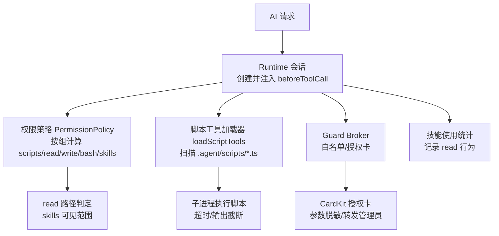
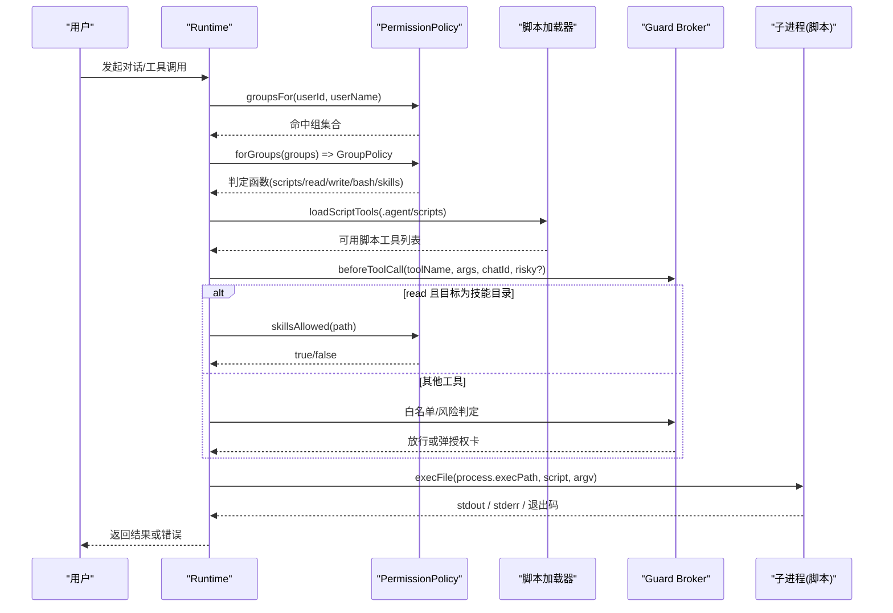
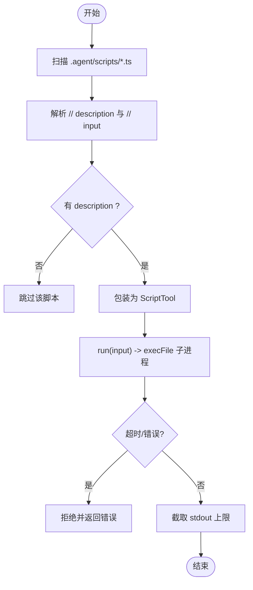
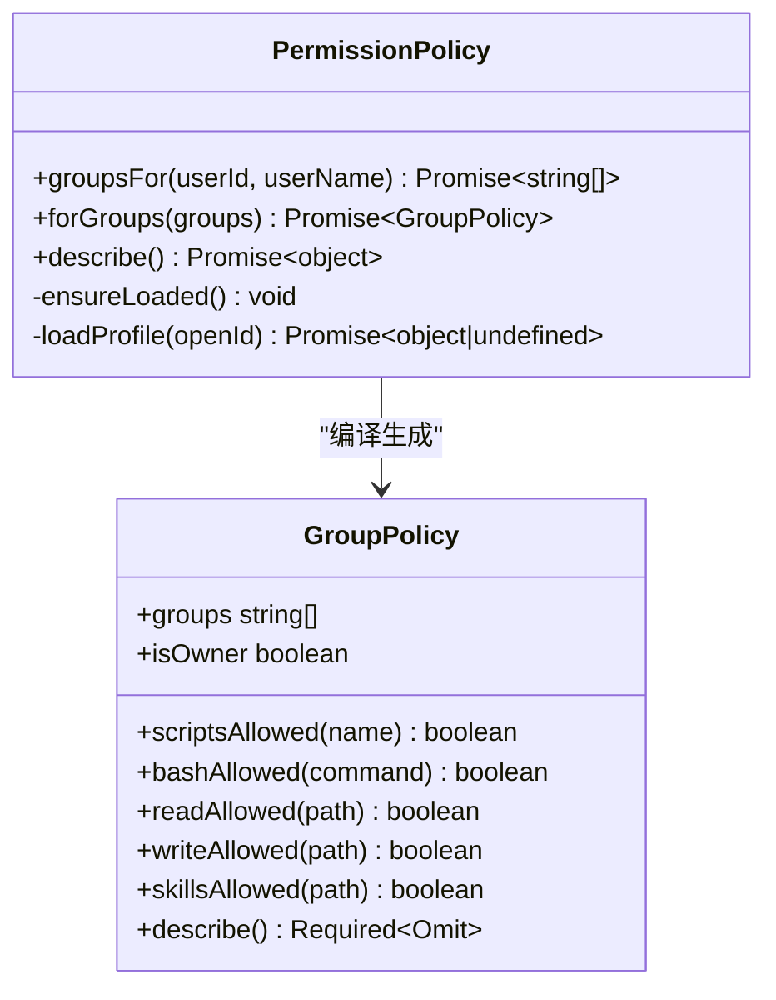
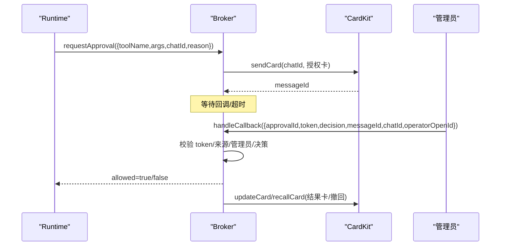
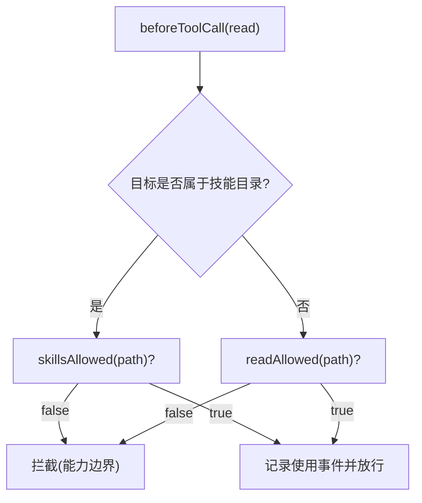
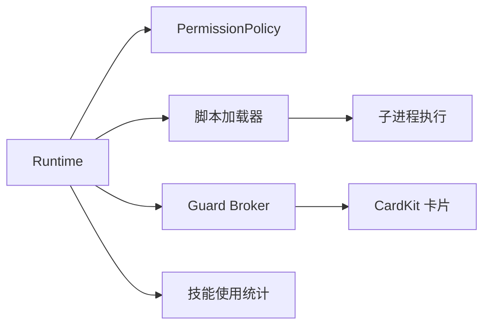

# 脚本工具系统

<cite>
**本文引用的文件**
- [src/scripts/runner.ts](file://src/scripts/runner.ts)
- [src/tools/registry.ts](file://src/tools/registry.ts)
- [src/stats/skill-usage-tool.ts](file://src/stats/skill-usage-tool.ts)
- [src/permission/policy.ts](file://src/permission/policy.ts)
- [src/guard/broker.ts](file://src/guard/broker.ts)
- [src/guard/card.ts](file://src/guard/card.ts)
- [src/runtime/types.ts](file://src/runtime/types.ts)
- [src/runtime/feishu-pi-runtime.ts](file://src/runtime/feishu-pi-runtime.ts)
- [README.md](file://README.md)
</cite>

## 目录
1. [简介](#简介)
2. [项目结构](#项目结构)
3. [核心组件](#核心组件)
4. [架构总览](#架构总览)
5. [详细组件分析](#详细组件分析)
6. [依赖关系分析](#依赖关系分析)
7. [性能与限制](#性能与限制)
8. [故障排查](#故障排查)
9. [结论](#结论)
10. [附录：开发规范与最佳实践](#附录开发规范与最佳实践)

## 简介
本系统提供“脚本工具”能力，将 .agent/scripts/*.ts 中的每个脚本视为一个可被 AI Agent 调用的工具。脚本以约定优于配置的方式声明元数据，通过子进程隔离执行，并由统一的权限策略与授权卡机制进行安全控制。同时，系统区分 Skill（技能）与 Tool（工具）的职责边界，并提供从 Skill 到 Tool 的演进路径。

## 项目结构
- 脚本加载与执行：src/scripts/runner.ts
- 工具注册表（含已退役的自定义工具加载逻辑）：src/tools/registry.ts
- 权限策略与组过滤：src/permission/policy.ts
- 授权中枢与卡片构建：src/guard/broker.ts、src/guard/card.ts
- 运行时类型与钩子注入：src/runtime/types.ts、src/runtime/feishu-pi-runtime.ts
- 技能使用统计查询工具：src/stats/skill-usage-tool.ts
- 用户文档与概念说明：README.md

图表来源
- [src/runtime/feishu-pi-runtime.ts:159-251](file://src/runtime/feishu-pi-runtime.ts#L159-L251)
- [src/scripts/runner.ts:31-79](file://src/scripts/runner.ts#L31-L79)
- [src/permission/policy.ts:109-158](file://src/permission/policy.ts#L109-L158)
- [src/guard/broker.ts:78-166](file://src/guard/broker.ts#L78-L166)
- [src/guard/card.ts:27-86](file://src/guard/card.ts#L27-L86)

章节来源
- [README.md:252-438](file://README.md#L252-L438)

## 核心组件
- 脚本工具加载器与执行器：负责扫描脚本、解析元数据、包装为工具、以子进程执行并返回 stdout。
- 权限策略：基于 .agent/permissions.json 定义身份组与能力范围，编译出判定函数（scriptsAllowed、bashAllowed、readAllowed、writeAllowed、skillsAllowed）。
- 授权中枢：管理待授权请求、发送授权卡、校验回调、支持转发管理员与结果卡更新。
- 运行时钩子：在 beforeToolCall 中统一执行 read 路径判定、skills 可见性判定、以及调用 Guard。
- 技能使用统计：对 read 技能文件的行为进行事件化记录，并提供查询工具。

章节来源
- [src/scripts/runner.ts:6-29](file://src/scripts/runner.ts#L6-L29)
- [src/permission/policy.ts:5-32](file://src/permission/policy.ts#L5-L32)
- [src/guard/broker.ts:41-45](file://src/guard/broker.ts#L41-L45)
- [src/runtime/feishu-pi-runtime.ts:226-251](file://src/runtime/feishu-pi-runtime.ts#L226-L251)
- [src/stats/skill-usage-tool.ts:1-10](file://src/stats/skill-usage-tool.ts#L1-L10)

## 架构总览
系统在会话创建时完成资源加载与策略编译，并在每次工具调用前通过 beforeToolCall 钩子进行权限与安全检查。脚本工具以独立子进程运行，具备超时与输出上限保护；读操作受 skills/read 范围约束；写/命令/其他工具走 Guard 白名单或授权卡流程。

图表来源
- [src/runtime/feishu-pi-runtime.ts:159-251](file://src/runtime/feishu-pi-runtime.ts#L159-L251)
- [src/scripts/runner.ts:31-79](file://src/scripts/runner.ts#L31-L79)
- [src/permission/policy.ts:109-158](file://src/permission/policy.ts#L109-L158)
- [src/guard/broker.ts:78-166](file://src/guard/broker.ts#L78-L166)

## 详细组件分析

### 脚本工具加载与执行（src/scripts/runner.ts）
- 约定：脚本顶部注释声明 description（必需）与 input（可选），文件名去扩展名即为工具名。
- 加载：loadScriptTools 扫描 .agent/scripts/*.ts，跳过测试文件，解析元数据后包装为 {name, description, run}。
- 执行：runScript 通过 child_process.execFile 启动 Node 子进程，传入 JSON 参数，限制超时与输出大小，非零退出码视为失败。
- 路径解析：resolveScriptPath 支持绝对路径或相对脚本目录的名称解析。

图表来源
- [src/scripts/runner.ts:31-79](file://src/scripts/runner.ts#L31-L79)
- [src/scripts/runner.ts:81-95](file://src/scripts/runner.ts#L81-L95)

章节来源
- [src/scripts/runner.ts:6-29](file://src/scripts/runner.ts#L6-L29)
- [src/scripts/runner.ts:31-79](file://src/scripts/runner.ts#L31-L79)
- [src/scripts/runner.ts:81-95](file://src/scripts/runner.ts#L81-L95)

### 权限策略（src/permission/policy.ts）
- 策略文件：.agent/permissions.json，定义 common 与各组的 members/scripts/bash/read/write/skills。
- 组匹配：groupsFor 根据 adminId 与成员标识（openId/中文名/英文名）匹配组。
- 策略合并：forGroups 将 common 与所属组字段取并集，并应用保守缺省（如未配置 read 则仅技能目录可读）。
- 判定函数：scriptsAllowed、bashAllowed、readAllowed、writeAllowed、skillsAllowed 提供细粒度控制。
- 热重载：监听策略文件 mtime，新会话生效。

图表来源
- [src/permission/policy.ts:68-158](file://src/permission/policy.ts#L68-L158)
- [src/permission/policy.ts:178-238](file://src/permission/policy.ts#L178-L238)

章节来源
- [src/permission/policy.ts:5-32](file://src/permission/policy.ts#L5-L32)
- [src/permission/policy.ts:109-158](file://src/permission/policy.ts#L109-L158)
- [src/permission/policy.ts:178-238](file://src/permission/policy.ts#L178-L238)

### 授权中枢与卡片（src/guard/broker.ts、src/guard/card.ts）
- 授权流程：requestApproval 发送授权卡，维护 pending 队列，支持超时与中止信号；handleCallback 服务端校验 token、消息来源、操作者身份与决策合法性；forwardToAdmin 支持转发至管理员私聊。
- 卡片构建：buildPermissionCard 展示工具摘要与按钮（允许一次/拒绝/转发管理员），参数敏感字段自动脱敏；buildResultCard 显示最终结果。
- 收尾逻辑：finalizeCards 在精简模式下撤回卡片，详细模式更新为结果卡。

图表来源
- [src/guard/broker.ts:78-166](file://src/guard/broker.ts#L78-L166)
- [src/guard/card.ts:27-86](file://src/guard/card.ts#L27-L86)

章节来源
- [src/guard/broker.ts:5-45](file://src/guard/broker.ts#L5-L45)
- [src/guard/broker.ts:78-166](file://src/guard/broker.ts#L78-L166)
- [src/guard/card.ts:1-102](file://src/guard/card.ts#L1-L102)

### 运行时钩子与 read 路径判定（src/runtime/feishu-pi-runtime.ts）
- 会话创建：加载基础 ResourceLoader，打印可用资源（Skills 与脚本工具）。
- 策略注入：获取用户组与 GroupPolicy，设置 session.agent.beforeToolCall。
- read 判定：若读取目标位于技能目录，按 skillsAllowed 判定；否则按 readAllowed 判定；不在范围内直接拦截不弹卡。
- 统计注入：范围内的技能读取会记录使用事件（失败仅告警）。

图表来源
- [src/runtime/feishu-pi-runtime.ts:226-251](file://src/runtime/feishu-pi-runtime.ts#L226-L251)

章节来源
- [src/runtime/feishu-pi-runtime.ts:103-121](file://src/runtime/feishu-pi-runtime.ts#L103-L121)
- [src/runtime/feishu-pi-runtime.ts:159-170](file://src/runtime/feishu-pi-runtime.ts#L159-L170)
- [src/runtime/feishu-pi-runtime.ts:226-251](file://src/runtime/feishu-pi-runtime.ts#L226-L251)

### 技能使用统计（src/stats/skill-usage-tool.ts）
- 目的：当 Agent 读取技能文件时记录事件，提供自然语言查询与本地可视化。
- 实现：createSkillUsageQueryTool 暴露 query_skill_usage 工具，聚合事件并按技能排行、近 7 天用量、个人使用情况输出。

章节来源
- [src/stats/skill-usage-tool.ts:1-100](file://src/stats/skill-usage-tool.ts#L1-L100)

### 工具注册表（src/tools/registry.ts）
- 现状：自定义工具加载逻辑已退役，迁移至 .agent/scripts/*.ts 脚本方式。
- 保留：DEFAULT_BUILTIN_TOOLS 常量与异步注册接口，便于兼容历史代码。

章节来源
- [src/tools/registry.ts:1-46](file://src/tools/registry.ts#L1-L46)

### Skill 与 Tool 的区别与协作（README.md）
- Skill：Markdown 指导文档，描述“如何思考与执行复杂流程”，适合探索期流程。
- Tool：TypeScript 可执行函数，描述“做什么”，适合成熟固化流程。
- 协作：两者平级，Skill 可引导 AI 调用 Tool；成熟流程应从 Skill 演进为 Tool 以提升效率与可靠性。

章节来源
- [README.md:252-438](file://README.md#L252-L438)

## 依赖关系分析
- Runtime 依赖 PermissionPolicy 与脚本加载器，注入 beforeToolCall 钩子。
- 脚本工具依赖 Node 子进程执行环境，具备超时与缓冲限制。
- Guard Broker 依赖 CardKit 发送/更新卡片，并对回调进行严格校验。
- 统计模块依赖 SkillUsageStore，仅在 read 技能文件时记录事件。

图表来源
- [src/runtime/feishu-pi-runtime.ts:159-251](file://src/runtime/feishu-pi-runtime.ts#L159-L251)
- [src/scripts/runner.ts:31-79](file://src/scripts/runner.ts#L31-L79)
- [src/guard/broker.ts:78-166](file://src/guard/broker.ts#L78-L166)
- [src/stats/skill-usage-tool.ts:46-99](file://src/stats/skill-usage-tool.ts#L46-L99)

章节来源
- [src/runtime/types.ts:27-51](file://src/runtime/types.ts#L27-L51)
- [src/runtime/feishu-pi-runtime.ts:159-251](file://src/runtime/feishu-pi-runtime.ts#L159-L251)

## 性能与限制
- 脚本执行超时：默认 30 秒，避免长时间阻塞。
- 输出上限：stdout 最大截断 8000 字符，防止过大响应影响性能。
- 子进程隔离：脚本以独立进程运行，具备基本的环境隔离；但信任边界为“能写 scripts 目录的人即拥有进程”。
- 策略热重载：权限策略文件变更即时生效于新会话。
- 统计写入：技能读取事件追加式存储，不影响主流程。

[本节为通用性能讨论，无需具体文件引用]

## 故障排查
- 脚本缺少 description：加载器会跳过并记录警告。
- 策略文件解析失败：按保守默认处理，用户仅技能目录可读、无脚本与命令。
- 授权卡回调失败：检查 approvalId/token 一致性、消息来源、操作者是否为管理员。
- read 路径被拦截：确认路径是否在 skills/read 范围内；技能目录走 skillsAllowed，其他路径走 readAllowed。
- 脚本执行失败：检查 stderr 与退出码；注意超时与输出截断。

章节来源
- [src/scripts/runner.ts:44-57](file://src/scripts/runner.ts#L44-L57)
- [src/permission/policy.ts:178-209](file://src/permission/policy.ts#L178-L209)
- [src/guard/broker.ts:131-166](file://src/guard/broker.ts#L131-L166)
- [src/runtime/feishu-pi-runtime.ts:234-249](file://src/runtime/feishu-pi-runtime.ts#L234-L249)

## 结论
本系统通过“脚本工具 + 权限策略 + 授权卡”的组合，提供了可扩展、可审计、可控制的工具执行能力。Skill 与 Tool 分工明确，既支持灵活探索也保障成熟流程的稳定性与效率。建议在流程稳定后将 Skill 演进为 Tool，并通过策略文件精细控制权限，结合授权卡机制确保高风险操作的合规性。

[本节为总结，无需具体文件引用]

## 附录：开发规范与最佳实践

### 脚本开发规范
- 元数据声明：在脚本顶部添加 // description 与可选 // input，帮助模型理解工具用途与参数示例。
- 输入输出：通过 process.argv[2] 接收 JSON 参数，console.log 输出结果；非零退出码视为失败。
- 命名与组织：文件名（去扩展名）即为工具名；建议按功能分类存放于 .agent/scripts。
- 安全边界：脚本以子进程全权限运行，需确保脚本来源可信；避免在脚本中执行不可信输入。

章节来源
- [src/scripts/runner.ts:6-18](file://src/scripts/runner.ts#L6-L18)
- [src/scripts/runner.ts:31-79](file://src/scripts/runner.ts#L31-L79)

### 工具定义格式
- 脚本工具：遵循 runner 约定的元数据与执行契约。
- 内置工具：read/write/edit/bash 由系统提供，权限由策略文件控制。
- 自定义工具：已退役，迁移至脚本方式；如需复杂逻辑，优先封装为脚本工具。

章节来源
- [src/tools/registry.ts:8-46](file://src/tools/registry.ts#L8-L46)
- [README.md:252-438](file://README.md#L252-L438)

### 调试方法
- 查看可用资源：启动日志会列出 Skills 与脚本工具。
- 日志定位：关注 [Scripts]、[Policy]、[Broker] 等日志前缀。
- 策略验证：使用 /perm 指令查看当前策略生效范围。
- 授权卡调试：观察授权卡内容（参数已脱敏），必要时转发管理员私聊进行决策。

章节来源
- [src/runtime/feishu-pi-runtime.ts:114-121](file://src/runtime/feishu-pi-runtime.ts#L114-L121)
- [src/permission/policy.ts:160-176](file://src/permission/policy.ts#L160-L176)
- [src/guard/card.ts:27-86](file://src/guard/card.ts#L27-L86)

### 实际脚本示例与最佳实践
- 示例脚本：在 .agent/scripts 下新增 .ts 文件，添加 description 与 input 注释，实现参数解析与结果输出。
- 最佳实践：
  - 保持脚本幂等与健壮，捕获异常并返回清晰错误信息。
  - 控制输出大小，避免过长文本导致性能问题。
  - 通过策略文件精确授权脚本名称，最小权限原则。
  - 对涉及外部 API 的脚本，增加重试与超时处理。
  - 定期审查脚本与策略，清理不再使用的能力。

[本节为通用指导，无需具体文件引用]