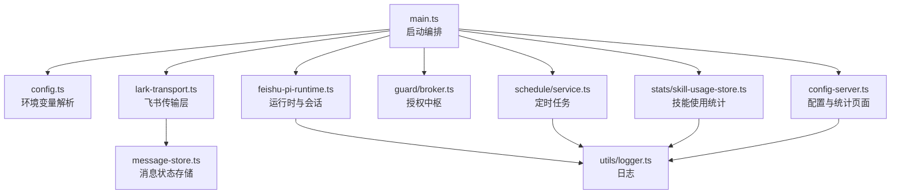
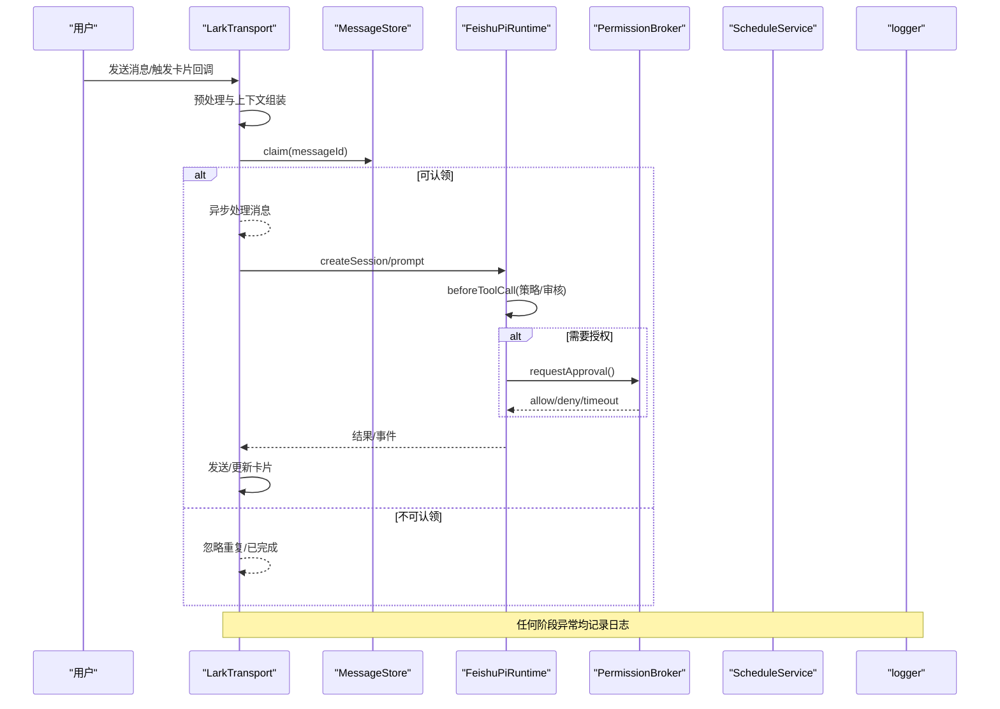
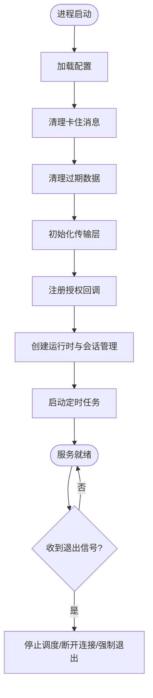
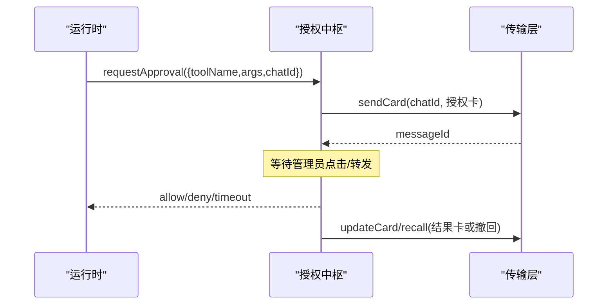
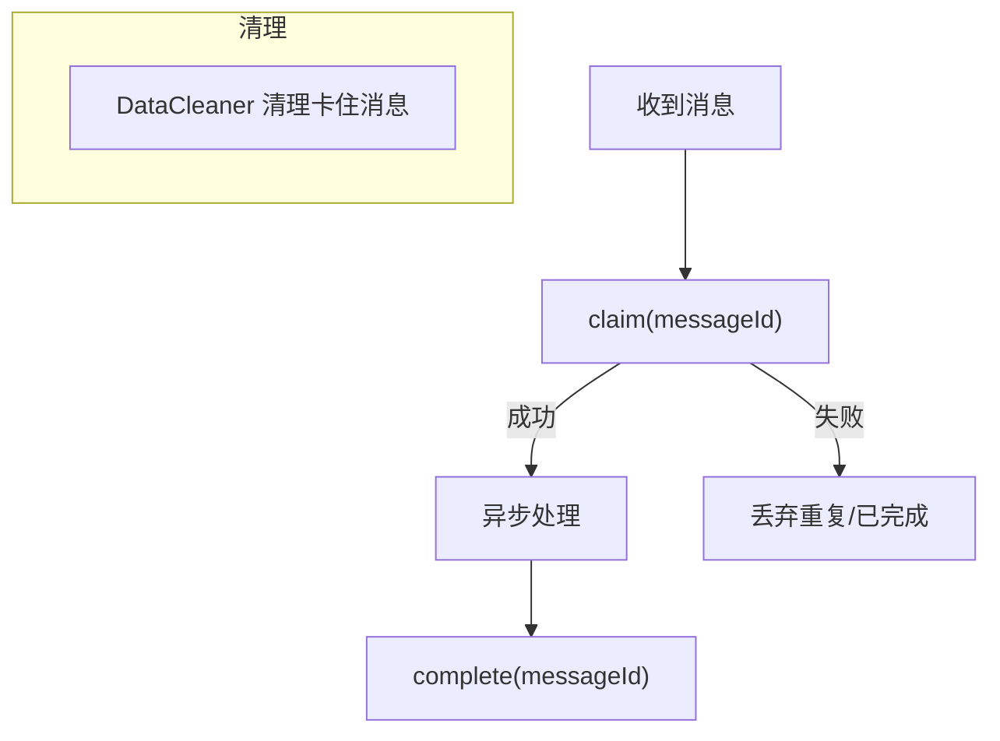
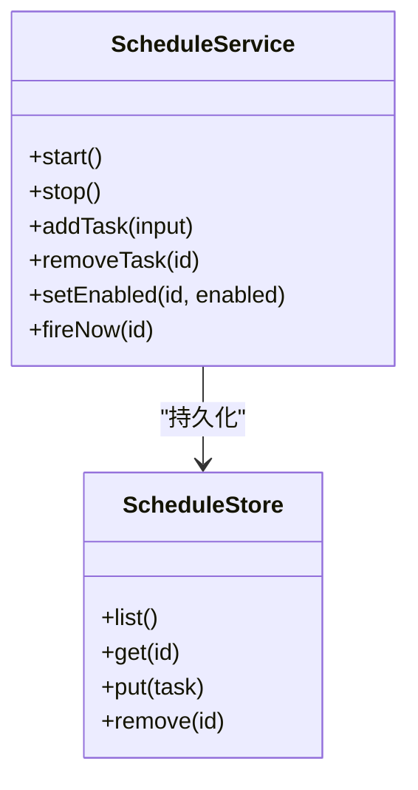
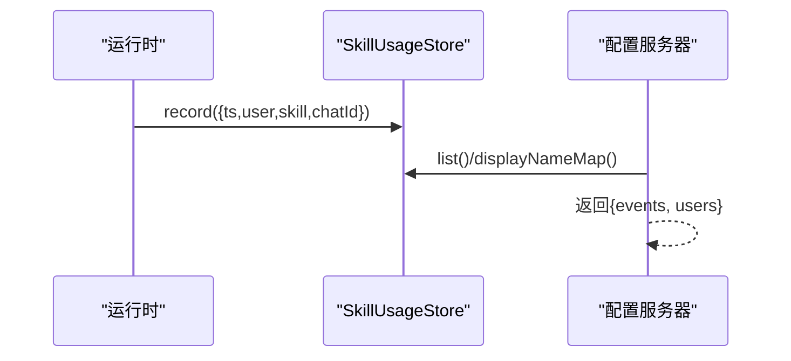
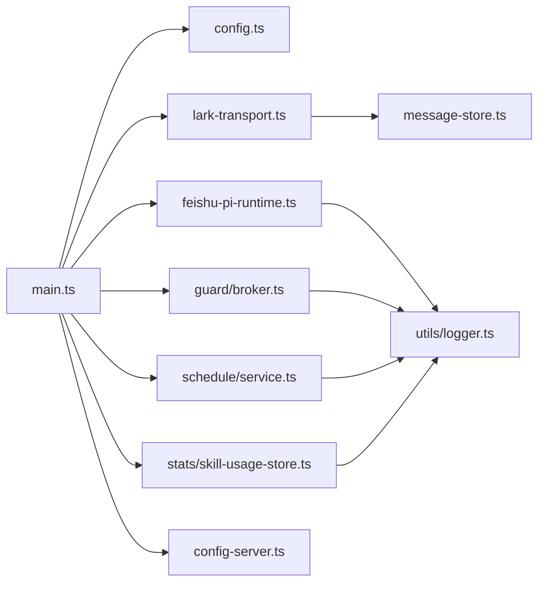

# 故障排查

<cite>
**本文引用的文件**
- [src/main.ts](file://src/main.ts)
- [src/config-server.ts](file://src/config-server.ts)
- [src/config.ts](file://src/config.ts)
- [src/utils/logger.ts](file://src/utils/logger.ts)
- [src/feishu/lark-transport.ts](file://src/feishu/lark-transport.ts)
- [src/feishu/message-store.ts](file://src/feishu/message-store.ts)
- [src/runtime/feishu-pi-runtime.ts](file://src/runtime/feishu-pi-runtime.ts)
- [src/guard/broker.ts](file://src/guard/broker.ts)
- [src/schedule/service.ts](file://src/schedule/service.ts)
- [src/stats/skill-usage-store.ts](file://src/stats/skill-usage-store.ts)
- [scripts/start.js](file://scripts/start.js)
- [package.json](file://package.json)
- [test/reliability.test.ts](file://test/reliability.test.ts)
</cite>

## 目录
1. [简介](#简介)
2. [项目结构](#项目结构)
3. [核心组件](#核心组件)
4. [架构总览](#架构总览)
5. [详细组件分析](#详细组件分析)
6. [依赖关系分析](#依赖关系分析)
7. [性能注意事项](#性能注意事项)
8. [故障排查指南](#故障排查指南)
9. [结论](#结论)
10. [附录](#附录)

## 简介
本指南面向运维与开发人员，提供针对该飞书智能体服务的完整故障排查手册。内容涵盖：常见问题诊断、错误日志分析、性能瓶颈定位、调试工具与断点调试技巧、远程调试配置、系统健康检查与服务状态监控、依赖服务可用性检测、典型故障场景的解决步骤、应急预案与恢复流程，以及性能分析工具使用建议。

## 项目结构
- 入口与启动：主进程负责加载配置、初始化传输层、运行时、权限授权、定时任务、清理任务等，并处理优雅退出。
- 配置与统计页面：内置 Express 服务器提供 .env 在线编辑与技能使用统计页面。
- 运行时：封装会话创建、模型切换、工具调用前拦截（策略与审核）、技能使用记录。
- 消息与存储：消息去重与“卡住”清理、会话映射持久化、定时任务持久化、技能使用事件流。
- 权限与授权：授权卡片发放、回调校验、转发管理员私聊、超时与中断处理。
- 传输层：飞书 WebSocket 连接、消息预处理、异常捕获与日志。
- 调度：基于 cron 的任务调度与执行，失败状态持久化。
- 日志：统一带时间戳的日志输出，便于问题定位。

**图表来源**
- [src/main.ts:27-247](file://src/main.ts#L27-L247)
- [src/config.ts:25-49](file://src/config.ts#L25-L49)
- [src/feishu/lark-transport.ts:223-248](file://src/feishu/lark-transport.ts#L223-L248)
- [src/runtime/feishu-pi-runtime.ts:81-145](file://src/runtime/feishu-pi-runtime.ts#L81-L145)
- [src/guard/broker.ts:46-129](file://src/guard/broker.ts#L46-L129)
- [src/schedule/service.ts:105-123](file://src/schedule/service.ts#L105-L123)
- [src/stats/skill-usage-store.ts:67-96](file://src/stats/skill-usage-store.ts#L67-L96)
- [src/config-server.ts:12-149](file://src/config-server.ts#L12-L149)

**章节来源**
- [src/main.ts:27-247](file://src/main.ts#L27-L247)
- [package.json:6-12](file://package.json#L6-L12)

## 核心组件
- 启动编排（main）：加载配置、初始化数据清理、构建飞书客户端、注册授权回调、创建运行时与会话管理器、启动传输与调度、优雅退出。
- 配置服务器（Express）：提供 / 配置页、/api/config 读写 .env、/stats 统计页、/api/stats/events 读取技能使用事件。
- 运行时（FeishuPiRuntime）：创建会话、注入 beforeToolCall 钩子实现路径/脚本/工具策略与审核、记录技能使用、支持模型热切换。
- 授权中枢（PermissionBroker）：发放授权卡片、服务端强校验 token/chatId/操作者身份、超时与中止处理、结果卡更新或撤回。
- 传输层（LarkTransport）：WebSocket 接收消息、预处理、异步处理并捕获异常、发送卡片与更新。
- 消息存储（MessageStore）：原子认领、完成标记、过期与“卡住”判定。
- 定时任务（ScheduleService）：cron 调度、持久化、执行失败记录、启停控制。
- 技能使用统计（SkillUsageStore）：JSONL 追加写、内存缓存、用户展示名解析。
- 日志（logger）：统一时间戳与级别，便于检索与告警。

**章节来源**
- [src/main.ts:27-247](file://src/main.ts#L27-L247)
- [src/config-server.ts:12-149](file://src/config-server.ts#L12-L149)
- [src/runtime/feishu-pi-runtime.ts:81-285](file://src/runtime/feishu-pi-runtime.ts#L81-L285)
- [src/guard/broker.ts:46-199](file://src/guard/broker.ts#L46-L199)
- [src/feishu/lark-transport.ts:223-248](file://src/feishu/lark-transport.ts#L223-L248)
- [src/feishu/message-store.ts:1-35](file://src/feishu/message-store.ts#L1-L35)
- [src/schedule/service.ts:105-238](file://src/schedule/service.ts#L105-L238)
- [src/stats/skill-usage-store.ts:67-157](file://src/stats/skill-usage-store.ts#L67-L157)
- [src/utils/logger.ts:24-39](file://src/utils/logger.ts#L24-L39)

## 架构总览
下图展示了从消息到达、权限判定、工具执行到结果推送的全链路，以及关键的健康检查点与日志落点。

**图表来源**
- [src/feishu/lark-transport.ts:223-248](file://src/feishu/lark-transport.ts#L223-L248)
- [src/feishu/message-store.ts:23-35](file://src/feishu/message-store.ts#L23-L35)
- [src/runtime/feishu-pi-runtime.ts:226-282](file://src/runtime/feishu-pi-runtime.ts#L226-L282)
- [src/guard/broker.ts:78-129](file://src/guard/broker.ts#L78-L129)
- [src/utils/logger.ts:24-39](file://src/utils/logger.ts#L24-L39)

## 详细组件分析

### 启动与生命周期
- 启动时先清理“卡住的消息”和过期数据，随后每 24 小时定期清理一次。
- 获取 Bot Open ID、解析管理员 Open ID，建立传输层与授权回调。
- 创建运行时与会话管理器，启动传输连接与定时任务调度。
- 优雅退出：关闭定时器与调度器，后台断开飞书连接，宽限期后强制退出。

**图表来源**
- [src/main.ts:27-247](file://src/main.ts#L27-L247)
- [src/main.ts:252-282](file://src/main.ts#L252-L282)

**章节来源**
- [src/main.ts:27-247](file://src/main.ts#L27-L247)
- [src/main.ts:252-282](file://src/main.ts#L252-L282)

### 授权与权限判定
- 工具调用前通过 beforeToolCall 进行路径/脚本/工具策略判定；高风险或不在白名单的工具进入授权流程。
- PermissionBroker 发放授权卡片，服务端强校验 token、chatId、操作者身份，支持转发管理员私聊。
- 超时或会话中止自动拒绝并收尾卡片（精简模式撤回，详细模式更新结果卡）。

**图表来源**
- [src/runtime/feishu-pi-runtime.ts:226-282](file://src/runtime/feishu-pi-runtime.ts#L226-L282)
- [src/guard/broker.ts:78-165](file://src/guard/broker.ts#L78-L165)
- [src/guard/broker.ts:168-199](file://src/guard/broker.ts#L168-L199)

**章节来源**
- [src/runtime/feishu-pi-runtime.ts:226-282](file://src/runtime/feishu-pi-runtime.ts#L226-L282)
- [src/guard/broker.ts:46-199](file://src/guard/broker.ts#L46-L199)

### 消息处理与可靠性
- MessageStore 对消息进行原子认领，避免重复投递与重复执行 Agent。
- 超过处理超时的“processing”状态视为卡住，由 DataCleaner 清理。
- 测试覆盖并发下会话唯一创建、消息仅认领一次、会话映射持久化。

**图表来源**
- [src/feishu/message-store.ts:23-35](file://src/feishu/message-store.ts#L23-L35)
- [src/runtime/data-cleaner.ts:173-182](file://src/runtime/data-cleaner.ts#L173-L182)
- [test/reliability.test.ts:28-56](file://test/reliability.test.ts#L28-L56)

**章节来源**
- [src/feishu/message-store.ts:1-35](file://src/feishu/message-store.ts#L1-L35)
- [test/reliability.test.ts:28-56](file://test/reliability.test.ts#L28-L56)

### 定时任务
- ScheduleService 维护任务列表与 cron 调度，启动时恢复已启用任务。
- 执行失败记录 lastStatus/lastError，可通过统计接口查看。
- 支持立即触发、启停、删除等操作。

**图表来源**
- [src/schedule/service.ts:30-90](file://src/schedule/service.ts#L30-L90)
- [src/schedule/service.ts:105-238](file://src/schedule/service.ts#L105-L238)

**章节来源**
- [src/schedule/service.ts:105-238](file://src/schedule/service.ts#L105-L238)

### 技能使用统计
- 在 beforeToolCall 中识别“读取技能文件”的行为并记录事件，独立 JSONL 文件长期留存。
- 提供 /api/stats/events 接口返回事件与用户展示名映射，前端筛选聚合。

**图表来源**
- [src/runtime/feishu-pi-runtime.ts:250-258](file://src/runtime/feishu-pi-runtime.ts#L250-L258)
- [src/stats/skill-usage-store.ts:84-96](file://src/stats/skill-usage-store.ts#L84-L96)
- [src/config-server.ts:127-142](file://src/config-server.ts#L127-L142)

**章节来源**
- [src/stats/skill-usage-store.ts:67-157](file://src/stats/skill-usage-store.ts#L67-L157)
- [src/config-server.ts:127-142](file://src/config-server.ts#L127-L142)

## 依赖关系分析
- 外部依赖：飞书 SDK、Express、croner、dotenv 等。
- 内部耦合：main 协调各模块；运行时依赖策略与审核；传输层依赖消息存储；授权中枢依赖传输层发送/更新卡片；定时任务依赖持久化与运行器。

**图表来源**
- [src/main.ts:27-247](file://src/main.ts#L27-L247)
- [src/config.ts:25-49](file://src/config.ts#L25-L49)
- [src/feishu/lark-transport.ts:223-248](file://src/feishu/lark-transport.ts#L223-L248)
- [src/runtime/feishu-pi-runtime.ts:81-145](file://src/runtime/feishu-pi-runtime.ts#L81-L145)
- [src/guard/broker.ts:46-129](file://src/guard/broker.ts#L46-L129)
- [src/schedule/service.ts:105-123](file://src/schedule/service.ts#L105-L123)
- [src/stats/skill-usage-store.ts:67-96](file://src/stats/skill-usage-store.ts#L67-L96)
- [src/config-server.ts:12-149](file://src/config-server.ts#L12-L149)

**章节来源**
- [package.json:14-22](file://package.json#L14-L22)
- [src/main.ts:27-247](file://src/main.ts#L27-L247)

## 性能注意事项
- 消息处理为异步 fire-and-forget，避免阻塞接收端；异常仅记录日志，不影响后续消息。
- 技能使用事件采用 JSONL 追加写与串行队列，降低写入竞争。
- 定时任务持久化采用临时文件+原子替换，减少损坏风险。
- 会话创建与 prompt 可能受模型响应时间与工具执行耗时影响，需关注超时与队列堆积。
- 建议在高峰期观察日志中的错误与警告频率，结合 /api/stats/events 评估热点技能与用户。

[本节为通用性能指导，不直接分析具体文件]

## 故障排查指南

### 一、快速定位：日志与指标
- 查看控制台日志：所有日志带时间戳，优先搜索 error/warn 关键字。
- 访问本地配置与统计页面：
  - 配置页：http://localhost:3456
  - 统计页：http://localhost:3456/stats
  - 事件接口：GET http://localhost:3456/api/stats/events
- 若页面无法访问，确认 Express 是否监听 127.0.0.1:3456。

**章节来源**
- [src/utils/logger.ts:24-39](file://src/utils/logger.ts#L24-L39)
- [src/config-server.ts:145-149](file://src/config-server.ts#L145-L149)
- [src/config-server.ts:94-142](file://src/config-server.ts#L94-L142)

### 二、常见错误与日志分析

#### 1) 启动失败：缺少必需环境变量
- 现象：启动即报错提示缺失环境变量。
- 定位：检查 FEISHU_APP_ID、FEISHU_APP_SECRET 等必填项。
- 修复：补全 .env 或通过配置页面保存。

**章节来源**
- [src/config.ts:25-49](file://src/config.ts#L25-L49)

#### 2) 飞书连接异常
- 现象：传输层日志出现连接错误或消息处理失败。
- 定位：查看 LarkTransport 的错误日志；确认 appId/appSecret 正确；检查网络与代理。
- 修复：修正凭据或网络设置；必要时重启服务。

**章节来源**
- [src/feishu/lark-transport.ts:223-248](file://src/feishu/lark-transport.ts#L223-L248)

#### 3) 消息重复或卡住
- 现象：同一消息被多次处理，或长时间停留在 processing。
- 定位：检查 MessageStore 的 claim 逻辑；查看 DataCleaner 是否清理了卡住消息。
- 修复：确保消息 ID 唯一；调整清理阈值；必要时手动清理 data/sessions/messages.json。

**章节来源**
- [src/feishu/message-store.ts:23-35](file://src/feishu/message-store.ts#L23-L35)
- [src/runtime/data-cleaner.ts:173-182](file://src/runtime/data-cleaner.ts#L173-L182)

#### 4) 工具调用被拒绝或授权失败
- 现象：工具调用未执行，弹出授权卡或被拒绝。
- 定位：查看 beforeToolCall 与 PermissionBroker 日志；确认策略与管理员配置。
- 修复：调整策略文件或管理员配置；确认授权回调参数合法。

**章节来源**
- [src/runtime/feishu-pi-runtime.ts:226-282](file://src/runtime/feishu-pi-runtime.ts#L226-L282)
- [src/guard/broker.ts:131-165](file://src/guard/broker.ts#L131-L165)

#### 5) 定时任务不触发或执行失败
- 现象：任务未按计划执行，或执行后记录错误。
- 定位：检查 cron 表达式合法性；查看 lastStatus/lastError；确认 runTask 注入正常。
- 修复：修正 cron；修复执行器；必要时重新启用任务。

**章节来源**
- [src/schedule/service.ts:131-150](file://src/schedule/service.ts#L131-L150)
- [src/schedule/service.ts:212-235](file://src/schedule/service.ts#L212-L235)

#### 6) 技能使用统计为空
- 现象：/api/stats/events 无数据。
- 定位：确认 beforeToolCall 是否命中技能读取；检查 SkillUsageStore 写入是否成功。
- 修复：确保技能文件路径匹配；检查磁盘权限与路径。

**章节来源**
- [src/runtime/feishu-pi-runtime.ts:250-258](file://src/runtime/feishu-pi-runtime.ts#L250-L258)
- [src/stats/skill-usage-store.ts:84-96](file://src/stats/skill-usage-store.ts#L84-L96)

### 三、系统健康检查与服务状态监控
- 进程健康：通过进程管理器（systemd/pm2/docker）监控进程存活与重启次数。
- 端口健康：curl http://127.0.0.1:3456/ 与 /api/stats/events 验证服务可用。
- 依赖服务：
  - 飞书 API：观察传输层日志与连接状态。
  - 模型提供商：检查 API Key 与 baseUrl；必要时切换 provider/model。
- 数据健康：
  - 检查 data/sessions、data/stats、data/schedules 是否存在且可写。
  - 观察 DataCleaner 清理日志，确认未误删重要数据。

**章节来源**
- [src/config-server.ts:145-149](file://src/config-server.ts#L145-L149)
- [src/config-server.ts:94-142](file://src/config-server.ts#L94-L142)
- [src/feishu/lark-transport.ts:223-248](file://src/feishu/lark-transport.ts#L223-L248)
- [src/runtime/data-cleaner.ts:142-183](file://src/runtime/data-cleaner.ts#L142-L183)

### 四、依赖服务可用性检测
- 飞书回调：确认 card.action.trigger 能到达服务；如出现重复点击被静默丢弃，参考已知问题文档。
- 模型接口：通过 /model 命令或日志判断模型列表获取是否成功；失败时回退候选端点。
- 审核服务：若配置 guardBaseUrl，观察 ToolGuard 异常日志；异常按拒绝处理。

**章节来源**
- [docs/issue-draft-node-sdk-card-callback.md:45-74](file://docs/issue-draft-node-sdk-card-callback.md#L45-L74)
- [src/feishu/commands.ts:71-102](file://src/feishu/commands.ts#L71-L102)
- [src/runtime/feishu-pi-runtime.ts:261-282](file://src/runtime/feishu-pi-runtime.ts#L261-L282)

### 五、调试工具与断点调试技巧
- 开发脚本：
  - 启动：npm start
  - 热重载：npm dev
  - 类型检查：npm check
  - 单元测试：npm test
- 断点调试：
  - 使用 tsx 或 IDE 的 Node.js 调试器，在 src/main.ts、传输层、运行时、授权中枢等关键位置设置断点。
  - 重点观察：消息预处理、beforeToolCall、授权回调、定时任务触发。
- 远程调试：
  - 使用 node --inspect 启动（需自行改造启动脚本），或在容器/云环境暴露调试端口并安全访问。
  - 注意生产环境谨慎暴露调试端口，建议使用跳板机或内网访问。

**章节来源**
- [package.json:6-12](file://package.json#L6-L12)
- [scripts/start.js:56-76](file://scripts/start.js#L56-L76)

### 六、典型故障场景与恢复流程

#### 场景 A：服务启动后立即崩溃
- 步骤：
  1) 查看启动日志，定位缺失环境变量或配置错误。
  2) 通过配置页面或 .env 补全必填项。
  3) 重启服务并验证 / 与 /api/stats/events。
- 应急：保留上次 .env 备份，快速回滚。

**章节来源**
- [src/config.ts:25-49](file://src/config.ts#L25-L49)
- [src/config-server.ts:110-120](file://src/config-server.ts#L110-L120)

#### 场景 B：消息长时间未响应
- 步骤：
  1) 检查 MessageStore 是否存在大量 processing 状态。
  2) 观察 DataCleaner 是否清理卡住消息。
  3) 检查传输层与运行时日志，定位阻塞点。
- 恢复：清理卡住消息，优化工具执行或模型响应。

**章节来源**
- [src/feishu/message-store.ts:23-35](file://src/feishu/message-store.ts#L23-L35)
- [src/runtime/data-cleaner.ts:173-182](file://src/runtime/data-cleaner.ts#L173-L182)

#### 场景 C：授权卡无效或失效
- 步骤：
  1) 确认回调参数（approvalId/token/chatId）合法。
  2) 检查 PermissionBroker 是否找到待处理请求。
  3) 确认操作者为管理员。
- 恢复：重新发起任务；若服务重启导致旧卡失效，引导用户重试。

**章节来源**
- [src/guard/broker.ts:131-165](file://src/guard/broker.ts#L131-L165)
- [src/main.ts:134-169](file://src/main.ts#L134-L169)

#### 场景 D：定时任务不执行
- 步骤：
  1) 校验 cron 表达式。
  2) 查看 lastStatus/lastError。
  3) 手动 fireNow 验证执行器。
- 恢复：修正表达式或执行器；重新启用任务。

**章节来源**
- [src/schedule/service.ts:131-150](file://src/schedule/service.ts#L131-L150)
- [src/schedule/service.ts:173-179](file://src/schedule/service.ts#L173-L179)
- [src/schedule/service.ts:212-235](file://src/schedule/service.ts#L212-L235)

#### 场景 E：技能使用统计缺失
- 步骤：
  1) 确认技能文件路径匹配规则。
  2) 检查 SkillUsageStore 写入是否成功。
  3) 访问 /api/stats/events 验证数据。
- 恢复：修正路径或权限；确保 beforeToolCall 命中。

**章节来源**
- [src/stats/skill-usage-store.ts:35-61](file://src/stats/skill-usage-store.ts#L35-L61)
- [src/stats/skill-usage-store.ts:84-96](file://src/stats/skill-usage-store.ts#L84-L96)
- [src/config-server.ts:127-142](file://src/config-server.ts#L127-L142)

### 七、性能分析与优化建议
- 日志采样：在高流量时段开启更细粒度日志，聚焦错误与慢请求。
- 资源占用：监控 Node.js 进程内存与 CPU，识别内存泄漏或长任务。
- 模型调用：合理设置超时与重试；必要时切换 provider/model。
- 工具执行：优化工具逻辑，减少 I/O 与外部依赖耗时。
- 统计接口：/api/stats/events 在大文件下可能较慢，建议分页或限制时间范围。

[本节为通用性能指导，不直接分析具体文件]

### 八、应急预案与恢复流程
- 预案：
  - 配置备份：定期备份 .env 与 data 目录。
  - 灰度发布：新配置先在低峰期验证。
  - 降级策略：审核服务不可用时，按默认拒绝保护系统。
- 恢复：
  - 回滚配置与代码版本。
  - 清理卡住消息与过期数据。
  - 重启服务并验证关键接口。

[本节为通用应急指导，不直接分析具体文件]

## 结论
本指南围绕启动编排、传输层、运行时、授权中枢、消息存储、定时任务与统计等核心组件，提供了从日志分析、健康检查到典型故障处理的完整流程。结合本地配置与统计页面、单元测试与可靠性保障，可有效提升问题定位效率与系统稳定性。

## 附录
- 常用命令：
  - 启动：npm start
  - 开发：npm dev
  - 类型检查：npm check
  - 测试：npm test
- 本地地址：
  - 配置页：http://localhost:3456
  - 统计页：http://localhost:3456/stats
  - 事件接口：GET http://localhost:3456/api/stats/events

**章节来源**
- [package.json:6-12](file://package.json#L6-L12)
- [src/config-server.ts:145-149](file://src/config-server.ts#L145-L149)
- [src/config-server.ts:94-142](file://src/config-server.ts#L94-L142)