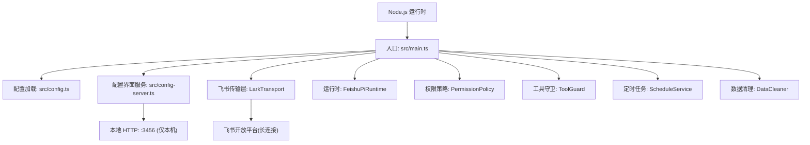
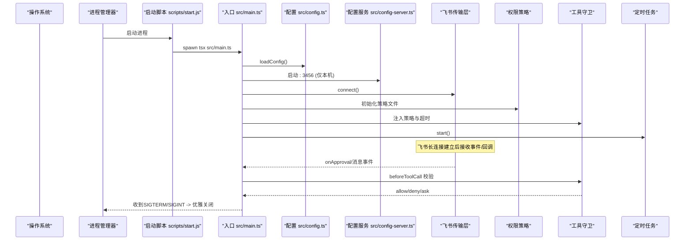
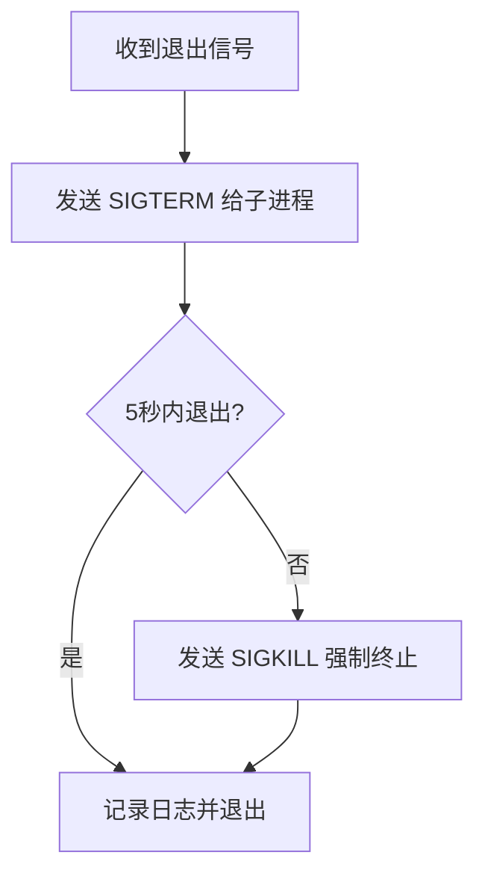
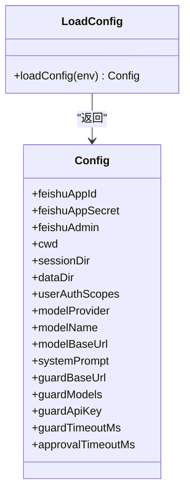
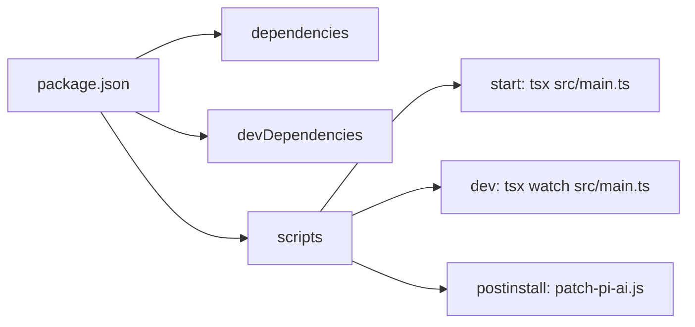

# 环境部署

<cite>
**本文引用的文件**
- [package.json](file://package.json)
- [README.md](file://README.md)
- [src/config.ts](file://src/config.ts)
- [src/config-server.ts](file://src/config-server.ts)
- [src/main.ts](file://src/main.ts)
- [scripts/start.js](file://scripts/start.js)
- [scripts/patch-pi-ai.js](file://scripts/patch-pi-ai.js)
- [.env.example](file://.env.example)
- [.agent/permissions.json](file://.agent/permissions.json)
- [tsconfig.json](file://tsconfig.json)
</cite>

## 更新摘要
**已进行的更改**
- 新增用户认证相关的环境变量配置（FEISHU_USER_AUTH_SCOPES）
- 新增 dataDir 配置选项定义非会话数据的根目录
- 移除 FEISHU_CMD_WHITELIST 环境变量，推荐使用 .agent/permissions.json 文件进行权限配置
- 更新环境变量说明和配置模板
- 增强权限管理章节内容

## 目录
1. [简介](#简介)
2. [项目结构](#项目结构)
3. [核心组件](#核心组件)
4. [架构总览](#架构总览)
5. [详细组件分析](#详细组件分析)
6. [依赖关系分析](#依赖关系分析)
7. [性能与资源建议](#性能与资源建议)
8. [故障排查指南](#故障排查指南)
9. [结论](#结论)
10. [附录：环境变量、模板与检查清单](#附录环境变量模板与检查清单)

## 简介
本指南面向运维与开发人员，提供从开发到生产的完整部署说明。内容涵盖 Node.js 版本要求、依赖安装、环境变量配置、启动脚本与进程管理、容器化与编排（Docker/Kubernetes）实践、不同操作系统差异处理、常见问题定位与解决，以及可复用的检查清单与环境模板。

## 项目结构
本项目为基于飞书生态的 Agent 应用，采用 TypeScript + ESM 模块，使用 tsx 直接运行源码；内置轻量配置页面服务用于在线编辑 .env；通过长连接接入飞书事件与卡片回调；具备会话持久化、权限策略、工具调用守卫、定时任务与技能使用统计等能力。

图表来源
- [src/main.ts:27-247](file://src/main.ts#L27-L247)
- [src/config.ts:24-50](file://src/config.ts#L24-L50)
- [src/config-server.ts:12-149](file://src/config-server.ts#L12-L149)

章节来源
- [package.json:1-34](file://package.json#L1-L34)
- [README.md:120-250](file://README.md#L120-L250)

## 核心组件
- 配置加载器：集中解析环境变量，定义必填项与默认值，并输出结构化配置对象。
- 启动主流程：初始化数据清理、飞书客户端、管理员解析、传输层、权限策略、工具守卫、调度服务、会话管理与桥接，最后建立长连接并监听退出信号。
- 配置界面服务：提供 Web 表单读写 .env，同时暴露 /stats 统计页面。
- 启动脚本：以子进程方式拉起 tsx 执行入口，统一处理 SIGINT/SIGTERM 优雅退出与 Windows 兼容。
- 依赖补丁：postinstall 自动修补第三方包请求头，避免中转站 403。

章节来源
- [src/config.ts:24-50](file://src/config.ts#L24-L50)
- [src/main.ts:27-286](file://src/main.ts#L27-L286)
- [src/config-server.ts:12-149](file://src/config-server.ts#L12-L149)
- [scripts/start.js:1-77](file://scripts/start.js#L1-L77)
- [scripts/patch-pi-ai.js:1-36](file://scripts/patch-pi-ai.js#L1-L36)
- [package.json:6-12](file://package.json#L6-L12)

## 架构总览
下图展示从进程启动到飞书消息处理的端到端流程，包括配置加载、数据清理、权限与守卫、传输层连接与回调处理、配置页面与统计接口。

图表来源
- [scripts/start.js:1-77](file://scripts/start.js#L1-L77)
- [src/main.ts:27-286](file://src/main.ts#L27-L286)
- [src/config.ts:24-50](file://src/config.ts#L24-L50)
- [src/config-server.ts:12-149](file://src/config-server.ts#L12-L149)

## 详细组件分析

### 启动与进程管理
- 启动命令：npm start 会执行 tsx src/main.ts；开发模式 npm run dev 使用 watch 热重载。
- 启动脚本：scripts/start.js 通过 child_process.spawn 拉起 tsx，捕获 SIGINT/SIGTERM，先发送 SIGTERM 给子进程，等待最多 5 秒，未退出则 SIGKILL 强制终止；Windows 额外处理 Ctrl+C。
- 主进程优雅退出：main.ts 在收到信号时停止定时器与调度服务，异步断开飞书连接，给予短宽限期后 process.exit(0)。

图表来源
- [scripts/start.js:16-54](file://scripts/start.js#L16-L54)
- [src/main.ts:252-282](file://src/main.ts#L252-L282)

章节来源
- [package.json:6-12](file://package.json#L6-L12)
- [scripts/start.js:1-77](file://scripts/start.js#L1-L77)
- [src/main.ts:252-282](file://src/main.ts#L252-L282)

### 配置加载与环境变量

**更新** 新增了用户认证相关的环境变量配置和数据目录管理功能

- 必填项：FEISHU_APP_ID、FEISHU_APP_SECRET；缺失将抛出错误阻止启动。
- 可选项：FEISHU_ADMIN、模型相关（Provider/Name/BaseURL/API Key）、系统提示词、审核网关（OpenAI 兼容）、授权卡超时等。
- **新增功能**：
  - `FEISHU_USER_AUTH_SCOPES`：用户身份授权 scope（Device Flow），支持逗号或空格分隔的多个 scope，默认为 ["contact:user.base:readonly", "contact:department.base:readonly"]
  - `dataDir`：数据根目录（data/），存放用户 token 等非会话数据，默认值为 `${process.cwd()}/data`
- 工作目录与数据路径：cwd 默认进程工作目录；会话目录固定为 data/sessions。
- 配置界面：HTTP 服务仅监听 127.0.0.1:3456，提供 / 与 /api/config 读取/保存 .env，/stats 统计页面。

图表来源
- [src/config.ts:1-72](file://src/config.ts#L1-L72)

章节来源
- [src/config.ts:31-72](file://src/config.ts#L31-L72)
- [src/config-server.ts:12-149](file://src/config-server.ts#L12-L149)
- [.env.example:1-24](file://.env.example#L1-L24)

### 依赖补丁与安装
- postinstall：自动对 @earendil-works/pi-ai 的 anthropic-messages 请求头进行补丁，移除导致中转站 403 的头；升级依赖后重新安装会自动再次应用。
- 类型与构建：TypeScript 目标 ES2022，ESM 模块；测试使用 vitest。

章节来源
- [scripts/patch-pi-ai.js:1-36](file://scripts/patch-pi-ai.js#L1-L36)
- [package.json:6-12](file://package.json#L6-L12)
- [tsconfig.json:1-19](file://tsconfig.json#L1-L19)

### 数据清理与定时任务
- 启动时清理：清理卡住的消息与过期数据（会话、图片、消息），保留 7 天。
- 定期清理：每 24 小时执行一次。
- 定时任务：持久化 schedules.json，按 cron 触发并以创建者身份执行智能体，结果推送至对应会话。
- **数据存储**：使用新的 dataDir 配置统一管理非会话数据，包括用户令牌、技能使用统计、定时任务等。

章节来源
- [src/main.ts:31-59](file://src/main.ts#L31-L59)
- [src/main.ts:179-209](file://src/main.ts#L179-L209)
- [src/main.ts:194-204](file://src/main.ts#L194-L204)

### 权限策略与工具守卫

**更新** 权限管理已迁移到配置文件方式，移除了环境变量白名单

- 策略文件：`.agent/permissions.json` 控制工具、bash、读写路径与技能可见性。
- **废弃功能**：`FEISHU_CMD_WHITELIST` 环境变量已废弃，启动时会显示弃用警告，规则统一迁移到 `.agent/permissions.json` 的 `permissions.allow`。
- 工具守卫：beforeToolCall 钩子实现白名单放行、自定义工具快速通道、非允许即 ask（弹授权卡）。
- 授权卡：支持转发管理员私聊、一次性 token 校验、参数脱敏、结果卡更新。
- **用户认证**：支持 Device Flow 授权，通过 `/login` 指令完成用户身份验证，scope 可通过 `FEISHU_USER_AUTH_SCOPES` 自定义。

章节来源
- [src/main.ts:106-169](file://src/main.ts#L106-L169)
- [src/guard/card.ts:64-101](file://src/guard/card.ts#L64-L101)
- [src/main.ts:135-137](file://src/main.ts#L135-L137)
- [.agent/permissions.json:1-35](file://.agent/permissions.json#L1-L35)

## 依赖关系分析
- 运行时依赖：@larksuiteoapi/node-sdk、express、body-parser、croner、dotenv 等。
- 开发依赖：tsx、typescript、vitest、vite、@types/*。
- 入口与脚本：package.json scripts 定义 start/dev/config/check/test/postinstall。

图表来源
- [package.json:1-34](file://package.json#L1-L34)

章节来源
- [package.json:1-34](file://package.json#L1-L34)

## 性能与资源建议
- Node.js 版本：建议使用 Node.js 22+（类型定义基于 @types/node 22.x）。
- 内存与 CPU：Agent 流式推理与卡片渲染对 CPU/内存有一定需求，生产建议至少 2C4G 起步，根据并发与模型调用频率调整。
- 磁盘：会话与图片缓存位于 data/sessions，注意定期清理与扩容；技能使用统计独立追加文件长期留存；用户令牌存储于 data/user-tokens.json。
- 网络：需稳定访问飞书开放平台与模型 API；如经中转站，确保补丁生效。
- 进程管理：推荐使用 systemd/pm2/docker 等进程管理器，配合健康检查与自动重启。

[本节为通用指导，不直接分析具体文件]

## 故障排查指南
- 启动失败（缺少必填环境变量）：检查 FEISHU_APP_ID、FEISHU_APP_SECRET 是否已设置。
- 飞书连接异常：确认应用权限、事件订阅与长连接模式；查看日志中获取 Bot Open ID 的步骤。
- 管理员无法识别：FEISHU_ADMIN 支持 open_id、中文名、英文名、邮箱，启动时会尝试解析。
- **权限问题**：检查 `.agent/permissions.json` 配置是否正确；确认 `FEISHU_CMD_WHITELIST` 已迁移到配置文件。
- **用户认证问题**：确认 `FEISHU_USER_AUTH_SCOPES` 配置正确；检查飞书应用是否开通了相应的 scope 权限。
- 工具调用被拦截：检查 `.agent/permissions.json` 与白名单规则；必要时开启授权卡流程。
- 授权卡无效或失效：确认回调 token 校验与服务状态；若服务重启，旧卡会提示失效。
- 配置页面不可用：确认仅监听 127.0.0.1:3456，不要暴露到公网；浏览器访问 http://localhost:3456。
- Windows 下退出卡顿：启动脚本已处理 SIGINT/SIGTERM；如遇挂起，检查是否有残留子进程。

章节来源
- [src/config.ts:31-72](file://src/config.ts#L31-L72)
- [src/main.ts:61-88](file://src/main.ts#L61-L88)
- [src/main.ts:106-169](file://src/main.ts#L106-L169)
- [src/main.ts:135-137](file://src/main.ts#L135-L137)
- [src/config-server.ts:145-149](file://src/config-server.ts#L145-L149)
- [scripts/start.js:56-77](file://scripts/start.js#L56-L77)

## 结论
本项目提供了开箱即用的飞书 Agent 后端，具备完善的配置管理、权限控制、工具守卫与数据生命周期管理能力。通过本文档的环境搭建、进程管理、容器化与编排建议，可在开发与生产环境中稳定部署与运维。

[本节为总结，不直接分析具体文件]

## 附录：环境变量、模板与检查清单

### 环境变量说明

**更新** 新增用户认证相关环境变量，移除废弃的环境变量

#### 必需环境变量
- `FEISHU_APP_ID`：飞书应用 App ID
- `FEISHU_APP_SECRET`：飞书应用 App Secret

#### 可选环境变量
- `FEISHU_ADMIN`：管理员标识（open_id/中文名/英文名/邮箱）
- `FEISHU_PI_CWD`：Agent 文件工具的工作目录（留空表示项目根）
- `FEISHU_PI_MODEL_PROVIDER` / `FEISHU_PI_MODEL_NAME` / `FEISHU_PI_MODEL_BASE_URL` / `FEISHU_PI_MODEL_API_KEY`：模型与密钥
- `FEISHU_PI_SYSTEM_PROMPT`：系统提示词
- `FEISHU_APPROVAL_TIMEOUT_MS`：授权卡等待超时（毫秒）
- `FEISHU_GUARD_BASE_URL` / `FEISHU_GUARD_MODELS` / `FEISHU_GUARD_API_KEY` / `FEISHU_GUARD_TIMEOUT_MS`：智能体审核（OpenAI 兼容）
- `FEISHU_GROUP_<NAME>`：组成员归属关系（如 `FEISHU_GROUP_ADMIN=成员1,成员2`）

#### 新增环境变量
- `FEISHU_USER_AUTH_SCOPES`：用户身份授权 scope（Device Flow），支持逗号或空格分隔的多个 scope，默认为 `contact:user.base:readonly,contact:department.base:readonly`

#### 已废弃环境变量
- `FEISHU_CMD_WHITELIST`：已废弃，规则迁移至 `.agent/permissions.json`

章节来源
- [.env.example:1-24](file://.env.example#L1-L24)
- [src/config.ts:31-72](file://src/config.ts#L31-L72)

### 配置文件模板
- 复制 `.env.example` 为 `.env`，按需填写必填项与可选项。
- 可通过 http://localhost:3456 在线编辑 .env，保存后重启服务生效。
- 权限配置：使用 `.agent/permissions.json` 文件进行细粒度权限控制。

章节来源
- [src/config-server.ts:94-120](file://src/config-server.ts#L94-L120)
- [.env.example:1-24](file://.env.example#L1-L24)
- [.agent/permissions.json:1-35](file://.agent/permissions.json#L1-L35)

### 部署检查清单

**更新** 添加了用户认证和权限配置的检查项

#### 环境与依赖
- Node.js 版本 >= 22
- npm install 成功且 postinstall 补丁生效

#### 飞书应用
- 权限与事件订阅已配置（im:message、im:message.group_at_msg、im:message.p2p_msg、im:message.reaction:write、contact:user.base:readonly、im:chat.member:readonly；可选 im:resource）
- 长连接模式启用
- 如需用户认证，确保在开发者后台开通相应的 scope 权限

#### 环境变量
- FEISHU_APP_ID、FEISHU_APP_SECRET 已设置
- 模型与 API Key 已配置
- 管理员 FEISHU_ADMIN 已配置（可选）
- 用户认证 scope 已配置（可选，使用默认值即可）

#### 权限配置
- `.agent/permissions.json` 文件配置正确
- 组成员关系通过 FEISHU_GROUP_* 环境变量配置（可选）
- 确认 FEISHU_CMD_WHITELIST 已迁移到配置文件

#### 启动与验证
- npm start 启动成功
- 配置页面 http://localhost:3456 可访问
- 飞书机器人能收发消息与卡片
- 用户认证功能正常（如启用）

#### 进程管理
- 使用进程管理器托管（systemd/pm2/Docker）
- 配置自动重启与健康检查

#### 安全与合规
- 配置页面仅监听 127.0.0.1
- 敏感信息不入仓，使用环境变量或密钥管理服务
- 定期备份 data 目录

[本节为通用清单，不直接分析具体文件]

### Docker 容器化部署（参考步骤）
- 基础镜像：选择 node:22-slim 或官方 LTS 镜像。
- 安装依赖：npm ci --omit=dev 或 npm install（生产环境无需 dev 依赖）。
- 拷贝代码与 .env：将源码与 .env 复制到镜像。
- 启动命令：node scripts/start.js 或 npx tsx src/main.ts（推荐前者以获得统一退出逻辑）。
- 端口：如需暴露配置页面，仅在内网或反向代理后暴露 3456，并确保绑定 127.0.0.1。
- 数据持久化：挂载 data 目录以持久化会话、图片、用户令牌与统计文件。
- 健康检查：通过 curl 127.0.0.1:3456 或业务探针判断就绪。

[本节为概念性指引，不直接映射具体文件]

### Kubernetes 编排部署（参考要点）
- Deployment：副本数按负载设定；资源限制 requests/limits 合理分配。
- ConfigMap/Secret：将 .env 中的敏感项放入 Secret，非敏感项放入 ConfigMap，再挂载为环境变量或文件。
- 存储：使用 PersistentVolume 挂载 data 目录，避免数据丢失。
- 服务暴露：如需外部访问配置页面，使用 Ingress/Service 并限制来源 IP。
- 健康检查：readinessProbe/livenessProbe 指向 / 或业务探针。
- 滚动更新：设置 maxUnavailable/maxSurge，保证零停机发布。

[本节为概念性指引，不直接映射具体文件]

### 不同操作系统差异处理
- Linux/macOS：直接使用 npm start 或进程管理器；信号 SIGINT/SIGTERM 由脚本与主进程共同处理。
- Windows：启动脚本已处理 Ctrl+C；如遇 WebSocket 断开导致退出延迟，主进程会在宽限期内强制退出。
- 路径分隔符：项目使用 Node path 模块处理跨平台路径，无需手动修改。

章节来源
- [scripts/start.js:66-77](file://scripts/start.js#L66-L77)
- [src/main.ts:279-282](file://src/main.ts#L279-L282)