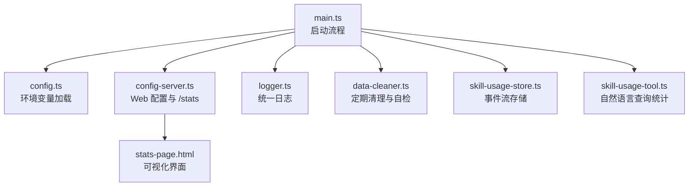
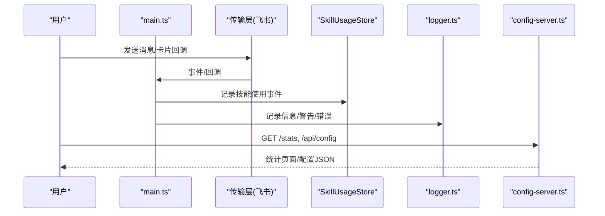
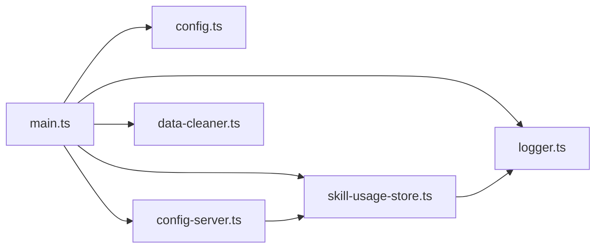

# 监控告警

<cite>
**本文引用的文件**
- [src/main.ts](file://src/main.ts)
- [src/config-server.ts](file://src/config-server.ts)
- [src/config.ts](file://src/config.ts)
- [src/utils/logger.ts](file://src/utils/logger.ts)
- [src/stats/skill-usage-store.ts](file://src/stats/skill-usage-store.ts)
- [src/stats/skill-usage-tool.ts](file://src/stats/skill-usage-tool.ts)
- [src/runtime/data-cleaner.ts](file://src/runtime/data-cleaner.ts)
- [package.json](file://package.json)
- [README.md](file://README.md)
</cite>

## 目录
1. [简介](#简介)
2. [项目结构](#项目结构)
3. [核心组件](#核心组件)
4. [架构总览](#架构总览)
5. [详细组件分析](#详细组件分析)
6. [依赖关系分析](#依赖关系分析)
7. [性能考量](#性能考量)
8. [故障排查指南](#故障排查指南)
9. [结论](#结论)
10. [附录](#附录)

## 简介
本指南面向运维团队，提供基于当前代码库的“监控告警配置方案”。内容覆盖：
- 日志收集策略与结构化输出
- 性能指标监控（服务健康、清理任务、外部调用）
- 业务指标统计（技能使用量、用户活跃度、最近使用时间等）
- 关键指标的采集方法与阈值建议
- 告警规则、通知渠道集成与升级机制
- Prometheus 指标导出、Grafana 仪表板配置思路与自定义脚本
- 日志分析工具使用与性能调优建议

说明：仓库未内置 Prometheus/Grafana/Alertmanager 集成。本指南在现有能力基础上给出可落地的扩展方案与最佳实践。

## 项目结构
与监控告警直接相关的模块包括：
- 启动与生命周期：main.ts
- 本地配置与统计页面：config-server.ts
- 配置加载与环境变量：config.ts
- 日志工具：logger.ts
- 技能使用统计存储与查询：skill-usage-store.ts、skill-usage-tool.ts
- 数据清理与健康自检：data-cleaner.ts
- 运行脚本与依赖：package.json、README.md

图表来源
- [src/main.ts:27-247](file://src/main.ts#L27-L247)
- [src/config-server.ts:12-149](file://src/config-server.ts#L12-L149)
- [src/config.ts:25-50](file://src/config.ts#L25-L50)
- [src/utils/logger.ts:24-39](file://src/utils/logger.ts#L24-L39)
- [src/runtime/data-cleaner.ts:30-67](file://src/runtime/data-cleaner.ts#L30-L67)
- [src/stats/skill-usage-store.ts:67-157](file://src/stats/skill-usage-store.ts#L67-L157)
- [src/stats/skill-usage-tool.ts:46-99](file://src/stats/skill-usage-tool.ts#L46-L99)

章节来源
- [src/main.ts:27-247](file://src/main.ts#L27-L247)
- [src/config-server.ts:12-149](file://src/config-server.ts#L12-L149)
- [src/config.ts:25-50](file://src/config.ts#L25-L50)
- [src/utils/logger.ts:24-39](file://src/utils/logger.ts#L24-L39)
- [src/runtime/data-cleaner.ts:30-67](file://src/runtime/data-cleaner.ts#L30-L67)
- [src/stats/skill-usage-store.ts:67-157](file://src/stats/skill-usage-store.ts#L67-L157)
- [src/stats/skill-usage-tool.ts:46-99](file://src/stats/skill-usage-tool.ts#L46-L99)

## 核心组件
- 日志系统：统一时间戳与级别输出，便于集中采集与检索。
- 配置服务器：提供 /api/config 读写 .env；提供 /stats 展示技能使用统计。
- 技能使用统计：独立 JSONL 事件流，长期留存，支持前端聚合与排行。
- 数据清理：会话、图片、消息状态按保留期清理，并具备卡住消息自愈。
- 启动流程：初始化清理器、传输层、权限策略、调度服务、统计路由等。

章节来源
- [src/utils/logger.ts:24-39](file://src/utils/logger.ts#L24-L39)
- [src/config-server.ts:94-149](file://src/config-server.ts#L94-L149)
- [src/stats/skill-usage-store.ts:67-157](file://src/stats/skill-usage-store.ts#L67-L157)
- [src/runtime/data-cleaner.ts:30-67](file://src/runtime/data-cleaner.ts#L30-L67)
- [src/main.ts:27-247](file://src/main.ts#L27-L247)

## 架构总览
下图展示了从请求到统计、清理、日志的全链路，以及对外暴露的 Web 接口。

图表来源
- [src/main.ts:27-247](file://src/main.ts#L27-L247)
- [src/stats/skill-usage-store.ts:84-102](file://src/stats/skill-usage-store.ts#L84-L102)
- [src/config-server.ts:94-149](file://src/config-server.ts#L94-L149)
- [src/utils/logger.ts:24-39](file://src/utils/logger.ts#L24-L39)

## 详细组件分析

### 日志收集策略
- 统一日志入口：所有日志通过 logger 输出，包含时间戳与级别（info/warn/error/log），便于日志采集器抓取。
- 建议采集方式：
  - 容器化部署：将 stdout/stderr 接入日志平台（如 ELK/Loki）。
  - 单机部署：使用日志轮转工具（如 logrotate）或进程管理器（systemd/journald）收集。
- 结构化建议：在关键路径增加结构化字段（如 chatId、userOpenId、skill、toolName），便于后续过滤与关联。
- 敏感信息：避免在日志中打印密钥、令牌等敏感字段。

章节来源
- [src/utils/logger.ts:24-39](file://src/utils/logger.ts#L24-L39)
- [src/main.ts:38-59](file://src/main.ts#L38-L59)

### 性能指标监控
- 服务健康：
  - 进程存活：通过进程管理或探针检查端口 3456 是否监听。
  - 连接健康：关注飞书长连接断开重连日志。
- 资源与任务：
  - 数据清理任务：每日执行一次，关注清理统计（会话/图片/消息删除数）。
  - 定时任务：调度服务启动与停止日志。
- 外部调用：
  - 模型/审核接口超时与失败率（guardTimeoutMs、approvalTimeoutMs）。
- 指标采集建议：
  - 应用内埋点：在关键路径记录耗时、成功/失败计数（可通过 logger 输出结构化日志，由采集器解析为指标）。
  - 操作系统级指标：CPU、内存、磁盘、网络（由宿主或编排平台采集）。

章节来源
- [src/config.ts:44-48](file://src/config.ts#L44-L48)
- [src/main.ts:50-59](file://src/main.ts#L50-L59)
- [src/main.ts:179-209](file://src/main.ts#L179-L209)
- [src/runtime/data-cleaner.ts:44-67](file://src/runtime/data-cleaner.ts#L44-L67)

### 业务指标统计（技能使用）
- 数据来源：每次读取技能文件时写入独立事件流（data/stats/skill-usage.jsonl），只增不删。
- 维度：用户、技能、时间、会话（可选）。
- 查询方式：
  - 飞书内自然语言查询：调用 query_skill_usage 工具返回概要与排行。
  - 本地可视化：/stats 页面支持按日/月/年分组、用户筛选、技能隐藏、排行与明细表。
- 指标示例：
  - 累计使用次数、活跃用户数、涉及技能数、最近使用时间。
  - 技能排行、用户排行、月度×用户×技能明细。

章节来源
- [src/stats/skill-usage-store.ts:67-157](file://src/stats/skill-usage-store.ts#L67-L157)
- [src/stats/skill-usage-tool.ts:46-99](file://src/stats/skill-usage-tool.ts#L46-L99)
- [src/config-server.ts:127-143](file://src/config-server.ts#L127-L143)
- [README.md:594-613](file://README.md#L594-L613)

### 关键指标采集方法与阈值建议
- 日志相关
  - 错误日志速率：warn/error 数量突增需告警。
  - 清理失败：DataCleaner 报错应触发告警。
- 任务相关
  - 清理任务成功率与耗时：超过基线需告警。
  - 定时任务执行失败：立即告警。
- 外部调用
  - 审核/模型接口超时：超过 guardTimeoutMs 视为异常。
  - 授权卡处理失败：审批回调拒绝或失效需告警。
- 阈值建议（可按实际基线调整）
  - 错误日志：每分钟 > N 条持续 5 分钟。
  - 清理失败：任意失败即告警。
  - 外部调用超时：连续 3 次失败或平均耗时 > 阈值。
  - 授权卡失败：连续失败或比例 > 阈值。

章节来源
- [src/runtime/data-cleaner.ts:87-124](file://src/runtime/data-cleaner.ts#L87-L124)
- [src/config.ts:44-48](file://src/config.ts#L44-L48)
- [src/main.ts:135-169](file://src/main.ts#L135-L169)

### 告警规则配置
- 规则类型
  - 日志类：错误日志速率、清理失败、回调失败。
  - 指标类：外部调用超时、清理任务耗时、服务不可用。
  - 业务类：技能使用量骤降、长时间无活跃用户。
- 规则示例（概念性）
  - 错误日志速率 > 阈值 × 持续时间 → P1/P2 告警。
  - 清理任务失败 → P1 告警。
  - 外部调用超时比例 > 阈值 → P2 告警。
  - 服务端口不可达 → P1 告警。
- 通知渠道
  - 飞书群机器人：通过 HTTP 回调发送告警消息。
  - 邮件/短信：用于严重告警升级。
- 升级机制
  - 一级：自动恢复后关闭。
  - 二级：重复触发升级至更高优先级。
  - 三级：长时间未恢复升级至电话/值班群。

[本节为通用告警设计，不直接分析具体文件]

### 通知渠道集成
- 飞书群机器人：
  - 创建机器人并获取 Webhook URL。
  - 在告警系统中配置该 Webhook，发送 Markdown 文本。
- 其他渠道：
  - 邮件：SMTP 配置。
  - 短信：短信网关 API。
- 注意事项：
  - 控制告警风暴：去重、静默窗口、抑制规则。
  - 敏感信息脱敏：不在告警中暴露密钥。

[本节为通用集成指导，不直接分析具体文件]

### Prometheus 指标导出
- 现状：仓库未内置 Prometheus 客户端。
- 推荐实现：
  - 引入 Prometheus 客户端库，定义计数器、直方图、仪表盘指标。
  - 暴露 /metrics 端点供 Prometheus 抓取。
  - 指标建议：
    - 请求计数：http_requests_total（按方法、路径、状态码）。
    - 外部调用：external_call_duration_seconds、external_call_errors_total。
    - 清理任务：cleanup_duration_seconds、cleanup_items_processed_total。
    - 业务指标：skill_usage_events_total（按 skill、user）。
- 安全：仅在内网或反向代理后暴露 /metrics。

[本节为扩展建议，不直接分析具体文件]

### Grafana 仪表板配置
- 数据源：Prometheus。
- 仪表板建议：
  - 服务健康：端口可达、错误率、超时率。
  - 任务健康：清理任务耗时与结果。
  - 业务看板：技能使用趋势、Top 技能/用户、近 7 天活跃。
- 联动：与告警系统集成，点击指标跳转告警详情。

[本节为通用配置指导，不直接分析具体文件]

### 自定义监控脚本
- 健康检查脚本：
  - 检查端口 3456 是否监听。
  - 访问 /api/config 验证配置可读。
  - 访问 /stats 验证统计页面可用。
- 指标采集脚本：
  - 解析日志中的关键事件（错误、清理结果、回调失败）并上报。
- 自动化：
  - 通过 cron/systemd timer 周期性执行。
  - 结果写入文件或推送至监控系统。

[本节为通用脚本建议，不直接分析具体文件]

### 日志分析工具使用指南
- 日志位置：stdout/stderr（容器）或本地日志文件。
- 常用操作：
  - 过滤错误：grep error。
  - 统计错误速率：awk 统计每分钟错误数。
  - 关联会话：按 chatId/userOpenId 过滤。
- 建议：
  - 在关键路径增加结构化字段，便于查询。
  - 对高频日志进行采样或降级。

章节来源
- [src/utils/logger.ts:24-39](file://src/utils/logger.ts#L24-L39)
- [src/main.ts:38-59](file://src/main.ts#L38-L59)

### 性能调优建议
- 日志优化：
  - 减少高频 INFO 日志，保留关键路径。
  - 使用结构化日志，便于采集器高效解析。
- 任务优化：
  - 清理任务频率与保留期可调（默认 7 天）。
  - 大文件/大量图片场景考虑分片与异步。
- 外部调用：
  - 合理设置超时与重试策略。
  - 缓存热点数据（如用户信息）。
- 资源限制：
  - 根据负载调整 Node.js 堆大小与线程池。
  - 监控磁盘空间，避免日志/缓存占满。

章节来源
- [src/config.ts:44-48](file://src/config.ts#L44-L48)
- [src/runtime/data-cleaner.ts:30-67](file://src/runtime/data-cleaner.ts#L30-L67)

## 依赖关系分析
- main.ts 作为入口，依赖配置、传输层、权限策略、调度服务、统计存储与日志。
- config-server.ts 提供 Web 接口，依赖日志与统计存储。
- skill-usage-store.ts 提供事件流存储与用户展示名解析。
- data-cleaner.ts 提供数据清理与自检能力。
- package.json 定义了运行脚本与依赖。

图表来源
- [src/main.ts:27-247](file://src/main.ts#L27-L247)
- [src/config-server.ts:12-149](file://src/config-server.ts#L12-L149)
- [src/stats/skill-usage-store.ts:67-157](file://src/stats/skill-usage-store.ts#L67-L157)
- [src/runtime/data-cleaner.ts:30-67](file://src/runtime/data-cleaner.ts#L30-L67)
- [src/config.ts:25-50](file://src/config.ts#L25-L50)

章节来源
- [src/main.ts:27-247](file://src/main.ts#L27-L247)
- [src/config-server.ts:12-149](file://src/config-server.ts#L12-L149)
- [src/stats/skill-usage-store.ts:67-157](file://src/stats/skill-usage-store.ts#L67-L157)
- [src/runtime/data-cleaner.ts:30-67](file://src/runtime/data-cleaner.ts#L30-L67)
- [src/config.ts:25-50](file://src/config.ts#L25-L50)

## 性能考量
- 日志吞吐：高并发下注意日志落盘与采集效率，必要时采用异步或批量写入。
- 统计文件：JSONL 追加写具备串行队列，避免竞争；大文件读取时注意内存占用。
- 清理任务：定期执行，避免阻塞主流程；失败需重试与告警。
- 外部调用：超时与重试策略影响整体延迟与稳定性。

章节来源
- [src/stats/skill-usage-store.ts:84-96](file://src/stats/skill-usage-store.ts#L84-L96)
- [src/runtime/data-cleaner.ts:44-67](file://src/runtime/data-cleaner.ts#L44-L67)
- [src/config.ts:44-48](file://src/config.ts#L44-L48)

## 故障排查指南
- 常见问题
  - 配置读取失败：检查 .env 是否存在且格式正确。
  - 统计页面不可用：确认 /stats 与 /api/config 可访问。
  - 清理任务失败：查看 DataCleaner 错误日志。
  - 外部调用超时：检查 guardTimeoutMs、approvalTimeoutMs 及网络连通性。
- 定位步骤
  - 查看日志：grep error/warn，结合 chatId/userOpenId 过滤。
  - 检查文件：data/stats/skill-usage.jsonl 是否存在且可写。
  - 验证接口：curl 访问 /api/config 与 /stats。
- 恢复措施
  - 修复配置后重启服务。
  - 清理卡住消息或过期数据。
  - 调整超时与重试参数。

章节来源
- [src/config-server.ts:94-149](file://src/config-server.ts#L94-L149)
- [src/runtime/data-cleaner.ts:87-184](file://src/runtime/data-cleaner.ts#L87-L184)
- [src/config.ts:25-50](file://src/config.ts#L25-L50)

## 结论
本指南基于现有代码库提供了完整的监控告警落地方案：以统一日志为基础，结合技能使用统计与数据清理任务，构建可观测体系；通过告警规则与通知渠道实现问题早发现早处置；借助 Prometheus/Grafana 扩展实现指标可视化与告警联动。建议逐步引入指标导出与可视化，完善告警策略与升级机制，持续提升系统稳定性与可维护性。

## 附录
- 启动与脚本：package.json 提供 start/dev/test 等命令。
- 文档参考：README.md 包含功能说明与使用指南。

章节来源
- [package.json:6-12](file://package.json#L6-L12)
- [README.md:120-240](file://README.md#L120-L240)